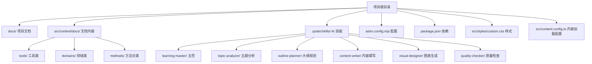
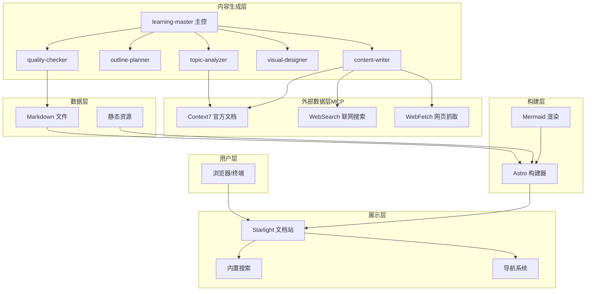
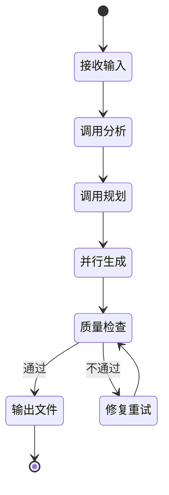
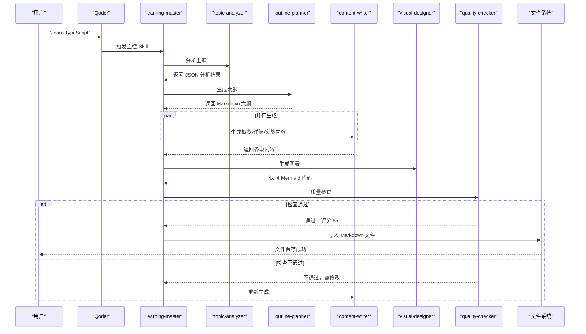
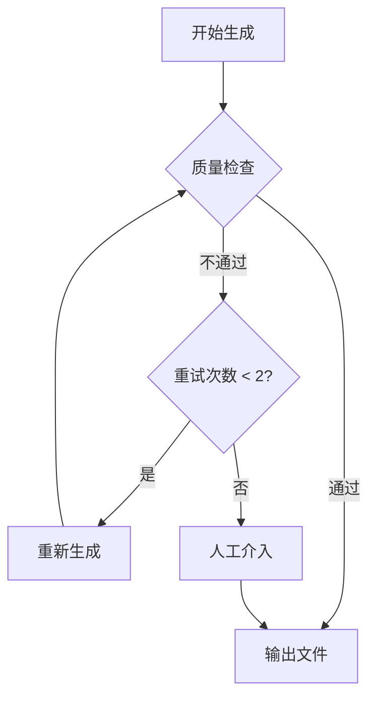

# AI 内容生成系统

<cite>
**本文引用的文件**
- [package.json](file://package.json)
- [astro.config.mjs](file://astro.config.mjs)
- [src/content.config.ts](file://src/content.config.ts)
- [src/styles/custom.css](file://src/styles/custom.css)
- [docs/01-PROJECT-BRIEF.md](file://docs/01-PROJECT-BRIEF.md)
- [docs/03-ARCHITECTURE.md](file://docs/03-ARCHITECTURE.md)
- [docs/04-AI-SKILL-SPEC.md](file://docs/04-AI-SKILL-SPEC.md)
- [src/content/docs/tools/ai-coding/index.md](file://src/content/docs/tools/ai-coding/index.md)
- [src/content/docs/domains/frontend/index.md](file://src/content/docs/domains/frontend/index.md)
- [src/content/docs/methods/learning/index.md](file://src/content/docs/methods/learning/index.md)
</cite>

## 目录
1. [引言](#引言)
2. [项目结构](#项目结构)
3. [核心组件](#核心组件)
4. [架构总览](#架构总览)
5. [详细组件分析](#详细组件分析)
6. [依赖分析](#依赖分析)
7. [性能考虑](#性能考虑)
8. [故障排除指南](#故障排除指南)
9. [结论](#结论)
10. [附录](#附录)

## 引言
本文件面向 StudyBuddy AI 内容生成系统，系统以“管理者视角”为核心理念，围绕 Qoder Skills 工具链与 MCP 协议，构建多代理协作的 AI 内容生成工作流。该工作流涵盖主题分析、大纲规划、内容撰写、图表生成与质量检查等环节，最终输出结构化的 Markdown 文档，并通过 Astro + Starlight + Mermaid 渲染为静态站点，便于本地使用与快速检索。

## 项目结构
项目采用 Astro 静态站点 + Starlight 文档主题 + Mermaid 图表的组合，文档内容以 Markdown 形式组织，位于 src/content/docs 下，分为 tools、domains、methods 三大分类；Qoder AI 技能位于 .qoder/skills 下，配合学习主控 skill 进行编排。

**图表来源**
- [astro.config.mjs](file://astro.config.mjs#L1-L34)
- [src/content.config.ts](file://src/content.config.ts#L1-L8)
- [docs/03-ARCHITECTURE.md](file://docs/03-ARCHITECTURE.md#L164-L221)

**章节来源**
- [astro.config.mjs](file://astro.config.mjs#L1-L34)
- [src/content.config.ts](file://src/content.config.ts#L1-L8)
- [docs/03-ARCHITECTURE.md](file://docs/03-ARCHITECTURE.md#L164-L221)

## 核心组件
- 学习主控 skill（learning-master）：负责接收用户输入，协调各子 skill 的调用顺序与并行执行，控制生成流程与质量检查。
- 主题分析 skill（topic-analyzer）：对用户输入的主题进行结构化解析，输出主题元数据（slug、复杂度、前置知识、建议图表类型等）。
- 大纲规划 skill（outline-planner）：基于分析结果生成符合“概览—详解—实战”三阶段框架的 Markdown 大纲。
- 内容撰写 skill（content-writer）：按段落（概览/详解/实战）生成内容，期间调用 MCP 工具获取最新信息，确保时效性与准确性。
- 图表生成 skill（visual-designer）：根据大纲中的图表标记生成 Mermaid 代码，包括思维导图与流程图。
- 质量检查 skill（quality-checker）：对完整内容进行结构、内容与格式检查，输出评分与改进建议，决定是否进入下一阶段或回退重试。

上述组件职责、输入输出与调用关系详见 AI Skill 规格说明文档。

**章节来源**
- [docs/04-AI-SKILL-SPEC.md](file://docs/04-AI-SKILL-SPEC.md#L75-L85)
- [docs/04-AI-SKILL-SPEC.md](file://docs/04-AI-SKILL-SPEC.md#L149-L203)
- [docs/04-AI-SKILL-SPEC.md](file://docs/04-AI-SKILL-SPEC.md#L206-L278)
- [docs/04-AI-SKILL-SPEC.md](file://docs/04-AI-SKILL-SPEC.md#L281-L387)
- [docs/04-AI-SKILL-SPEC.md](file://docs/04-AI-SKILL-SPEC.md#L390-L532)
- [docs/04-AI-SKILL-SPEC.md](file://docs/04-AI-SKILL-SPEC.md#L535-L606)
- [docs/04-AI-SKILL-SPEC.md](file://docs/04-AI-SKILL-SPEC.md#L609-L716)

## 架构总览
系统采用分层架构：用户层通过 Qoder 触发学习主控 skill；内容生成层由多个 AI skill 协同完成；外部数据层通过 MCP 工具（Context7、WebSearch、WebFetch）提供权威与实时信息；最终由 Astro 构建器渲染为静态站点，Mermaid 负责图表渲染。

**图表来源**
- [docs/03-ARCHITECTURE.md](file://docs/03-ARCHITECTURE.md#L10-L69)

**章节来源**
- [docs/03-ARCHITECTURE.md](file://docs/03-ARCHITECTURE.md#L1-L410)

## 详细组件分析

### 学习主控 skill（learning-master）
- 触发方式：/learn {topic} [--category={cat}] [--level={level}]
- 职责：接收用户输入，协调 topic-analyzer、outline-planner、content-writer、visual-designer、quality-checker 的调用；控制并行生成与质量检查；决定输出或重试。
- 工作流状态图如下：

- 输出：完整的 Markdown 文件，保存至 src/content/docs/{category}/{slug}.md。
- 约束：生成时间控制在 30 秒内；质量检查评分 ≥ 80 分才输出；失败最多重试 2 次。

**图表来源**
- [docs/04-AI-SKILL-SPEC.md](file://docs/04-AI-SKILL-SPEC.md#L159-L173)

**章节来源**
- [docs/04-AI-SKILL-SPEC.md](file://docs/04-AI-SKILL-SPEC.md#L149-L203)

### 主题分析 skill（topic-analyzer）
- 输入：主题字符串（如 “TypeScript”）
- 输出：结构化 JSON，包含主题、slug、一句话定义、解决的问题、使用场景、前置知识、复杂度、预计章节数、核心概念、分类、建议图表类型等。
- 约束：管理者视角，不涉及实现细节；一句话定义要通俗易懂；前置知识要精简。

**章节来源**
- [docs/04-AI-SKILL-SPEC.md](file://docs/04-AI-SKILL-SPEC.md#L206-L278)

### 大纲规划 skill（outline-planner）
- 输入：topic-analyzer 输出的 JSON
- 输出：带 frontmatter 的 Markdown 大纲，包含三阶段结构与图表标记（如 <!-- DIAGRAM: mindmap -->）。
- 约束：概览控制在 5 分钟阅读量；详解每个概念控制在 10 分钟；总时长不超过 90 分钟。

**章节来源**
- [docs/04-AI-SKILL-SPEC.md](file://docs/04-AI-SKILL-SPEC.md#L281-L387)

### 内容撰写 skill（content-writer）
- 分段模式：概览（overview）、详解（details）、实战（practices）
- 约束与要求：
  - 概览：控制在 500 字以内，不涉及代码细节，语言风格专业但易懂。
  - 详解：每个概念控制在 300 字 + 代码，示例代码必须可运行且来自官方文档或经验证，必须标注数据来源。
  - 实战：难度分级（初级/中级/高级），每个练习必须有明确完成标准，代码量递增。
- MCP 调用策略：在生成内容前，必须调用 Context7、WebSearch、WebFetch 获取最新信息，避免仅依赖模型训练数据生成版本号、API 参数、安装/配置命令、官方推荐写法等。

**章节来源**
- [docs/04-AI-SKILL-SPEC.md](file://docs/04-AI-SKILL-SPEC.md#L390-L532)

### 图表生成 skill（visual-designer）
- 输入：大纲 Markdown 与图表标记位置
- 输出：Mermaid 代码块（至少两个图表：思维导图 mindmap、流程图 flowchart）
- 约束：节点文字简洁，避免过深层级，语法正确可直接渲染。

**章节来源**
- [docs/04-AI-SKILL-SPEC.md](file://docs/04-AI-SKILL-SPEC.md#L535-L606)

### 质量检查 skill（quality-checker）
- 输入：完整内容（Markdown + Mermaid）
- 输出：JSON 报告，包含总分、是否通过、分项得分、问题列表与改进建议。
- 检查维度：
  - 结构检查（30 分）：三阶段完整、每概念三要素、难度分级清晰
  - 内容检查（40 分）：定义通俗、类比恰当、示例可运行、速查表实用
  - 格式检查（30 分）：Markdown 语法、表格规范、Mermaid 语法
- 评分标准：≥ 90 优秀，80-89 良好，70-79 一般，< 70 不合格。

**章节来源**
- [docs/04-AI-SKILL-SPEC.md](file://docs/04-AI-SKILL-SPEC.md#L609-L716)

### 数据流与调用序列
- 文档生成流程（从用户触发到文件输出）如下：

**图表来源**
- [docs/03-ARCHITECTURE.md](file://docs/03-ARCHITECTURE.md#L86-L126)

**章节来源**
- [docs/03-ARCHITECTURE.md](file://docs/03-ARCHITECTURE.md#L82-L126)

### 技术栈与集成
- 框架与主题：Astro + Starlight，开箱即用的文档站点，内置搜索与导航。
- 图表：Mermaid 通过 astro.config.mjs 集成，支持 mindmap、flowchart、sequenceDiagram、classDiagram、stateDiagram-v2 等语法。
- 样式：自定义 CSS 覆盖 Accent 色彩与速查表、难度标签样式。
- 内容加载：通过 docsLoader 与 docsSchema 加载 Markdown 文档。

**章节来源**
- [astro.config.mjs](file://astro.config.mjs#L1-L34)
- [src/styles/custom.css](file://src/styles/custom.css#L1-L78)
- [src/content.config.ts](file://src/content.config.ts#L1-L8)
- [docs/03-ARCHITECTURE.md](file://docs/03-ARCHITECTURE.md#L242-L275)

## 依赖分析
- 外部数据依赖（MCP 工具）：
  - Context7：查询官方文档、API 参考，确保时效性与准确性。
  - WebSearch：联网搜索最新资讯、最佳实践。
  - WebFetch：抓取指定网页内容，获取官方教程与示例。
- 依赖调用优先级与策略：
  - Context7 > WebFetch > WebSearch > 模型内置知识
  - 必须联网场景：版本号与发布日期、API 签名与参数、安装/配置命令、官方推荐的最佳实践
  - 可用内置知识场景：概念解释与类比、通用设计模式、不涉及版本的原理说明

**章节来源**
- [docs/04-AI-SKILL-SPEC.md](file://docs/04-AI-SKILL-SPEC.md#L86-L126)

## 性能考虑
- 构建优化：Astro 默认支持增量构建，减少 50% 构建时间；图片优化与代码分割进一步提升性能。
- 运行时优化：静态生成零运行时 JS；CDN 缓存可将 TTFB 控制在 50ms 以内；懒加载图表提升首屏速度。
- 生成性能：主控 skill 限制生成时间在 30 秒内；质量检查评分阈值与重试次数控制在合理范围内，避免长时间阻塞。

**章节来源**
- [docs/03-ARCHITECTURE.md](file://docs/03-ARCHITECTURE.md#L366-L383)

## 故障排除指南
- 常见错误与处理：
  - 分析失败：主题过于模糊，提示用户细化主题。
  - 大纲不完整：自动补充缺失章节。
  - 内容质量低：评分 < 80 时自动重新生成，最多重试 2 次。
  - 图表语法错误：简化图表结构，确保 Mermaid 可正确渲染。
  - 超时：生成时间超过 60 秒时返回部分结果。
- 回退流程：

**图表来源**
- [docs/04-AI-SKILL-SPEC.md](file://docs/04-AI-SKILL-SPEC.md#L789-L800)

**章节来源**
- [docs/04-AI-SKILL-SPEC.md](file://docs/04-AI-SKILL-SPEC.md#L777-L800)

## 结论
StudyBuddy 通过 Qoder Skills 与 MCP 的结合，实现了以“管理者视角”为核心的高效内容生成体系。学习主控 skill 作为编排中枢，协调主题分析、大纲规划、内容撰写、图表生成与质量检查五大环节，确保输出内容具备结构性、实用性与可视化表达。Astro + Starlight + Mermaid 的技术栈提供了优秀的静态站点体验与图表渲染能力，满足快速检索与知识体系构建的需求。

## 附录
- 本地使用方案与常用命令：
  - 开发模式：npm run dev
  - 构建静态站点：npm run build
  - 预览构建结果：npm run preview
- 使用流程：
  1) 在 Qoder 中执行 /learn {topic} 生成学习文档
  2) 执行 npm run dev 启动本地服务器
  3) 在浏览器访问 localhost:4321 查看文档
- 扩展性设计：
  - 新增分类：在 src/content/docs/ 下创建目录并在 astro.config.mjs 的 sidebar 配置中添加入口
  - 新增 Skill：在 .qoder/skills/ 下创建目录并编写 SKILL.md，然后在 learning-master 中注册调用
  - 自定义组件：在 src/components/ 下创建 .astro 文件，在 Markdown 中通过 MDX 语法引用

**章节来源**
- [docs/03-ARCHITECTURE.md](file://docs/03-ARCHITECTURE.md#L323-L363)
- [docs/03-ARCHITECTURE.md](file://docs/03-ARCHITECTURE.md#L386-L406)
- [package.json](file://package.json#L1-L20)