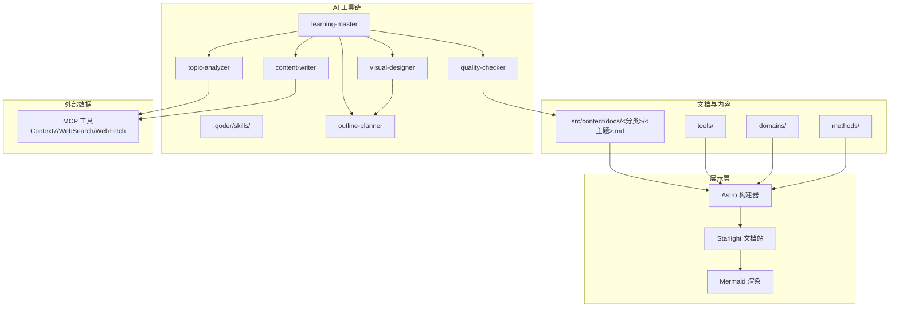
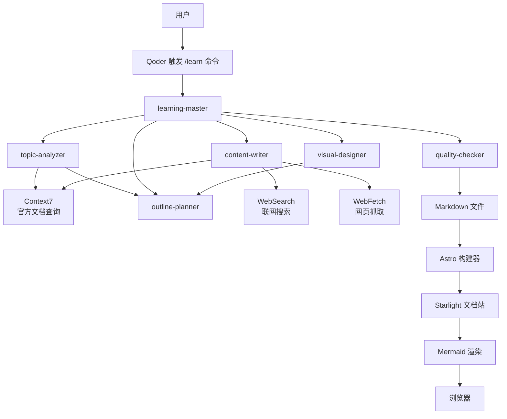
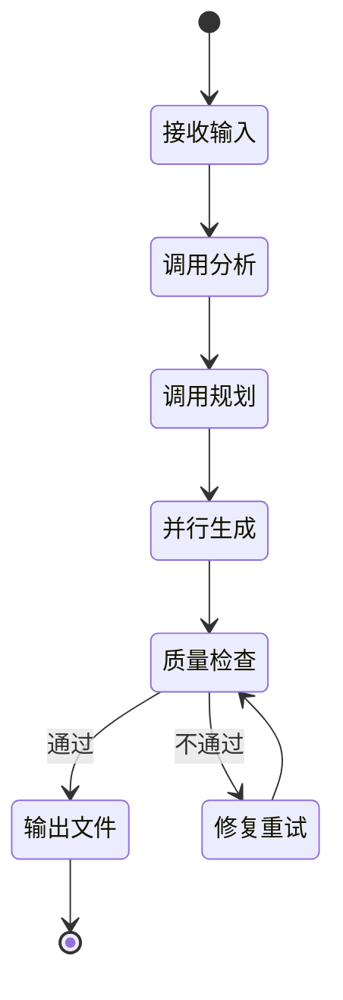
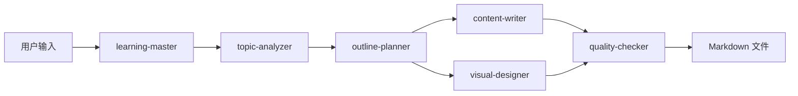
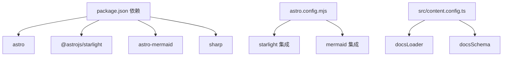
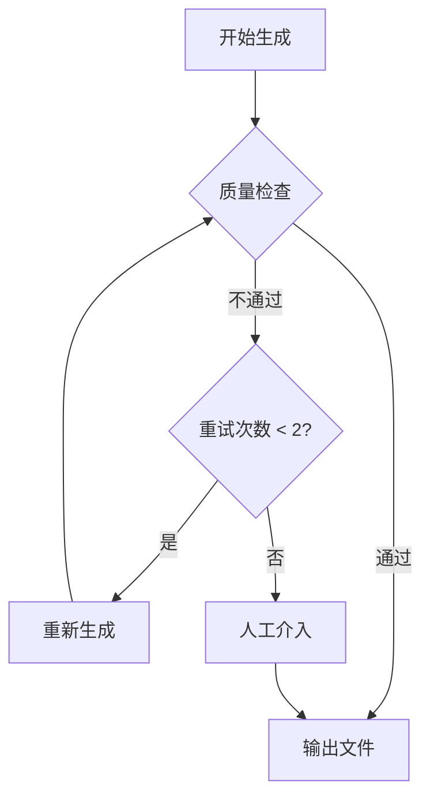

# AI 工具链概览

<cite>
**本文引用的文件**
- [package.json](file://package.json)
- [astro.config.mjs](file://astro.config.mjs)
- [src/content.config.ts](file://src/content.config.ts)
- [src/styles/custom.css](file://src/styles/custom.css)
- [docs/01-PROJECT-BRIEF.md](file://docs/01-PROJECT-BRIEF.md)
- [docs/03-ARCHITECTURE.md](file://docs/03-ARCHITECTURE.md)
- [docs/04-AI-SKILL-SPEC.md](file://docs/04-AI-SKILL-SPEC.md)
- [src/content/docs/tools/ai-coding/index.md](file://src/content/docs/tools/ai-coding/index.md)
- [src/content/docs/domains/frontend/index.md](file://src/content/docs/domains/frontend/index.md)
</cite>

## 目录
1. [引言](#引言)
2. [项目结构](#项目结构)
3. [核心组件](#核心组件)
4. [架构总览](#架构总览)
5. [详细组件分析](#详细组件分析)
6. [依赖分析](#依赖分析)
7. [性能考量](#性能考量)
8. [使用示例与最佳实践](#使用示例与最佳实践)
9. [故障排除指南](#故障排除指南)
10. [结论](#结论)
11. [附录](#附录)

## 引言
StudyBuddy 是一个以“管理者视角”为核心的 AI 驱动个人知识成长伙伴，目标是将碎片化学习转化为结构化知识体系。项目采用 Astro + Starlight + Mermaid 的技术栈，结合 Qoder Skills 与 MCP 协议的多代理协作工具链，实现从主题输入到结构化文档与可视化图表的自动化生成，并通过静态站点进行高效呈现与检索。

本概览文档聚焦于：
- Qoder Skills 工具链的整体架构与 MCP 协议使用
- AI 工具链的设计理念与核心价值
- 各个 AI Skill 的角色定位与相互关系
- 工具链的配置方式与集成模式
- 使用示例与最佳实践
- 多代理协作的工作原理与通信机制
- 性能考量与扩展性设计
- 开发者使用指南与故障排除方法

## 项目结构
项目采用分层与功能域结合的组织方式：
- 文档与内容：src/content/docs 下按工具/领域/方法论分类
- 展示与主题：Astro + Starlight + Mermaid 集成
- AI 工具链：.qoder/skills 下的 Qoder Skills（学习主控与六个子 Skill）
- 配置：astro.config.mjs、src/content.config.ts、package.json

**图表来源**
- [docs/03-ARCHITECTURE.md](file://docs/03-ARCHITECTURE.md#L12-L69)
- [astro.config.mjs](file://astro.config.mjs#L8-L32)
- [src/content.config.ts](file://src/content.config.ts#L5-L7)

**章节来源**
- [docs/03-ARCHITECTURE.md](file://docs/03-ARCHITECTURE.md#L164-L221)
- [astro.config.mjs](file://astro.config.mjs#L8-L32)
- [src/content.config.ts](file://src/content.config.ts#L5-L7)

## 核心组件
- 学习主控（learning-master）：接收用户输入，编排并协调六个子 Skill，控制生成流程与质量检查。
- 主题分析（topic-analyzer）：对用户输入的主题进行结构化分析，输出元数据与分类建议。
- 大纲规划（outline-planner）：基于分析结果生成符合“概览-详解-实战”三阶段框架的大纲。
- 内容撰写（content-writer）：按段落生成内容，结合 MCP 获取最新信息，确保时效与准确性。
- 图表生成（visual-designer）：根据大纲生成 Mermaid 图表，支撑可视化知识体系。
- 质量检查（quality-checker）：对完整内容进行结构、内容与格式检查，输出评分与改进建议。
- 外部数据（MCP）：Context7（官方文档）、WebSearch（联网搜索）、WebFetch（网页抓取），保障内容权威性与时效性。

**章节来源**
- [docs/04-AI-SKILL-SPEC.md](file://docs/04-AI-SKILL-SPEC.md#L75-L85)
- [docs/04-AI-SKILL-SPEC.md](file://docs/04-AI-SKILL-SPEC.md#L86-L95)

## 架构总览
下图展示了 StudyBuddy 的系统架构与数据流，包括用户交互、AI 工具链编排、外部数据获取以及最终静态站点生成与呈现。

**图表来源**
- [docs/03-ARCHITECTURE.md](file://docs/03-ARCHITECTURE.md#L12-L69)
- [docs/04-AI-SKILL-SPEC.md](file://docs/04-AI-SKILL-SPEC.md#L19-L73)

## 详细组件分析

### 学习主控（learning-master）
- 角色定位：任务编排与质量把关，协调 Analyzer、Planner、Writer、Designer、Checker 的协作。
- 关键约束：生成时间控制在 30 秒内；质量检查评分 ≥ 80 分才输出；失败最多重试 2 次。
- 工作状态机：接收输入 → 调用分析 → 调用规划 → 并行生成 → 质量检查 → 输出文件或修复重试。

**图表来源**
- [docs/04-AI-SKILL-SPEC.md](file://docs/04-AI-SKILL-SPEC.md#L161-L172)

**章节来源**
- [docs/04-AI-SKILL-SPEC.md](file://docs/04-AI-SKILL-SPEC.md#L149-L202)

### 主题分析（topic-analyzer）
- 输入：用户主题字符串
- 输出：结构化 JSON，包含主题、slug、一句话定义、解决的问题、使用场景、前置知识、复杂度、预计章节、核心概念、分类、建议图表等
- 设计要点：管理者视角，不涉及实现细节；一句话定义要通俗易懂；前置知识要精简

**章节来源**
- [docs/04-AI-SKILL-SPEC.md](file://docs/04-AI-SKILL-SPEC.md#L206-L278)

### 大纲规划（outline-planner）
- 输入：Analyzer 输出的 JSON
- 输出：带 frontmatter 的 Markdown 大纲，标记图表位置
- 三阶段框架：概览（5 分钟）、详解（60 分钟）、实战（25 分钟）
- 设计要点：概览控制在 5 分钟阅读量；详解每个概念控制在 10 分钟；总时长不超过 90 分钟

**章节来源**
- [docs/04-AI-SKILL-SPEC.md](file://docs/04-AI-SKILL-SPEC.md#L281-L387)

### 内容撰写（content-writer）
- 分段模式：概览（overview）、详解（details）、实战（practices）
- MCP 调用要求：在生成涉及版本号、API 参数、安装/配置命令、官方推荐写法等内容前，必须调用 Context7、WebSearch、WebFetch 获取权威信息
- 输出：Markdown 内容，示例代码必须可运行，必须标注数据来源

**章节来源**
- [docs/04-AI-SKILL-SPEC.md](file://docs/04-AI-SKILL-SPEC.md#L390-L532)

### 图表生成（visual-designer）
- 输入：大纲 Markdown
- 输出：Mermaid 代码（至少两个图表：思维导图 mindmap、流程图 flowchart）
- 设计要点：节点文字简洁，避免过深层级，确保语法正确可渲染

**章节来源**
- [docs/04-AI-SKILL-SPEC.md](file://docs/04-AI-SKILL-SPEC.md#L535-L606)

### 质量检查（quality-checker）
- 检查维度：结构（三阶段完整、每概念三要素、难度分级清晰）、内容（定义通俗、类比恰当、示例可运行、速查表实用）、格式（Markdown、表格、Mermaid）
- 输出：JSON 报告，包含总分、是否通过、分项得分、问题与建议
- 评分标准：90-100 优秀，80-89 良好，70-79 一般，<70 不合格

**章节来源**
- [docs/04-AI-SKILL-SPEC.md](file://docs/04-AI-SKILL-SPEC.md#L609-L716)

### 外部数据与 MCP 集成
- Context7：查询官方文档、API 参考（分析与撰写阶段）
- WebSearch：联网搜索最新资讯、最佳实践（实战案例阶段）
- WebFetch：抓取指定网页内容（获取官方教程、博客文章）
- 调用策略：优先级 Context7 > WebFetch > WebSearch > 模型内置知识；必须联网场景包括版本号、API 签名、安装/配置命令、官方推荐最佳实践

**章节来源**
- [docs/04-AI-SKILL-SPEC.md](file://docs/04-AI-SKILL-SPEC.md#L86-L126)

### 数据流与传递规范
- 用户 → Master：字符串（/learn {topic} [--category] [--level]）
- Master → Analyzer：字符串（主题）
- Analyzer → Planner：JSON（分析结果）
- Planner → Writer：Markdown（大纲）
- Planner → Designer：Markdown（大纲 + 图表标记）
- Writer → Checker：Markdown（段落内容）
- Designer → Checker：Mermaid（图表代码）
- Checker → Master：JSON（检查报告）

**图表来源**
- [docs/04-AI-SKILL-SPEC.md](file://docs/04-AI-SKILL-SPEC.md#L723-L760)

**章节来源**
- [docs/04-AI-SKILL-SPEC.md](file://docs/04-AI-SKILL-SPEC.md#L719-L774)

## 依赖分析
- 技术栈依赖：Astro、Starlight、Mermaid、Sharp 等
- 配置依赖：astro.config.mjs 集成 Starlight 与 Mermaid，启用侧边栏自动分组；src/content.config.ts 使用 Starlight 的文档加载器与模式
- 内容依赖：文档按 tools/domains/methods 分类，路径与侧边栏自动生成

**图表来源**
- [package.json](file://package.json#L12-L18)
- [astro.config.mjs](file://astro.config.mjs#L8-L32)
- [src/content.config.ts](file://src/content.config.ts#L5-L7)

**章节来源**
- [package.json](file://package.json#L12-L18)
- [astro.config.mjs](file://astro.config.mjs#L8-L32)
- [src/content.config.ts](file://src/content.config.ts#L5-L7)

## 性能考量
- 构建优化：Astro 默认增量构建、图片优化、代码分割
- 运行时优化：静态生成（零运行时 JS）、CDN 缓存、Mermaid 图表懒加载
- 生成性能：学习主控约束生成时间在 30 秒内，质量检查评分阈值 ≥ 80，失败最多重试 2 次

**章节来源**
- [docs/03-ARCHITECTURE.md](file://docs/03-ARCHITECTURE.md#L366-L383)
- [docs/04-AI-SKILL-SPEC.md](file://docs/04-AI-SKILL-SPEC.md#L198-L202)

## 使用示例与最佳实践
- 使用流程
  1) 在 Qoder 中执行 /learn {topic} 生成学习文档
  2) 本地预览：npm run dev 启动本地服务器
  3) 浏览学习：访问 localhost:4321 查看文档
- 最佳实践
  - 主题输入尽量明确具体，便于 Analyzer 精确分析
  - 内容撰写阶段严格遵循 MCP 调用策略，确保时效与准确性
  - 图表生成遵循节点简洁、层级适中的原则，提升可读性
  - 质量检查不通过时，依据建议逐项修正，避免多次重试

**章节来源**
- [docs/03-ARCHITECTURE.md](file://docs/03-ARCHITECTURE.md#L358-L363)
- [docs/04-AI-SKILL-SPEC.md](file://docs/04-AI-SKILL-SPEC.md#L475-L492)

## 故障排除指南
- 分析失败：主题过于模糊，提示用户细化主题
- 大纲不完整：自动补充缺失章节
- 内容质量低：评分 < 80 时重新生成（最多 2 次）
- 图表语法错误：简化图表结构，确保 Mermaid 可正确渲染
- 超时：生成时间超过阈值时返回部分结果

**图表来源**
- [docs/04-AI-SKILL-SPEC.md](file://docs/04-AI-SKILL-SPEC.md#L791-L800)

**章节来源**
- [docs/04-AI-SKILL-SPEC.md](file://docs/04-AI-SKILL-SPEC.md#L777-L800)

## 结论
StudyBuddy 通过 Qoder Skills 与 MCP 的多代理协作，实现了从主题输入到结构化文档与可视化图表的高效生成。其“管理者视角”的设计理念强调“从记忆转向检索、从深度转向广度、从线性转向网状”，配合 Astro + Starlight + Mermaid 的技术栈，既保证了内容质量与可维护性，也提供了优秀的阅读体验与检索效率。通过明确的职责分工、严格的 MCP 调用策略与质量检查机制，工具链具备良好的扩展性与稳定性。

## 附录
- 项目愿景与核心价值主张详见项目简介
- 文档分类体系与命名规范详见架构设计
- Mermaid 集成与自定义样式详见架构设计与样式文件

**章节来源**
- [docs/01-PROJECT-BRIEF.md](file://docs/01-PROJECT-BRIEF.md#L9-L58)
- [docs/03-ARCHITECTURE.md](file://docs/03-ARCHITECTURE.md#L223-L239)
- [src/styles/custom.css](file://src/styles/custom.css#L261-L302)