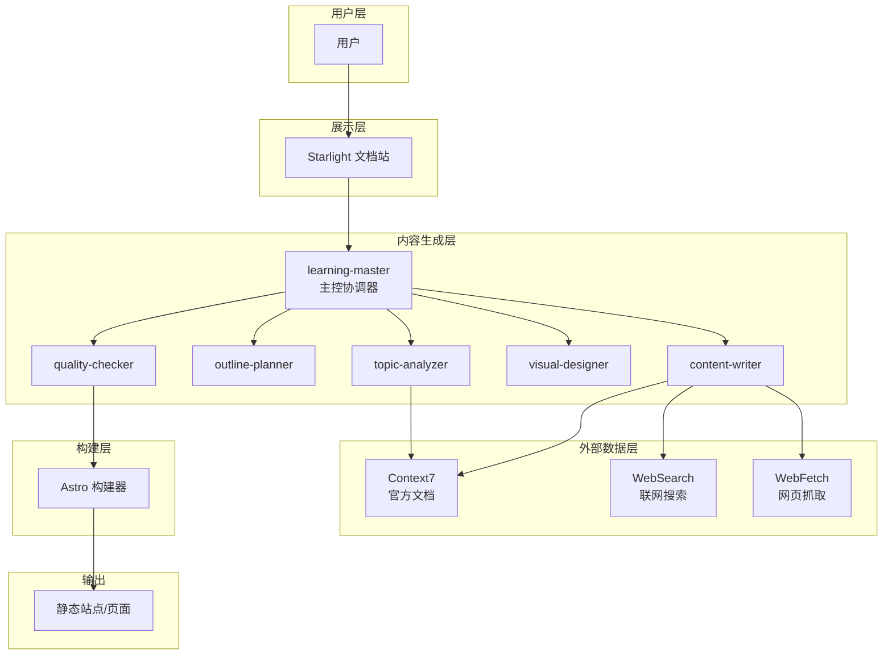
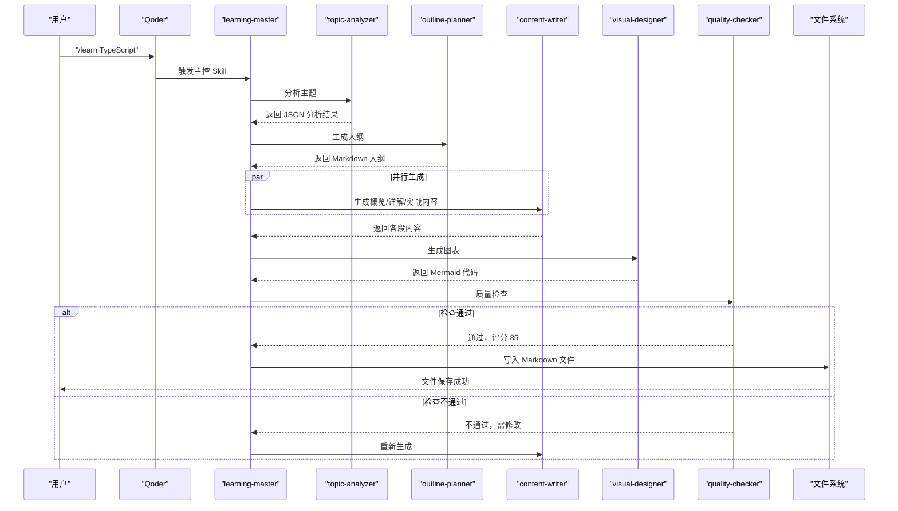
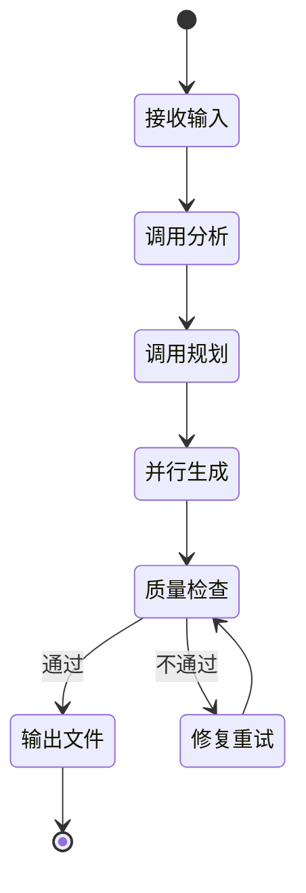
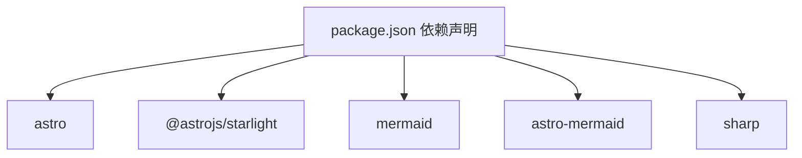
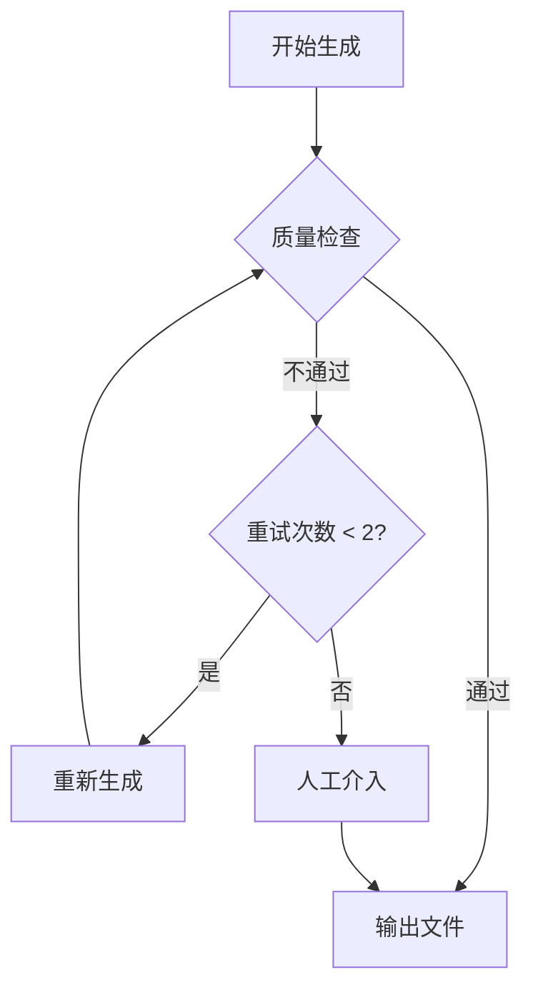

# 主控协调器

<cite>
**本文引用的文件**
- [技术架构设计](file://docs/03-ARCHITECTURE.md)
- [AI Skill 规格说明](file://docs/04-AI-SKILL-SPEC.md)
- [项目包配置](file://package.json)
</cite>

## 目录
1. [简介](#简介)
2. [项目结构](#项目结构)
3. [核心组件](#核心组件)
4. [架构总览](#架构总览)
5. [详细组件分析](#详细组件分析)
6. [依赖分析](#依赖分析)
7. [性能考量](#性能考量)
8. [故障排查指南](#故障排查指南)
9. [结论](#结论)
10. [附录](#附录)

## 简介
本文件面向“学习主控协调器”（learning-master）的开发者与集成者，系统化阐述其在 AI 内容生成流水线中的核心职责、编排逻辑、状态管理与流程控制机制，并给出与其他 AI Skill 的交互协议、配置参数、调用接口与返回值规范、使用示例与集成模式、错误处理与异常恢复策略、性能优化建议与调试技巧，以及扩展与自定义主控逻辑的方法。

## 项目结构
- 仓库采用文档驱动的静态站点生成架构，核心 AI Skill 体系位于 docs 目录下的规格与架构文档中；学习主控协调器作为顶层编排者，负责串联主题分析、大纲规划、内容撰写、图表生成与质量检查等子 Skill。
- 项目使用 Astro + Starlight 构建文档站，Mermaid 通过 remark 插件集成，支持在 Markdown 中直接渲染多种图表类型。

**图示来源**
- [技术架构设计](file://docs/03-ARCHITECTURE.md#L12-L69)

**章节来源**
- [技术架构设计](file://docs/03-ARCHITECTURE.md#L164-L222)
- [项目包配置](file://package.json#L1-L20)

## 核心组件
- learning-master（主控协调器）
  - 职责：接收用户输入，协调 topic-analyzer、outline-planner、content-writer、visual-designer、quality-checker 完成高质量学习文档生成。
  - 触发命令：/learn {topic} [--category={cat}] [--level={level}]
  - 约束：生成时间控制在 30 秒内；质量检查评分 ≥ 80 分才输出；失败最多重试 2 次。
- topic-analyzer（主题分析）
  - 输入：主题字符串
  - 输出：结构化分析 JSON（包含主题、slug、复杂度、前置知识、关键概念、建议图表类型等）
- outline-planner（大纲规划）
  - 输入：分析 JSON
  - 输出：带 frontmatter 的 Markdown 大纲（三阶段结构，含图表标记）
- content-writer（内容撰写）
  - 输入：大纲 + 段落指定（overview/details/practices）
  - 输出：Markdown 段落内容；并行调用多个段落生成
- visual-designer（图表生成）
  - 输入：大纲
  - 输出：Mermaid 代码（mindmap/flowchart 等）
- quality-checker（质量检查）
  - 输入：完整内容（含段落与图表）
  - 输出：JSON 报告（含总分、分项得分、问题与建议）

**章节来源**
- [AI Skill 规格说明](file://docs/04-AI-SKILL-SPEC.md#L75-L85)
- [AI Skill 规格说明](file://docs/04-AI-SKILL-SPEC.md#L149-L203)
- [AI Skill 规格说明](file://docs/04-AI-SKILL-SPEC.md#L206-L278)
- [AI Skill 规格说明](file://docs/04-AI-SKILL-SPEC.md#L281-L387)
- [AI Skill 规格说明](file://docs/04-AI-SKILL-SPEC.md#L390-L532)
- [AI Skill 规格说明](file://docs/04-AI-SKILL-SPEC.md#L535-L606)
- [AI Skill 规格说明](file://docs/04-AI-SKILL-SPEC.md#L609-L716)

## 架构总览
- 主控协调器处于“主控层”，向上承接用户输入，向下编排六个子 Skill，形成“输入 → 分析 → 规划 → 并行生成 → 质量检查 → 输出”的闭环。
- 外部数据层通过 MCP 工具（Context7、WebSearch、WebFetch）为分析与内容生成提供权威与时效信息，确保内容质量与可运行性。

**图示来源**
- [技术架构设计](file://docs/03-ARCHITECTURE.md#L86-L126)

**章节来源**
- [技术架构设计](file://docs/03-ARCHITECTURE.md#L82-L126)

## 详细组件分析

### learning-master（主控协调器）
- 初始化与状态管理
  - 接收用户输入（/learn {topic} [--category] [--level]），解析参数并进入工作流程。
  - 维护内部状态机：接收输入 → 调用分析 → 调用规划 → 并行生成 → 质量检查 → 输出文件/修复重试。
  - 重试上限：最多 2 次；超过阈值则人工介入。
- 流程控制机制
  - 串行阶段：分析、规划。
  - 并行阶段：内容撰写（概览/详解/实战）与图表生成同时进行，提升吞吐。
  - 质量门禁：评分 ≥ 80 才输出；否则触发修复重试循环。
- 与其他 Skill 的交互协议
  - 与 topic-analyzer：传入主题字符串，接收结构化分析 JSON。
  - 与 outline-planner：传入分析 JSON，接收大纲 Markdown。
  - 与 content-writer：传入大纲 + 段落标识（overview/details/practices），接收各段内容。
  - 与 visual-designer：传入大纲 Markdown，接收 Mermaid 代码。
  - 与 quality-checker：传入完整内容（含段落与图表），接收检查报告 JSON。
- 数据传递协议
  - 用户 → Master：字符串（/learn 命令）
  - Master → Analyzer：字符串（主题）
  - Analyzer → Planner：JSON（分析结果）
  - Planner → Writer：Markdown（大纲）
  - Planner → Designer：Markdown（大纲）
  - Writer → Checker：Markdown（段落内容）
  - Designer → Checker：Mermaid（图表代码）
  - Checker → Master：JSON（检查报告）
- 配置参数与约束
  - 输入参数：topic（必填）、category（可选，默认自动识别）、level（可选：beginner/intermediate/advanced）。
  - 生成时限：≤ 30 秒。
  - 质量阈值：≥ 80 分。
  - 重试次数：≤ 2 次。
- 使用示例与集成模式
  - 示例：/learn TypeScript --level=intermediate
  - 集成模式：在 Qoder 中触发 /learn 命令，learning-master 作为入口协调后续流程。
- 错误处理与异常恢复
  - 分析失败：提示细化主题。
  - 大纲不完整：自动补充。
  - 内容质量低：重新生成（最多 2 次）。
  - 图表语法错误：简化图表结构。
  - 超时：返回部分结果。
- 性能优化建议
  - 并行化：内容撰写与图表生成并行执行。
  - 缓存：对常用分析结果与图表模板进行缓存。
  - 超时控制：为每个子 Skill 设置独立超时阈值，避免阻塞。
  - 资源限制：控制段落数量与图表节点数量，避免过度渲染。
- 调试技巧
  - 记录每个阶段的输入/输出摘要，便于定位问题。
  - 使用轻量图表先行验证大纲结构与生成路径。
  - 分段测试：先验证分析与规划，再逐步接入内容生成与质量检查。
- 扩展与自定义
  - 新增子 Skill：在 .qoder/skills 下创建目录并编写 SKILL.md，然后在 learning-master 中注册调用。
  - 自定义流程：在状态机中新增阶段或调整并行策略，确保数据兼容性。
  - 参数扩展：在输入解析中加入新的可选参数，并在各阶段传递。

**图示来源**
- [AI Skill 规格说明](file://docs/04-AI-SKILL-SPEC.md#L161-L172)

**章节来源**
- [AI Skill 规格说明](file://docs/04-AI-SKILL-SPEC.md#L149-L203)
- [AI Skill 规格说明](file://docs/04-AI-SKILL-SPEC.md#L719-L774)
- [AI Skill 规格说明](file://docs/04-AI-SKILL-SPEC.md#L777-L800)

### topic-analyzer（主题分析）
- 输入：主题字符串
- 输出：结构化 JSON（主题、slug、复杂度、前置知识、关键概念、建议图表类型等）
- 约束：管理者视角，不涉及实现细节；一句话定义要通俗易懂；前置知识要精简

**章节来源**
- [AI Skill 规格说明](file://docs/04-AI-SKILL-SPEC.md#L206-L278)

### outline-planner（大纲规划）
- 输入：分析 JSON
- 输出：带 frontmatter 的 Markdown 大纲（三阶段结构，含图表标记）
- 约束：概览控制在 5 分钟阅读量；详解每个概念控制在 10 分钟；总时长不超过 90 分钟

**章节来源**
- [AI Skill 规格说明](file://docs/04-AI-SKILL-SPEC.md#L281-L387)

### content-writer（内容撰写）
- 输入：大纲 + 段落指定（overview/details/practices）
- 输出：Markdown 段落内容
- 约束：不同段落有不同的字数与格式要求；必须调用 MCP 获取最新信息（Context7/WebSearch/WebFetch）

**章节来源**
- [AI Skill 规格说明](file://docs/04-AI-SKILL-SPEC.md#L390-L532)

### visual-designer（图表生成）
- 输入：大纲
- 输出：Mermaid 代码（mindmap/flowchart 等）
- 约束：每个主题至少生成 2 个图表；节点文字简洁；避免过深层级；语法正确可直接渲染

**章节来源**
- [AI Skill 规格说明](file://docs/04-AI-SKILL-SPEC.md#L535-L606)

### quality-checker（质量检查）
- 输入：完整内容（含段落与图表）
- 输出：JSON 报告（含总分、分项得分、问题与建议）
- 约束：评分标准明确；结构/内容/格式三类检查清单

**章节来源**
- [AI Skill 规格说明](file://docs/04-AI-SKILL-SPEC.md#L609-L716)

## 依赖分析
- 技术栈依赖
  - Astro：静态站点生成器
  - Starlight：文档主题
  - Mermaid：图表渲染
  - sharp：图片优化（可选）
- 文档与构建
  - Mermaid 通过 remark 插件集成，支持在 Markdown 中直接渲染多种图表类型
  - 构建流程将 Markdown 与 Mermaid 渲染为静态 HTML，优化资源并输出

**图示来源**
- [项目包配置](file://package.json#L12-L18)

**章节来源**
- [项目包配置](file://package.json#L1-L20)
- [技术架构设计](file://docs/03-ARCHITECTURE.md#L242-L275)

## 性能考量
- 构建优化
  - 增量构建：减少 50% 构建时间
  - 图片优化：减少 70% 图片体积
  - 代码分割：减少首屏 JS
- 运行时优化
  - 静态生成：零运行时 JS
  - CDN 缓存：Vercel Edge，< 50ms TTFB
  - 懒加载图表：Intersection Observer 提升首屏速度
- 主控侧优化建议
  - 并行化：内容撰写与图表生成并行执行
  - 超时控制：为每个子 Skill 设置独立超时阈值
  - 资源限制：控制段落数量与图表节点数量
  - 缓存策略：对常用分析结果与图表模板进行缓存

**章节来源**
- [技术架构设计](file://docs/03-ARCHITECTURE.md#L366-L383)

## 故障排查指南
- 常见错误类型与处理
  - 分析失败：提示细化主题
  - 大纲不完整：自动补充
  - 内容质量低：重新生成（最多 2 次）
  - 图表语法错误：简化图表结构
  - 超时：返回部分结果
- 回退流程
  - 质量检查不通过时，触发修复重试；超过最大重试次数后人工介入

**图示来源**
- [AI Skill 规格说明](file://docs/04-AI-SKILL-SPEC.md#L789-L800)

**章节来源**
- [AI Skill 规格说明](file://docs/04-AI-SKILL-SPEC.md#L777-L800)

## 结论
learning-master 作为学习内容生成流水线的“管理者视角”主控协调器，通过清晰的状态机与严格的约束，实现了从主题输入到最终文档输出的高效闭环。其与各子 Skill 的数据协议与并行化策略，确保了生成质量与性能的平衡。结合外部 MCP 工具与 Mermaid 图表能力，该体系能够持续产出高质量、可运行且可视化的学习材料。

## 附录
- 使用示例
  - 在 Qoder 中执行 /learn TypeScript --level=intermediate
  - 本地预览：npm run dev；浏览 localhost:4321 查看生成文档
- 扩展与自定义
  - 新增 Skill：在 .qoder/skills 下创建目录并编写 SKILL.md，然后在 learning-master 中注册调用
  - 自定义组件：在 src/components 下创建 .astro 文件，在 Markdown 中通过 MDX 语法引用

**章节来源**
- [技术架构设计](file://docs/03-ARCHITECTURE.md#L323-L363)
- [技术架构设计](file://docs/03-ARCHITECTURE.md#L386-L406)