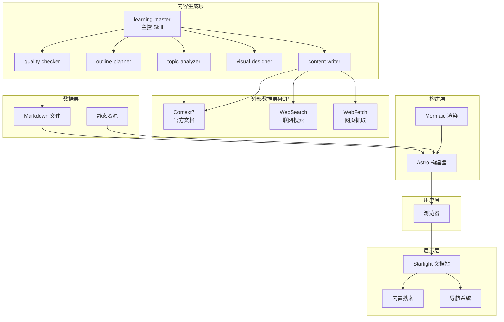
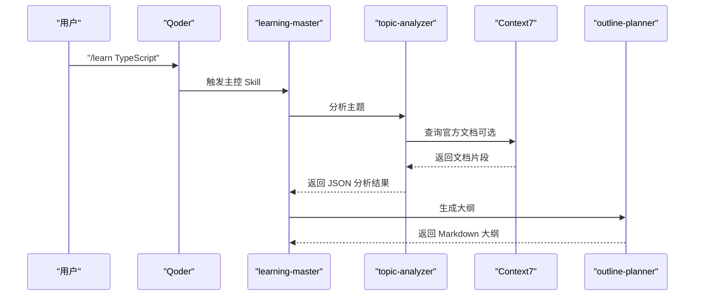
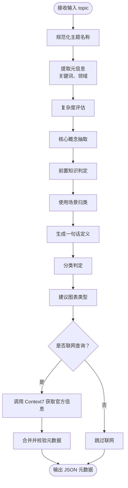
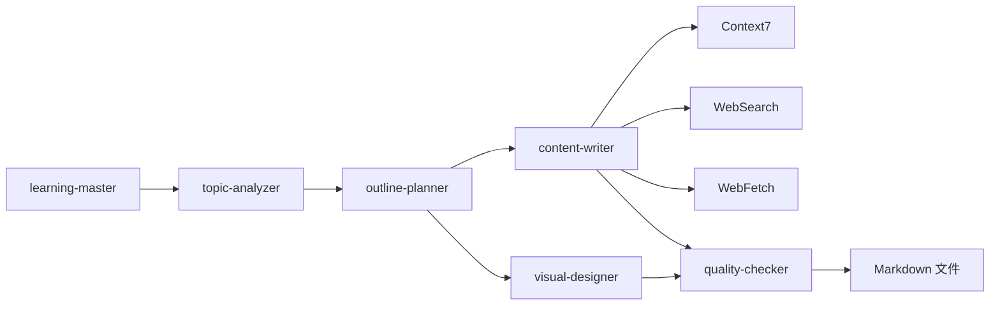
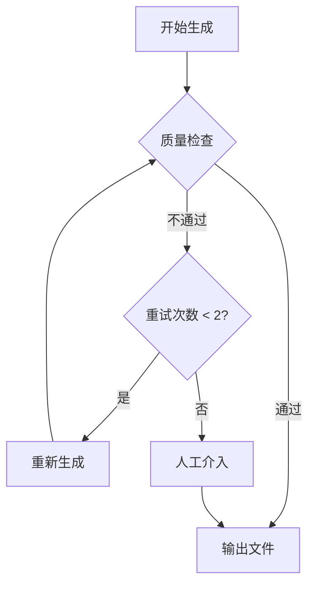

# 主题分析器

<cite>
**本文引用的文件**
- [StudyBuddy AI Skill 规格说明](file://docs/04-AI-SKILL-SPEC.md)
- [StudyBuddy 技术架构设计](file://docs/03-ARCHITECTURE.md)
- [项目简介](file://docs/01-PROJECT-BRIEF.md)
- [package.json](file://package.json)
</cite>

## 目录
1. [引言](#引言)
2. [项目结构](#项目结构)
3. [核心组件](#核心组件)
4. [架构总览](#架构总览)
5. [详细组件分析](#详细组件分析)
6. [依赖分析](#依赖分析)
7. [性能考量](#性能考量)
8. [故障排除指南](#故障排除指南)
9. [结论](#结论)
10. [附录](#附录)

## 引言
本文件面向“主题分析器”（topic-analyzer）的使用者与开发者，系统化阐述其功能定位、工作原理、算法要点、输入输出规范、与外部工具（Context7、WebSearch）的集成方式、性能优化与准确性提升建议，以及常见问题诊断与解决路径。主题分析器作为 AI 技能体系中的“分析层”，负责对用户输入的学习主题进行复杂度与知识结构分析，输出结构化元数据，为后续大纲规划、内容撰写与图表生成提供依据。

## 项目结构
- 仓库采用 Astro + Starlight 的静态站点与文档生成方案，主题分析器属于“内容生成层”的一部分，通过主控 Skill（learning-master）编排调用。
- 技术栈与集成点：
  - 构建与渲染：Astro、Starlight、Mermaid
  - 外部数据层（MCP）：Context7（官方文档）、WebSearch（联网搜索）、WebFetch（网页抓取）
  - 内容生成层：topic-analyzer、outline-planner、content-writer、visual-designer、quality-checker

**图示来源**
- [StudyBuddy 技术架构设计](file://docs/03-ARCHITECTURE.md#L12-L69)

**章节来源**
- [StudyBuddy 技术架构设计](file://docs/03-ARCHITECTURE.md#L1-L69)
- [StudyBuddy AI Skill 规格说明](file://docs/04-AI-SKILL-SPEC.md#L19-L73)

## 核心组件
- 主控 Skill（learning-master）：接收用户输入，编排 topic-analyzer → outline-planner → 并行 content-writer × 3 段落 + visual-designer → quality-checker 的完整流程。
- 主题分析器（topic-analyzer）：面向“管理者视角”，对主题进行复杂度评估、知识结构拆解、前置知识与应用场景判定，并输出结构化元数据。
- 外部工具（MCP）：Context7、WebSearch、WebFetch，分别用于官方文档查询、最新实践搜索与网页内容抓取，保障内容时效性与准确性。

**章节来源**
- [StudyBuddy AI Skill 规格说明](file://docs/04-AI-SKILL-SPEC.md#L149-L202)
- [StudyBuddy 技术架构设计](file://docs/03-ARCHITECTURE.md#L82-L126)

## 架构总览
主题分析器在整体流程中的职责与交互如下：

**图示来源**
- [StudyBuddy 技术架构设计](file://docs/03-ARCHITECTURE.md#L86-L126)
- [StudyBuddy AI Skill 规格说明](file://docs/04-AI-SKILL-SPEC.md#L206-L277)

## 详细组件分析

### 主题分析器：功能与目标
- 角色定位：技术主题分析专家，以“管理者视角”解构知识体系，关注“是什么”“为什么”“何时用”，不深入实现细节。
- 核心产出：结构化元数据（JSON），用于驱动后续大纲规划与内容撰写。
- 时效性保障：可选调用 Context7 获取官方文档信息，确保版本号、API 签名等关键信息准确。

**章节来源**
- [StudyBuddy AI Skill 规格说明](file://docs/04-AI-SKILL-SPEC.md#L206-L277)

### 输入参数
- 必填
  - topic：学习主题（字符串）
- 可选
  - category：分类（tools/domains/methods；默认自动识别）
  - level：难度（beginner/intermediate/advanced）

上述输入由主控 Skill（learning-master）接收并传递给主题分析器。

**章节来源**
- [StudyBuddy AI Skill 规格说明](file://docs/04-AI-SKILL-SPEC.md#L156-L193)

### 输出格式与数据结构
主题分析器输出 JSON，字段说明如下（均来自规格说明）：
- topic：主题名称（字符串）
- slug：URL 友好的标识符（kebab-case，字符串）
- one_sentence：一句话定义（不超过 50 字，字符串）
- problem_solved：解决的核心问题（字符串）
- use_cases：典型使用场景（数组，3-5 个字符串）
- prerequisites：前置知识（数组，不超过 3 个字符串）
- complexity：难度级别（beginner/intermediate/advanced）
- estimated_sections：预计章节数（5-8 的整数）
- key_concepts：核心概念（3-5 个字符串）
- category：分类（tools/domains/methods）
- suggested_diagrams：建议的图表类型（mindmap/flowchart 等）

输出样例与字段约束详见规格说明的“输出 Schema”。

**章节来源**
- [StudyBuddy AI Skill 规格说明](file://docs/04-AI-SKILL-SPEC.md#L216-L248)

### 分析算法与处理逻辑
- 管理者视角的结构化解构：将复杂主题拆分为“是什么/为什么/怎么用”的认知维度，提炼前置知识与应用场景。
- 复杂度评估：结合主题体量、概念密度与实践复杂度，给出 beginner/intermediate/advanced 的难度判断。
- 知识结构分析：识别核心概念与子概念，形成可落地的大纲骨架。
- 图表建议：根据知识结构与学习阶段，建议 mindmap/flowchart 等可视化类型。
- 可选联网查询：在分析阶段调用 Context7 获取官方文档，以提升元数据准确性与时效性。

**图示来源**
- [StudyBuddy AI Skill 规格说明](file://docs/04-AI-SKILL-SPEC.md#L206-L277)

### 与外部工具的集成
- Context7（官方文档查询）：在主题分析阶段与内容撰写阶段均可调用，用于获取 API 签名、参数、版本号等权威信息。
- WebSearch（联网搜索）：在内容撰写实战案例阶段调用，获取最新最佳实践与社区反馈。
- WebFetch（网页抓取）：在内容撰写阶段调用，抓取官方教程或博客文章，确保示例代码与环境一致。

调用策略与优先级：
- 数据获取优先级：Context7（最权威）→ WebFetch（次权威）→ WebSearch（补充参考）→ 模型内置知识（兜底）
- 必须联网场景：版本号与发布日期、API 签名与参数、安装/配置命令、官方推荐的最佳实践
- 可用内置知识场景：概念解释与类比、通用设计模式、不涉及版本的原理说明

**章节来源**
- [StudyBuddy AI Skill 规格说明](file://docs/04-AI-SKILL-SPEC.md#L86-L126)

### 使用示例
- 基础调用：在 Qoder 中执行 /learn {topic}，例如 /learn Docker，系统将自动触发主控 Skill，完成主题分析、大纲生成、内容撰写、图表生成与质量检查。
- 高级调用：可指定分类与难度，例如 /learn Kubernetes --category=tools --level=advanced。
- 输出位置：最终文档保存至 src/content/docs/{category}/{slug}.md。

**章节来源**
- [StudyBuddy AI Skill 规格说明](file://docs/04-AI-SKILL-SPEC.md#L804-L833)

### 配置选项
- 主控 Skill（learning-master）的输入格式与约束：
  - 输入：topic、category（可选）、level（可选）
  - 约束：生成时间控制在 30 秒内；质量检查评分 ≥ 80 分才输出；失败最多重试 2 次
- Mermaid 集成配置（Astro）：通过 remark-mermaid 插件启用，支持 mindmap、flowchart、sequenceDiagram、classDiagram、stateDiagram-v2 等类型。

**章节来源**
- [StudyBuddy AI Skill 规格说明](file://docs/04-AI-SKILL-SPEC.md#L156-L202)
- [StudyBuddy 技术架构设计](file://docs/03-ARCHITECTURE.md#L244-L275)

## 依赖分析
- 组件耦合与协作
  - 主控 Skill（learning-master）与主题分析器（topic-analyzer）之间为“输入-输出”关系：输入为字符串主题，输出为 JSON 元数据。
  - 主题分析器与大纲规划器（outline-planner）之间为“JSON→Markdown”数据传递。
  - 内容撰写器（content-writer）与外部工具（Context7/WebSearch/WebFetch）之间存在“查询-写入”关系，用于保证内容时效性与准确性。
  - 质量检查器（quality-checker）对“内容+图表”进行统一质量评估。

**图示来源**
- [StudyBuddy 技术架构设计](file://docs/03-ARCHITECTURE.md#L12-L69)
- [StudyBuddy AI Skill 规格说明](file://docs/04-AI-SKILL-SPEC.md#L723-L774)

**章节来源**
- [StudyBuddy 技术架构设计](file://docs/03-ARCHITECTURE.md#L720-L774)
- [StudyBuddy AI Skill 规格说明](file://docs/04-AI-SKILL-SPEC.md#L719-L774)

## 性能考量
- 生成时间控制：主控 Skill 约束生成时间在 30 秒内，主题分析器应尽量减少不必要的联网查询与重复计算。
- 质量检查阈值：评分低于 80 分将触发重试，建议在分析阶段就尽可能产出高质量元数据，减少后续重试概率。
- 外部工具调用策略：优先使用 Context7 获取权威信息，避免过多 WebSearch/WebFetch 导致延迟；对可复用的元数据进行缓存。
- Mermaid 渲染优化：图表节点文字简洁、层级不宜过深，确保渲染性能与可读性。

**章节来源**
- [StudyBuddy AI Skill 规格说明](file://docs/04-AI-SKILL-SPEC.md#L198-L202)
- [StudyBuddy 技术架构设计](file://docs/03-ARCHITECTURE.md#L366-L383)

## 故障排除指南
- 分析失败（主题过于模糊）：提示用户细化主题，例如增加领域限定或具体场景描述。
- 大纲不完整（缺少必要章节）：自动补充概览、详解、实战三阶段结构。
- 内容质量低（评分 < 80）：触发重试机制（最多 2 次），若仍不通过则人工介入。
- 图表语法错误（Mermaid 解析失败）：简化图表结构，降低层级与节点数量，确保语法正确。
- 超时（生成时间 > 60s）：返回部分结果，优先保证可读性与可用性。

**图示来源**
- [StudyBuddy AI Skill 规格说明](file://docs/04-AI-SKILL-SPEC.md#L789-L800)

**章节来源**
- [StudyBuddy AI Skill 规格说明](file://docs/04-AI-SKILL-SPEC.md#L777-L800)

## 结论
主题分析器以“管理者视角”为核心，通过对学习主题的复杂度与知识结构进行系统化分析，输出结构化元数据，为后续大纲规划与内容撰写奠定坚实基础。通过合理运用 Context7、WebSearch、WebFetch 等外部工具，可在保证时效性与准确性的同时，提升整体生成效率与质量稳定性。建议开发者在实现层面遵循输出 Schema 与约束，结合性能与准确性优化策略，持续迭代分析规则与外部工具调用策略。

## 附录

### 使用示例（摘要）
- 基础调用：/learn Docker
- 高级调用：/learn Kubernetes --category=tools --level=advanced
- 输出位置：src/content/docs/{category}/{slug}.md

**章节来源**
- [StudyBuddy AI Skill 规格说明](file://docs/04-AI-SKILL-SPEC.md#L804-L833)

### 外部工具调用策略（摘要）
- 优先级：Context7 → WebFetch → WebSearch → 模型内置知识
- 必须联网：版本号、API 签名、安装/配置命令、官方推荐最佳实践
- 可用内置知识：概念解释、类比、通用设计模式、不涉及版本的原理说明

**章节来源**
- [StudyBuddy AI Skill 规格说明](file://docs/04-AI-SKILL-SPEC.md#L104-L126)

### Mermaid 图表类型（摘要）
- mindmap：知识体系概览
- flowchart：使用步骤、决策流程
- sequenceDiagram：交互过程、API 调用
- classDiagram：数据结构、类关系
- stateDiagram-v2：状态机、生命周期

**章节来源**
- [StudyBuddy 技术架构设计](file://docs/03-ARCHITECTURE.md#L266-L275)