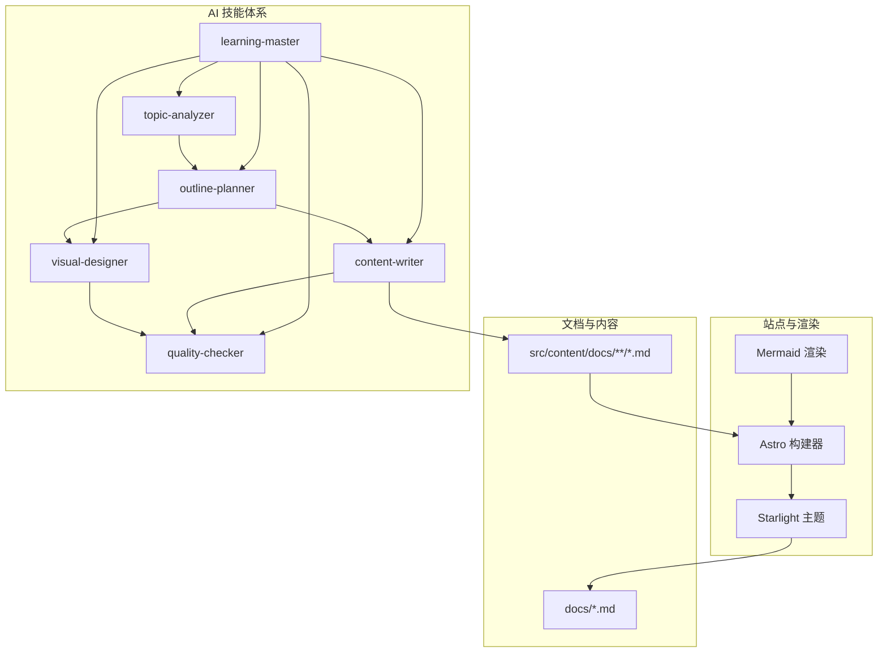
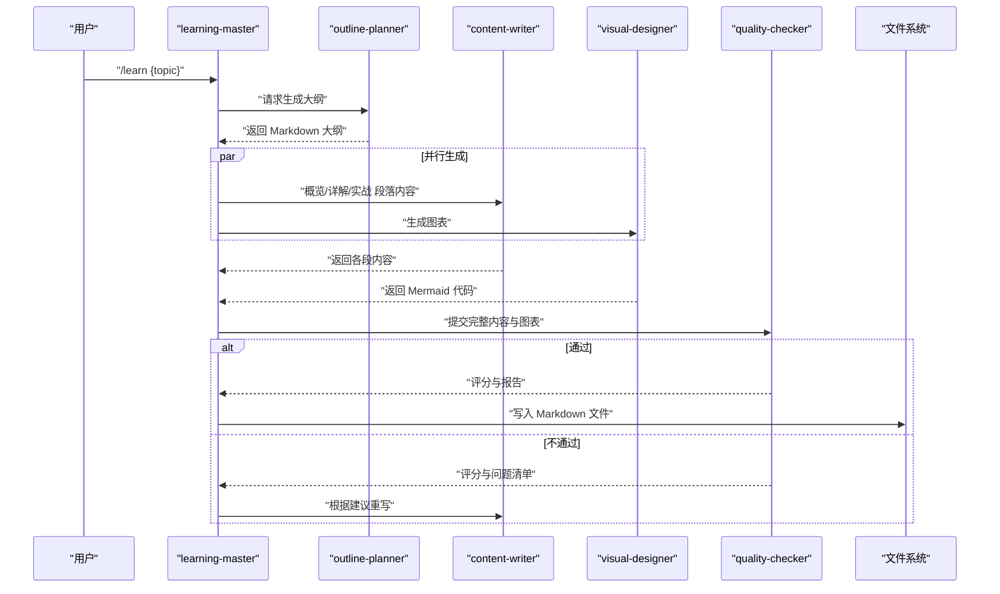
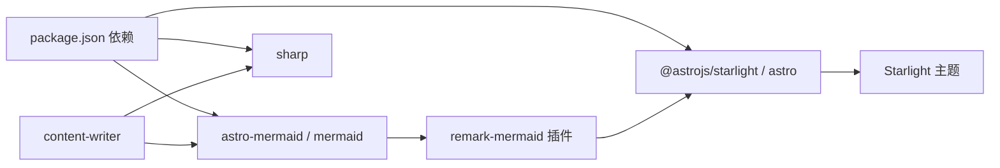

# 内容撰写器

<cite>
**本文引用的文件**
- [package.json](file://package.json)
- [src/content.config.ts](file://src/content.config.ts)
- [docs/01-PROJECT-BRIEF.md](file://docs/01-PROJECT-BRIEF.md)
- [docs/03-ARCHITECTURE.md](file://docs/03-ARCHITECTURE.md)
- [docs/04-AI-SKILL-SPEC.md](file://docs/04-AI-SKILL-SPEC.md)
- [src/content/docs/tools/ai-coding/index.md](file://src/content/docs/tools/ai-coding/index.md)
- [src/content/docs/domains/backend/index.md](file://src/content/docs/domains/backend/index.md)
- [src/content/docs/methods/learning/index.md](file://src/content/docs/methods/learning/index.md)
</cite>

## 目录
1. [引言](#引言)
2. [项目结构](#项目结构)
3. [核心组件](#核心组件)
4. [架构总览](#架构总览)
5. [详细组件分析](#详细组件分析)
6. [依赖分析](#依赖分析)
7. [性能考量](#性能考量)
8. [故障排除指南](#故障排除指南)
9. [结论](#结论)
10. [附录](#附录)

## 引言
本文件围绕“内容撰写器”（content-writer）进行系统化说明，目标是帮助读者理解该组件如何依据学习主题与大纲生成结构化的学习材料，并将其组织为可读性强、便于检索的 Markdown 文档。文档重点涵盖：
- 撰写算法与内容组织方式
- Markdown 输出格式、段落结构与知识点呈现
- 配置选项与风格设置
- 与图表生成器的协作机制与可视化集成
- 不同学科领域的写作示例与模板
- 内容质量评估标准与改进建议
- 为开发者提供的自定义写作风格与扩展能力的方法

## 项目结构
StudyBuddy 采用 Astro + Starlight 的静态站点架构，内容以纯 Markdown 形式组织，辅以 Mermaid 图表渲染与自定义样式。content-writer 作为 AI Skill 体系中的一个子 Skill，负责将“大纲规划”阶段产出的 Markdown 大纲转换为三阶段（概览/详解/实战）的结构化内容。

**图示来源**
- [docs/03-ARCHITECTURE.md](file://docs/03-ARCHITECTURE.md#L12-L69)
- [docs/04-AI-SKILL-SPEC.md](file://docs/04-AI-SKILL-SPEC.md#L19-L73)

**章节来源**
- [package.json](file://package.json#L12-L18)
- [src/content.config.ts](file://src/content.config.ts#L1-L8)
- [docs/03-ARCHITECTURE.md](file://docs/03-ARCHITECTURE.md#L164-L221)

## 核心组件
- 学习主控（learning-master）：编排与调度，协调 Analyzer、Planner、Writer、Designer、Checker 的执行顺序与数据传递。
- 主题分析（topic-analyzer）：对输入主题进行结构化解析，输出 JSON 元数据，包括主题、slug、前置知识、复杂度、建议图表类型等。
- 大纲规划（outline-planner）：基于分析结果生成三阶段大纲，包含 Frontmatter 与章节标题、图表标记位。
- 内容撰写（content-writer）：依据大纲与分段参数，生成概览、详解、实战三个阶段的内容；并遵循 MCP 数据源优先级，确保时效与准确性。
- 图表生成（visual-designer）：根据大纲与图表标记位生成 Mermaid 代码，用于知识体系概览与流程说明。
- 质量检查（quality-checker）：对完整内容进行结构、内容、格式三维度评分与反馈，决定是否输出或回退重试。

**章节来源**
- [docs/04-AI-SKILL-SPEC.md](file://docs/04-AI-SKILL-SPEC.md#L75-L85)
- [docs/04-AI-SKILL-SPEC.md](file://docs/04-AI-SKILL-SPEC.md#L390-L532)
- [docs/04-AI-SKILL-SPEC.md](file://docs/04-AI-SKILL-SPEC.md#L535-L606)
- [docs/04-AI-SKILL-SPEC.md](file://docs/04-AI-SKILL-SPEC.md#L609-L716)

## 架构总览
content-writer 在整体流程中的职责与交互如下：

**图示来源**
- [docs/03-ARCHITECTURE.md](file://docs/03-ARCHITECTURE.md#L86-L126)
- [docs/04-AI-SKILL-SPEC.md](file://docs/04-AI-SKILL-SPEC.md#L159-L172)

## 详细组件分析

### 撰写算法与内容组织
- 输入：大纲 Markdown（含 Frontmatter 与章节结构）、分段参数（概览/详解/实战）、MCP 数据源（Context7/WebSearch/WebFetch）。
- 输出：结构化 Markdown 内容，包含三阶段章节、图表占位、速查表、扩展阅读等。
- 组织方式：
  - 概览阶段：一句话定义、核心问题、适用场景、前置知识、思维导图占位。
  - 详解阶段：每个核心概念按“是什么/为什么/怎么用”展开，配合最小示例、速查表与常见陷阱。
  - 实战阶段：按难度分级（初级/中级/高级），提供任务描述、思路提示、参考答案或完整代码。
- 数据来源优先级：官方文档（Context7）> 官方网站（WebFetch）> 社区资源（WebSearch）> 模型内置知识。

**章节来源**
- [docs/04-AI-SKILL-SPEC.md](file://docs/04-AI-SKILL-SPEC.md#L390-L532)
- [docs/04-AI-SKILL-SPEC.md](file://docs/04-AI-SKILL-SPEC.md#L106-L126)

### Markdown 输出格式与段落结构
- Frontmatter：包含标题、描述、分类、难度、标签、时长等元信息。
- 章节结构：
  - 概览（约 5 分钟）
  - 分章节详解（约 60 分钟）
  - 联动应用（约 25 分钟）
  - 速查表
  - 扩展阅读
- 图表标记：在概览与实战章节使用“<!-- DIAGRAM: type -->”占位，交由 visual-designer 生成对应 Mermaid 代码。
- 示例与速查表：每个概念提供最小可运行示例与实用表格，帮助快速检索与应用。

**章节来源**
- [docs/04-AI-SKILL-SPEC.md](file://docs/04-AI-SKILL-SPEC.md#L291-L344)
- [docs/04-AI-SKILL-SPEC.md](file://docs/04-AI-SKILL-SPEC.md#L408-L443)
- [docs/04-AI-SKILL-SPEC.md](file://docs/04-AI-SKILL-SPEC.md#L445-L493)
- [docs/04-AI-SKILL-SPEC.md](file://docs/04-AI-SKILL-SPEC.md#L495-L531)

### 知识点呈现与表达方式
- 语言风格：专业但易懂，避免术语堆砌；使用类比帮助初学者理解。
- 结构化呈现：每概念三要素（是什么/为什么/怎么用）；实战分级（初级/中级/高级）。
- 可检索性：提供速查表与扩展阅读，便于复习与延伸学习。
- 数据来源标注：涉及时效性信息时，必须标注数据来源（如“来源：官方文档 vXX”）。

**章节来源**
- [docs/04-AI-SKILL-SPEC.md](file://docs/04-AI-SKILL-SPEC.md#L422-L443)
- [docs/04-AI-SKILL-SPEC.md](file://docs/04-AI-SKILL-SPEC.md#L475-L493)

### 配置选项与风格设置
- Mermaid 集成：通过 Astro 的 remark 插件启用 Mermaid 渲染，支持多种图表类型（思维导图、流程图、时序图、类图、状态图）。
- 自定义样式：通过 Starlight 主题与自定义 CSS 实现统一视觉风格，提升可读性与记忆点。
- 文档分类：工具/领域/方法论三层分类体系，路径与命名规范明确，便于维护与扩展。

**章节来源**
- [docs/03-ARCHITECTURE.md](file://docs/03-ARCHITECTURE.md#L244-L275)
- [docs/03-ARCHITECTURE.md](file://docs/03-ARCHITECTURE.md#L223-L240)

### 与图表生成器的协作机制与可视化集成
- 协作流程：outline-planner 在大纲中标注图表位置，visual-designer 读取大纲与标记生成 Mermaid 代码，content-writer 将图表嵌入相应章节。
- 图表类型规范：mindmap（知识体系概览）、flowchart（使用步骤/决策流程）、sequenceDiagram（交互过程）、classDiagram（类关系）等。
- 渲染与优化：Astro 构建时解析 Markdown 并渲染 Mermaid，结合懒加载与缓存策略提升首屏性能。

**章节来源**
- [docs/04-AI-SKILL-SPEC.md](file://docs/04-AI-SKILL-SPEC.md#L535-L606)
- [docs/03-ARCHITECTURE.md](file://docs/03-ARCHITECTURE.md#L244-L275)

### 不同学科领域的写作示例与模板
- 示例文档路径（纯 Markdown）：
  - AI 编程工具：[src/content/docs/tools/ai-coding/index.md](file://src/content/docs/tools/ai-coding/index.md)
  - 后端开发：[src/content/docs/domains/backend/index.md](file://src/content/docs/domains/backend/index.md)
  - 学习方法：[src/content/docs/methods/learning/index.md](file://src/content/docs/methods/learning/index.md)
- 模板参考：
  - 概览段模板：[docs/04-AI-SKILL-SPEC.md](file://docs/04-AI-SKILL-SPEC.md#L408-L443)
  - 详解段模板：[docs/04-AI-SKILL-SPEC.md](file://docs/04-AI-SKILL-SPEC.md#L445-L493)
  - 实战段模板：[docs/04-AI-SKILL-SPEC.md](file://docs/04-AI-SKILL-SPEC.md#L495-L531)

**章节来源**
- [src/content/docs/tools/ai-coding/index.md](file://src/content/docs/tools/ai-coding/index.md#L1-L7)
- [src/content/docs/domains/backend/index.md](file://src/content/docs/domains/backend/index.md#L1-L7)
- [src/content/docs/methods/learning/index.md](file://src/content/docs/methods/learning/index.md#L1-L7)
- [docs/04-AI-SKILL-SPEC.md](file://docs/04-AI-SKILL-SPEC.md#L408-L531)

### 内容质量评估标准与改进建议
- 结构检查（30 分）：三阶段完整、每概念三要素、难度分级清晰。
- 内容检查（40 分）：定义通俗、类比恰当、示例可运行、速查表实用。
- 格式检查（30 分）：Markdown 语法正确、表格规范、Mermaid 可渲染。
- 评分标准：90-100 优秀，80-89 良好，70-79 一般，<70 不合格。
- 改进建议：针对问题清单逐项修正，必要时简化图表层级、补充示例类型或调整语言风格。

**章节来源**
- [docs/04-AI-SKILL-SPEC.md](file://docs/04-AI-SKILL-SPEC.md#L609-L716)

### 开发者自定义与扩展
- 自定义写作风格：通过调整 content-writer 的 Prompt 模板，改变语言风格、类比方式与示例长度限制。
- 扩展内容生成能力：新增领域/方法/工具分类时，遵循命名规范与 Frontmatter 字段，保证构建与导航一致性。
- 图表扩展：在 visual-designer 中增加新的图表类型模板，或引入新的可视化组件（如自定义 Astro 组件）。
- 质量检查增强：在 quality-checker 中扩展检查项（如可读性、术语一致性、跨语言一致性等）。

**章节来源**
- [docs/03-ARCHITECTURE.md](file://docs/03-ARCHITECTURE.md#L386-L407)
- [docs/04-AI-SKILL-SPEC.md](file://docs/04-AI-SKILL-SPEC.md#L609-L716)

## 依赖分析
- 外部依赖：Astro、Starlight、Mermaid、remark-mermaid、sharp。
- 内部耦合：content-writer 与 outline-planner（输入大纲）、visual-designer（图表生成）、quality-checker（质量反馈）存在直接协作关系。
- 配置耦合：Mermaid 渲染依赖 Astro 的 remark 插件配置；内容加载依赖 Starlight 的文档加载器与 Schema。

**图示来源**
- [package.json](file://package.json#L12-L18)
- [docs/03-ARCHITECTURE.md](file://docs/03-ARCHITECTURE.md#L244-L264)

**章节来源**
- [package.json](file://package.json#L12-L18)
- [src/content.config.ts](file://src/content.config.ts#L1-L8)

## 性能考量
- 构建优化：增量构建、图片优化、代码分割。
- 运行时优化：静态生成、CDN 缓存、懒加载图表。
- 生成性能：content-writer 生成时间控制在 30 秒内，质量检查评分不低于 80 分，失败最多重试 2 次。

**章节来源**
- [docs/01-PROJECT-BRIEF.md](file://docs/01-PROJECT-BRIEF.md#L112-L120)
- [docs/04-AI-SKILL-SPEC.md](file://docs/04-AI-SKILL-SPEC.md#L174-L202)

## 故障排除指南
- 生成超时：若超过 60 秒，返回部分结果；检查网络与 MCP 工具可用性。
- 质量不达标：根据质量检查报告逐项修正，必要时简化图表或补充示例。
- 图表语法错误：简化图表层级，确保节点文字简洁且语法正确。
- 大纲不完整：自动补充缺失章节，确保三阶段结构齐全。

**章节来源**
- [docs/04-AI-SKILL-SPEC.md](file://docs/04-AI-SKILL-SPEC.md#L777-L800)

## 结论
content-writer 通过严格的三阶段结构化写作与 MCP 数据源保障，实现了高效、可检索、可复用的学习材料生成。其与 visual-designer 的协作进一步提升了知识可视化水平，配合质量检查与性能优化策略，满足了“管理者视角”的学习需求。开发者可在现有模板基础上灵活定制风格与扩展能力，持续提升内容质量与用户体验。

## 附录
- 项目范围与技术栈：[docs/01-PROJECT-BRIEF.md](file://docs/01-PROJECT-BRIEF.md#L61-L71)
- 目录结构与命名规范：[docs/03-ARCHITECTURE.md](file://docs/03-ARCHITECTURE.md#L164-L240)
- Mermaid 集成配置：[docs/03-ARCHITECTURE.md](file://docs/03-ARCHITECTURE.md#L244-L264)