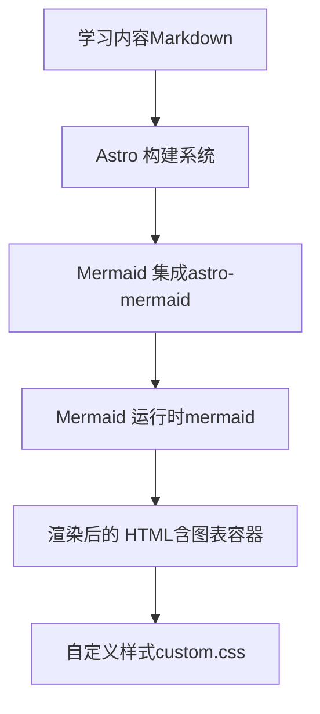
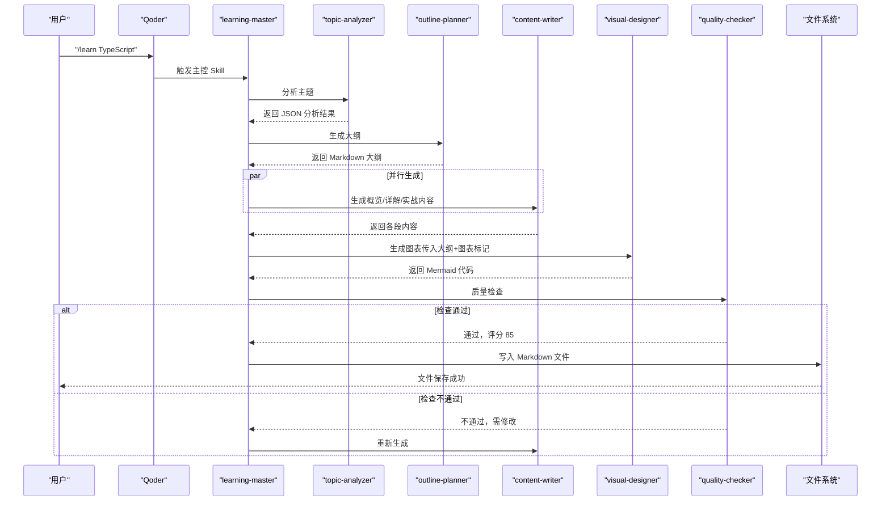
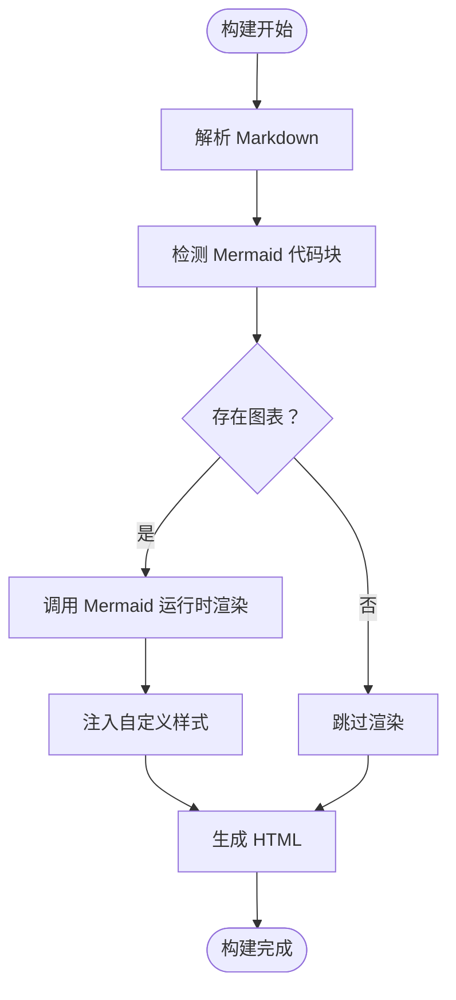
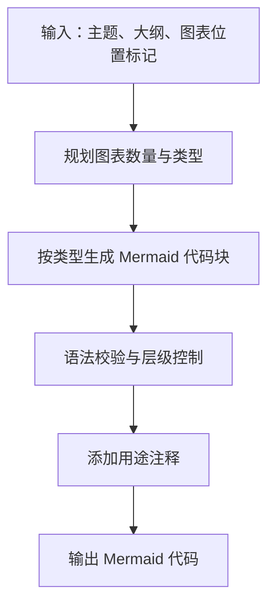
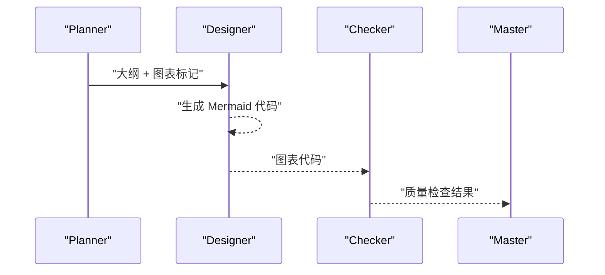
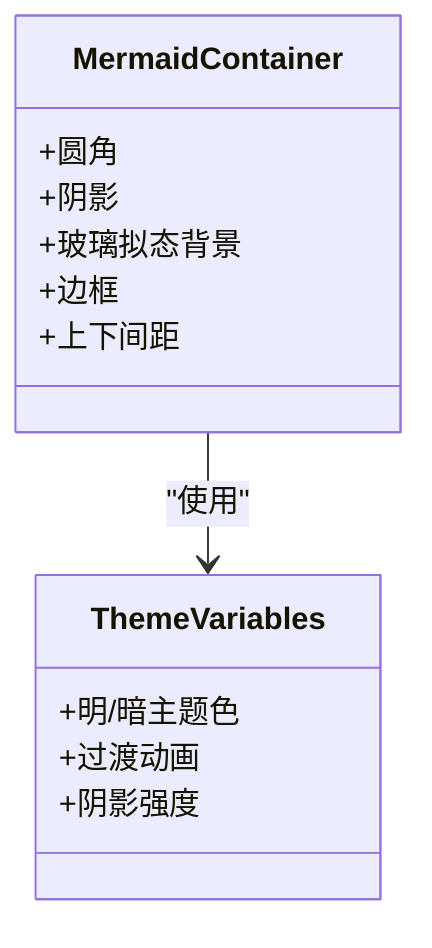
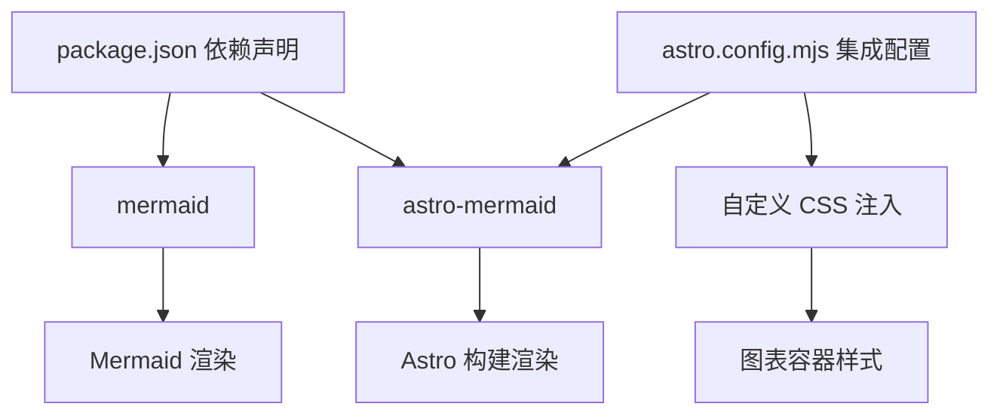

# 图表设计器

<cite>
**本文引用的文件**
- [astro.config.mjs](file://astro.config.mjs)
- [package.json](file://package.json)
- [custom.css](file://src/styles/custom.css)
- [03-ARCHITECTURE.md](file://docs/03-ARCHITECTURE.md)
- [04-AI-SKILL-SPEC.md](file://docs/04-AI-SKILL-SPEC.md)
- [index.md](file://src/content/docs/tools/ai-coding/index.md)
- [index.md](file://src/content/docs/methods/learning/index.md)
</cite>

## 目录
1. [简介](#简介)
2. [项目结构](#项目结构)
3. [核心组件](#核心组件)
4. [架构总览](#架构总览)
5. [详细组件分析](#详细组件分析)
6. [依赖分析](#依赖分析)
7. [性能考虑](#性能考虑)
8. [故障排除指南](#故障排除指南)
9. [结论](#结论)
10. [附录](#附录)

## 简介
本文件面向“图表设计器（visual-designer）”能力，系统化说明其在学习内容中创建 Mermaid 可视化图表的设计与实现。文档覆盖图表类型、语法规范、生成算法、与内容撰写器的集成方式、图表嵌入机制、样式与主题配置、渲染性能与兼容性、最佳实践与扩展方法等，帮助开发者与内容创作者高效地将 Mermaid 图表融入学习文档。

## 项目结构
图表设计器位于整体文档生成流水线中的“可视化生成”环节，负责根据大纲与图表标记生成 Mermaid 代码，并由站点构建系统统一渲染为可交互的图表。Mermaid 的集成通过 Astro 的 mermaid 集成与自定义样式共同实现。

**图表来源**
- [astro.config.mjs](file://astro.config.mjs#L1-L33)
- [package.json](file://package.json#L12-L18)
- [custom.css](file://src/styles/custom.css#L261-L269)

**章节来源**
- [astro.config.mjs](file://astro.config.mjs#L1-L33)
- [package.json](file://package.json#L12-L18)
- [03-ARCHITECTURE.md](file://docs/03-ARCHITECTURE.md#L128-L160)

## 核心组件
- Mermaid 集成层
  - 通过 Astro 配置启用 mermaid 集成，确保 Markdown 中的 Mermaid 代码块被识别并渲染。
  - 配置项包括：集成注册、自定义 CSS 注入、国际化与侧边栏等。
- Mermaid 运行时
  - 依赖 mermaid 核心库，负责解析 Mermaid 语法并渲染为 SVG/HTML。
- 样式层
  - 通过自定义 CSS 为图表容器提供统一的圆角、阴影、玻璃拟态背景与边框，提升阅读体验。
- 图表生成器（visual-designer）
  - 职责：基于主题、大纲与图表标记，生成符合规范的 Mermaid 代码块。
  - 图表类型：mindmap、flowchart、sequenceDiagram、classDiagram 等。
  - 输出：直接输出 Mermaid 代码块，每个图表附带用途注释，确保语法正确且可直接渲染。

**章节来源**
- [astro.config.mjs](file://astro.config.mjs#L8-L31)
- [package.json](file://package.json#L12-L18)
- [04-AI-SKILL-SPEC.md](file://docs/04-AI-SKILL-SPEC.md#L535-L605)
- [custom.css](file://src/styles/custom.css#L261-L269)

## 架构总览
图表设计器在整体文档生成流水线中的位置如下：

**图表来源**
- [03-ARCHITECTURE.md](file://docs/03-ARCHITECTURE.md#L86-L126)

**章节来源**
- [03-ARCHITECTURE.md](file://docs/03-ARCHITECTURE.md#L82-L126)

## 详细组件分析

### 组件一：Mermaid 集成与渲染
- 集成方式
  - 在 Astro 配置中注册 mermaid 集成，启用 Mermaid 图表渲染。
  - 同时通过 Starlight 注入自定义 CSS，保证图表容器风格一致。
- 渲染流程
  - 构建阶段：Astro 将 Markdown 中的 Mermaid 代码块交给 Mermaid 运行时解析。
  - 运行时：Mermaid 解析语法并生成 SVG/HTML，插入到页面中。
  - 样式：自定义 CSS 为图表容器提供圆角、阴影、玻璃拟态背景与边框。
- 兼容性
  - 依赖 mermaid 核心库版本，确保语法与渲染行为稳定。

**图表来源**
- [astro.config.mjs](file://astro.config.mjs#L8-L31)
- [package.json](file://package.json#L12-L18)
- [custom.css](file://src/styles/custom.css#L261-L269)

**章节来源**
- [astro.config.mjs](file://astro.config.mjs#L8-L31)
- [package.json](file://package.json#L12-L18)
- [custom.css](file://src/styles/custom.css#L261-L269)

### 组件二：图表类型与语法规范
- 支持的图表类型
  - mindmap：知识体系概览
  - flowchart：使用步骤、决策流程
  - sequenceDiagram：交互过程、API 调用
  - classDiagram：数据结构、类关系
  - stateDiagram-v2：状态机、生命周期
- 生成约束
  - 每个主题至少生成 2 个图表
  - 节点文字简洁（不超过 10 字）
  - 避免过深的层级（mindmap 最多 3 层）
  - 确保语法正确，可直接渲染
- 输出格式
  - 直接输出 Mermaid 代码块，每个图表带用途注释，便于维护与溯源。

**图表来源**
- [04-AI-SKILL-SPEC.md](file://docs/04-AI-SKILL-SPEC.md#L545-L605)

**章节来源**
- [04-AI-SKILL-SPEC.md](file://docs/04-AI-SKILL-SPEC.md#L545-L605)

### 组件三：与内容撰写器的集成与图表嵌入
- 数据传递
  - Planner → Designer：传递 Markdown 大纲 + 图表标记
  - Designer → Checker：返回 Mermaid 代码
  - Checker → Master：返回质量检查报告
- 图表嵌入机制
  - Mermaid 代码块直接嵌入到 Markdown 正文中，构建时自动渲染。
  - 图表容器样式由自定义 CSS 控制，确保视觉一致性。
- 示例路径
  - 示例文档展示了 Markdown 的基本结构，图表可按相同方式嵌入。

**图表来源**
- [03-ARCHITECTURE.md](file://docs/03-ARCHITECTURE.md#L723-L760)
- [04-AI-SKILL-SPEC.md](file://docs/04-AI-SKILL-SPEC.md#L762-L773)

**章节来源**
- [03-ARCHITECTURE.md](file://docs/03-ARCHITECTURE.md#L723-L773)
- [04-AI-SKILL-SPEC.md](file://docs/04-AI-SKILL-SPEC.md#L762-L773)

### 组件四：样式与主题配置
- 图表容器样式
  - 圆角、阴影、玻璃拟态背景、边框、上下间距等，统一视觉风格。
- 主题适配
  - 支持明暗主题切换，颜色变量随主题变化，确保对比度与可读性。
- 自定义 CSS 注入
  - 通过 Astro 配置注入自定义 CSS，确保 Mermaid 图表容器样式生效。

**图表来源**
- [custom.css](file://src/styles/custom.css#L261-L269)
- [custom.css](file://src/styles/custom.css#L5-L31)

**章节来源**
- [custom.css](file://src/styles/custom.css#L5-L31)
- [custom.css](file://src/styles/custom.css#L261-L269)

## 依赖分析
- 运行时依赖
  - mermaid：核心渲染引擎，负责解析 Mermaid 语法并生成图形。
  - astro-mermaid：Astro 集成，使 Mermaid 图表在构建时自动渲染。
- 构建与样式
  - Astro 配置注册 mermaid 集成与自定义 CSS 注入。
  - Starlight 提供主题与本地化支持，统一站点风格。

**图表来源**
- [package.json](file://package.json#L12-L18)
- [astro.config.mjs](file://astro.config.mjs#L8-L31)
- [custom.css](file://src/styles/custom.css#L261-L269)

**章节来源**
- [package.json](file://package.json#L12-L18)
- [astro.config.mjs](file://astro.config.mjs#L8-L31)

## 性能考虑
- 渲染性能
  - Mermaid 图表在构建阶段一次性渲染，运行时无需重复解析，降低前端开销。
  - 控制节点数量与层级深度，避免复杂布局导致渲染卡顿。
- 资源体积
  - 仅引入 mermaid 与 astro-mermaid 必需依赖，减少包体积。
  - 自定义 CSS 仅针对图表容器，避免全局样式污染。
- 兼容性
  - 使用稳定版本的 mermaid 核心库，确保语法与渲染行为一致。
  - 在不同浏览器中测试图表渲染，确保跨平台可用。

[本节为通用指导，不直接分析具体文件，故无“章节来源”]

## 故障排除指南
- Mermaid 语法错误
  - 症状：图表不显示或报错。
  - 处理：简化图表结构，逐段验证语法；遵循节点文字长度与层级限制。
- 渲染异常
  - 症状：图表样式缺失或错位。
  - 处理：确认自定义 CSS 已注入；检查主题变量是否正确加载。
- 超时与回退
  - 症状：生成时间过长。
  - 处理：回退到简化图表结构；限制节点数量与层级；必要时返回部分结果。

**章节来源**
- [04-AI-SKILL-SPEC.md](file://docs/04-AI-SKILL-SPEC.md#L777-L800)

## 结论
图表设计器通过标准化的 Mermaid 图表类型与严格的生成约束，结合 Astro 的 mermaid 集成与自定义样式，实现了从内容到可视化的高效闭环。该方案具备良好的可维护性、可扩展性与跨平台兼容性，适合在学习型知识库中大规模应用。

[本节为总结性内容，不直接分析具体文件，故无“章节来源”]

## 附录

### A. 图表类型与模板速览
- mindmap：知识体系概览
- flowchart：使用步骤、决策流程
- sequenceDiagram：交互过程、API 调用
- classDiagram：数据结构、类关系
- stateDiagram-v2：状态机、生命周期

**章节来源**
- [04-AI-SKILL-SPEC.md](file://docs/04-AI-SKILL-SPEC.md#L547-L552)
- [03-ARCHITECTURE.md](file://docs/03-ARCHITECTURE.md#L266-L274)

### B. 配置参数与样式设置
- Astro 集成
  - 注册 mermaid 集成与自定义 CSS 注入。
- Mermaid 样式
  - 图表容器圆角、阴影、玻璃拟态背景、边框与间距。
- 主题变量
  - 明/暗主题色、过渡动画、阴影强度等。

**章节来源**
- [astro.config.mjs](file://astro.config.mjs#L8-L31)
- [custom.css](file://src/styles/custom.css#L5-L31)
- [custom.css](file://src/styles/custom.css#L261-L269)

### C. 最佳实践与扩展建议
- 最佳实践
  - 保持节点文字简洁，避免过深层级；优先使用高频图表类型。
  - 在图表代码块中添加用途注释，便于维护与溯源。
  - 控制节点数量，确保渲染性能与可读性平衡。
- 扩展建议
  - 新增图表类型时，先在草稿中验证语法与渲染效果。
  - 通过自定义 CSS 扩展图表容器样式，保持与站点主题一致。
  - 对复杂图表采用分步生成策略，逐步完善细节。

[本节为通用指导，不直接分析具体文件，故无“章节来源”]