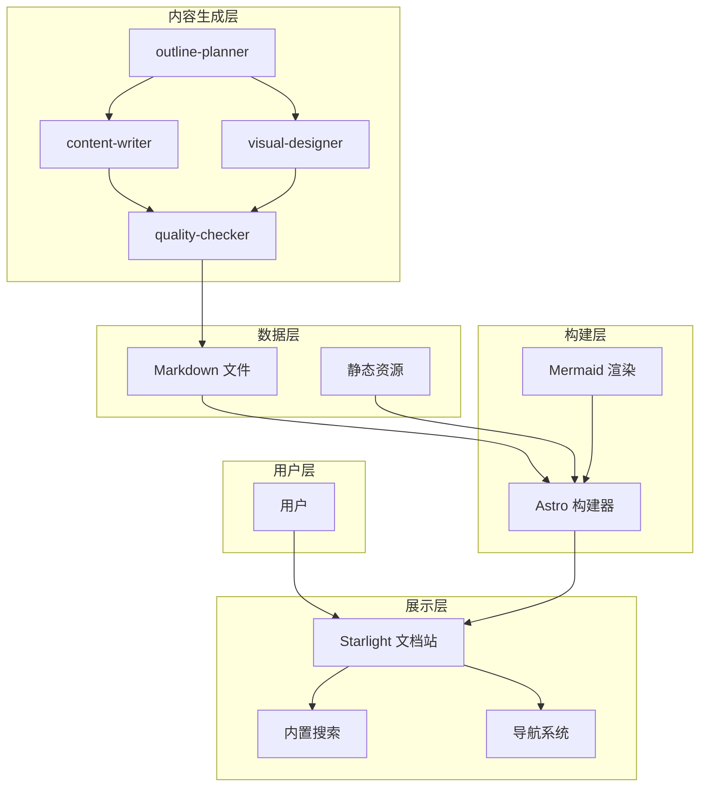
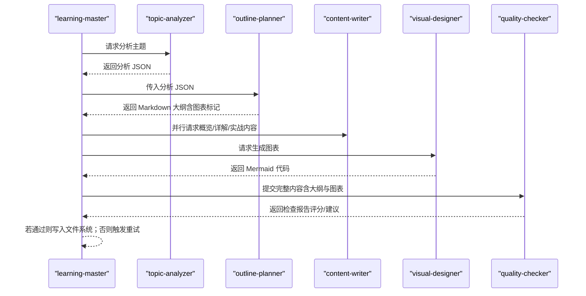
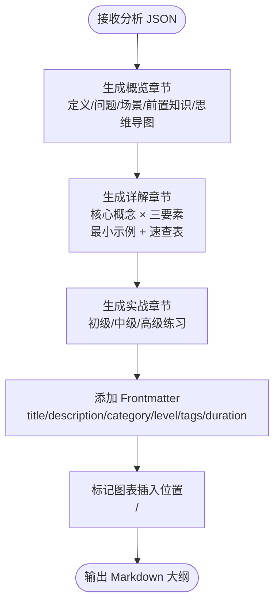
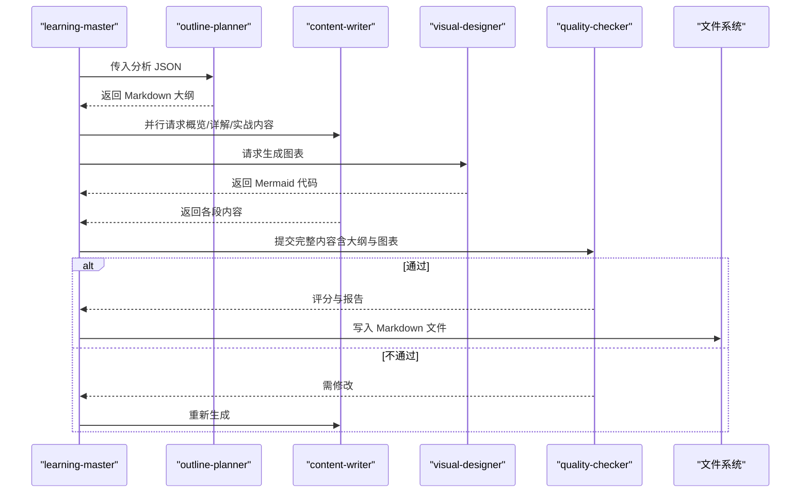
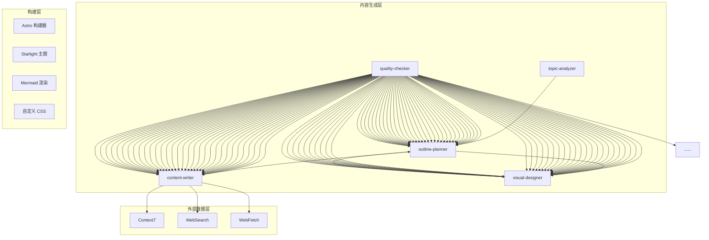
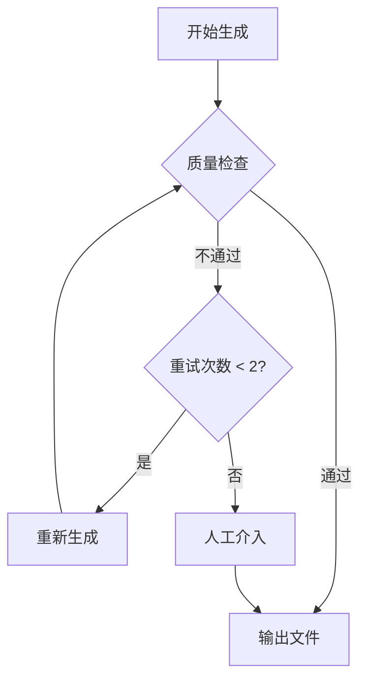

# 大纲规划器

<cite>
**本文引用的文件**
- [项目简介.md](file://docs/01-PROJECT-BRIEF.md)
- [技术架构设计.md](file://docs/03-ARCHITECTURE.md)
- [AI Skill 规格说明.md](file://docs/04-AI-SKILL-SPEC.md)
- [astro.config.mjs](file://astro.config.mjs)
- [src/content.config.ts](file://src/content.config.ts)
- [custom.css](file://src/styles/custom.css)
</cite>

## 目录
1. [引言](#引言)
2. [项目结构](#项目结构)
3. [核心组件](#核心组件)
4. [架构总览](#架构总览)
5. [详细组件分析](#详细组件分析)
6. [依赖分析](#依赖分析)
7. [性能考量](#性能考量)
8. [故障排查指南](#故障排查指南)
9. [结论](#结论)
10. [附录](#附录)

## 引言
本文件面向“大纲规划器（outline-planner）”的使用者与开发者，系统化阐述其在 StudyBuddy 项目中的职责、算法与结构设计、三阶段学习框架（概览→详解→实战）的组织原则、大纲模板与内容组织逻辑、与内容撰写器的协作机制与数据传递格式、配置参数与自定义选项、不同主题类型的大纲示例与最佳实践、质量评估与优化建议，以及扩展规划能力与自定义学习路径的方法。

## 项目结构
- 项目采用 Astro + Starlight 的静态站点架构，文档内容以 Markdown 形式组织，辅以 Mermaid 图表与自定义样式。
- 大纲规划器作为 AI Skill 之一，位于“内容生成层”，负责将主题分析结果转换为符合三阶段框架的结构化大纲，并标记图表插入位置。
- 构建层通过 Astro 将 Markdown 与 Mermaid 渲染为静态 HTML，提供本地搜索与导航体验。

**图表来源**
- [技术架构设计.md](file://docs/03-ARCHITECTURE.md#L12-L69)

**章节来源**
- [技术架构设计.md](file://docs/03-ARCHITECTURE.md#L164-L222)
- [astro.config.mjs](file://astro.config.mjs#L1-L34)
- [src/content.config.ts](file://src/content.config.ts#L1-L8)

## 核心组件
- 大纲规划器（outline-planner）：接收主题分析 JSON，输出带 Frontmatter 的 Markdown 大纲，标记图表插入位置，遵循三阶段学习框架的时间分配约束。
- 内容撰写器（content-writer）：按段落（概览/详解/实战）并行生成内容，结合 MCP 工具获取最新信息，确保内容时效性与准确性。
- 可视化设计（visual-designer）：依据大纲标记生成 Mermaid 图表，提供思维导图与流程图等可视化素材。
- 质量检查（quality-checker）：对完整内容进行结构、内容与格式检查，输出评分与改进建议，决定是否进入文件系统或触发重试。

**章节来源**
- [AI Skill 规格说明.md](file://docs/04-AI-SKILL-SPEC.md#L281-L387)
- [AI Skill 规格说明.md](file://docs/04-AI-SKILL-SPEC.md#L390-L532)
- [AI Skill 规格说明.md](file://docs/04-AI-SKILL-SPEC.md#L535-L606)
- [AI Skill 规格说明.md](file://docs/04-AI-SKILL-SPEC.md#L609-L716)

## 架构总览
大纲规划器在整体流程中的作用如下：
- 输入：主题分析 JSON（由 topic-analyzer 产出）
- 处理：生成三阶段大纲（概览、详解、实战），并在合适位置标记图表插入点
- 输出：Markdown 大纲（带 Frontmatter），供 content-writer 与 visual-designer 使用

**图表来源**
- [技术架构设计.md](file://docs/03-ARCHITECTURE.md#L86-L126)
- [AI Skill 规格说明.md](file://docs/04-AI-SKILL-SPEC.md#L719-L776)

## 详细组件分析

### 大纲规划器（outline-planner）
- 职责：基于主题分析结果，生成符合三阶段学习框架的大纲，控制总时长与每阶段节奏。
- 输入：主题分析 JSON（包含主题、slug、一句话定义、解决的问题、使用场景、前置知识、复杂度、预计章节、核心概念、分类、建议图表类型等）。
- 输出：带 Frontmatter 的 Markdown 大纲，包含三阶段标题与子节结构，并在适当位置以“图表标记”指示后续插入思维导图与流程图的位置。
- 约束与时间分配：
  - 概览阶段：约 5 分钟，聚焦“是什么/为什么/何时用”，并插入思维导图。
  - 详解阶段：约 60 分钟，按核心概念拆分，每个概念“是什么/为什么/怎么用”，并提供最小示例与速查表。
  - 实战阶段：约 25 分钟，按难度分级（初级/中级/高级）设计练习与项目实战。
  - 总时长不超过 90 分钟。

**图表来源**
- [AI Skill 规格说明.md](file://docs/04-AI-SKILL-SPEC.md#L291-L386)

**章节来源**
- [AI Skill 规格说明.md](file://docs/04-AI-SKILL-SPEC.md#L281-L387)

### 三阶段学习框架与层次组织原则
- 概览（5 分钟）：帮助学习者快速建立全局认知，包含“一句话定义、核心问题、适用场景、前置知识”，并插入思维导图以呈现知识体系全貌。
- 详解（60 分钟）：对每个核心概念进行“是什么/为什么/怎么用”的结构化讲解，提供最小可运行示例与速查表，避免深入底层实现。
- 实战（25 分钟）：按难度分级设计练习与项目实战，从单一特性到组合应用再到完整项目，逐步提升应用能力。

**章节来源**
- [AI Skill 规格说明.md](file://docs/04-AI-SKILL-SPEC.md#L359-L386)

### 大纲模板与内容组织
- Frontmatter 字段：title、description、category、level、tags、duration 等，用于文档元数据与分类。
- 概览章节：包含“一句话定义、核心问题、适用场景、前置知识”，并在该节末尾插入思维导图标记。
- 详解章节：按核心概念逐节展开，每节包含“是什么（定义+类比）、为什么（痛点）、怎么用（最小示例+速查表）”。
- 实战章节：按难度分级（初级、中级、高级），提供任务描述、思路提示、参考答案或完整代码。
- 速查表与扩展阅读：在相应位置提供可检索的速查表与扩展阅读材料。

**章节来源**
- [AI Skill 规格说明.md](file://docs/04-AI-SKILL-SPEC.md#L293-L344)

### 与内容撰写器的协作机制与数据传递
- 数据传递格式：
  - 用户 → Master：字符串（如“/learn TypeScript --level=intermediate”）
  - Master → Analyzer：字符串（主题名称）
  - Analyzer → Planner：JSON（分析结果）
  - Planner → Writer：Markdown（大纲模板）
  - Planner → Designer：Markdown（大纲 + 图表标记）
  - Writer → Checker：Markdown（段落内容）
  - Designer → Checker：Mermaid（图表代码）
  - Checker → Master：JSON（检查报告）
- 协作流程：
  - outline-planner 生成大纲后，learning-master 并行调用 content-writer 生成三阶段内容，同时调用 visual-designer 生成图表。
  - content-writer 在撰写时必须结合 MCP 工具获取最新信息，确保版本号、API 参数、安装/配置命令、官方推荐写法等的准确性。
  - quality-checker 对完整内容进行评分与建议，通过后由 Master 写入文件系统。

**图表来源**
- [技术架构设计.md](file://docs/03-ARCHITECTURE.md#L86-L126)
- [AI Skill 规格说明.md](file://docs/04-AI-SKILL-SPEC.md#L719-L776)

**章节来源**
- [AI Skill 规格说明.md](file://docs/04-AI-SKILL-SPEC.md#L719-L776)

### 配置参数与自定义选项
- 主控编排（learning-master）支持的输入参数：
  - topic：学习主题（必填）
  - category：分类（可选，默认自动识别）
  - level：难度（可选，beginner/intermediate/advanced）
- 大纲规划器输出的 Frontmatter 字段：
  - title、description、category、level、tags、duration 等
- 可视化图表标记：
  - 使用“<!-- DIAGRAM: mindmap -->”与“<!-- DIAGRAM: flowchart -->”标记插入位置，便于 visual-designer 生成对应图表。

**章节来源**
- [AI Skill 规格说明.md](file://docs/04-AI-SKILL-SPEC.md#L149-L202)
- [AI Skill 规格说明.md](file://docs/04-AI-SKILL-SPEC.md#L293-L301)
- [AI Skill 规格说明.md](file://docs/04-AI-SKILL-SPEC.md#L309-L310)
- [AI Skill 规格说明.md](file://docs/04-AI-SKILL-SPEC.md#L339)

### 不同主题类型的大纲示例与最佳实践
- 主题类型建议：
  - 工具类（tools）：聚焦“如何使用”与“何时使用”，强调实操与效率。
  - 领域类（domains）：强调知识体系与应用场景，适合三阶段框架。
  - 方法论类（methods）：强调思维框架与方法论，适合概览与实战结合。
- 最佳实践：
  - 概览阶段用“一句话定义 + 场景 + 前置知识 + 思维导图”快速建立全局认知。
  - 详解阶段每个核心概念严格遵循“是什么/为什么/怎么用”，并提供最小示例与速查表。
  - 实战阶段按难度递增设计练习，确保每个练习有明确完成标准与常见错误排查。

**章节来源**
- [项目简介.md](file://docs/01-PROJECT-BRIEF.md#L74-L83)
- [AI Skill 规格说明.md](file://docs/04-AI-SKILL-SPEC.md#L359-L386)

### 大纲质量评估与优化建议
- 质量检查维度（满分 100 分）：
  - 结构检查（30 分）：三阶段完整、每概念三要素齐全、难度分级清晰。
  - 内容检查（40 分）：定义通俗、类比恰当、示例可运行、速查表实用。
  - 格式检查（30 分）：Markdown 语法正确、表格规范、Mermaid 可渲染。
- 评分标准：
  - 90-100：优秀，可直接发布
  - 80-89：良好，小问题可接受
  - 70-79：一般，需要修改
  - <70：不合格，需重新生成
- 优化建议：
  - 增强“速查表”的实用性，覆盖高频操作与常见错误。
  - 精简示例代码，确保可运行且与官方文档一致。
  - 优化图表标记与布局，避免层级过深与节点冗长。

**章节来源**
- [AI Skill 规格说明.md](file://docs/04-AI-SKILL-SPEC.md#L609-L716)

### 开发者扩展指南：自定义学习路径与规划能力
- 扩展分类与内容组织：
  - 在 src/content/docs/ 下新增目录，配合 astro.config.mjs 的 sidebar 配置添加入口。
  - 通过 Frontmatter 的 category 与 tags 字段实现自动分类与索引。
- 自定义大纲模板：
  - 在 outline-planner 的 Prompt 中扩展三阶段结构，增加特定领域的模板字段（如“架构图”、“最佳实践清单”等）。
  - 通过“图表标记”机制插入自定义图表类型，满足领域可视化需求。
- 自定义质量检查：
  - 在 quality-checker 的检查清单中增加领域特定的检查项（如 API 版本一致性、合规性等）。
  - 通过评分阈值调整与建议条目数量控制，平衡自动化与人工审核。
- 性能与可维护性：
  - 保持大纲模板与内容生成的解耦，通过清晰的数据传递格式与错误回退机制，提升系统的鲁棒性。
  - 利用 Astro 的增量构建与 Mermaid 渲染优化，减少构建时间与首屏加载压力。

**章节来源**
- [技术架构设计.md](file://docs/03-ARCHITECTURE.md#L386-L407)
- [astro.config.mjs](file://astro.config.mjs#L16-L30)
- [AI Skill 规格说明.md](file://docs/04-AI-SKILL-SPEC.md#L777-L800)

## 依赖分析
- 外部数据层（MCP）：
  - Context7：查询官方文档、API 参考，确保版本号与参数的准确性。
  - WebSearch：联网搜索最新资讯与最佳实践。
  - WebFetch：抓取指定网页内容，获取官方示例与教程。
- 内容生成层：
  - outline-planner 依赖 topic-analyzer 的分析 JSON。
  - content-writer 依赖 outline-planner 的大纲模板与 MCP 工具。
  - visual-designer 依赖大纲中的图表标记。
  - quality-checker 依赖完整内容（含大纲与图表）进行评分。
- 构建层：
  - Astro 构建器负责解析 Markdown、渲染 Mermaid、生成 HTML 与优化资源。
  - Starlight 提供主题、搜索与导航能力。
  - 自定义 CSS 提供现代化主题与组件样式。

**图表来源**
- [技术架构设计.md](file://docs/03-ARCHITECTURE.md#L24-L68)
- [AI Skill 规格说明.md](file://docs/04-AI-SKILL-SPEC.md#L86-L126)

**章节来源**
- [技术架构设计.md](file://docs/03-ARCHITECTURE.md#L82-L160)
- [AI Skill 规格说明.md](file://docs/04-AI-SKILL-SPEC.md#L86-L126)

## 性能考量
- 构建优化：
  - Astro 默认支持增量构建，显著减少重复构建时间。
  - 图片优化与代码分割进一步降低首屏 JS 与资源体积。
- 运行时优化：
  - 静态生成零运行时 JS，CDN 边缘缓存可将 TTFB 控制在 50ms 以内。
  - Mermaid 图表懒加载与 Intersection Observer 提升首屏速度。
- 大纲规划器性能：
  - 控制大纲总时长与每节时长，避免生成过长内容导致渲染与检查开销增大。
  - 合理使用图表标记，避免过多图表影响渲染性能。

**章节来源**
- [技术架构设计.md](file://docs/03-ARCHITECTURE.md#L366-L383)
- [AI Skill 规格说明.md](file://docs/04-AI-SKILL-SPEC.md#L198-L202)

## 故障排查指南
- 常见错误与处理：
  - 分析失败：当主题过于模糊时，提示用户细化主题。
  - 大纲不完整：自动补充缺失章节，确保三阶段齐全。
  - 内容质量低：评分低于阈值时触发重试（最多 2 次），必要时人工介入。
  - 图表语法错误：简化图表结构，确保 Mermaid 可正确渲染。
  - 超时：生成时间超过阈值时返回部分结果，保证可用性。
- 回退流程：

**图表来源**
- [AI Skill 规格说明.md](file://docs/04-AI-SKILL-SPEC.md#L789-L800)

**章节来源**
- [AI Skill 规格说明.md](file://docs/04-AI-SKILL-SPEC.md#L777-L800)

## 结论
大纲规划器通过严格的三阶段学习框架与结构化模板，将主题分析结果高效转化为可读性强、可视化丰富、可检索的结构化文档。配合内容撰写器与可视化设计的并行生成、质量检查的闭环控制，以及 Astro 的静态构建与 Mermaid 渲染，实现了从主题到文档的自动化生产流水线。开发者可通过扩展分类、自定义模板与质量检查项，进一步提升系统的灵活性与适配性。

## 附录
- Mermaid 集成与图表类型：
  - Mindmap：知识体系概览
  - Flowchart：使用步骤、决策树
  - SequenceDiagram：交互过程、API 调用
  - ClassDiagram：数据结构、类关系
  - StateDiagram-v2：状态机、生命周期
- 自定义样式与组件：
  - 自定义 CSS 提供现代化主题与组件样式（如速查表、技能等级徽章、Mermaid 图表容器等）。
  - Starlight 提供导航、搜索与文档渲染能力。

**章节来源**
- [技术架构设计.md](file://docs/03-ARCHITECTURE.md#L244-L275)
- [custom.css](file://src/styles/custom.css#L261-L344)