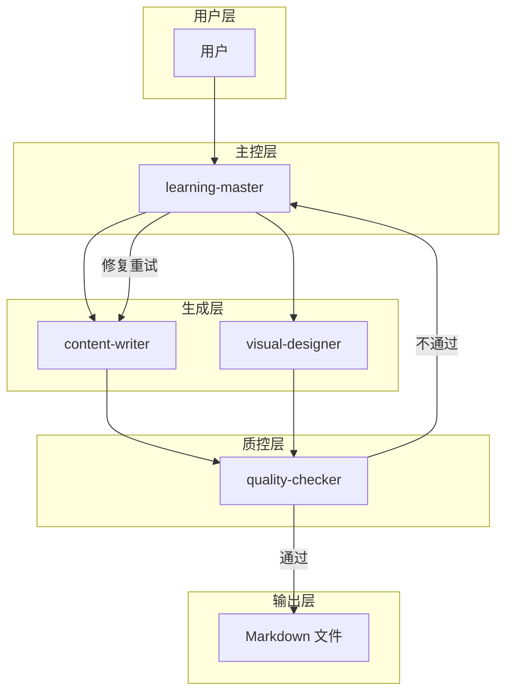
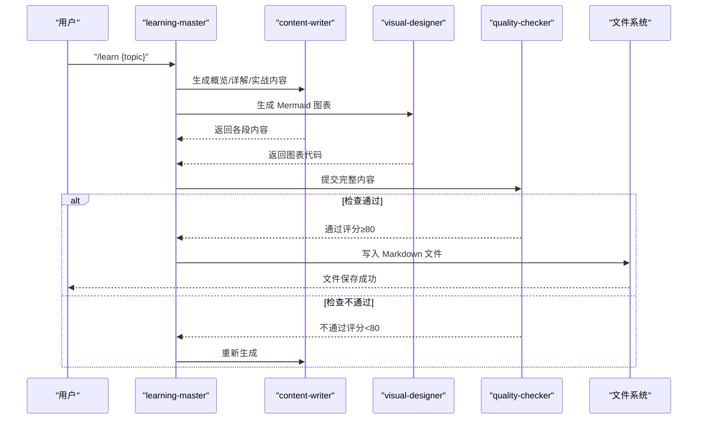
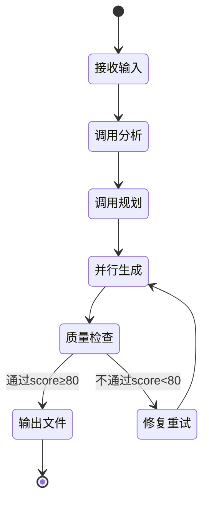
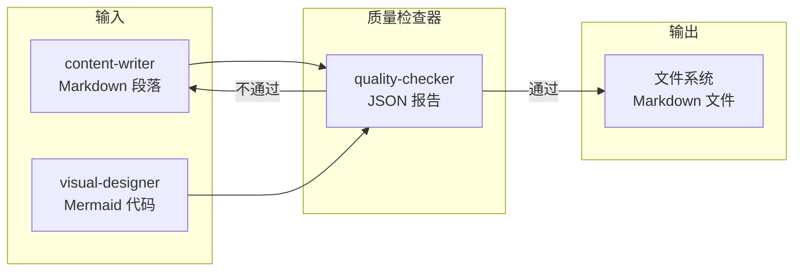

# 质量检查器

<cite>
**本文引用的文件**
- [04-AI-SKILL-SPEC.md](file://docs/04-AI-SKILL-SPEC.md)
- [03-ARCHITECTURE.md](file://docs/03-ARCHITECTURE.md)
- [01-PROJECT-BRIEF.md](file://docs/01-PROJECT-BRIEF.md)
</cite>

## 目录
1. [引言](#引言)
2. [项目结构](#项目结构)
3. [核心组件](#核心组件)
4. [架构总览](#架构总览)
5. [详细组件分析](#详细组件分析)
6. [依赖分析](#依赖分析)
7. [性能考量](#性能考量)
8. [故障排除指南](#故障排除指南)
9. [结论](#结论)
10. [附录](#附录)

## 引言
本文件面向“质量检查器”（quality-checker）技能，系统化阐述其在学习文档生成流水线中的职责、检查标准、评分机制、改进建议与反馈循环。质量检查器作为主控编排层的下游环节，负责对已完成的完整内容进行结构、内容与格式三方面的综合评估，并输出可机器消费的报告，驱动主控层进行修复重试或最终发布。

## 项目结构
质量检查器位于 StudyBuddy 的 AI 技能体系中，与主题分析、大纲规划、内容撰写、图表生成等技能协同工作，形成“并行生成 + 质量检查”的闭环。其输入为完整内容（Markdown），输出为结构化的检查报告（JSON）。

**图示来源**
- [03-ARCHITECTURE.md](file://docs/03-ARCHITECTURE.md#L82-L126)
- [04-AI-SKILL-SPEC.md](file://docs/04-AI-SKILL-SPEC.md#L19-L73)

**章节来源**
- [03-ARCHITECTURE.md](file://docs/03-ARCHITECTURE.md#L1-L70)
- [04-AI-SKILL-SPEC.md](file://docs/04-AI-SKILL-SPEC.md#L19-L85)

## 核心组件
- 质量检查器（quality-checker）
  - 职责：对完整内容进行结构、内容与格式检查，输出评分、分项得分、问题列表与改进建议。
  - 输入：完整内容（Markdown）。
  - 输出：JSON 报告，包含总分、是否通过、分项得分、问题与建议。
  - 通过阈值：总分 ≥ 80 分视为通过；否则触发修复重试。
  - 重试上限：最多重试 2 次；超过则进入人工介入。

**章节来源**
- [04-AI-SKILL-SPEC.md](file://docs/04-AI-SKILL-SPEC.md#L609-L718)
- [04-AI-SKILL-SPEC.md](file://docs/04-AI-SKILL-SPEC.md#L779-L800)

## 架构总览
质量检查器在整体流程中的作用如下：
- 输入：来自内容撰写与图表生成的完整内容。
- 检查：结构完整性、内容可读性与准确性、格式规范性。
- 输出：JSON 报告，主控层据此决定发布或重试。

**图示来源**
- [03-ARCHITECTURE.md](file://docs/03-ARCHITECTURE.md#L82-L126)
- [04-AI-SKILL-SPEC.md](file://docs/04-AI-SKILL-SPEC.md#L159-L172)

**章节来源**
- [03-ARCHITECTURE.md](file://docs/03-ARCHITECTURE.md#L82-L126)
- [04-AI-SKILL-SPEC.md](file://docs/04-AI-SKILL-SPEC.md#L159-L172)

## 详细组件分析

### 检查标准与评分机制
质量检查器采用三层检查维度，满分为 100 分，及格线为 80 分。

- 结构检查（满分 30 分）
  - 三阶段完整：概览、详解、实战三部分齐全（10 分）
  - 每概念三要素：是什么、为什么、怎么用（10 分）
  - 难度分级清晰：初级、中级、高级区分明确（10 分）

- 内容检查（满分 40 分）
  - 一句话定义通俗：无专业术语堆砌（10 分）
  - 类比恰当：用已知解释未知（10 分）
  - 示例可运行：代码语法正确（10 分）
  - 速查表实用：覆盖高频操作（10 分）

- 格式检查（满分 30 分）
  - Markdown 语法：无格式错误（10 分）
  - 表格规范：对齐、无空列（10 分）
  - Mermaid 语法：可正确渲染（10 分）

评分等级划分：
- 90-100：优秀，可直接发布
- 80-89：良好，小问题可接受
- 70-79：一般，需要修改
- <70：不合格，需重新生成

输出 Schema（字段说明）：
- score：总分（0-100）
- passed：是否通过（>= 80）
- breakdown：分项得分（structure、content、format）
- issues：问题列表（含严重程度、位置、描述）
- suggestions：改进建议（不超过 3 条）

**章节来源**
- [04-AI-SKILL-SPEC.md](file://docs/04-AI-SKILL-SPEC.md#L619-L718)

### 检查算法与阈值设定
- 结构完整性判定
  - 三阶段存在性：通过标题层级与章节标记识别概览、详解、实战是否存在。
  - 概念三要素完备性：针对每个核心概念，检查是否存在“是什么-为什么-怎么用”三个子节。
  - 难度分级一致性：检查各难度层级的划分是否清晰且前后一致。

- 内容可读性与准确性
  - 通俗性：统计术语密度与复杂句比例，避免过度专业化表述。
  - 类比恰当性：评估类比与目标概念的映射关系是否合理。
  - 示例可运行性：对代码片段进行语法检查与最小可运行性验证。
  - 速查表实用性：评估条目数量与覆盖度，确保高频操作被覆盖。

- 格式规范性
  - Markdown 语法：检测标题层级、列表、链接、图片等语法是否正确。
  - 表格规范：检查对齐、空列、表头一致性。
  - Mermaid 语法：验证图表代码可渲染，节点层级与节点文本长度符合约束。

阈值与权重：
- 通过阈值：总分 ≥ 80
- 重试上限：最多 2 次
- 建议条数上限：3 条

**章节来源**
- [04-AI-SKILL-SPEC.md](file://docs/04-AI-SKILL-SPEC.md#L619-L718)
- [04-AI-SKILL-SPEC.md](file://docs/04-AI-SKILL-SPEC.md#L779-L800)

### 反馈循环与迭代优化机制
质量检查器与主控层的反馈循环如下：

- 通过：质量检查通过后，主控层将内容写入文件系统并结束流程。
- 不通过：质量检查不通过，主控层触发内容撰写重生成，最多重试 2 次；超过则进入人工介入。

**图示来源**
- [04-AI-SKILL-SPEC.md](file://docs/04-AI-SKILL-SPEC.md#L159-L172)
- [04-AI-SKILL-SPEC.md](file://docs/04-AI-SKILL-SPEC.md#L779-L800)

**章节来源**
- [04-AI-SKILL-SPEC.md](file://docs/04-AI-SKILL-SPEC.md#L159-L172)
- [04-AI-SKILL-SPEC.md](file://docs/04-AI-SKILL-SPEC.md#L779-L800)

### 改进建议与修复方案
- 结构层面
  - 若缺失三阶段：补充概览/详解/实战章节，确保每概念具备“是什么-为什么-怎么用”。
  - 若难度层级不清晰：统一标注初级/中级/高级，并在各层级给出明确的练习目标与代码量梯度。
- 内容层面
  - 通俗性不足：简化术语，使用更贴近用户的表达；必要时增加“类比”段落。
  - 示例不可运行：核对示例代码的语法与依赖，确保最小可运行；必要时标注来源与版本。
  - 速查表不实用：扩充高频操作条目，确保覆盖常见错误与边界条件。
- 格式层面
  - Markdown 语法错误：修正标题层级、列表嵌套、链接与图片语法。
  - 表格不规范：统一对齐、去除空列、保证表头一致性。
  - Mermaid 语法不可渲染：简化节点层级与文本长度，确保语法正确。

**章节来源**
- [04-AI-SKILL-SPEC.md](file://docs/04-AI-SKILL-SPEC.md#L619-L718)

### 自动化质量控制与人工审核的平衡策略
- 自动化优先：通过结构、内容与格式的自动化检查，减少重复劳动，提高产出稳定性。
- 人工复核兜底：当自动化评分低于阈值或出现复杂语义问题时，引入人工审核，结合上下文进行精细化调整。
- 人机协同：将质量检查器的建议作为人工审核的输入，聚焦高风险与高影响区域，提升审核效率。

**章节来源**
- [04-AI-SKILL-SPEC.md](file://docs/04-AI-SKILL-SPEC.md#L779-L800)

### 自定义检查规则与扩展评估能力
- 扩展检查维度：可在现有结构、内容、格式三类基础上新增专项检查（如可测试性、可维护性、跨平台兼容性等）。
- 自定义阈值：针对不同主题或分类，设置差异化阈值与权重，以适配不同领域的质量要求。
- 建议来源多样化：除质量检查器外，还可接入外部 LLM 或规则引擎，提供更丰富的建议来源。
- 可观测性增强：记录每次检查的明细与建议来源，便于持续优化检查规则与阈值。

**章节来源**
- [04-AI-SKILL-SPEC.md](file://docs/04-AI-SKILL-SPEC.md#L779-L800)

## 依赖分析
质量检查器的输入依赖于内容撰写与图表生成的输出，输出依赖于主控层的调度与文件系统的写入。

**图示来源**
- [04-AI-SKILL-SPEC.md](file://docs/04-AI-SKILL-SPEC.md#L719-L774)

**章节来源**
- [04-AI-SKILL-SPEC.md](file://docs/04-AI-SKILL-SPEC.md#L719-L774)

## 性能考量
- 检查开销控制：结构与格式检查应尽量轻量化，避免对大体量内容进行昂贵的解析；可采用增量扫描与缓存策略。
- 并行与流水线：质量检查器应在内容生成完成后尽快启动，避免阻塞整体流水线；与内容撰写并行生成配合，缩短端到端时间。
- 重试成本：重试次数限制为 2 次，避免无限循环；建议在重试前进行“预检查”，快速过滤明显不符合要求的内容，降低重试概率。

**章节来源**
- [04-AI-SKILL-SPEC.md](file://docs/04-AI-SKILL-SPEC.md#L198-L202)
- [04-AI-SKILL-SPEC.md](file://docs/04-AI-SKILL-SPEC.md#L779-L800)

## 故障排除指南
- 评分过低（<70）
  - 检查是否满足三阶段与概念三要素；若缺失，补充相应章节与子节。
  - 核查示例代码是否可运行，确保语法正确与依赖匹配。
  - 检查表格与 Mermaid 语法，确保可渲染与格式规范。
- 重试无效
  - 检查建议是否针对性强且可落地；若建议重复或模糊，优化建议生成逻辑。
  - 确认重试次数未达上限；超过 2 次后应转入人工审核。
- 人工介入
  - 当自动化无法覆盖语义与上下文问题时，由人工审核进行精细化调整，重点关注“类比恰当性”“速查表实用性”等主观性强的指标。

**章节来源**
- [04-AI-SKILL-SPEC.md](file://docs/04-AI-SKILL-SPEC.md#L779-L800)

## 结论
质量检查器通过结构、内容与格式的标准化检查，为学习文档生成提供了可靠的自动化质量保障。结合主控层的反馈循环与人工审核机制，能够在保证效率的同时兼顾质量。建议在实践中持续优化检查规则与阈值，逐步提升自动化水平，并在关键领域引入人工审核，实现人机协同的最佳实践。

## 附录
- 评分等级对照表
  - 90-100：优秀，可直接发布
  - 80-89：良好，小问题可接受
  - 70-79：一般，需要修改
  - <70：不合格，需重新生成

**章节来源**
- [04-AI-SKILL-SPEC.md](file://docs/04-AI-SKILL-SPEC.md#L710-L715)