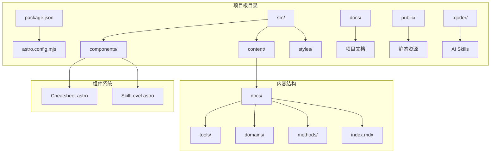
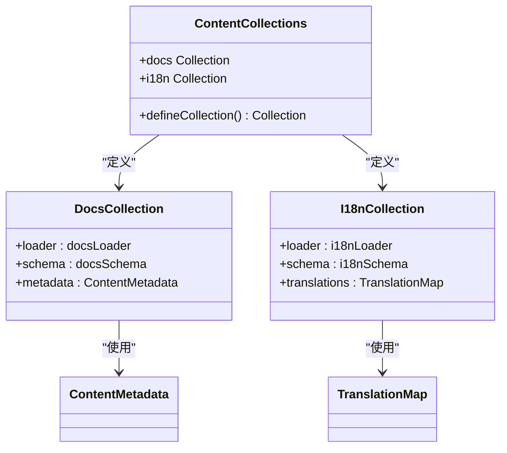
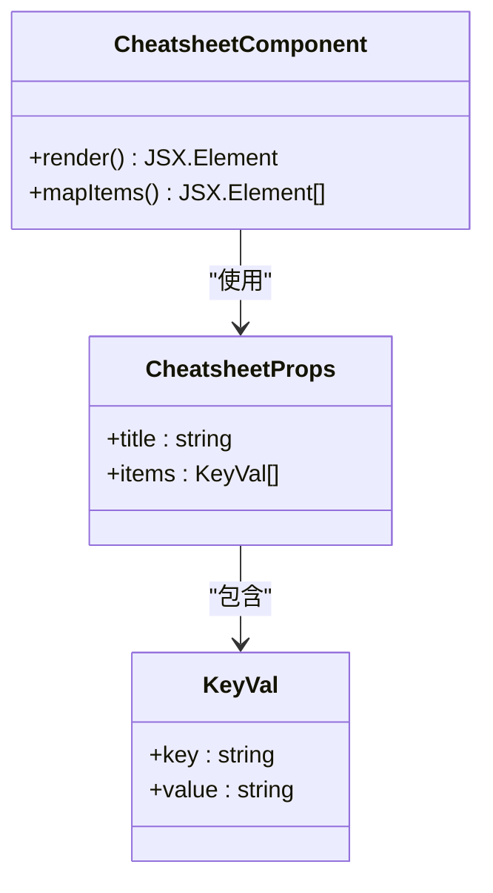
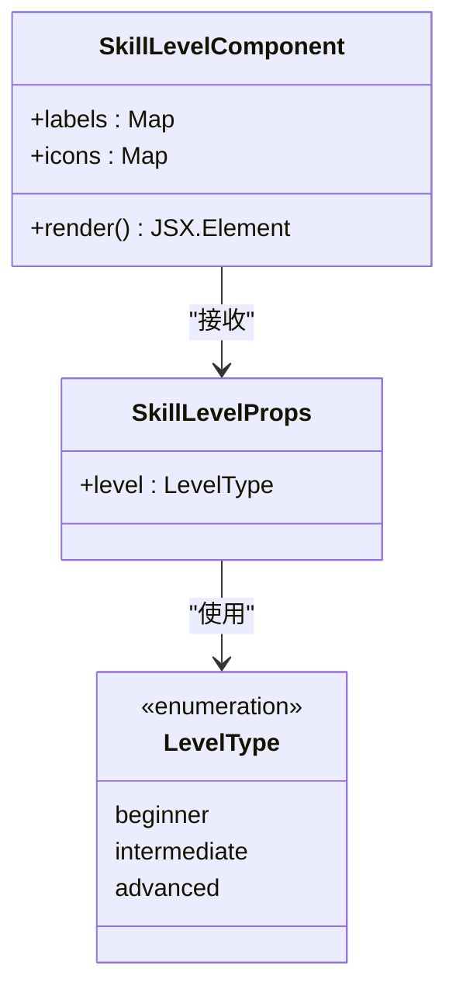
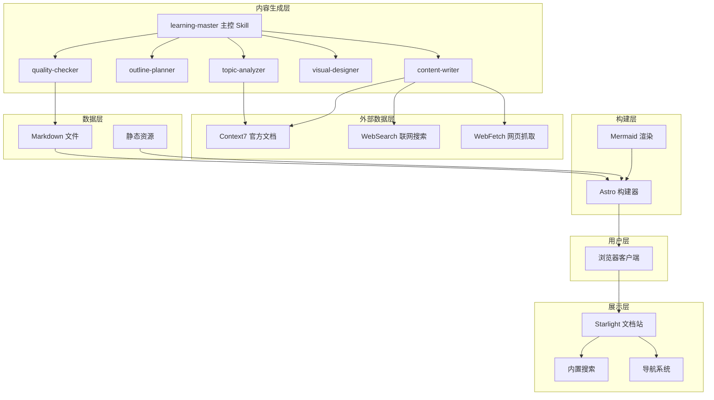
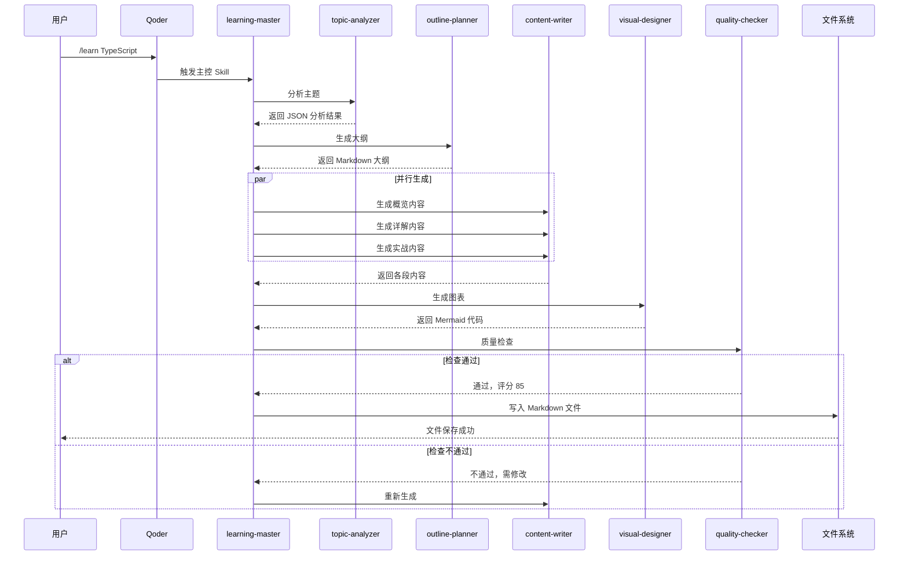
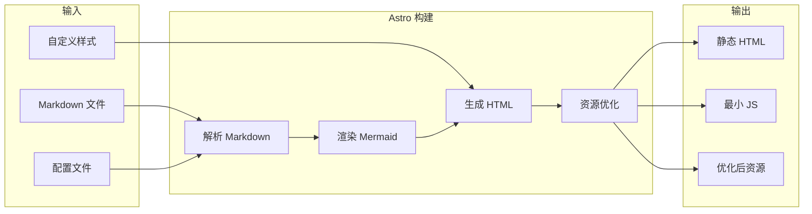
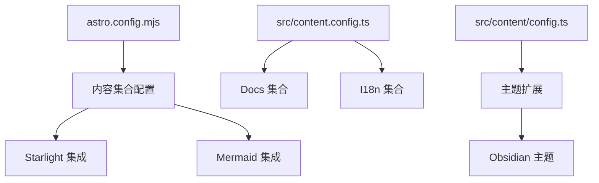

# 内容管理系统

<cite>
**本文档引用的文件**
- [package.json](file://package.json)
- [astro.config.mjs](file://astro.config.mjs)
- [src/content.config.ts](file://src/content.config.ts)
- [src/content/config.ts](file://src/content/config.ts)
- [src/components/Cheatsheet.astro](file://src/components/Cheatsheet.astro)
- [src/components/SkillLevel.astro](file://src/components/SkillLevel.astro)
- [src/content/docs/index.mdx](file://src/content/docs/index.mdx)
- [src/content/docs/tools/getting-started.md](file://src/content/docs/tools/getting-started.md)
- [src/content/docs/tools/docker.md](file://src/content/docs/tools/docker.md)
- [docs/01-PROJECT-BRIEF.md](file://docs/01-PROJECT-BRIEF.md)
- [docs/03-ARCHITECTURE.md](file://docs/03-ARCHITECTURE.md)
</cite>

## 目录
1. [项目简介](#项目简介)
2. [项目结构](#项目结构)
3. [核心组件](#核心组件)
4. [架构概览](#架构概览)
5. [详细组件分析](#详细组件分析)
6. [依赖关系分析](#依赖关系分析)
7. [性能考虑](#性能考虑)
8. [故障排除指南](#故障排除指南)
9. [结论](#结论)

## 项目简介

StudyBuddy 是一个基于 Astro 和 Starlight 的 AI 驱动个人知识成长伙伴系统。该项目旨在将碎片化的学习内容转化为结构化的知识体系，提供三阶段学习框架（概览→详解→实战），并通过 AI 自动生成高质量的学习文档。

### 项目核心特性

- **AI 驱动的内容生成**：通过 Qoder Skills 和 MCP 协作生成结构化文档
- **三阶段学习框架**：概览（5分钟）、详解（60分钟）、实战（25分钟）
- **多分类内容体系**：工具类、领域类、方法论三大分类
- **Mermaid 图表支持**：原生 Markdown 图表语法，支持多种图表类型
- **静态站点生成**：基于 Astro 的零 JavaScript 默认配置

**章节来源**
- [docs/01-PROJECT-BRIEF.md](file://docs/01-PROJECT-BRIEF.md#L1-L124)
- [package.json](file://package.json#L1-L25)

## 项目结构

项目采用模块化组织结构，主要分为以下几个核心部分：



**图表来源**
- [astro.config.mjs](file://astro.config.mjs#L21-L38)
- [src/content.config.ts](file://src/content.config.ts#L5-L8)

### 目录结构详解

项目采用清晰的目录组织方式：

- **src/**：源代码目录
  - **components/**：自定义 Astro 组件
  - **content/**：学习内容（Markdown 格式）
  - **styles/**：自定义样式文件
- **docs/**：项目文档（Markdown 格式）
- **public/**：公共静态资源
- **.qoder/**：AI Skills 配置目录

**章节来源**
- [docs/03-ARCHITECTURE.md](file://docs/03-ARCHITECTURE.md#L164-L221)

## 核心组件

### 内容管理系统

内容管理系统基于 Astro 的内容集合（Collections）机制，支持多种内容类型的自动加载和处理。



**图表来源**
- [src/content.config.ts](file://src/content.config.ts#L5-L8)
- [src/content/config.ts](file://src/content/config.ts#L5-L11)

### 自定义组件系统

系统提供了两个核心的自定义 Astro 组件：

#### 速查表组件（Cheatsheet）

速查表组件用于展示结构化的键值对信息，特别适用于命令行工具和配置项的展示。



**图表来源**
- [src/components/Cheatsheet.astro](file://src/components/Cheatsheet.astro#L2-L7)

#### 技能等级组件（SkillLevel）

技能等级组件用于标识内容的难度级别，提供视觉化的等级指示。



**图表来源**
- [src/components/SkillLevel.astro](file://src/components/SkillLevel.astro#L2-L18)

**章节来源**
- [src/components/Cheatsheet.astro](file://src/components/Cheatsheet.astro#L1-L23)
- [src/components/SkillLevel.astro](file://src/components/SkillLevel.astro#L1-L25)

## 架构概览

StudyBuddy 采用分层架构设计，将内容生成、展示和构建三个层面清晰分离。



**图表来源**
- [docs/03-ARCHITECTURE.md](file://docs/03-ARCHITECTURE.md#L12-L69)

### 技术栈选择

| 层级 | 技术选择 | 备选方案 | 选择理由 |
|------|----------|----------|----------|
| 框架 | Astro | Next.js, Gatsby | 零 JS 默认、构建速度快 |
| 主题 | Starlight | Docusaurus | 开箱即用、MIT 协议 |
| 图表 | Mermaid | D3.js, Chart.js | Markdown 原生、AI 友好 |
| 部署 | Vercel | Netlify, GitHub Pages | 自动部署、预览环境 |

**章节来源**
- [docs/03-ARCHITECTURE.md](file://docs/03-ARCHITECTURE.md#L71-L79)

## 详细组件分析

### 文档生成流程

系统采用 AI 驱动的文档生成流程，通过多个专门的 Skills 协同工作：



**图表来源**
- [docs/03-ARCHITECTURE.md](file://docs/03-ARCHITECTURE.md#L86-L126)

### 站点构建流程

Astro 构建器负责将 Markdown 内容转换为静态 HTML 页面：



**图表来源**
- [docs/03-ARCHITECTURE.md](file://docs/03-ARCHITECTURE.md#L129-L160)

### 内容分类体系

系统采用三层内容分类结构：

| 分类 | 路径 | 内容范围 | 子分类示例 |
|------|------|----------|------------|
| **工具** | `/docs/tools/` | 各类软件工具的使用 | AI 编程、效率工具、知识管理 |
| **领域** | `/docs/domains/` | 技术领域知识体系 | 前端、后端、数据、管理 |
| **方法论** | `/docs/methods/` | 学习方法与思维框架 | 学习方法、思维框架 |

**章节来源**
- [docs/03-ARCHITECTURE.md](file://docs/03-ARCHITECTURE.md#L223-L240)

### Mermaid 图表集成

系统集成了多种类型的 Mermaid 图表支持：

| 类型 | 语法 | 用途 |
|------|------|------|
| 思维导图 | `mindmap` | 知识体系概览 |
| 流程图 | `flowchart` | 使用步骤、决策流程 |
| 时序图 | `sequenceDiagram` | 交互过程、API 调用 |
| 类图 | `classDiagram` | 数据结构、类关系 |
| 状态图 | `stateDiagram-v2` | 状态机、生命周期 |

**章节来源**
- [docs/03-ARCHITECTURE.md](file://docs/03-ARCHITECTURE.md#L266-L275)

## 依赖关系分析

### 核心依赖关系

```mermaid
graph TB
subgraph "运行时依赖"
A[astro@^5.6.1] --> B[@astrojs/starlight@^0.37.6]
A --> C[astro-mermaid@^1.3.1]
B --> D[starlight-theme-obsidian@^0.4.1]
A --> E[sharp@^0.34.2]
end
subgraph "开发依赖"
F[starlight-site-graph@^0.5.0]
end
subgraph "内容系统"
G[docsLoader] --> H[Markdown 内容]
I[i18nLoader] --> J[国际化内容]
end
A --> G
A --> I
```

**图表来源**
- [package.json](file://package.json#L13-L23)
- [astro.config.mjs](file://astro.config.mjs#L3-L41)

### 配置文件关系

系统使用多个配置文件协同工作：



**图表来源**
- [astro.config.mjs](file://astro.config.mjs#L8-L42)
- [src/content.config.ts](file://src/content.config.ts#L1-L9)
- [src/content/config.ts](file://src/content/config.ts#L1-L12)

**章节来源**
- [package.json](file://package.json#L13-L23)
- [astro.config.mjs](file://astro.config.mjs#L8-L42)

## 性能考虑

### 构建优化策略

| 策略 | 实现方式 | 预期效果 |
|------|----------|----------|
| 增量构建 | Astro 默认支持 | 减少 50% 构建时间 |
| 图片优化 | `@astrojs/image` | 减少 70% 图片体积 |
| 代码分割 | 自动 | 减少首屏 JS |

### 运行时优化

| 策略 | 实现方式 | 预期效果 |
|------|----------|----------|
| 静态生成 | Astro 默认 | 零运行时 JS |
| CDN 缓存 | Vercel Edge | < 50ms TTFB |
| 懒加载图表 | Intersection Observer | 提升首屏速度 |

**章节来源**
- [docs/03-ARCHITECTURE.md](file://docs/03-ARCHITECTURE.md#L366-L383)

## 故障排除指南

### 常见问题及解决方案

#### 构建失败

**症状**：`npm run build` 失败
**可能原因**：
- Markdown 语法错误
- 图表语法不正确
- 依赖包版本冲突

**解决方案**：
1. 检查 Markdown 文件语法
2. 验证 Mermaid 图表语法
3. 运行 `npm audit` 检查依赖安全

#### 内容显示异常

**症状**：页面内容不显示或显示乱码
**可能原因**：
- 内容文件编码问题
- 路径配置错误
- 权限问题

**解决方案**：
1. 确保所有 Markdown 文件使用 UTF-8 编码
2. 检查文件路径是否符合命名规范
3. 验证文件权限设置

#### 性能问题

**症状**：页面加载缓慢
**可能原因**：
- 图片未优化
- 图表过多
- 缓存配置不当

**解决方案**：
1. 使用 `sharp` 优化图片
2. 合理使用 Mermaid 图表
3. 配置适当的缓存策略

**章节来源**
- [docs/03-ARCHITECTURE.md](file://docs/03-ARCHITECTURE.md#L323-L364)

## 结论

StudyBuddy 内容管理系统通过精心设计的架构和组件系统，成功实现了 AI 驱动的知识管理目标。系统的主要优势包括：

1. **高效的 AI 内容生成**：通过多 Skills 协作，实现从主题分析到内容生成的完整自动化流程
2. **清晰的架构分层**：内容生成、展示和构建三个层面职责明确，便于维护和扩展
3. **丰富的可视化支持**：完整的 Mermaid 图表生态系统，支持多种图表类型的原生渲染
4. **优秀的性能表现**：基于 Astro 的静态生成，提供极佳的加载性能和用户体验

该系统为个人知识管理和学习提供了强大的基础设施，特别适合需要快速构建和维护知识库的用户群体。通过持续的优化和扩展，StudyBuddy 有望成为个人知识管理领域的优秀解决方案。