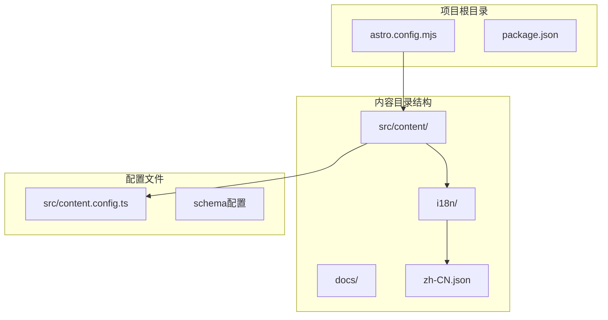
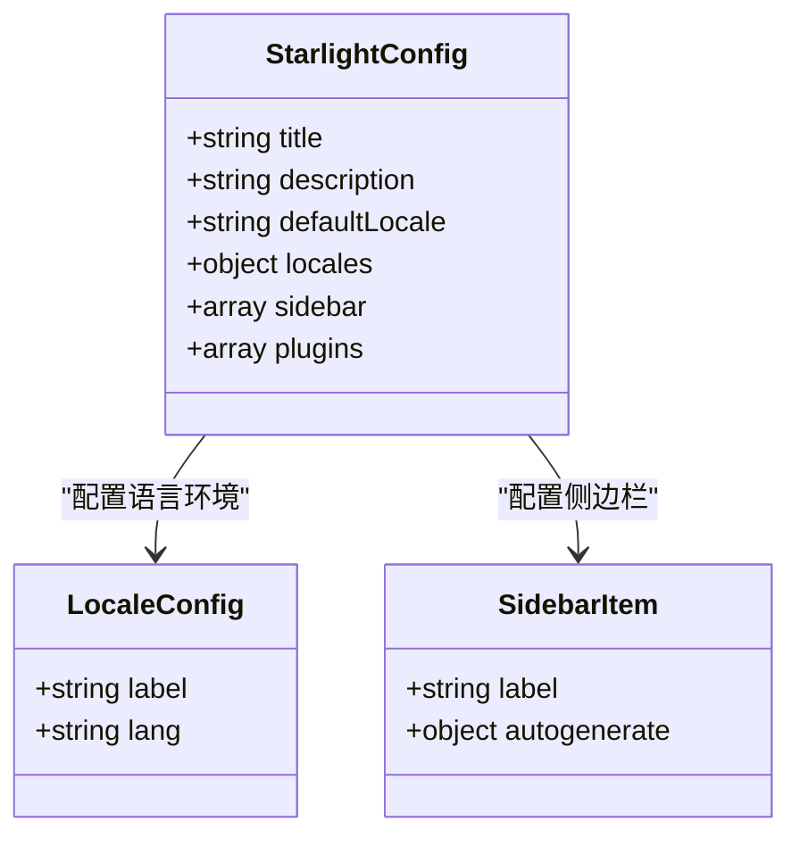
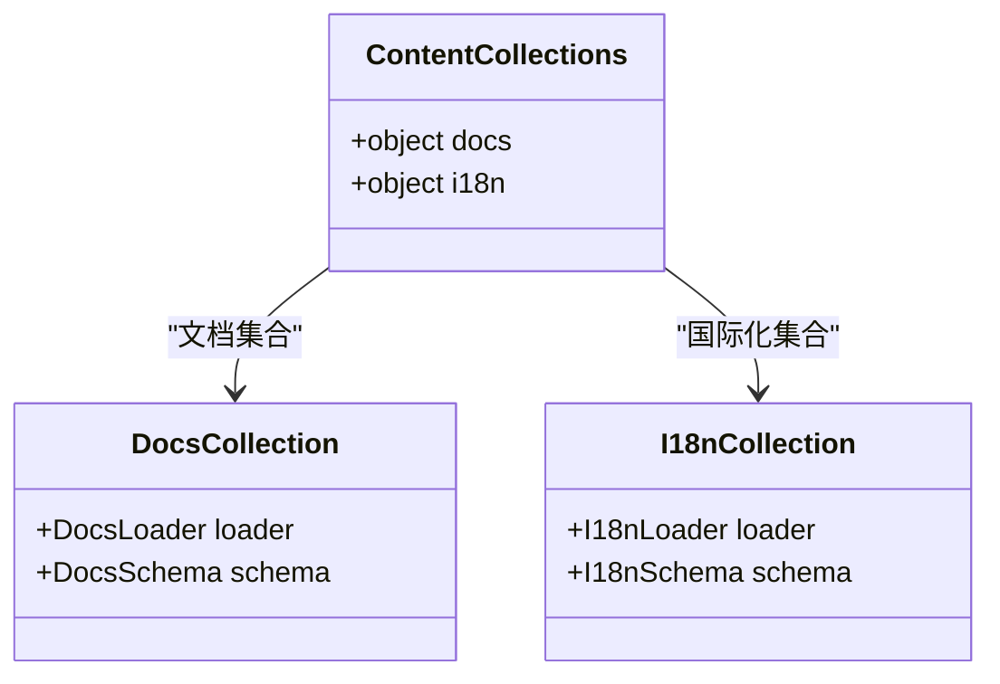
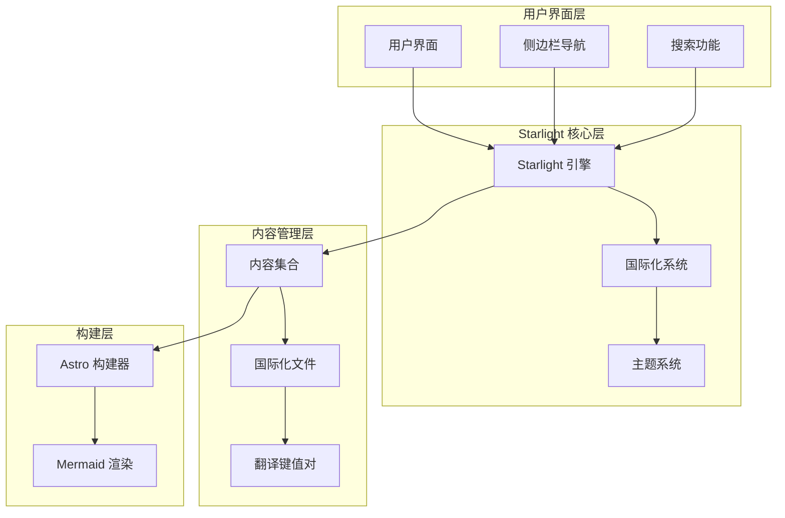
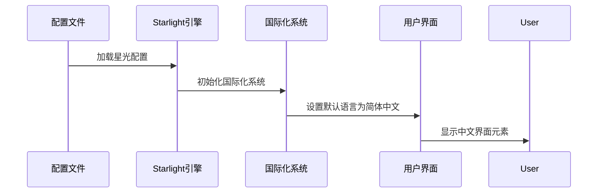
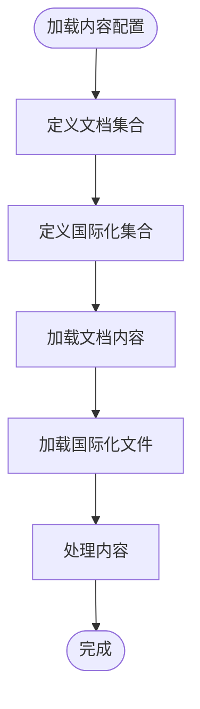
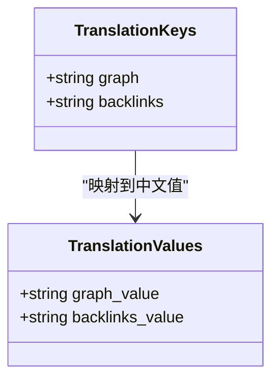
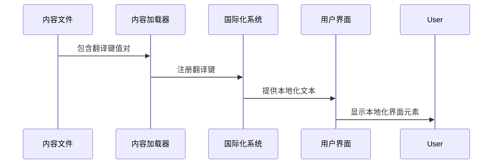
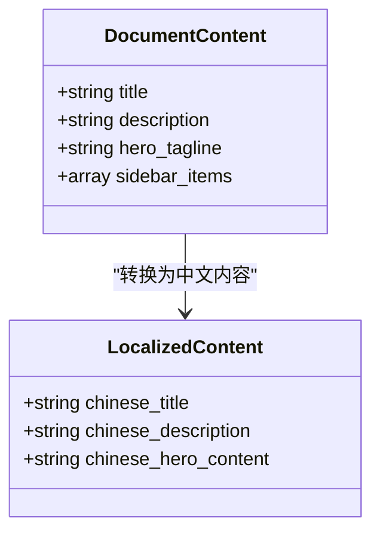

# 国际化支持

<cite>
**本文档引用的文件**
- [astro.config.mjs](file://astro.config.mjs)
- [src/content.config.ts](file://src/content.config.ts)
- [src/content/i18n/zh-CN.json](file://src/content/i18n/zh-CN.json)
- [src/content/docs/index.mdx](file://src/content/docs/index.mdx)
- [src/content/docs/tools/getting-started.md](file://src/content/docs/tools/getting-started.md)
- [src/content/docs/project/architecture.md](file://src/content/docs/project/architecture.md)
- [package.json](file://package.json)
</cite>

## 目录
1. [简介](#简介)
2. [项目结构](#项目结构)
3. [核心组件](#核心组件)
4. [架构概览](#架构概览)
5. [详细组件分析](#详细组件分析)
6. [依赖分析](#依赖分析)
7. [性能考虑](#性能考虑)
8. [故障排除指南](#故障排除指南)
9. [结论](#结论)

## 简介

StudyBuddy 是一个基于 Astro 和 Starlight 构建的 AI 驱动个人知识成长伙伴文档站点。该项目实现了简体中文的国际化支持，通过 Starlight 的内置国际化机制和自定义翻译键值对来提供多语言体验。

该项目的核心目标是将碎片化学习转化为结构化知识体系，为用户提供高效的学习路径和知识管理工具。国际化支持确保了中文用户能够获得最佳的阅读体验。

## 项目结构

项目采用模块化的组织结构，国际化相关的文件主要集中在以下位置：



**图表来源**
- [astro.config.mjs](file://astro.config.mjs#L1-L43)
- [src/content.config.ts](file://src/content.config.ts#L1-L9)

**章节来源**
- [astro.config.mjs](file://astro.config.mjs#L1-L43)
- [src/content.config.ts](file://src/content.config.ts#L1-L9)

## 核心组件

### Starlight 国际化配置

项目使用 Starlight 的默认国际化配置，当前仅支持简体中文：



**图表来源**
- [astro.config.mjs](file://astro.config.mjs#L10-L39)

### 内容集合配置

项目通过内容配置文件定义了文档和国际化集合：



**图表来源**
- [src/content.config.ts](file://src/content.config.ts#L5-L8)

**章节来源**
- [astro.config.mjs](file://astro.config.mjs#L10-L39)
- [src/content.config.ts](file://src/content.config.ts#L1-L9)

## 架构概览

StudyBuddy 的国际化架构基于 Starlight 的内置国际化机制，结合自定义翻译键值对实现完整的多语言支持：



**图表来源**
- [astro.config.mjs](file://astro.config.mjs#L8-L42)
- [src/content.config.ts](file://src/content.config.ts#L1-L9)

## 详细组件分析

### 国际化配置组件

#### 星光配置分析

项目的核心国际化配置位于 `astro.config.mjs` 文件中，定义了简体中文作为默认语言：



**图表来源**
- [astro.config.mjs](file://astro.config.mjs#L14-L20)

#### 内容集合配置分析

内容配置文件定义了两个主要集合：文档集合和国际化集合：



**图表来源**
- [src/content.config.ts](file://src/content.config.ts#L5-L8)

**章节来源**
- [astro.config.mjs](file://astro.config.mjs#L14-L20)
- [src/content.config.ts](file://src/content.config.ts#L5-L8)

### 翻译键值对组件

#### 中文翻译文件分析

项目中的 `zh-CN.json` 文件包含了特定的翻译键值对，主要用于 Starlight 插件的本地化：



**图表来源**
- [src/content/i18n/zh-CN.json](file://src/content/i18n/zh-CN.json#L1-L5)

#### 翻译键值对使用流程



**图表来源**
- [src/content/i18n/zh-CN.json](file://src/content/i18n/zh-CN.json#L2-L4)

**章节来源**
- [src/content/i18n/zh-CN.json](file://src/content/i18n/zh-CN.json#L1-L5)

### 内容国际化实践

#### 文档内容本地化

项目中的文档内容采用了中文本地化，包括标题、描述和正文内容：



**图表来源**
- [src/content/docs/index.mdx](file://src/content/docs/index.mdx#L1-L14)
- [src/content/docs/tools/getting-started.md](file://src/content/docs/tools/getting-started.md#L1-L4)

#### 内容分类本地化

项目的内容分类也体现了中文本地化的特点：

**章节来源**
- [src/content/docs/index.mdx](file://src/content/docs/index.mdx#L1-L65)
- [src/content/docs/tools/getting-started.md](file://src/content/docs/tools/getting-started.md#L1-L66)
- [src/content/docs/domains/index.md](file://src/content/docs/domains/index.md#L1-L42)
- [src/content/docs/methods/index.md](file://src/content/docs/methods/index.md#L1-L40)

## 依赖分析

### 核心依赖关系

项目国际化功能依赖于以下关键依赖包：

```mermaid
graph TB
subgraph "Starlight 生态系统"
Starlight[@astrojs/starlight]
ThemeObsidian[starlight-theme-obsidian]
SiteGraph[starlight-site-graph]
end
subgraph "构建工具"
Astro[astro]
Mermaid[astro-mermaid]
end
subgraph "项目配置"
Config[astro.config.mjs]
ContentConfig[src/content.config.ts]
end
Starlight --> ThemeObsidian
Starlight --> SiteGraph
Astro --> Starlight
Astro --> Mermaid
Config --> Starlight
ContentConfig --> Starlight
```

**图表来源**
- [package.json](file://package.json#L13-L20)
- [astro.config.mjs](file://astro.config.mjs#L3-L6)

### 依赖版本兼容性

项目使用了经过验证的依赖版本组合，确保国际化功能的稳定性：

**章节来源**
- [package.json](file://package.json#L1-L25)
- [astro.config.mjs](file://astro.config.mjs#L1-L43)

## 性能考虑

### 国际化性能优化

由于项目目前仅支持简体中文，国际化实现相对简单，但仍需考虑以下性能因素：

1. **文件大小优化**：翻译文件保持精简，避免不必要的键值对
2. **加载效率**：Starlight 的默认配置提供了高效的国际化加载机制
3. **缓存策略**：利用 Astro 的静态生成特性，减少运行时开销

### 扩展性考虑

当项目需要支持更多语言时，应考虑：

- **渐进式扩展**：逐步添加新语言，避免一次性引入大量翻译文件
- **维护成本**：建立翻译更新的工作流程，确保多语言内容的一致性
- **性能监控**：监控多语言版本的加载时间和资源消耗

## 故障排除指南

### 常见问题及解决方案

#### 国际化配置问题

**问题**：界面显示英文而非中文
**解决方案**：
1. 检查 `defaultLocale` 配置是否正确设置为 `'root'`
2. 验证 `locales.root.lang` 是否为 `'zh-CN'`
3. 确认 `zh-CN.json` 文件存在且格式正确

#### 翻译键值对缺失

**问题**：某些界面元素显示为英文而非中文
**解决方案**：
1. 检查 `src/content/i18n/zh-CN.json` 文件中是否存在对应的键值对
2. 确保翻译键名与 Starlight 插件要求的键名一致
3. 验证 JSON 文件的语法正确性

#### 内容加载问题

**问题**：文档内容无法正确显示
**解决方案**：
1. 检查 `src/content.config.ts` 中的集合配置
2. 验证文档文件的 YAML frontmatter 格式
3. 确认文件路径和命名符合项目约定

**章节来源**
- [astro.config.mjs](file://astro.config.mjs#L14-L20)
- [src/content/i18n/zh-CN.json](file://src/content/i18n/zh-CN.json#L1-L5)
- [src/content.config.ts](file://src/content.config.ts#L1-L9)

## 结论

StudyBuddy 项目成功实现了简体中文的国际化支持，通过以下关键实现确保了良好的用户体验：

1. **简洁有效的配置**：基于 Starlight 的默认国际化机制，配置简单可靠
2. **内容本地化**：所有文档内容均采用中文，提供完整的中文学习体验
3. **可扩展的基础**：现有的架构为未来支持更多语言奠定了良好基础

项目的国际化实现体现了"够用就好"的设计原则，在满足当前需求的同时，为未来的国际化扩展预留了空间。通过合理的文件组织和清晰的配置结构，项目为类似的知识管理平台提供了优秀的国际化实现参考。