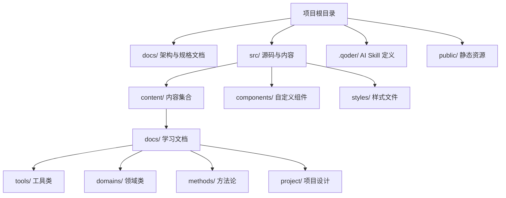
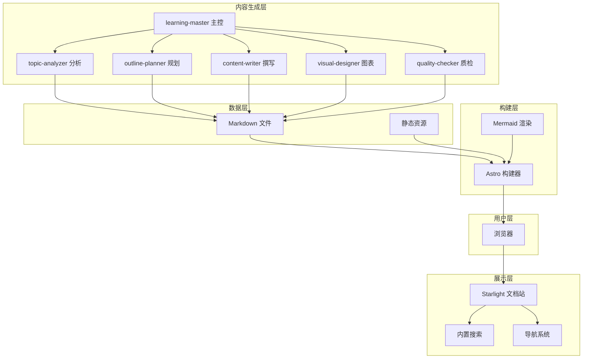
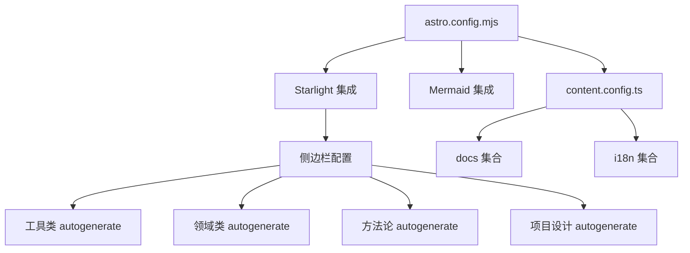
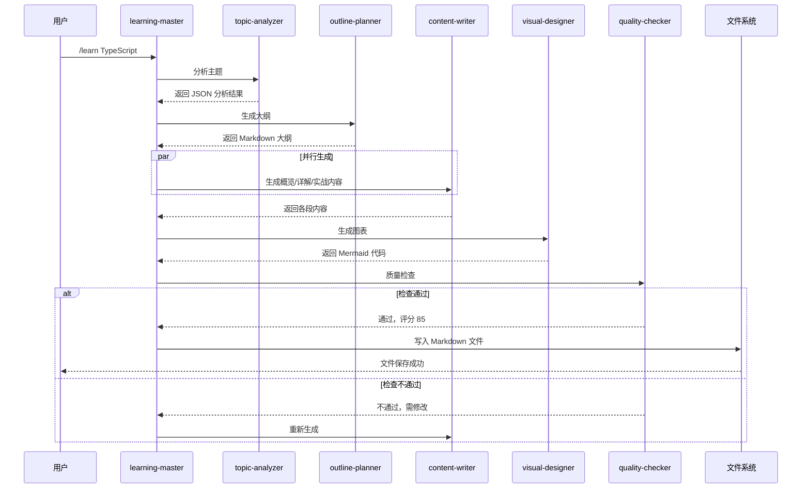
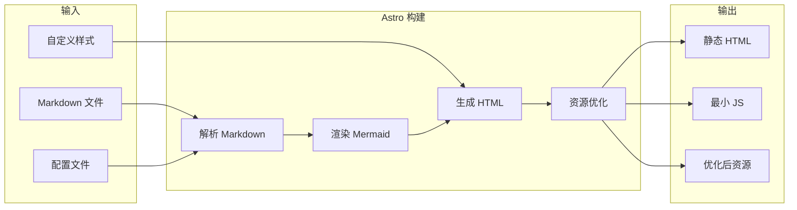
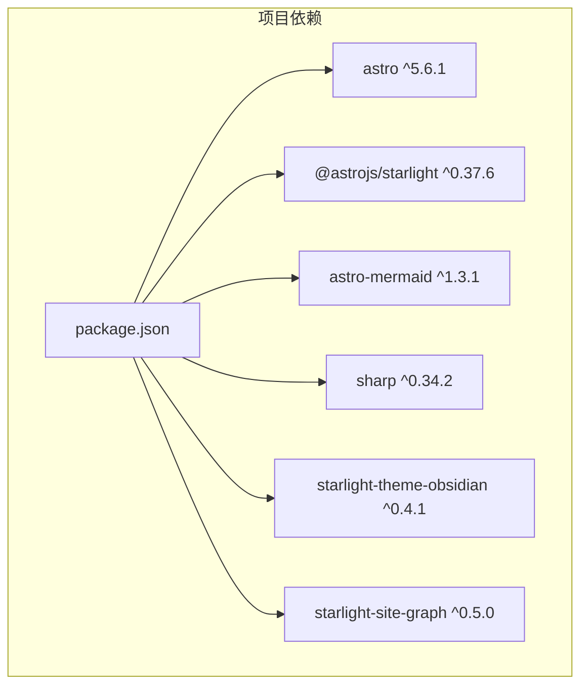

# 技术架构设计

<cite>
**本文档引用的文件**
- [package.json](file://package.json)
- [astro.config.mjs](file://astro.config.mjs)
- [src/content.config.ts](file://src/content.config.ts)
- [docs/03-ARCHITECTURE.md](file://docs/03-ARCHITECTURE.md)
- [src/content/docs/project/architecture.md](file://src/content/docs/project/architecture.md)
- [src/components/Cheatsheet.astro](file://src/components/Cheatsheet.astro)
- [src/components/SkillLevel.astro](file://src/components/SkillLevel.astro)
- [docs/04-AI-SKILL-SPEC.md](file://docs/04-AI-SKILL-SPEC.md)
- [.qoder/skills/learning-master/SKILL.md](file://.qoder/skills/learning-master/SKILL.md)
- [.qoder/skills/topic-analyzer/SKILL.md](file://.qoder/skills/topic-analyzer/SKILL.md)
- [src/content/docs/tools/getting-started.md](file://src/content/docs/tools/getting-started.md)
- [tsconfig.json](file://tsconfig.json)
</cite>

## 目录
1. [引言](#引言)
2. [项目结构](#项目结构)
3. [核心组件](#核心组件)
4. [架构总览](#架构总览)
5. [详细组件分析](#详细组件分析)
6. [依赖关系分析](#依赖关系分析)
7. [性能考量](#性能考量)
8. [故障排除指南](#故障排除指南)
9. [结论](#结论)

## 引言
本项目是一个基于 Astro 的静态文档站点，采用 Starlight 主题构建，结合 Mermaid 图表渲染能力，提供 AI 驱动的学习文档生成与展示平台。系统通过一组协作的 AI Skill（学习主控、主题分析、大纲规划、内容撰写、图表生成、质量检查）实现从用户输入到结构化文档输出的自动化流程，并通过 Astro 构建器生成高性能的静态站点。

## 项目结构
项目采用分层与功能混合相结合的组织方式：
- 根目录包含构建配置与依赖声明
- docs 目录存放架构与规格说明文档
- src 目录包含内容集合、组件与样式
- .qoder 目录存放 AI Skill 定义
- public 目录存放静态资源



**图表来源**
- [astro.config.mjs](file://astro.config.mjs#L21-L38)
- [src/content.config.ts](file://src/content.config.ts#L5-L8)

**章节来源**
- [astro.config.mjs](file://astro.config.mjs#L1-L43)
- [src/content.config.ts](file://src/content.config.ts#L1-L9)

## 核心组件
- Astro 构建器与 Starlight 主题：提供零 JS 默认的静态站点生成与开箱即用的文档站体验
- Mermaid 集成：在 Markdown 中原生渲染流程图、时序图等可视化图表
- 自定义组件：Cheatsheet 速查表组件与 SkillLevel 难度标签组件
- AI Skill 体系：学习主控、主题分析、大纲规划、内容撰写、图表生成、质量检查六大 Skill 协同工作

**章节来源**
- [package.json](file://package.json#L13-L20)
- [astro.config.mjs](file://astro.config.mjs#L9-L41)
- [src/components/Cheatsheet.astro](file://src/components/Cheatsheet.astro#L1-L23)
- [src/components/SkillLevel.astro](file://src/components/SkillLevel.astro#L1-L25)

## 架构总览
系统采用分层架构，从用户层到构建层逐层抽象与优化：



**图表来源**
- [docs/03-ARCHITECTURE.md](file://docs/03-ARCHITECTURE.md#L12-L69)
- [docs/04-AI-SKILL-SPEC.md](file://docs/04-AI-SKILL-SPEC.md#L23-L73)

## 详细组件分析

### Astro 配置与内容集合
- 星光主题配置：设置默认语言、侧边栏自动生成功能，按工具类、领域类、方法论、项目设计四个分类组织内容
- Mermaid 集成：启用 Mermaid 渲染插件，支持在 Markdown 中直接使用图表语法
- 内容集合：通过 docsLoader 与 i18nLoader 加载文档与国际化内容



**图表来源**
- [astro.config.mjs](file://astro.config.mjs#L9-L41)
- [src/content.config.ts](file://src/content.config.ts#L5-L8)

**章节来源**
- [astro.config.mjs](file://astro.config.mjs#L1-L43)
- [src/content.config.ts](file://src/content.config.ts#L1-L9)

### AI Skill 体系与数据流
AI Skill 体系通过主控 Skill 协调六个子 Skill 完成从主题输入到文档输出的完整流程：



**图表来源**
- [docs/03-ARCHITECTURE.md](file://docs/03-ARCHITECTURE.md#L86-L126)
- [docs/04-AI-SKILL-SPEC.md](file://docs/04-AI-SKILL-SPEC.md#L159-L172)

**章节来源**
- [.qoder/skills/learning-master/SKILL.md](file://.qoder/skills/learning-master/SKILL.md#L1-L382)
- [.qoder/skills/topic-analyzer/SKILL.md](file://.qoder/skills/topic-analyzer/SKILL.md#L1-L170)
- [docs/04-AI-SKILL-SPEC.md](file://docs/04-AI-SKILL-SPEC.md#L149-L740)

### Mermaid 图表集成
- 配置方式：通过 Astro 集成与 Remark 插件在构建时渲染 Mermaid 图表
- 支持类型：思维导图、流程图、时序图、类图、状态图等
- 使用场景：知识体系概览、使用步骤、交互过程、数据结构、生命周期等


**图表来源**
- [docs/03-ARCHITECTURE.md](file://docs/03-ARCHITECTURE.md#L244-L264)

**章节来源**
- [docs/03-ARCHITECTURE.md](file://docs/03-ARCHITECTURE.md#L244-L275)

### 自定义组件设计
- Cheatsheet 速查表组件：接收标题与键值对列表，渲染为表格样式，支持在 Markdown 中直接使用
- SkillLevel 难度标签组件：根据传入的难度级别显示相应的图标与标签文本

```mermaid
classDiagram
class Cheatsheet {
+string title
+Item[] items
+render() void
}
class Item {
+string key
+string value
}
class SkillLevel {
+Level level
+render() void
}
enum Level {
+beginner
+intermediate
+advanced
}
Cheatsheet --> Item : "使用"
SkillLevel --> Level : "使用"
```

**图表来源**
- [src/components/Cheatsheet.astro](file://src/components/Cheatsheet.astro#L2-L7)
- [src/components/SkillLevel.astro](file://src/components/SkillLevel.astro#L2-L6)

**章节来源**
- [src/components/Cheatsheet.astro](file://src/components/Cheatsheet.astro#L1-L23)
- [src/components/SkillLevel.astro](file://src/components/SkillLevel.astro#L1-L25)

### 站点构建流程
Astro 构建器将 Markdown 内容与配置文件转换为静态 HTML，期间执行 Mermaid 渲染与资源优化：



**图表来源**
- [docs/03-ARCHITECTURE.md](file://docs/03-ARCHITECTURE.md#L128-L160)

**章节来源**
- [docs/03-ARCHITECTURE.md](file://docs/03-ARCHITECTURE.md#L128-L160)

## 依赖关系分析
项目依赖采用模块化管理，核心依赖包括 Astro 框架、Starlight 主题、Mermaid 渲染与图片处理库：



**图表来源**
- [package.json](file://package.json#L13-L23)

**章节来源**
- [package.json](file://package.json#L1-L25)

## 性能考量
- 构建优化：Astro 默认支持增量构建，减少 50% 构建时间；图片优化减少 70% 体积；自动代码分割减少首屏 JS
- 运行时优化：静态生成实现零运行时 JS；CDN 缓存实现 < 50ms TTFB；懒加载图表提升首屏速度

**章节来源**
- [docs/03-ARCHITECTURE.md](file://docs/03-ARCHITECTURE.md#L366-L383)

## 故障排除指南
- 开发与预览：使用 npm run dev 启动本地开发服务器，使用 npm run preview 预览构建结果
- 常用命令：开发模式、构建静态站点、预览构建结果
- 使用流程：在 Qoder 中执行 /learn {topic} 生成学习文档，然后在本地浏览查看

**章节来源**
- [docs/03-ARCHITECTURE.md](file://docs/03-ARCHITECTURE.md#L323-L363)

## 结论
本项目通过 Astro + Starlight + Mermaid 的技术栈，构建了一个高性能、可扩展的学习文档平台。AI Skill 体系实现了从主题输入到结构化文档输出的自动化流程，配合静态站点生成与 CDN 部署，为用户提供流畅的学习体验。系统的模块化设计与清晰的职责划分，便于后续的功能扩展与维护。