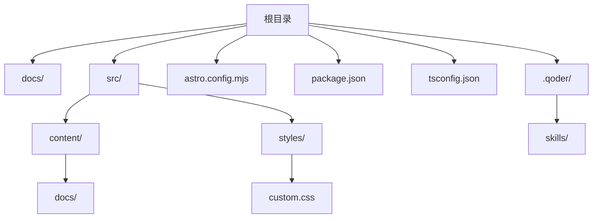
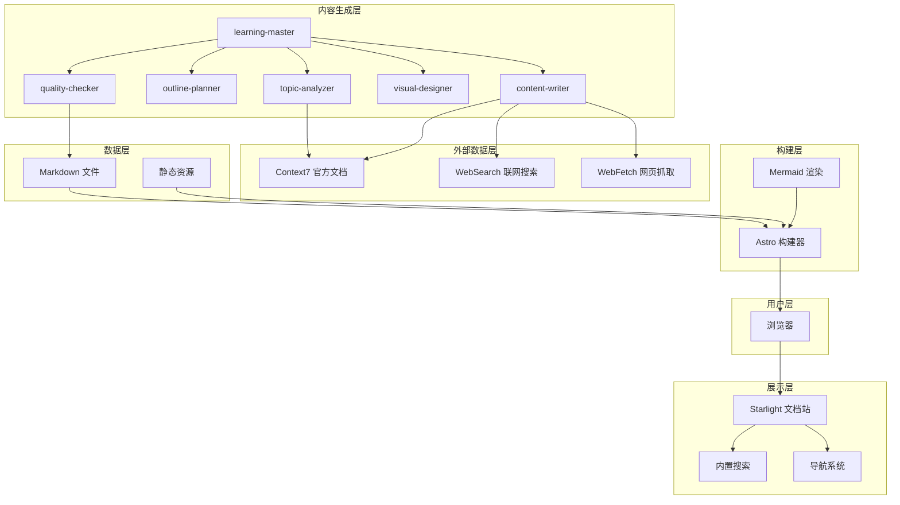
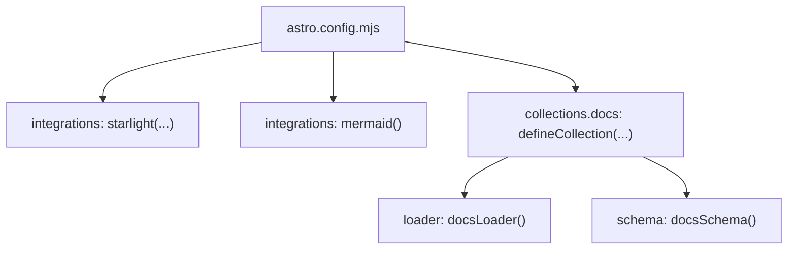
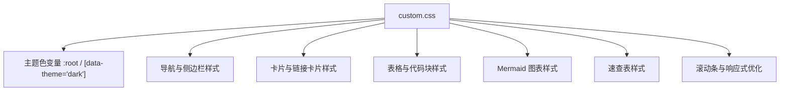
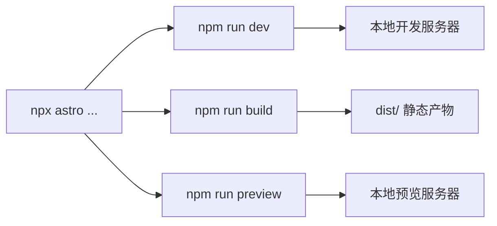
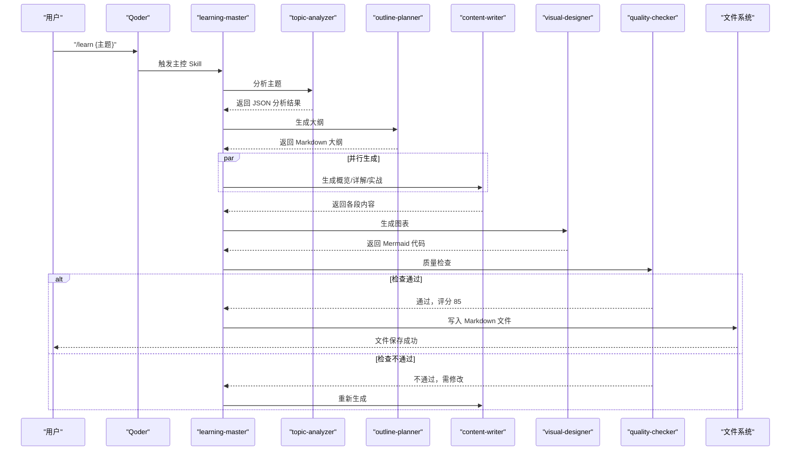
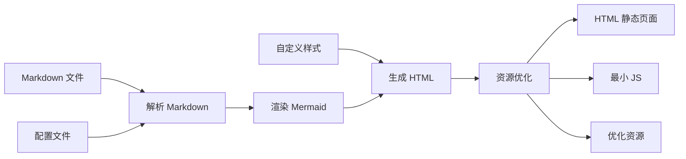
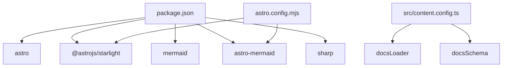

# 开发者指南

<cite>
**本文引用的文件**
- [package.json](file://package.json)
- [astro.config.mjs](file://astro.config.mjs)
- [tsconfig.json](file://tsconfig.json)
- [src/content.config.ts](file://src/content.config.ts)
- [src/styles/custom.css](file://src/styles/custom.css)
- [docs/01-PROJECT-BRIEF.md](file://docs/01-PROJECT-BRIEF.md)
- [docs/03-ARCHITECTURE.md](file://docs/03-ARCHITECTURE.md)
</cite>

## 目录
1. [引言](#引言)
2. [项目结构](#项目结构)
3. [核心组件](#核心组件)
4. [架构总览](#架构总览)
5. [详细组件分析](#详细组件分析)
6. [依赖分析](#依赖分析)
7. [性能考虑](#性能考虑)
8. [故障排查指南](#故障排查指南)
9. [结论](#结论)
10. [附录](#附录)

## 引言
本指南面向新加入的开发者，帮助你快速搭建开发环境、理解项目结构与模块组织、掌握常用开发命令与脚本、熟悉调试技巧与常见问题处理，并了解贡献流程、测试策略、扩展开发与发布流程。StudyBuddy 是一个基于 Astro + Starlight 的静态文档站点，结合 Mermaid 图表与 Qoder AI 技能，提供结构化知识体系与高效学习体验。

## 项目结构
项目采用“文档驱动 + 静态站点”的组织方式，核心目录与职责如下：
- docs：项目文档（需求、架构、AI技能规范等）
- src/content/docs：学习类文档（tools/、domains/、methods/），由 Starlight 自动导航
- src/styles：自定义主题样式
- astro.config.mjs：Astro 配置（集成 Starlight、Mermaid）
- package.json：脚本与依赖
- tsconfig.json：TypeScript 严格配置
- .qoder：AI 技能目录（学习主控、分析、规划、写作、设计、质量检查）

**图表来源**
- [astro.config.mjs](file://astro.config.mjs#L1-L34)
- [src/content.config.ts](file://src/content.config.ts#L1-L8)
- [src/styles/custom.css](file://src/styles/custom.css#L1-L402)

**章节来源**
- [astro.config.mjs](file://astro.config.mjs#L1-L34)
- [src/content.config.ts](file://src/content.config.ts#L1-L8)
- [docs/03-ARCHITECTURE.md](file://docs/03-ARCHITECTURE.md#L164-L240)

## 核心组件
- Astro 构建器：负责解析 Markdown、渲染 Mermaid、生成静态 HTML/JS 资源
- Starlight 主题：提供开箱即用的文档站界面、导航、搜索与代码高亮
- Mermaid 集成：在 Markdown 中原生渲染思维导图、流程图、时序图等
- 自定义样式：通过 CSS 变量与 Glassmorphism 设计提升阅读体验
- 内容加载器：使用 Starlight 的 docsLoader/docsSchema 统一加载 docs 集合

**章节来源**
- [astro.config.mjs](file://astro.config.mjs#L7-L32)
- [src/content.config.ts](file://src/content.config.ts#L5-L7)
- [src/styles/custom.css](file://src/styles/custom.css#L1-L402)

## 架构总览
StudyBuddy 的技术栈以 Astro 为核心，配合 Starlight 主题与 Mermaid 图表，形成“内容生成 → 静态站点构建 → 本地预览”的完整闭环。AI 技能通过 Qoder 协作完成主题分析、大纲规划、内容写作、图表设计与质量检查。

**图表来源**
- [docs/03-ARCHITECTURE.md](file://docs/03-ARCHITECTURE.md#L10-L69)

## 详细组件分析

### Astro 配置与集成
- 集成 Starlight：设置站点标题、默认语言、本地化、自定义 CSS、自动导航（tools/domains/methods）
- 集成 Mermaid：启用 Mermaid 图表渲染
- 内容集合：通过 docsLoader/docsSchema 加载 docs 集合

**图表来源**
- [astro.config.mjs](file://astro.config.mjs#L7-L32)
- [src/content.config.ts](file://src/content.config.ts#L5-L7)

**章节来源**
- [astro.config.mjs](file://astro.config.mjs#L7-L32)
- [src/content.config.ts](file://src/content.config.ts#L1-L8)

### 自定义样式与主题
- 使用 CSS 变量统一主题色与阴影，支持明暗主题
- 为导航栏、侧边栏、卡片、表格、代码块、Mermaid 图表、速查表等组件定制样式
- 支持玻璃拟态（Glassmorphism）与过渡动画，提升交互体验

**图表来源**
- [src/styles/custom.css](file://src/styles/custom.css#L4-L384)

**章节来源**
- [src/styles/custom.css](file://src/styles/custom.css#L1-L402)

### 开发命令与脚本
- 开发模式：启动本地开发服务器，支持热更新
- 构建：生成静态站点产物
- 预览：本地预览构建结果
- CLI：直接调用 Astro CLI

**图表来源**
- [package.json](file://package.json#L5-L11)

**章节来源**
- [package.json](file://package.json#L5-L11)
- [docs/03-ARCHITECTURE.md](file://docs/03-ARCHITECTURE.md#L323-L364)

### 文档生成与站点构建流程
- 文档生成：由 Qoder 的 learning-master 触发，依次进行主题分析、大纲规划、内容写作、图表设计与质量检查，最终写入 Markdown 文件
- 站点构建：Astro 解析 Markdown、渲染 Mermaid、生成 HTML/JS 与优化资源

**图表来源**
- [docs/03-ARCHITECTURE.md](file://docs/03-ARCHITECTURE.md#L86-L126)

**章节来源**
- [docs/03-ARCHITECTURE.md](file://docs/03-ARCHITECTURE.md#L82-L160)

### 站点构建流程
- 输入：Markdown 文件、配置文件、自定义样式
- 处理：解析 Markdown、渲染 Mermaid、生成 HTML、资源优化
- 输出：静态 HTML、最小化 JS、优化后的资源

**图表来源**
- [docs/03-ARCHITECTURE.md](file://docs/03-ARCHITECTURE.md#L128-L160)

**章节来源**
- [docs/03-ARCHITECTURE.md](file://docs/03-ARCHITECTURE.md#L128-L160)

## 依赖分析
- 运行时依赖：Astro、Starlight、Mermaid、astro-mermaid、sharp
- 项目通过 Astro 配置启用 Starlight 与 Mermaid 集成；内容集合通过 docsLoader/docsSchema 统一加载

**图表来源**
- [package.json](file://package.json#L12-L18)
- [astro.config.mjs](file://astro.config.mjs#L3-L31)
- [src/content.config.ts](file://src/content.config.ts#L1-L3)

**章节来源**
- [package.json](file://package.json#L12-L18)
- [astro.config.mjs](file://astro.config.mjs#L3-L31)
- [src/content.config.ts](file://src/content.config.ts#L1-L3)

## 性能考虑
- 构建优化：增量构建、图片优化、自动代码分割
- 运行时优化：静态生成、CDN 边缘缓存、懒加载图表
- 项目目标：文档生成时间 < 30 秒/篇，站点构建时间 < 1 分钟，Lighthouse 分数 ≥ 90

**章节来源**
- [docs/03-ARCHITECTURE.md](file://docs/03-ARCHITECTURE.md#L366-L383)
- [docs/01-PROJECT-BRIEF.md](file://docs/01-PROJECT-BRIEF.md#L112-L120)

## 故障排查指南
- 开发服务器无法启动
  - 检查 Node.js 版本与依赖安装是否正确
  - 清理缓存后重试
- Mermaid 图表不显示
  - 确认已启用 Mermaid 集成
  - 检查 Markdown 中 Mermaid 语法是否正确
- 导航或搜索异常
  - 检查 Starlight 配置与 sidebar 自动生成功能
  - 确认 docs 集合加载正常
- 构建失败或产物异常
  - 检查 Markdown 语法与资源引用
  - 确认自定义样式未引入无效选择器

**章节来源**
- [astro.config.mjs](file://astro.config.mjs#L7-L32)
- [src/content.config.ts](file://src/content.config.ts#L5-L7)
- [src/styles/custom.css](file://src/styles/custom.css#L261-L269)

## 结论
StudyBuddy 以 Astro + Starlight 为基础，结合 Mermaid 图表与 Qoder AI 技能，构建了简洁高效的静态知识站点。通过标准化的开发命令、清晰的目录结构与自定义主题，开发者可以快速上手并持续扩展内容与功能。

## 附录

### 开发环境配置建议
- IDE 推荐：VSCode（启用 TypeScript、Markdown、Mermaid 插件）
- 调试工具：浏览器开发者工具、Astro 预览模式
- 开发工作流：修改 Markdown → 本地预览 → 提交版本控制

**章节来源**
- [package.json](file://package.json#L5-L11)
- [docs/03-ARCHITECTURE.md](file://docs/03-ARCHITECTURE.md#L323-L364)

### 常用开发命令与脚本
- npm run dev：启动本地开发服务器
- npm run build：构建静态站点
- npm run preview：本地预览构建结果
- npx astro：调用 Astro CLI

**章节来源**
- [package.json](file://package.json#L5-L11)

### 代码结构与命名规范
- 目录组织：docs/（项目文档）、src/content/docs/（学习文档）、src/styles/（自定义样式）、.qoder/skills/（AI 技能）
- 文档分类：tools/、domains/、methods/
- 命名规范：kebab-case、主题明确、避免缩写、单词数 1-3 个

**章节来源**
- [docs/03-ARCHITECTURE.md](file://docs/03-ARCHITECTURE.md#L164-L240)

### 调试技巧与最佳实践
- 利用本地预览验证 Mermaid 图表与样式
- 将复杂内容拆分为多个 Markdown 文件，便于增量构建与维护
- 使用自定义 CSS 变量统一风格，减少重复样式

**章节来源**
- [src/styles/custom.css](file://src/styles/custom.css#L4-L384)

### 贡献指南
- 提交前：确保本地预览无误、Mermaid 图表可用、样式一致
- 提交流程：Fork → 分支 → 提交 → Pull Request → 审核 → 合并
- 问题反馈：在 Issue 中描述复现步骤、期望行为与实际行为

**章节来源**
- [docs/01-PROJECT-BRIEF.md](file://docs/01-PROJECT-BRIEF.md#L1-L124)

### 测试策略与质量保证
- 内容质量：人工评估，目标评分 ≥ 7/10
- 性能指标：Lighthouse 分数 ≥ 90，构建时间 < 1 分钟
- 回归测试：每次变更后本地预览验证核心页面与图表

**章节来源**
- [docs/01-PROJECT-BRIEF.md](file://docs/01-PROJECT-BRIEF.md#L112-L120)
- [docs/03-ARCHITECTURE.md](file://docs/03-ARCHITECTURE.md#L366-L383)

### 扩展开发与插件集成
- 新增分类：在 src/content/docs/ 下创建目录并在 sidebar 中注册
- 新增技能：在 .qoder/skills/ 下创建目录并编写 SKILL.md，在 learning-master 中注册调用
- 自定义组件：在 src/components/ 下创建 .astro 文件并通过 MDX 语法引用

**章节来源**
- [docs/03-ARCHITECTURE.md](file://docs/03-ARCHITECTURE.md#L386-L406)

### 版本管理与发布流程
- 版本号：遵循语义化版本（当前 v0.1.0）
- 发布建议：变更日志记录重大改动，构建产物上传至静态托管平台（如 Vercel/Netlify）

**章节来源**
- [package.json](file://package.json#L2-L4)
- [docs/03-ARCHITECTURE.md](file://docs/03-ARCHITECTURE.md#L71-L79)

### 新开发者快速融入路径
- 阅读项目简介与架构文档，理解愿景与技术选型
- 在本地运行 npm run dev，浏览文档与图表
- 修改一个 Markdown 页面，提交一次小变更，熟悉工作流
- 参与一次评审，提出改进建议

**章节来源**
- [docs/01-PROJECT-BRIEF.md](file://docs/01-PROJECT-BRIEF.md#L1-L124)
- [docs/03-ARCHITECTURE.md](file://docs/03-ARCHITECTURE.md#L323-L364)