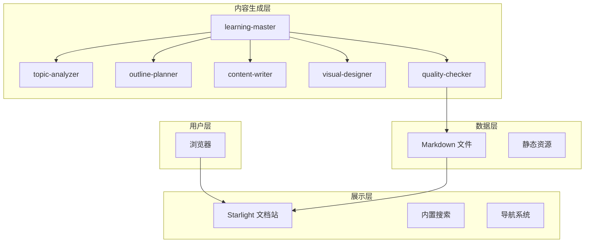
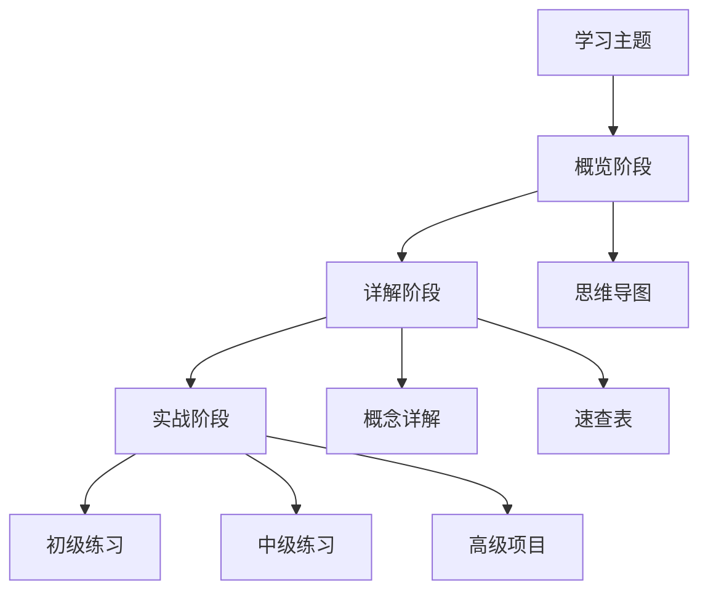
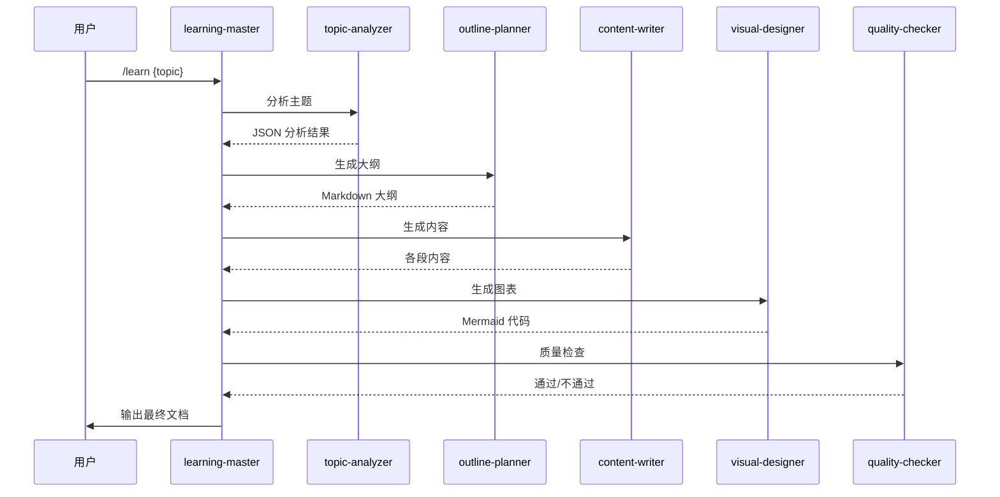

# 快速开始

<cite>
**本文引用的文件**
- [package.json](file://package.json)
- [astro.config.mjs](file://astro.config.mjs)
- [src/content.config.ts](file://src/content.config.ts)
- [src/content/docs/index.mdx](file://src/content/docs/index.mdx)
- [src/content/docs/project/architecture.md](file://src/content/docs/project/architecture.md)
- [src/content/docs/project/requirements.md](file://src/content/docs/project/requirements.md)
- [docs/01-PROJECT-BRIEF.md](file://docs/01-PROJECT-BRIEF.md)
- [docs/04-AI-SKILL-SPEC.md](file://docs/04-AI-SKILL-SPEC.md)
</cite>

## 更新摘要
**所做的更改**
- 新增 StudyBuddy 平台使用方法的详细说明
- 完善三阶段学习框架的理论基础和实践指导
- 增加平台核心理念和价值主张的阐述
- 补充技术架构和实现方案的具体说明
- 优化环境准备和项目启动的步骤指导

## 目录
1. [简介](#简介)
2. [平台核心理念](#平台核心理念)
3. [三阶段学习框架](#三阶段学习框架)
4. [环境准备与安装](#环境准备与安装)
5. [项目启动与本地预览](#项目启动与本地预览)
6. [使用 StudyBuddy 生成学习文档](#使用-studybuddy-生成学习文档)
7. [平台特色功能](#平台特色功能)
8. [常见问题解答](#常见问题解答)
9. [结语](#结语)

## 简介

StudyBuddy 是一个 AI 驱动的个人知识成长伙伴，旨在将碎片化的学习内容转化为结构化的知识体系。本指南将帮助您在 15 分钟内完成环境准备、项目启动，并体验 StudyBuddy 的核心功能。

**StudyBuddy 的核心价值主张：**
- **从记忆转向检索**：快速理解知识框架，需要时精准检索
- **从深度转向广度**：关注"何时用"而非"怎么用"
- **从线性转向网状**：重视知识点间的关联关系
- **从执行转向管理**：以管理者视角学习，关注决策而非细节实现

## 平台核心理念

### 项目愿景
AI 驱动的个人知识成长伙伴，将碎片化学习转化为结构化知识体系。

### 目标用户
- 技术管理者和终身学习者
- 偏好简洁美观、快速理解的学习方式
- 使用 AI 编程工具辅助学习的用户

### 技术架构
StudyBuddy 基于 Astro + Starlight + Mermaid 构建，采用静态优先的设计理念：



**章节来源**
- [docs/01-PROJECT-BRIEF.md](file://docs/01-PROJECT-BRIEF.md#L1-L124)
- [src/content/docs/project/architecture.md](file://src/content/docs/project/architecture.md#L1-L189)

## 三阶段学习框架

StudyBuddy 的每个学习主题都遵循统一的三阶段学习法：

### 阶段一：概览（5分钟）
- **一句话定义**：用通俗易懂的方式解释核心概念
- **核心问题**：说明解决了什么痛点
- **适用场景**：列举 3-5 个具体应用场景
- **前置知识**：学习前需要掌握的基础内容
- **思维导图**：全局知识结构概览

### 阶段二：详解（60分钟）
每个核心概念包含三个维度：
- **是什么**：概念定义 + 生活化类比
- **为什么**：解决的痛点和价值
- **怎么用**：最小可运行示例 + 速查表

### 阶段三：实战（25分钟）
按难度分级的实践练习：
- **初级**：单一特性应用（5分钟）
- **中级**：2-3个特性组合（15分钟）
- **高级**：完整项目实战（30分钟）



**章节来源**
- [src/content/docs/index.mdx](file://src/content/docs/index.mdx#L42-L56)
- [docs/04-AI-SKILL-SPEC.md](file://docs/04-AI-SKILL-SPEC.md#L373-L400)

## 环境准备与安装

### 系统要求
- **Node.js**：建议使用 LTS 版本（18.x 或 20.x）
- **操作系统**：Windows、macOS 或 Linux
- **内存**：建议 8GB RAM 以上

### 安装步骤

1. **克隆项目**
```bash
git clone https://github.com/yourusername/study-buddy.git
cd study-buddy
```

2. **安装依赖**
```bash
npm install
```

3. **验证安装**
```bash
npm run dev
```

4. **访问平台**
打开浏览器访问 `http://localhost:4321`

### 依赖说明
- **Astro 5**：静态站点生成框架
- **Starlight**：文档站点主题
- **Mermaid**：图表渲染支持
- **Sharp**：图片处理优化

**章节来源**
- [package.json](file://package.json#L1-L25)
- [astro.config.mjs](file://astro.config.mjs#L1-L43)

## 项目启动与本地预览

### 开发服务器启动
```bash
# 启动开发服务器
npm run dev

# 或者使用 start 命令
npm start
```

### 构建和预览
```bash
# 构建静态站点
npm run build

# 预览构建结果
npm run preview
```

### 配置说明
Astro 配置文件自动：
- 加载 Starlight 主题和 Obsidian 插件
- 启用中文本地化支持
- 配置三类文档分类（工具/领域/方法论）
- 启用 Mermaid 图表渲染

**章节来源**
- [astro.config.mjs](file://astro.config.mjs#L8-L42)
- [src/content.config.ts](file://src/content.config.ts#L1-L9)

## 使用 StudyBuddy 生成学习文档

### AI 内容生成流程

1. **触发生成命令**
在 Qoder 中执行：
```
/learn TypeScript --level=intermediate
```

2. **系统工作流程**


3. **生成的文档结构**
- **概览章节**：一句话定义、核心问题、适用场景
- **详解章节**：每个概念的"是什么-为什么-怎么用"
- **实战章节**：按难度分级的练习和项目
- **速查表**：每篇文档的实用参考

### 第一个示例：TypeScript 学习文档

1. **执行生成命令**
```
/learn TypeScript
```

2. **查看生成结果**
文档将保存在 `src/content/docs/domains/frontend/typescript.md`

3. **本地预览**
```bash
npm run dev
```
访问 `http://localhost:4321/domains/frontend/typescript`

**章节来源**
- [docs/04-AI-SKILL-SPEC.md](file://docs/04-AI-SKILL-SPEC.md#L159-L202)
- [docs/04-AI-SKILL-SPEC.md](file://docs/04-AI-SKILL-SPEC.md#L295-L401)

## 平台特色功能

### 1. 智能内容生成
- **多 Agent 协作**：六个专门的 AI Skill 协同工作
- **实时数据获取**：通过 MCP 工具获取最新官方文档和社区信息
- **质量保证**：内置质量检查机制，确保内容准确性

### 2. 结构化学习体验
- **三阶段框架**：概览-详解-实战的完整学习路径
- **速查表系统**：每篇文档包含实用的速查表
- **可视化图表**：自动生成思维导图和流程图

### 3. 管理者视角
- **应用场景导向**：关注"何时用"而非"怎么用"
- **知识体系构建**：强调知识点间的关联关系
- **快速检索能力**：便于后续复习和应用

### 4. 技术实现优势
- **静态优先**：构建后为纯静态文件，加载速度快
- **零运行时 JS**：提升页面性能和安全性
- **版本控制友好**：纯 Markdown 格式，便于 Git 管理

**章节来源**
- [docs/01-PROJECT-BRIEF.md](file://docs/01-PROJECT-BRIEF.md#L61-L71)
- [src/content/docs/project/architecture.md](file://src/content/docs/project/architecture.md#L160-L176)

## 常见问题解答

### 环境问题
**Q: Node.js 版本不兼容怎么办？**
A: 确保使用 LTS 版本（18.x 或 20.x），重新安装后重试。

**Q: 依赖安装失败**
A: 清理 `node_modules` 和 `package-lock.json`，使用 `npm ci` 重新安装。

**Q: 开发服务器启动失败**
A: 检查端口 4321 是否被占用，或修改 `astro.config.mjs` 中的端口配置。

### 内容生成问题
**Q: AI 生成的内容质量不高**
A: 检查 MCP 工具连接状态，确保网络访问正常。

**Q: 图表未正确渲染**
A: 验证 Mermaid 语法，检查图表标记 `<!-- DIAGRAM: type -->`。

**Q: 新增文档未显示在导航中**
A: 确认文件路径位于 `src/content/docs/` 下，检查 frontmatter 配置。

### 性能优化
**Q: 页面加载速度慢**
A: 使用生产构建 `npm run build`，检查图片优化配置。

**Q: 生成时间过长**
A: 优化主题复杂度，减少不必要的图表生成。

## 结语

通过本快速开始指南，您已经完成了 StudyBuddy 的环境准备、项目启动，并体验了 AI 驱动的三阶段学习框架。建议您：

1. **立即尝试**：使用 `/learn {your-topic}` 命令生成第一个学习文档
2. **探索分类**：浏览工具类、领域类、方法论三大分类
3. **定制使用**：根据个人需求调整学习计划和复习节奏
4. **贡献内容**：将学习心得转化为结构化文档，完善知识体系

StudyBuddy 致力于成为您个人知识成长路上的智能伙伴，帮助您在 AI 时代更好地管理和应用知识。

**下一步行动：**
- 访问 [项目架构文档](file://src/content/docs/project/architecture.md) 了解技术细节
- 查看 [需求规格](file://src/content/docs/project/requirements.md) 了解功能范围
- 探索 [AI Skill 规格](file://docs/04-AI-SKILL-SPEC.md) 了解生成机制