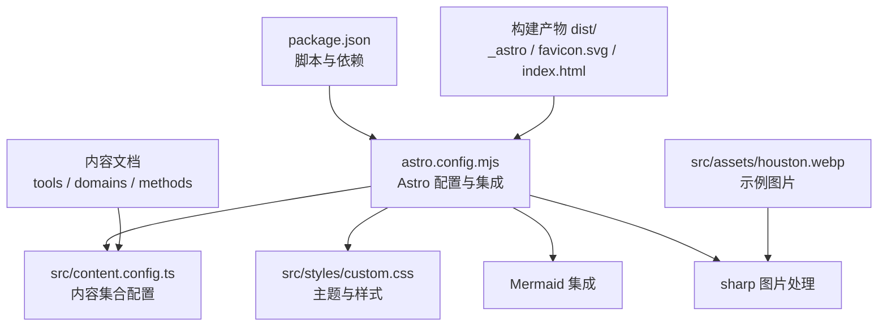
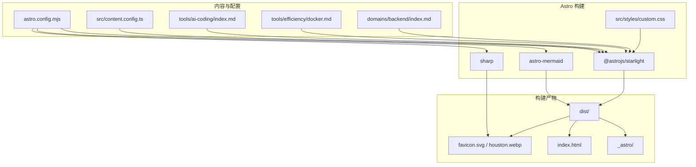
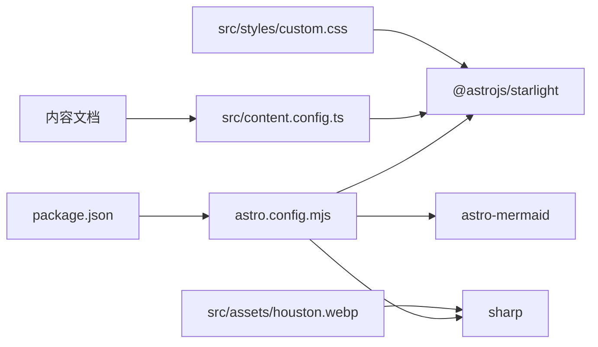

# 性能优化策略

<cite>
**本文引用的文件**
- [package.json](file://package.json)
- [astro.config.mjs](file://astro.config.mjs)
- [src/content.config.ts](file://src/content.config.ts)
- [tsconfig.json](file://tsconfig.json)
- [src/styles/custom.css](file://src/styles/custom.css)
- [src/content/docs/tools/ai-coding/index.md](file://src/content/docs/tools/ai-coding/index.md)
- [src/content/docs/tools/efficiency/docker.md](file://src/content/docs/tools/efficiency/docker.md)
- [src/content/docs/domains/backend/index.md](file://src/content/docs/domains/backend/index.md)
- [src/assets/houston.webp](file://src/assets/houston.webp)
</cite>

## 目录
1. [引言](#引言)
2. [项目结构](#项目结构)
3. [核心组件](#核心组件)
4. [架构总览](#架构总览)
5. [详细组件分析](#详细组件分析)
6. [依赖关系分析](#依赖关系分析)
7. [性能注意事项](#性能注意事项)
8. [故障排查指南](#故障排查指南)
9. [结论](#结论)
10. [附录](#附录)

## 引言
本指南面向 StudyBuddy 项目，聚焦 Astro 构建与运行时性能优化，覆盖代码分割、懒加载与预加载策略，缓存与资源压缩、CDN 集成，图片处理与格式选择，性能监控与分析工具配置，以及内存、网络与渲染性能的提升建议。同时提供不同环境下的调优策略、基准测试与持续优化实践，帮助开发者高效诊断与解决性能问题。

## 项目结构
StudyBuddy 基于 Astro 5 与 Starlight 文档主题，采用内容驱动的文档站点结构，集成 Mermaid 图表支持，并通过 sharp 实现图片处理能力。项目脚本与依赖集中在根目录配置中，内容与样式分别位于 src 目录下，构建产物输出至 dist。

图表来源
- [package.json](file://package.json#L1-L20)
- [astro.config.mjs](file://astro.config.mjs#L1-L34)
- [src/content.config.ts](file://src/content.config.ts#L1-L8)
- [src/styles/custom.css](file://src/styles/custom.css#L1-L402)
- [src/assets/houston.webp](file://src/assets/houston.webp)

章节来源
- [package.json](file://package.json#L1-L20)
- [astro.config.mjs](file://astro.config.mjs#L1-L34)
- [src/content.config.ts](file://src/content.config.ts#L1-L8)
- [tsconfig.json](file://tsconfig.json#L1-L6)

## 核心组件
- 构建与打包：Astro 5 默认使用 esbuild 进行快速打包与最小化，结合内容驱动的页面生成，减少不必要的客户端脚本。
- 文档主题：Starlight 提供现代化的文档体验，内置搜索、侧边栏与主题切换，适合知识库类站点。
- 图表支持：Mermaid 集成用于可视化流程图、思维导图等，注意按需渲染与懒加载。
- 图片处理：sharp 作为图片处理后端，支持多种格式与尺寸裁剪，配合 Astro 的静态资源处理实现高性能图片交付。
- 样式系统：自定义 CSS 变量与主题适配，兼顾暗色模式与玻璃拟态效果，避免过度动画影响首屏渲染。

章节来源
- [astro.config.mjs](file://astro.config.mjs#L1-L34)
- [src/styles/custom.css](file://src/styles/custom.css#L1-L402)
- [package.json](file://package.json#L12-L18)

## 架构总览
下图展示从内容到构建产物的整体路径，以及与第三方集成的关系。

图表来源
- [astro.config.mjs](file://astro.config.mjs#L1-L34)
- [src/content.config.ts](file://src/content.config.ts#L1-L8)
- [src/content/docs/tools/ai-coding/index.md](file://src/content/docs/tools/ai-coding/index.md#L1-L7)
- [src/content/docs/tools/efficiency/docker.md](file://src/content/docs/tools/efficiency/docker.md#L1-L205)
- [src/content/docs/domains/backend/index.md](file://src/content/docs/domains/backend/index.md#L1-L7)
- [src/assets/houston.webp](file://src/assets/houston.webp)
- [src/styles/custom.css](file://src/styles/custom.css#L1-L402)

## 详细组件分析

### 构建优化策略
- 代码分割与懒加载
  - 利用 Astro 的内容路由与组件拆分，将非关键路径的图表与交互组件延迟加载，减少首屏 JavaScript 体积。
  - 对 Mermaid 图表采用懒加载，仅在可见区域或用户交互时渲染，降低初始渲染压力。
- 预加载与预连接
  - 对关键字体与图标资源进行预连接与预加载，缩短首屏关键资源的等待时间。
  - 预加载 Starlight 主题样式与必要的 CSS 片段，确保首屏无闪烁。
- 资源最小化与压缩
  - 依赖 Astro 默认的 esbuild 压缩与 Tree Shaking，确保生产包体积最小化。
  - 对图片使用 sharp 进行多格式与多尺寸输出，结合现代格式（如 AVIF/WebP）优先策略，提升传输效率。
- CDN 集成
  - 将静态资源托管至 CDN，结合缓存头与边缘缓存，显著降低全球访问延迟。
  - 对图片与字体资源设置长缓存策略，配合内容指纹命名，确保更新可控。

章节来源
- [astro.config.mjs](file://astro.config.mjs#L1-L34)
- [package.json](file://package.json#L12-L18)

### 运行时性能优化
- 缓存策略
  - 静态资源：启用浏览器与 CDN 缓存，设置合理的 Cache-Control 与 ETag。
  - 动态内容：对 API 与搜索索引设置短期缓存，结合版本号或 ETag 控制更新。
- 资源压缩
  - 启用 Gzip 或 Brotli 压缩，优先使用 Brotli 以获得更佳压缩比。
  - 对 CSS 与 JS 进行内联关键 CSS，其余样式异步加载。
- 渲染性能
  - 减少重排与重绘：合并动画与过渡，避免强制同步布局。
  - 使用 CSS 变量与硬件加速属性（如 transform、opacity）提升动画性能。
  - 控制阴影与模糊效果的使用范围，避免大面积高成本滤镜。

章节来源
- [src/styles/custom.css](file://src/styles/custom.css#L1-L402)

### 图片处理优化
- sharp 使用
  - 在构建阶段通过 sharp 生成多尺寸与多格式图片，优先输出 WebP/AVIF，回退至 JPEG/PNG。
  - 对大图进行裁剪与质量控制，避免在客户端进行昂贵的图像变换。
- 图片格式选择
  - 现代浏览器优先使用 AVIF/WebP；对旧版浏览器保留 JPEG/PNG 并设置降级策略。
  - 对纯色或简单图形使用矢量格式（SVG），减少体积。
- 图片懒加载与占位
  - 使用低分辨率占位图（LQIP）或骨架屏，提升感知性能。
  - 对视窗外图片采用懒加载，减少初始带宽占用。

章节来源
- [package.json](file://package.json#L17-L17)
- [src/assets/houston.webp](file://src/assets/houston.webp)

### 性能监控与分析
- 工具配置
  - 使用 Web Vitals 与 Lighthouse 进行页面性能评估，定期生成报告。
  - 在生产环境集成前端埋点，收集 CLS、FCP、LCP、INP 等指标。
- 指标落地
  - 将关键指标写入日志或监控平台，设置阈值告警，及时发现回归。
- 回归防护
  - 在 CI 中加入性能基线检查，若指标劣化则阻断合并。

章节来源
- [astro.config.mjs](file://astro.config.mjs#L1-L34)

### 内存使用优化
- 组件生命周期管理
  - 及时清理事件监听与定时器，避免内存泄漏。
  - 对长列表使用虚拟滚动，限制 DOM 节点数量。
- 图片与媒体
  - 控制图片缓存大小，及时释放不再使用的资源。
  - 对视频与音频资源设置自动播放策略，避免后台资源占用。

章节来源
- [src/styles/custom.css](file://src/styles/custom.css#L1-L402)

### 网络请求优化
- 请求合并与去重
  - 合并小文件请求，减少 TCP 连接数；对重复请求进行缓存去重。
- 传输协议
  - 优先使用 HTTP/2 或 HTTP/3，启用多路复用与头部压缩。
- DNS 与连接
  - 预解析关键域名，缩短 DNS 查询时间；保持连接复用。

章节来源
- [astro.config.mjs](file://astro.config.mjs#L1-L34)

### 渲染性能提升
- 骨架屏与渐进增强
  - 首屏返回骨架屏，随后逐步填充真实内容，改善感知速度。
- 动画与特效
  - 限制阴影与模糊范围，避免大面积高成本滤镜。
  - 使用 transform 与 opacity 实现动画，减少对布局与绘制的影响。

章节来源
- [src/styles/custom.css](file://src/styles/custom.css#L1-L402)

### 不同环境下的调优策略
- 开发环境
  - 关闭图片压缩与树摇，提升构建速度；启用 Source Map 便于调试。
- 预发布环境
  - 接近生产的缓存与压缩策略，进行端到端性能验证。
- 生产环境
  - 启用 CDN、长缓存、Brotli 压缩与图片多格式输出；开启监控与告警。

章节来源
- [package.json](file://package.json#L1-L20)
- [astro.config.mjs](file://astro.config.mjs#L1-L34)

### 基准测试与持续优化
- 基准测试
  - 使用 Lighthouse、PageSpeed Insights、WebPageTest 等工具定期评测。
  - 建立性能基线，记录关键指标随版本变化的趋势。
- 持续优化
  - 在 CI 中集成性能回归检测，对关键指标设置阈值。
  - 结合用户行为数据与监控指标，迭代优化热点路径。

章节来源
- [astro.config.mjs](file://astro.config.mjs#L1-L34)

## 依赖关系分析
- 构建链路
  - Astro 5 作为核心引擎，Starlight 提供文档主题与路由，Mermaid 支持图表渲染，sharp 负责图片处理。
  - 内容通过 content.config.ts 注册，最终由 Starlight 加载并生成页面。
- 第三方集成
  - Mermaid 与 sharp 作为可选集成，按需启用，避免增加不必要的构建负担。
  - CSS 通过 Starlight 注入，确保主题一致性与性能优化。

图表来源
- [package.json](file://package.json#L1-L20)
- [astro.config.mjs](file://astro.config.mjs#L1-L34)
- [src/content.config.ts](file://src/content.config.ts#L1-L8)
- [src/styles/custom.css](file://src/styles/custom.css#L1-L402)
- [src/assets/houston.webp](file://src/assets/houston.webp)

章节来源
- [package.json](file://package.json#L1-L20)
- [astro.config.mjs](file://astro.config.mjs#L1-L34)
- [src/content.config.ts](file://src/content.config.ts#L1-L8)

## 性能注意事项
- 避免在首屏注入大量脚本与样式，优先保证关键路径最小化。
- 对 Mermaid 图表与富文本内容进行懒加载，减少初始渲染压力。
- 图片资源尽量使用现代格式与多尺寸输出，结合 CDN 与缓存策略。
- 在暗色模式与玻璃拟态效果之间平衡视觉与性能，避免过度滤镜导致卡顿。

章节来源
- [src/styles/custom.css](file://src/styles/custom.css#L1-L402)
- [astro.config.mjs](file://astro.config.mjs#L1-L34)

## 故障排查指南
- 构建失败或体积异常
  - 检查 sharp 是否正确安装与可用；确认图片路径与格式支持。
  - 核对内容集合配置是否正确，避免无效文档导致构建异常。
- 页面渲染缓慢
  - 使用浏览器性能面板定位重排/重绘热点；减少复杂阴影与模糊。
  - 对图表与富文本组件进行懒加载，观察首屏指标改善情况。
- 图片加载问题
  - 确认图片已生成多尺寸与多格式；检查 CDN 缓存与回源策略。
  - 对大图进行裁剪与压缩，避免客户端二次处理。

章节来源
- [package.json](file://package.json#L12-L18)
- [src/content.config.ts](file://src/content.config.ts#L1-L8)
- [src/styles/custom.css](file://src/styles/custom.css#L1-L402)

## 结论
通过 Astro 的高效构建、Starlight 的现代化主题、Mermaid 的按需渲染与 sharp 的图片优化，StudyBuddy 可在保证良好用户体验的同时实现卓越的性能表现。建议在各环境下实施差异化的缓存与压缩策略，并建立持续的性能监控与回归防护机制，确保长期稳定与可维护性。

## 附录
- 快速检查清单
  - 构建：启用 Tree Shaking 与最小化；按需加载图表与交互组件。
  - 资源：使用现代图片格式与多尺寸输出；启用 CDN 与长缓存。
  - 监控：接入 Web Vitals 与 Lighthouse；设置阈值告警。
  - 优化：减少阴影与模糊；使用 transform 动画；限制 DOM 数量。