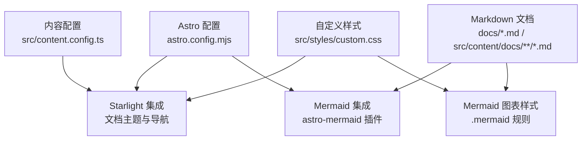
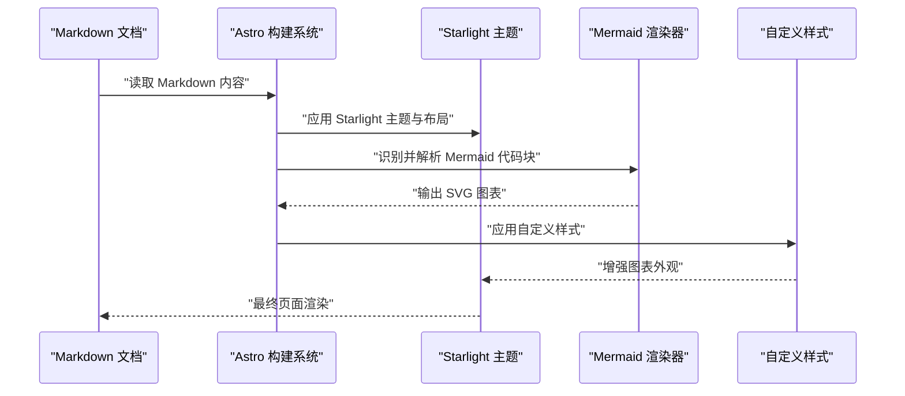
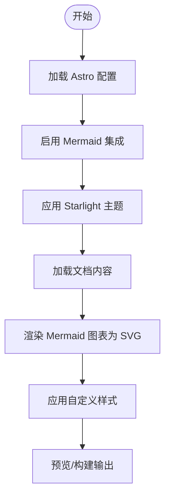
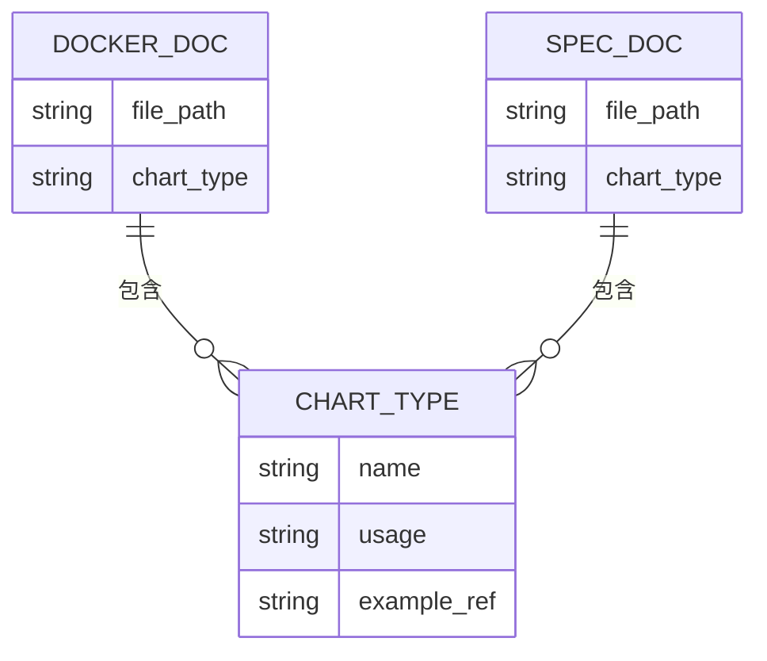
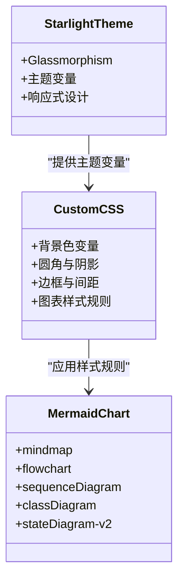
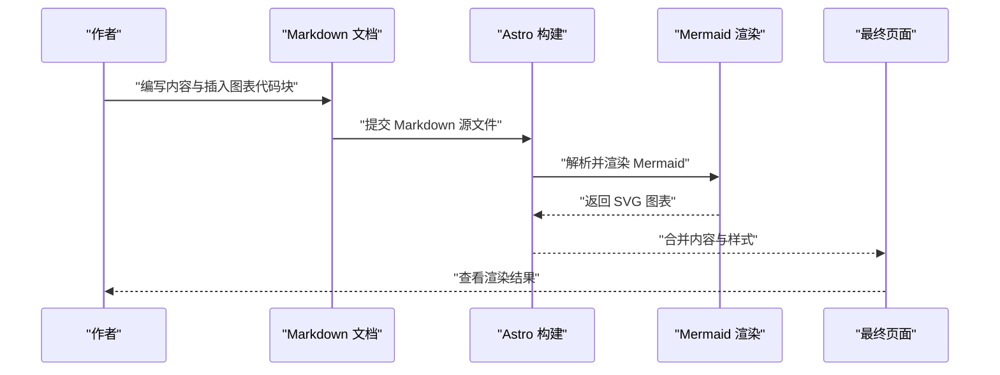
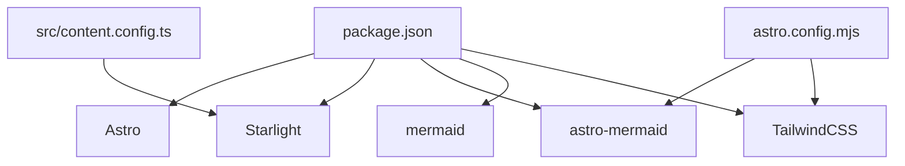

# Mermaid 图表集成

<cite>
**本文引用的文件**
- [package.json](file://package.json)
- [astro.config.mjs](file://astro.config.mjs)
- [src/content.config.ts](file://src/content.config.ts)
- [src/styles/custom.css](file://src/styles/custom.css)
- [docs/01-PROJECT-BRIEF.md](file://docs/01-PROJECT-BRIEF.md)
- [docs/03-ARCHITECTURE.md](file://docs/03-ARCHITECTURE.md)
- [docs/04-AI-SKILL-SPEC.md](file://docs/04-AI-SKILL-SPEC.md)
- [src/content/docs/tools/efficiency/docker.md](file://src/content/docs/tools/efficiency/docker.md)
</cite>

## 目录
1. [引言](#引言)
2. [项目结构](#项目结构)
3. [核心组件](#核心组件)
4. [架构总览](#架构总览)
5. [详细组件分析](#详细组件分析)
6. [依赖分析](#依赖分析)
7. [性能考虑](#性能考虑)
8. [故障排除指南](#故障排除指南)
9. [结论](#结论)
10. [附录](#附录)

## 引言
本文件面向 StudyBuddy 项目，系统化说明如何在 Astro 文档中集成与使用 Mermaid 图表，覆盖图表语法、渲染配置、样式定制、图表类型支持与最佳实践，并给出常见错误处理与性能优化建议。文档同时展示 Mermaid 如何与文档内容自然结合，帮助读者在本地静态站点中高效产出结构化可视化内容。

## 项目结构
StudyBuddy 基于 Astro + Starlight 构建文档站点，Mermaid 通过 Astro 集成插件进行渲染。核心配置位于项目根目录的配置文件中，样式定制集中在自定义 CSS 中，文档内容采用 Markdown 格式并在必要位置嵌入 Mermaid 代码块。

**图表来源**
- [astro.config.mjs](file://astro.config.mjs#L9-L39)
- [src/content.config.ts](file://src/content.config.ts#L1-L8)
- [src/styles/custom.css](file://src/styles/custom.css#L304-L312)

**章节来源**
- [astro.config.mjs](file://astro.config.mjs#L1-L39)
- [src/content.config.ts](file://src/content.config.ts#L1-L8)

## 核心组件
- Astro 配置与集成
  - 通过集成项启用 Starlight 文档主题与 Mermaid 支持，开启 TailwindCSS 插件。
- 内容加载与 Schema
  - 使用 Starlight 的文档加载器与 Schema，确保文档内容被正确解析与索引。
- 自定义样式
  - 在自定义 CSS 中为 Mermaid 图表提供统一的视觉风格，包括背景、圆角、阴影、边框与间距等。
- 文档内容
  - 在 Markdown 中使用三反引号包裹 Mermaid 语法，实现图表渲染与文档内容的无缝结合。

**章节来源**
- [astro.config.mjs](file://astro.config.mjs#L9-L39)
- [src/content.config.ts](file://src/content.config.ts#L1-L8)
- [src/styles/custom.css](file://src/styles/custom.css#L304-L312)

## 架构总览
下图展示了从内容到渲染的整体流程：Markdown 文档经由 Astro 构建，Mermaid 代码块被识别并渲染为 SVG，最终与 Starlight 主题样式协同呈现。

**图表来源**
- [astro.config.mjs](file://astro.config.mjs#L9-L39)
- [src/styles/custom.css](file://src/styles/custom.css#L304-L312)

## 详细组件分析

### 配置与集成
- 插件启用
  - 在 Astro 配置中引入 Mermaid 集成，使 Markdown 中的 Mermaid 代码块得以渲染。
- 主题与样式
  - Starlight 提供文档主题与导航；自定义 CSS 为 Mermaid 图表提供统一的视觉风格。
- Tailwind 集成
  - 通过 Vite 插件启用 TailwindCSS，便于在文档中使用原子化样式。

**图表来源**
- [astro.config.mjs](file://astro.config.mjs#L9-L39)
- [src/styles/custom.css](file://src/styles/custom.css#L304-L312)

**章节来源**
- [astro.config.mjs](file://astro.config.mjs#L9-L39)

### 图表类型与语法
- 支持的图表类型
  - 思维导图：用于知识体系概览与结构梳理。
  - 流程图：用于使用步骤、决策流程与路径规划。
  - 时序图：用于交互过程、API 调用与消息传递。
  - 类图：用于数据结构、类关系与接口设计。
  - 状态图：用于状态机、生命周期与行为建模。
- 语法示例来源
  - 文档中提供了多种图表类型的使用示例，便于参考与迁移。

**图表来源**
- [docs/03-ARCHITECTURE.md](file://docs/03-ARCHITECTURE.md#L266-L274)
- [src/content/docs/tools/efficiency/docker.md](file://src/content/docs/tools/efficiency/docker.md#L34-L51)
- [docs/04-AI-SKILL-SPEC.md](file://docs/04-AI-SKILL-SPEC.md#L545-L553)

**章节来源**
- [docs/03-ARCHITECTURE.md](file://docs/03-ARCHITECTURE.md#L266-L274)
- [docs/04-AI-SKILL-SPEC.md](file://docs/04-AI-SKILL-SPEC.md#L545-L553)

### 样式定制与主题适配
- Mermaid 图表样式
  - 通过自定义 CSS 为 .mermaid 类设置背景、圆角、阴影、边框与间距，确保图表与页面风格一致。
- 明暗主题适配
  - 在明暗主题切换时，Mermaid 图表的视觉效果随主题变量自动调整，保证可读性与一致性。
- 与 Starlight 协同
  - Mermaid 图表样式与 Starlight 的 Glassmorphism 设计语言相契合，提升整体观感。

**图表来源**
- [src/styles/custom.css](file://src/styles/custom.css#L304-L312)

**章节来源**
- [src/styles/custom.css](file://src/styles/custom.css#L304-L312)

### 与文档内容的结合方式
- 内容驱动的图表生成
  - 在文档中直接嵌入 Mermaid 代码块，实现“先有内容，再有图表”的创作流程。
- 场景化应用
  - 在“知识体系思维导图”“决策流程”等章节中，图表与文字形成互补，提升理解效率。
- 示例来源
  - Docker 文档中提供了思维导图与流程图的示例，展示如何在实际文档中组织与呈现图表。

**图表来源**
- [src/content/docs/tools/efficiency/docker.md](file://src/content/docs/tools/efficiency/docker.md#L34-L51)
- [src/content/docs/tools/efficiency/docker.md](file://src/content/docs/tools/efficiency/docker.md#L174-L187)

**章节来源**
- [src/content/docs/tools/efficiency/docker.md](file://src/content/docs/tools/efficiency/docker.md#L34-L51)
- [src/content/docs/tools/efficiency/docker.md](file://src/content/docs/tools/efficiency/docker.md#L174-L187)

### 最佳实践
- 图表类型选择
  - 用思维导图梳理知识结构，用流程图表达步骤与决策，用时序图刻画交互，用类图描述结构，用状态图表示行为。
- 语法与可读性
  - 使用清晰的节点标签与连接关系，避免过度复杂的嵌套；在长流程中分段展示，提升可读性。
- 与内容的平衡
  - 图表应服务于内容，避免“为图而图”；每个图表都应有明确的目的与上下文说明。
- 版本与维护
  - 将图表代码块与文档一起纳入版本控制，便于回溯与协作。

**章节来源**
- [docs/04-AI-SKILL-SPEC.md](file://docs/04-AI-SKILL-SPEC.md#L545-L553)

## 依赖分析
- 核心依赖
  - Astro：静态站点生成框架。
  - Starlight：文档主题与导航。
  - astro-mermaid：Mermaid 图表渲染集成。
  - mermaid：Mermaid 核心库。
  - TailwindCSS：原子化样式框架。
- 配置依赖
  - Astro 配置中启用 Mermaid 集成与 Tailwind 插件，内容配置使用 Starlight 的加载器与 Schema。

**图表来源**
- [package.json](file://package.json#L12-L20)
- [astro.config.mjs](file://astro.config.mjs#L9-L39)
- [src/content.config.ts](file://src/content.config.ts#L1-L8)

**章节来源**
- [package.json](file://package.json#L12-L20)
- [astro.config.mjs](file://astro.config.mjs#L9-L39)
- [src/content.config.ts](file://src/content.config.ts#L1-L8)

## 性能考虑
- 构建性能
  - Mermaid 图表在构建时渲染为 SVG，建议控制图表复杂度与数量，避免过多重型图表导致构建时间增长。
- 运行时性能
  - 图表以静态 SVG 输出，页面加载时开销较小；可通过懒加载策略进一步优化首屏渲染（如需）。
- 样式与主题
  - 自定义 CSS 与主题变量的使用应尽量简洁，减少不必要的重绘与回流。
- 内容组织
  - 将图表与相关段落紧密相邻，减少滚动查找成本，提升阅读体验。

## 故障排除指南
- 图表未渲染
  - 检查是否正确启用了 Mermaid 集成与 Tailwind 插件。
  - 确认 Markdown 代码块语法正确且处于受支持的图表类型范围内。
- 样式异常
  - 检查自定义 CSS 是否正确加载，确认 .mermaid 样式规则未被覆盖。
  - 在明暗主题切换后，确认主题变量生效。
- 构建失败或报错
  - 确认依赖版本兼容性，尤其是 Astro、Starlight 与 Mermaid 的版本匹配。
  - 若使用自定义配置，检查配置文件中的集成项顺序与参数。

**章节来源**
- [astro.config.mjs](file://astro.config.mjs#L9-L39)
- [src/styles/custom.css](file://src/styles/custom.css#L304-L312)

## 结论
StudyBuddy 通过 Astro + Starlight + Mermaid 的组合，实现了文档与可视化的深度融合。借助统一的样式体系与清晰的配置结构，Mermaid 图表能够自然融入文档内容，显著提升知识体系的理解与检索效率。遵循本文提供的语法、配置与最佳实践，可在本地静态站点中稳定、高效地生成高质量的可视化内容。

## 附录
- 项目简介中明确指出 Mermaid 为“Markdown 原生语法、AI 直接生成”，体现了其在项目中的核心地位。
- 架构文档中对 Mermaid 集成方式与支持类型进行了系统说明，便于迁移与扩展。
- Docker 文档提供了思维导图与流程图的实际示例，可作为后续文档的参考模板。

**章节来源**
- [docs/01-PROJECT-BRIEF.md](file://docs/01-PROJECT-BRIEF.md#L67-L68)
- [docs/03-ARCHITECTURE.md](file://docs/03-ARCHITECTURE.md#L244-L274)
- [src/content/docs/tools/efficiency/docker.md](file://src/content/docs/tools/efficiency/docker.md#L34-L51)
- [src/content/docs/tools/efficiency/docker.md](file://src/content/docs/tools/efficiency/docker.md#L174-L187)