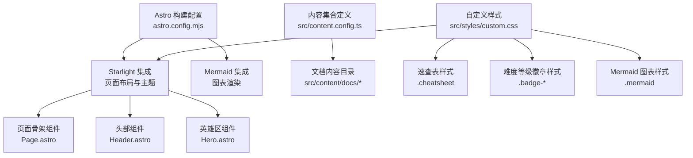
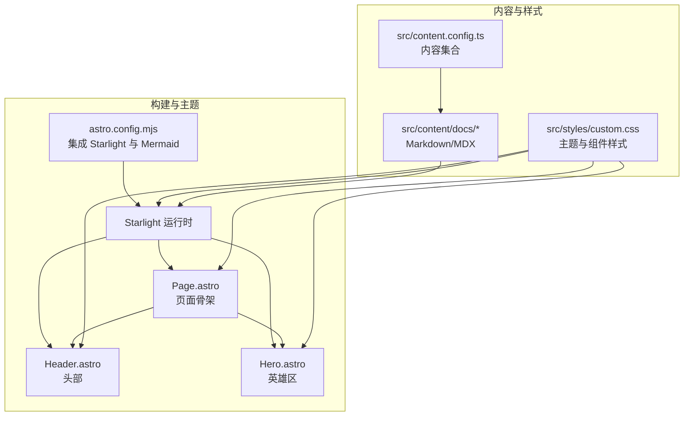
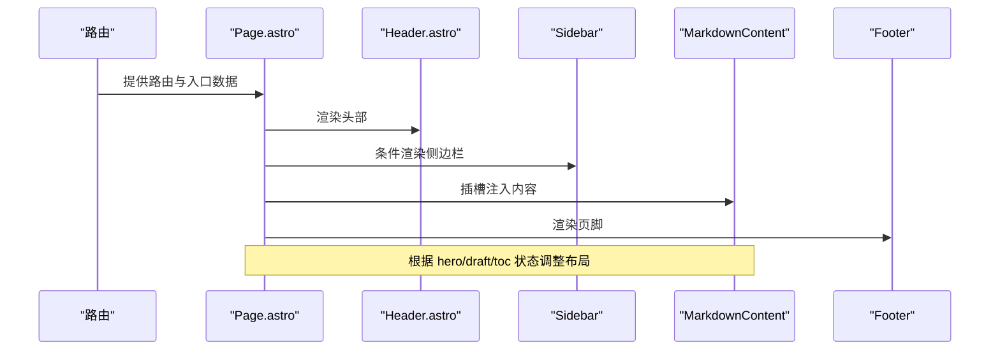
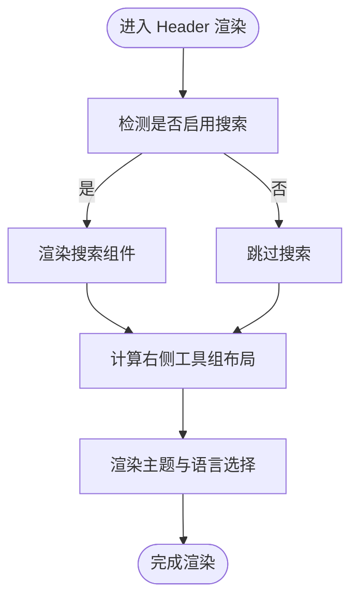
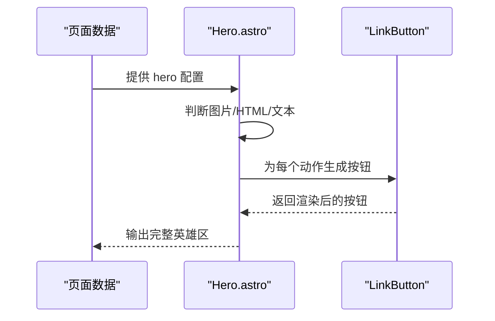
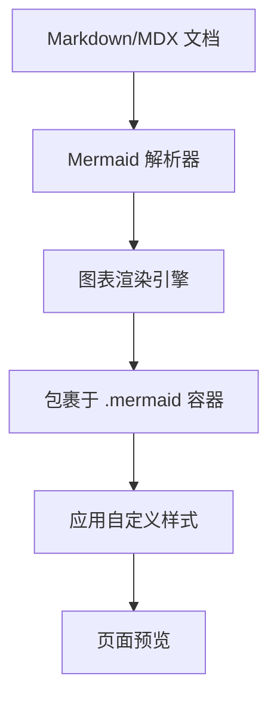
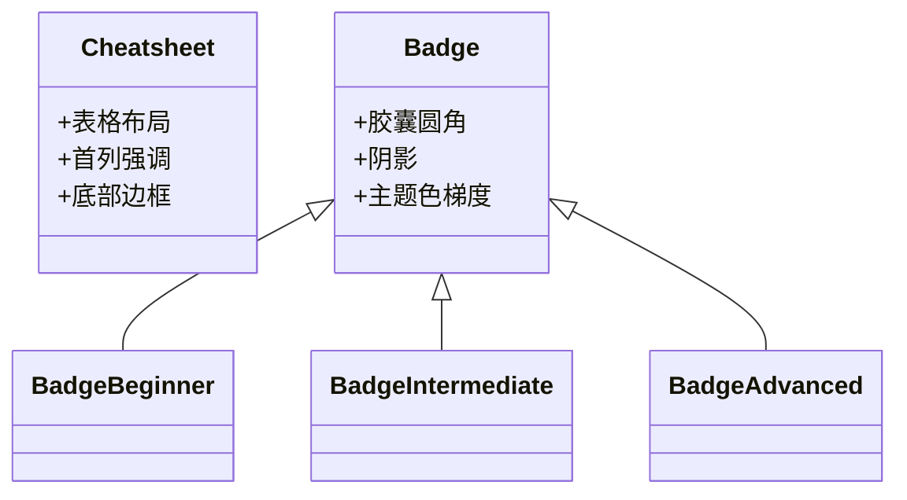
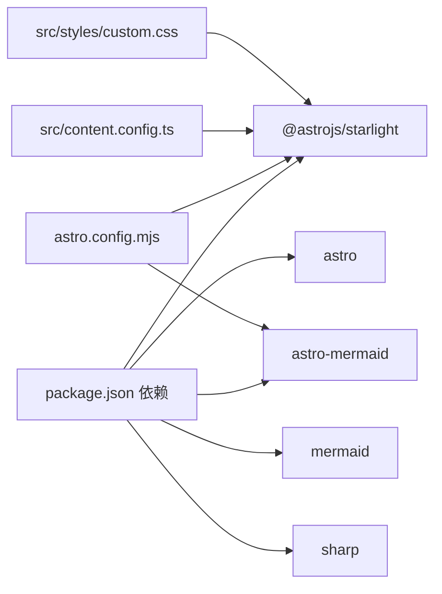

# 关键模块设计

<cite>
**本文引用的文件**
- [package.json](file://package.json)
- [astro.config.mjs](file://astro.config.mjs)
- [src/content.config.ts](file://src/content.config.ts)
- [src/styles/custom.css](file://src/styles/custom.css)
- [node_modules/@astrojs/starlight/components/Hero.astro](file://node_modules/@astrojs/starlight/components/Hero.astro)
- [node_modules/@astrojs/starlight/components/Header.astro](file://node_modules/@astrojs/starlight/components/Header.astro)
- [node_modules/@astrojs/starlight/components/Page.astro](file://node_modules/@astrojs/starlight/components/Page.astro)
- [src/content/docs/domains/backend/index.md](file://src/content/docs/domains/backend/index.md)
- [src/content/docs/tools/ai-coding/index.md](file://src/content/docs/tools/ai-coding/index.md)
- [src/content/docs/methods/learning/index.md](file://src/content/docs/methods/learning/index.md)
</cite>

## 目录
1. [引言](#引言)
2. [项目结构](#项目结构)
3. [核心组件](#核心组件)
4. [架构总览](#架构总览)
5. [详细组件分析](#详细组件分析)
6. [依赖关系分析](#依赖关系分析)
7. [性能考虑](#性能考虑)
8. [故障排查指南](#故障排查指南)
9. [结论](#结论)
10. [附录](#附录)

## 引言
本设计文档聚焦 StudyBuddy 项目的“关键模块”，围绕以下目标展开：
- 明确核心组件的设计与实现思路，包括页面骨架、导航、主题与样式体系、Mermaid 图表渲染、以及自定义速查表与难度等级标签组件的样式与交互策略。
- 解释 Astro 组件开发模式与 MDX/Markdown 内容组织方式在 Starlight 中的应用。
- 文档化组件接口设计、属性定义与样式定制路径，总结组件组合模式与复用策略。
- 提供开发规范与最佳实践，并给出可溯源的代码片段路径与使用场景。

## 项目结构
StudyBuddy 基于 Astro 与 Starlight 构建，采用内容驱动的文档站点结构。核心配置集中在构建与主题层，内容通过 Markdown/MDX 文件组织，样式通过自定义 CSS 定制主题与组件外观。

**图示来源**
- [astro.config.mjs](file://astro.config.mjs#L7-L32)
- [src/content.config.ts](file://src/content.config.ts#L5-L7)
- [node_modules/@astrojs/starlight/components/Page.astro](file://node_modules/@astrojs/starlight/components/Page.astro#L15-L31)
- [node_modules/@astrojs/starlight/components/Header.astro](file://node_modules/@astrojs/starlight/components/Header.astro#L17-L31)
- [node_modules/@astrojs/starlight/components/Hero.astro](file://node_modules/@astrojs/starlight/components/Hero.astro#L32-L64)
- [src/styles/custom.css](file://src/styles/custom.css#L261-L344)

**章节来源**
- [astro.config.mjs](file://astro.config.mjs#L7-L32)
- [src/content.config.ts](file://src/content.config.ts#L5-L7)
- [src/styles/custom.css](file://src/styles/custom.css#L1-L402)

## 核心组件
本节从“页面骨架”“导航与头部”“内容渲染”“Mermaid 图表”“自定义样式组件（速查表、难度等级徽章）”五个维度梳理核心模块。

- 页面骨架与布局
  - Page.astro 负责组装页面结构，挂载头部、侧边栏、主内容区、页脚与主题提供器；根据路由数据决定是否展示英雄区与目录导航。
  - 接口要点：通过 slot 插槽与数据属性控制布局状态（如 data-has-hero、data-has-sidebar、data-has-toc），并注入打印样式与滚动锚点偏移。
  - 参考路径：[页面骨架组件](file://node_modules/@astrojs/starlight/components/Page.astro#L84-L124)

- 导航与头部
  - Header.astro 渲染站点标题、搜索框、社交图标、主题切换与语言选择；支持按配置条件渲染搜索组件。
  - 接口要点：通过虚拟组件与配置开关控制渲染项；响应式布局在窄屏隐藏搜索与右侧工具组。
  - 参考路径：[头部组件](file://node_modules/@astrojs/starlight/components/Header.astro#L17-L31)

- 英雄区（可选）
  - Hero.astro 支持图片/HTML 内容与操作按钮集合；根据数据动态渲染标题、副标题与动作按钮。
  - 接口要点：接收 data.hero 配置，支持深浅主题图片或原生 HTML 片段；动作按钮支持图标与变体。
  - 参考路径：[英雄区组件](file://node_modules/@astrojs/starlight/components/Hero.astro#L32-L64)

- Mermaid 图表
  - 通过 astro-mermaid 集成，在 Markdown/MDX 中以 Mermaid 语法编写流程图、时序图等，自动渲染为交互式图表。
  - 样式要点：.mermaid 类提供毛玻璃背景、圆角、边框与阴影，确保图表在文档流中统一风格。
  - 参考路径：[Mermaid 样式](file://src/styles/custom.css#L261-L269)

- 自定义组件：速查表与难度等级徽章
  - 速查表（.cheatsheet）：表格紧凑、首列加粗强调、底部边框收尾，整体毛玻璃与阴影风格。
  - 难度徽章（.badge、.badge-beginner/intermediate/advanced）：圆角胶囊样式，随主题切换颜色梯度，暗色模式下强调色更柔和。
  - 参考路径：[速查表样式](file://src/styles/custom.css#L271-L302)、[难度徽章样式](file://src/styles/custom.css#L303-L344)

**章节来源**
- [node_modules/@astrojs/starlight/components/Page.astro](file://node_modules/@astrojs/starlight/components/Page.astro#L15-L31)
- [node_modules/@astrojs/starlight/components/Header.astro](file://node_modules/@astrojs/starlight/components/Header.astro#L17-L31)
- [node_modules/@astrojs/starlight/components/Hero.astro](file://node_modules/@astrojs/starlight/components/Hero.astro#L32-L64)
- [src/styles/custom.css](file://src/styles/custom.css#L261-L344)

## 架构总览
下图展示从构建配置到页面渲染的关键链路，以及内容与样式的耦合关系。

**图示来源**
- [astro.config.mjs](file://astro.config.mjs#L7-L32)
- [src/content.config.ts](file://src/content.config.ts#L5-L7)
- [node_modules/@astrojs/starlight/components/Page.astro](file://node_modules/@astrojs/starlight/components/Page.astro#L84-L124)
- [node_modules/@astrojs/starlight/components/Header.astro](file://node_modules/@astrojs/starlight/components/Header.astro#L17-L31)
- [node_modules/@astrojs/starlight/components/Hero.astro](file://node_modules/@astrojs/starlight/components/Hero.astro#L32-L64)
- [src/styles/custom.css](file://src/styles/custom.css#L1-L402)

## 详细组件分析

### 页面骨架组件（Page.astro）
- 设计模式
  - 组合模式：通过多个虚拟组件（Header、Sidebar、Hero、MarkdownContent、Footer 等）组合形成完整页面。
  - 条件渲染：依据路由元数据（是否有侧边栏、是否有英雄区、是否启用目录）设置 HTML 数据属性，驱动样式与布局。
  - 复用策略：所有页面共享同一骨架，仅内容区由 Markdown/MDX 内容填充。
- 属性与接口
  - 输入：Astro.locals.starlightRoute 提供路由信息、入口数据、目录与方向等。
  - 输出：渲染完整的 HTML 结构，注入主题提供器与打印样式。
- 样式定制
  - 通过自定义 CSS 覆盖全局与组件级样式，例如侧边栏、主内容区、页脚等区域的毛玻璃与阴影效果。
- 复杂度与性能
  - 组合组件数量固定，渲染开销主要来自内容解析与 Mermaid 图表渲染；可通过懒加载与按需渲染优化。

**图示来源**
- [node_modules/@astrojs/starlight/components/Page.astro](file://node_modules/@astrojs/starlight/components/Page.astro#L84-L124)
- [node_modules/@astrojs/starlight/components/Header.astro](file://node_modules/@astrojs/starlight/components/Header.astro#L17-L31)

**章节来源**
- [node_modules/@astrojs/starlight/components/Page.astro](file://node_modules/@astrojs/starlight/components/Page.astro#L34-L48)
- [node_modules/@astrojs/starlight/components/Page.astro](file://node_modules/@astrojs/starlight/components/Page.astro#L84-L124)

### 导航与头部组件（Header.astro）
- 设计模式
  - 条件渲染：根据配置决定是否渲染搜索框；移动端与桌面端布局差异明显。
  - 组合模式：聚合语言选择、主题切换、社交图标与站点标题。
- 属性与接口
  - 输入：虚拟组件与用户配置；输出：响应式头部区域。
- 样式定制
  - 通过自定义 CSS 控制间距、对齐与毛玻璃背景，适配不同屏幕尺寸。

**图示来源**
- [node_modules/@astrojs/starlight/components/Header.astro](file://node_modules/@astrojs/starlight/components/Header.astro#L13-L31)

**章节来源**
- [node_modules/@astrojs/starlight/components/Header.astro](file://node_modules/@astrojs/starlight/components/Header.astro#L17-L31)

### 英雄区组件（Hero.astro）
- 设计模式
  - 动态内容：支持图片（深浅主题）、HTML 片段与多按钮动作集合。
  - 组合模式：与 LinkButton 用户组件协作，统一按钮样式与交互。
- 属性与接口
  - 输入：data.hero（标题、副标题、图片/HTML、动作按钮列表）。
  - 输出：居中/左对齐的标题、副标题与操作按钮区。
- 样式定制
  - 通过自定义 CSS 与组件内层样式共同作用，确保在不同布局下的视觉一致性。

**图示来源**
- [node_modules/@astrojs/starlight/components/Hero.astro](file://node_modules/@astrojs/starlight/components/Hero.astro#L32-L64)

**章节来源**
- [node_modules/@astrojs/starlight/components/Hero.astro](file://node_modules/@astrojs/starlight/components/Hero.astro#L6-L29)
- [node_modules/@astrojs/starlight/components/Hero.astro](file://node_modules/@astrojs/starlight/components/Hero.astro#L32-L64)

### Mermaid 图表组件
- 设计模式
  - 在 Markdown/MDX 中直接书写 Mermaid 语法，经 astro-mermaid 转换为 SVG/HTML 并注入 .mermaid 容器。
- 属性与接口
  - 输入：Mermaid 语法字符串（流程图、时序图、甘特图等）。
  - 输出：带样式容器的交互式图表。
- 样式定制
  - .mermaid 类提供统一的背景、圆角、边框与阴影，确保图表与文档风格一致。

**图示来源**
- [astro.config.mjs](file://astro.config.mjs#L31-L31)
- [src/styles/custom.css](file://src/styles/custom.css#L261-L269)

**章节来源**
- [astro.config.mjs](file://astro.config.mjs#L31-L31)
- [src/styles/custom.css](file://src/styles/custom.css#L261-L269)

### 自定义组件：速查表与难度等级徽章
- 速查表（.cheatsheet）
  - 结构：表格形式，首列强调、紧凑间距、底部边框收尾。
  - 样式：毛玻璃背景、圆角、边框与阴影，适配暗/亮主题。
- 难度徽章（.badge、.badge-beginner/intermediate/advanced）
  - 形态：胶囊圆角，小字号，带阴影；随主题切换颜色梯度。
  - 使用场景：在文档中快速标注技能层级或学习阶段，提升信息密度与可读性。

**图示来源**
- [src/styles/custom.css](file://src/styles/custom.css#L271-L302)
- [src/styles/custom.css](file://src/styles/custom.css#L303-L344)

**章节来源**
- [src/styles/custom.css](file://src/styles/custom.css#L271-L344)

## 依赖关系分析
- 构建与运行时依赖
  - Astro 与 @astrojs/starlight：提供页面骨架、导航、侧边栏、主题与内容加载能力。
  - astro-mermaid 与 mermaid：提供 Mermaid 图表渲染能力。
  - sharp：图像处理能力（用于内容资产优化）。
- 配置与内容
  - astro.config.mjs：注册 Starlight 与 Mermaid 集成，配置侧边栏与自定义 CSS。
  - src/content.config.ts：定义文档集合加载器与 Schema，使内容可被路由与索引。
- 组件间耦合
  - Page.astro 作为中枢，耦合 Header、Sidebar、Hero、MarkdownContent、Footer 等组件；通过 slot 与数据属性解耦具体实现细节。
  - 自定义样式通过类名与 CSS 变量与组件解耦，便于主题切换与主题覆盖。

**图示来源**
- [package.json](file://package.json#L12-L18)
- [astro.config.mjs](file://astro.config.mjs#L7-L32)
- [src/content.config.ts](file://src/content.config.ts#L5-L7)
- [src/styles/custom.css](file://src/styles/custom.css#L1-L402)

**章节来源**
- [package.json](file://package.json#L12-L18)
- [astro.config.mjs](file://astro.config.mjs#L7-L32)
- [src/content.config.ts](file://src/content.config.ts#L5-L7)

## 性能考虑
- 图表渲染
  - Mermaid 图表在页面中数量较多时，建议控制并发渲染与延迟初始化，避免阻塞首屏。
- 图像与资源
  - 使用 sharp 优化图片尺寸与格式，结合懒加载与响应式尺寸减少带宽占用。
- 样式与主题
  - CSS 变量与暗/亮主题切换应尽量避免频繁重排；优先使用 transform 与 opacity 动画。
- 内容加载
  - Starlight 的内容加载器与自动侧边栏生成已优化目录遍历；建议保持内容目录扁平化与命名规范，减少构建时间。

## 故障排查指南
- Mermaid 图表不显示
  - 检查 astro.config.mjs 是否正确注册 mermaid 集成。
  - 确认 Markdown/MDX 中 Mermaid 语法正确且处于允许渲染的上下文中。
  - 参考路径：[Mermaid 集成配置](file://astro.config.mjs#L31-L31)、[Mermaid 样式](file://src/styles/custom.css#L261-L269)
- 主题切换异常
  - 检查自定义 CSS 中的主题变量与暗/亮模式规则是否生效。
  - 参考路径：[主题变量与暗色模式规则](file://src/styles/custom.css#L21-L31)
- 侧边栏或目录不显示
  - 检查 Page.astro 的数据属性设置与路由元数据，确认 hasSidebar 与 toc 的值。
  - 参考路径：[页面骨架数据属性](file://node_modules/@astrojs/starlight/components/Page.astro#L41-L44)
- 自定义组件样式未生效
  - 确认类名与自定义 CSS 选择器匹配；检查 CSS 优先级与覆盖顺序。
  - 参考路径：[速查表样式](file://src/styles/custom.css#L271-L302)、[难度徽章样式](file://src/styles/custom.css#L303-L344)

**章节来源**
- [astro.config.mjs](file://astro.config.mjs#L31-L31)
- [src/styles/custom.css](file://src/styles/custom.css#L21-L31)
- [node_modules/@astrojs/starlight/components/Page.astro](file://node_modules/@astrojs/starlight/components/Page.astro#L41-L44)
- [src/styles/custom.css](file://src/styles/custom.css#L271-L344)

## 结论
StudyBuddy 的关键模块以 Starlight 为核心骨架，结合 Astro 的内容驱动与组件化能力，实现了高可定制的文档站点。Mermaid 图表与自定义速查表、难度徽章等组件通过统一的样式体系与主题变量实现一致的视觉体验。通过合理的组件组合与样式解耦，项目具备良好的扩展性与维护性。

## 附录
- 内容示例路径
  - 后端领域示例：[后端开发](file://src/content/docs/domains/backend/index.md#L1-L7)
  - AI 编程工具示例：[AI 编程工具](file://src/content/docs/tools/ai-coding/index.md#L1-L7)
  - 学习方法示例：[学习方法](file://src/content/docs/methods/learning/index.md#L1-L7)
- 开发与构建命令
  - 参考路径：[脚本与依赖](file://package.json#L5-L18)