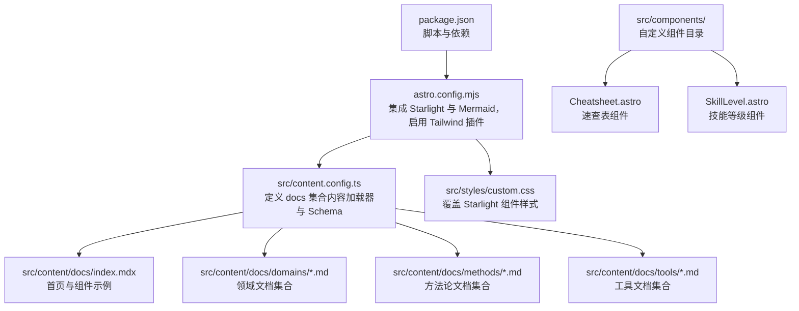
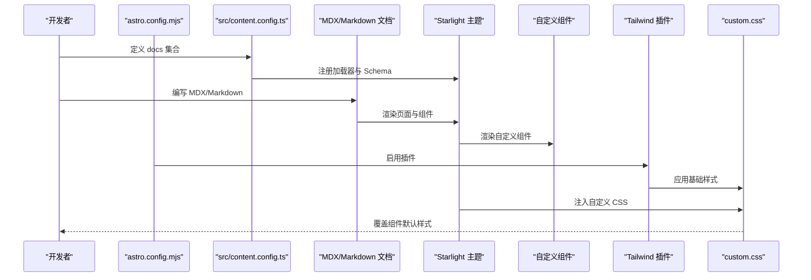
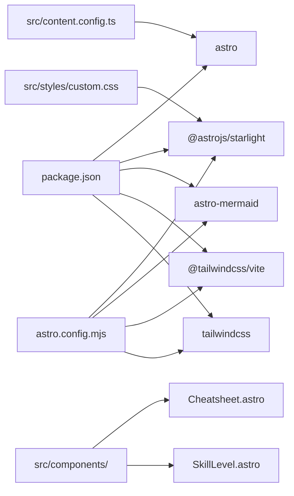

# 组件开发规范

<cite>
**本文引用的文件**
- [package.json](file://package.json)
- [astro.config.mjs](file://astro.config.mjs)
- [src/content.config.ts](file://src/content.config.ts)
- [src/components/Cheatsheet.astro](file://src/components/Cheatsheet.astro)
- [src/components/SkillLevel.astro](file://src/components/SkillLevel.astro)
- [docs/03-ARCHITECTURE.md](file://docs/03-ARCHITECTURE.md)
- [src/content/docs/project/requirements.md](file://src/content/docs/project/requirements.md)
- [src/content/docs/tools/getting-started.md](file://src/content/docs/tools/getting-started.md)
- [src/styles/custom.css](file://src/styles/custom.css)
- [src/content/docs/index.mdx](file://src/content/docs/index.mdx)
- [src/content/docs/domains/index.md](file://src/content/docs/domains/index.md)
- [src/content/docs/domains/typescript.md](file://src/content/docs/domains/typescript.md)
- [src/content/docs/methods/index.md](file://src/content/docs/methods/index.md)
- [src/content/docs/tools/index.md](file://src/content/docs/tools/index.md)
</cite>

## 更新摘要
**变更内容**
- 新增自定义组件开发规范章节，建立 Cheatsheet 和 SkillLevel 组件的开发标准
- 完善组件复用策略与组合模式，增加实际组件示例
- 更新组件测试方法与调试技巧，包含自定义组件的调试方法
- 新增组件开发最佳实践和性能考虑

## 目录
1. 引言
2. 项目结构
3. 核心组件
4. 自定义组件开发规范
5. 架构总览
6. 详细组件分析
7. 依赖分析
8. 性能考虑
9. 故障排查指南
10. 结论
11. 附录

## 引言
本规范面向 StudyBuddy 项目，系统化阐述 Astro 组件与 MDX 的开发模式、样式定制原则、组件复用与组合策略、测试与调试方法，并提供可落地的开发示例与代码模板路径，帮助团队在保持一致性的前提下高效迭代。

**更新** 新增自定义组件开发规范，建立 Cheatsheet 和 SkillLevel 组件的开发标准，完善组件开发最佳实践。

## 项目结构
- 采用 Astro 5 与 Starlight 文档主题，结合 Tailwind v4 与自定义 CSS，形成"内容驱动 + 主题样式"的文档站点架构。
- 内容通过 Astro Content 集合加载，Starlight 自动根据目录生成侧边栏与页面路由。
- 样式通过自定义 CSS 文件覆盖 Starlight 组件默认样式，统一视觉与交互体验。
- **新增** 自定义组件目录 `src/components/`，包含 Cheatsheet 和 SkillLevel 等业务组件。



**图表来源**
- [package.json](file://package.json#L1-L25)
- [astro.config.mjs](file://astro.config.mjs#L1-L43)
- [src/content.config.ts](file://src/content.config.ts#L1-L8)
- [src/styles/custom.css](file://src/styles/custom.css#L1-L614)
- [src/content/docs/index.mdx](file://src/content/docs/index.mdx#L1-L73)
- [src/components/Cheatsheet.astro](file://src/components/Cheatsheet.astro#L1-L23)
- [src/components/SkillLevel.astro](file://src/components/SkillLevel.astro#L1-L25)

**章节来源**
- [package.json](file://package.json#L1-L25)
- [astro.config.mjs](file://astro.config.mjs#L1-L43)
- [src/content.config.ts](file://src/content.config.ts#L1-L8)
- [src/components/Cheatsheet.astro](file://src/components/Cheatsheet.astro#L1-L23)
- [src/components/SkillLevel.astro](file://src/components/SkillLevel.astro#L1-L25)

## 核心组件
- 内容集合与加载
  - 通过 Astro Content 的 docs 集合加载 Markdown/MDX 文档，使用 Starlight 的加载器与 Schema，确保标题、描述、布局等元数据一致性。
  - 参考路径：[docs 集合定义](file://src/content.config.ts#L5-L7)

- 主题与样式
  - 通过 Astro 配置启用 Tailwind 插件，并在 Starlight 中注入自定义 CSS，实现对导航、侧边栏、卡片、表格、Mermaid 图表等组件的统一风格覆盖。
  - 参考路径：[Starlight 自定义 CSS 注入](file://astro.config.mjs#L17-L17)，[自定义样式覆盖](file://src/styles/custom.css#L1-L614)

- MDX 组件使用
  - 在 MDX 页面中引入 Starlight 组件（如链接卡片、网格容器），并通过自定义类名实现布局与交互。
  - 参考路径：[首页 MDX 示例与组件导入](file://src/content.docs/index.mdx#L17-L17)，[首页网格与卡片结构](file://src/content.docs/index.mdx#L21-L62)

- **新增** 自定义组件集成
  - 在 Astro 组件中通过标准的 Astro props 接口定义组件属性，支持类型安全的属性传递。
  - 组件通过 `<style>` 标签内联样式，确保样式作用域隔离。
  - 参考路径：[Cheatsheet 组件实现](file://src/components/Cheatsheet.astro#L1-L23)，[SkillLevel 组件实现](file://src/components/SkillLevel.astro#L1-L25)

**章节来源**
- [src/content.config.ts](file://src/content.config.ts#L1-L8)
- [astro.config.mjs](file://astro.config.mjs#L17-L17)
- [src/styles/custom.css](file://src/styles/custom.css#L1-L614)
- [src/content.docs/index.mdx](file://src/content.docs/index.mdx#L17-L17)
- [src/content.docs/index.mdx](file://src/content.docs/index.mdx#L21-L62)
- [src/components/Cheatsheet.astro](file://src/components/Cheatsheet.astro#L1-L23)
- [src/components/SkillLevel.astro](file://src/components/SkillLevel.astro#L1-L25)

## 自定义组件开发规范

### Cheatsheet 速查表组件
**组件设计目标**
- 提供结构化的速查表展示，支持标题和键值对列表的展示
- 采用表格布局，左侧显示键名（加粗并代码样式），右侧显示值
- 内置背景色、圆角边框和内边距，确保良好的视觉层次

**接口定义与属性规范**
```typescript
interface Props {
  title: string;           // 速查表标题
  items: {              // 速查表条目数组
    key: string;         // 键名（左侧显示）
    value: string;       // 值（右侧显示）
  }[];
}
```

**样式设计原则**
- 背景使用 `var(--sl-color-bg-nav)` 变量，确保与主题一致
- 圆角半径 8px，提供柔和的视觉效果
- 左侧列宽 40%，键名加粗显示
- 表格宽度 100%，边框合并消除重复线条

**使用示例**
```astro
<Cheatsheet 
  title="常用命令"
  items={[
    { key: "npm install", value: "安装依赖" },
    { key: "npm run dev", value: "启动开发服务器" }
  ]} 
/>
```

**章节来源**
- [src/components/Cheatsheet.astro](file://src/components/Cheatsheet.astro#L1-L23)
- [docs/03-ARCHITECTURE.md](file://docs/03-ARCHITECTURE.md#L276-L319)

### SkillLevel 技能等级组件
**组件设计目标**
- 以图标和文本的形式展示技能等级，支持初级、中级、高级三种状态
- 使用 Emoji 图标提供直观的视觉识别
- 支持响应式布局，适合在文档中嵌入使用

**接口定义与属性规范**
```typescript
interface Props {
  level: 'beginner' | 'intermediate' | 'advanced';  // 技能等级
}
```

**设计规范**
- 初级：🌱（嫩芽）- 绿色系，代表入门水平
- 中级：🌿（小草）- 绿色系，代表有一定基础
- 高级：🌳（大树）- 绿色系，代表熟练水平

**样式与交互**
- 通过 CSS 类名动态绑定，支持条件样式
- 图标与标签之间保持适当的间距
- 整体采用行内块元素，不影响周围文本布局

**使用示例**
```astro
<SkillLevel level="intermediate" />
```

**章节来源**
- [src/components/SkillLevel.astro](file://src/components/SkillLevel.astro#L1-L25)
- [docs/03-ARCHITECTURE.md](file://docs/03-ARCHITECTURE.md#L276-L319)

### 组件开发最佳实践
**类型安全**
- 使用 TypeScript 接口定义组件属性，确保编译时类型检查
- 对枚举类型的属性使用联合类型，限制可能的取值范围

**样式隔离**
- 在组件内部使用 `<style>` 标签定义样式，避免全局样式污染
- 使用 CSS 变量确保与主题系统的兼容性

**性能优化**
- 避免在组件中进行复杂的计算逻辑
- 使用 Astro 的静态生成特性，减少运行时开销

**可维护性**
- 组件命名采用帕斯卡命名法，与文件名保持一致
- 属性命名使用驼峰命名法，保持代码一致性

**章节来源**
- [src/components/Cheatsheet.astro](file://src/components/Cheatsheet.astro#L1-L23)
- [src/components/SkillLevel.astro](file://src/components/SkillLevel.astro#L1-L25)

## 架构总览
下图展示从内容到渲染的关键流程：内容收集 → Starlight 渲染 → Tailwind 样式 → 自定义覆盖 → **自定义组件渲染** → 浏览器呈现。



**图表来源**
- [astro.config.mjs](file://astro.config.mjs#L1-L43)
- [src/content.config.ts](file://src/content.config.ts#L1-L8)
- [src/styles/custom.css](file://src/styles/custom.css#L1-L614)
- [src/content.docs/index.mdx](file://src/content.docs/index.mdx#L1-L73)
- [src/components/Cheatsheet.astro](file://src/components/Cheatsheet.astro#L1-L23)
- [src/components/SkillLevel.astro](file://src/components/SkillLevel.astro#L1-L25)

## 详细组件分析

### 组件开发模式与 MDX 语法规范
- 组件结构
  - 使用 Astro/Starlight 提供的内置组件（如链接卡片、网格容器）作为基础布局单元，通过自定义类名控制外观与交互。
  - **新增** 自定义组件通过标准的 Astro 组件语法开发，支持 props 接口定义和内联样式。
  - 示例参考：[首页网格与卡片结构](file://src/content.docs/index.mdx#L21-L62)，[自定义组件示例](file://src/components/Cheatsheet.astro#L10-L22)

- 属性定义
  - MDX 页面可通过 Front Matter 定义标题、描述、模板与 Hero 动作按钮等元数据，用于控制页面头部展示与导航入口。
  - **新增** 自定义组件通过 TypeScript 接口定义属性，支持类型安全的属性传递。
  - 示例参考：[Cheatsheet 属性定义](file://src/components/Cheatsheet.astro#L2-L5)，[SkillLevel 属性定义](file://src/components/SkillLevel.astro#L2-L4)

- 生命周期管理
  - Astro/Starlight 为静态站点生成提供构建期与运行期的生命周期钩子；组件层面建议遵循"声明式渲染 + 最小副作用"的模式，避免在组件内进行复杂状态管理。
  - **新增** 自定义组件在构建时完成渲染，无需运行时状态管理。
  - 参考路径：[astro.config.mjs 集成项与插件](file://astro.config.mjs#L10-L41)

- MDX 语法要点
  - 导入组件：使用 import 语句引入 Starlight 组件或自定义模块。
  - JSX 布局：在 MDX 中直接书写 JSX，配合自定义类名实现响应式与主题适配。
  - **新增** 自定义组件使用：`import Cheatsheet from '../components/Cheatsheet.astro'`
  - 示例参考：[组件导入与 JSX 使用](file://src/content.docs/index.mdx#L17-L17)

**章节来源**
- [src/content.docs/index.mdx](file://src/content.docs/index.mdx#L1-L15)
- [src/content.docs/index.mdx](file://src/content.docs/index.mdx#L17-L17)
- [src/content.docs/index.mdx](file://src/content.docs/index.mdx#L21-L62)
- [astro.config.mjs](file://astro.config.mjs#L10-L41)
- [src/components/Cheatsheet.astro](file://src/components/Cheatsheet.astro#L1-L23)
- [src/components/SkillLevel.astro](file://src/components/SkillLevel.astro#L1-L25)

### 样式定制原则与 CSS 最佳实践
- 设计原则
  - 使用 CSS 变量与暗色主题切换，确保组件在不同主题下的一致性与可读性。
  - 对导航、侧边栏、卡片、表格、Mermaid 图表等关键区域进行统一风格覆盖。
  - **新增** 自定义组件使用 CSS 变量确保与主题系统兼容。
  - 参考路径：[自定义样式覆盖（导航、侧边栏、卡片、表格、Mermaid）](file://src/styles/custom.css#L9-L596)

- Tailwind v4 兼容
  - 自定义 CSS 中优先使用变量与过渡、阴影、圆角等通用变量，减少重复样式，便于维护。
  - 参考路径：[变量与过渡、阴影、圆角使用](file://src/styles/custom.css#L2-L7)

- 响应式策略
  - 在关键布局（如首页三大分类卡片、核心理念卡片）中使用媒体查询，保证移动端体验。
  - **新增** 自定义组件遵循相同的响应式设计原则。
  - 参考路径：[响应式网格与卡片布局](file://src/styles/custom.css#L477-L596)

- 组件级样式隔离
  - 通过自定义类名限定作用域，避免跨组件污染；必要时在组件外层包裹容器类名。
  - **新增** 自定义组件使用 `<style>` 标签内联样式，确保样式作用域隔离。
  - 参考路径：[首页网格与卡片类名](file://src/content.docs/index.mdx#L21-L62)

**章节来源**
- [src/styles/custom.css](file://src/styles/custom.css#L1-L614)
- [src/content.docs/index.mdx](file://src/content.docs/index.mdx#L21-L62)

### 组件复用策略与组合模式
- 复用策略
  - 将通用布局（网格、卡片）抽象为可复用的类名与结构，通过 MDX 页面组合使用。
  - **新增** 自定义组件作为独立的功能单元，可在多个文档中复用。
  - 示例参考：[首页网格与卡片结构](file://src/content.docs/index.mdx#L21-L62)，[Cheatsheet 复用示例](file://src/components/Cheatsheet.astro#L10-L22)

- 组合模式
  - 在 MDX 中组合多个组件（如分类网格与理念网格），通过容器类名控制间距与对齐。
  - **新增** 自定义组件可以与其他组件组合使用，形成复合组件。
  - 示例参考：[首页组合结构](file://src/content.docs/index.mdx#L19-L62)

- 父子组件关系
  - 以容器类名为"父"，内部元素为"子"；通过统一的类名前缀（如 category-、principle-）增强可读性与可维护性。
  - **新增** 自定义组件内部结构清晰，支持嵌套使用。
  - 示例参考：[类名前缀与结构](file://src/content.docs/index.mdx#L21-L62)

**章节来源**
- [src/content.docs/index.mdx](file://src/content.docs/index.mdx#L19-L62)

### 数据传递与内容组织
- 内容组织
  - 通过目录结构组织文档：工具、领域、方法论三个主分类，每个分类下再细分子文档。
  - **新增** 自定义组件的数据通过 props 传递，支持结构化数据的灵活展示。
  - 参考路径：[工具分类索引](file://src/content.docs/tools/index.md#L1-L13)，[领域分类索引](file://src/content.docs/domains/index.md#L1-L14)，[方法论分类索引](file://src/content.docs/methods/index.md#L1-L12)

- 数据传递
  - MDX 页面通过 Front Matter 传递元数据；内容通过 Astro Content 集合统一加载，无需在组件内手动拼装数据。
  - **新增** 自定义组件通过 props 接口接收数据，支持数组、对象等复杂数据结构。
  - 参考路径：[Front Matter 示例](file://src/content.docs/index.mdx#L1-L15)，[docs 集合定义](file://src/content.config.ts#L5-L7)

**章节来源**
- [src/content.docs/tools/index.md](file://src/content.docs/tools/index.md#L1-L13)
- [src/content.docs/domains/index.md](file://src/content.docs/domains/index.md#L1-L14)
- [src/content.docs/methods/index.md](file://src/content.docs/methods/index.md#L1-L12)
- [src/content.docs/index.mdx](file://src/content.docs/index.mdx#L1-L15)
- [src/content.config.ts](file://src/content.config.ts#L5-L7)

### 组件测试方法与调试技巧
- 构建与预览
  - 使用脚本启动开发服务器与构建产物预览，验证组件渲染与样式覆盖效果。
  - 参考路径：[开发与构建脚本](file://package.json#L5-L12)

- 样式调试
  - 在浏览器中检查元素类名，确认是否应用了自定义 CSS；若未生效，检查 Starlight 注入顺序与 CSS 优先级。
  - **新增** 自定义组件样式调试：检查组件内联样式是否正确应用。
  - 参考路径：[Starlight 自定义 CSS 注入](file://astro.config.mjs#L17-L17)，[自定义样式覆盖](file://src/styles/custom.css#L1-L614)

- 内容校验
  - 通过内容集合加载器与 Schema 校验 Front Matter 与页面结构，确保元数据完整与一致。
  - 参考路径：[docs 集合定义](file://src/content.config.ts#L5-L7)

- **新增** 自定义组件调试
  - 使用浏览器开发者工具检查组件属性传递是否正确
  - 验证 props 类型是否符合接口定义
  - 检查组件渲染输出是否符合预期

- Mermaid 图表调试
  - 在 MDX 中插入图表代码块，确认 Mermaid 插件已启用且样式覆盖正常。
  - 参考路径：[Mermaid 插件启用](file://astro.config.mjs#L40-L40)，[Mermaid 样式覆盖](file://src/styles/custom.css#L315-L328)

**章节来源**
- [package.json](file://package.json#L5-L12)
- [astro.config.mjs](file://astro.config.mjs#L17-L17)
- [src/styles/custom.css](file://src/styles/custom.css#L315-L328)
- [src/content.config.ts](file://src/content.config.ts#L5-L7)

## 依赖分析
- 外部依赖
  - Astro：静态站点生成与组件渲染
  - @astrojs/starlight：文档主题与内容加载
  - astro-mermaid：Mermaid 图表支持
  - @tailwindcss/vite 与 tailwindcss：样式工具链
- 内部依赖
  - Astro Content 集合：统一加载 Markdown/MDX 内容
  - 自定义 CSS：覆盖 Starlight 组件样式
  - **新增** 自定义组件：Cheatsheet 和 SkillLevel 组件



**图表来源**
- [package.json](file://package.json#L12-L25)
- [astro.config.mjs](file://astro.config.mjs#L3-L43)
- [src/content.config.ts](file://src/content.config.ts#L1-L8)
- [src/styles/custom.css](file://src/styles/custom.css#L1-L614)
- [src/components/Cheatsheet.astro](file://src/components/Cheatsheet.astro#L1-L23)
- [src/components/SkillLevel.astro](file://src/components/SkillLevel.astro#L1-L25)

**章节来源**
- [package.json](file://package.json#L12-L25)
- [astro.config.mjs](file://astro.config.mjs#L3-L43)
- [src/content.config.ts](file://src/content.config.ts#L1-L8)
- [src/styles/custom.css](file://src/styles/custom.css#L1-L614)

## 性能考虑
- 构建优化
  - 使用 Astro 的静态生成能力，减少运行时计算；合理拆分内容，避免单页过大。
  - **新增** 自定义组件采用内联样式，减少额外的 CSS 文件请求。
- 样式优化
  - 通过变量与最小化覆盖，降低重复样式体积；在关键组件上启用过渡与阴影时注意硬件加速与层级。
  - **新增** 自定义组件样式简单明了，避免复杂的样式计算。
- 资源优化
  - 利用 Sharp 进行图片处理（已在依赖中声明），在内容中按需使用高质量资源。
- **新增** 组件性能优化
  - 自定义组件无运行时状态，完全静态渲染
  - props 数据传递经过类型检查，减少运行时错误
  - 内联样式避免样式文件加载延迟

## 故障排查指南
- 页面未显示或样式异常
  - 检查 Starlight 自定义 CSS 是否正确注入与加载顺序
  - **新增** 检查自定义组件是否正确导入和渲染
  - 参考路径：[Starlight 自定义 CSS 注入](file://astro.config.mjs#L17-L17)，[自定义样式覆盖](file://src/styles/custom.css#L1-L614)

- **新增** 自定义组件相关问题
  - 组件不显示：检查组件文件是否存在且语法正确
  - 属性传递错误：使用浏览器开发者工具检查 props 值
  - 样式不生效：确认组件内联样式是否正确应用

- Mermaid 图表不显示
  - 确认 Mermaid 插件已启用且代码块格式正确
  - 参考路径：[Mermaid 插件启用](file://astro.config.mjs#L40-L40)，[Mermaid 样式覆盖](file://src/styles/custom.css#L315-L328)

- 内容未生成或路由异常
  - 检查 docs 集合定义与目录结构是否符合约定
  - 参考路径：[docs 集合定义](file://src/content.config.ts#L5-L7)

**章节来源**
- [astro.config.mjs](file://astro.config.mjs#L17-L17)
- [src/styles/custom.css](file://src/styles/custom.css#L315-L328)
- [src/content.config.ts](file://src/content.config.ts#L5-L7)

## 结论
本规范基于 Astro 与 Starlight 的现有配置，明确了内容驱动的组件开发范式、样式覆盖策略与复用组合方式，并提供了可操作的测试与调试方法。**更新** 新增自定义组件开发规范，建立了 Cheatsheet 和 SkillLevel 组件的开发标准，完善了组件开发的最佳实践。建议在后续迭代中持续完善内容结构与样式变量体系，确保组件质量与性能稳定提升。

## 附录
- 开发示例与模板路径
  - 首页 MDX 示例与组件导入：[示例路径](file://src/content.docs/index.mdx#L17-L17)
  - 首页网格与卡片结构：[示例路径](file://src/content.docs/index.mdx#L21-L62)
  - 自定义样式覆盖（导航、侧边栏、卡片、表格、Mermaid）：[示例路径](file://src/styles/custom.css#L9-L596)
  - docs 集合定义：[示例路径](file://src/content.config.ts#L5-L7)
  - Mermaid 插件启用：[示例路径](file://astro.config.mjs#L40-L40)
  - 开发与构建脚本：[示例路径](file://package.json#L5-L12)
  - **新增** Cheatsheet 组件实现：[示例路径](file://src/components/Cheatsheet.astro#L1-L23)
  - **新增** SkillLevel 组件实现：[示例路径](file://src/components/SkillLevel.astro#L1-L25)
  - **新增** 速查表组件技术规范：[示例路径](file://docs/03-ARCHITECTURE.md#L276-L319)
  - **新增** 需求规格中的速查表组件要求：[示例路径](file://src/content/docs/project/requirements.md#L47-L47)