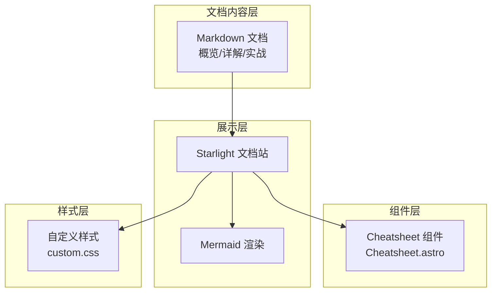
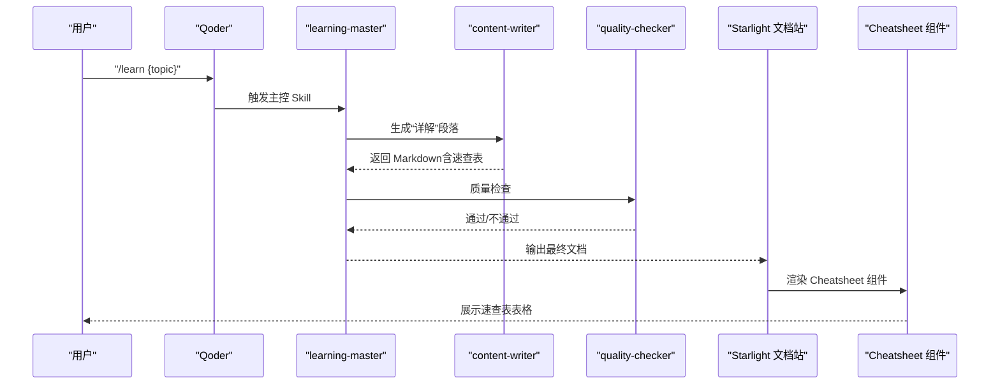
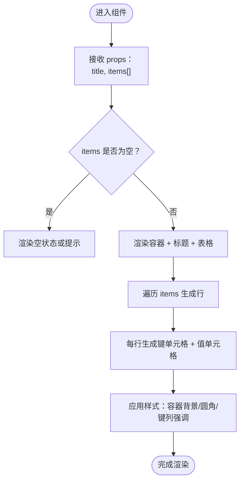
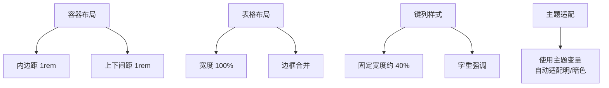
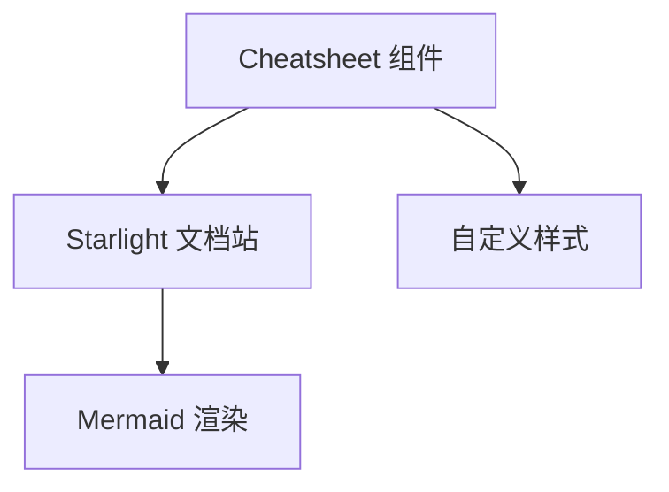

# 速查表组件

<cite>
**本文引用的文件**
- [03-架构设计.md](file://docs/03-ARCHITECTURE.md)
- [04-AI技能规格.md](file://docs/04-AI-SKILL-SPEC.md)
- [index.mdx](file://src/content/docs/index.mdx)
- [custom.css](file://src/styles/custom.css)
</cite>

## 目录
1. [简介](#简介)
2. [项目结构](#项目结构)
3. [核心组件](#核心组件)
4. [架构总览](#架构总览)
5. [组件详细分析](#组件详细分析)
6. [依赖关系分析](#依赖关系分析)
7. [性能考量](#性能考量)
8. [故障排除指南](#故障排除指南)
9. [结论](#结论)
10. [附录](#附录)

## 简介
本文件面向 StudyBuddy 项目中的“速查表组件”，系统化说明其设计理念、实现方式、数据格式、展示逻辑与交互行为，并提供布局设计、响应式适配、样式定制与最佳实践建议。该组件用于在文档中呈现“快速查阅”的表格内容，帮助读者在“分章节详解”阶段快速定位常用操作、参数与要点。

## 项目结构
速查表组件位于自定义组件目录中，配合 Starlight 文档站与 Mermaid 图表渲染共同工作。下图展示了与速查表组件相关的项目结构与职责边界：

**图表来源**
- [03-架构设计.md](file://docs/03-ARCHITECTURE.md#L169-L221)
- [03-架构设计.md](file://docs/03-ARCHITECTURE.md#L242-L264)
- [custom.css](file://src/styles/custom.css#L1-L63)

**章节来源**
- [03-架构设计.md](file://docs/03-ARCHITECTURE.md#L169-L221)
- [03-架构设计.md](file://docs/03-ARCHITECTURE.md#L242-L264)
- [custom.css](file://src/styles/custom.css#L1-L63)

## 核心组件
- 组件名称：Cheatsheet
- 组件文件：Cheatsheet.astro
- 组件职责：接收标题与键值条目数组，渲染为带样式的表格，突出“键”字段的权重与可读性
- 数据格式：标题（字符串）与条目数组（每项包含 key/value 字符串）

组件接口与渲染逻辑如下：
- 接口定义：包含 title 与 items 两个属性
- 渲染结构：外层容器 + 标题 + 表格 + 表体；每行包含“键”和“值”两列
- 样式要点：容器背景、圆角、内边距、外边距；表格宽度 100%、边框合并；键列宽度与字重强调

**章节来源**
- [03-架构设计.md](file://docs/03-ARCHITECTURE.md#L276-L319)

## 架构总览
速查表组件在文档生成与渲染流程中的位置如下：

**图表来源**
- [04-AI技能规格.md](file://docs/04-AI-SKILL-SPEC.md#L15-L73)
- [04-AI技能规格.md](file://docs/04-AI-SKILL-SPEC.md#L445-L493)
- [03-架构设计.md](file://docs/03-ARCHITECTURE.md#L242-L264)

## 组件详细分析

### 设计理念
- 管理者视角：强调“何时用”和“快速检索”，而非深入实现细节
- 三阶段框架支撑：概览→详解→实战，速查表主要出现在“详解”阶段，帮助读者快速定位高频操作
- 可复用性：统一的表格结构与样式，便于在不同主题文档中保持一致体验

### 数据格式与展示逻辑
- 输入数据：标题 + 条目数组（每项包含 key/value 字符串）
- 展示逻辑：遍历条目数组生成表格行，键列加粗并使用代码样式，值列用于说明与示例
- 样式策略：容器圆角与背景，表格占满容器宽度，键列固定宽度并强调字重，提升可读性

**图表来源**
- [03-架构设计.md](file://docs/03-ARCHITECTURE.md#L280-L319)

**章节来源**
- [03-架构设计.md](file://docs/03-ARCHITECTURE.md#L276-L319)

### 布局设计与响应式适配
- 容器布局：使用 1rem 内边距与上下间距，保证在不同段落中的视觉平衡
- 表格布局：100% 宽度 + 边框合并，确保在窄屏设备上仍能完整显示
- 键列适配：固定宽度与强调字重，使“键”在移动设备上也能清晰识别
- 主题适配：使用 Starlight 主题变量，暗色模式下自动适配

**图表来源**
- [03-架构设计.md](file://docs/03-ARCHITECTURE.md#L303-L318)
- [custom.css](file://src/styles/custom.css#L1-L63)

**章节来源**
- [03-架构设计.md](file://docs/03-ARCHITECTURE.md#L303-L318)
- [custom.css](file://src/styles/custom.css#L1-L63)

### 交互行为
- 交互点：表格本身为只读展示，无点击/展开等交互
- 可访问性：使用语义化表格结构，键列采用代码样式，提升可读性
- 无障碍：表格具备基本可读性，建议在长表格场景下配合滚动容器使用

**章节来源**
- [03-架构设计.md](file://docs/03-ARCHITECTURE.md#L288-L301)

### 创建与定制速查表内容
- 内容来源：由 AI 内容生成流程在“详解”段落中产出，要求每概念包含“是什么/为什么/怎么用”，并在“怎么用”中提供速查表
- 表格结构：建议 3-5 行，覆盖高频操作、参数与常见陷阱
- 样式规则：键列强调、值列简洁；避免过宽列与过多空格
- 视觉效果：与文档整体风格一致，使用主题变量保证一致性

**章节来源**
- [04-AI技能规格.md](file://docs/04-AI-SKILL-SPEC.md#L445-L493)

### 使用示例与最佳实践
- 示例路径：在“详解”段落中，为每个核心概念提供一个速查表，作为“怎么用”的一部分
- 内容组织原则：
  - 键：常用操作、命令、参数名、配置项
  - 值：简短说明、默认值、注意事项、常见错误提示
- 用户体验优化建议：
  - 控制速查表长度（3-5 行），避免信息过载
  - 使用一致的术语与格式，便于检索
  - 在长文档中，将速查表置于“怎么用”小节开头，便于快速定位

**章节来源**
- [04-AI技能规格.md](file://docs/04-AI-SKILL-SPEC.md#L445-L493)

## 依赖关系分析
- 组件依赖：Cheatsheet 组件依赖 Starlight 文档站的渲染能力与主题变量
- 样式依赖：组件样式通过自定义 CSS 注入，使用主题变量实现明/暗色切换
- 渲染依赖：与 Mermaid 图表渲染共存，均在 Starlight 文档站中统一渲染

**图表来源**
- [03-架构设计.md](file://docs/03-ARCHITECTURE.md#L242-L264)
- [custom.css](file://src/styles/custom.css#L1-L63)

**章节来源**
- [03-架构设计.md](file://docs/03-ARCHITECTURE.md#L242-L264)
- [custom.css](file://src/styles/custom.css#L1-L63)

## 性能考量
- 渲染性能：表格为轻量级静态内容，渲染开销极低
- 样式性能：使用主题变量与基础 CSS，避免复杂动画与重排
- 构建性能：组件为纯静态结构，不影响 Astro 构建时间

[本节为通用指导，无需特定文件引用]

## 故障排除指南
- 速查表未显示：
  - 检查文档中是否正确插入速查表组件调用
  - 确认 items 数组非空且包含合法键值对
- 样式异常：
  - 检查自定义样式是否正确注入
  - 确认主题变量可用，暗色模式下样式正常
- 响应式问题：
  - 确保容器宽度设置为 100%，表格在窄屏下可横向滚动

**章节来源**
- [03-架构设计.md](file://docs/03-ARCHITECTURE.md#L303-L318)
- [custom.css](file://src/styles/custom.css#L1-L63)

## 结论
速查表组件以简洁、一致的表格形式承载“快速查阅”信息，契合 StudyBuddy 的管理者视角与三阶段学习框架。通过统一的数据格式、主题化样式与响应式布局，组件在不同文档主题中保持高可用性与可维护性。建议在“详解”段落中为每个核心概念配套速查表，并遵循内容组织与用户体验优化建议，以最大化速查表的价值。

[本节为总结性内容，无需特定文件引用]

## 附录
- 相关文档与规范：
  - AI 技能规格：速查表生成要求与最佳实践
  - 架构设计：组件位置与渲染流程
  - 主题样式：自定义 CSS 与主题变量使用

**章节来源**
- [04-AI技能规格.md](file://docs/04-AI-SKILL-SPEC.md#L445-L493)
- [03-架构设计.md](file://docs/03-ARCHITECTURE.md#L276-L319)
- [custom.css](file://src/styles/custom.css#L1-L63)