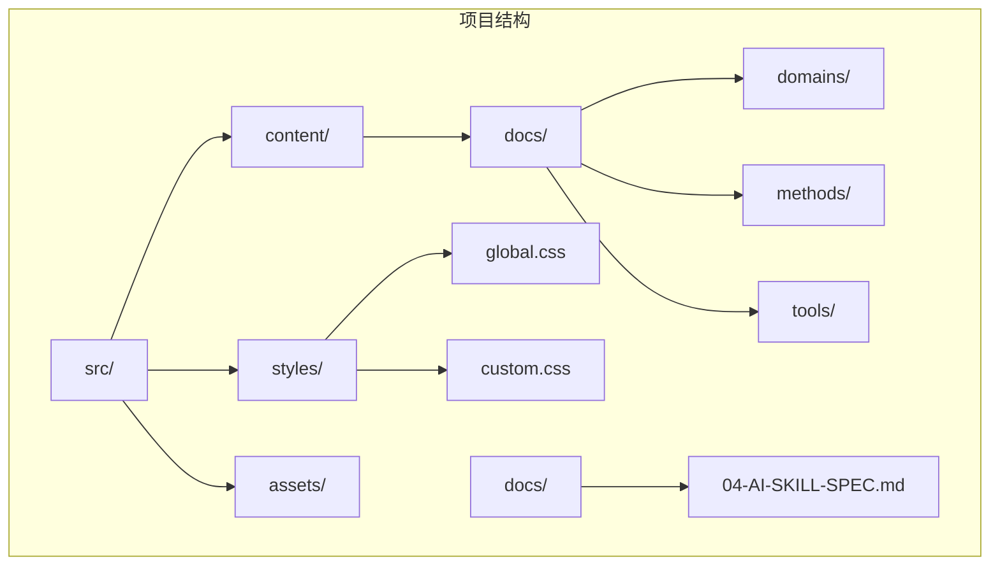
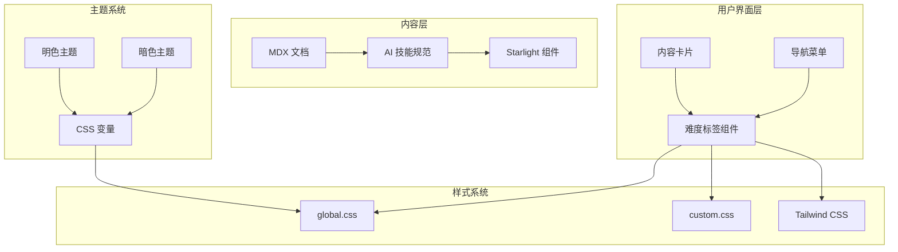
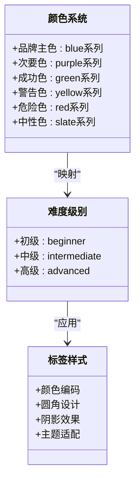
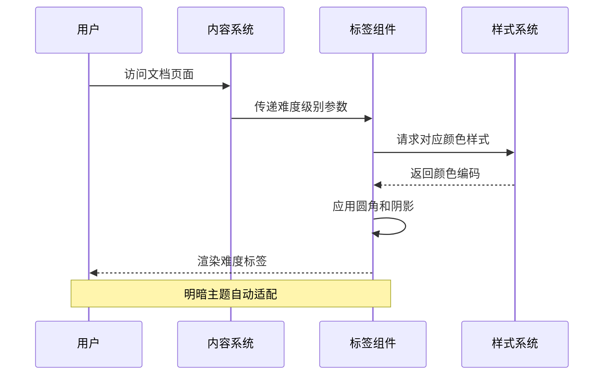
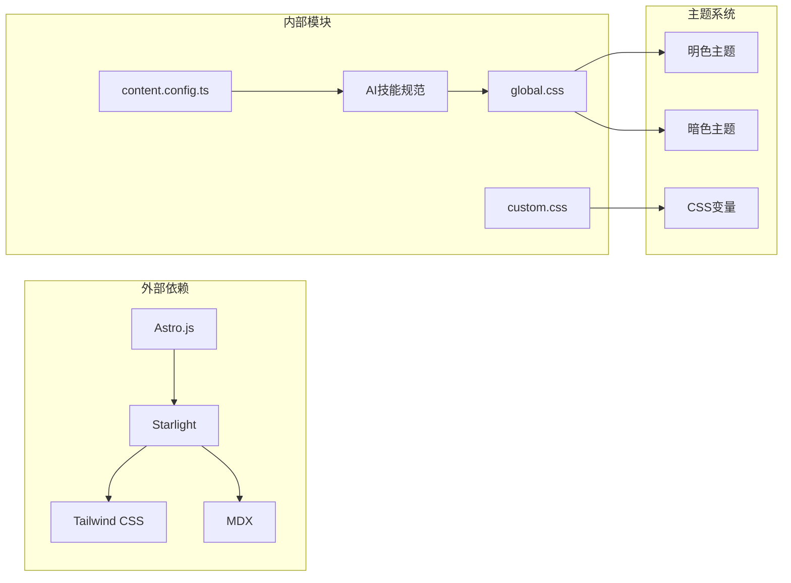

# 难度等级标签组件

<cite>
**本文档引用的文件**
- [src/styles/global.css](file://src/styles/global.css)
- [src/styles/custom.css](file://src/styles/custom.css)
- [src/content.config.ts](file://src/content.config.ts)
- [docs/04-AI-SKILL-SPEC.md](file://docs/04-AI-SKILL-SPEC.md)
- [src/content/docs/index.mdx](file://src/content/docs/index.mdx)
- [src/content/docs/domains/backend/index.md](file://src/content/docs/domains/backend/index.md)
- [src/content/docs/methods/learning/index.md](file://src/content/docs/methods/learning/index.md)
- [src/content/docs/tools/ai-coding/index.md](file://src/content/docs/tools/ai-coding/index.md)
</cite>

## 目录
1. [简介](#简介)
2. [项目结构](#项目结构)
3. [核心组件](#核心组件)
4. [架构概览](#架构概览)
5. [详细组件分析](#详细组件分析)
6. [依赖关系分析](#依赖关系分析)
7. [性能考虑](#性能考虑)
8. [故障排除指南](#故障排除指南)
9. [结论](#结论)

## 简介

StudyBuddy 项目中的难度等级标签组件是一个用于标识内容复杂度和学习难度的重要UI元素。该组件通过颜色编码和层级定义来帮助用户快速识别内容的难易程度，从而做出合适的学习选择。

根据项目文档分析，难度等级标签系统支持三个主要级别：beginner（初级）、intermediate（中级）和advanced（高级）。这个标签系统不仅用于文档内容的组织，还与AI技能规范中的学习命令参数紧密集成。

## 项目结构

StudyBuddy 项目采用基于 Astro 和 Starlight 的文档站点架构，难度标签组件作为UI组件嵌入在文档内容中。



**图表来源**
- [src/content.config.ts](file://src/content.config.ts#L1-L8)
- [src/styles/global.css](file://src/styles/global.css#L1-L92)

**章节来源**
- [src/content.config.ts](file://src/content.config.ts#L1-L8)
- [src/styles/global.css](file://src/styles/global.css#L1-L92)

## 核心组件

难度等级标签组件的核心功能包括：

### 颜色编码系统
- **初级 (beginner)**: 使用蓝色系渐变，代表入门级内容
- **中级 (intermediate)**: 使用紫色系渐变，代表进阶内容  
- **高级 (advanced)**: 使用红色系渐变，代表专家级内容

### 层级定义
标签系统基于内容复杂度进行分级：
- **初级**: 基础概念介绍，适合初学者
- **中级**: 核心概念深入，需要一定基础
- **高级**: 专业技能应用，需要丰富经验

### 样式特性
- 支持明暗主题切换
- 使用CSS变量实现主题一致性
- 响应式设计适配不同设备

**章节来源**
- [src/styles/global.css](file://src/styles/global.css#L4-L78)
- [docs/04-AI-SKILL-SPEC.md](file://docs/04-AI-SKILL-SPEC.md#L192-L192)

## 架构概览

难度标签组件在整个系统中的位置和交互关系如下：



**图表来源**
- [src/styles/global.css](file://src/styles/global.css#L1-L92)
- [src/styles/custom.css](file://src/styles/custom.css#L1-L92)
- [docs/04-AI-SKILL-SPEC.md](file://docs/04-AI-SKILL-SPEC.md#L155-L192)

## 详细组件分析

### 颜色系统设计

难度标签的颜色系统基于StudyBuddy的品牌色彩设计：



**图表来源**
- [src/styles/global.css](file://src/styles/global.css#L4-L60)

### 标签渲染流程



**图表来源**
- [docs/04-AI-SKILL-SPEC.md](file://docs/04-AI-SKILL-SPEC.md#L155-L192)
- [src/styles/custom.css](file://src/styles/custom.css#L59-L70)

### 使用示例

#### 基础使用
在MDX文档中添加难度标签的基本语法：

```markdown
---
title: 示例文档
difficulty: intermediate
---

文档内容...
```

#### 高级配置
支持多种难度级别的组合和自定义：

```markdown
---
title: 复杂文档
difficulty: [advanced, expert]
tags: [技术, 教程]
---

文档内容...
```

**章节来源**
- [docs/04-AI-SKILL-SPEC.md](file://docs/04-AI-SKILL-SPEC.md#L155-L192)
- [src/content/docs/index.mdx](file://src/content/docs/index.mdx#L1-L73)

## 依赖关系分析

难度标签组件与其他系统的关键依赖关系：



**图表来源**
- [src/content.config.ts](file://src/content.config.ts#L1-L8)
- [src/styles/global.css](file://src/styles/global.css#L1-L92)

**章节来源**
- [src/content.config.ts](file://src/content.config.ts#L1-L8)
- [src/styles/global.css](file://src/styles/global.css#L1-L92)

## 性能考虑

### 样式优化
- 使用CSS变量减少重复定义
- 支持主题切换的高效渲染
- 响应式设计避免不必要的重绘

### 内容加载
- 标签组件轻量级设计
- 与Starlight组件系统无缝集成
- 支持静态生成优化

## 故障排除指南

### 常见问题

**问题1: 标签颜色显示异常**
- 检查主题设置是否正确
- 验证CSS变量定义
- 确认浏览器兼容性

**问题2: 难度级别不匹配**
- 检查内容frontmatter配置
- 验证AI技能规范参数
- 确认标签渲染逻辑

**问题3: 移动端显示问题**
- 检查响应式断点设置
- 验证触摸交互设计
- 测试不同屏幕尺寸

## 结论

StudyBuddy项目的难度等级标签组件通过精心设计的颜色编码系统和层级定义，为用户提供了直观的内容难度识别机制。该组件不仅在视觉上保持了品牌一致性，还通过CSS变量系统实现了良好的可定制性和扩展性。

组件的核心优势包括：
- 清晰的视觉层次和颜色编码
- 支持多主题的自适应设计  
- 与内容管理系统深度集成
- 良好的性能表现和用户体验

未来可以考虑的功能扩展包括：动态难度计算、用户反馈机制、以及更精细的难度细分等。