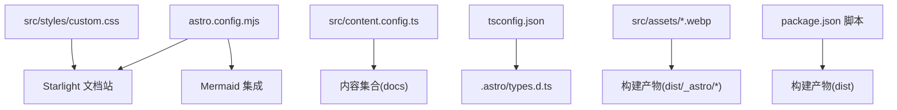
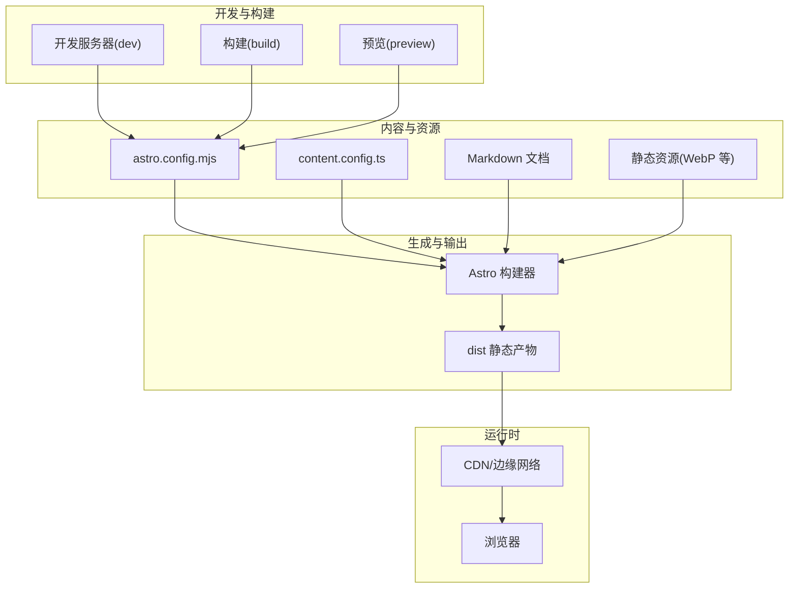
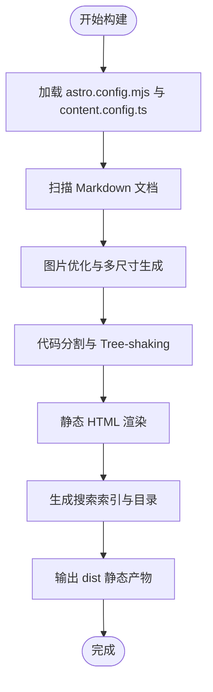
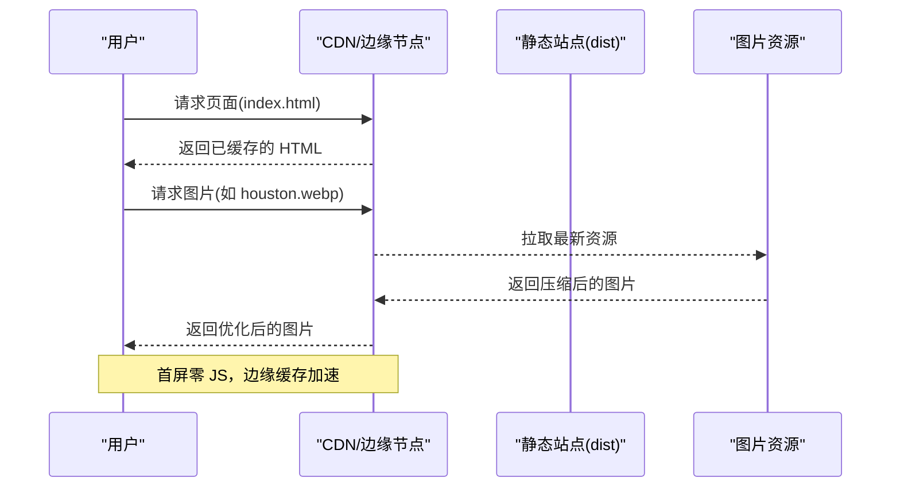
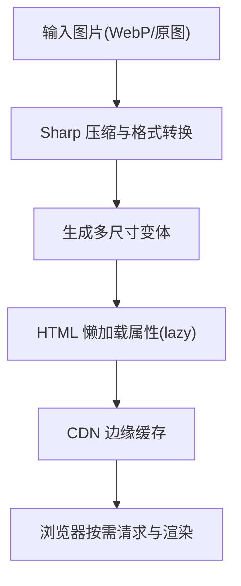
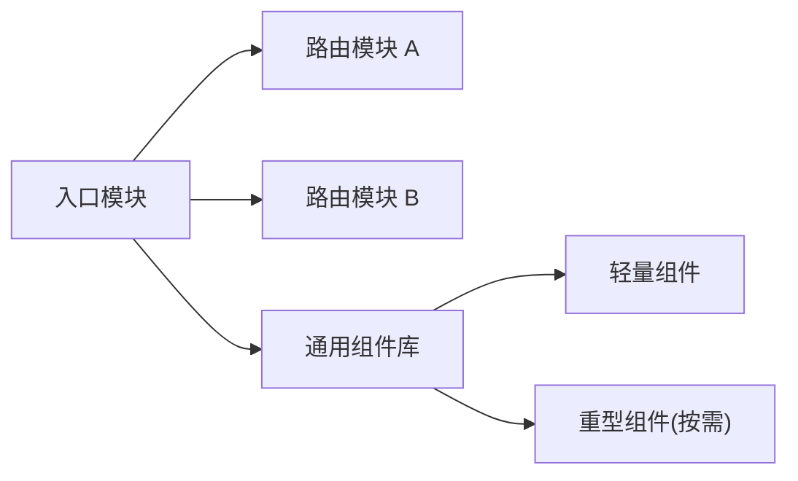
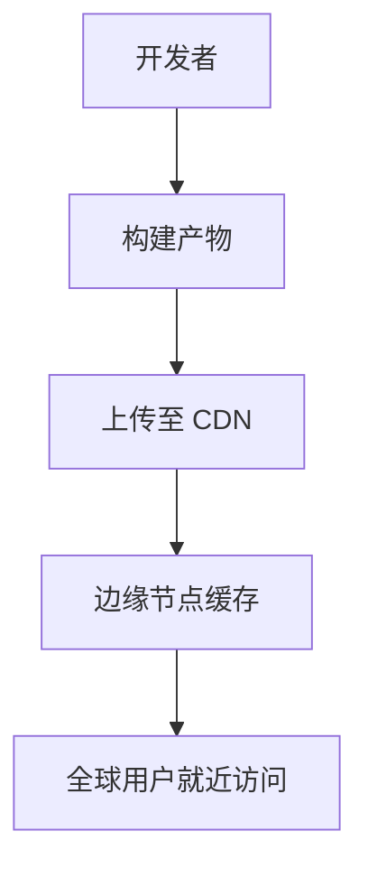
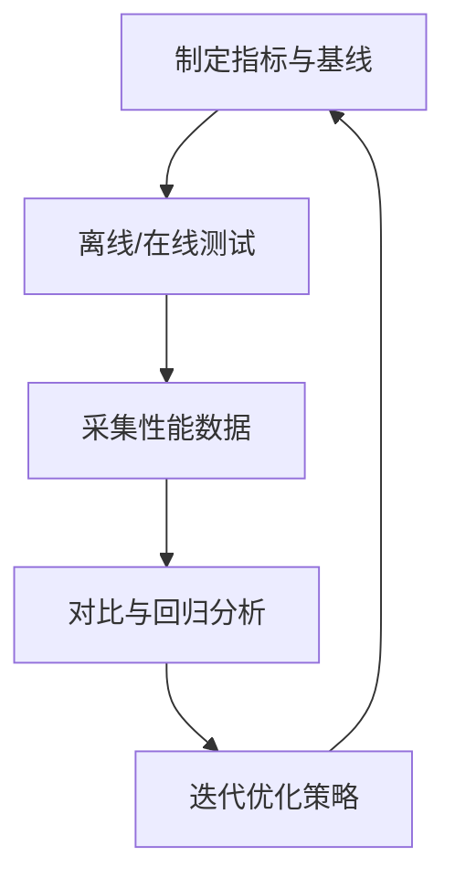
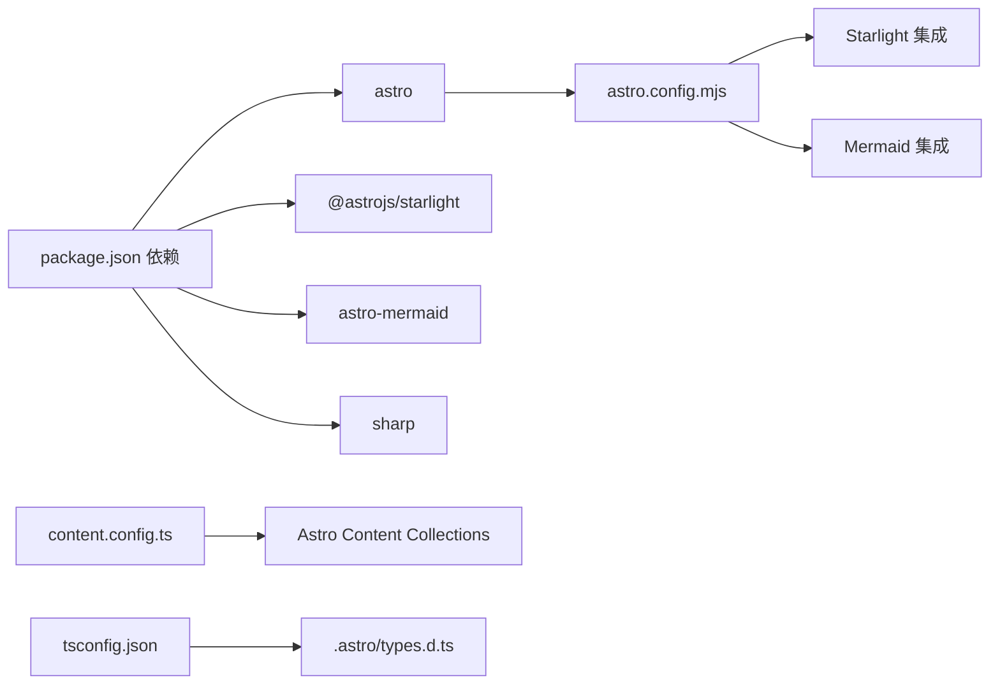

# 性能优化策略

<cite>
**本文引用的文件**
- [package.json](file://package.json)
- [astro.config.mjs](file://astro.config.mjs)
- [src/content.config.ts](file://src/content.config.ts)
- [src/styles/custom.css](file://src/styles/custom.css)
- [docs/01-PROJECT-BRIEF.md](file://docs/01-PROJECT-BRIEF.md)
- [docs/03-ARCHITECTURE.md](file://docs/03-ARCHITECTURE.md)
- [.astro/content.d.ts](file://.astro/content.d.ts)
- [tsconfig.json](file://tsconfig.json)
- [src/assets/houston.webp](file://src/assets/houston.webp)
</cite>

## 目录
1. [引言](#引言)
2. [项目结构](#项目结构)
3. [核心组件](#核心组件)
4. [架构总览](#架构总览)
5. [详细组件分析](#详细组件分析)
6. [依赖关系分析](#依赖关系分析)
7. [性能考量](#性能考量)
8. [故障排查指南](#故障排查指南)
9. [结论](#结论)
10. [附录](#附录)

## 引言
本文件面向 StudyBuddy 项目，系统化梳理构建时与运行时的性能优化策略，并结合项目采用的 Astro 静态生成技术，给出可落地的实施建议。内容覆盖图片优化、代码分割、懒加载、CDN 缓存与边缘计算、性能指标监控与基准测试方法，以及不同环境下的优化重点与差异。

## 项目结构
StudyBuddy 采用 Astro + Starlight 的静态文档站点架构，内容由 Markdown 驱动，通过 Astro 构建生成纯静态产物，部署在任意静态托管平台或边缘网络上。项目的关键结构与职责如下：
- 构建与集成：Astro 配置与 Starlight、Mermaid 集成
- 内容模型：基于 Astro Content Collections 的文档集合
- 样式与主题：Starlight 主题与自定义 CSS
- 类型安全：.astro/types.d.ts 与 tsconfig 配置
- 资源与资产：图片等静态资源位于 src/assets

**图表来源**
- [astro.config.mjs](file://astro.config.mjs#L7-L33)
- [src/content.config.ts](file://src/content.config.ts#L5-L7)
- [src/styles/custom.css](file://src/styles/custom.css#L1-L402)
- [tsconfig.json](file://tsconfig.json#L1-L6)
- [.astro/content.d.ts](file://.astro/content.d.ts#L98-L137)
- [package.json](file://package.json#L5-L11)

**章节来源**
- [astro.config.mjs](file://astro.config.mjs#L7-L33)
- [src/content.config.ts](file://src/content.config.ts#L5-L7)
- [src/styles/custom.css](file://src/styles/custom.css#L1-L402)
- [tsconfig.json](file://tsconfig.json#L1-L6)
- [.astro/content.d.ts](file://.astro/content.d.ts#L98-L137)
- [package.json](file://package.json#L5-L11)

## 核心组件
- 构建与集成
  - Astro 配置启用 Starlight 与 Mermaid，提供开箱即用的文档站能力与图表渲染。
  - 通过脚本命令完成开发、构建与预览。
- 内容模型
  - 使用 Astro Content Collections 将 Markdown 文档组织为可查询的集合，配合类型声明提升开发体验。
- 样式与主题
  - 基于 Starlight 主题，辅以自定义 CSS 实现现代化视觉与交互，兼顾暗色模式与响应式优化。
- 类型与安全
  - tsconfig 与 .astro/types.d.ts 确保内容访问 API 的类型安全与自动补全。
- 资产与图片
  - 使用现代图片格式（如 WebP）与 Sharp 优化管线，结合 Astro 的图片处理能力进一步压缩体积与生成多种尺寸。

**章节来源**
- [astro.config.mjs](file://astro.config.mjs#L7-L33)
- [src/content.config.ts](file://src/content.config.ts#L5-L7)
- [src/styles/custom.css](file://src/styles/custom.css#L1-L402)
- [.astro/content.d.ts](file://.astro/content.d.ts#L98-L137)
- [tsconfig.json](file://tsconfig.json#L1-L6)
- [package.json](file://package.json#L5-L11)

## 架构总览
下图展示了 StudyBuddy 的静态生成与运行时访问路径，强调 Astro 在构建期完成内容渲染与资源优化，运行期仅传输静态资源，从而实现极低延迟与高并发承载。

**图表来源**
- [astro.config.mjs](file://astro.config.mjs#L7-L33)
- [src/content.config.ts](file://src/content.config.ts#L5-L7)
- [package.json](file://package.json#L5-L11)

## 详细组件分析

### 构建时优化策略
- 增量构建与并行编译
  - 利用 Astro 的增量构建能力，减少重复编译；在 package.json 中通过脚本统一入口，便于 CI 并行执行。
- 图片优化与多尺寸生成
  - 使用 WebP 等现代格式；结合 Sharp 与 Astro 图片处理能力，按需生成多尺寸与不同质量档位，降低带宽与首屏渲染压力。
- 代码分割与最小化
  - Astro 默认进行模块拆分与 Tree-shaking；确保只打包实际使用的组件与样式，避免冗余。
- 内容索引与搜索
  - Starlight 内置搜索与目录生成，构建期生成索引，运行期零 JS 依赖，显著缩短首屏时间。
- 类型安全与校验
  - tsconfig 与 .astro/types.d.ts 提前发现类型错误，减少构建失败与回滚成本。

**图表来源**
- [astro.config.mjs](file://astro.config.mjs#L7-L33)
- [src/content.config.ts](file://src/content.config.ts#L5-L7)
- [src/assets/houston.webp](file://src/assets/houston.webp)

**章节来源**
- [astro.config.mjs](file://astro.config.mjs#L7-L33)
- [src/content.config.ts](file://src/content.config.ts#L5-L7)
- [src/assets/houston.webp](file://src/assets/houston.webp)
- [package.json](file://package.json#L5-L11)

### 运行时优化策略
- 零运行时 JS 的静态站点
  - Astro 静态生成使页面在浏览器中几乎无 JS 执行，极大降低 CPU 占用与首屏阻塞。
- CDN 缓存与边缘计算
  - 将 dist 部署至具备边缘节点的 CDN，利用就近缓存与压缩传输，缩短 TTFB 与 TTIB。
- 懒加载与交互优化
  - 对 Mermaid 图表等重型组件采用懒加载（如 IntersectionObserver），仅在进入视口时渲染，减少首屏负担。
- 响应式与视觉优化
  - 自定义 CSS 提供玻璃拟态与暗色模式，配合媒体查询在小屏设备上优化布局与可读性。

**图表来源**
- [src/assets/houston.webp](file://src/assets/houston.webp)
- [docs/03-ARCHITECTURE.md](file://docs/03-ARCHITECTURE.md#L366-L383)

**章节来源**
- [docs/03-ARCHITECTURE.md](file://docs/03-ARCHITECTURE.md#L366-L383)
- [src/styles/custom.css](file://src/styles/custom.css#L1-L402)

### 图片优化与懒加载
- 图片格式与尺寸
  - 使用 WebP 等现代格式；在构建阶段按需生成多尺寸与质量档位，结合 lazy loading 属性减少首屏资源占用。
- 渲染与压缩
  - 结合 Sharp 与 Astro 图片处理插件，自动进行压缩与格式转换，降低体积与加载时间。
- 懒加载策略
  - 对非首屏图片与图表组件采用懒加载，避免不必要的网络与渲染开销。

**图表来源**
- [src/assets/houston.webp](file://src/assets/houston.webp)
- [astro.config.mjs](file://astro.config.mjs#L7-L33)

**章节来源**
- [src/assets/houston.webp](file://src/assets/houston.webp)
- [astro.config.mjs](file://astro.config.mjs#L7-L33)

### 代码分割与模块化
- 自动代码分割
  - Astro 在构建期自动进行模块拆分，按路由与组件边界切分包体，减少首屏 JS 体积。
- Tree-shaking 与按需引入
  - 仅打包被实际使用的模块，避免引入未使用依赖导致的体积膨胀。
- 组件级优化
  - 将重型组件（如 Mermaid）拆分为独立模块，按需加载，降低初始包体。

**图表来源**
- [astro.config.mjs](file://astro.config.mjs#L7-L33)
- [src/styles/custom.css](file://src/styles/custom.css#L1-L402)

**章节来源**
- [astro.config.mjs](file://astro.config.mjs#L7-L33)

### CDN 缓存策略与边缘计算
- 缓存层级
  - 静态资源设置长缓存，HTML 设置短缓存或协商缓存；版本化资源名与 ETag 支持增量更新。
- 边缘节点
  - 将构建产物部署至边缘网络，就近分发，降低跨域与跨洋传输带来的延迟。
- 压缩与传输
  - 启用 Gzip/Brotli 压缩与 HTTP/2 或 HTTP/3，提升传输效率。

**图表来源**
- [docs/03-ARCHITECTURE.md](file://docs/03-ARCHITECTURE.md#L366-L383)

**章节来源**
- [docs/03-ARCHITECTURE.md](file://docs/03-ARCHITECTURE.md#L366-L383)

### 性能指标监控与基准测试
- 指标定义
  - 关键指标包括：首屏渲染时间(FP/FCP/LCP)、交互就绪时间(INP/TI)、内容加载时间(TTFB)、带宽与资源体积。
- 监控手段
  - 使用浏览器开发者工具、Lighthouse、WebPageTest 等工具进行离线与在线测试。
  - 在生产环境集成性能监控 SDK，持续采集真实用户性能数据。
- 基准测试
  - 固定硬件与网络条件下的回归测试，对比不同优化策略的效果，形成基线数据。

**章节来源**
- [docs/01-PROJECT-BRIEF.md](file://docs/01-PROJECT-BRIEF.md#L112-L120)

### 不同环境下的优化重点
- 开发环境
  - 注重构建速度与热更新体验，开启增量构建与最小化日志输出。
- 预发布/测试环境
  - 接近生产的资源压缩与缓存策略，验证性能指标与兼容性。
- 生产环境
  - 最大化缓存命中率与边缘分发，启用压缩与安全头，持续监控真实用户性能。

**章节来源**
- [docs/03-ARCHITECTURE.md](file://docs/03-ARCHITECTURE.md#L366-L383)

## 依赖关系分析
- 构建与运行时依赖
  - Astro 为核心构建引擎；Starlight 提供文档站能力；Mermaid 支持图表渲染；Sharp 用于图片处理。
- 类型与内容
  - tsconfig 与 .astro/types.d.ts 确保内容访问 API 的类型安全；content.config.ts 定义内容集合。

**图表来源**
- [package.json](file://package.json#L12-L18)
- [astro.config.mjs](file://astro.config.mjs#L7-L33)
- [src/content.config.ts](file://src/content.config.ts#L5-L7)
- [tsconfig.json](file://tsconfig.json#L1-L6)
- [.astro/content.d.ts](file://.astro/content.d.ts#L98-L137)

**章节来源**
- [package.json](file://package.json#L12-L18)
- [astro.config.mjs](file://astro.config.mjs#L7-L33)
- [src/content.config.ts](file://src/content.config.ts#L5-L7)
- [tsconfig.json](file://tsconfig.json#L1-L6)
- [.astro/content.d.ts](file://.astro/content.d.ts#L98-L137)

## 性能考量
- 静态生成优势
  - 页面无需运行时渲染，首屏时间短、CPU 占用低、并发承载能力强。
- 图片与资源
  - 使用现代格式与多尺寸变体，结合 CDN 边缘缓存，显著降低带宽与延迟。
- 代码与模块
  - 自动分割与 Tree-shaking 降低首屏 JS，提升解析与执行效率。
- 监控与回归
  - 建立指标基线与自动化测试，持续优化与防止退化。

[本节为总体指导，不直接分析具体文件]

## 故障排查指南
- 构建失败或资源缺失
  - 检查 astro.config.mjs 与 content.config.ts 的集成与集合配置是否正确；确认 Sharp 依赖安装与图片路径有效。
- 样式异常或主题错乱
  - 核对自定义 CSS 是否正确引入；检查暗色模式切换逻辑与媒体查询。
- 类型错误或 API 访问异常
  - 确认 tsconfig 与 .astro/types.d.ts 是否同步；使用 getEntry 等 API 时遵循类型约束。
- 性能不达标
  - 使用 Lighthouse 或 WebPageTest 进行端到端测试；检查 CDN 缓存策略与边缘节点分布。

**章节来源**
- [astro.config.mjs](file://astro.config.mjs#L7-L33)
- [src/content.config.ts](file://src/content.config.ts#L5-L7)
- [src/styles/custom.css](file://src/styles/custom.css#L1-L402)
- [.astro/content.d.ts](file://.astro/content.d.ts#L98-L137)
- [tsconfig.json](file://tsconfig.json#L1-L6)

## 结论
StudyBuddy 基于 Astro 的静态生成架构，具备优秀的性能基础。通过构建期的图片优化、代码分割与内容索引，以及运行期的 CDN 缓存与边缘计算，可实现极低的首屏时间与高并发承载。建议持续以指标驱动优化，结合自动化测试与真实用户监控，确保性能稳定与持续改进。

[本节为总结，不直接分析具体文件]

## 附录
- 快速检查清单
  - 构建：启用增量构建、图片多尺寸与压缩、代码分割
  - 运行：CDN 缓存与边缘分发、懒加载、压缩传输
  - 监控：建立指标基线、定期回归测试、真实用户监控

[本节为补充说明，不直接分析具体文件]