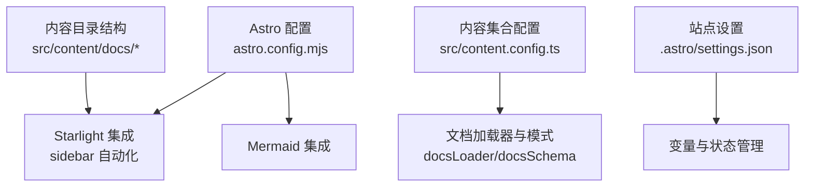
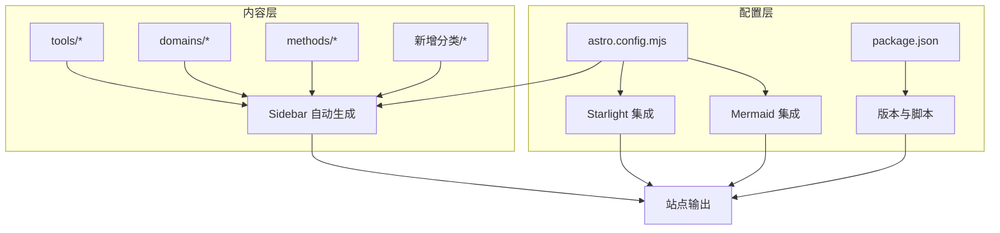
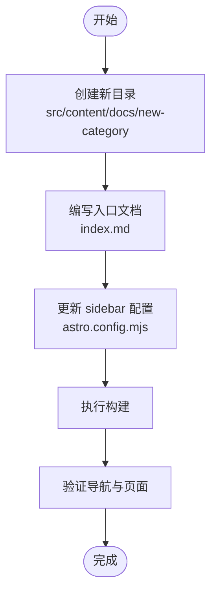
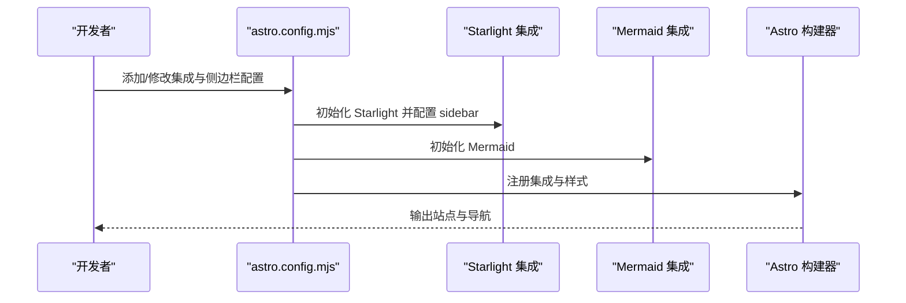
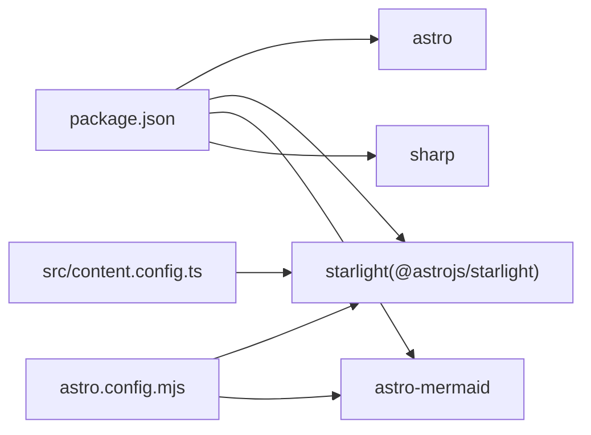

# 扩展性设计

<cite>
**本文引用的文件**
- [package.json](file://package.json)
- [astro.config.mjs](file://astro.config.mjs)
- [src/content.config.ts](file://src/content.config.ts)
- [src/content/docs/tools/index.md](file://src/content/docs/tools/index.md)
- [src/content/docs/domains/index.md](file://src/content/docs/domains/index.md)
- [src/content/docs/methods/index.md](file://src/content/docs/methods/index.md)
- [.astro/settings.json](file://.astro/settings.json)
</cite>

## 目录
1. [引言](#引言)
2. [项目结构](#项目结构)
3. [核心组件](#核心组件)
4. [架构总览](#架构总览)
5. [详细组件分析](#详细组件分析)
6. [依赖分析](#依赖分析)
7. [性能考虑](#性能考虑)
8. [故障排查指南](#故障排查指南)
9. [结论](#结论)
10. [附录](#附录)

## 引言
本设计文档面向 StudyBuddy 项目的扩展性与可维护性目标，聚焦于以下主题：
- 如何添加新的文档分类（如新增“领域”或“方法论”之外的新类别）
- 新增 AI Skill 的扩展机制与集成路径
- 自定义组件的接入方式与最佳实践
- 配置扩展点与插件机制
- 向后兼容性与版本管理策略
- 扩展开发最佳实践与迁移指南
- 扩展对系统性能与稳定性的影响评估方法

本项目基于 Astro 与 Starlight 构建静态知识库，采用内容驱动的文档组织方式，通过配置即可实现导航与侧边栏的自动生成功能。

## 项目结构
StudyBuddy 的扩展性主要体现在“内容即配置”的理念上：通过在指定目录下新增 Markdown 内容，即可自动纳入站点导航；通过修改配置文件，即可引入新的集成与样式资源。

图表来源
- [astro.config.mjs](file://astro.config.mjs#L7-L32)
- [src/content.config.ts](file://src/content.config.ts#L1-L8)
- [.astro/settings.json](file://.astro/settings.json#L1-L5)

章节来源
- [astro.config.mjs](file://astro.config.mjs#L1-L34)
- [src/content.config.ts](file://src/content.config.ts#L1-L8)
- [.astro/settings.json](file://.astro/settings.json#L1-L5)

## 核心组件
- 文档内容集合与加载器
  - 使用内容集合定义文档加载器与模式，确保文档结构一致、校验统一。
- 导航与侧边栏自动化
  - 通过 Starlight 的 sidebar autogenerate 功能，按目录结构自动生成导航项，降低手工维护成本。
- 集成扩展点
  - 通过 Astro 配置中的 integrations 字段引入新功能（如图表、Mermaid）。
- 版本与脚本管理
  - 通过 package.json 统一管理版本号与构建脚本，便于发布与升级。

章节来源
- [src/content.config.ts](file://src/content.config.ts#L1-L8)
- [astro.config.mjs](file://astro.config.mjs#L7-L32)
- [package.json](file://package.json#L1-L20)

## 架构总览
StudyBuddy 的扩展性架构围绕“内容驱动 + 配置扩展”的双轴展开：
- 内容轴：在 src/content/docs 下新增目录与 Markdown 文件，即可被自动收录到导航中。
- 配置轴：在 astro.config.mjs 中新增集成或调整侧边栏配置，即可扩展功能与外观。

图表来源
- [astro.config.mjs](file://astro.config.mjs#L8-L31)
- [src/content/docs/tools/index.md](file://src/content/docs/tools/index.md#L1-L13)
- [src/content/docs/domains/index.md](file://src/content/docs/domains/index.md#L1-L14)
- [src/content/docs/methods/index.md](file://src/content/docs/methods/index.md#L1-L12)

章节来源
- [astro.config.mjs](file://astro.config.mjs#L1-L34)
- [src/content/docs/tools/index.md](file://src/content/docs/tools/index.md#L1-L13)
- [src/content/docs/domains/index.md](file://src/content/docs/domains/index.md#L1-L14)
- [src/content/docs/methods/index.md](file://src/content/docs/methods/index.md#L1-L12)

## 详细组件分析

### 文档分类扩展机制
- 新增分类的步骤
  1) 在 src/content/docs 下创建新目录（例如新增“专题研究”），并在其中放置 index.md 作为分类入口。
  2) 在 astro.config.mjs 的 sidebar 配置中，为该目录添加 autogenerate 条目，使其出现在侧边栏导航中。
  3) 若需自定义样式或国际化标签，可在对应位置补充配置。
- 影响范围
  - 新增分类不会影响现有内容与配置，仅在构建时参与导航生成。
- 兼容性建议
  - 保持目录命名与链接规范一致，避免破坏相对路径与路由映射。

图表来源
- [astro.config.mjs](file://astro.config.mjs#L16-L29)
- [src/content/docs/tools/index.md](file://src/content/docs/tools/index.md#L1-L13)

章节来源
- [astro.config.mjs](file://astro.config.mjs#L16-L29)
- [src/content/docs/tools/index.md](file://src/content/docs/tools/index.md#L1-L13)

### AI Skill 扩展机制
- 当前现状
  - 仓库中存在 .qoder 目录，但未发现 agents 与 skills 的具体实现文件。因此无法直接给出 AI Skill 的集成细节。
- 可行的扩展路径
  - 若未来引入 AI Agent 或 Skill 模块，建议将其作为独立包或本地模块进行管理，并通过 Astro 的集成机制或构建脚本注入。
  - 对于运行时行为，建议通过环境变量与配置文件控制开关，避免影响默认构建流程。
- 最佳实践
  - 将 AI 相关逻辑封装为可插拔模块，提供统一接口与错误处理。
  - 为 AI 能力提供降级策略（如禁用或回退到本地能力）。

章节来源
- [.astro/settings.json](file://.astro/settings.json#L1-L5)

### 自定义组件接入
- 推荐方式
  - 将自定义组件以 Astro 组件形式组织，放置于 src/components 下，并在需要的页面或布局中按需导入。
  - 对于跨页面复用的组件，优先使用 Astro 的布局与组件组合能力，减少重复逻辑。
- 集成扩展点
  - 若需在构建阶段注入额外资源（如样式、脚本），可在 astro.config.mjs 的 integrations 或自定义构建钩子中实现。
- 注意事项
  - 组件应具备明确的输入输出与错误边界，避免在渲染过程中抛出未捕获异常。
  - 对于第三方组件，建议通过版本锁定与安全扫描保障稳定性。

章节来源
- [astro.config.mjs](file://astro.config.mjs#L1-L34)

### 配置扩展点与插件机制
- 星光（Starlight）集成
  - 通过 sidebar.autogenerate 实现目录级导航自动化，减少手工维护。
  - 支持自定义 CSS 与多语言配置，满足站点风格与本地化需求。
- Mermaid 集成
  - 通过 astro-mermaid 插件启用流程图、时序图等可视化能力，无需额外构建配置。
- 内容集合与加载器
  - 使用 docsLoader 与 docsSchema 统一文档加载与校验，确保内容质量与一致性。

图表来源
- [astro.config.mjs](file://astro.config.mjs#L7-L32)

章节来源
- [astro.config.mjs](file://astro.config.mjs#L1-L34)
- [src/content.config.ts](file://src/content.config.ts#L1-L8)

### 向后兼容性与版本管理策略
- 版本号管理
  - 使用 package.json 的 version 字段统一管理主版本号，遵循语义化版本控制（SemVer）。
- 构建与预览脚本
  - 通过 npm scripts 提供标准化的开发、构建与预览流程，降低升级带来的破坏性变更风险。
- 配置兼容性
  - 对于 Astro 与 Starlight 的升级，优先在本地验证 sidebar 与集成配置的兼容性，必要时保留旧配置的注释以便回滚。

章节来源
- [package.json](file://package.json#L1-L20)
- [astro.config.mjs](file://astro.config.mjs#L1-L34)

### 扩展开发最佳实践
- 内容扩展
  - 保持目录层级清晰，文档命名与链接规范统一，避免硬编码绝对路径。
- 配置扩展
  - 将可变参数集中管理（如语言、样式、导航），便于在不同环境间切换。
- 性能与稳定性
  - 控制一次性加载的组件数量，延迟加载非关键资源。
  - 为第三方集成提供超时与重试策略，避免阻塞构建或运行时渲染。
- 可观测性
  - 记录扩展点的启用状态与版本信息，便于问题排查与审计。

## 依赖分析
- 外部依赖
  - Astro：静态站点生成框架，提供内容加载与构建能力。
  - Starlight：文档主题与导航生成工具，支持 sidebar 自动化与多语言。
  - astro-mermaid：Mermaid 图表渲染插件。
  - sharp：图像处理库，用于优化站点图片资源。
- 内部依赖关系
  - astro.config.mjs 依赖 @astrojs/starlight 与 astro-mermaid。
  - src/content.config.ts 依赖 @astrojs/starlight 的 loader 与 schema。

图表来源
- [package.json](file://package.json#L12-L18)
- [astro.config.mjs](file://astro.config.mjs#L3-L4)
- [src/content.config.ts](file://src/content.config.ts#L2-L3)

章节来源
- [package.json](file://package.json#L1-L20)
- [astro.config.mjs](file://astro.config.mjs#L1-L34)
- [src/content.config.ts](file://src/content.config.ts#L1-L8)

## 性能考虑
- 构建性能
  - 减少不必要的集成与组件数量，避免在构建阶段产生大量计算开销。
  - 对图片资源使用合适的格式与尺寸，结合 sharp 进行压缩与转换。
- 运行时性能
  - 将非关键脚本延迟加载，减少首屏渲染时间。
  - 对图表与交互组件采用懒加载策略，仅在需要时初始化。
- 稳定性保障
  - 为第三方集成设置超时与降级策略，防止个别插件导致整体失败。
  - 定期审查依赖版本，及时修复已知的安全漏洞与性能问题。

## 故障排查指南
- 导航缺失或链接失效
  - 检查 astro.config.mjs 中 sidebar.autogenerate 是否正确指向新增目录。
  - 确认新增文档的 frontmatter 与路径无误。
- 构建失败
  - 检查依赖安装是否完整，确认 package.json 与 node_modules 一致。
  - 查看集成配置语法是否正确，尤其是星芒（Mermaid）与 Starlight 的选项。
- 内容加载异常
  - 确认 src/content.config.ts 的 loader 与 schema 配置未被意外修改。
  - 检查新增文档的格式与编码，避免特殊字符导致解析失败。

章节来源
- [astro.config.mjs](file://astro.config.mjs#L16-L29)
- [src/content.config.ts](file://src/content.config.ts#L1-L8)

## 结论
StudyBuddy 的扩展性设计以“内容即配置”为核心，通过 Astro 与 Starlight 的组合实现了低门槛的内容扩展与导航自动化。新增文档分类、引入新集成与自定义组件均能在不破坏现有结构的前提下完成。配合版本管理与配置扩展点，项目具备良好的演进空间与维护性。建议在后续迭代中逐步沉淀 AI Skill 的扩展规范与组件库，持续完善可观测性与稳定性保障。

## 附录
- 迁移指南（示例）
  - 从旧版目录迁移到新版 sidebar：备份原配置 → 在 astro.config.mjs 中新增 autogenerate → 渐进式替换链接 → 回归测试。
  - 升级 Starlight 或 Astro：锁定版本 → 本地验证 → 逐步替换配置项 → 发布灰度验证。
- 扩展示例（路径指引）
  - 新增分类入口文档：参考 tools/index.md 的 frontmatter 与目录结构。
  - 自定义样式：在 astro.config.mjs 中配置 customCss，并在 src/styles 中新增样式文件。
  - 引入 Mermaid 图表：在 astro.config.mjs 中启用 astro-mermaid 集成。

章节来源
- [src/content/docs/tools/index.md](file://src/content/docs/tools/index.md#L1-L13)
- [astro.config.mjs](file://astro.config.mjs#L15-L16)