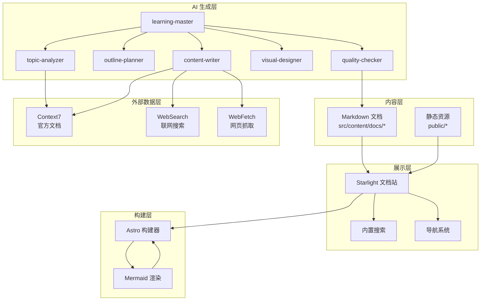
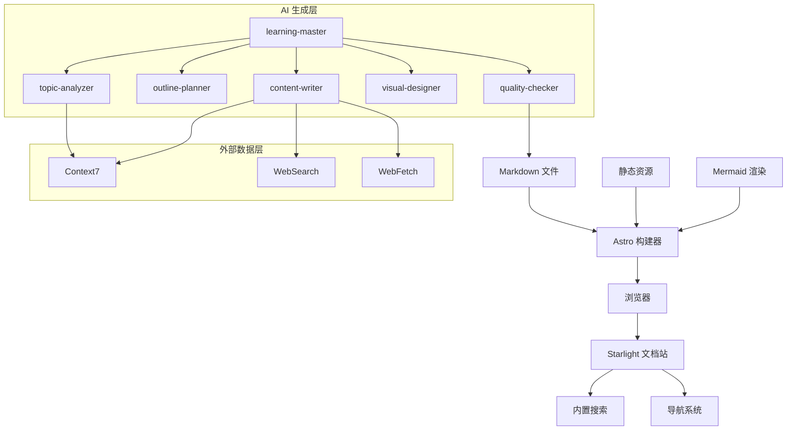
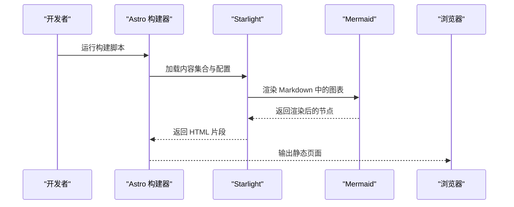
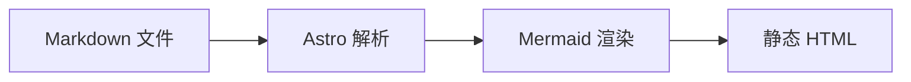
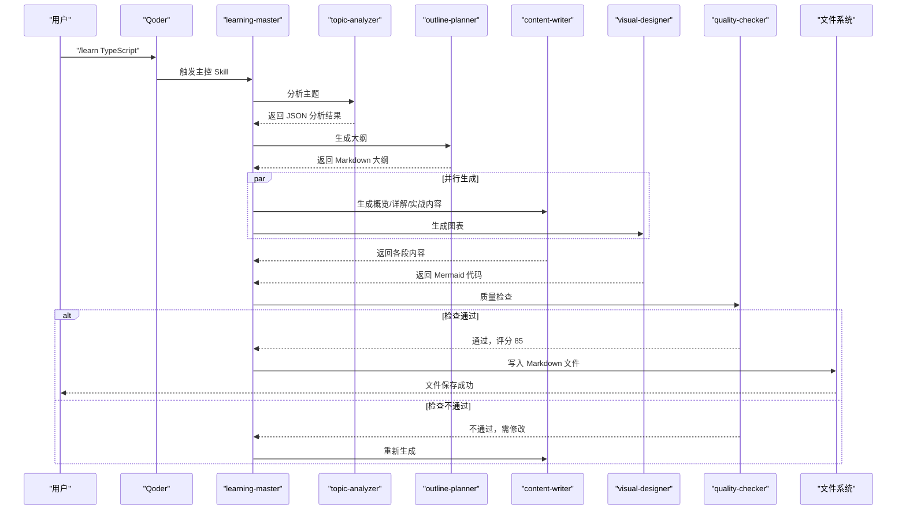
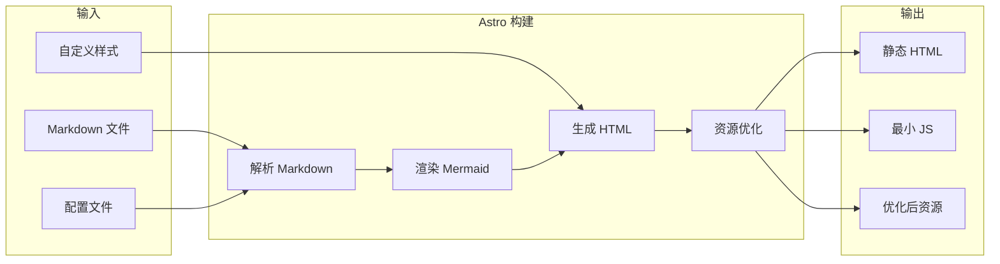
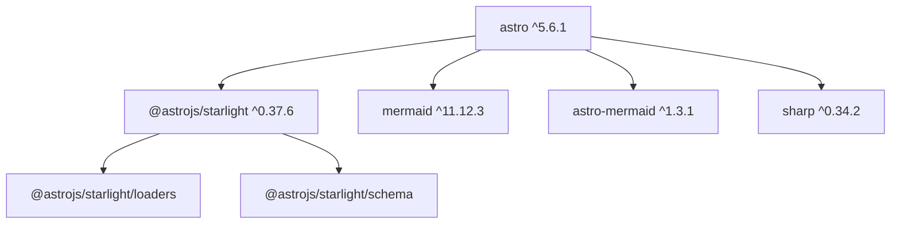

# 技术架构设计

<cite>
**本文档引用的文件**
- [package.json](file://package.json)
- [astro.config.mjs](file://astro.config.mjs)
- [src/content.config.ts](file://src/content.config.ts)
- [src/styles/custom.css](file://src/styles/custom.css)
- [tsconfig.json](file://tsconfig.json)
- [docs/03-ARCHITECTURE.md](file://docs/03-ARCHITECTURE.md)
- [docs/04-AI-SKILL-SPEC.md](file://docs/04-AI-SKILL-SPEC.md)
- [src/content/docs/tools/ai-coding/index.md](file://src/content/docs/tools/ai-coding/index.md)
- [src/content/docs/domains/frontend/index.md](file://src/content/docs/domains/frontend/index.md)
- [src/content/docs/methods/learning/index.md](file://src/content/docs/methods/learning/index.md)
</cite>

## 目录
1. [引言](#引言)
2. [项目结构](#项目结构)
3. [核心组件](#核心组件)
4. [架构总览](#架构总览)
5. [详细组件分析](#详细组件分析)
6. [依赖关系分析](#依赖关系分析)
7. [性能考量](#性能考量)
8. [故障排除指南](#故障排除指南)
9. [结论](#结论)
10. [附录](#附录)

## 引言
本文件为 StudyBuddy 项目的系统技术架构文档，聚焦于 Astro 静态站点生成器与 Qoder AI 工具链的集成方案。文档阐述高层设计、架构模式与组件边界，详细说明组件交互、数据流与集成模式，并给出技术决策、权衡与约束条件。同时涵盖基础设施要求、可扩展性考虑、部署拓扑以及横切关注点（安全性、监控、灾难恢复），并记录技术栈、第三方依赖与版本兼容性，解释 Starlight 文档框架的配置与定制选项。

## 项目结构
StudyBuddy 采用“内容驱动 + 静态生成”的文档站点架构，结合 Qoder AI 技术栈进行自动化内容生成与质量控制。项目主要分为以下层次：
- 内容层：Markdown 文档与静态资源，位于 src/content/docs 及 public 目录
- 展示层：基于 Astro 与 Starlight 的文档站点，提供导航、搜索与主题定制
- 构建层：Astro 构建器与 Mermaid 渲染，生成零 JS 的静态站点
- AI 生成层：Qoder 技能体系（learning-master、topic-analyzer、outline-planner、content-writer、visual-designer、quality-checker）
- 外部数据层：MCP 工具（Context7、WebSearch、WebFetch）

**图表来源**
- [astro.config.mjs](file://astro.config.mjs#L7-L33)
- [docs/03-ARCHITECTURE.md](file://docs/03-ARCHITECTURE.md#L12-L69)

**章节来源**
- [astro.config.mjs](file://astro.config.mjs#L1-L34)
- [src/content.config.ts](file://src/content.config.ts#L1-L8)
- [docs/03-ARCHITECTURE.md](file://docs/03-ARCHITECTURE.md#L164-L240)

## 核心组件
- Astro 与 Starlight：文档站点的骨架与主题系统，提供开箱即用的导航、搜索与国际化支持；通过集成 Mermaid 实现图表渲染。
- Mermaid 集成：通过 astro-mermaid 插件与 remark-mermaid 配置，使 Markdown 中的 Mermaid 代码块可被渲染。
- 内容加载器：使用 @astrojs/starlight/loaders 与 schema，统一管理文档集合与元数据。
- 自定义样式：通过 custom.css 覆盖 Accent 色彩与表格、徽章等组件样式，适配暗/亮主题。
- TS 类型：基于 astro/tsconfigs/strict，确保类型安全与开发体验。

**章节来源**
- [package.json](file://package.json#L12-L18)
- [astro.config.mjs](file://astro.config.mjs#L8-L32)
- [src/content.config.ts](file://src/content.config.ts#L1-L8)
- [src/styles/custom.css](file://src/styles/custom.css#L1-L78)
- [tsconfig.json](file://tsconfig.json#L1-L6)

## 架构总览
StudyBuddy 的整体架构围绕“内容即产品”的理念展开，采用分层与职责分离的设计：
- 用户层：通过浏览器访问文档站点
- 展示层：Starlight 提供导航、搜索与主题；Mermaid 支持图表渲染
- 内容生成层：Qoder 技能体系负责主题分析、大纲规划、内容撰写、图表生成与质量检查
- 外部数据层：Context7、WebSearch、WebFetch 提供权威与实时信息
- 数据层：Markdown 文件与静态资源
- 构建层：Astro 构建器与 Mermaid 渲染，输出零 JS 的静态页面

**图表来源**
- [docs/03-ARCHITECTURE.md](file://docs/03-ARCHITECTURE.md#L8-L69)

**章节来源**
- [docs/03-ARCHITECTURE.md](file://docs/03-ARCHITECTURE.md#L82-L161)

## 详细组件分析

### Astro 与 Starlight 集成
- 配置要点：设置标题、默认语言与本地化、自定义 CSS、侧边栏自动生成功能，分别指向 tools、domains、methods 三个文档分类。
- 内容加载：通过 docsLoader 与 docsSchema 统一加载 Markdown 文档集合。
- 主题与样式：通过 custom.css 覆盖 Accent 色彩与表格、徽章样式，适配暗/亮主题切换。

**图表来源**
- [astro.config.mjs](file://astro.config.mjs#L8-L32)
- [src/content.config.ts](file://src/content.config.ts#L5-L7)

**章节来源**
- [astro.config.mjs](file://astro.config.mjs#L8-L32)
- [src/content.config.ts](file://src/content.config.ts#L1-L8)
- [src/styles/custom.css](file://src/styles/custom.css#L1-L78)

### Mermaid 图表集成
- 集成方式：通过 astro-mermaid 插件与 remark-mermaid 配置，使 Markdown 中的 Mermaid 代码块可被渲染。
- 支持类型：mindmap、flowchart、sequenceDiagram、classDiagram、stateDiagram-v2 等。
- 渲染流程：Astro 构建时解析 Markdown，Mermaid 渲染图表，最终输出静态 HTML。

**图表来源**
- [docs/03-ARCHITECTURE.md](file://docs/03-ARCHITECTURE.md#L244-L275)

**章节来源**
- [docs/03-ARCHITECTURE.md](file://docs/03-ARCHITECTURE.md#L244-L275)

### Qoder AI 技能体系
- 架构模型：六个子技能协作，learning-master 作为主控编排者，协调 topic-analyzer、outline-planner、content-writer、visual-designer、quality-checker。
- 外部数据集成：Context7（官方文档）、WebSearch（联网搜索）、WebFetch（网页抓取）确保内容权威性与时效性。
- 数据流：用户输入 → 主控 → 分析 → 规划 → 并行生成 → 质量检查 → 输出 Markdown 文件。
- 质量控制：评分阈值与改进建议，支持最多两次重试。

**图表来源**
- [docs/04-AI-SKILL-SPEC.md](file://docs/04-AI-SKILL-SPEC.md#L86-L127)

**章节来源**
- [docs/04-AI-SKILL-SPEC.md](file://docs/04-AI-SKILL-SPEC.md#L19-L127)

### 内容生成流程（站点构建）
- 输入：Markdown 文件、配置文件、自定义样式
- 处理：解析 Markdown、渲染 Mermaid、生成 HTML、资源优化
- 输出：静态 HTML、最小化 JS、优化后资源

**图表来源**
- [docs/03-ARCHITECTURE.md](file://docs/03-ARCHITECTURE.md#L128-L160)

**章节来源**
- [docs/03-ARCHITECTURE.md](file://docs/03-ARCHITECTURE.md#L128-L160)

### 文档分类与命名规范
- 分类体系：工具（AI 编程、效率工具、知识管理）、领域（前端、后端、数据、管理）、方法论（学习方法、思维框架）
- 命名规范：kebab-case、主题明确、避免缩写、单次 1-3 个单词

**章节来源**
- [docs/03-ARCHITECTURE.md](file://docs/03-ARCHITECTURE.md#L164-L240)

## 依赖关系分析
- 技术栈与版本：
  - Astro：^5.6.1
  - Starlight：^0.37.6
  - Mermaid：^11.12.3
  - astro-mermaid：^1.3.1
  - sharp：^0.34.2
- 类型系统：基于 astro/tsconfigs/strict，确保类型安全
- 内容加载：docsLoader 与 docsSchema 统一加载 Markdown 文档集合

**图表来源**
- [package.json](file://package.json#L12-L18)
- [src/content.config.ts](file://src/content.config.ts#L2-L3)

**章节来源**
- [package.json](file://package.json#L12-L18)
- [tsconfig.json](file://tsconfig.json#L1-L6)
- [src/content.config.ts](file://src/content.config.ts#L1-L8)

## 性能考量
- 构建优化：Astro 默认支持增量构建、图片优化（@astrojs/image）、自动代码分割
- 运行时优化：零运行时 JS、CDN 缓存（Vercel Edge）、懒加载图表（Intersection Observer）
- Mermaid 渲染：在构建阶段完成，减少运行时开销

**章节来源**
- [docs/03-ARCHITECTURE.md](file://docs/03-ARCHITECTURE.md#L366-L383)

## 故障排除指南
- Mermaid 渲染失败：简化图表结构，确保语法正确
- 质量检查不通过：根据改进建议调整内容，重试最多两次
- 超时处理：生成时间超过阈值时返回部分结果
- 外部数据不可用：优先使用 Context7，其次 WebFetch，最后 WebSearch

**章节来源**
- [docs/04-AI-SKILL-SPEC.md](file://docs/04-AI-SKILL-SPEC.md#L777-L800)

## 结论
StudyBuddy 通过 Astro + Starlight 的静态站点架构与 Qoder AI 技能体系的深度集成，实现了“内容即产品”的高效交付路径。该架构具备良好的可扩展性与可维护性，支持多分类内容组织、图表可视化与质量控制闭环。结合 Mermaid 渲染与零 JS 的静态输出，系统在性能与体验上达到平衡，适合长期演进与团队协作。

## 附录

### 部署拓扑与基础设施要求
- 部署平台：Vercel（自动部署、预览环境）
- 基础设施：静态托管、CDN 加速、边缘缓存
- 安全性：HTTPS、内容安全策略、最小权限原则
- 监控：构建日志、页面加载指标、错误追踪
- 灾难恢复：版本化内容、备份策略、回滚机制

**章节来源**
- [docs/03-ARCHITECTURE.md](file://docs/03-ARCHITECTURE.md#L71-L79)

### Starlight 配置与定制选项
- 标题与语言：title、defaultLocale、locales
- 导航与侧边栏：sidebar.autogenerate 指向 tools、domains、methods
- 主题与样式：customCss 指向自定义 CSS
- 内容加载：docsLoader 与 docsSchema

**章节来源**
- [astro.config.mjs](file://astro.config.mjs#L9-L31)
- [src/content.config.ts](file://src/content.config.ts#L5-L7)

### 示例文档结构
- 工具类：AI 编程、效率工具、知识管理
- 领域类：前端、后端、数据、管理
- 方法论类：学习方法、思维框架

**章节来源**
- [src/content/docs/tools/ai-coding/index.md](file://src/content/docs/tools/ai-coding/index.md#L1-L7)
- [src/content/docs/domains/frontend/index.md](file://src/content/docs/domains/frontend/index.md#L1-L7)
- [src/content/docs/methods/learning/index.md](file://src/content/docs/methods/learning/index.md#L1-L7)