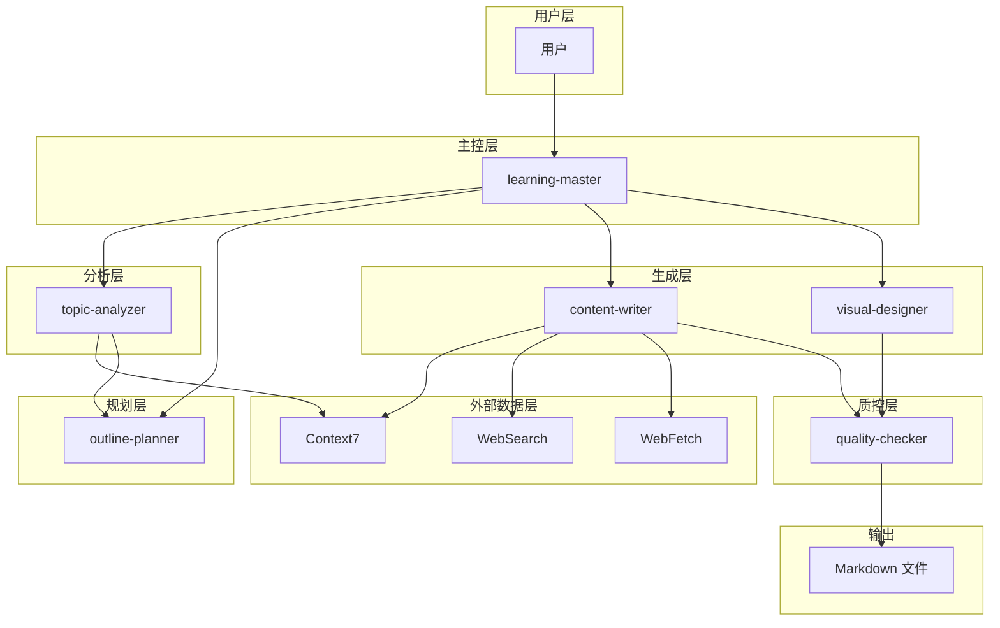
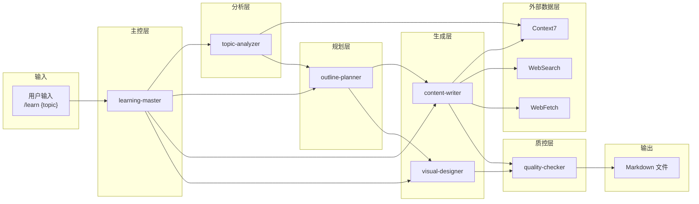
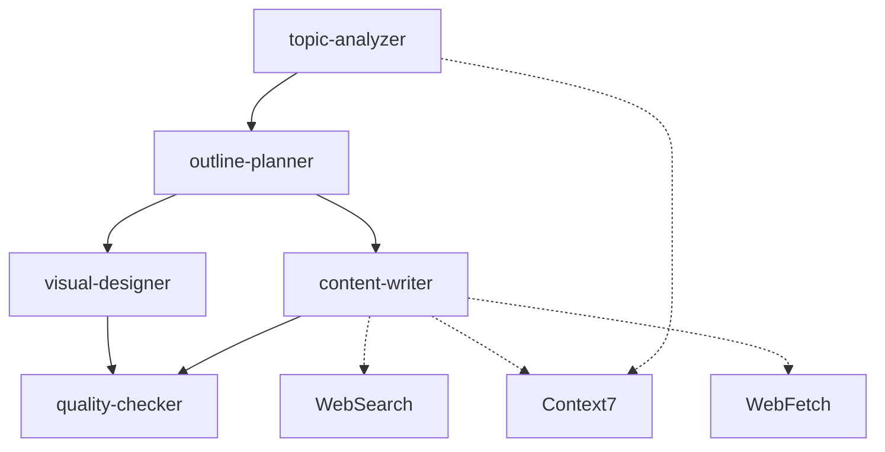
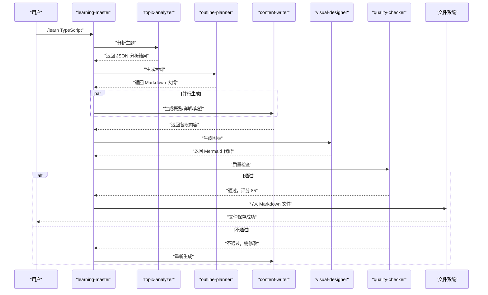

# 数据交换格式

<cite>
**本文引用的文件**
- [04-AI-SKILL-SPEC.md](file://docs/04-AI-SKILL-SPEC.md)
- [03-ARCHITECTURE.md](file://docs/03-ARCHITECTURE.md)
</cite>

## 目录
1. [引言](#引言)
2. [项目结构](#项目结构)
3. [核心组件](#核心组件)
4. [架构总览](#架构总览)
5. [详细组件分析](#详细组件分析)
6. [依赖分析](#依赖分析)
7. [性能考量](#性能考量)
8. [故障排除指南](#故障排除指南)
9. [结论](#结论)
10. [附录](#附录)

## 引言
本文件面向 StudyBuddy 项目的 AI Skill 体系，系统化定义各组件之间的数据交换格式与协议，确保主题分析 JSON、大纲 Markdown、内容段落、Mermaid 图表与质量检查报告等数据类型在不同 Skill 间的一致性与可互操作性。文档同时给出数据验证规则、错误处理机制与格式转换规则，并提供实际数据交换示例路径，便于开发者与 AI 模型在工程实践中遵循统一标准。

## 项目结构
StudyBuddy 采用“技能协作”的分层架构：用户通过主控 Skill 触发，依次经主题分析、大纲规划、内容撰写、图表生成与质量检查，最终输出 Markdown 文档。外部数据层通过 MCP 工具（Context7、WebSearch、WebFetch）提供权威与时效信息，保证内容质量与可追溯性。

**图示来源**
- [03-ARCHITECTURE.md](file://docs/03-ARCHITECTURE.md#L12-L69)

**章节来源**
- [03-ARCHITECTURE.md](file://docs/03-ARCHITECTURE.md#L12-L69)

## 核心组件
- learning-master：主控编排，负责触发与协调其他 Skill，控制生成流程与重试策略。
- topic-analyzer：对主题进行结构化分析，输出 JSON 元数据。
- outline-planner：基于分析结果生成带 Frontmatter 的 Markdown 大纲。
- content-writer：按段落生成内容，遵循三阶段框架；并行调用 MCP 获取权威信息。
- visual-designer：根据大纲生成 Mermaid 图表代码。
- quality-checker：对完整内容进行评分与检查，输出 JSON 报告。

**章节来源**
- [04-AI-SKILL-SPEC.md](file://docs/04-AI-SKILL-SPEC.md#L75-L85)
- [03-ARCHITECTURE.md](file://docs/03-ARCHITECTURE.md#L30-L37)

## 架构总览
下图展示了 Skill 间的数据流与职责边界，以及与外部数据层的交互。

**图示来源**
- [04-AI-SKILL-SPEC.md](file://docs/04-AI-SKILL-SPEC.md#L23-L73)
- [03-ARCHITECTURE.md](file://docs/03-ARCHITECTURE.md#L53-L68)

## 详细组件分析

### 主题分析 JSON（topic-analyzer）
- 作用：为后续大纲规划与内容撰写提供结构化元数据。
- 输出格式：JSON Schema，字段包括主题、URL 友好标识、一句话定义、解决的问题、使用场景、前置知识、复杂度、预计章节数、核心概念、分类、建议图表类型等。
- 验证规则：
  - topic、slug、one_sentence、problem_solved、category 为必填。
  - use_cases、prerequisites 数量有限制，复杂度限定为 beginner/intermediate/advanced。
  - key_concepts 数量与 suggested_diagrams 类型需与主题匹配。
- 错误处理：若分析失败（主题模糊），主控 Skill 应提示用户细化主题。

**章节来源**
- [04-AI-SKILL-SPEC.md](file://docs/04-AI-SKILL-SPEC.md#L216-L248)
- [04-AI-SKILL-SPEC.md](file://docs/04-AI-SKILL-SPEC.md#L250-L277)

### 大纲 Markdown（outline-planner）
- 作用：生成符合三阶段框架的 Markdown 大纲，包含 Frontmatter 与图表标记。
- 输出格式：带 Frontmatter 的 Markdown，包含概览、详解、实战三个阶段；详解阶段按核心概念组织；实战阶段按难度分级；使用 <!-- DIAGRAM: type --> 标记图表位置。
- 验证规则：
  - 必须包含三阶段结构与每概念“是什么-为什么-怎么用”要素。
  - 难度分级清晰，总时长控制在合理范围内。
- 错误处理：若大纲不完整，自动补充缺失章节。

**章节来源**
- [04-AI-SKILL-SPEC.md](file://docs/04-AI-SKILL-SPEC.md#L291-L344)
- [04-AI-SKILL-SPEC.md](file://docs/04-AI-SKILL-SPEC.md#L346-L386)

### 内容段落（content-writer）
- 作用：按段落生成高质量内容，遵循三阶段框架。
- 分段模式：
  - 概览（overview）：一句话定义、核心问题、适用场景、前置知识。
  - 详解（details）：每个核心概念的“是什么-为什么-怎么用”，含最小示例、速查表与常见陷阱。
  - 实战（practices）：初级（单一特性）、中级（2-3 特性组合）、高级（完整项目）。
- MCP 调用要求：在生成涉及时效性与权威性的内容前，必须调用 Context7、WebSearch、WebFetch 获取最新信息；禁止仅依赖模型内置知识生成版本号、API 参数、安装命令、官方推荐写法等。
- 验证规则：字数与代码量限制、示例可运行、必须标注数据来源。
- 错误处理：若内容质量低（评分 < 80），主控 Skill 重新生成（最多 2 次）。

**章节来源**
- [04-AI-SKILL-SPEC.md](file://docs/04-AI-SKILL-SPEC.md#L400-L531)
- [04-AI-SKILL-SPEC.md](file://docs/04-AI-SKILL-SPEC.md#L475-L493)
- [04-AI-SKILL-SPEC.md](file://docs/04-AI-SKILL-SPEC.md#L495-L531)

### 图表生成（visual-designer）
- 作用：根据大纲生成 Mermaid 图表代码，用于概览与实战章节。
- 图表类型规范：mindmap（知识体系概览）、flowchart（使用流程/决策树）、sequenceDiagram（交互过程）、classDiagram（类型关系）等。
- 输出格式：直接输出 Mermaid 代码块，每个图表带注释说明用途；节点文字简洁，层级适中，语法正确。
- 验证规则：至少生成两个图表，节点数量与层级受限，确保可渲染。
- 错误处理：若图表语法错误，简化结构或替换为更简单的类型。

**章节来源**
- [04-AI-SKILL-SPEC.md](file://docs/04-AI-SKILL-SPEC.md#L545-L605)

### 质量检查（quality-checker）
- 作用：对完整内容进行评分与检查，输出 JSON 报告。
- 检查清单：
  - 结构检查（30 分）：三阶段完整、每概念三要素、难度分级清晰。
  - 内容检查（40 分）：定义通俗、类比恰当、示例可运行、速查表实用。
  - 格式检查（30 分）：Markdown 语法、表格规范、Mermaid 语法。
- 输出格式：JSON，包含总分、是否通过、分项得分、问题列表（含严重程度、位置、描述）、改进建议（≤3 条）。
- 评分标准：≥90 优秀，80-89 良好，70-79 一般，<70 不合格。
- 错误处理：不通过时触发重试或人工介入。

**章节来源**
- [04-AI-SKILL-SPEC.md](file://docs/04-AI-SKILL-SPEC.md#L619-L715)
- [04-AI-SKILL-SPEC.md](file://docs/04-AI-SKILL-SPEC.md#L646-L669)

### 数据交换格式与协议
- 用户 → 主控：字符串（/learn {topic} [--category={cat}] [--level={level}]）
- 主控 → 分析器：字符串（主题名称）
- 分析器 → 规划器：JSON（主题分析结果）
- 规划器 → 内容撰写：Markdown（大纲模板）
- 规划器 → 图表生成：Markdown（大纲 + 图表标记）
- 内容撰写 → 质量检查：Markdown（段落内容）
- 图表生成 → 质量检查：Mermaid（图表代码）
- 质量检查 → 主控：JSON（检查报告）

**章节来源**
- [04-AI-SKILL-SPEC.md](file://docs/04-AI-SKILL-SPEC.md#L762-L774)

### 数据验证与错误处理机制
- 主题分析失败：提示细化主题。
- 大纲不完整：自动补充。
- 内容质量低：重试（最多 2 次）。
- 图表语法错误：简化结构。
- 超时：返回部分结果。
- 评分未达标：触发重试或人工介入。

**章节来源**
- [04-AI-SKILL-SPEC.md](file://docs/04-AI-SKILL-SPEC.md#L777-L800)

## 依赖分析
Skill 间依赖关系如下：

**图示来源**
- [04-AI-SKILL-SPEC.md](file://docs/04-AI-SKILL-SPEC.md#L60-L72)
- [03-ARCHITECTURE.md](file://docs/03-ARCHITECTURE.md#L59-L62)

**章节来源**
- [04-AI-SKILL-SPEC.md](file://docs/04-AI-SKILL-SPEC.md#L60-L72)
- [03-ARCHITECTURE.md](file://docs/03-ARCHITECTURE.md#L59-L62)

## 性能考量
- 并行生成：概览、详解、实战三段内容并行生成，缩短总时长。
- 外部数据调用优先级：Context7 > WebFetch > WebSearch > 模型内置知识，减少无效计算。
- Mermaid 渲染：通过 Astro 的 remark-mermaid 插件在构建时渲染，提升页面加载性能。
- 构建优化：Astro 增量构建、图片优化、代码分割等策略降低构建与运行时开销。

**章节来源**
- [04-AI-SKILL-SPEC.md](file://docs/04-AI-SKILL-SPEC.md#L104-L126)
- [03-ARCHITECTURE.md](file://docs/03-ARCHITECTURE.md#L244-L264)
- [03-ARCHITECTURE.md](file://docs/03-ARCHITECTURE.md#L366-L383)

## 故障排除指南
- 生成超时：检查外部数据源响应时间与网络状况，必要时返回部分结果。
- Mermaid 渲染失败：检查图表语法与节点数量，简化结构或更换图表类型。
- 内容质量不达标：依据质量检查报告逐项修正，重点关注“是什么-为什么-怎么用”完整性与示例可运行性。
- 外部数据不可用：切换到次优数据源或使用模型内置知识兜底，但需标注来源差异。
- 重试策略：质量检查不通过时自动重试，超过最大次数后人工介入。

**章节来源**
- [04-AI-SKILL-SPEC.md](file://docs/04-AI-SKILL-SPEC.md#L777-L800)
- [04-AI-SKILL-SPEC.md](file://docs/04-AI-SKILL-SPEC.md#L619-L715)

## 结论
通过标准化的主题分析 JSON、大纲 Markdown、内容段落与 Mermaid 图表格式，StudyBuddy 的 AI Skill 体系实现了高内聚、低耦合的数据交换协议。配合严格的验证规则与错误处理机制，系统能够在保证内容质量的同时，提升生成效率与可维护性。建议在实际工程中严格遵循本文档的数据格式与流程约束，确保各组件间的数据兼容性与一致性。

## 附录

### 数据交换序列图（概览）

**图示来源**
- [03-ARCHITECTURE.md](file://docs/03-ARCHITECTURE.md#L86-L126)