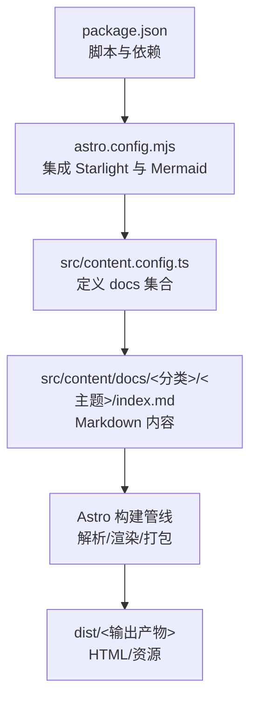
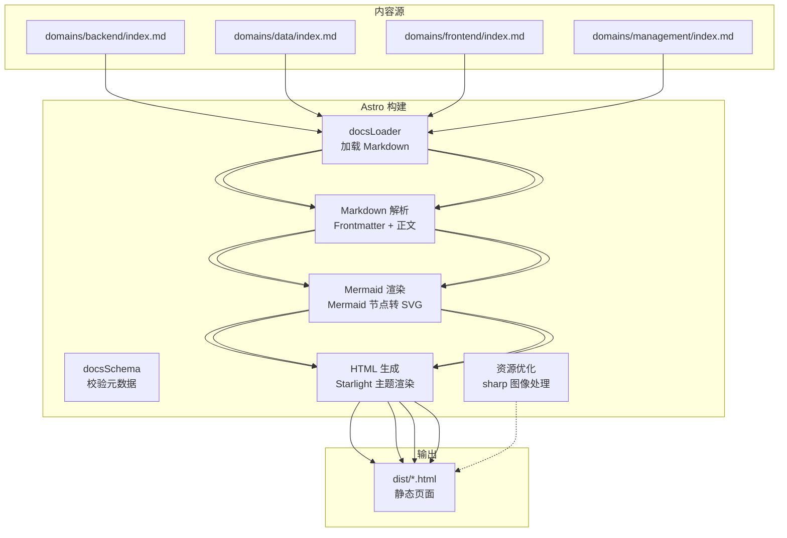
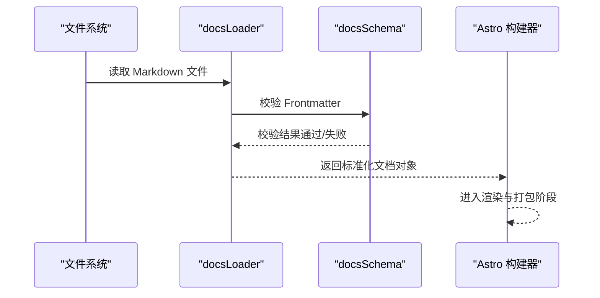
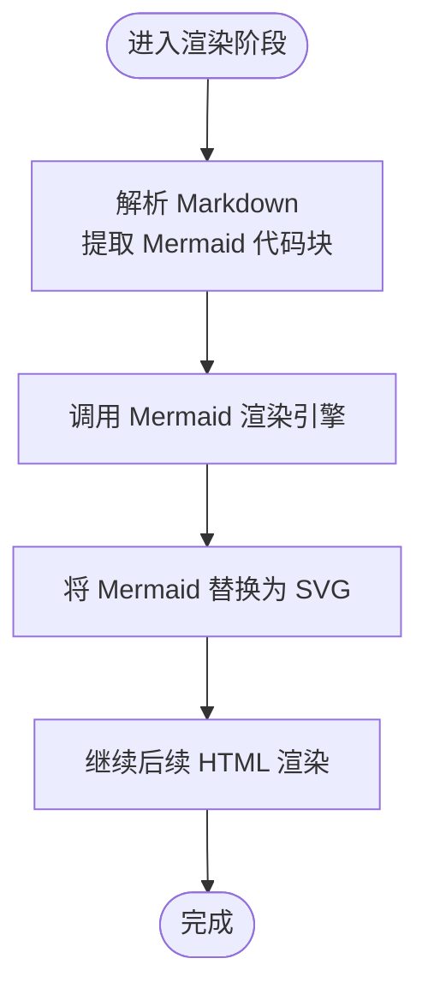
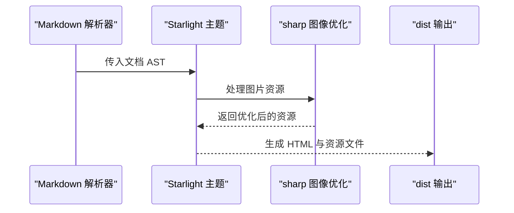
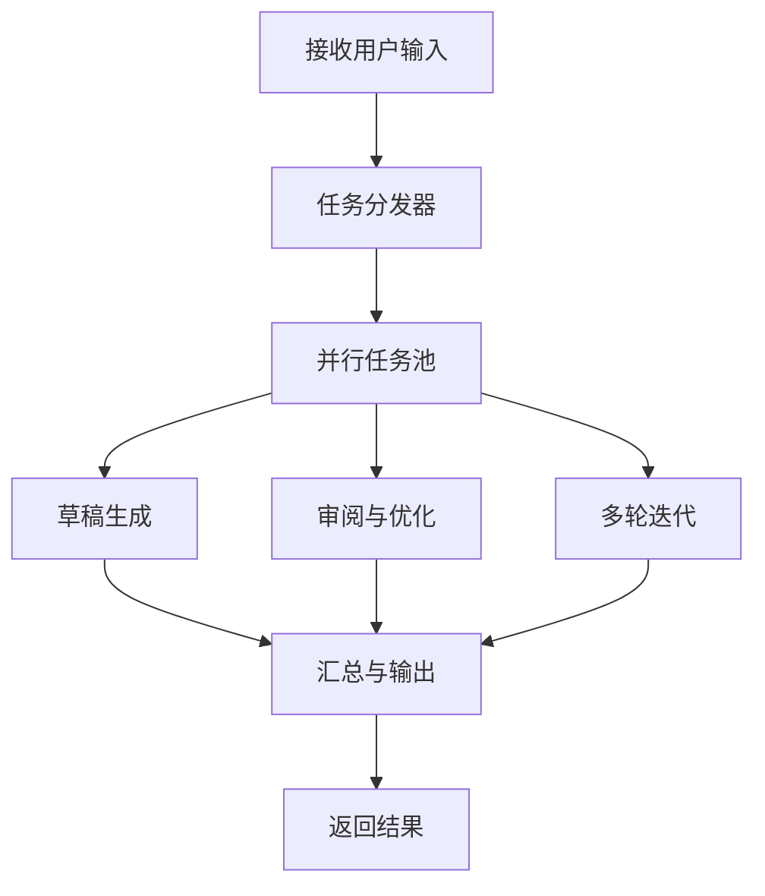
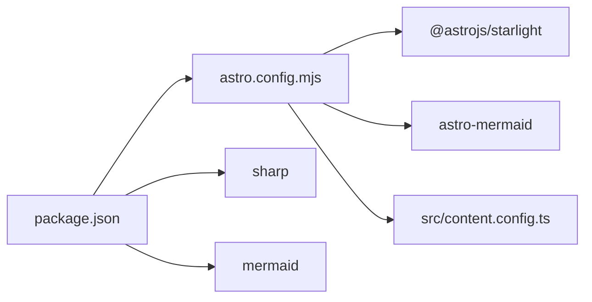

# 数据流设计

<cite>
**本文引用的文件**
- [package.json](file://package.json)
- [astro.config.mjs](file://astro.config.mjs)
- [src/content.config.ts](file://src/content.config.ts)
- [src/content/docs/domains/backend/index.md](file://src/content/docs/domains/backend/index.md)
- [src/content/docs/domains/data/index.md](file://src/content/docs/domains/data/index.md)
- [src/content/docs/domains/frontend/index.md](file://src/content/docs/domains/frontend/index.md)
- [src/content/docs/domains/management/index.md](file://src/content/docs/domains/management/index.md)
</cite>

## 目录
1. [引言](#引言)
2. [项目结构](#项目结构)
3. [核心组件](#核心组件)
4. [架构总览](#架构总览)
5. [详细组件分析](#详细组件分析)
6. [依赖关系分析](#依赖关系分析)
7. [性能考量](#性能考量)
8. [故障排查指南](#故障排查指南)
9. [结论](#结论)
10. [附录](#附录)

## 引言
本设计文档聚焦 StudyBuddy 项目的“数据流设计”，围绕以下目标展开：
- 描述从用户输入到最终文档输出的完整数据流程
- 解释 AI 内容生成的并行处理机制与数据传递方式（若存在）
- 文档化站点构建的数据流：Markdown 解析、Mermaid 渲染、HTML 生成与资源优化
- 明确组件间的数据交换格式与协议
- 提供时序图与流程图直观展示数据流向
- 说明错误处理与重试机制

当前仓库以 Astro Starlight 为基础，采用内容即文档的静态站点生成模式；AI 内容生成与并行处理在现有代码中未直接体现，因此本设计将基于可验证的现有实现进行阐述，并对缺失环节提供可落地的建议。

## 项目结构
StudyBuddy 项目采用 Astro + Starlight 的文档站点架构，内容通过 Markdown 文件组织，配置由 Astro 配置文件与内容配置共同定义。核心目录与文件如下：
- 配置层：astro.config.mjs（集成 Starlight 与 Mermaid）、package.json（依赖与脚本）
- 内容层：src/content/docs 下按“工具/领域/方法论”分类的 Markdown 文档
- 类型与加载：src/content.config.ts（定义 docs 集合，使用 Starlight 的 loader/schema）

图表来源
- [package.json](file://package.json#L1-L20)
- [astro.config.mjs](file://astro.config.mjs#L1-L34)
- [src/content.config.ts](file://src/content.config.ts#L1-L8)

章节来源
- [package.json](file://package.json#L1-L20)
- [astro.config.mjs](file://astro.config.mjs#L1-L34)
- [src/content.config.ts](file://src/content.config.ts#L1-L8)

## 核心组件
- 构建配置与集成
  - Astro 配置：启用 Starlight 作为文档主题与侧边栏自动生成，启用 Mermaid 支持用于流程图等可视化
  - 依赖：astro、@astrojs/starlight、astro-mermaid、mermaid、sharp（图像优化）
- 内容加载与类型
  - 使用 Starlight 的 docsLoader 与 docsSchema 加载与校验 Markdown 元数据与正文
- 内容组织
  - 按“工具/领域/方法论”三层结构组织 Markdown 文档，Starlight 自动根据目录生成导航

章节来源
- [astro.config.mjs](file://astro.config.mjs#L7-L32)
- [package.json](file://package.json#L12-L18)
- [src/content.config.ts](file://src/content.config.ts#L1-L8)

## 架构总览
下图展示了从 Markdown 到最终 HTML 的数据流路径，以及 Mermaid 在渲染阶段的参与位置。

图表来源
- [astro.config.mjs](file://astro.config.mjs#L8-L31)
- [src/content.config.ts](file://src/content.config.ts#L5-L7)
- [src/content/docs/domains/backend/index.md](file://src/content/docs/domains/backend/index.md#L1-L7)
- [src/content/docs/domains/data/index.md](file://src/content/docs/domains/data/index.md#L1-L7)
- [src/content/docs/domains/frontend/index.md](file://src/content/docs/domains/frontend/index.md#L1-L7)
- [src/content/docs/domains/management/index.md](file://src/content/docs/domains/management/index.md#L1-L7)

## 详细组件分析

### 组件一：内容加载与类型系统
- 角色与职责
  - docsLoader：负责扫描与加载 Markdown 文件，提取 Frontmatter 元数据与正文内容
  - docsSchema：对 Frontmatter 字段进行类型校验与默认值处理
- 数据交换格式
  - 输入：Markdown 文件（Frontmatter + 正文）
  - 输出：标准化的文档对象（包含 id、slug、title、description、headers 等字段）
- 错误处理
  - 元数据不合法或缺失时，由 docsSchema 校验失败导致构建中断
  - 建议：在本地开发时开启严格校验，便于快速定位问题

图表来源
- [src/content.config.ts](file://src/content.config.ts#L1-L8)

章节来源
- [src/content.config.ts](file://src/content.config.ts#L1-L8)

### 组件二：Markdown 解析与 Mermaid 渲染
- 角色与职责
  - Markdown 解析：Astro 将 Markdown 转换为 AST，再交由 Starlight 主题渲染为 HTML
  - Mermaid 渲染：Mermaid 集成在 Astro 中，自动识别代码块中的 Mermaid 语法并渲染为 SVG
- 数据交换格式
  - 输入：Markdown 文本（含 Mermaid 代码块）
  - 输出：HTML 片段（Mermaid 节点已替换为 SVG）
- 并行处理机制
  - 当前实现未发现显式的并行处理逻辑；构建阶段为顺序流水线（加载 → 解析 → 渲染 → 打包）
  - 若需引入并行，可在“加载/解析/渲染”阶段增加任务分发与合并策略（见“性能考量”建议）

图表来源
- [astro.config.mjs](file://astro.config.mjs#L31-L31)

章节来源
- [astro.config.mjs](file://astro.config.mjs#L31-L31)

### 组件三：HTML 生成与资源优化
- 角色与职责
  - HTML 生成：Starlight 主题将解析后的文档渲染为页面结构
  - 资源优化：sharp 用于图像处理与优化，提升加载性能
- 数据交换格式
  - 输入：Markdown 文档对象、静态资源（图片等）
  - 输出：优化后的 HTML 与静态资源（dist 目录）
- 错误处理
  - 图像处理失败会阻断构建；建议在 CI 中对关键资源做预检

图表来源
- [package.json](file://package.json#L17-L17)
- [astro.config.mjs](file://astro.config.mjs#L9-L31)

章节来源
- [package.json](file://package.json#L17-L17)
- [astro.config.mjs](file://astro.config.mjs#L9-L31)

### 组件四：AI 内容生成（现状与建议）
- 现状
  - 仓库未发现直接的 AI 内容生成实现或并行处理逻辑
- 建议的并行处理机制（概念性）
  - 将内容生成拆分为多个子任务（如：主题规划、草稿生成、审阅与优化），通过任务队列并行执行
  - 数据传递：以 JSON 结构在任务间传递（包含上下文、提示词、中间产物）
  - 错误处理与重试：对失败任务进行指数退避重试，并记录失败原因以便回溯

（该图为概念性流程，不对应具体源码）

## 依赖关系分析
- 配置依赖
  - astro.config.mjs 依赖 @astrojs/starlight 与 astro-mermaid
  - package.json 定义了构建脚本与运行时依赖
- 内容依赖
  - src/content.config.ts 依赖 @astrojs/starlight 的 loader 与 schema
- 运行时依赖
  - sharp 用于图像优化，Mermaid 用于可视化渲染

图表来源
- [package.json](file://package.json#L12-L18)
- [astro.config.mjs](file://astro.config.mjs#L3-L31)
- [src/content.config.ts](file://src/content.config.ts#L2-L3)

章节来源
- [package.json](file://package.json#L12-L18)
- [astro.config.mjs](file://astro.config.mjs#L3-L31)
- [src/content.config.ts](file://src/content.config.ts#L2-L3)

## 性能考量
- 构建阶段
  - 当前为顺序流水线，未见并行化实现
  - 建议
    - 对独立文档的解析与渲染进行并行化（按目录或主题分组）
    - 使用缓存避免重复渲染相同内容
    - 对大图使用 lazy-load 与 WebP 格式（结合 sharp）
- 资源优化
  - 利用 sharp 进行尺寸裁剪、质量压缩与格式转换
  - 合理设置图片占位符与懒加载策略，降低首屏阻塞

（本节为通用性能建议，不直接对应特定源码）

## 故障排查指南
- 构建失败
  - 症状：构建中断，提示 Frontmatter 校验失败
  - 排查：检查 Markdown 文件的 Frontmatter 是否符合 docsSchema 约束
  - 参考
    - [src/content.config.ts](file://src/content.config.ts#L1-L8)
- Mermaid 渲染异常
  - 症状：Mermaid 代码块未正确渲染为 SVG
  - 排查：确认 astro.config.mjs 已启用 mermaid 集成
  - 参考
    - [astro.config.mjs](file://astro.config.mjs#L31-L31)
- 图像处理失败
  - 症状：构建时报错与图片相关的处理步骤
  - 排查：确认 sharp 依赖安装与图片路径正确
  - 参考
    - [package.json](file://package.json#L17-L17)

章节来源
- [src/content.config.ts](file://src/content.config.ts#L1-L8)
- [astro.config.mjs](file://astro.config.mjs#L31-L31)
- [package.json](file://package.json#L17-L17)

## 结论
StudyBuddy 当前以 Astro + Starlight 为核心，形成“内容即文档”的静态站点生成链路。内容加载与类型校验确保数据一致性，Mermaid 集成支持可视化渲染，sharp 提升资源性能。AI 内容生成与并行处理在现有代码中尚未实现，但可通过任务分发与缓存策略在不破坏现有架构的前提下逐步引入。建议在 CI 中强化校验与预检，以提升稳定性与可维护性。

## 附录
- 示例内容文件（用于验证加载与渲染）
  - [domains/backend/index.md](file://src/content/docs/domains/backend/index.md#L1-L7)
  - [domains/data/index.md](file://src/content/docs/domains/data/index.md#L1-L7)
  - [domains/frontend/index.md](file://src/content/docs/domains/frontend/index.md#L1-L7)
  - [domains/management/index.md](file://src/content/docs/domains/management/index.md#L1-L7)