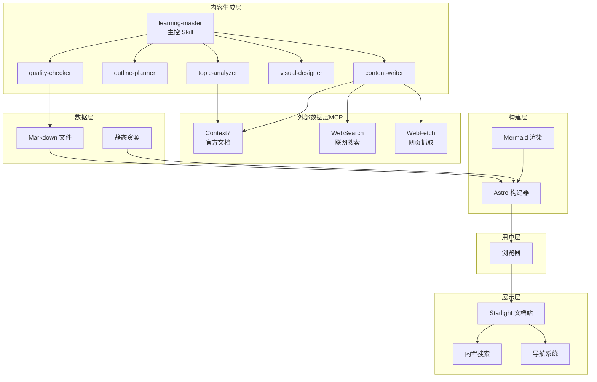
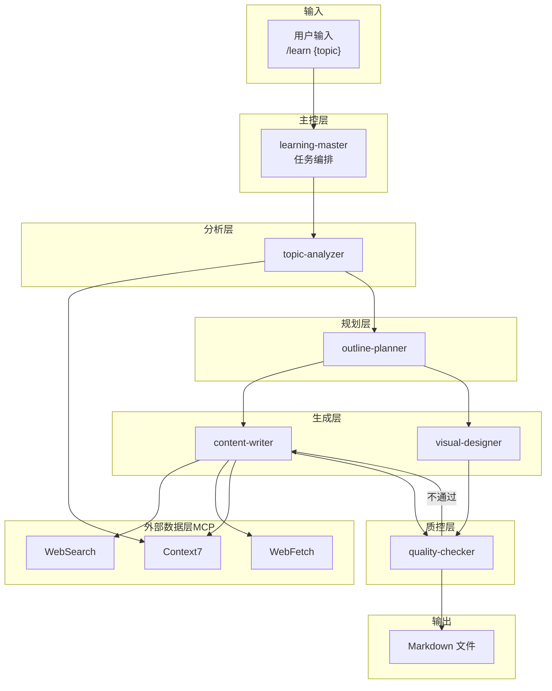
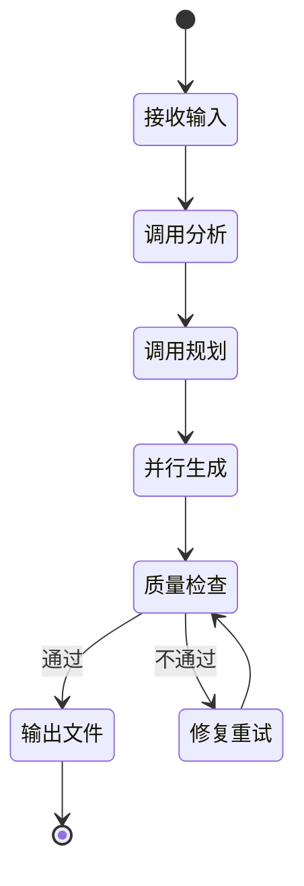
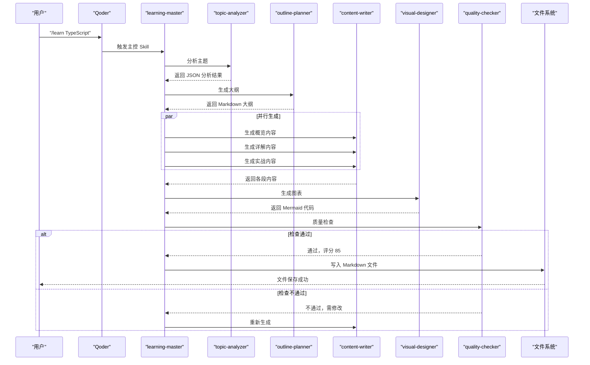
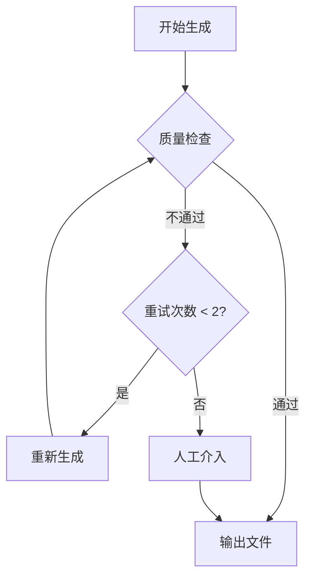
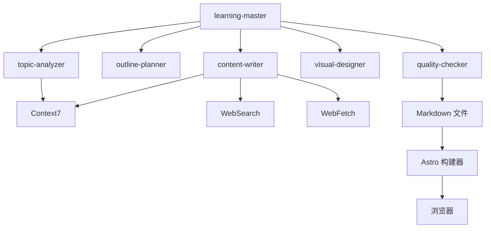

# 主控协调器

<cite>
**本文引用的文件**
- [03-ARCHITECTURE.md](file://docs/03-ARCHITECTURE.md)
- [04-AI-SKILL-SPEC.md](file://docs/04-AI-SKILL-SPEC.md)
- [astro.config.mjs](file://astro.config.mjs)
- [package.json](file://package.json)
</cite>

## 目录
1. [简介](#简介)
2. [项目结构](#项目结构)
3. [核心组件](#核心组件)
4. [架构总览](#架构总览)
5. [详细组件分析](#详细组件分析)
6. [依赖分析](#依赖分析)
7. [性能考量](#性能考量)
8. [故障排除指南](#故障排除指南)
9. [结论](#结论)
10. [附录](#附录)

## 简介
本文件为 StudyBuddy 项目中的“主控协调器”（learning-master）提供系统化技术文档。该主控 Skill 位于 AI 内容生成系统的中枢，负责协调六个子 Skill 的执行顺序、数据传递与状态流转，并对最终产出进行质量检查与回退处理。本文将围绕任务调度机制、并行执行策略、错误处理与重试逻辑、配置参数、调用接口与状态管理进行深入阐述，并给出端到端时序图与组件关系图，帮助读者全面理解主控协调器的设计与实现要点。

## 项目结构
StudyBuddy 采用分层架构与模块化组织，主控协调器位于内容生成层，与主题分析、大纲规划、内容撰写、图表生成、质量检查等子 Skill 协同工作；同时与外部 MCP 工具（Context7、WebSearch、WebFetch）集成，确保内容的时效性与准确性。项目通过 Astro 构建静态站点，Mermaid 渲染图表，Starlight 提供文档站点能力。

**图表来源**
- [03-ARCHITECTURE.md](file://docs/03-ARCHITECTURE.md#L12-L69)

**章节来源**
- [03-ARCHITECTURE.md](file://docs/03-ARCHITECTURE.md#L1-L410)

## 核心组件
- 主控协调器（learning-master）
  - 职责：接收用户请求，编排子 Skill 执行，控制并行生成，进行质量检查与回退。
  - 触发命令：/learn {topic} [--category={cat}] [--level={level}]
  - 输出：完整的 Markdown 文件，保存至 src/content/docs/{category}/{slug}.md
  - 约束：生成时间控制在 30 秒内，质量检查评分 ≥ 80 分才输出，失败最多重试 2 次

- 子 Skill
  - topic-analyzer：主题分析，输出结构化元数据（JSON）
  - outline-planner：基于分析结果生成三阶段大纲（Markdown）
  - content-writer：按段落并行生成内容（概览/详解/实战），并调用 MCP 获取最新信息
  - visual-designer：生成 Mermaid 图表（mindmap、flowchart 等）
  - quality-checker：质量检查与评分，输出检查报告（JSON）

- 外部数据源（MCP）
  - Context7：官方文档查询
  - WebSearch：联网搜索最新资讯、最佳实践
  - WebFetch：抓取指定网页内容

**章节来源**
- [04-AI-SKILL-SPEC.md](file://docs/04-AI-SKILL-SPEC.md#L149-L202)
- [04-AI-SKILL-SPEC.md](file://docs/04-AI-SKILL-SPEC.md#L174-L202)
- [04-AI-SKILL-SPEC.md](file://docs/04-AI-SKILL-SPEC.md#L777-L800)

## 架构总览
主控协调器处于内容生成层的中枢，向上承接用户请求，向下驱动多个子 Skill 并行协作，同时与外部 MCP 工具交互以保证内容质量与时效性。质量检查作为门禁，决定是否输出最终文档。

**图表来源**
- [04-AI-SKILL-SPEC.md](file://docs/04-AI-SKILL-SPEC.md#L19-L73)

**章节来源**
- [04-AI-SKILL-SPEC.md](file://docs/04-AI-SKILL-SPEC.md#L19-L85)

## 详细组件分析

### 主控协调器（learning-master）
- 触发与输入
  - 触发命令：/learn {topic} [--category={cat}] [--level={level}]
  - 输入格式：topic（必填）、category（可选，默认自动识别）、level（可选，beginner/intermediate/advanced）
- 工作流程（状态机）
  - 接收输入 → 调用分析 → 调用规划 → 并行生成 → 质量检查 → 输出文件（通过）/修复重试（不通过）
- 并行执行策略
  - 在“并行生成”阶段，主控协调器向 content-writer 发起三个段落的并行调用（概览、详解、实战），以缩短总生成时间
- 数据传递
  - 用户 → 主控：字符串（主题与可选参数）
  - 主控 → 分析器：主题字符串
  - 分析器 → 规划器：分析 JSON
  - 规划器 → 生成器：大纲 Markdown
  - 规划器 → 图表生成器：大纲 Markdown（含图表标记）
  - 生成器 → 质检器：内容 Markdown
  - 图表生成器 → 质检器：Mermaid 代码
  - 质检器 → 主控：检查报告 JSON
- 质量检查与回退
  - 评分阈值：≥ 80 分视为通过
  - 最大重试次数：2 次
  - 不通过时触发内容重生成，直至通过或达到最大重试次数

**图表来源**
- [04-AI-SKILL-SPEC.md](file://docs/04-AI-SKILL-SPEC.md#L161-L172)

**章节来源**
- [04-AI-SKILL-SPEC.md](file://docs/04-AI-SKILL-SPEC.md#L149-L202)
- [04-AI-SKILL-SPEC.md](file://docs/04-AI-SKILL-SPEC.md#L777-L800)

### 任务调度机制与并行执行
- 调度机制
  - 主控协调器根据三阶段框架（概览、详解、实战）进行阶段化调度
  - 在“并行生成”阶段，主控协调器对 content-writer 的三个段落发起并行调用，提升吞吐
- 并行策略
  - 并行生成期间，主控协调器等待所有段落完成后，再进入质量检查阶段
  - 若任一段落失败，主控协调器根据错误处理策略决定是否重试或终止
- 数据聚合
  - 主控协调器在质量检查前汇总所有段落内容与图表代码，形成完整文档

**图表来源**
- [03-ARCHITECTURE.md](file://docs/03-ARCHITECTURE.md#L86-L126)

**章节来源**
- [03-ARCHITECTURE.md](file://docs/03-ARCHITECTURE.md#L82-L126)

### 错误处理与重试逻辑
- 错误类型与处理
  - 分析失败：提示用户细化主题
  - 大纲不完整：自动补充
  - 内容质量低：评分 < 80 时触发重试，最多 2 次
  - 图表语法错误：简化图表结构
  - 超时：生成时间 > 60s 时返回部分结果
- 回退流程
  - 质量检查不通过时，主控协调器根据剩余重试次数决定是否重新生成内容
  - 达到最大重试次数后，进入人工介入流程

**图表来源**
- [04-AI-SKILL-SPEC.md](file://docs/04-AI-SKILL-SPEC.md#L789-L800)

**章节来源**
- [04-AI-SKILL-SPEC.md](file://docs/04-AI-SKILL-SPEC.md#L777-L800)

### 配置参数与调用接口
- 触发命令
  - /learn {topic} [--category={cat}] [--level={level}]
- 输出路径
  - src/content/docs/{category}/{slug}.md
- 约束
  - 生成时间控制在 30 秒内
  - 质量检查评分 ≥ 80 分
  - 失败最多重试 2 次

**章节来源**
- [04-AI-SKILL-SPEC.md](file://docs/04-AI-SKILL-SPEC.md#L149-L202)

### 状态管理
- 主控协调器的状态包括：接收输入、调用分析、调用规划、并行生成、质量检查、输出文件、修复重试
- 状态转换由外部事件（子 Skill 返回、质量检查结果）与内部约束（时间、评分、重试次数）共同驱动

**章节来源**
- [04-AI-SKILL-SPEC.md](file://docs/04-AI-SKILL-SPEC.md#L161-L172)

## 依赖分析
- 组件耦合
  - 主控协调器与子 Skill 之间存在强依赖关系，数据流单向传递，职责边界清晰
  - 子 Skill 与外部 MCP 工具之间存在依赖，主控协调器通过统一调度屏蔽外部工具差异
- 外部依赖
  - Astro 构建器与 Mermaid 渲染：用于将生成的 Markdown 与图表渲染为静态页面
  - Starlight：提供文档站点的导航与展示能力
- 潜在风险
  - 子 Skill 的失败会影响整体生成时间，需通过并行与重试策略缓解
  - 外部 MCP 工具的可用性与响应时间直接影响内容质量与时效性

**图表来源**
- [03-ARCHITECTURE.md](file://docs/03-ARCHITECTURE.md#L12-L69)

**章节来源**
- [03-ARCHITECTURE.md](file://docs/03-ARCHITECTURE.md#L1-L410)

## 性能考量
- 并行生成：通过并行调用 content-writer 的三个段落，显著缩短总生成时间
- 质量前置检查：在输出前进行质量检查，避免无效输出与后续重做
- 外部工具优先级：Context7 → WebFetch → WebSearch → 模型内置知识，优先权威数据源，减少返工
- 构建优化：Astro 零 JS 默认、Mermaid 原生支持，提升页面渲染性能与可访问性

**章节来源**
- [04-AI-SKILL-SPEC.md](file://docs/04-AI-SKILL-SPEC.md#L104-L126)
- [03-ARCHITECTURE.md](file://docs/03-ARCHITECTURE.md#L242-L275)

## 故障排除指南
- 常见问题
  - 主题过于模糊：提示用户细化主题
  - 大纲不完整：自动补充缺失章节
  - 内容质量低：评分 < 80 时自动重试，最多 2 次
  - 图表语法错误：简化图表结构，确保可渲染
  - 超时：生成时间超过阈值时返回部分结果
- 排查步骤
  - 检查子 Skill 的返回数据格式是否符合预期
  - 核对 MCP 工具调用是否成功，优先使用 Context7 获取权威数据
  - 确认 Mermaid 语法正确且节点数量适中
  - 监控生成时间与重试次数，避免超过约束

**章节来源**
- [04-AI-SKILL-SPEC.md](file://docs/04-AI-SKILL-SPEC.md#L777-L800)

## 结论
主控协调器（learning-master）通过明确的阶段化调度、并行执行策略与严格的错误处理与重试机制，实现了高效、稳定、可扩展的 AI 内容生成流水线。其与子 Skill 和外部 MCP 工具的协同，确保了内容的质量与时效性；与 Astro、Mermaid、Starlight 的集成，则保障了最终产物的可读性与可维护性。未来可在监控与可观测性方面进一步增强，以便更精细地追踪各阶段耗时与成功率。

## 附录
- 项目依赖与构建配置
  - Astro、Starlight、Mermaid、TailwindCSS 等依赖用于构建与渲染
  - Mermaid 通过 remark 插件集成，支持多种图表类型
  - 构建流程将 Markdown 与 Mermaid 渲染为静态 HTML、JS 与优化后的资源

**章节来源**
- [package.json](file://package.json#L12-L20)
- [astro.config.mjs](file://astro.config.mjs#L1-L39)
- [03-ARCHITECTURE.md](file://docs/03-ARCHITECTURE.md#L242-L275)