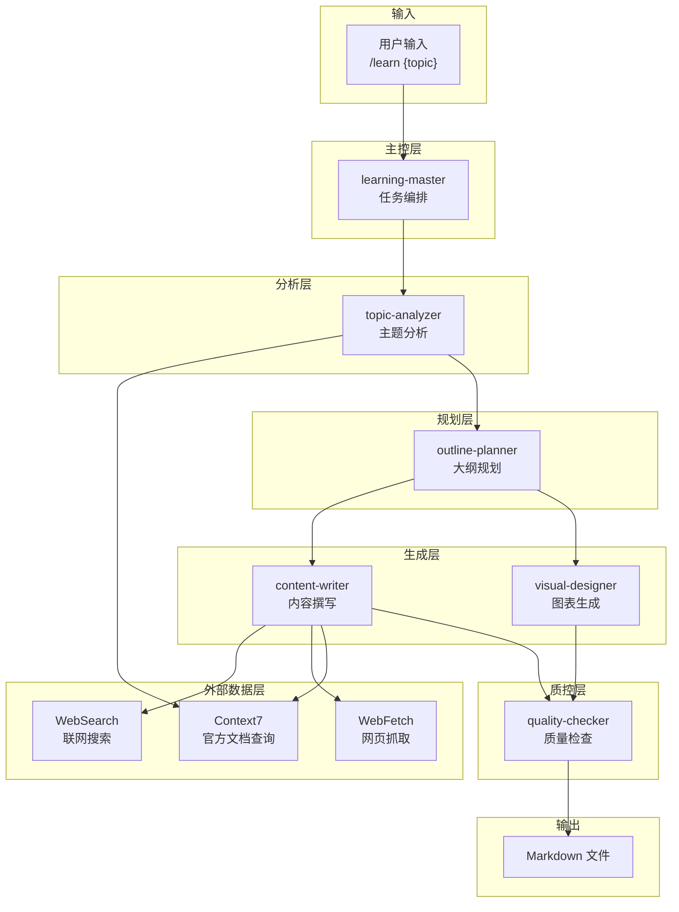
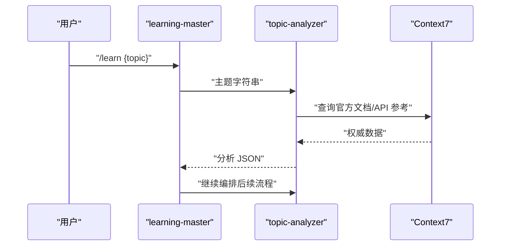
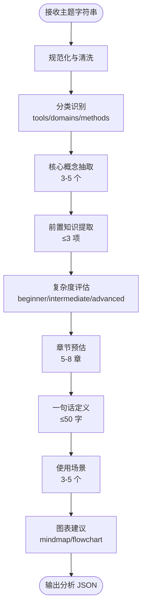
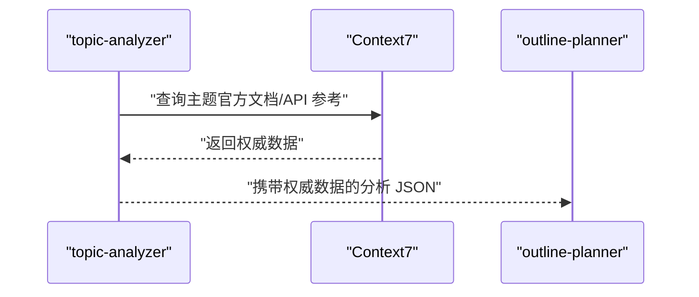
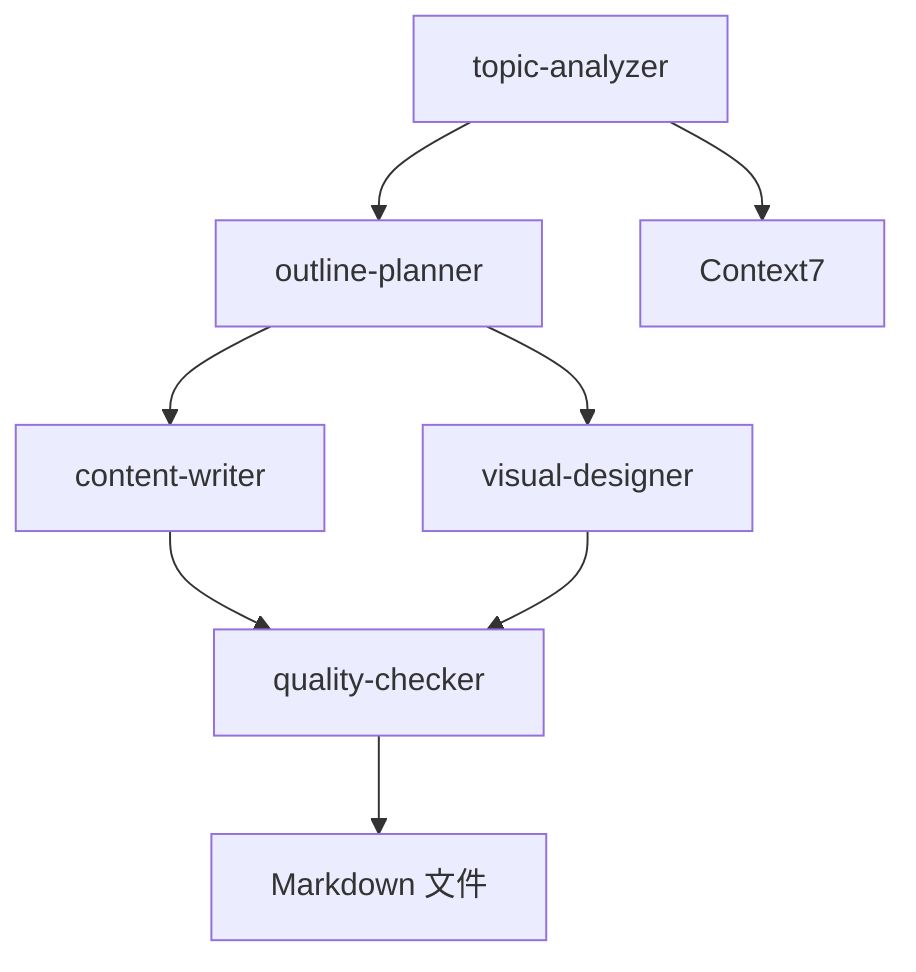
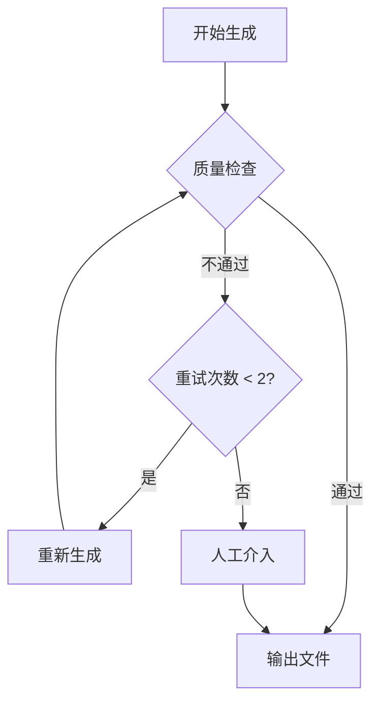

# 主题分析器

<cite>
**本文引用的文件**
- [StudyBuddy AI Skill 规格说明](file://docs/04-AI-SKILL-SPEC.md)
- [架构设计文档](file://docs/03-ARCHITECTURE.md)
- [前端开发索引文档](file://src/content/docs/domains/frontend/index.md)
- [学习方法索引文档](file://src/content/docs/methods/learning/index.md)
</cite>

## 目录
1. [简介](#简介)
2. [项目结构](#项目结构)
3. [核心组件](#核心组件)
4. [架构总览](#架构总览)
5. [详细组件分析](#详细组件分析)
6. [依赖关系分析](#依赖关系分析)
7. [性能考量](#性能考量)
8. [故障排除指南](#故障排除指南)
9. [结论](#结论)
10. [附录](#附录)

## 简介
本文件为 StudyBuddy 项目中的主题分析器（topic-analyzer）提供全面的技术文档。主题分析器负责对用户输入的学习主题进行深度分析，提取关键信息并生成结构化的元数据，作为后续大纲规划、内容撰写、图表生成与质量检查的基础。文档重点涵盖：
- 分析算法与复杂度评估机制
- 知识结构识别与相关概念提取
- 输入参数格式、输出 JSON 结构
- 分析阈值与质量评估标准
- 与 Context7 外部工具的数据交互协议

## 项目结构
StudyBuddy 采用模块化技能体系（Skill），主题分析器作为第二子技能，位于“分析层”，与“主控层”“规划层”“生成层”“质控层”协同工作，并通过 MCP（Model Context Protocol）工具访问外部数据源。

**图表来源**
- [StudyBuddy AI Skill 规格说明](file://docs/04-AI-SKILL-SPEC.md#L23-L73)

**章节来源**
- [StudyBuddy AI Skill 规格说明](file://docs/04-AI-SKILL-SPEC.md#L19-L85)
- [架构设计文档](file://docs/03-ARCHITECTURE.md#L164-L221)

## 核心组件
- 主题分析器（topic-analyzer）
  - 职责：解析用户输入的主题，输出结构化元数据，供后续流程使用
  - 输入：字符串形式的主题名称
  - 输出：JSON 结构，包含主题、slug、一句话定义、解决的问题、使用场景、前置知识、复杂度、预计章节数、核心概念、分类、建议图表类型等字段
- 外部工具（MCP）
  - Context7：查询官方文档、API 参考
  - WebSearch：联网搜索最新资讯、最佳实践
  - WebFetch：抓取指定网页内容

**章节来源**
- [StudyBuddy AI Skill 规格说明](file://docs/04-AI-SKILL-SPEC.md#L206-L277)
- [StudyBuddy AI Skill 规格说明](file://docs/04-AI-SKILL-SPEC.md#L86-L95)

## 架构总览
主题分析器在整体技能体系中的位置与职责如下：
- 由 learning-master 接收用户输入并触发
- 调用 Context7 获取主题相关的权威信息
- 产出结构化 JSON 元数据
- 将分析结果传递给 outline-planner 生成大纲
- 为 content-writer 和 visual-designer 提供输入参数与上下文

**图表来源**
- [StudyBuddy AI Skill 规格说明](file://docs/04-AI-SKILL-SPEC.md#L23-L73)
- [StudyBuddy AI Skill 规格说明](file://docs/04-AI-SKILL-SPEC.md#L86-L95)

## 详细组件分析

### 输入参数与输出结构
- 输入参数
  - topic：学习主题（必填）
  - category：分类（可选，默认自动识别）
  - level：难度（可选，beginner/intermediate/advanced）

- 输出 JSON 结构（Schema）
  - topic：主题名称
  - slug：URL 友好的标识符（kebab-case）
  - one_sentence：一句话定义（不超过 50 字）
  - problem_solved：解决的核心问题
  - use_cases：3-5 个典型使用场景
  - prerequisites：前置知识（不超过 3 个）
  - complexity：难度级别（beginner/intermediate/advanced）
  - estimated_sections：预计章节数（5-8）
  - key_concepts：核心概念（3-5 个）
  - category：分类（tools/domains/methods）
  - suggested_diagrams：建议的图表类型（mindmap/flowchart 等）

- 输出格式约定
  - 用户 → Master：字符串（/learn TypeScript --level=intermediate）
  - Master → Analyzer：字符串（主题名称）
  - Analyzer → Planner：JSON（分析结果）
  - Planner → Writer：Markdown（大纲模板）
  - Planner → Designer：Markdown（大纲 + 图表标记）
  - Writer → Checker：Markdown（段落内容）
  - Designer → Checker：Mermaid（图表代码）
  - Checker → Master：JSON（检查报告）

**章节来源**
- [StudyBuddy AI Skill 规格说明](file://docs/04-AI-SKILL-SPEC.md#L190-L202)
- [StudyBuddy AI Skill 规格说明](file://docs/04-AI-SKILL-SPEC.md#L216-L248)
- [StudyBuddy AI Skill 规格说明](file://docs/04-AI-SKILL-SPEC.md#L762-L774)

### 分析算法与复杂度评估机制
- 算法目标
  - 从管理者视角解构知识体系，提取主题的关键信息与结构
  - 保证输出面向学习者，避免实现细节，突出“是什么”“为什么”“何时用”
- 关键处理步骤
  - 主题归类与分类识别：根据主题特征映射到 tools/domains/methods
  - 复杂度评估：结合前置知识、核心概念数量与章节预估，判定难度级别
  - 知识结构识别：抽取 3-5 个核心概念，形成知识骨架
  - 场景与图表建议：基于主题属性建议适用图表类型（mindmap/flowchart 等）
- 复杂度评估标准
  - 难度级别：beginner（入门）、intermediate（中级）、advanced（高级）
  - 预计章节：5-8 章，依据核心概念数量与复杂度动态调整
  - 前置知识：限制不超过 3 项，确保学习门槛合理
- 质量评估标准
  - 输出 JSON 必须满足字段完整性与约束
  - one_sentence 需通俗易懂，use_cases 与 prerequisites 需贴合实际
  - suggested_diagrams 与主题匹配度高，便于后续可视化

**图表来源**
- [StudyBuddy AI Skill 规格说明](file://docs/04-AI-SKILL-SPEC.md#L250-L277)

**章节来源**
- [StudyBuddy AI Skill 规格说明](file://docs/04-AI-SKILL-SPEC.md#L250-L277)
- [StudyBuddy AI Skill 规格说明](file://docs/04-AI-SKILL-SPEC.md#L216-L248)

### 知识结构识别与相关概念提取
- 知识结构识别
  - 基于主题特征与领域知识，识别 3-5 个核心概念
  - 概念需具备独立性与代表性，能够构成学习路径的骨架
- 相关概念提取
  - 通过 Context7 查询官方文档，确保概念定义与术语准确
  - 结合 use_cases 与 problem_solved，验证概念的实用性与针对性
- 输出约束
  - key_concepts 数量控制在 3-5 个
  - prerequisites 数量控制在 3 个以内
  - complexity 与 estimated_sections 与 key_concepts 保持一致

**章节来源**
- [StudyBuddy AI Skill 规格说明](file://docs/04-AI-SKILL-SPEC.md#L260-L271)
- [StudyBuddy AI Skill 规格说明](file://docs/04-AI-SKILL-SPEC.md#L86-L95)

### 与 Context7 的数据交互协议
- 调用时机
  - topic-analyzer 分析阶段：查询主题相关权威信息
  - content-writer 撰写阶段：获取 API 签名、参数说明、注意事项
- 调用策略
  - 数据获取优先级：Context7 官方文档（最权威）→ WebFetch 官方网站（次权威）→ WebSearch 社区资源（补充参考）→ 模型内置知识（兜底）
  - 必须联网场景：版本号与发布日期、API 签名与参数、安装/配置命令、官方推荐的最佳实践
  - 可用内置知识场景：概念解释与类比、通用设计模式、不涉及版本的原理说明
- 调用示例（在 content-writer 中）
  - 步骤：调用 Context7 查询“React useEffect official documentation”，获取最新 API 签名、参数说明、注意事项，基于官方文档撰写内容并标注数据来源

**图表来源**
- [StudyBuddy AI Skill 规格说明](file://docs/04-AI-SKILL-SPEC.md#L86-L95)
- [StudyBuddy AI Skill 规格说明](file://docs/04-AI-SKILL-SPEC.md#L128-L145)

**章节来源**
- [StudyBuddy AI Skill 规格说明](file://docs/04-AI-SKILL-SPEC.md#L104-L126)
- [StudyBuddy AI Skill 规格说明](file://docs/04-AI-SKILL-SPEC.md#L128-L145)

### 输出 JSON 示例与字段说明
- 示例（TypeScript）
  - topic：TypeScript
  - slug：typescript
  - one_sentence：TypeScript 是 JavaScript 的超集，添加了静态类型系统
  - problem_solved：解决 JavaScript 大型项目中类型不安全导致的维护困难
  - use_cases：大型前端项目开发、Node.js 后端开发、需要 IDE 智能提示的场景
  - prerequisites：JavaScript 基础语法、ES6+ 特性
  - complexity：intermediate
  - estimated_sections：6
  - key_concepts：类型注解、接口与类型别名、泛型、类型推断、装饰器
  - category：domains/frontend
  - suggested_diagrams：mindmap、flowchart

**章节来源**
- [StudyBuddy AI Skill 规格说明](file://docs/04-AI-SKILL-SPEC.md#L218-L247)

### 与大纲规划（outline-planner）的衔接
- 输入：Analyzer 输出的 JSON
- 输出：带 frontmatter 的 Markdown 大纲，包含概览、详解、实战三阶段，以及图表标记
- 三阶段框架
  - 概览：一句话定义、核心问题、适用场景、前置知识、思维导图
  - 详解：每个核心概念的“是什么-为什么-怎么用”
  - 实战：初级（单一特性）、中级（2-3 特性组合）、高级（完整项目实战）

**章节来源**
- [StudyBuddy AI Skill 规格说明](file://docs/04-AI-SKILL-SPEC.md#L281-L386)

## 依赖关系分析
- 组件耦合
  - topic-analyzer 与 outline-planner：强耦合（Analyzer 输出直接影响 Planner 输入）
  - topic-analyzer 与 Context7：弱耦合（通过 MCP 工具调用，数据驱动）
  - topic-analyzer 与 content-writer、visual-designer：间接耦合（通过 Planner 与 Checker）
- 外部依赖
  - MCP 工具链：Context7、WebSearch、WebFetch
  - Astro 内容生成：最终输出为 Markdown 文件，存储于 src/content/docs/{category}/{slug}.md

**图表来源**
- [StudyBuddy AI Skill 规格说明](file://docs/04-AI-SKILL-SPEC.md#L723-L760)

**章节来源**
- [StudyBuddy AI Skill 规格说明](file://docs/04-AI-SKILL-SPEC.md#L719-L774)

## 性能考量
- 生成时间控制：整体生成时间控制在 30 秒内
- 质量检查门槛：质量检查评分 ≥ 80 分才输出
- 失败重试：最多重试 2 次
- 超时处理：若超过 60 秒，返回部分结果

**章节来源**
- [StudyBuddy AI Skill 规格说明](file://docs/04-AI-SKILL-SPEC.md#L198-L202)
- [StudyBuddy AI Skill 规格说明](file://docs/04-AI-SKILL-SPEC.md#L777-L800)

## 故障排除指南
- 分析失败
  - 触发条件：主题过于模糊
  - 处理方式：提示用户细化主题
- 大纲不完整
  - 触发条件：缺少必要章节
  - 处理方式：自动补充
- 内容质量低
  - 触发条件：评分 < 80
  - 处理方式：重新生成（最多 2 次）
- 图表语法错误
  - 触发条件：Mermaid 解析失败
  - 处理方式：简化图表结构
- 超时
  - 触发条件：生成时间 > 60s
  - 处理方式：返回部分结果

**图表来源**
- [StudyBuddy AI Skill 规格说明](file://docs/04-AI-SKILL-SPEC.md#L789-L800)

**章节来源**
- [StudyBuddy AI Skill 规格说明](file://docs/04-AI-SKILL-SPEC.md#L777-L800)

## 结论
主题分析器（topic-analyzer）在 StudyBuddy 技能体系中承担“知识骨架提炼”的关键角色。通过规范化输入、权威数据查询、结构化输出与严格的质量评估，它为后续的大纲规划、内容撰写与图表生成提供了高质量的输入。配合 MCP 工具链与统一的数据格式约定，主题分析器实现了高效、可扩展且可追溯的学习文档生成流程。

## 附录
- 使用示例
  - 基础调用：/learn Docker
  - 高级调用：/learn Kubernetes --category=tools --level=advanced
- 示例文档位置
  - 前端开发索引：src/content/docs/domains/frontend/index.md
  - 学习方法索引：src/content/docs/methods/learning/index.md

**章节来源**
- [StudyBuddy AI Skill 规格说明](file://docs/04-AI-SKILL-SPEC.md#L804-L833)
- [前端开发索引文档](file://src/content/docs/domains/frontend/index.md#L1-L7)
- [学习方法索引文档](file://src/content/docs/methods/learning/index.md#L1-L7)