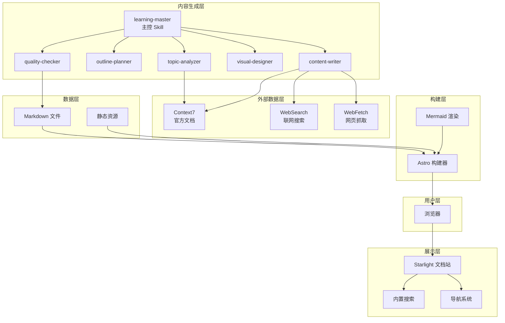
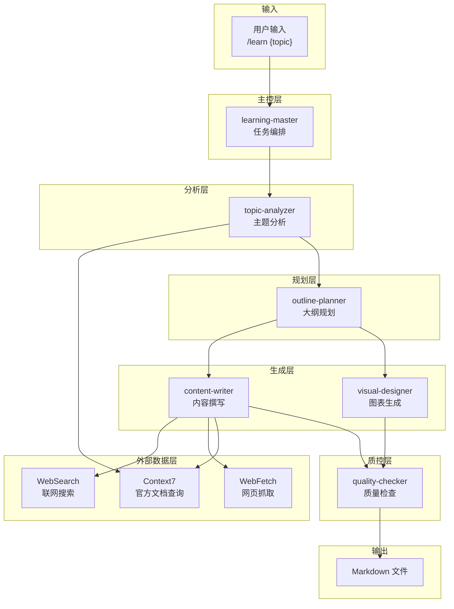
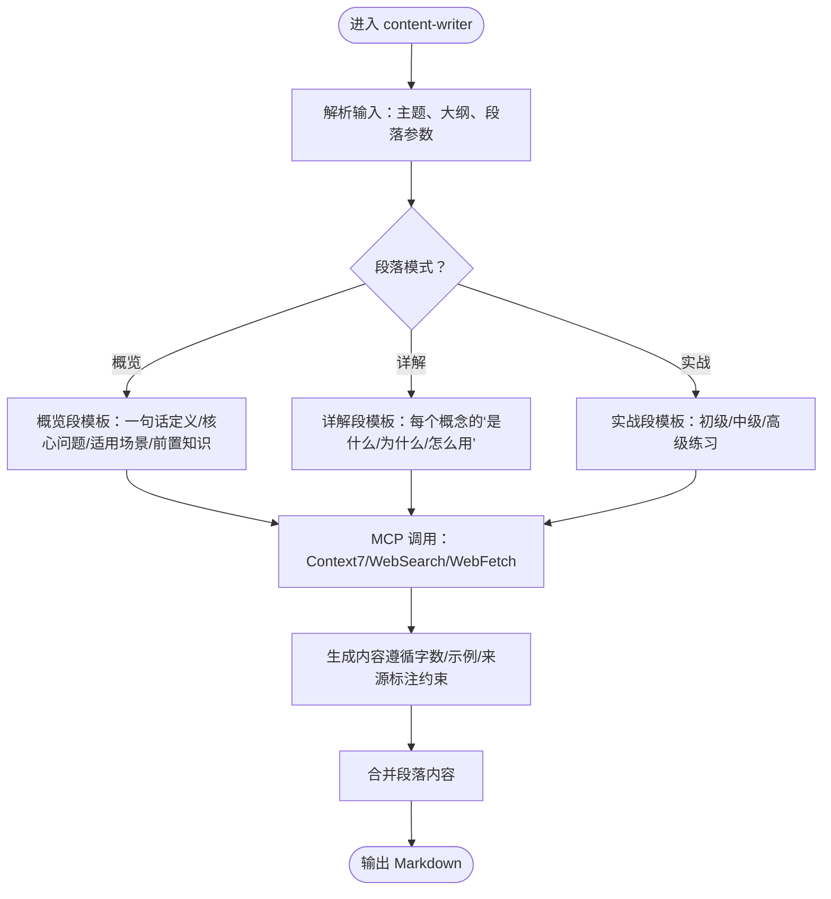
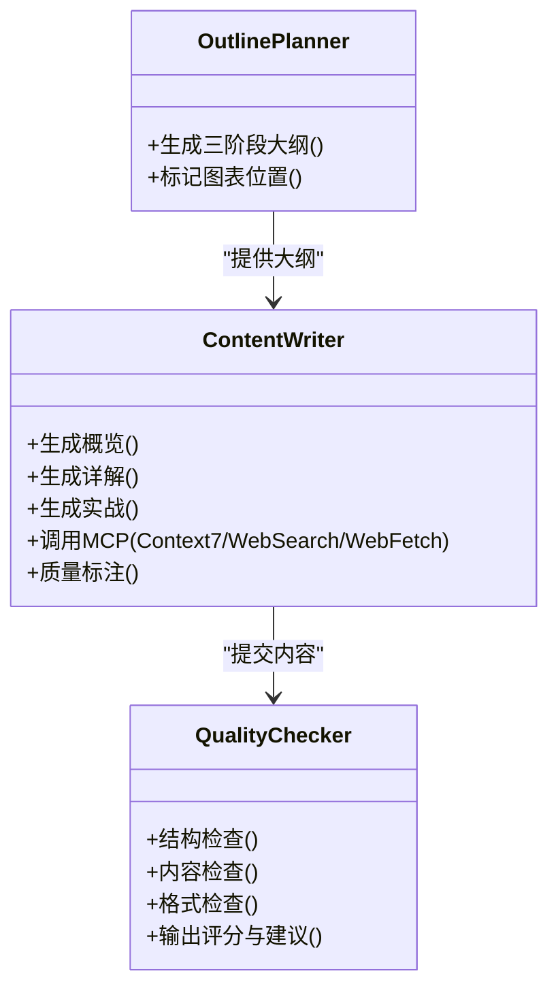
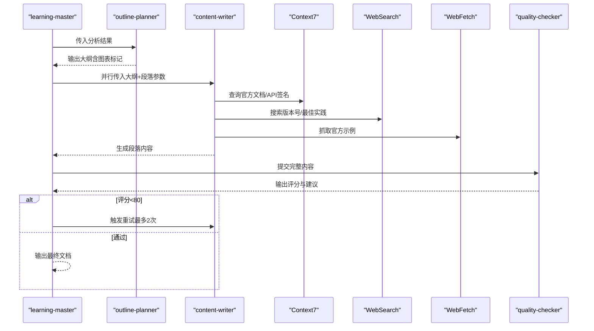
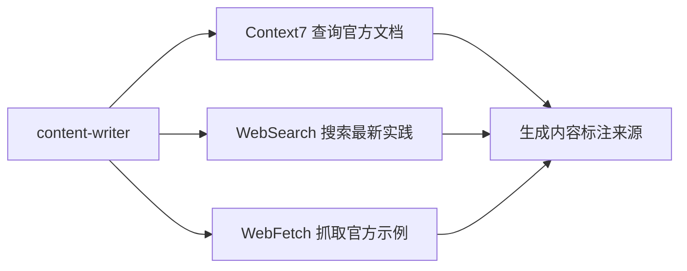
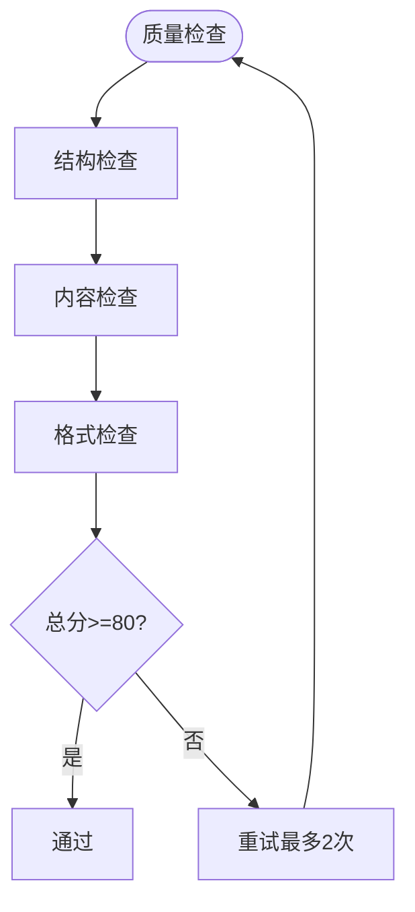
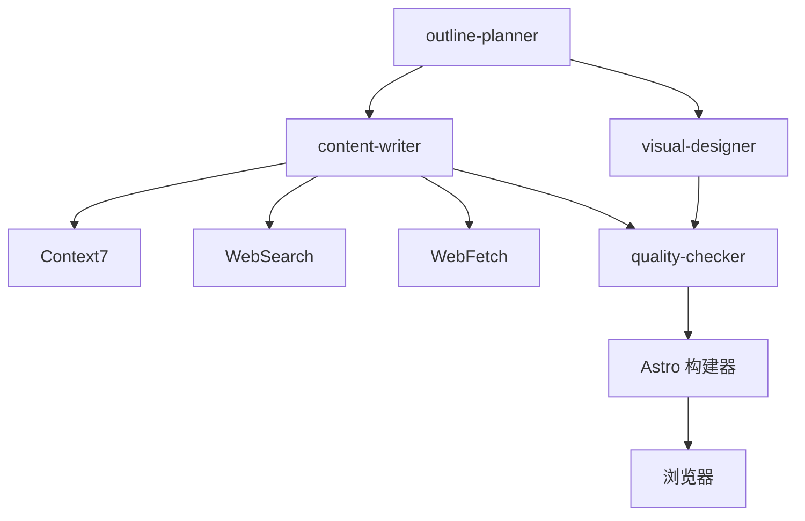

# 内容撰写器

<cite>
**本文引用的文件**
- [StudyBuddy AI 技能规格说明](file://docs/04-AI-SKILL-SPEC.md)
- [StudyBuddy 技术架构设计](file://docs/03-ARCHITECTURE.md)
- [学习方法](file://src/content/docs/methods/learning/index.md)
- [知识管理工具](file://src/content/docs/tools/knowledge/index.md)
- [后端开发](file://src/content/docs/domains/backend/index.md)
- [AI 编程工具](file://src/content/docs/tools/ai-coding/index.md)
- [思维框架](file://src/content/docs/methods/thinking/index.md)
- [内容配置](file://src/content.config.ts)
- [项目依赖](file://package.json)
</cite>

## 目录
1. [简介](#简介)
2. [项目结构](#项目结构)
3. [核心组件](#核心组件)
4. [架构总览](#架构总览)
5. [详细组件分析](#详细组件分析)
6. [依赖分析](#依赖分析)
7. [性能考量](#性能考量)
8. [故障排除指南](#故障排除指南)
9. [结论](#结论)
10. [附录](#附录)

## 简介
本文件为 StudyBuddy 项目“内容撰写器”（content-writer）的深度技术文档。内容撰写器负责依据学习主题的大纲，按“概览—详解—实战”三阶段生成高质量学习内容。文档重点阐述：
- 三阶段差异化写作策略与模板
- 写作模板系统与内容生成算法
- 上下文保持机制与多阶段内容协调
- 与外部工具（Context7、WebSearch、WebFetch）的交互协议
- 内容质量控制与个性化定制选项
- 具体写作示例与 Markdown 输出规范

## 项目结构
StudyBuddy 采用分层架构，内容生成层由多个子 Skill 协同完成，其中 content-writer 位于生成层，负责将 outline-planner 的大纲转化为 Markdown 内容，并与质量检查器协同产出最终文档。

**图示来源**
- [StudyBuddy 技术架构设计](file://docs/03-ARCHITECTURE.md#L12-L69)

**章节来源**
- [StudyBuddy 技术架构设计](file://docs/03-ARCHITECTURE.md#L1-L69)
- [内容配置](file://src/content.config.ts#L1-L8)
- [项目依赖](file://package.json#L1-L22)

## 核心组件
- 学习主控（learning-master）：协调各子 Skill，控制生成流程与重试机制。
- 主题分析（topic-analyzer）：输出主题元数据（复杂度、前置知识、核心概念等）。
- 大纲规划（outline-planner）：生成三阶段大纲（概览/详解/实战），并标记图表位置。
- 内容撰写（content-writer）：按段落生成内容，遵循三阶段模板；并行调用，支持概览、详解、实战三种模式。
- 图表生成（visual-designer）：生成 Mermaid 图表，配合大纲中的图表标记。
- 质量检查（quality-checker）：对完整内容进行评分与改进建议输出。

**章节来源**
- [StudyBuddy AI 技能规格说明](file://docs/04-AI-SKILL-SPEC.md#L19-L85)
- [StudyBuddy 技术架构设计](file://docs/03-ARCHITECTURE.md#L12-L69)

## 架构总览
content-writer 的职责是将 outline-planner 的大纲转换为 Markdown 内容，并在必要时调用外部工具获取最新信息，确保内容的时效性与准确性。其与外部工具的交互遵循严格的优先级与约束。

**图示来源**
- [StudyBuddy AI 技能规格说明](file://docs/04-AI-SKILL-SPEC.md#L23-L73)

**章节来源**
- [StudyBuddy AI 技能规格说明](file://docs/04-AI-SKILL-SPEC.md#L19-L85)

## 详细组件分析

### 组件：内容撰写器（content-writer）
- 职责：按段落生成高质量内容，遵循三阶段写作模板；并行调用，支持概览、详解、实战三种模式。
- 输入：大纲（Markdown）、段落参数（section=overview/details/practices）。
- 输出：Markdown 内容（带 Frontmatter 的文档）。
- 关键约束：
  - 概览阶段：控制字数、避免代码细节、语言风格专业但易懂。
  - 详解阶段：每个概念包含“是什么/为什么/怎么用”，提供最小可运行示例、速查表与常见陷阱；必须标注数据来源。
  - 实战阶段：难度分级（初级/中级/高级），代码量递增，包含完成标准与错误排查。
  - MCP 调用策略：Context7（官方文档）优先，其次 WebFetch（官方网站），再 WebSearch（社区资源），最后模型内置知识兜底。

**图示来源**
- [StudyBuddy AI 技能规格说明](file://docs/04-AI-SKILL-SPEC.md#L390-L531)

**章节来源**
- [StudyBuddy AI 技能规格说明](file://docs/04-AI-SKILL-SPEC.md#L390-L531)

### 写作模板系统与三阶段策略
- 概览（Overview）
  - 目标：快速建立主题认知，给出“一句话定义”“核心问题”“适用场景”“前置知识”。
  - 策略：类比解释、对比句式、场景化判断标准。
  - 字数控制：约 500 字以内。
- 详解（Details）
  - 目标：系统讲解核心概念，每个概念包含“是什么/为什么/怎么用”。
  - 策略：最小可运行示例（≤10 行）、速查表（3-5 行）、常见陷阱（≤3 个）。
  - 数据来源：必须标注（如“来源：React 官方文档 v18.2”）。
- 实战（Practices）
  - 目标：渐进式练习，验证理解、解决实际问题、掌握最佳实践。
  - 策略：难度分级（初级 10 行、中级 30 行、高级 100 行），包含完成标准与错误排查。

**图示来源**
- [StudyBuddy AI 技能规格说明](file://docs/04-AI-SKILL-SPEC.md#L390-L531)
- [StudyBuddy AI 技能规格说明](file://docs/04-AI-SKILL-SPEC.md#L609-L716)

**章节来源**
- [StudyBuddy AI 技能规格说明](file://docs/04-AI-SKILL-SPEC.md#L408-L531)

### 内容生成算法与上下文保持机制
- 算法要点
  - 段落级并行生成：content-writer 并行处理概览/详解/实战三段，减少总生成时间。
  - 概念级结构化：详解阶段对每个核心概念执行“是什么/为什么/怎么用”的三段式生成。
  - 外部数据融合：在生成前调用 MCP 获取最新 API 签名、版本号、示例代码与最佳实践。
  - 上下文保持：通过大纲与图表标记（如“<!-- DIAGRAM: mindmap -->”）确保生成内容与视觉设计衔接一致。
- 多阶段协调
  - outline-planner 输出大纲后，content-writer 读取并逐段生成；visual-designer 读取大纲中的图表标记生成 Mermaid。
  - quality-checker 对完整内容进行评分与反馈，若不通过则触发重试（最多两次）。

**图示来源**
- [StudyBuddy AI 技能规格说明](file://docs/04-AI-SKILL-SPEC.md#L609-L716)
- [StudyBuddy AI 技能规格说明](file://docs/04-AI-SKILL-SPEC.md#L777-L800)

**章节来源**
- [StudyBuddy AI 技能规格说明](file://docs/04-AI-SKILL-SPEC.md#L777-L800)

### 与外部工具的交互协议
- Context7：查询官方文档、API 参考，优先获取最权威信息。
- WebSearch：联网搜索最新资讯、最佳实践，补充参考。
- WebFetch：抓取指定网页内容（如官方教程、博客文章），确保示例代码可运行。
- 调用策略与优先级
  - 数据获取优先级：Context7 官方文档 > WebFetch 官方网站 > WebSearch 社区资源 > 模型内置知识。
  - 必须联网场景：版本号和发布日期、API 签名和参数、安装/配置命令、官方推荐的最佳实践。
  - 可用内置知识场景：概念解释和类比、通用设计模式、不涉及版本的原理说明。

**图示来源**
- [StudyBuddy AI 技能规格说明](file://docs/04-AI-SKILL-SPEC.md#L86-L126)

**章节来源**
- [StudyBuddy AI 技能规格说明](file://docs/04-AI-SKILL-SPEC.md#L86-L126)

### 内容质量控制与个性化定制
- 质量检查维度
  - 结构检查（30 分）：三阶段完整、每概念三要素齐全、难度分级清晰。
  - 内容检查（40 分）：定义通俗、类比恰当、示例可运行、速查表实用。
  - 格式检查（30 分）：Markdown 语法正确、表格规范、Mermaid 可渲染。
- 评分标准
  - 90-100：优秀，可直接发布。
  - 80-89：良好，小问题可接受。
  - 70-79：一般，需要修改。
  - <70：不合格，需重新生成。
- 个性化定制
  - 主题复杂度（beginner/intermediate/advanced）影响内容深度与时长。
  - 分类（domains/methods/tools）决定内容侧重点与示例方向。
  - 图表类型（mindmap/flowchart/classDiagram/sequenceDiagram）由 visual-designer 根据大纲自动生成。

**图示来源**
- [StudyBuddy AI 技能规格说明](file://docs/04-AI-SKILL-SPEC.md#L609-L716)

**章节来源**
- [StudyBuddy AI 技能规格说明](file://docs/04-AI-SKILL-SPEC.md#L609-L716)

### 写作示例与 Markdown 输出规范
- 示例参考
  - 学习方法：[学习方法](file://src/content/docs/methods/learning/index.md#L1-L7)
  - 知识管理工具：[知识管理工具](file://src/content/docs/tools/knowledge/index.md#L1-L7)
  - 后端开发：[后端开发](file://src/content/docs/domains/backend/index.md#L1-L7)
  - AI 编程工具：[AI 编程工具](file://src/content/docs/tools/ai-coding/index.md#L1-L7)
  - 思维框架：[思维框架](file://src/content/docs/methods/thinking/index.md#L1-L7)
- 输出规范
  - Frontmatter：包含标题、描述、分类、难度、标签、时长等元信息。
  - 正文：按三阶段组织，使用标题层级与列表；图表位置以“<!-- DIAGRAM: type -->”标记。
  - 代码块：示例代码必须可运行，标注数据来源；表格对齐、无空列。
  - Mermaid：图表语法正确，节点文字简洁，层级适中。

**章节来源**
- [StudyBuddy AI 技能规格说明](file://docs/04-AI-SKILL-SPEC.md#L291-L344)
- [学习方法](file://src/content/docs/methods/learning/index.md#L1-L7)
- [知识管理工具](file://src/content/docs/tools/knowledge/index.md#L1-L7)
- [后端开发](file://src/content/docs/domains/backend/index.md#L1-L7)
- [AI 编程工具](file://src/content/docs/tools/ai-coding/index.md#L1-L7)
- [思维框架](file://src/content/docs/methods/thinking/index.md#L1-L7)

## 依赖分析
- 外部工具依赖
  - Context7：官方文档查询，确保 API 签名与参数准确。
  - WebSearch：社区资源与最新实践，补充参考。
  - WebFetch：官方示例与教程，保证示例可运行。
- 内部组件耦合
  - content-writer 与 outline-planner 强耦合（读取大纲与图表标记）。
  - content-writer 与 quality-checker 弱耦合（单向输出内容）。
  - visual-designer 与 outline-planner 弱耦合（读取大纲中的图表标记）。
- 外部依赖
  - Astro 构建器与 Starlight 文档站负责页面渲染与搜索。
  - Mermaid 渲染器负责图表可视化。

**图示来源**
- [StudyBuddy 技术架构设计](file://docs/03-ARCHITECTURE.md#L12-L69)
- [StudyBuddy AI 技能规格说明](file://docs/04-AI-SKILL-SPEC.md#L86-L126)

**章节来源**
- [StudyBuddy 技术架构设计](file://docs/03-ARCHITECTURE.md#L12-L69)
- [项目依赖](file://package.json#L12-L20)

## 性能考量
- 并行生成：content-writer 并行处理三段内容，缩短总生成时间。
- 外部调用优化：合理选择 MCP 工具与调用时机，避免重复请求；对可缓存的数据（如通用概念解释）尽量使用模型内置知识。
- 内容长度控制：概览与详解阶段严格控制字数与示例规模，减少生成负担。
- 质量前置：通过质量检查提前发现格式与逻辑问题，减少返工。

## 故障排除指南
- 内容质量不达标（评分 < 80）
  - 检查是否满足三阶段结构、每概念三要素、难度分级清晰。
  - 检查示例代码是否可运行、速查表是否实用、Mermaid 语法是否正确。
  - 根据建议进行修改并重新生成（最多两次）。
- 图表渲染失败
  - 简化图表结构，确保节点文字简洁、层级适中。
  - 检查 Mermaid 语法，确保可直接渲染。
- 外部工具调用失败
  - 优先使用 Context7 获取权威信息；若失败，回退至 WebFetch 或 WebSearch。
  - 对必须联网的场景（版本号、API 参数、安装命令、官方推荐写法）务必联网获取。

**章节来源**
- [StudyBuddy AI 技能规格说明](file://docs/04-AI-SKILL-SPEC.md#L777-L800)
- [StudyBuddy AI 技能规格说明](file://docs/04-AI-SKILL-SPEC.md#L609-L716)

## 结论
content-writer 通过三阶段写作模板与严格的 MCP 调用策略，确保生成内容具备“时效性、准确性、可读性与可操作性”。结合并行生成、上下文保持与质量检查机制，能够稳定产出高质量学习文档。建议在实际使用中：
- 明确主题复杂度与分类，合理设置难度与时长；
- 严格遵循“是什么/为什么/怎么用”的概念讲解结构；
- 在实战阶段提供明确的完成标准与错误排查；
- 注重数据来源标注与图表一致性，提升内容可信度与可检索性。

## 附录
- 示例文档路径
  - [学习方法](file://src/content/docs/methods/learning/index.md#L1-L7)
  - [知识管理工具](file://src/content/docs/tools/knowledge/index.md#L1-L7)
  - [后端开发](file://src/content/docs/domains/backend/index.md#L1-L7)
  - [AI 编程工具](file://src/content/docs/tools/ai-coding/index.md#L1-L7)
  - [思维框架](file://src/content/docs/methods/thinking/index.md#L1-L7)
- 配置与构建
  - [内容配置](file://src/content.config.ts#L1-L8)
  - [项目依赖](file://package.json#L1-L22)