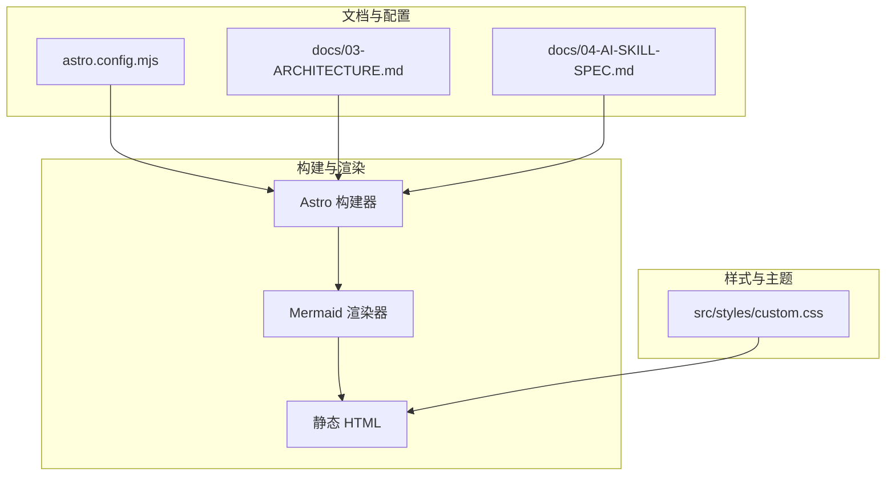
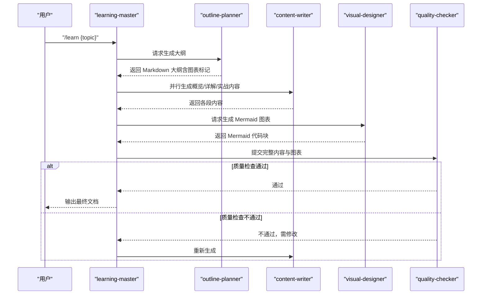
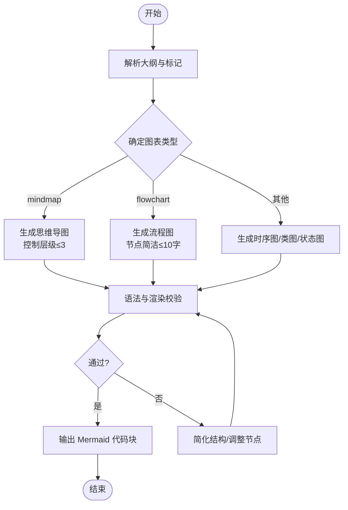
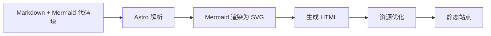
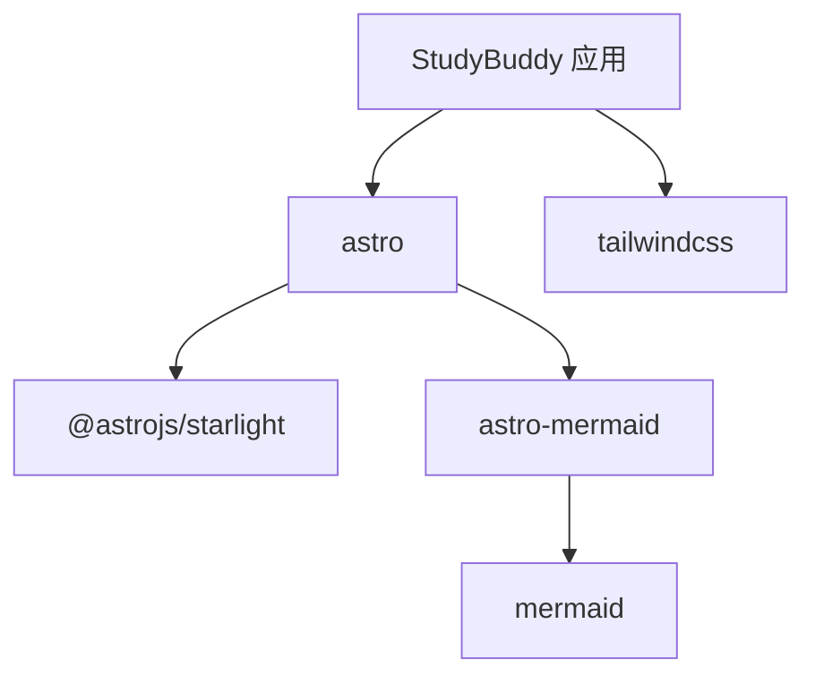

# 图表设计师

<cite>
**本文引用的文件**
- [docs/04-AI-SKILL-SPEC.md](file://docs/04-AI-SKILL-SPEC.md)
- [docs/03-ARCHITECTURE.md](file://docs/03-ARCHITECTURE.md)
- [astro.config.mjs](file://astro.config.mjs)
- [src/styles/custom.css](file://src/styles/custom.css)
- [package.json](file://package.json)
- [package-lock.json](file://package-lock.json)
</cite>

## 目录
1. [简介](#简介)
2. [项目结构](#项目结构)
3. [核心组件](#核心组件)
4. [架构总览](#架构总览)
5. [详细组件分析](#详细组件分析)
6. [依赖分析](#依赖分析)
7. [性能考量](#性能考量)
8. [故障排查指南](#故障排查指南)
9. [结论](#结论)
10. [附录](#附录)

## 简介
图表设计师（visual-designer）是 StudyBuddy AI 技能体系中的一个专用子技能，负责根据学习主题与大纲生成 Mermaid 可视化图表。其职责包括：
- 依据大纲中标记的图表位置，生成思维导图、流程图等图表；
- 保证图表语法正确、节点简洁、层级合理；
- 输出可直接在文档中渲染的 Mermaid 代码块。

图表设计师与学习主控（learning-master）协作，作为内容生成流水线中的“可视化增强”环节，最终由质量检查（quality-checker）校验 Mermaid 语法与渲染一致性。

## 项目结构
StudyBuddy 采用 Astro + Starlight + Mermaid 的技术栈，Mermaid 通过 Astro 集成插件进行渲染。图表设计师生成的 Mermaid 代码嵌入在 Markdown 中，构建阶段由 Astro 解析并渲染为 SVG。

**图表来源**
- [astro.config.mjs](file://astro.config.mjs#L1-L39)
- [docs/03-ARCHITECTURE.md](file://docs/03-ARCHITECTURE.md#L128-L160)
- [src/styles/custom.css](file://src/styles/custom.css#L315-L328)

**章节来源**
- [astro.config.mjs](file://astro.config.mjs#L1-L39)
- [docs/03-ARCHITECTURE.md](file://docs/03-ARCHITECTURE.md#L1-L200)
- [src/styles/custom.css](file://src/styles/custom.css#L315-L328)

## 核心组件
- Mermaid 集成与渲染
  - 通过 Astro 集成 astro-mermaid，并在 Markdown 中启用 remark-mermaid 插件，使 Mermaid 代码块在构建时被解析并渲染为 SVG。
  - 支持的图表类型包括：思维导图、流程图、时序图、类图、状态图等。
- 图表生成约束
  - 每个主题至少生成 2 个图表；
  - 节点文字简洁（不超过 10 字）；
  - 避免过深的层级（思维导图最多 3 层）；
  - 确保语法正确，可直接渲染。
- 图表类型规范
  - 思维导图：用于概览章节，展示知识体系全貌；
  - 流程图：用于详解或实战章节，展示使用步骤或决策流程；
  - 时序图、类图、状态图：用于更复杂的交互或结构表达（在架构文档中列出）。

**章节来源**
- [docs/04-AI-SKILL-SPEC.md](file://docs/04-AI-SKILL-SPEC.md#L535-L605)
- [docs/03-ARCHITECTURE.md](file://docs/03-ARCHITECTURE.md#L244-L274)

## 架构总览
图表设计师在整个内容生成流水线中承担“可视化增强”的角色，与学习主控、主题分析、大纲规划、内容撰写、质量检查协同工作。

**图表来源**
- [docs/03-ARCHITECTURE.md](file://docs/03-ARCHITECTURE.md#L82-L126)
- [docs/04-AI-SKILL-SPEC.md](file://docs/04-AI-SKILL-SPEC.md#L719-L760)

## 详细组件分析

### 图表生成算法与流程
- 输入
  - 主题：{{topic}}
  - 大纲：{{outline}}
  - 图表位置标记：{{diagram_markers}}（例如 <!-- DIAGRAM: mindmap -->）
- 处理
  - 解析大纲中的图表标记，确定生成图表的位置与类型；
  - 基于主题与关键概念，构造节点与连接关系；
  - 控制节点数量与层级，确保简洁与可读性；
  - 生成 Mermaid 代码块，附带用途注释。
- 输出
  - Mermaid 代码数组，供质量检查与后续渲染使用。

**图表来源**
- [docs/04-AI-SKILL-SPEC.md](file://docs/04-AI-SKILL-SPEC.md#L564-L605)

**章节来源**
- [docs/04-AI-SKILL-SPEC.md](file://docs/04-AI-SKILL-SPEC.md#L535-L605)

### 图表类型映射规则
- 思维导图（mindmap）
  - 用途：概览章节，展示知识体系全貌；
  - 生成要点：根节点为主题，子节点为核心概念，层级不超过 3。
- 流程图（flowchart）
  - 用途：详解或实战章节，展示使用步骤或决策流程；
  - 生成要点：节点简洁，连接清晰，分支明确。
- 时序图（sequenceDiagram）、类图（classDiagram）、状态图（stateDiagram-v2）
  - 用途：交互过程、API 调用、数据结构、生命周期等；
  - 生成要点：遵循 Mermaid 语法，节点与关系语义清晰。

**章节来源**
- [docs/04-AI-SKILL-SPEC.md](file://docs/04-AI-SKILL-SPEC.md#L545-L553)
- [docs/03-ARCHITECTURE.md](file://docs/03-ARCHITECTURE.md#L266-L274)

### 样式定制与交互设计原则
- 样式定制
  - Mermaid 图表容器具备统一的背景、圆角、阴影与边框，适配浅色与深色主题；
  - 图表区域在深色主题下保持高对比度，确保可读性。
- 交互设计原则
  - 图表应与上下文紧密结合，提供“即时理解”的视觉辅助；
  - 节点文字简洁，避免冗长标签；
  - 图表数量适度，避免信息过载。

**章节来源**
- [src/styles/custom.css](file://src/styles/custom.css#L315-L328)

### 与 Mermaid 集成的技术实现细节
- Astro 配置
  - 引入 astro-mermaid 集成，启用 Mermaid 渲染；
  - 在 Markdown 中启用 remark-mermaid 插件，使代码块被解析为 SVG。
- 构建流程
  - Astro 解析 Markdown，渲染 Mermaid，生成 HTML；
  - 自定义 CSS 与主题变量共同作用，确保图表在不同主题下的显示一致性。

**图表来源**
- [astro.config.mjs](file://astro.config.mjs#L1-L39)
- [docs/03-ARCHITECTURE.md](file://docs/03-ARCHITECTURE.md#L128-L160)

**章节来源**
- [astro.config.mjs](file://astro.config.mjs#L1-L39)
- [docs/03-ARCHITECTURE.md](file://docs/03-ARCHITECTURE.md#L244-L264)

### 图表生成示例（路径指引）
- 思维导图示例
  - 位置：[docs/04-AI-SKILL-SPEC.md](file://docs/04-AI-SKILL-SPEC.md#L574-L583)
- 流程图示例
  - 位置：[docs/04-AI-SKILL-SPEC.md](file://docs/04-AI-SKILL-SPEC.md#L588-L595)

## 依赖分析
- 核心依赖
  - astro：静态站点生成器；
  - @astrojs/starlight：文档主题；
  - astro-mermaid：Mermaid 渲染集成；
  - mermaid：Mermaid 核心库；
  - tailwindcss：样式框架。
- 版本与锁定
  - 依赖版本在 package.json 与 package-lock.json 中明确记录，确保构建一致性。

**图表来源**
- [package.json](file://package.json#L12-L18)
- [package-lock.json](file://package-lock.json#L10-L18)

**章节来源**
- [package.json](file://package.json#L1-L19)
- [package-lock.json](file://package-lock.json#L1-L39)

## 性能考量
- 构建优化
  - Astro 默认支持增量构建，减少重复构建时间；
  - 图片优化与代码分割进一步降低首屏加载与传输成本。
- 运行时优化
  - 静态生成零运行时 JS；
  - Mermaid 图表可结合懒加载策略（如 Intersection Observer）提升首屏性能。

**章节来源**
- [docs/03-ARCHITECTURE.md](file://docs/03-ARCHITECTURE.md#L366-L382)

## 故障排查指南
- Mermaid 语法错误
  - 症状：图表无法渲染或报错；
  - 处理：简化节点层级与连接关系，确保语法正确；
  - 参考：图表生成约束（节点长度、层级限制、语法正确性）。
- 渲染不一致
  - 症状：不同环境下显示差异；
  - 处理：检查自定义样式覆盖与主题变量，确保深色/浅色主题一致；
  - 参考：Mermaid 图表样式定义。
- 构建失败
  - 症状：构建阶段报错；
  - 处理：确认 astro.config.mjs 中的 Mermaid 集成与插件配置正确；
  - 参考：Mermaid 集成配置与构建流程。

**章节来源**
- [docs/04-AI-SKILL-SPEC.md](file://docs/04-AI-SKILL-SPEC.md#L597-L605)
- [src/styles/custom.css](file://src/styles/custom.css#L315-L328)
- [astro.config.mjs](file://astro.config.mjs#L1-L39)
- [docs/03-ARCHITECTURE.md](file://docs/03-ARCHITECTURE.md#L128-L160)

## 结论
图表设计师通过严格的图表类型规范与生成约束，确保 Mermaid 图表在 StudyBuddy 文档中高效、一致地呈现。配合 Astro 的 Mermaid 集成与主题样式，实现了从生成到渲染的完整链路。未来可在以下方面持续优化：
- 增强图表类型扩展（如甘特图、饼图等）；
- 引入图表模板库，提升生成复用性；
- 加强交互式图表能力（如点击跳转、悬停提示）。

## 附录
- Mermaid 支持的图表类型
  - 思维导图：mindmap
  - 流程图：flowchart
  - 时序图：sequenceDiagram
  - 类图：classDiagram
  - 状态图：stateDiagram-v2

**章节来源**
- [docs/03-ARCHITECTURE.md](file://docs/03-ARCHITECTURE.md#L266-L274)