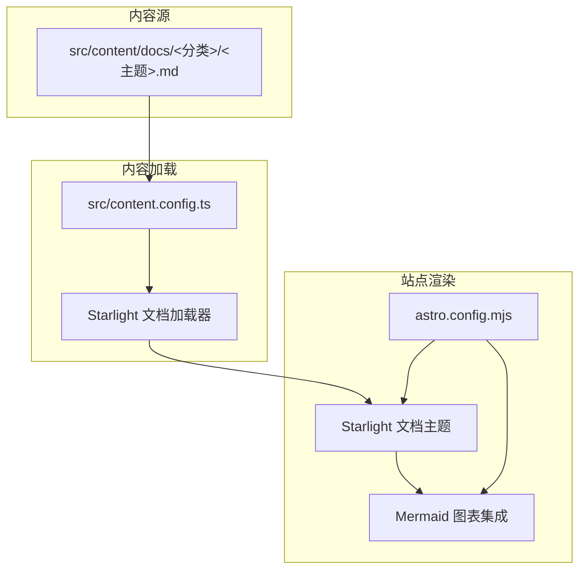
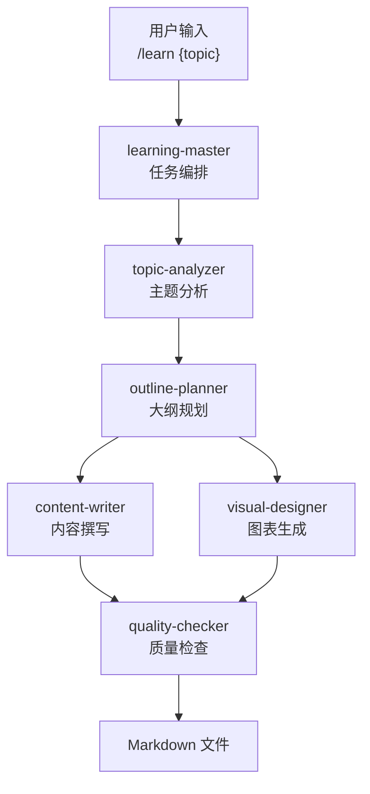
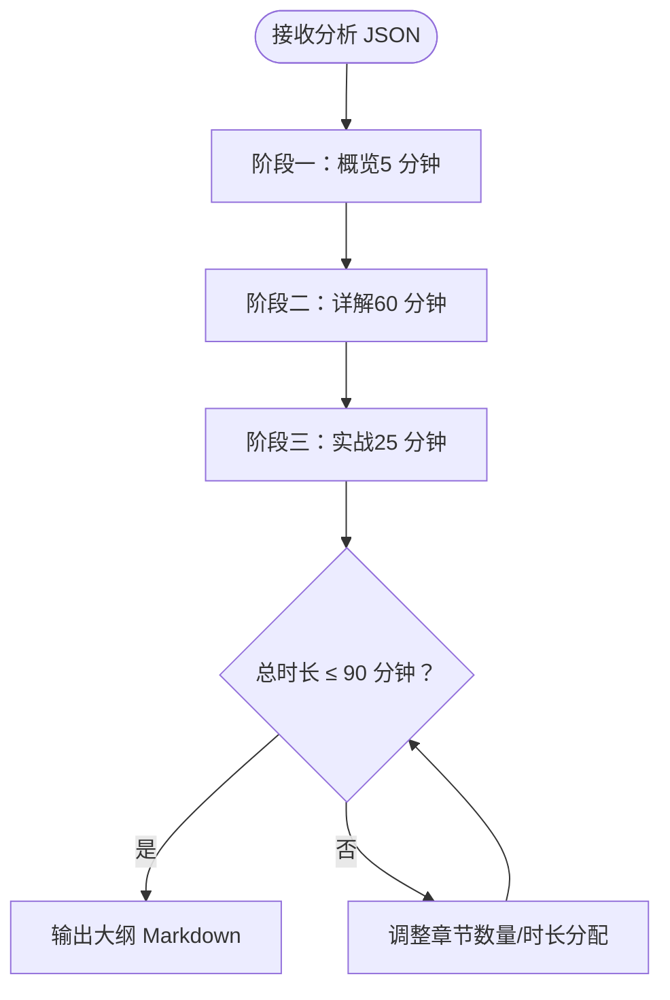
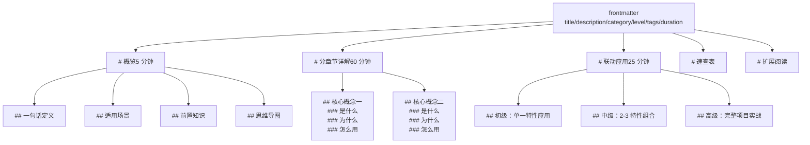
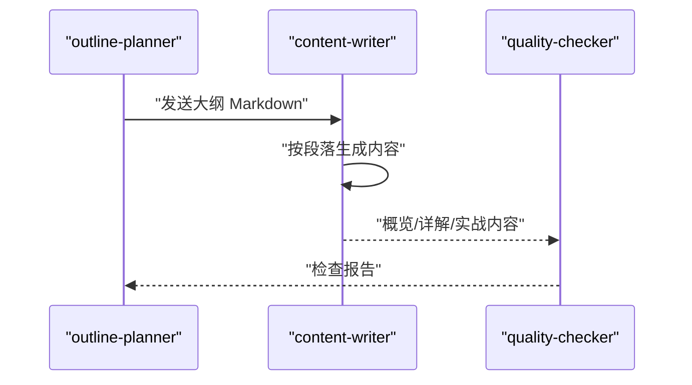
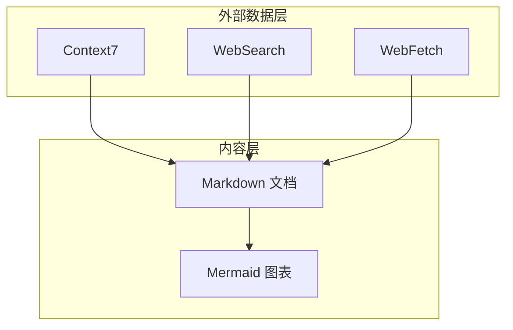

# 大纲规划器

<cite>
**本文引用的文件**
- [StudyBuddy AI 技能规格说明](file://docs/04-AI-SKILL-SPEC.md)
- [项目简介](file://docs/01-PROJECT-BRIEF.md)
- [Astro 配置](file://astro.config.mjs)
- [内容配置](file://src/content.config.ts)
- [前端域索引示例](file://src/content/docs/domains/frontend/index.md)
</cite>

## 目录
1. [简介](#简介)
2. [项目结构](#项目结构)
3. [核心组件](#核心组件)
4. [架构总览](#架构总览)
5. [详细组件分析](#详细组件分析)
6. [依赖分析](#依赖分析)
7. [性能考量](#性能考量)
8. [故障排除指南](#故障排除指南)
9. [结论](#结论)
10. [附录](#附录)

## 简介
大纲规划器（outline-planner）是 StudyBuddy AI 技能体系中的第三子技能，负责将主题分析结果转化为符合“三阶段学习框架”的结构化大纲。其职责包括：
- 基于分析 JSON 生成带 frontmatter 的 Markdown 大纲
- 设计概览、详解、实战三个阶段的章节结构与时间分配
- 统一章节层级与内容组织策略，确保内容平衡与可执行性
- 与内容撰写技能（content-writer）进行数据传递，提供大纲模板作为输入

大纲规划器遵循 StudyBuddy 的“管理者视角”理念，强调“应用场景判断”“知识体系构建”和“快速检索”，通过三阶段框架帮助用户从宏观到微观再到实战地掌握知识。

**章节来源**
- [StudyBuddy AI 技能规格说明](file://docs/04-AI-SKILL-SPEC.md#L281-L386)
- [项目简介](file://docs/01-PROJECT-BRIEF.md#L1-L124)

## 项目结构
本项目采用 Astro + Starlight 的静态站点架构，内容通过 Astro 的内容集合加载。大纲规划器输出的 Markdown 文件将被内容加载器解析并渲染为文档页面。

**图表来源**
- [内容配置](file://src/content.config.ts#L1-L8)
- [Astro 配置](file://astro.config.mjs#L1-L39)

**章节来源**
- [内容配置](file://src/content.config.ts#L1-L8)
- [Astro 配置](file://astro.config.mjs#L1-L39)

## 核心组件
- 大纲规划器（outline-planner）
  - 输入：主题分析 JSON（analysis_json）
  - 输出：带 frontmatter 的 Markdown 大纲（包含概览、详解、实战、速查表、扩展阅读等）
  - 约束：概览约 5 分钟、详解每概念约 10 分钟、总时长不超过 90 分钟
- 内容撰写（content-writer）
  - 输入：大纲 Markdown + 段落标识（overview/details/practices）
  - 输出：对应段落的 Markdown 内容
- 图表生成（visual-designer）
  - 输入：大纲 Markdown
  - 输出：Mermaid 图表代码（思维导图、流程图等）

**章节来源**
- [StudyBuddy AI 技能规格说明](file://docs/04-AI-SKILL-SPEC.md#L281-L386)
- [StudyBuddy AI 技能规格说明](file://docs/04-AI-SKILL-SPEC.md#L390-L531)
- [StudyBuddy AI 技能规格说明](file://docs/04-AI-SKILL-SPEC.md#L535-L610)

## 架构总览
大纲规划器在整个 AI 技能体系中承担“规划层”的角色，承接主题分析结果，输出结构化大纲，供内容撰写与图表生成并行消费。

**图表来源**
- [StudyBuddy AI 技能规格说明](file://docs/04-AI-SKILL-SPEC.md#L19-L73)

**章节来源**
- [StudyBuddy AI 技能规格说明](file://docs/04-AI-SKILL-SPEC.md#L19-L73)

## 详细组件分析

### 大纲生成算法与阶段划分
大纲规划器的核心算法围绕“三阶段学习框架”展开，结合分析 JSON 的主题复杂度与知识结构，动态确定章节数量与时间分配，并保证总时长不超过 90 分钟。

- 阶段一：概览（约 5 分钟）
  - 目标：建立全局认知，明确“是什么”“为什么”“何时用”
  - 内容要素：一句话定义、核心问题、适用场景（3-5 个）、前置知识、思维导图占位
- 阶段二：分章节详解（约 60 分钟）
  - 目标：拆解核心概念，建立“最小可用理解”
  - 结构：每个概念包含“是什么（定义+类比）”“为什么（痛点）”“怎么用（最小示例+速查表）”
  - 时间控制：每个概念约 10 分钟
- 阶段三：联动应用（约 25 分钟）
  - 目标：从单一特性到项目实战，强化迁移能力
  - 结构：初级（单一特性，5 分钟）、中级（2-3 特性组合，15 分钟）、高级（完整项目+最佳实践，30 分钟）

**图表来源**
- [StudyBuddy AI 技能规格说明](file://docs/04-AI-SKILL-SPEC.md#L359-L386)

**章节来源**
- [StudyBuddy AI 技能规格说明](file://docs/04-AI-SKILL-SPEC.md#L281-L386)

### 大纲模板格式与 Markdown 输出结构
大纲模板采用带 frontmatter 的 Markdown 格式，确保内容加载器可正确解析分类、标签、时长等元数据，并通过章节层级与占位符标记图表位置。

- Frontmatter 字段
  - title：学习主题
  - description：主题简述
  - category：分类（如 domains/frontend）
  - level：难度（beginner/intermediate/advanced）
  - tags：关键词数组
  - duration：总时长（分钟）
- 章节层级
  - 概览（一级标题）
  - 分章节详解（二级标题；每个核心概念三级标题）
  - 联动应用（二级标题；初级/中级/高级三级标题）
  - 速查表、扩展阅读（二级标题）
- 图表占位
  - 使用“<!-- DIAGRAM: 类型 -->”标记图表插入位置（如 mindmap、flowchart）

**图表来源**
- [StudyBuddy AI 技能规格说明](file://docs/04-AI-SKILL-SPEC.md#L293-L344)

**章节来源**
- [StudyBuddy AI 技能规格说明](file://docs/04-AI-SKILL-SPEC.md#L291-L344)

### 学习路径设计原则与内容组织策略
- 渐进式学习路径
  - 从“是什么”到“为什么”再到“怎么用”，最后到“如何组合应用”
- 场景驱动
  - 每个场景给出判断标准，帮助用户在真实情境中做出选择
- 时间预算与容量控制
  - 严格控制各阶段时长，避免信息过载
- 可检索的知识结构
  - 通过统一的章节层级与速查表，便于后续复习与检索

**章节来源**
- [StudyBuddy AI 技能规格说明](file://docs/04-AI-SKILL-SPEC.md#L359-L386)

### 与内容撰写技能的数据传递格式
- 传递点
  - Planner → Writer：Markdown 大纲模板
  - Writer → Checker：段落内容（概览/详解/实战）
- 数据格式约定
  - 大纲：Markdown（含 frontmatter 与章节层级）
  - 段落内容：Markdown（按概览/详解/实战分别生成）

**图表来源**
- [StudyBuddy AI 技能规格说明](file://docs/04-AI-SKILL-SPEC.md#L723-L760)

**章节来源**
- [StudyBuddy AI 技能规格说明](file://docs/04-AI-SKILL-SPEC.md#L762-L773)

### 示例：从分析结果到最终大纲的转换
- 输入：主题分析 JSON（包含主题、复杂度、核心概念、适用场景等）
- 处理：根据三阶段框架生成大纲模板，填充 frontmatter 与章节占位
- 输出：Markdown 大纲文件，保存至内容目录，等待内容撰写与图表生成

**图表来源**
- [StudyBuddy AI 技能规格说明](file://docs/04-AI-SKILL-SPEC.md#L293-L344)

**章节来源**
- [StudyBuddy AI 技能规格说明](file://docs/04-AI-SKILL-SPEC.md#L291-L344)

## 依赖分析
- 外部数据层（MCP）
  - Context7：查询官方文档、API 参考（用于内容撰写阶段）
  - WebSearch：联网搜索最新资讯、最佳实践（用于内容撰写实战段）
  - WebFetch：抓取指定网页内容（用于获取官方教程、示例）
- 内容加载与渲染
  - Starlight 文档加载器与内容集合配置
  - Mermaid 图表集成，支持在 Markdown 中直接渲染思维导图与流程图

**图表来源**
- [StudyBuddy AI 技能规格说明](file://docs/04-AI-SKILL-SPEC.md#L86-L95)
- [Astro 配置](file://astro.config.mjs#L1-L39)

**章节来源**
- [StudyBuddy AI 技能规格说明](file://docs/04-AI-SKILL-SPEC.md#L86-L95)
- [Astro 配置](file://astro.config.mjs#L1-L39)

## 性能考量
- 生成时间控制：整体生成时间应控制在 30 秒以内
- 质量门槛：质量检查评分需达到 80 分以上方可输出
- 失败重试：若不通过，最多允许两次重试
- 超时回退：若超过 60 秒，返回部分结果

**章节来源**
- [StudyBuddy AI 技能规格说明](file://docs/04-AI-SKILL-SPEC.md#L198-L202)
- [StudyBuddy AI 技能规格说明](file://docs/04-AI-SKILL-SPEC.md#L777-L800)

## 故障排除指南
- 分析失败
  - 症状：主题过于模糊导致分析 JSON 不完整
  - 处理：提示用户细化主题后重试
- 大纲不完整
  - 症状：缺少必要章节或时间分配不合理
  - 处理：自动补充缺失章节并重新平衡时长
- 内容质量低
  - 症状：质量检查评分低于 80
  - 处理：触发重试机制，最多两次；仍失败则人工介入
- 图表语法错误
  - 症状：Mermaid 解析失败
  - 处理：简化图表结构后重试
- 超时
  - 症状：生成时间超过 60 秒
  - 处理：返回部分结果，提示用户稍后完善

**章节来源**
- [StudyBuddy AI 技能规格说明](file://docs/04-AI-SKILL-SPEC.md#L777-L800)

## 结论
大纲规划器通过严格的三阶段框架与统一的模板格式，将主题分析结果转化为可执行、可扩展、可检索的学习大纲。配合内容撰写与图表生成技能，形成高效、一致的 AI 生成工作流，满足 StudyBuddy “管理者视角”的学习目标。

## 附录
- 使用示例
  - 基础调用：/learn Docker
  - 高级调用：/learn Kubernetes --category=tools --level=advanced
- 输出路径
  - 文档保存至 src/content/docs/{category}/{slug}.md

**章节来源**
- [StudyBuddy AI 技能规格说明](file://docs/04-AI-SKILL-SPEC.md#L804-L833)
- [前端域索引示例](file://src/content/docs/domains/frontend/index.md#L1-L7)