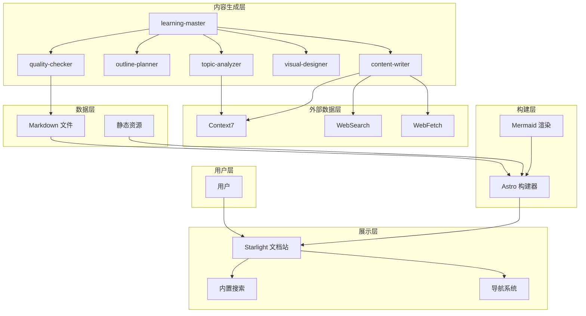
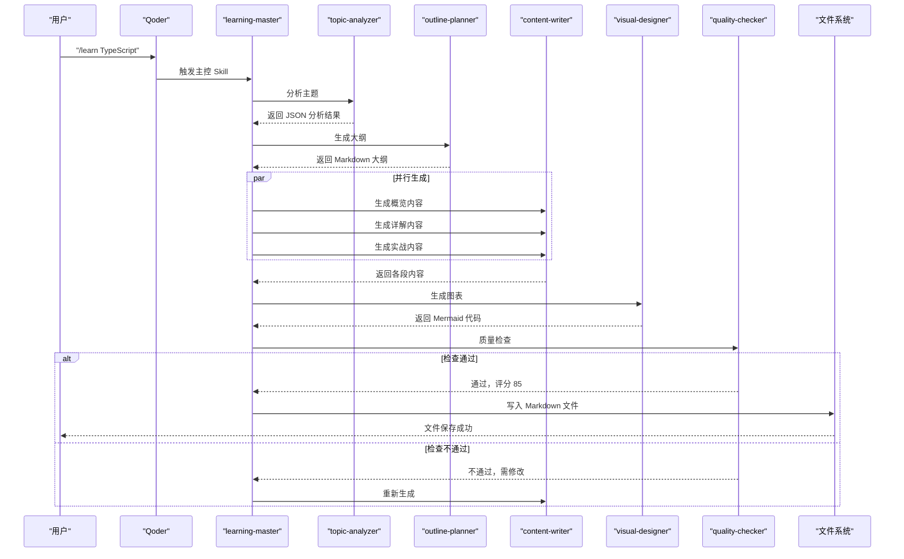
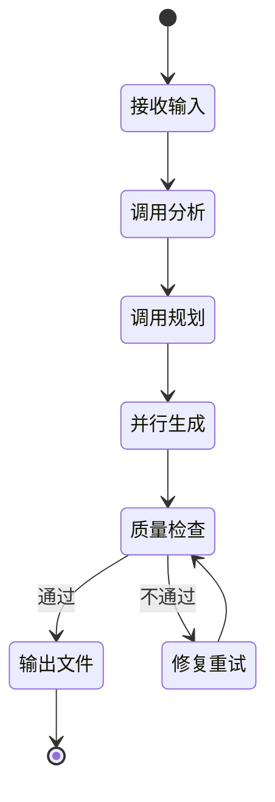
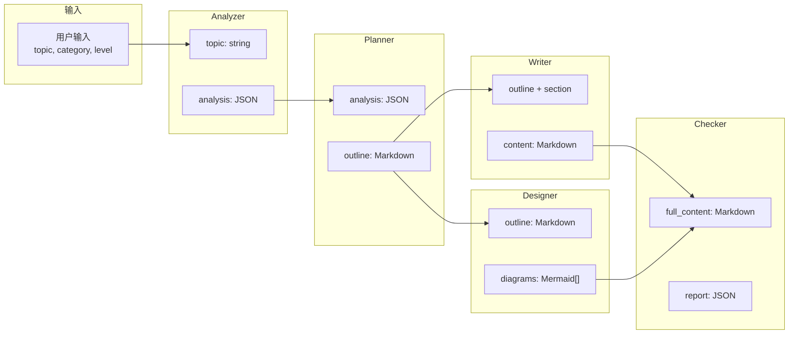
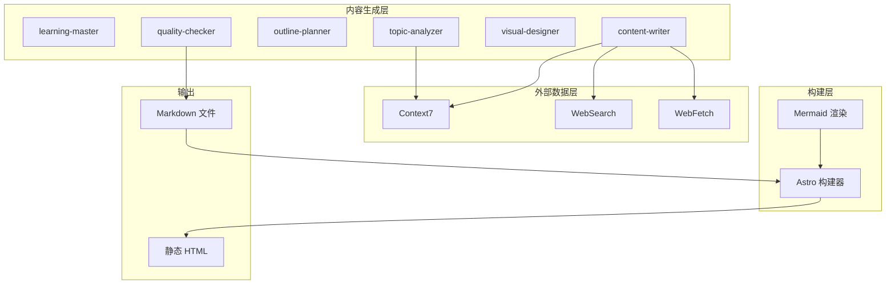
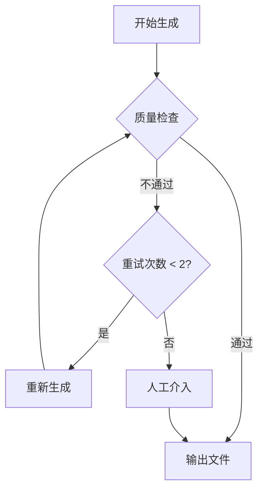

# 文档生成工作流

<cite>
**本文引用的文件**
- [项目简介](file://docs/01-PROJECT-BRIEF.md)
- [技术架构设计](file://docs/03-ARCHITECTURE.md)
- [AI Skill 规格说明](file://docs/04-AI-SKILL-SPEC.md)
- [package.json](file://package.json)
</cite>

## 目录
1. [引言](#引言)
2. [项目结构](#项目结构)
3. [核心组件](#核心组件)
4. [架构总览](#架构总览)
5. [详细组件分析](#详细组件分析)
6. [依赖分析](#依赖分析)
7. [性能考量](#性能考量)
8. [故障排除指南](#故障排除指南)
9. [结论](#结论)
10. [附录](#附录)

## 引言
本文件面向 StudyBuddy 项目的“文档生成工作流”，系统化阐述从用户输入到最终文档输出的完整流程。重点说明 learning-master 主控协调器如何调度 topic-analyzer、outline-planner、content-writer、visual-designer、quality-checker 等 AI Skill，并详细描述并行生成机制、组件协作关系、数据传递格式、处理逻辑与错误处理机制。文档同时提供时序图与数据流图，帮助读者快速理解端到端工作流。

## 项目结构
StudyBuddy 采用 Astro + Starlight 的静态站点架构，结合 Qoder Skills 的多代理协作能力，形成“主题输入 → 多 Skill 并行生成 → 质量检查 → 文件落地”的闭环。项目关键目录与职责如下：
- docs：项目文档与规格说明，包含工作流与 Skill 设计
- src/content/docs：学习文档内容（Markdown），作为生成目标
- public：静态资源
- .qoder/skills：AI Skill 定义与协作规范（当前仓库未包含具体 Skill 实现文件）
- astro.config.mjs：Astro 构建配置（Mermaid 集成等）
- package.json：依赖与脚本

**图示来源**
- [技术架构设计](file://docs/03-ARCHITECTURE.md#L12-L69)

**章节来源**
- [技术架构设计](file://docs/03-ARCHITECTURE.md#L164-L222)

## 核心组件
- learning-master（主控编排）：接收用户输入，协调各子 Skill，控制生成流程与并行策略，负责最终文件落地与质量检查。
- topic-analyzer（主题分析）：对用户输入的主题进行结构化解析，输出分析 JSON，包含主题、slug、复杂度、前置知识、建议图表类型等。
- outline-planner（大纲规划）：基于分析结果生成符合“概览-详解-实战”三阶段框架的大纲 Markdown，包含 Frontmatter 与图表标记位。
- content-writer（内容撰写）：按段落（概览/详解/实战）并行生成内容，遵循 Prompt 模板，必要时调用 MCP 工具获取权威信息。
- visual-designer（图表生成）：根据大纲生成 Mermaid 图表代码，用于概览与实战章节。
- quality-checker（质量检查）：对完整内容进行结构、内容、格式检查，输出评分与改进建议；若未达标则触发重试或人工介入。

**章节来源**
- [AI Skill 规格说明](file://docs/04-AI-SKILL-SPEC.md#L75-L85)
- [技术架构设计](file://docs/03-ARCHITECTURE.md#L30-L37)

## 架构总览
下图展示了从用户触发到文档生成与站点构建的端到端时序：

**图示来源**
- [技术架构设计](file://docs/03-ARCHITECTURE.md#L86-L126)

## 详细组件分析

### learning-master（主控编排）
- 触发命令：/learn {topic} [--category={cat}] [--level={level}]
- 职责：接收用户主题，协调 Analyzer、Planner、Writer、Designer、Checker；控制并行生成与质量检查；决定重试与人工介入。
- 状态流转：接收输入 → 调用分析 → 调用规划 → 并行生成 → 质量检查 → 输出文件/修复重试。
- 约束与指标：生成时间控制在 30 秒内；质量检查评分 ≥ 80 分才输出；失败最多重试 2 次。

**图示来源**
- [AI Skill 规格说明](file://docs/04-AI-SKILL-SPEC.md#L161-L172)

**章节来源**
- [AI Skill 规格说明](file://docs/04-AI-SKILL-SPEC.md#L149-L203)

### topic-analyzer（主题分析）
- 输入：主题字符串（如 “TypeScript”）
- 输出：结构化 JSON，包含 topic、slug、one_sentence、problem_solved、use_cases、prerequisites、complexity、estimated_sections、key_concepts、category、suggested_diagrams 等字段
- 处理逻辑：从“管理者视角”解构知识体系，输出 URL 友好标识、一句话定义、核心问题、使用场景、前置知识、复杂度、预计章节数、核心概念、分类与建议图表类型
- 错误处理：若主题过于模糊，提示用户细化主题

**章节来源**
- [AI Skill 规格说明](file://docs/04-AI-SKILL-SPEC.md#L206-L278)

### outline-planner（大纲规划）
- 输入：Analyzer 输出的 JSON
- 输出：带 Frontmatter 的 Markdown 大纲，包含三阶段结构与图表标记位（如 <!-- DIAGRAM: mindmap -->）
- 处理逻辑：基于三阶段框架（概览、详解、实战）生成大纲，限定总时长不超过 90 分钟，概览控制在 5 分钟，详解每概念约 10 分钟
- 错误处理：若大纲不完整，自动补充缺失章节

**章节来源**
- [AI Skill 规格说明](file://docs/04-AI-SKILL-SPEC.md#L281-L387)

### content-writer（内容撰写）
- 输入：大纲 + 段落指定（overview/details/practices）
- 输出：Markdown 段落内容
- 并行策略：主控并行调用三个段落生成，提升吞吐
- MCP 调用策略：在生成涉及版本号、API 参数、安装/配置命令、官方推荐写法等内容前，必须调用 Context7、WebSearch、WebFetch 获取权威信息
- 错误处理：若内容质量低（评分 < 80），触发重试；若超时（>60s），返回部分结果

**章节来源**
- [AI Skill 规格说明](file://docs/04-AI-SKILL-SPEC.md#L390-L532)

### visual-designer（图表生成）
- 输入：大纲（含图表标记位）
- 输出：Mermaid 代码数组（mindmap、flowchart 等）
- 处理逻辑：为概览章节生成思维导图，为详解/实战章节生成流程图；节点文字简洁，层级不超过 3 层
- 错误处理：若图表语法错误，简化结构后重试

**章节来源**
- [AI Skill 规格说明](file://docs/04-AI-SKILL-SPEC.md#L535-L606)

### quality-checker（质量检查）
- 输入：完整内容（含段落内容 + Mermaid 图表）
- 输出：JSON 报告，包含总分、是否通过、分项得分、问题列表与改进建议
- 检查维度：结构（三阶段完整、每概念三要素、难度分级）、内容（定义通俗、类比恰当、示例可运行、速查表实用）、格式（Markdown、表格、Mermaid 语法）
- 评分标准：≥90 优秀，80-89 良好，70-79 一般，<70 不合格
- 错误处理：未通过则触发重试（最多 2 次）；超过最大重试次数则人工介入

**章节来源**
- [AI Skill 规格说明](file://docs/04-AI-SKILL-SPEC.md#L609-L716)

### 数据流与格式约定
- 用户 → 主控：字符串（/learn {topic} [--category] [--level]）
- 主控 → Analyzer：字符串（主题）
- Analyzer → Planner：JSON（分析结果）
- Planner → Writer：Markdown（大纲）
- Planner → Designer：Markdown（大纲 + 图表标记）
- Writer → Checker：Markdown（段落内容）
- Designer → Checker：Mermaid（图表代码）
- Checker → 主控：JSON（检查报告）

**图示来源**
- [AI Skill 规格说明](file://docs/04-AI-SKILL-SPEC.md#L719-L761)

**章节来源**
- [AI Skill 规格说明](file://docs/04-AI-SKILL-SPEC.md#L719-L774)

## 依赖分析
- 外部数据层（MCP）：Context7（官方文档查询）、WebSearch（联网搜索）、WebFetch（网页抓取）。内容生成阶段必须优先使用权威数据源，确保时效性与准确性。
- 展示层：Starlight 文档站 + Mermaid 渲染，支持思维导图、流程图、时序图等可视化。
- 构建层：Astro 构建器将 Markdown 与 Mermaid 渲染为静态 HTML，配合自定义样式与资源优化。

**图示来源**
- [技术架构设计](file://docs/03-ARCHITECTURE.md#L24-L48)

**章节来源**
- [技术架构设计](file://docs/03-ARCHITECTURE.md#L82-L161)

## 性能考量
- 生成性能：主控约束生成时间在 30 秒内；Writer 并行生成三段内容；质量检查评分阈值 ≥ 80，减少无效重试。
- 构建性能：Astro 零运行时 JS、增量构建、图片优化与代码分割；Mermaid 图表懒加载以提升首屏速度。
- 数据获取：MCP 调用优先级为 Context7 > WebFetch > WebSearch > 模型内置知识，避免过时信息影响生成质量。

**章节来源**
- [技术架构设计](file://docs/03-ARCHITECTURE.md#L366-L383)
- [AI Skill 规格说明](file://docs/04-AI-SKILL-SPEC.md#L104-L127)

## 故障排除指南
- 分析失败：若 Analyzer 返回分析不完整或主题模糊，提示用户细化主题后重试。
- 大纲不完整：Planner 自动补充缺失章节；若仍不完整，检查 Analyzer 输出是否异常。
- 内容质量低：Checker 评分 < 80 时，主控触发 Writer 重新生成；最多重试 2 次；超过次数则人工介入。
- 图表语法错误：Designer 简化图表结构后重试；若仍失败，检查大纲中的图表标记位与内容一致性。
- 超时：若任一阶段耗时 >60s，返回部分结果并记录日志，便于定位瓶颈。

**图示来源**
- [AI Skill 规格说明](file://docs/04-AI-SKILL-SPEC.md#L789-L800)

**章节来源**
- [AI Skill 规格说明](file://docs/04-AI-SKILL-SPEC.md#L777-L800)

## 结论
StudyBuddy 的文档生成工作流以 learning-master 为核心，通过 topic-analyzer、outline-planner、content-writer、visual-designer、quality-checker 的有序协作与并行生成，实现了从主题输入到结构化文档输出的高效闭环。借助 MCP 权威数据源与严格的检查机制，系统在保证内容质量的同时兼顾生成性能与可维护性。后续可在现有基础上扩展新分类与新 Skill，持续完善知识体系与生成能力。

## 附录
- 本地使用与常用命令：开发模式、构建与预览命令，以及使用流程（/learn {topic} → 本地预览 → 浏览学习）。
- Mermaid 集成：通过 Astro 配置启用 remark-mermaid 插件，支持多种图表类型。
- 扩展性设计：新增分类、新增 Skill、自定义组件的最小改动路径。

**章节来源**
- [技术架构设计](file://docs/03-ARCHITECTURE.md#L323-L364)
- [技术架构设计](file://docs/03-ARCHITECTURE.md#L242-L276)
- [技术架构设计](file://docs/03-ARCHITECTURE.md#L386-L407)
- [项目简介](file://docs/01-PROJECT-BRIEF.md#L61-L71)
- [package.json](file://package.json#L5-L11)