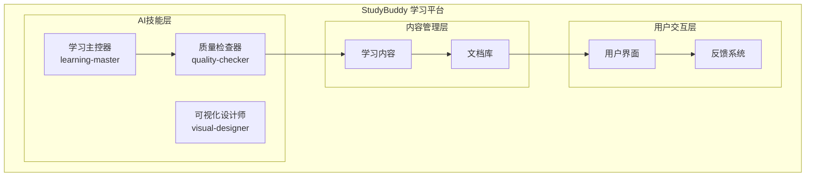
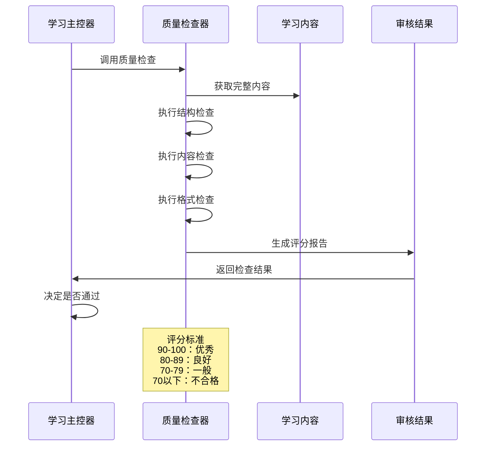
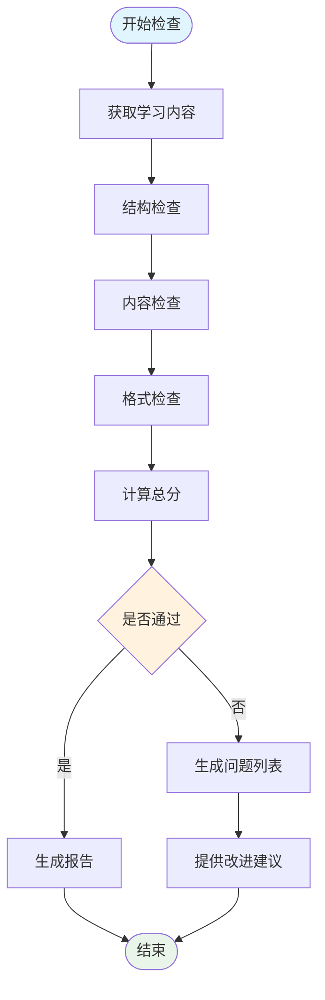
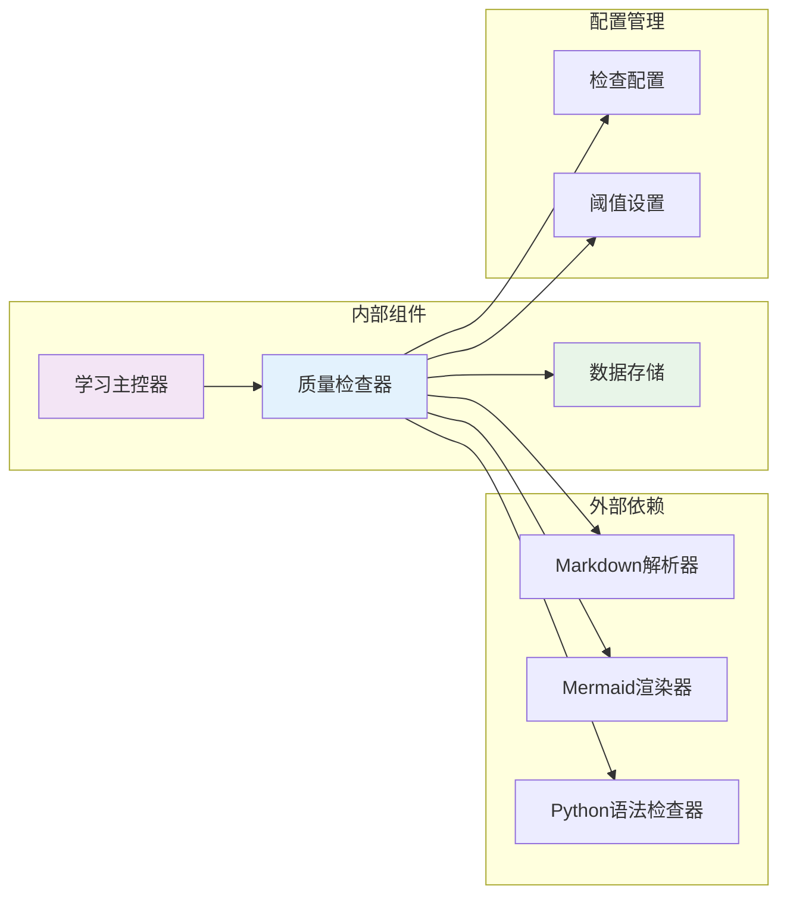
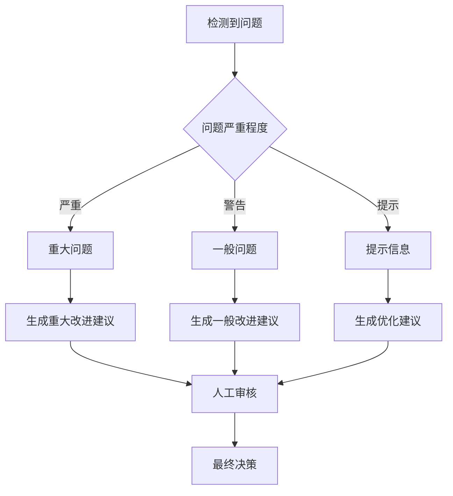

# 质量检查器

<cite>
**本文档引用的文件**
- [AI技能规范](file://docs/04-AI-SKILL-SPEC.md)
- [需求规格](file://docs/02-REQUIREMENTS.md)
- [架构设计](file://docs/03-ARCHITECTURE.md)
</cite>

## 目录
1. [简介](#简介)
2. [项目结构](#项目结构)
3. [核心组件](#核心组件)
4. [架构概览](#架构概览)
5. [详细组件分析](#详细组件分析)
6. [依赖关系分析](#依赖关系分析)
7. [性能考虑](#性能考虑)
8. [故障排除指南](#故障排除指南)
9. [结论](#结论)

## 简介

StudyBuddy 项目中的质量检查器（quality-checker）是一个专门设计的AI技能模块，负责对学习文档进行全面的质量评估和审核。该技能模块采用严格的技术文档审核标准，通过结构检查、内容检查和格式检查三个维度来评估文档质量。

质量检查器的核心职责是：
- 自动化文档质量评估
- 识别潜在问题并提供改进建议
- 生成详细的评分报告
- 确保学习文档符合预定义的质量标准

该技能模块在整个学习生态系统中扮演着关键的把关角色，确保所有输出的学习内容都达到高质量标准。

## 项目结构

StudyBuddy 项目采用模块化的架构设计，质量检查器作为独立的AI技能模块集成在整体系统中：



**图表来源**
- [架构设计](file://docs/03-ARCHITECTURE.md#L35)
- [架构设计](file://docs/03-ARCHITECTURE.md#L94)

**章节来源**
- [架构设计](file://docs/03-ARCHITECTURE.md#L35)
- [架构设计](file://docs/03-ARCHITECTURE.md#L94)

## 核心组件

### 质量检查器技能规格

质量检查器作为StudyBuddy项目中的第6个AI技能，具有以下核心特征：

| 属性 | 值 |
|------|-----|
| 技能名称 | quality-checker |
| 调用方式 | 由 learning-master 调用 |
| 职责 | 检查内容质量，输出评分和改进建议 |
| 评分阈值 | ≥ 80 分为通过 |

### 检查指标体系

质量检查器采用三层检查体系，总分为100分：

#### 结构检查（30分）
- **三阶段完整**（10分）：概览、详解、实战三部分齐全
- **每概念三要素**（10分）：是什么、为什么、怎么用
- **难度分级清晰**（10分）：初级、中级、高级区分明确

#### 内容检查（40分）
- **一句话定义通俗**（10分）：无专业术语堆砌
- **类比恰当**（10分）：用已知解释未知
- **示例可运行**（10分）：代码语法正确
- **速查表实用**（10分）：覆盖高频操作

#### 格式检查（30分）
- **Markdown语法**（10分）：无格式错误
- **表格规范**（10分）：对齐、无空列
- **Mermaid语法**（10分）：可正确渲染

**章节来源**
- [AI技能规范](file://docs/04-AI-SKILL-SPEC.md#L609)
- [AI技能规范](file://docs/04-AI-SKILL-SPEC.md#L619)

## 架构概览

质量检查器在StudyBuddy系统中的集成架构如下：



**图表来源**
- [架构设计](file://docs/03-ARCHITECTURE.md#L35)
- [AI技能规范](file://docs/04-AI-SKILL-SPEC.md#L671)

### 质量评估流程

质量检查器采用系统化的评估流程：



**图表来源**
- [AI技能规范](file://docs/04-AI-SKILL-SPEC.md#L646)
- [AI技能规范](file://docs/04-AI-SKILL-SPEC.md#L702)

**章节来源**
- [架构设计](file://docs/03-ARCHITECTURE.md#L35)
- [AI技能规范](file://docs/04-AI-SKILL-SPEC.md#L671)

## 详细组件分析

### 结构检查算法

结构检查算法重点关注学习内容的组织架构和逻辑完整性：

#### 三阶段完整性验证
- **概览阶段**：检查是否存在学习目标、前置知识、学习路径概述
- **详解阶段**：验证核心概念的深度解析和技术细节
- **实战阶段**：确认实践案例、代码示例和动手练习

#### 概念要素完整性检查
每个技术概念必须包含三个基本要素：
- **是什么**：概念定义和核心特征
- **为什么**：应用场景和价值说明  
- **怎么用**：实现方法和使用指南

#### 难度分级标准化
- **初级**：基础概念，入门级别
- **中级**：进阶应用，需要一定经验
- **高级**：复杂场景，专业技能

### 内容检查算法

内容检查算法专注于学习材料的准确性和实用性：

#### 通俗性评估
- 术语使用频率统计
- 复杂句式识别
- 专业词汇简化建议

#### 类比有效性检查
- 已知概念匹配度
- 类比逻辑合理性
- 目标受众适用性

#### 示例质量评估
- 代码语法正确性
- 运行环境兼容性
- 错误处理完整性

#### 速查表实用性分析
- 高频操作覆盖率
- 实际应用场景匹配
- 维护更新及时性

### 格式检查算法

格式检查算法确保学习内容的可读性和专业性：

#### Markdown语法验证
- 标题层级正确性
- 列表格式规范性
- 链接和图片完整性

#### 表格格式标准化
- 对齐方式一致性
- 列宽适配性
- 内容完整性检查

#### Mermaid图表验证
- 语法正确性检查
- 渲染可行性验证
- 逻辑连贯性分析

**章节来源**
- [AI技能规范](file://docs/04-AI-SKILL-SPEC.md#L619)
- [AI技能规范](file://docs/04-AI-SKILL-SPEC.md#L638)

## 依赖关系分析

质量检查器与其他系统组件的依赖关系：



**图表来源**
- [架构设计](file://docs/03-ARCHITECTURE.md#L94)

### 质量阈值设置

质量检查器采用分层阈值管理系统：

| 分数区间 | 等级 | 处理方式 | 通过标准 |
|----------|------|----------|----------|
| 90-100 | 优秀 | 直接发布 | ✓ |
| 80-89 | 良好 | 小问题可接受 | ✓ |
| 70-79 | 一般 | 需要修改 | ✗ |
| <70 | 不合格 | 重新生成 | ✗ |

### 输出报告格式

质量检查器的标准输出格式包含以下关键字段：

```json
{
  "score": 85,
  "passed": true,
  "breakdown": {
    "structure": 28,
    "content": 35,
    "format": 22
  },
  "issues": [
    {
      "severity": "warning",
      "location": "详解/泛型/怎么用",
      "issue": "示例代码缺少类型注解"
    }
  ],
  "suggestions": [
    "建议在泛型示例中添加具体的类型参数",
    "速查表可增加常见错误处理方式"
  ]
}
```

**章节来源**
- [AI技能规范](file://docs/04-AI-SKILL-SPEC.md#L646)
- [需求规格](file://docs/02-REQUIREMENTS.md#L57)

## 性能考虑

### 检查效率优化

质量检查器在设计时充分考虑了性能因素：

- **增量检查**：支持部分文档的快速检查
- **缓存机制**：重复内容的快速重用
- **并发处理**：多文档同时检查能力
- **内存优化**：大文档的高效处理

### 扩展性设计

系统具备良好的扩展性：
- **插件化检查器**：支持自定义检查规则
- **配置驱动**：灵活的阈值和标准设置
- **API接口**：便于集成到其他系统
- **监控告警**：检查过程的实时监控

## 故障排除指南

### 常见问题及解决方案

#### 检查结果异常
- **问题**：分数与预期不符
- **原因**：检查标准配置错误
- **解决**：检查配置文件和阈值设置

#### 性能问题
- **问题**：检查速度过慢
- **原因**：文档过大或检查规则过多
- **解决**：优化文档结构或调整检查范围

#### 格式错误
- **问题**：Mermaid图表无法渲染
- **原因**：语法不规范
- **解决**：检查图表语法和依赖关系

### 质量改进建议生成机制

质量检查器不仅发现问题，还能提供针对性的改进建议：



**图表来源**
- [AI技能规范](file://docs/04-AI-SKILL-SPEC.md#L671)

## 结论

StudyBuddy项目中的质量检查器是一个功能完善、设计合理的AI技能模块。它通过科学的检查指标体系、严格的评分标准和智能化的改进建议生成机制，为学习内容的质量保障提供了强有力的技术支撑。

该技能模块的主要优势包括：

1. **全面性**：涵盖结构、内容、格式三个维度的检查
2. **标准化**：明确的评分标准和阈值设置
3. **智能化**：自动化的检查流程和改进建议
4. **可扩展性**：灵活的配置和插件化设计

质量检查器的成功实施将显著提升StudyBuddy平台学习内容的整体质量和用户体验，为构建高质量的AI学习生态系统奠定坚实基础。