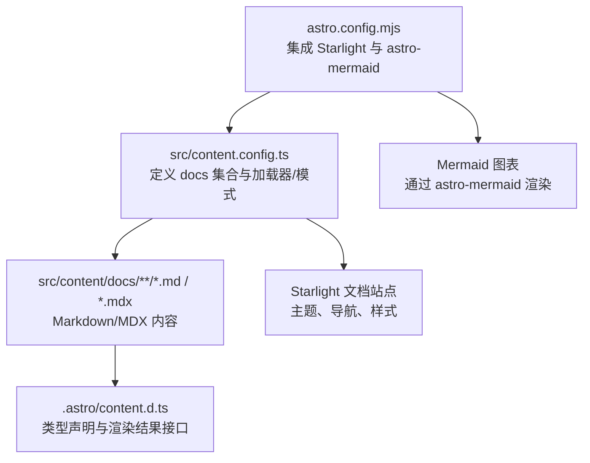
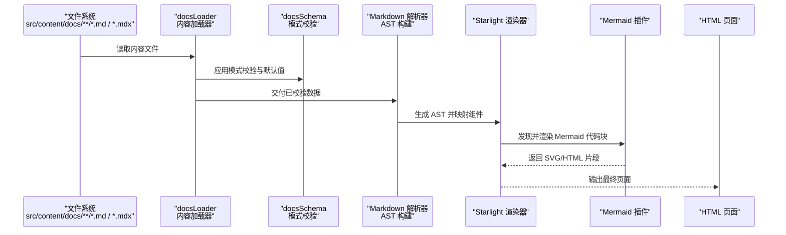
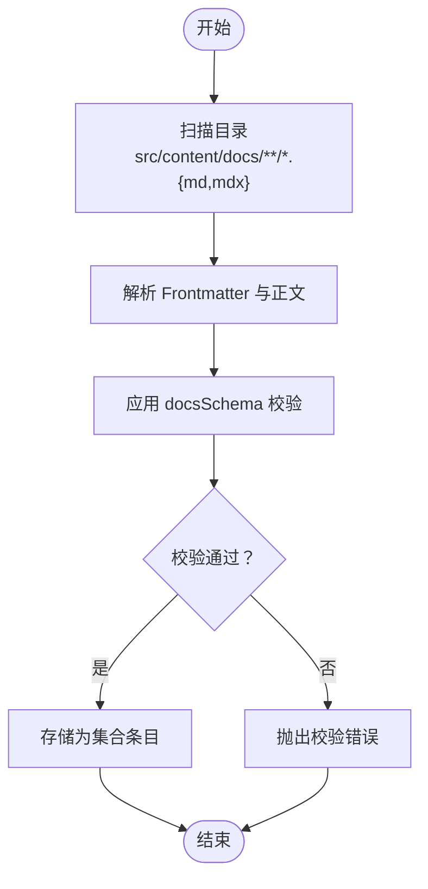
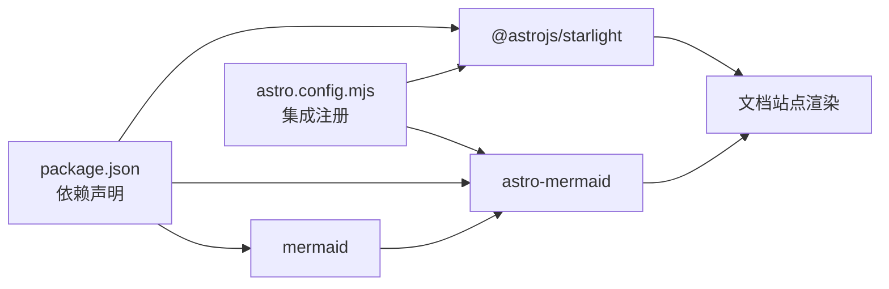

# Markdown 解析与转换

<cite>
**本文引用的文件**
- [astro.config.mjs](file://astro.config.mjs)
- [content.config.ts](file://src/content.config.ts)
- [package.json](file://package.json)
- [.astro/content.d.ts](file://.astro/content.d.ts)
- [docs/index.mdx](file://src/content/docs/index.mdx)
- [domains/backend/index.md](file://src/content/docs/domains/backend/index.md)
- [tools/ai-coding/index.md](file://src/content/docs/tools/ai-coding/index.md)
- [tools/efficiency/docker.md](file://src/content/docs/tools/efficiency/docker.md)
- [methods/learning/index.md](file://src/content/docs/methods/learning/index.md)
- [methods/thinking/index.md](file://src/content/docs/methods/thinking/index.md)
</cite>

## 目录
1. [简介](#简介)
2. [项目结构](#项目结构)
3. [核心组件](#核心组件)
4. [架构总览](#架构总览)
5. [详细组件分析](#详细组件分析)
6. [依赖关系分析](#依赖关系分析)
7. [性能考量](#性能考量)
8. [故障排查指南](#故障排查指南)
9. [结论](#结论)
10. [附录](#附录)

## 简介
本文件面向 StudyBuddy 项目，系统性梳理 Astro 的 Markdown 解析与转换流程，覆盖 Frontmatter 元数据提取、内容转换、AST 构建、组件映射、属性绑定以及最终 HTML 生成的完整渲染管道。同时，文档化了自定义组件（以 Mermaid 图表为例）的集成方式与渲染机制，并通过具体 Markdown 示例与预期输出说明特殊语法的处理规则与扩展能力。

## 项目结构
StudyBuddy 采用 Astro + Starlight 的内容驱动架构，内容位于 src/content/docs 下，按工具、领域、方法论三个大类组织。项目通过集成 astro-mermaid 支持 Mermaid 图表渲染，Starlight 提供主题化文档站点能力。



图表来源
- [astro.config.mjs](file://astro.config.mjs#L9-L39)
- [content.config.ts](file://src/content.config.ts#L1-L8)
- [.astro/content.d.ts](file://.astro/content.d.ts#L175-L185)

章节来源
- [astro.config.mjs](file://astro.config.mjs#L1-L39)
- [content.config.ts](file://src/content.config.ts#L1-L8)
- [.astro/content.d.ts](file://.astro/content.d.ts#L98-L218)

## 核心组件
- 内容集合与加载器
  - 通过内容配置定义 docs 集合，使用 Starlight 的 docsLoader 与 docsSchema，实现 Markdown/MDX 的自动加载与模式校验。
- 渲染管线
  - Astro 在构建期将 Markdown/MDX 解析为 AST，再经由 Starlight 组件与布局渲染为 HTML。
- 自定义扩展
  - 通过 astro-mermaid 集成 Mermaid 图表，支持在 Markdown 中以代码块形式嵌入图表并自动渲染。

章节来源
- [content.config.ts](file://src/content.config.ts#L1-L8)
- [.astro/content.d.ts](file://.astro/content.d.ts#L175-L185)
- [package.json](file://package.json#L12-L20)

## 架构总览
下图展示从内容文件到最终页面的端到端流程：内容收集、加载与模式校验、Markdown 解析与 AST 构建、组件映射与属性绑定、Mermaid 图表渲染、最终 HTML 生成。



图表来源
- [content.config.ts](file://src/content.config.ts#L1-L8)
- [astro.config.mjs](file://astro.config.mjs#L9-L39)
- [tools/efficiency/docker.md](file://src/content/docs/tools/efficiency/docker.md#L36-L51)

## 详细组件分析

### 内容集合与加载/校验流程
- 集合定义
  - 使用 defineCollection 指定 docs 集合，绑定 docsLoader 与 docsSchema，确保内容具备标题、描述等字段，并提供默认值与额外属性控制。
- 加载与校验
  - docsLoader 负责扫描目录、读取文件、解析 Frontmatter 与正文。
  - docsSchema 对 Frontmatter 字段进行类型校验与默认值填充，保证后续渲染一致性。
- 类型声明
  - .astro/content.d.ts 提供 getEntry/render 等 API 的类型签名，render 结果包含 body 与 rendered 字段，便于在页面中消费。



图表来源
- [content.config.ts](file://src/content.config.ts#L1-L8)
- [.astro/content.d.ts](file://.astro/content.d.ts#L175-L185)

章节来源
- [content.config.ts](file://src/content.config.ts#L1-L8)
- [.astro/content.d.ts](file://.astro/content.d.ts#L98-L218)

### Markdown 解析与 AST 构建
- Frontmatter 提取
  - 以 --- 包裹的 YAML 片段被解析为对象，作为条目的元数据（如 title、description、tags 等）。
- 正文转换
  - Markdown 正文经解析生成 AST，随后由 Starlight 渲染器处理，支持：
    - 标题、段落、列表、表格等基础语法
    - 代码块高亮（由主题或插件负责）
    - MDX 组件导入与 JSX 表达式（如 import 语句与组件标签）
- AST 构建
  - 解析阶段将 Markdown 结构映射为节点树，渲染阶段再将其映射为组件树（如 Starlight 内置组件）。

章节来源
- [domains/backend/index.md](file://src/content/docs/domains/backend/index.md#L1-L7)
- [tools/ai-coding/index.md](file://src/content/docs/tools/ai-coding/index.md#L1-L7)
- [docs/index.mdx](file://src/content/docs/index.mdx#L1-L73)

### 组件映射与属性绑定
- MDX 导入与组件使用
  - 在 MDX 中可通过 import 语句引入 Starlight 组件（如 LinkCard、CardGrid），并在文档正文中以 JSX 形式使用。
- 属性绑定
  - 组件属性来自 Markdown 正文中的结构化数据或 Frontmatter 字段，渲染器根据模式与组件定义进行绑定。
- 渲染结果
  - 最终输出为 HTML，组件内部可能进一步生成子元素与样式类名。

章节来源
- [docs/index.mdx](file://src/content/docs/index.mdx#L17-L37)

### Mermaid 图表嵌入与渲染机制
- 语法约定
  - 在 Markdown 中使用 fenced code block，语言标识为 mermaid，内容为 Mermaid 语法（如 mindmap、flowchart）。
- 渲染流程
  - 构建时，astro-mermaid 捕获 mermaid 代码块，调用 Mermaid 引擎生成 SVG/HTML 片段。
  - 渲染器将生成的片段注入到 AST 对应位置，最终输出到页面。
- 示例参考
  - 参见工具 -> 效率 -> Docker 文档中的思维导图与流程图代码块。

```mermaid
sequenceDiagram
participant MD as "Markdown 文件<br/>含
```mermaid ... ```"
  participant Parser as "Markdown 解析器"
  participant MermaidPlugin as "astro-mermaid 插件"
  participant Engine as "Mermaid 引擎"
  participant Renderer as "渲染器"
  participant Page as "最终页面"

  MD->>Parser: 识别 mermaid 代码块
  Parser->>MermaidPlugin: 传递代码块内容
  MermaidPlugin->>Engine: 渲染为 SVG/HTML
  Engine-->>MermaidPlugin: 返回渲染结果
  MermaidPlugin-->>Renderer: 注入渲染片段
  Renderer-->>Page: 输出页面
```

图表来源
- [astro.config.mjs](file://astro.config.mjs#L4-L33)
- [tools/efficiency/docker.md](file://src/content/docs/tools/efficiency/docker.md#L36-L51)
- [tools/efficiency/docker.md](file://src/content/docs/tools/efficiency/docker.md#L176-L187)

章节来源
- [astro.config.mjs](file://astro.config.mjs#L4-L33)
- [tools/efficiency/docker.md](file://src/content/docs/tools/efficiency/docker.md#L36-L51)
- [tools/efficiency/docker.md](file://src/content/docs/tools/efficiency/docker.md#L176-L187)

### 特殊语法与扩展功能
- Frontmatter
  - 用于声明页面元信息（如标题、描述、模板、Hero 行为等），并由 docsSchema 控制字段类型与默认值。
- MDX 组件
  - 支持在 Markdown 中直接使用 JSX 组件，实现富文本与交互元素的组合。
- Mermaid 图表
  - 通过代码块语言标识启用，支持多种图表类型（思维导图、流程图等）。
- 表格与列表
  - Markdown 表格与任务列表等语法在渲染后保留结构化语义，便于样式与交互处理。

章节来源
- [docs/index.mdx](file://src/content/docs/index.mdx#L1-L15)
- [docs/index.mdx](file://src/content/docs/index.mdx#L17-L37)
- [tools/efficiency/docker.md](file://src/content/docs/tools/efficiency/docker.md#L1-L205)

## 依赖关系分析
- 配置与集成
  - astro.config.mjs 中注册 Starlight 与 astro-mermaid 两个集成，分别负责文档站点与 Mermaid 渲染。
- 依赖声明
  - package.json 明确列出 @astrojs/starlight、astro-mermaid、mermaid 等依赖，确保渲染链路可用。
- 类型与 API
  - .astro/content.d.ts 提供 getEntry/render 等 API 的类型约束，保障在 TypeScript 环境下的正确使用。



图表来源
- [package.json](file://package.json#L12-L20)
- [astro.config.mjs](file://astro.config.mjs#L9-L39)

章节来源
- [package.json](file://package.json#L12-L20)
- [astro.config.mjs](file://astro.config.mjs#L9-L39)
- [.astro/content.d.ts](file://.astro/content.d.ts#L175-L185)

## 性能考量
- 构建期渲染
  - Markdown 解析与组件渲染发生在构建期，页面在运行时仅需传输静态 HTML，有利于首屏性能。
- Mermaid 渲染
  - 大量图表会增加构建时间，建议合理拆分内容或延迟加载（在页面层面）以优化体验。
- 类型与模式校验
  - docsSchema 的校验有助于提前发现内容问题，减少运行时异常与回退渲染。

## 故障排查指南
- Frontmatter 校验失败
  - 症状：构建报错，提示字段缺失或类型不符。
  - 排查：检查 Frontmatter 是否符合 docsSchema 定义，确认必填字段与默认值是否满足。
- Mermaid 图表未渲染
  - 症状：页面空白或显示原始代码块。
  - 排查：确认代码块语言标识为 mermaid；检查 astro.config.mjs 中是否正确集成 astro-mermaid；查看浏览器控制台是否有 Mermaid 错误。
- MDX 组件导入报错
  - 症状：MDX 解析失败或组件未找到。
  - 排查：确认 import 语句路径正确；确保组件在运行时可解析；检查渲染器是否支持该组件。

章节来源
- [content.config.ts](file://src/content.config.ts#L1-L8)
- [astro.config.mjs](file://astro.config.mjs#L9-L39)
- [tools/efficiency/docker.md](file://src/content/docs/tools/efficiency/docker.md#L36-L51)

## 结论
StudyBuddy 通过 Astro + Starlight 的内容驱动架构，实现了从 Markdown/MDX 到 HTML 的高效渲染。Frontmatter 元数据与 docsSchema 提供了强类型的结构化内容支撑，MDX 组件扩展了页面表达力，astro-mermaid 则为知识可视化提供了便捷通道。遵循本文所述流程与最佳实践，可在保持内容质量的同时获得稳定、可维护的渲染效果。

## 附录
- 示例与输出对照（概念性说明）
  - 示例：工具 -> 效率 -> Docker 文档中的思维导图与流程图代码块
  - 预期：构建后，对应代码块被替换为可交互的 SVG/HTML 图表，融入页面布局
  - 参考路径：[思维导图示例](file://src/content/docs/tools/efficiency/docker.md#L36-L51)、[流程图示例](file://src/content/docs/tools/efficiency/docker.md#L176-L187)