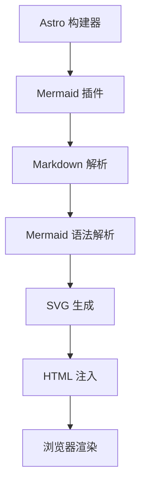
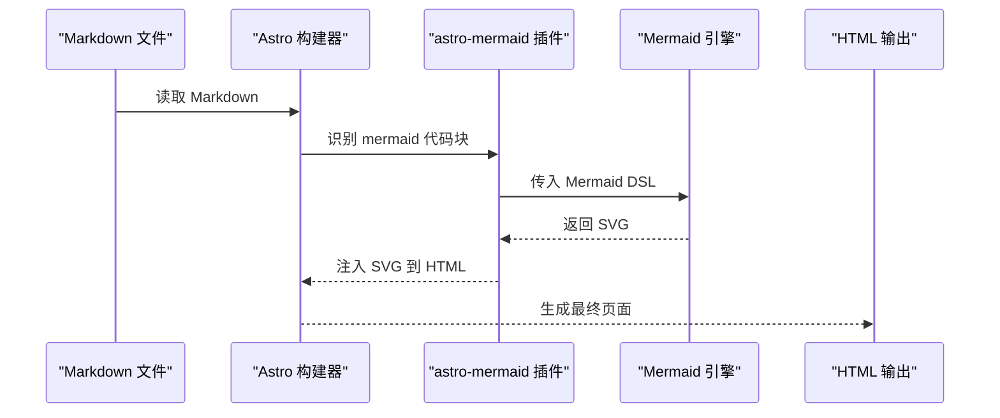
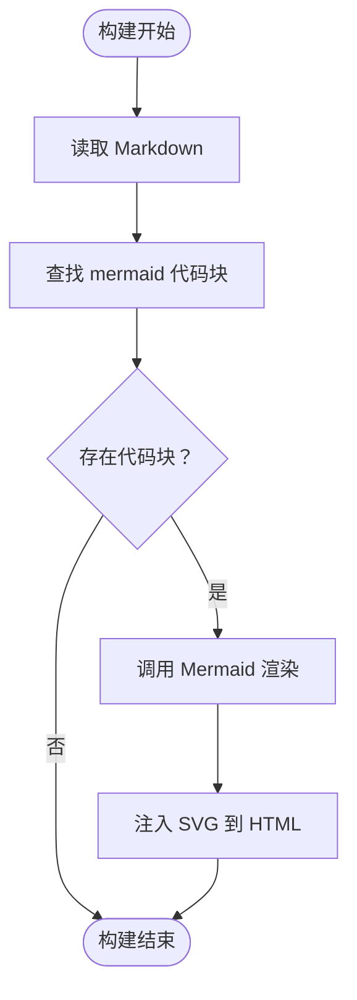
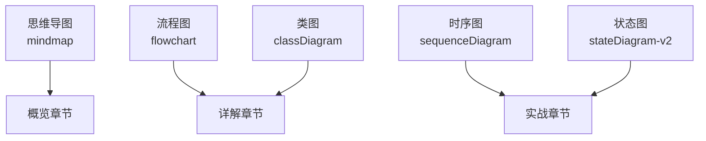
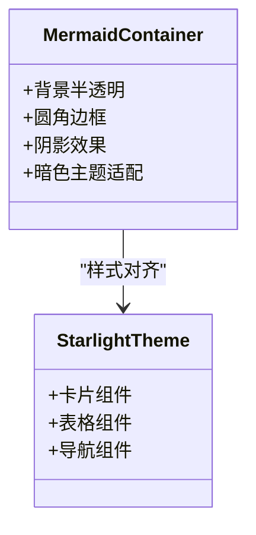
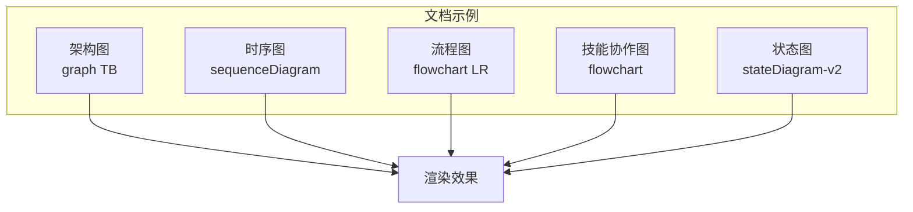
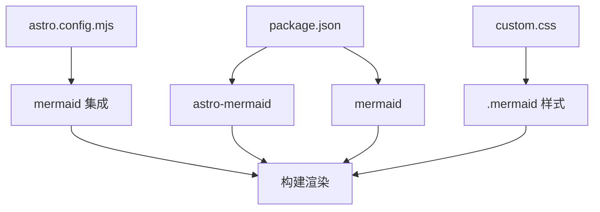

# Mermaid 图表渲染

<cite>
**本文档引用的文件**
- [package.json](file://package.json)
- [astro.config.mjs](file://astro.config.mjs)
- [custom.css](file://src/styles/custom.css)
- [01-PROJECT-BRIEF.md](file://docs/01-PROJECT-BRIEF.md)
- [03-ARCHITECTURE.md](file://docs/03-ARCHITECTURE.md)
- [04-AI-SKILL-SPEC.md](file://docs/04-AI-SKILL-SPEC.md)
</cite>

## 目录
1. [简介](#简介)
2. [项目结构](#项目结构)
3. [核心组件](#核心组件)
4. [架构总览](#架构总览)
5. [详细组件分析](#详细组件分析)
6. [依赖关系分析](#依赖关系分析)
7. [性能考量](#性能考量)
8. [故障排除指南](#故障排除指南)
9. [结论](#结论)
10. [附录](#附录)

## 简介
本文件面向 StudyBuddy 项目的 Mermaid 图表渲染系统，系统性阐述 astro-mermaid 插件的工作原理与集成方式，涵盖图表代码识别、语法解析与 SVG 生成流程；详细说明支持的图表类型与配置选项；文档化图表样式定制、主题适配与响应式布局；提供图表语法示例、渲染效果对比与性能优化建议；并总结图表与文档内容的集成方式与最佳实践。

## 项目结构
StudyBuddy 采用 Astro + Starlight 构建文档站点，Mermaid 图表通过 astro-mermaid 插件在构建阶段解析 Markdown 中的 Mermaid 代码块并生成 SVG，最终嵌入到 HTML 中。项目的关键配置与样式如下：
- 依赖与插件：通过 package.json 引入 astro-mermaid 与 mermaid；在 astro.config.mjs 中启用 mermaid 集成。
- 样式覆盖：通过自定义 CSS 为 .mermaid 容器提供统一的视觉风格与暗色主题适配。
- 文档内容：在多篇文档中使用 Mermaid 代码块进行架构、流程与时序可视化。



**图表来源**
- [astro.config.mjs](file://astro.config.mjs#L1-L39)
- [package.json](file://package.json#L12-L20)

**章节来源**
- [astro.config.mjs](file://astro.config.mjs#L1-L39)
- [package.json](file://package.json#L12-L20)

## 核心组件
- astro-mermaid 插件：负责在 Astro 构建过程中识别 Markdown 代码块中的 Mermaid 语法，调用 mermaid 渲染引擎生成 SVG，并将其注入到最终 HTML 中。
- Mermaid 引擎：负责将 Mermaid DSL 解析为图形结构并输出 SVG。
- Starlight 主题：提供文档站点的基础样式与组件，Mermaid 图表容器样式由自定义 CSS 进行覆盖。
- 自定义样式：通过 custom.css 为 .mermaid 容器提供圆角、阴影、边框与暗色主题适配，确保图表在不同主题下的一致体验。

**章节来源**
- [astro.config.mjs](file://astro.config.mjs#L1-L39)
- [custom.css](file://src/styles/custom.css#L315-L328)
- [03-ARCHITECTURE.md](file://docs/03-ARCHITECTURE.md#L244-L274)

## 架构总览
Mermaid 图表渲染在构建阶段的端到端流程如下：
- Markdown 解析：Astro 读取 Markdown 文件，提取代码块。
- Mermaid 识别：astro-mermaid 插件识别代码块语言为 mermaid 的块。
- 语法解析：Mermaid 引擎解析 DSL，构建内部图形结构。
- SVG 生成：Mermaid 引擎输出 SVG 字符串。
- HTML 注入：Astro 将 SVG 注入到文档 HTML 中，供浏览器渲染。



**图表来源**
- [astro.config.mjs](file://astro.config.mjs#L1-L39)
- [package.json](file://package.json#L16-L17)

## 详细组件分析

### 插件集成与配置
- 插件启用：在 astro.config.mjs 中通过 integrations 数组启用 mermaid 集成。
- 样式注入：通过 Starlight 的 customCss 配置引入自定义 CSS，确保 Mermaid 图表容器具备统一外观。
- 配置要点：插件默认行为满足大多数文档站点需求，若需更细粒度控制，可在插件初始化时传入 mermaid 配置对象（例如主题、字体、语言等），但当前项目未显式传入，采用默认配置。



**图表来源**
- [astro.config.mjs](file://astro.config.mjs#L10-L33)
- [custom.css](file://src/styles/custom.css#L315-L328)

**章节来源**
- [astro.config.mjs](file://astro.config.mjs#L10-L33)
- [03-ARCHITECTURE.md](file://docs/03-ARCHITECTURE.md#L244-L264)

### 支持的图表类型与语法
根据项目文档，支持的图表类型与用途如下：
- 思维导图（mindmap）：用于知识体系概览，适合在“概览”章节展示主题全貌。
- 流程图（flowchart）：用于使用步骤与决策流程，适合在“详解”或“实战”章节展示操作路径。
- 时序图（sequenceDiagram）：用于交互过程与 API 调用，适合在“实战”章节展示调用链路。
- 类图（classDiagram）：用于数据结构与类关系，适合在“详解”章节展示抽象结构。
- 状态图（stateDiagram-v2）：用于状态机与生命周期，适合在“实战”章节展示状态流转。



**图表来源**
- [03-ARCHITECTURE.md](file://docs/03-ARCHITECTURE.md#L266-L274)
- [04-AI-SKILL-SPEC.md](file://docs/04-AI-SKILL-SPEC.md#L545-L553)

**章节来源**
- [03-ARCHITECTURE.md](file://docs/03-ARCHITECTURE.md#L266-L274)
- [04-AI-SKILL-SPEC.md](file://docs/04-AI-SKILL-SPEC.md#L545-L553)

### 图表样式定制与主题设置
- 容器样式：通过 .mermaid 类为图表容器设置背景、圆角、阴影与边框，提升可读性与一致性。
- 暗色主题适配：在 :root[data-theme='dark'] 选择器下为 .mermaid 提供暗色背景与边框颜色，确保在深色主题下的对比度与可读性。
- 与 Starlight 组件融合：Mermaid 图表容器样式与 Starlight 的卡片、表格等组件风格保持一致，避免视觉割裂。



**图表来源**
- [custom.css](file://src/styles/custom.css#L315-L328)
- [custom.css](file://src/styles/custom.css#L325-L328)

**章节来源**
- [custom.css](file://src/styles/custom.css#L315-L328)

### 响应式布局与可访问性
- 响应式容器：.mermaid 容器在桌面端与移动端均保持一致的间距与阴影，确保在不同设备上的可读性。
- 可访问性：Mermaid 输出为 SVG，具备良好的可缩放性与文本替代能力，便于屏幕阅读器与无障碍访问工具解析。

**章节来源**
- [custom.css](file://src/styles/custom.css#L315-L328)

### 图表语法示例与渲染效果对比
- 架构图示例：在 03-ARCHITECTURE.md 中使用 graph TB 展示系统分层与组件关系，适合用于高层架构说明。
- 时序图示例：在 03-ARCHITECTURE.md 中使用 sequenceDiagram 展示文档生成流程，适合用于流程说明与交互演示。
- 流程图示例：在 03-ARCHITECTURE.md 中使用 flowchart LR 展示站点构建流程，适合用于构建与部署流程说明。
- 技能协作图示例：在 04-AI-SKILL-SPEC.md 中使用 flowchart 展示六个子 Skill 的协作模型，适合用于工作流与职责说明。
- 状态图示例：在 04-AI-SKILL-SPEC.md 中使用 stateDiagram-v2 展示主控编排的状态流转，适合用于流程控制与异常处理说明。



**图表来源**
- [03-ARCHITECTURE.md](file://docs/03-ARCHITECTURE.md#L12-L69)
- [03-ARCHITECTURE.md](file://docs/03-ARCHITECTURE.md#L86-L126)
- [03-ARCHITECTURE.md](file://docs/03-ARCHITECTURE.md#L130-L160)
- [04-AI-SKILL-SPEC.md](file://docs/04-AI-SKILL-SPEC.md#L23-L73)
- [04-AI-SKILL-SPEC.md](file://docs/04-AI-SKILL-SPEC.md#L161-L172)

**章节来源**
- [03-ARCHITECTURE.md](file://docs/03-ARCHITECTURE.md#L12-L69)
- [03-ARCHITECTURE.md](file://docs/03-ARCHITECTURE.md#L86-L126)
- [03-ARCHITECTURE.md](file://docs/03-ARCHITECTURE.md#L130-L160)
- [04-AI-SKILL-SPEC.md](file://docs/04-AI-SKILL-SPEC.md#L23-L73)
- [04-AI-SKILL-SPEC.md](file://docs/04-AI-SKILL-SPEC.md#L161-L172)

### 图表与文档内容的集成方式与最佳实践
- 代码块语法：在 Markdown 中使用 ```mermaid
代码块包裹图表 DSL，astro-mermaid 插件将自动识别并渲染。
- 位置标记：在大纲或内容中标注图表位置如“概览章节”“详解章节”“实战章节”，便于读者定位与理解。
- 语义化注释：在图表代码块中添加注释说明用途，有助于维护与二次创作。
- 一致性原则：同一类型图表在不同文档中保持相同的节点命名风格与层级结构，提升可读性与复用性。
- 性能优先：避免在同一页面中放置过多复杂图表，减少构建与渲染压力；必要时可拆分至独立页面或延迟加载。
**章节来源**
- [03-ARCHITECTURE.md](file://docs/03-ARCHITECTURE.md#L244-L264)
- [04-AI-SKILL-SPEC.md](file://docs/04-AI-SKILL-SPEC.md#L545-L553)
## 依赖关系分析
- 依赖声明：package.json 明确声明 astro-mermaid 与 mermaid 为项目依赖，确保构建阶段可用。
- 插件集成：astro.config.mjs 通过 integrations 启用 mermaid 插件，形成与 Astro 构建系统的耦合。
- 样式依赖：custom.css 作为 Starlight 的自定义样式之一，为 Mermaid 图表提供视觉保障。


**图表来源**
- [package.json](file://package.json#L12-L20)
- [astro.config.mjs](file://astro.config.mjs#L1-L39)
- [custom.css](file://src/styles/custom.css#L315-L328)

**章节来源**
- [package.json](file://package.json#L12-L20)
- [astro.config.mjs](file://astro.config.mjs#L1-L39)

## 性能考量
- 构建优化：Mermaid 图表在构建阶段一次性渲染为 SVG，避免运行时渲染开销，契合 Astro 静态优先的设计理念。
- 资源体积：Mermaid 输出为 SVG，具备良好的压缩性与传输效率；结合 Astro 的资源优化策略，进一步降低页面体积。
- 渲染策略：对于大量图表的页面，建议拆分内容或采用懒加载策略，减少首屏渲染压力。
- 语法简化：在保证表达力的前提下，尽量简化图表语法与层级，降低渲染复杂度与内存占用。

**章节来源**
- [03-ARCHITECTURE.md](file://docs/03-ARCHITECTURE.md#L366-L383)

## 故障排除指南
- 图表无法渲染：检查 Markdown 代码块是否使用正确的语言标识（mermaid），以及 mermaid 代码语法是否正确。
- 样式异常：确认 custom.css 已被正确引入，且 .mermaid 容器样式未被其他规则覆盖。
- 构建报错：核对 astro.config.mjs 中 mermaid 插件的启用方式与版本兼容性。
- 主题不一致：在 :root[data-theme='dark'] 下检查 .mermaid 的暗色主题适配是否生效。

**章节来源**
- [astro.config.mjs](file://astro.config.mjs#L1-L39)
- [custom.css](file://src/styles/custom.css#L315-L328)

## 结论
StudyBuddy 的 Mermaid 图表渲染系统通过 astro-mermaid 插件与 Mermaid 引擎，在构建阶段将 Markdown 中的图表代码转换为 SVG，再注入到 HTML 中，实现了高性能、可维护的可视化呈现。配合自定义样式与主题适配，Mermaid 图表在文档站点中具备良好的可读性与一致性。遵循本文档提供的语法规范、样式定制与性能优化建议，可进一步提升图表的表达力与用户体验。

## 附录
- 项目愿景与技术选型：Mermaid 作为 Markdown 原生语法、AI 友好的可视化工具，契合 StudyBuddy 的知识体系构建目标。
- 文档分类与命名规范：在工具、领域与方法论三大分类下，Mermaid 图表可用于概览、详解与实战三个阶段，帮助读者快速建立知识框架。

**章节来源**
- [01-PROJECT-BRIEF.md](file://docs/01-PROJECT-BRIEF.md#L61-L71)
- [03-ARCHITECTURE.md](file://docs/03-ARCHITECTURE.md#L223-L239)