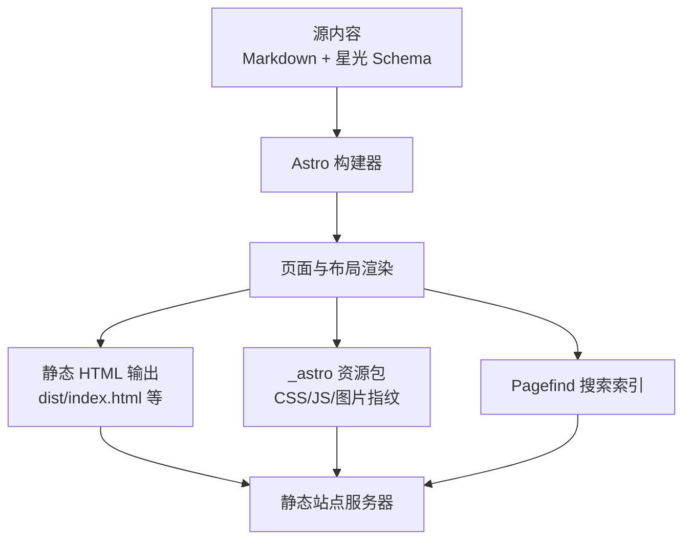
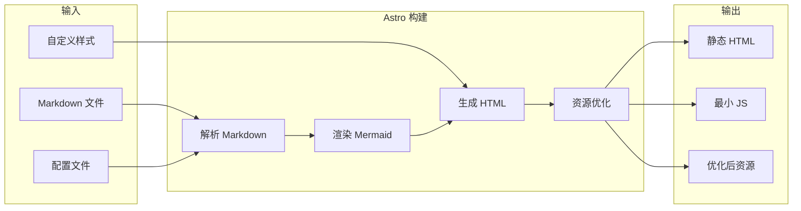
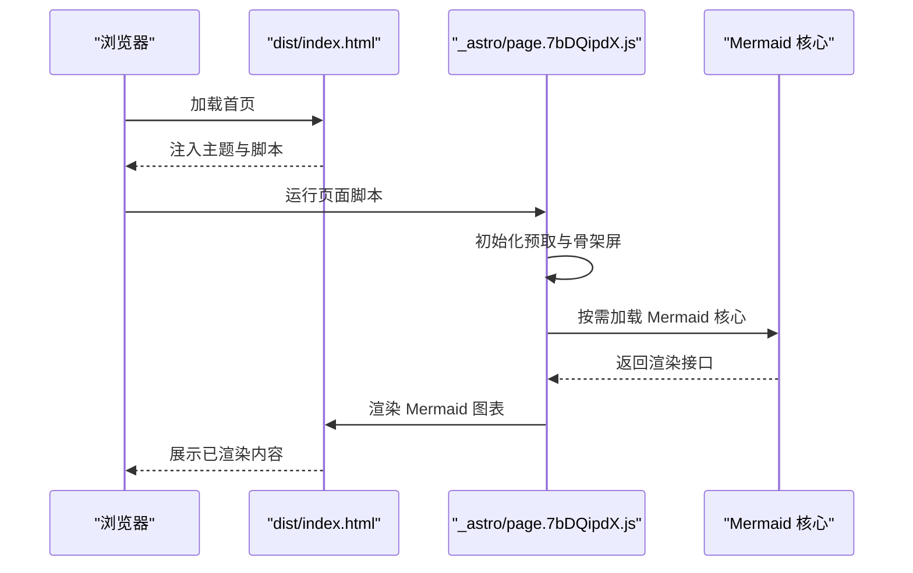
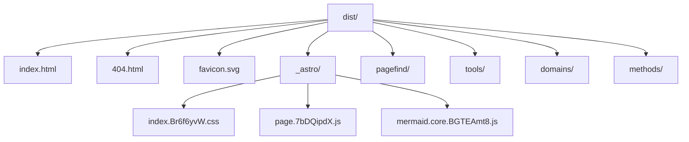
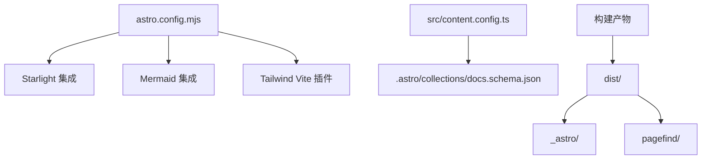

# 构建输出生成

<cite>
**本文引用的文件**
- [astro.config.mjs](file://astro.config.mjs)
- [package.json](file://package.json)
- [src/content.config.ts](file://src/content.config.ts)
- [dist/index.html](file://dist/index.html)
- [dist/404.html](file://dist/404.html)
- [dist/_astro/index.Br6f6yvW.css](file://dist/_astro/index.Br6f6yvW.css)
- [dist/_astro/page.7bDQipdX.js](file://dist/_astro/page.7bDQipdX.js)
- [.astro/collections/docs.schema.json](file://.astro/collections/docs.schema.json)
- [src/styles/custom.css](file://src/styles/custom.css)
- [docs/03-ARCHITECTURE.md](file://docs/03-ARCHITECTURE.md)
</cite>

## 目录
1. [简介](#简介)
2. [项目结构](#项目结构)
3. [核心组件](#核心组件)
4. [架构总览](#架构总览)
5. [详细组件分析](#详细组件分析)
6. [依赖关系分析](#依赖关系分析)
7. [性能考量](#性能考量)
8. [故障排查指南](#故障排查指南)
9. [结论](#结论)
10. [附录](#附录)

## 简介
本文件系统化阐述 StudyBuddy 项目的构建输出生成流程，聚焦 Astro 如何将处理后的页面转换为最终的静态文件，涵盖 HTML 文件生成、资源路径重写与链接修复、输出目录结构与命名规则、版本控制策略、404 页面处理、路由生成与 SEO 优化、构建产物验证、部署准备与性能测试，以及开发模式与生产模式的差异与优化重点。

## 项目结构
- 构建入口与脚本：通过 npm scripts 调用 Astro CLI 执行开发、构建与预览。
- 内容源：采用 Astro Content Collections，基于 Markdown 文档与 Starlight Schema 定义。
- 主题与样式：Starlight 主题 + 自定义 CSS；Tailwind Vite 插件参与样式管线。
- 构建产物：输出至 dist 目录，包含首页、404 页面、按目录生成的页面、Pagefind 搜索索引、_astro 资源包与静态资源。

**图表来源**
- [astro.config.mjs](file://astro.config.mjs#L9-L39)
- [src/content.config.ts](file://src/content.config.ts#L1-L8)
- [package.json](file://package.json#L5-L11)

**章节来源**
- [astro.config.mjs](file://astro.config.mjs#L9-L39)
- [src/content.config.ts](file://src/content.config.ts#L1-L8)
- [package.json](file://package.json#L5-L11)

## 核心组件
- Astro 配置与集成
  - Starlight 文档主题集成，启用多语言、侧边栏自动生成、自定义 CSS。
  - Mermaid 图表集成，支持在 Markdown 中内联 Mermaid 代码块渲染。
  - Tailwind Vite 插件，配合自定义 CSS 实现主题与视觉风格。
- 内容模型
  - 使用 Astro Content Collections 与 Starlight Schema，定义文档标题、描述、英雄区、动作按钮、徽章、分页、草稿状态、Pagefind 开关等字段。
- 构建脚本
  - 通过 npm scripts 调用 Astro CLI 的 dev/build/preview 命令，分别对应开发、构建与本地预览。

**章节来源**
- [astro.config.mjs](file://astro.config.mjs#L9-L39)
- [.astro/collections/docs.schema.json](file://.astro/collections/docs.schema.json#L1-L650)
- [package.json](file://package.json#L5-L11)

## 架构总览
下图展示从输入到输出的完整构建流程，包括 Markdown 解析、Mermaid 渲染、HTML 生成与资源优化。

**图表来源**
- [docs/03-ARCHITECTURE.md](file://docs/03-ARCHITECTURE.md#L128-L160)

**章节来源**
- [docs/03-ARCHITECTURE.md](file://docs/03-ARCHITECTURE.md#L128-L160)

## 详细组件分析

### HTML 文件生成与资源路径重写
- 首页与文档页
  - 构建后生成 dist/index.html 与按目录结构生成的页面（如 tools/domains/methods 等），页面中包含主题切换、搜索、Mermaid 图表初始化与骨架屏等交互逻辑。
  - 资源引用统一使用以斜杠开头的绝对路径（例如 "/_astro/index.Br6f6yvW.css"、"/_astro/page.7bDQipdX.js"、"/favicon.svg"），确保在任意子路径下均可正确加载。
- 404 页面
  - 构建后生成 dist/404.html，具备与首页一致的主题与脚本加载机制，用于兜底未匹配路由。
- Mermaid 图表
  - 构建产物中的 JS 包含 Mermaid 初始化与懒加载逻辑，按需渲染页面中的 Mermaid 代码块，并提供骨架屏与暗/亮主题适配。

**图表来源**
- [dist/index.html](file://dist/index.html#L1-L55)
- [dist/_astro/page.7bDQipdX.js](file://dist/_astro/page.7bDQipdX.js#L1-L81)

**章节来源**
- [dist/index.html](file://dist/index.html#L1-L55)
- [dist/404.html](file://dist/404.html#L1-L48)
- [dist/_astro/page.7bDQipdX.js](file://dist/_astro/page.7bDQipdX.js#L1-L81)

### 输出目录结构与命名规则
- 根目录产物
  - index.html：站点首页。
  - 404.html：未匹配路由的兜底页面。
  - favicon.svg：站点图标。
- 资源目录
  - _astro：包含带内容哈希的 CSS/JS 与 Mermaid 核心模块，命名形如 "index.Br6f6yvW.css"、"page.7bDQipdX.js"、"mermaid.core.BGTEAmt8.js"。
- 搜索索引
  - pagefind：包含 Pagefind 的搜索索引与 UI 资源，用于本地搜索。
- 目录化页面
  - tools、domains、methods：根据内容目录结构自动生成的页面集合。

**图表来源**
- [dist/index.html](file://dist/index.html#L1-L55)
- [dist/404.html](file://dist/404.html#L1-L48)
- [dist/_astro/index.Br6f6yvW.css](file://dist/_astro/index.Br6f6yvW.css#L1-L2)
- [dist/_astro/page.7bDQipdX.js](file://dist/_astro/page.7bDQipdX.js#L1-L81)

**章节来源**
- [dist/index.html](file://dist/index.html#L1-L55)
- [dist/404.html](file://dist/404.html#L1-L48)
- [dist/_astro/index.Br6f6yvW.css](file://dist/_astro/index.Br6f6yvW.css#L1-L2)
- [dist/_astro/page.7bDQipdX.js](file://dist/_astro/page.7bDQipdX.js#L1-L81)

### 版本控制策略
- 内容层
  - Markdown 文档作为版本控制的最小单元，便于追踪变更与协作。
- 构建层
  - 产物采用内容哈希命名（如 "index.Br6f6yvW.css"），确保缓存失效与长期缓存策略生效。
- 配置层
  - Astro 与 Starlight 配置集中于 astro.config.mjs，变更影响构建行为与输出结构。

**章节来源**
- [astro.config.mjs](file://astro.config.mjs#L9-L39)
- [dist/_astro/index.Br6f6yvW.css](file://dist/_astro/index.Br6f6yvW.css#L1-L2)

### 404 页面处理与路由生成
- 404 页面
  - 构建时自动生成 dist/404.html，包含与首页一致的主题与脚本，确保在未匹配路由时提供一致体验。
- 路由生成
  - 基于内容目录结构自动生成页面路由（如 /tools/、/domains/、/methods/），并遵循 Starlight 的侧边栏与导航生成规则。
- 链接修复
  - 构建产物中的资源引用均为绝对路径，避免相对路径在子路径下失效的问题。

**章节来源**
- [dist/404.html](file://dist/404.html#L1-L48)
- [astro.config.mjs](file://astro.config.mjs#L18-L31)

### SEO 优化措施
- 元信息与 Open Graph
  - 首页与 404 页面均包含 title、generator、Open Graph 与 Twitter Card 等元信息，提升分享与索引质量。
- 结构化内容
  - 使用 Starlight 的 Schema 字段（如 hero、actions、pagefind 等）增强页面语义，利于搜索引擎理解。
- 主题与可访问性
  - 支持深色/浅色主题切换，提供键盘导航与跳转到内容的可访问性锚点。

**章节来源**
- [dist/index.html](file://dist/index.html#L1-L55)
- [dist/404.html](file://dist/404.html#L1-L48)
- [.astro/collections/docs.schema.json](file://.astro/collections/docs.schema.json#L107-L167)

### 构建产物验证与部署准备
- 验证清单
  - 首页与 404 页面可正常加载且资源引用正确。
  - Mermaid 图表在页面加载后正确渲染，骨架屏过渡自然。
  - 搜索功能可用（pagefind 相关资源存在）。
  - 自定义 CSS 生效，主题切换逻辑正常。
- 部署准备
  - 将 dist 目录作为静态站点根目录部署；若使用 CDN，建议开启对哈希文件的长期缓存与对 HTML 的短缓存策略。

**章节来源**
- [dist/index.html](file://dist/index.html#L1-L55)
- [dist/_astro/page.7bDQipdX.js](file://dist/_astro/page.7bDQipdX.js#L1-L81)
- [src/styles/custom.css](file://src/styles/custom.css#L1-L614)

### 开发模式与生产模式差异
- 开发模式（dev/preview）
  - 启用热更新与源映射，便于调试；脚本与样式未进行压缩与指纹化。
- 生产模式（build）
  - 执行压缩、拆分与内容哈希命名；生成 Pagefind 索引与 Mermaid 核心模块；输出 dist 目录供部署。

**章节来源**
- [package.json](file://package.json#L5-L11)
- [docs/03-ARCHITECTURE.md](file://docs/03-ARCHITECTURE.md#L128-L160)

## 依赖关系分析
- 配置与内容
  - astro.config.mjs 依赖 @astrojs/starlight、astro-mermaid、@tailwindcss/vite。
  - src/content.config.ts 依赖 @astrojs/starlight/loaders 与 schema。
- 构建产物
  - dist 下的 _astro 资源包由 Vite/ESBuild 处理，包含 CSS/JS 与 Mermaid 核心模块。
  - pagefind 目录提供搜索索引与 UI 资源。

**图表来源**
- [astro.config.mjs](file://astro.config.mjs#L9-L39)
- [src/content.config.ts](file://src/content.config.ts#L1-L8)
- [.astro/collections/docs.schema.json](file://.astro/collections/docs.schema.json#L1-L650)

**章节来源**
- [astro.config.mjs](file://astro.config.mjs#L9-L39)
- [src/content.config.ts](file://src/content.config.ts#L1-L8)
- [.astro/collections/docs.schema.json](file://.astro/collections/docs.schema.json#L1-L650)

## 性能考量
- 资源优化
  - 使用内容哈希命名的静态资源，结合浏览器缓存策略，减少重复下载。
  - Mermaid 图表采用懒加载与骨架屏，降低首屏阻塞。
- 主题与样式
  - 自定义 CSS 与 Tailwind Vite 插件协同，减少运行时样式计算开销。
- 搜索与导航
  - Pagefind 索引本地化，避免外部依赖带来的网络延迟。

**章节来源**
- [dist/_astro/page.7bDQipdX.js](file://dist/_astro/page.7bDQipdX.js#L1-L81)
- [src/styles/custom.css](file://src/styles/custom.css#L1-L614)

## 故障排查指南
- Mermaid 图表不显示或报错
  - 检查 dist/_astro/page.7bDQipdX.js 是否加载成功，确认页面中存在 pre.mermaid 代码块且未被错误标记为已处理。
- 资源 404
  - 确认资源路径是否为绝对路径（以 "/" 开头），并检查 dist/_astro 下是否存在对应哈希文件。
- 404 页面异常
  - 检查 dist/404.html 是否存在且与首页一致的主题脚本加载逻辑。
- 主题切换无效
  - 确认 localStorage 中的主题键值与 data-theme 属性设置逻辑。

**章节来源**
- [dist/_astro/page.7bDQipdX.js](file://dist/_astro/page.7bDQipdX.js#L1-L81)
- [dist/index.html](file://dist/index.html#L1-L55)
- [dist/404.html](file://dist/404.html#L1-L48)

## 结论
StudyBuddy 的构建流程以 Astro 为核心，借助 Starlight 的文档主题与 Mermaid 的可视化能力，实现了从 Markdown 到静态 HTML 的高效转换。通过内容哈希命名、绝对路径资源引用与 Pagefind 搜索索引，构建产物具备良好的可部署性与可维护性。开发与生产模式的差异化配置确保了开发体验与上线性能的平衡。

## 附录
- 构建命令参考
  - 开发：npm run dev
  - 构建：npm run build
  - 预览：npm run preview
- 内容模型字段参考
  - 文档标题、描述、英雄区、动作按钮、徽章、分页、草稿、Pagefind 开关等字段定义见星云 Schema。

**章节来源**
- [package.json](file://package.json#L5-L11)
- [.astro/collections/docs.schema.json](file://.astro/collections/docs.schema.json#L1-L650)