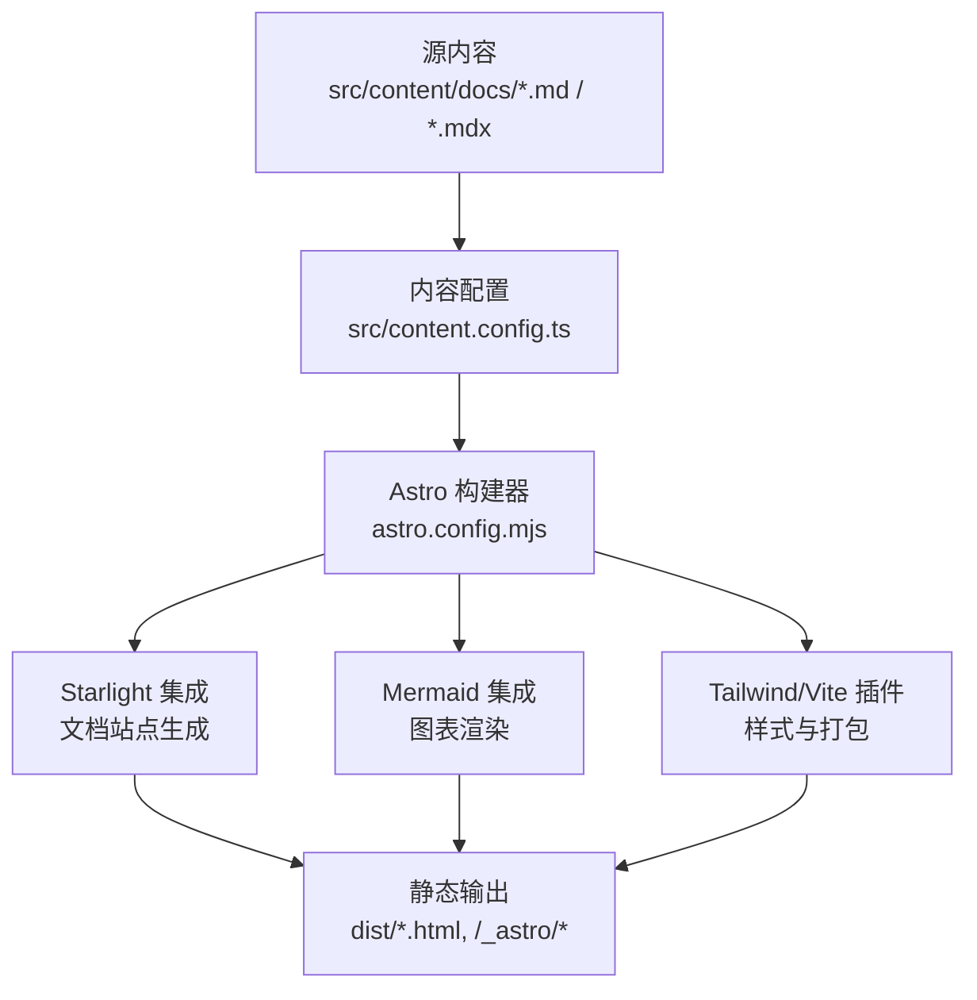
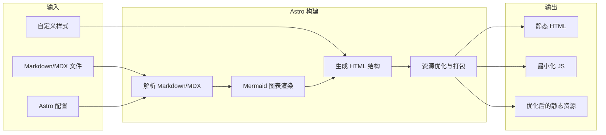
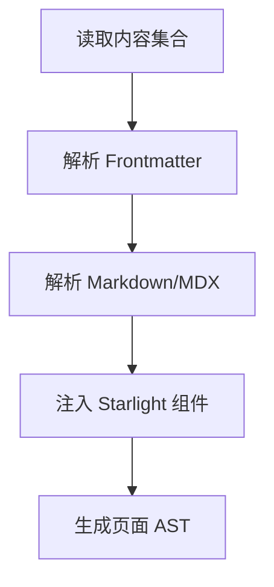
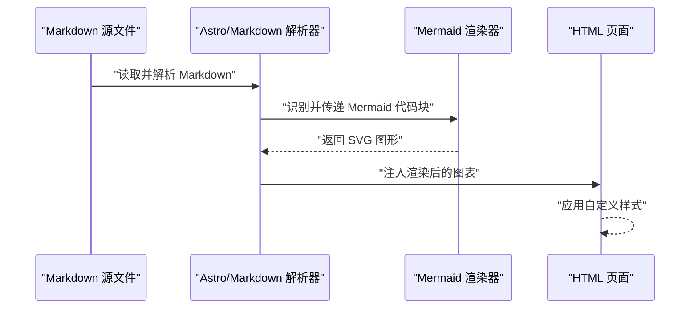
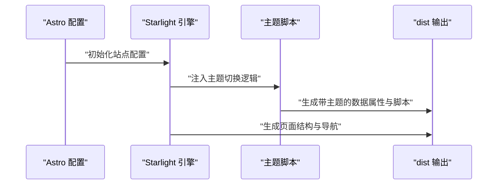
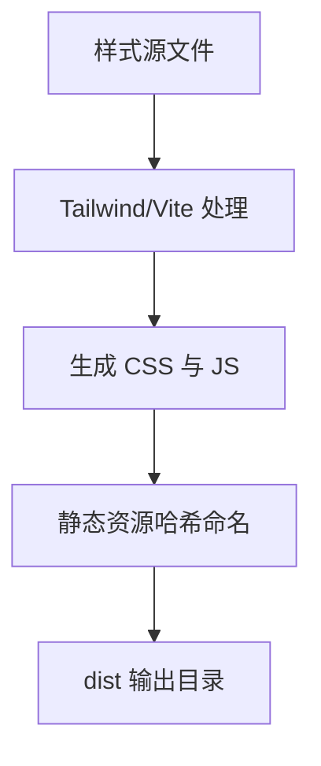
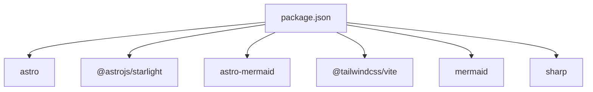

# 站点构建流程

<cite>
**本文引用的文件**
- [astro.config.mjs](file://astro.config.mjs)
- [package.json](file://package.json)
- [tsconfig.json](file://tsconfig.json)
- [src/content.config.ts](file://src/content.config.ts)
- [src/content/docs/index.mdx](file://src/content/docs/index.mdx)
- [src/content/docs/tools/ai-coding/index.md](file://src/content/docs/tools/ai-coding/index.md)
- [src/content/docs/domains/backend/index.md](file://src/content/docs/domains/backend/index.md)
- [src/content/docs/methods/learning/index.md](file://src/content/docs/methods/learning/index.md)
- [src/styles/custom.css](file://src/styles/custom.css)
- [dist/index.html](file://dist/index.html)
</cite>

## 目录
1. [简介](#简介)
2. [项目结构](#项目结构)
3. [核心组件](#核心组件)
4. [架构总览](#架构总览)
5. [详细组件分析](#详细组件分析)
6. [依赖分析](#依赖分析)
7. [性能考量](#性能考量)
8. [故障排查指南](#故障排查指南)
9. [结论](#结论)
10. [附录](#附录)

## 简介
本文件面向 StudyBuddy 项目的站点构建流程，系统化阐述从 Markdown 文件到最终静态网站的完整构建过程。重点覆盖 Astro 构建器的处理阶段：Markdown 解析、Mermaid 图表渲染、HTML 生成与资源优化；并详细解释配置文件的作用与构建参数设置，以及静态资源处理、图片优化与代码分割等性能优化策略。文末提供构建流程图与资源处理时序图，帮助读者清晰把握每个阶段的输入输出与处理逻辑。

## 项目结构
项目采用 Astro + Starlight 的文档站点架构，内容以 Markdown/MDX 为主，通过内容集合加载器统一管理，并由 TailwindCSS 与自定义样式进行主题化与美化。构建产物位于 dist 目录，包含首页、分类页面、静态资源与搜索索引等。

**图表来源**
- [astro.config.mjs](file://astro.config.mjs#L9-L39)
- [src/content.config.ts](file://src/content.config.ts#L1-L8)

**章节来源**
- [astro.config.mjs](file://astro.config.mjs#L9-L39)
- [src/content.config.ts](file://src/content.config.ts#L5-L7)
- [tsconfig.json](file://tsconfig.json#L1-L6)

## 核心组件
- 构建配置与集成
  - Astro 配置文件启用 Starlight 文档站点与 Mermaid 图表插件，并通过 Vite 集成 TailwindCSS 插件。
  - 内容配置通过内容集合加载器与 Schema 定义，统一管理文档内容。
- 内容与页面
  - 首页采用 MDX，包含 Hero 区域、分类卡片与原则展示，内嵌自定义样式。
  - 分类目录下各主题文档采用 Markdown，标题与描述用于 SEO 与导航生成。
- 样式与主题
  - 自定义 CSS 覆盖 Starlight 组件样式，适配深浅主题切换与响应式布局。
- 构建脚本
  - 通过 npm scripts 调用 Astro CLI 执行开发、构建与预览。

**章节来源**
- [astro.config.mjs](file://astro.config.mjs#L9-L39)
- [src/content.config.ts](file://src/content.config.ts#L5-L7)
- [src/content/docs/index.mdx](file://src/content/docs/index.mdx#L1-L195)
- [src/styles/custom.css](file://src/styles/custom.css#L315-L328)
- [package.json](file://package.json#L5-L11)

## 架构总览
下图展示了从 Markdown 到静态站点的端到端构建路径，涵盖解析、渲染、生成与优化四个阶段。

**图表来源**
- [astro.config.mjs](file://astro.config.mjs#L9-L39)
- [src/content.config.ts](file://src/content.config.ts#L5-L7)
- [src/content/docs/index.mdx](file://src/content/docs/index.mdx#L1-L195)
- [src/styles/custom.css](file://src/styles/custom.css#L315-L328)

## 详细组件分析

### Markdown 解析与内容加载
- 内容集合加载
  - 通过内容集合加载器与 Schema，统一读取 docs 目录下的 Markdown/MDX 文档，生成可查询的内容模型。
- 页面模板与 Frontmatter
  - 首页使用 MDX，配合 Hero、卡片与样式区块；各分类页采用 Markdown，标题与描述用于 SEO 与导航生成。
- 处理逻辑
  - Astro 在构建期扫描内容集合，解析 Frontmatter，渲染 Markdown/MDX，注入 Starlight 组件与布局。

**图表来源**
- [src/content.config.ts](file://src/content.config.ts#L5-L7)
- [src/content/docs/index.mdx](file://src/content/docs/index.mdx#L1-L195)
- [src/content/docs/tools/ai-coding/index.md](file://src/content/docs/tools/ai-coding/index.md#L1-L7)
- [src/content/docs/domains/backend/index.md](file://src/content/docs/domains/backend/index.md#L1-L7)
- [src/content/docs/methods/learning/index.md](file://src/content/docs/methods/learning/index.md#L1-L7)

**章节来源**
- [src/content.config.ts](file://src/content.config.ts#L5-L7)
- [src/content/docs/index.mdx](file://src/content/docs/index.mdx#L1-L195)
- [src/content/docs/tools/ai-coding/index.md](file://src/content/docs/tools/ai-coding/index.md#L1-L7)
- [src/content/docs/domains/backend/index.md](file://src/content/docs/domains/backend/index.md#L1-L7)
- [src/content/docs/methods/learning/index.md](file://src/content/docs/methods/learning/index.md#L1-L7)

### Mermaid 图表渲染
- 集成方式
  - 通过 Astro 配置启用 Mermaid 插件，实现 Markdown 中 Mermaid 代码块的渲染。
- 样式适配
  - 自定义 CSS 为渲染容器提供背景、圆角、阴影与深浅主题兼容，确保图表在不同主题下一致呈现。
- 渲染流程
  - 构建期解析 Markdown，识别 Mermaid 代码块，调用 Mermaid 渲染引擎生成 SVG，再注入到页面中。

**图表来源**
- [astro.config.mjs](file://astro.config.mjs#L33-L33)
- [src/styles/custom.css](file://src/styles/custom.css#L315-L328)

**章节来源**
- [astro.config.mjs](file://astro.config.mjs#L33-L33)
- [src/styles/custom.css](file://src/styles/custom.css#L315-L328)

### HTML 生成与主题系统
- Starlight 集成
  - 配置标题、默认语言、多语言标签、侧边栏自动生成与自定义 CSS，驱动文档站点的整体外观与导航。
- 主题切换
  - 构建产物中包含主题切换脚本与图标模板，运行时根据用户偏好或系统设置更新页面主题。
- 页面结构
  - 首页包含 Hero、分类卡片与原则展示，页面内容区域由 Starlight Markdown 渲染器生成。

**图表来源**
- [astro.config.mjs](file://astro.config.mjs#L10-L33)
- [dist/index.html](file://dist/index.html#L1-L55)

**章节来源**
- [astro.config.mjs](file://astro.config.mjs#L10-L33)
- [dist/index.html](file://dist/index.html#L1-L55)

### 资源优化与打包
- 样式优化
  - 通过 TailwindCSS 插件与自定义 CSS，实现按需样式与主题化组件覆盖，减少冗余样式体积。
- 资源打包
  - 构建产物包含按需加载的 CSS 与 JS，以及按哈希命名的静态资源目录，便于缓存与版本控制。
- 图片与媒体
  - 项目依赖 sharp，可用于图片优化与格式转换，建议在内容中使用现代格式（如 WebP）并结合懒加载策略提升性能。

**图表来源**
- [astro.config.mjs](file://astro.config.mjs#L36-L38)
- [src/styles/custom.css](file://src/styles/custom.css#L1-L485)
- [dist/index.html](file://dist/index.html#L27-L34)

**章节来源**
- [astro.config.mjs](file://astro.config.mjs#L36-L38)
- [src/styles/custom.css](file://src/styles/custom.css#L1-L485)
- [dist/index.html](file://dist/index.html#L27-L34)

## 依赖分析
- 运行时与构建依赖
  - Astro 核心、Starlight 文档站点、Mermaid 图表渲染、TailwindCSS Vite 插件与 sharp 图片处理。
- 脚本与命令
  - 通过 npm scripts 调用 Astro CLI，支持开发、构建与预览。

**图表来源**
- [package.json](file://package.json#L12-L20)

**章节来源**
- [package.json](file://package.json#L12-L20)

## 性能考量
- 代码分割与按需加载
  - 构建产物中存在按需加载的脚本与样式，有助于首屏加载性能。
- 图片优化
  - 建议优先使用 WebP 等现代格式，并结合懒加载与尺寸适配，降低带宽占用。
- 样式与主题
  - 自定义 CSS 与主题切换脚本已内联至页面，减少额外请求；保持样式粒度合理，避免重复与冗余。
- 搜索与索引
  - 构建产物包含搜索索引目录，建议在生产环境开启缓存与压缩，提升搜索响应速度。

[本节为通用性能建议，不直接分析具体文件，故无“章节来源”]

## 故障排查指南
- 构建失败或样式异常
  - 检查内容 Frontmatter 是否完整，确认内容集合加载器与 Schema 配置正确。
  - 确认自定义 CSS 覆盖规则未被主题变量覆盖，必要时调整层叠顺序。
- Mermaid 图表未渲染
  - 确认已启用 Mermaid 插件，检查 Markdown 中代码块语法是否符合 Mermaid 规范。
- 主题切换无效
  - 检查主题脚本是否正确注入，确认本地存储与系统偏好设置逻辑正常。
- 资源加载错误
  - 核对 dist 目录中的静态资源路径与哈希命名，确保 CDN 或服务器配置正确。

**章节来源**
- [src/content.config.ts](file://src/content.config.ts#L5-L7)
- [src/styles/custom.css](file://src/styles/custom.css#L315-L328)
- [dist/index.html](file://dist/index.html#L1-L55)

## 结论
StudyBuddy 的站点构建流程以 Astro 为核心，借助 Starlight 实现文档站点的高效生成，通过 Mermaid 插件增强可视化表达，并以 TailwindCSS 与自定义样式实现主题化与响应式体验。构建产物结构清晰、资源按需加载，具备良好的可维护性与扩展性。后续可在图片优化、缓存策略与搜索性能方面进一步完善。

## 附录
- 构建命令
  - 开发：npm run dev
  - 构建：npm run build
  - 预览：npm run preview
- 关键配置参考
  - Astro 配置：集成 Starlight、Mermaid 与 Tailwind/Vite
  - 内容配置：定义内容集合与加载器
  - 样式覆盖：Mermaid 图表容器样式与主题适配

**章节来源**
- [package.json](file://package.json#L5-L11)
- [astro.config.mjs](file://astro.config.mjs#L9-L39)
- [src/content.config.ts](file://src/content.config.ts#L5-L7)
- [src/styles/custom.css](file://src/styles/custom.css#L315-L328)