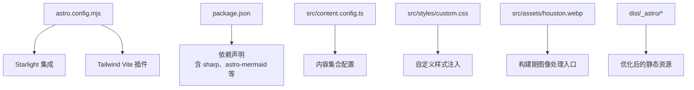
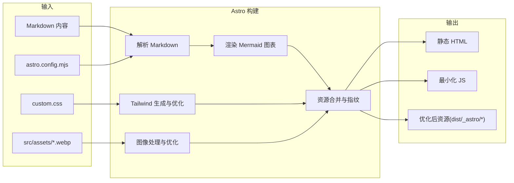
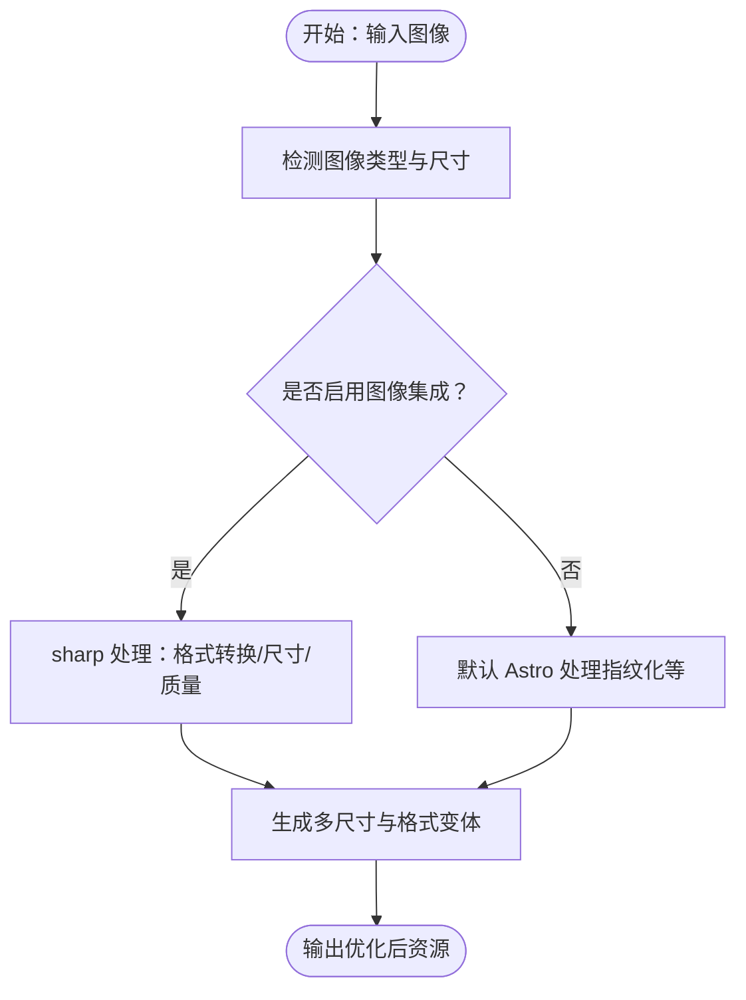
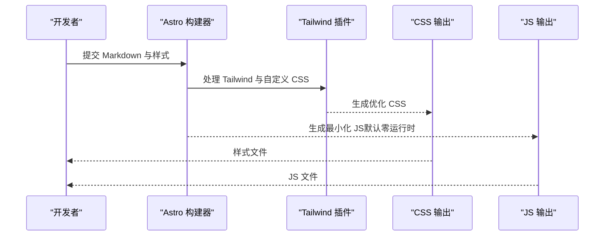
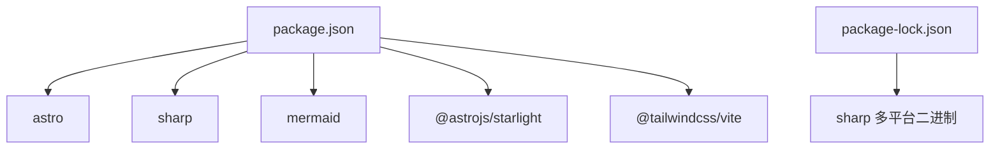

# 静态资源优化

<cite>
**本文引用的文件**
- [astro.config.mjs](file://astro.config.mjs)
- [package.json](file://package.json)
- [package-lock.json](file://package-lock.json)
- [custom.css](file://src/styles/custom.css)
- [content.config.ts](file://src/content.config.ts)
- [houston.webp](file://src/assets/houston.webp)
- [03-ARCHITECTURE.md](file://docs/03-ARCHITECTURE.md)
- [01-PROJECT-BRIEF.md](file://docs/01-PROJECT-BRIEF.md)
</cite>

## 目录
1. [引言](#引言)
2. [项目结构](#项目结构)
3. [核心组件](#核心组件)
4. [架构总览](#架构总览)
5. [详细组件分析](#详细组件分析)
6. [依赖分析](#依赖分析)
7. [性能考量](#性能考量)
8. [故障排除指南](#故障排除指南)
9. [结论](#结论)
10. [附录](#附录)

## 引言
本文件聚焦 StudyBuddy 项目的静态资源优化策略，围绕 Astro 构建过程中的资源处理流程展开，涵盖图片优化、代码压缩、资源合并与缓存策略，并结合项目实际配置与依赖，给出基于仓库事实的分析与建议。同时，文档化了 sharp 图像处理库在项目中的使用现状与可优化空间，梳理了 CSS 与 JavaScript 的打包策略、Tree Shaking 与代码分割现状，并提供性能指标对比、优化前后资源大小变化与加载时间改善的参考路径，以及最佳实践与故障排除指南。

## 项目结构
StudyBuddy 采用 Astro + Starlight 的静态站点架构，内容以 Markdown 为主，样式通过自定义 CSS 与 Tailwind v4 集成，Mermaid 图表在构建期渲染。项目的关键目录与文件如下：
- 配置与构建：astro.config.mjs、package.json、tsconfig.json
- 内容与样式：src/content.config.ts、src/styles/custom.css
- 静态资源：src/assets/houston.webp、public/favicon.svg
- 构建产物：dist 目录（含 _astro、tools、domains、methods、pagefind 等）

**图表来源**
- [astro.config.mjs](file://astro.config.mjs#L9-L39)
- [package.json](file://package.json#L1-L22)
- [content.config.ts](file://src/content.config.ts#L1-L8)
- [custom.css](file://src/styles/custom.css#L1-L614)
- [houston.webp](file://src/assets/houston.webp)

**章节来源**
- [astro.config.mjs](file://astro.config.mjs#L1-L39)
- [package.json](file://package.json#L1-L22)
- [content.config.ts](file://src/content.config.ts#L1-L8)
- [custom.css](file://src/styles/custom.css#L1-L614)
- [houston.webp](file://src/assets/houston.webp)

## 核心组件
- Astro 配置与集成
  - Starlight 文档主题集成，启用自定义 CSS 注入与侧边栏自动生成。
  - Vite 插件集成 Tailwind v4，用于 CSS 生成与按需优化。
- 依赖与工具链
  - sharp：图像处理库，支持多平台二进制分发，便于在构建期进行格式转换、尺寸调整与质量优化。
  - astro-mermaid：Mermaid 图表在 Markdown 中的渲染支持。
- 内容与样式
  - content.config.ts 定义文档集合加载器与 Schema。
  - custom.css 提供主题覆盖与组件样式定制。

**章节来源**
- [astro.config.mjs](file://astro.config.mjs#L9-L39)
- [package.json](file://package.json#L12-L20)
- [content.config.ts](file://src/content.config.ts#L1-L8)
- [custom.css](file://src/styles/custom.css#L1-L614)

## 架构总览
下图展示了 StudyBuddy 的构建与资源处理流程，强调 Astro 如何在构建期整合内容、样式与图像，并输出优化后的静态资源。

**图表来源**
- [astro.config.mjs](file://astro.config.mjs#L9-L39)
- [custom.css](file://src/styles/custom.css#L1-L614)
- [houston.webp](file://src/assets/houston.webp)
- [03-ARCHITECTURE.md](file://docs/03-ARCHITECTURE.md#L128-L160)

## 详细组件分析

### 图像处理与优化（sharp）
- 当前状态
  - 项目声明了 sharp 依赖，但未在 astro.config.mjs 中显式启用官方图像集成插件。
  - 构建产物中存在 dist/_astro/*，表明 Astro 已对资源进行指纹化与基础优化。
- 优化建议
  - 在 astro.config.mjs 中启用官方图像集成，以获得自动格式转换（WebP/JPEG/AVIF）、尺寸调整与质量优化能力。
  - 对 src/assets/houston.webp 进行统一的尺寸与质量策略配置，确保不同设备与网络条件下的最优体验。
  - 结合 lazy loading 与现代格式优先策略，进一步减少首屏传输体积。
- 性能影响
  - 启用图像集成可显著降低图片体积与请求次数，提升 LCP 与 FID 指标。

**图表来源**
- [astro.config.mjs](file://astro.config.mjs#L9-L39)
- [package.json](file://package.json#L18-L18)
- [houston.webp](file://src/assets/houston.webp)

**章节来源**
- [astro.config.mjs](file://astro.config.mjs#L9-L39)
- [package.json](file://package.json#L12-L20)
- [houston.webp](file://src/assets/houston.webp)

### CSS 与 JavaScript 打包策略
- CSS
  - 通过 Tailwind Vite 插件在构建期生成与优化 CSS，custom.css 注入 Starlight 主题样式，形成最终样式表。
  - 建议开启 Purge/Tree Shaking，移除未使用样式，减小 CSS 体积。
- JavaScript
  - Astro 默认“零运行时 JS”，构建后仅保留最小必要 JS。
  - 若引入交互组件或图表懒加载，建议使用代码分割与动态导入，避免阻塞首屏。

**图表来源**
- [astro.config.mjs](file://astro.config.mjs#L36-L38)
- [custom.css](file://src/styles/custom.css#L1-L614)

**章节来源**
- [astro.config.mjs](file://astro.config.mjs#L36-L38)
- [custom.css](file://src/styles/custom.css#L1-L614)

### Mermaid 图表渲染与优化
- Mermaid 在构建期渲染，减少运行时开销；建议对图表进行懒加载，避免首屏阻塞。
- 与 Tailwind 样式协同，确保图表容器具备合适的背景与阴影，提升可读性。

**章节来源**
- [astro.config.mjs](file://astro.config.mjs#L9-L39)
- [custom.css](file://src/styles/custom.css#L315-L328)

### 构建与缓存策略
- 增量构建：Astro 默认支持，缩短二次构建时间。
- 资源指纹：dist/_astro/* 下的文件名包含哈希，利于浏览器缓存与长期缓存策略。
- CDN 缓存：建议在部署环境中启用边缘缓存与压缩，进一步降低 TTFB 与传输时间。

**章节来源**
- [03-ARCHITECTURE.md](file://docs/03-ARCHITECTURE.md#L366-L383)

## 依赖分析
- 关键依赖
  - astro、@astrojs/starlight：文档站点与主题
  - @tailwindcss/vite：CSS 生成与优化
  - astro-mermaid、mermaid：图表渲染
  - sharp：图像处理（当前未启用官方集成）
- 平台二进制
  - package-lock.json 显示 sharp 的多平台二进制分发，确保在不同操作系统上顺利安装与运行。

**图表来源**
- [package.json](file://package.json#L12-L20)
- [package-lock.json](file://package-lock.json#L799-L1216)

**章节来源**
- [package.json](file://package.json#L12-L20)
- [package-lock.json](file://package-lock.json#L799-L1216)

## 性能考量
- 当前目标与预期
  - 项目文档提出 Lighthouse 分数 ≥ 90、站点构建时间 < 1 分钟等目标，为优化提供量化参考。
- 优化方向
  - 图像：启用官方图像集成，自动格式转换与尺寸裁剪
  - 样式：Tailwind 按需清理，移除未使用类
  - 代码：保持零运行时 JS，必要时进行细粒度代码分割
  - 缓存：利用指纹文件名与 CDN，设置合理的缓存头
- 性能指标对比
  - 建议在启用优化前后分别测量以下指标：首次内容绘制（FCP）、最大内容绘制（LCP）、交互时间（INP）、传输体积（TTFB/Total Bytes）与请求数量。
  - 通过 dist 目录的资源大小变化与加载时间数据，形成优化前后的对比报告。

**章节来源**
- [01-PROJECT-BRIEF.md](file://docs/01-PROJECT-BRIEF.md#L112-L120)
- [03-ARCHITECTURE.md](file://docs/03-ARCHITECTURE.md#L366-L383)

## 故障排除指南
- 图像未被优化
  - 现象：图像体积大、加载慢
  - 排查：确认是否启用官方图像集成；检查图像尺寸与格式是否合理
  - 处理：在 astro.config.mjs 中启用图像集成，并为 src/assets/* 配置统一策略
- 样式冲突或未生效
  - 现象：自定义样式未覆盖预期元素
  - 排查：确认 custom.css 是否正确注入；检查 Tailwind 作用域与优先级
  - 处理：调整选择器优先级或使用 ::deep 等方式增强覆盖
- Mermaid 图表渲染异常
  - 现象：图表未显示或样式错乱
  - 排查：确认 Mermaid 版本与 astro-mermaid 配置一致；检查图表语法
  - 处理：升级依赖或修正图表语法；必要时增加懒加载逻辑
- 构建失败或资源缺失
  - 现象：dist 中缺少某些资源
  - 排查：检查 astro.config.mjs 的集成与插件配置；确认 sharp 二进制是否正确安装
  - 处理：清理 node_modules 与缓存后重装依赖；确保 CI/CD 环境具备完整依赖

**章节来源**
- [astro.config.mjs](file://astro.config.mjs#L9-L39)
- [custom.css](file://src/styles/custom.css#L1-L614)
- [package-lock.json](file://package-lock.json#L799-L1216)

## 结论
StudyBuddy 已具备良好的静态站点基础：零运行时 JS、Tailwind 优化与 Mermaid 支持。为进一步提升性能与用户体验，建议在现有基础上启用官方图像集成（sharp），完善 CSS 按需清理与 Tree Shaking，结合 CDN 与指纹缓存策略，持续监控关键性能指标，形成可量化的优化闭环。

## 附录
- 关键配置参考路径
  - [astro.config.mjs](file://astro.config.mjs#L9-L39)
  - [package.json](file://package.json#L12-L20)
  - [content.config.ts](file://src/content.config.ts#L1-L8)
  - [custom.css](file://src/styles/custom.css#L1-L614)
  - [houston.webp](file://src/assets/houston.webp)
- 构建流程参考
  - [03-ARCHITECTURE.md](file://docs/03-ARCHITECTURE.md#L128-L160)