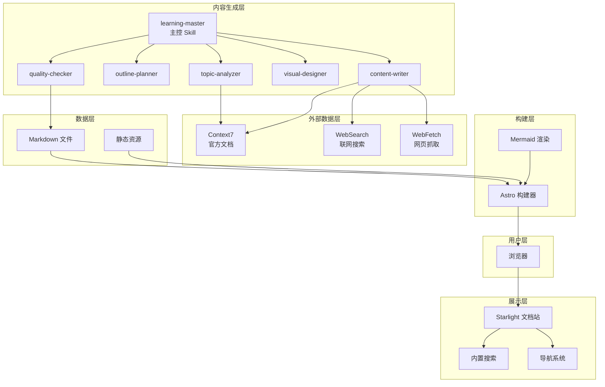
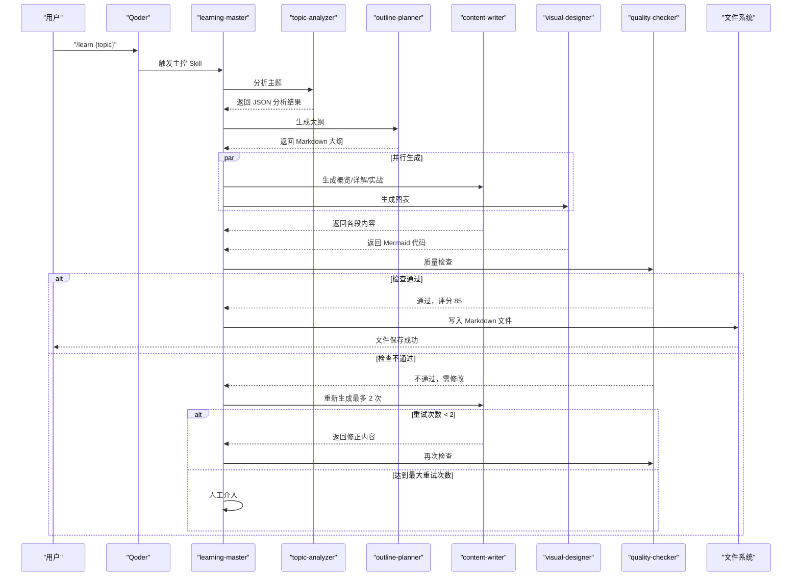
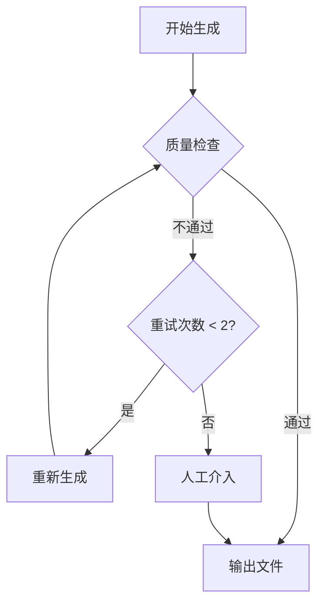
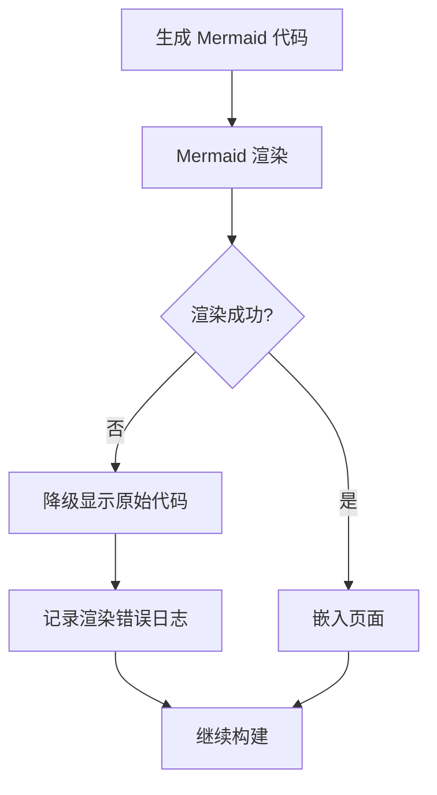
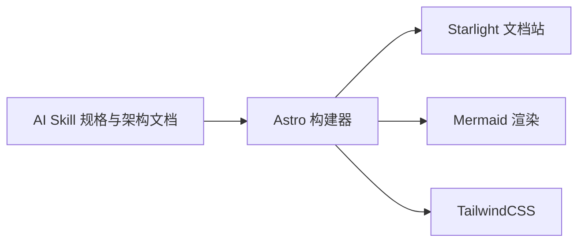

# 错误处理与恢复

<cite>
**本文引用的文件**
- [docs/03-ARCHITECTURE.md](file://docs/03-ARCHITECTURE.md)
- [docs/04-AI-SKILL-SPEC.md](file://docs/04-AI-SKILL-SPEC.md)
- [astro.config.mjs](file://astro.config.mjs)
- [package.json](file://package.json)
- [tsconfig.json](file://tsconfig.json)
</cite>

## 目录
1. [简介](#简介)
2. [项目结构](#项目结构)
3. [核心组件](#核心组件)
4. [架构总览](#架构总览)
5. [详细组件分析](#详细组件分析)
6. [依赖分析](#依赖分析)
7. [性能考虑](#性能考虑)
8. [故障排查指南](#故障排查指南)
9. [结论](#结论)
10. [附录](#附录)

## 简介
本文件面向 StudyBuddy 项目，系统化梳理错误处理与恢复机制，覆盖内容生成链路中的网络请求失败、AI 生成错误、文件写入异常、Mermaid 渲染失败、超时等场景，并给出重试机制、降级策略、故障转移、质量检查自动修复与人工干预流程、日志记录规范与调试指南，以及最佳实践与监控告警建议。内容基于仓库中已有的规格与架构文档进行归纳与扩展，确保可落地、可追踪、可复现。

## 项目结构
StudyBuddy 采用文档驱动的静态站点生成架构，前端由 Astro + Starlight 承载，Mermaid 图表通过插件集成；内容生成链路由一组 AI Skill 协同完成，最终产物为 Markdown 文件并由 Astro 构建为静态页面。与错误处理相关的关键位置如下：
- 文档生成与质量检查：位于 AI Skill 规格文档中，定义了错误类型、回退流程与评分标准
- 构建与渲染：位于架构文档与 Astro 配置中，明确了 Mermaid 渲染与构建流程
- 项目依赖与类型：位于 package.json 与 tsconfig.json，为错误定位与类型安全提供基础

**图表来源**
- [docs/03-ARCHITECTURE.md](file://docs/03-ARCHITECTURE.md#L12-L69)

**章节来源**
- [docs/03-ARCHITECTURE.md](file://docs/03-ARCHITECTURE.md#L164-L221)

## 核心组件
- 主控 Skill（learning-master）：负责编排 Analyzer、Planner、Writer、Designer、Checker 的调用顺序与数据流转
- 质量检查（quality-checker）：对生成内容进行评分与结构/格式/Mermaid 语法检查，决定是否重试或人工介入
- Mermaid 集成：通过 Astro 配置启用 remark-mermaid 插件，支持多种图表类型
- 构建层（Astro）：解析 Markdown、渲染 Mermaid、生成 HTML 与优化资源

上述组件在错误处理与恢复中承担以下职责：
- 主控层：根据质量检查结果触发重试或人工介入
- 质量检查层：定义错误类型与阈值，输出评分与改进建议
- Mermaid 渲染层：作为静态站点渲染的一部分，出现语法错误时应降级显示或回退到文本提示
- 构建层：捕获渲染异常并输出可诊断信息

**章节来源**
- [docs/03-ARCHITECTURE.md](file://docs/03-ARCHITECTURE.md#L242-L275)
- [astro.config.mjs](file://astro.config.mjs#L246-L264)

## 架构总览
下图展示了从用户触发到内容产出与质量检查的整体流程，以及错误发生时的回退路径。

**图表来源**
- [docs/03-ARCHITECTURE.md](file://docs/03-ARCHITECTURE.md#L86-L126)

## 详细组件分析

### 质量检查与回退流程
质量检查层负责对生成内容进行评分与结构/格式/Mermaid 语法检查，依据评分与问题严重程度决定后续动作。回退流程如下：

- 错误类型与处理策略
  - 分析失败：主题过于模糊，提示用户细化主题
  - 大纲不完整：缺少必要章节，自动补充
  - 内容质量低：评分 < 80，重新生成（最多 2 次）
  - 图表语法错误：Mermaid 解析失败，简化图表结构
  - 超时：生成时间 > 60s，返回部分结果

- 质量检查评分维度（节选）
  - 结构检查（40 分）：章节完整性、逻辑连贯性
  - 内容检查（40 分）：定义清晰、类比恰当、示例可运行、速查表实用
  - 格式检查（20 分）：Markdown 语法、表格规范、Mermaid 语法

- 输出 Schema（节选）
  - score：总分
  - passed：是否通过
  - breakdown：各项得分明细
  - issues：问题列表（含严重级别、位置、问题描述）
  - suggestions：改进建议

**图表来源**
- [docs/04-AI-SKILL-SPEC.md](file://docs/04-AI-SKILL-SPEC.md#L791-L800)

**章节来源**
- [docs/04-AI-SKILL-SPEC.md](file://docs/04-AI-SKILL-SPEC.md#L777-L800)
- [docs/04-AI-SKILL-SPEC.md](file://docs/04-AI-SKILL-SPEC.md#L629-L669)

### Mermaid 图表渲染与回退
Mermaid 通过 Astro 配置启用，支持多种图表类型。若生成的 Mermaid 语法存在错误，应采取降级策略：
- 渲染失败时保留原始 Mermaid 代码文本，避免破坏页面结构
- 记录渲染错误日志，便于后续修复
- 在质量检查阶段对 Mermaid 语法进行严格校验，降低渲染失败概率

**图表来源**
- [docs/03-ARCHITECTURE.md](file://docs/03-ARCHITECTURE.md#L244-L275)
- [astro.config.mjs](file://astro.config.mjs#L246-L264)

**章节来源**
- [docs/03-ARCHITECTURE.md](file://docs/03-ARCHITECTURE.md#L242-L275)
- [astro.config.mjs](file://astro.config.mjs#L246-L264)

### 文件写入与构建阶段的错误处理
- 写入失败：当质量检查通过后，主控 Skill 将内容写入 Markdown 文件。若写入失败，应回滚到上一个稳定状态或提示人工干预
- 构建失败：Astro 构建过程中若遇到 Markdown 或 Mermaid 解析错误，应输出详细错误信息并停止构建，避免产出不完整页面

**章节来源**
- [docs/03-ARCHITECTURE.md](file://docs/03-ARCHITECTURE.md#L128-L160)

### 网络请求失败与外部服务异常
- 外部服务（Context7/WebSearch/WebFetch）可能因网络波动、接口限流或上游变更导致失败
- 建议策略
  - 重试：指数退避重试（例如 1s、2s、4s），最大重试次数 3 次
  - 超时：设置合理超时阈值（如 10s），超时后返回部分可用数据或降级提示
  - 降级：在无法获取最新信息时，使用缓存数据或默认模板继续生成
  - 告警：记录失败次数与错误码，超过阈值触发告警

**章节来源**
- [docs/04-AI-SKILL-SPEC.md](file://docs/04-AI-SKILL-SPEC.md#L777-L788)

### AI 生成错误与内容质量控制
- 生成错误：模型输出不符合预期（如结构错乱、语法错误、内容重复）
- 控制策略
  - 结构化 Prompt：明确输出格式与约束，减少歧义
  - 多轮校验：先生成概览，再生成详解与实战，逐段检查
  - 质量评分：基于结构、内容、格式三类指标打分，低于阈值触发重试
  - 人工干预：达到最大重试次数后，进入人工审核流程

**章节来源**
- [docs/04-AI-SKILL-SPEC.md](file://docs/04-AI-SKILL-SPEC.md#L629-L669)
- [docs/04-AI-SKILL-SPEC.md](file://docs/04-AI-SKILL-SPEC.md#L777-L800)

## 依赖分析
- Astro 配置
  - 集成 Starlight 与 Mermaid 插件，启用 remark-mermaid
  - TailwindCSS 作为样式工具链
- 依赖与类型
  - package.json 定义了核心依赖与脚本
  - tsconfig.json 继承 Astro 严格类型配置，提升类型安全

**图表来源**
- [astro.config.mjs](file://astro.config.mjs#L9-L39)
- [package.json](file://package.json#L12-L20)
- [tsconfig.json](file://tsconfig.json#L1-L6)

**章节来源**
- [astro.config.mjs](file://astro.config.mjs#L9-L39)
- [package.json](file://package.json#L12-L20)
- [tsconfig.json](file://tsconfig.json#L1-L6)

## 性能考虑
- 构建优化：Astro 默认支持增量构建、图片优化、代码分割，有助于缩短构建时间与提升首屏性能
- 运行时优化：静态生成、CDN 缓存、懒加载图表，减少运行时开销
- 错误处理对性能的影响：合理的重试与降级策略可避免长时间阻塞，提高系统稳定性

**章节来源**
- [docs/03-ARCHITECTURE.md](file://docs/03-ARCHITECTURE.md#L366-L383)

## 故障排查指南
- 日志记录规范
  - 错误类型：网络失败、AI 生成异常、文件写入失败、Mermaid 渲染失败、超时
  - 必填字段：时间戳、错误码、错误类型、受影响模块、请求上下文（如主题、章节）、重试次数、建议处理方式
  - 输出位置：控制台、文件日志、可观测平台（如日志服务）
- 调试步骤
  - 确认外部服务可用性与配额限制
  - 检查 Mermaid 语法与图表复杂度
  - 验证 Markdown 与 YAML Frontmatter 格式
  - 查看构建日志中的具体错误行号与堆栈
- 常见问题定位
  - Mermaid 渲染失败：优先简化图表结构，确认语法与节点命名
  - 质量检查未通过：根据评分明细与问题列表逐项修复
  - 超时：调整超时阈值或拆分生成任务

**章节来源**
- [docs/04-AI-SKILL-SPEC.md](file://docs/04-AI-SKILL-SPEC.md#L777-L788)
- [docs/03-ARCHITECTURE.md](file://docs/03-ARCHITECTURE.md#L128-L160)

## 结论
StudyBuddy 的错误处理与恢复机制以“质量检查”为核心，结合“重试—降级—人工干预”的三层策略，覆盖网络、AI 生成、文件写入与渲染等关键环节。通过严格的评分与问题清单，系统能够在自动化修复与人工审核之间取得平衡，保障内容质量与用户体验。建议在现有基础上完善监控告警与日志规范，持续优化重试与降级策略，提升系统的鲁棒性与可维护性。

## 附录
- 最佳实践
  - 明确错误分级与处理阈值，避免过度重试造成资源浪费
  - 在质量检查阶段尽早暴露问题，减少下游失败成本
  - 为关键路径提供降级方案，保证系统基本可用
  - 建立统一的日志规范与告警规则，缩短故障定位时间
- 监控告警建议
  - 指标：错误率、重试次数、平均响应时间、Mermaid 渲染失败率
  - 告警：错误率突增、重试次数达上限、构建失败、超时占比异常
  - 追踪：为每次生成任务分配唯一 ID，串联日志与指标，支持回溯分析