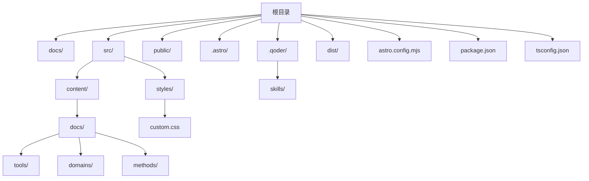
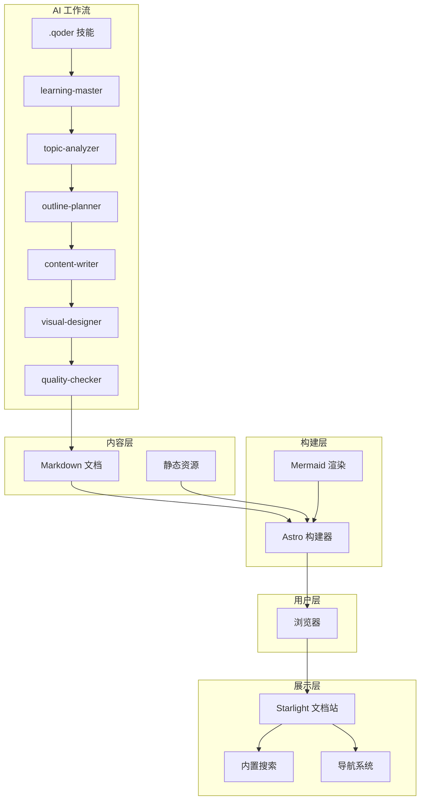
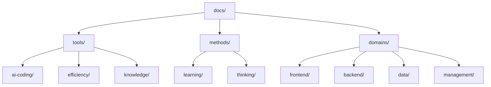
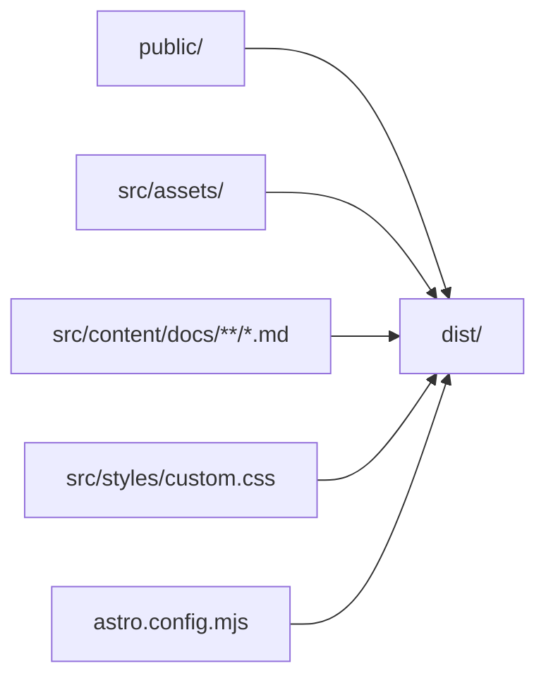
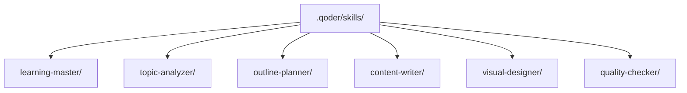
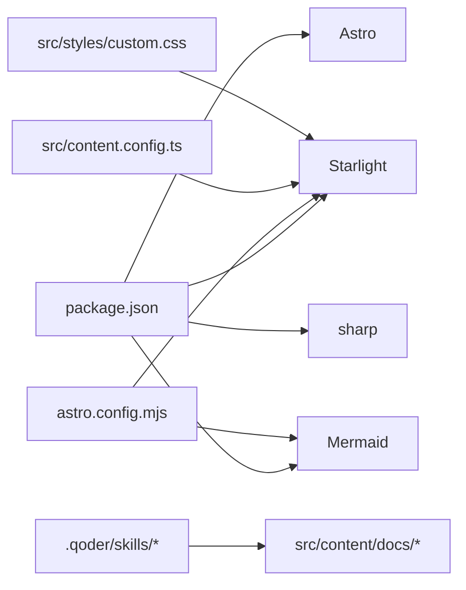

# 目录结构设计

<cite>
**本文档引用的文件**
- [package.json](file://package.json)
- [astro.config.mjs](file://astro.config.mjs)
- [src/content.config.ts](file://src/content.config.ts)
- [docs/01-PROJECT-BRIEF.md](file://docs/01-PROJECT-BRIEF.md)
- [docs/03-ARCHITECTURE.md](file://docs/03-ARCHITECTURE.md)
- [docs/04-AI-SKILL-SPEC.md](file://docs/04-AI-SKILL-SPEC.md)
- [src/styles/custom.css](file://src/styles/custom.css)
- [tsconfig.json](file://tsconfig.json)
- [dist/index.html](file://dist/index.html)
- [dist/favicon.svg](file://dist/favicon.svg)
- [public/favicon.svg](file://public/favicon.svg)
</cite>

## 目录

1. [引言](#引言)
2. [项目结构](#项目结构)
3. [核心组件](#核心组件)
4. [架构总览](#架构总览)
5. [详细组件分析](#详细组件分析)
6. [依赖分析](#依赖分析)
7. [性能考虑](#性能考虑)
8. [故障排除指南](#故障排除指南)
9. [结论](#结论)
10. [附录](#附录)

## 引言

本文件为 StudyBuddy 项目的目录结构设计文档，系统阐述项目的文件组织方式、文档分类体系、命名规范与布局原则，并对静态资源管理、配置文件组织与构建产物结构进行说明。文档面向开发者与内容作者，既提供高层概览也包含落地实施细节，帮助团队高效协作与持续演进。

## 项目结构

StudyBuddy 采用“静态文档站点 + AI 技能工作流”的双轨结构：前端通过 Astro + Starlight 提供文档浏览体验；后端通过 .qoder 目录下的技能（Skills）组织 AI 生成流程。核心目录与职责如下：

- docs：项目文档与规格说明，包含项目简介、架构设计、AI Skill 规格等
- src：Astro 项目源码，包含内容集合、样式与组件
- public：静态资源（如图标）
- .astro：Astro 内部缓存与类型定义
- .qoder：AI 技能工作流（Agents/Skills）
- dist：构建产物（静态站点）
- astro.config.mjs：Astro 配置（集成 Starlight、Mermaid）
- package.json：项目依赖与脚本
- tsconfig.json：TypeScript 配置

**图表来源**
- [astro.config.mjs](file://astro.config.mjs#L16-L29)
- [src/content.config.ts](file://src/content.config.ts#L5-L7)
- [src/styles/custom.css](file://src/styles/custom.css#L1-L402)

**章节来源**
- [astro.config.mjs](file://astro.config.mjs#L1-L34)
- [src/content.config.ts](file://src/content.config.ts#L1-L8)
- [package.json](file://package.json#L1-L20)
- [tsconfig.json](file://tsconfig.json#L1-L6)

## 核心组件

- 文档内容集合（Content Collections）
  - 通过 content config 定义 docs 集合，使用 Starlight 的 loader 与 schema，统一管理 Markdown 文档
- 导航与侧边栏（Sidebar）
  - 通过 Starlight 的 autogenerate 配置，自动从 tools、domains、methods 三个目录生成导航
- 主题与样式（Theme & Styles）
  - 自定义 CSS 提供现代化主题变量与组件样式（玻璃拟态、阴影、过渡动画等）
- Mermaid 集成
  - 通过 Astro 集成 Mermaid，支持在 Markdown 中直接渲染思维导图、流程图等
- 构建与预览
  - npm scripts 提供 dev/build/preview 命令，配合 Astro 静态生成

**章节来源**
- [src/content.config.ts](file://src/content.config.ts#L1-L8)
- [astro.config.mjs](file://astro.config.mjs#L8-L32)
- [src/styles/custom.css](file://src/styles/custom.css#L1-L402)
- [package.json](file://package.json#L5-L11)

## 架构总览

下图展示了 StudyBuddy 的整体架构：用户通过浏览器访问静态站点；内容来源于 Markdown 文档与静态资源；构建阶段由 Astro 完成，Mermaid 在渲染阶段被处理；AI 技能工作流位于 .qoder 目录，负责生成新的文档内容。

**图表来源**
- [docs/03-ARCHITECTURE.md](file://docs/03-ARCHITECTURE.md#L12-L69)
- [docs/04-AI-SKILL-SPEC.md](file://docs/04-AI-SKILL-SPEC.md#L23-L73)
- [astro.config.mjs](file://astro.config.mjs#L8-L32)

## 详细组件分析

### 文档分类体系与目录布局

StudyBuddy 采用三层分类体系：工具（tools）、领域（domains）、方法论（methods）。每个分类下进一步细分子目录，形成清晰的知识地图。

- 工具（tools）
  - ai-coding：AI 编程工具（如 Qoder、Cursor）
  - efficiency：效率工具（如 Docker、Git）
  - knowledge：知识管理工具（如 Obsidian）
- 领域（domains）
  - frontend：前端开发
  - backend：后端开发
  - data：数据科学
  - management：技术管理
- 方法论（methods）
  - learning：学习方法
  - thinking：思维框架

每个分类均以 index.md 作为入口，便于 Starlight 自动生成导航。

**图表来源**
- [docs/03-ARCHITECTURE.md](file://docs/03-ARCHITECTURE.md#L168-L221)

**章节来源**
- [docs/03-ARCHITECTURE.md](file://docs/03-ARCHITECTURE.md#L223-L240)

### 文件命名规范与目录布局原则

- 命名规范
  - 使用 kebab-case（短横线分隔）
  - 主题明确、避免缩写
  - 单词数量控制在 1-3 个
- 目录布局
  - 每个分类下以 index.md 作为目录入口
  - 子主题使用语义化文件名，便于检索与维护
  - 与 AI 技能的分类保持一致，便于自动化生成与路由

**章节来源**
- [docs/03-ARCHITECTURE.md](file://docs/03-ARCHITECTURE.md#L231-L239)

### 静态资源管理

- public 目录
  - 放置公开可访问的静态资源（如 favicon.svg），构建后直接复制到 dist 根目录
- dist 目录
  - 构建产物输出目录，包含静态 HTML、JS、图片与 pagefind 搜索索引
  - 包含 tools、domains、methods 等分类页面
- 资源优化
  - Astro 默认启用图片优化与代码分割，减少首屏加载时间
  - Mermaid 图表按需渲染，避免阻塞主线程

**图表来源**
- [astro.config.mjs](file://astro.config.mjs#L1-L34)
- [dist/index.html](file://dist/index.html)
- [dist/favicon.svg](file://dist/favicon.svg)
- [public/favicon.svg](file://public/favicon.svg)

**章节来源**
- [astro.config.mjs](file://astro.config.mjs#L1-L34)
- [dist/index.html](file://dist/index.html)
- [dist/favicon.svg](file://dist/favicon.svg)
- [public/favicon.svg](file://public/favicon.svg)

### 配置文件组织

- package.json
  - 定义项目名称、版本与脚本（dev/start/build/preview/astro）
  - 依赖 Astro、Starlight、Mermaid 等核心包
- astro.config.mjs
  - 集成 Starlight，配置默认语言、自定义 CSS、侧边栏自动生成
  - 集成 Mermaid 插件
- tsconfig.json
  - 基于 Astro 的严格 TS 配置，包含类型声明与排除 dist 目录

**章节来源**
- [package.json](file://package.json#L1-L20)
- [astro.config.mjs](file://astro.config.mjs#L1-L34)
- [tsconfig.json](file://tsconfig.json#L1-L6)

### 构建产物结构

- dist/_astro/：Astro 的内部资源缓存
- dist/tools/、dist/domains/、dist/methods/：分类页面
- dist/pagefind/：内置搜索索引
- dist/index.html、dist/404.html：首页与 404 页面
- dist/favicon.svg：站点图标

该结构由 Astro 在构建阶段自动生成，确保零运行时 JS 的静态站点体验。

**章节来源**
- [astro.config.mjs](file://astro.config.mjs#L1-L34)
- [dist/index.html](file://dist/index.html)
- [dist/favicon.svg](file://dist/favicon.svg)

### AI 技能工作流与 .qoder 目录

.qoder 目录用于存放 AI 技能（Skills），当前包含学习主控与六个子技能的定义目录。这些技能协同完成主题分析、大纲规划、内容撰写、图表生成与质量检查。

**图表来源**
- [docs/04-AI-SKILL-SPEC.md](file://docs/04-AI-SKILL-SPEC.md#L23-L73)

**章节来源**
- [docs/04-AI-SKILL-SPEC.md](file://docs/04-AI-SKILL-SPEC.md#L1-L838)

## 依赖分析

- 星际依赖
  - Astro：静态站点生成器
  - Starlight：文档主题与导航
  - Mermaid：Markdown 原生图表渲染
  - sharp：图片处理（优化）
- 内部耦合
  - astro.config.mjs 与 src/content.config.ts 共同决定内容集合与导航生成
  - src/styles/custom.css 与 Starlight 主题变量协同提供统一视觉风格
  - .qoder 技能与 docs 内容通过生成流程耦合

**图表来源**
- [package.json](file://package.json#L12-L18)
- [astro.config.mjs](file://astro.config.mjs#L8-L32)
- [src/content.config.ts](file://src/content.config.ts#L5-L7)
- [src/styles/custom.css](file://src/styles/custom.css#L1-L402)

**章节来源**
- [package.json](file://package.json#L1-L20)
- [astro.config.mjs](file://astro.config.mjs#L1-L34)
- [src/content.config.ts](file://src/content.config.ts#L1-L8)

## 性能考虑

- 构建优化
  - Astro 默认增量构建，显著缩短二次构建时间
  - 图片优化与代码分割，减少首屏 JS 体积
- 运行时优化
  - 零运行时 JS 的静态站点，提升加载速度
  - Mermaid 图表懒加载，避免阻塞渲染
- 搜索与导航
  - Starlight 内置搜索与侧边栏，减少额外依赖

**章节来源**
- [docs/03-ARCHITECTURE.md](file://docs/03-ARCHITECTURE.md#L366-L383)

## 故障排除指南

- 构建失败
  - 检查 astro.config.mjs 的集成配置与路径
  - 确认 src/content.config.ts 的集合定义正确
- 导航缺失
  - 确认 docs 下各分类目录存在 index.md
  - 检查 astro.config.mjs 的 autogenerate 配置
- 图表不显示
  - 确认 Mermaid 集成已启用
  - 检查 Markdown 中 Mermaid 代码块语法
- 资源 404
  - 确认 public 中的静态资源在构建后被复制到 dist 根目录
  - 检查 dist 目录结构是否完整

**章节来源**
- [astro.config.mjs](file://astro.config.mjs#L8-L32)
- [src/content.config.ts](file://src/content.config.ts#L5-L7)
- [docs/03-ARCHITECTURE.md](file://docs/03-ARCHITECTURE.md#L128-L160)
- [dist/index.html](file://dist/index.html)

## 结论

StudyBuddy 的目录结构围绕“文档优先、AI 协作、静态生成”三大目标展开：清晰的文档分类体系、完善的配置与构建流程、以及可扩展的 AI 技能工作流。该结构既满足当前需求，又为未来扩展（新增分类、技能与组件）提供了稳定基础。

## 附录

### 最佳实践

- 新增文档
  - 在对应分类下新建主题目录与 index.md
  - 使用明确的主题命名，遵循 kebab-case 与语义化原则
- 新增分类
  - 在 src/content/docs 下创建新目录并在 astro.config.mjs 的 sidebar 中注册
- 新增技能
  - 在 .qoder/skills 下创建新目录并编写 SKILL.md，注册到 learning-master
- 自定义组件
  - 在 src/components 下创建 .astro 文件并通过 MDX 引用

**章节来源**
- [docs/03-ARCHITECTURE.md](file://docs/03-ARCHITECTURE.md#L386-L406)

### 扩展指南

- 新增分类
  - 在 src/content/docs/ 下创建目录
  - 在 astro.config.mjs 的 sidebar.autogenerate 中添加入口
- 新增技能
  - 在 .qoder/skills/ 下创建目录并编写 SKILL.md
  - 在 learning-master 中注册调用
- 自定义组件
  - 在 src/components/ 下创建 .astro 文件
  - 在 Markdown 中通过 MDX 语法引用

**章节来源**
- [docs/03-ARCHITECTURE.md](file://docs/03-ARCHITECTURE.md#L386-L406)