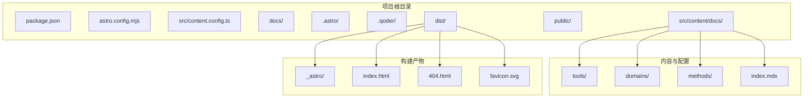
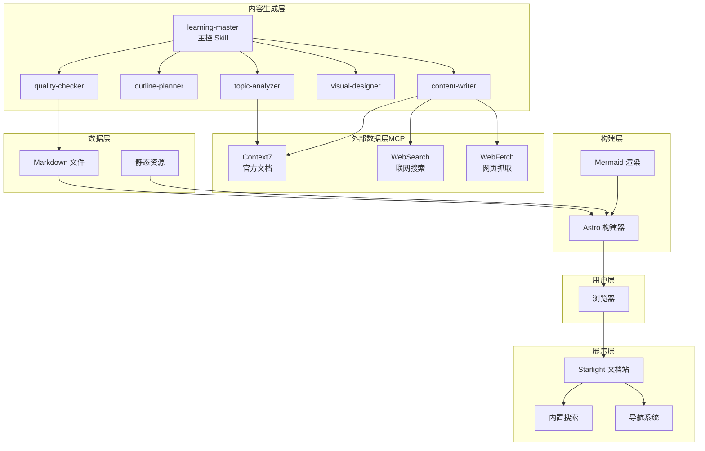
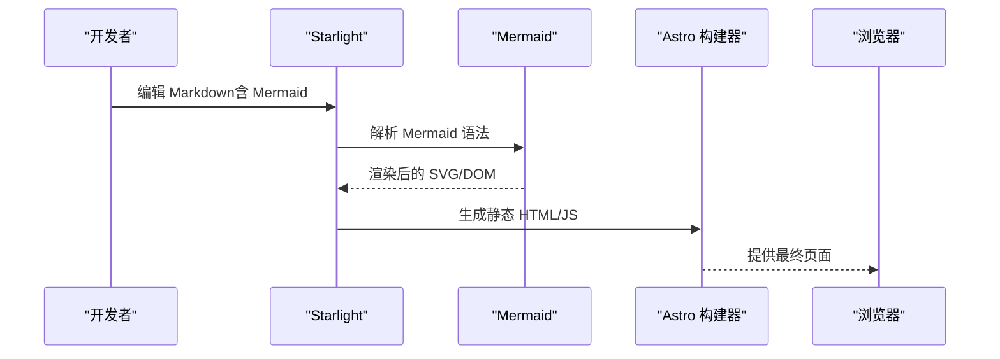
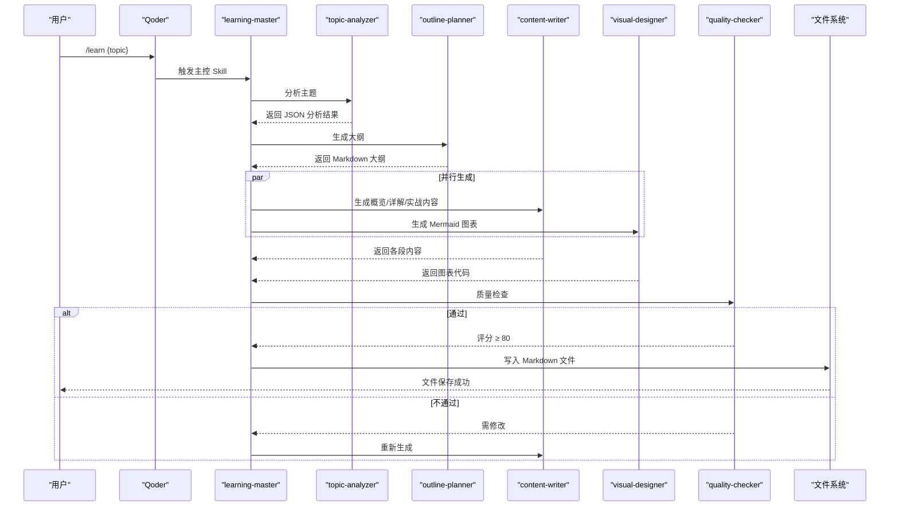
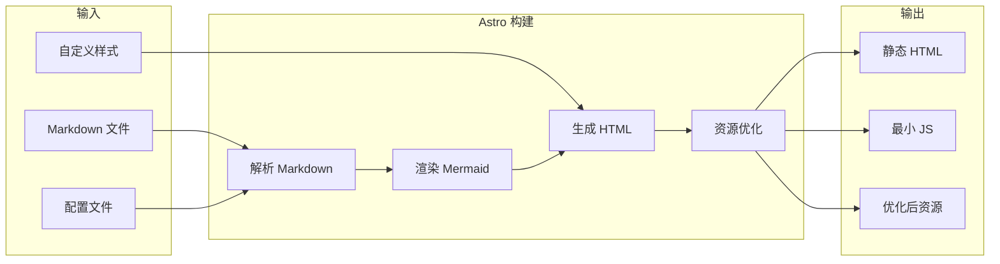
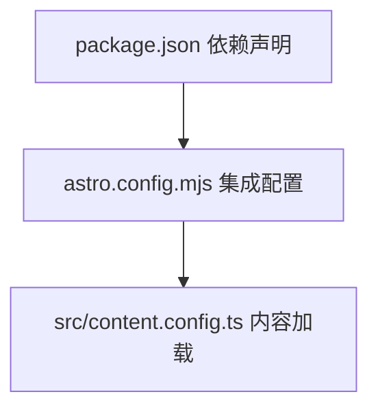
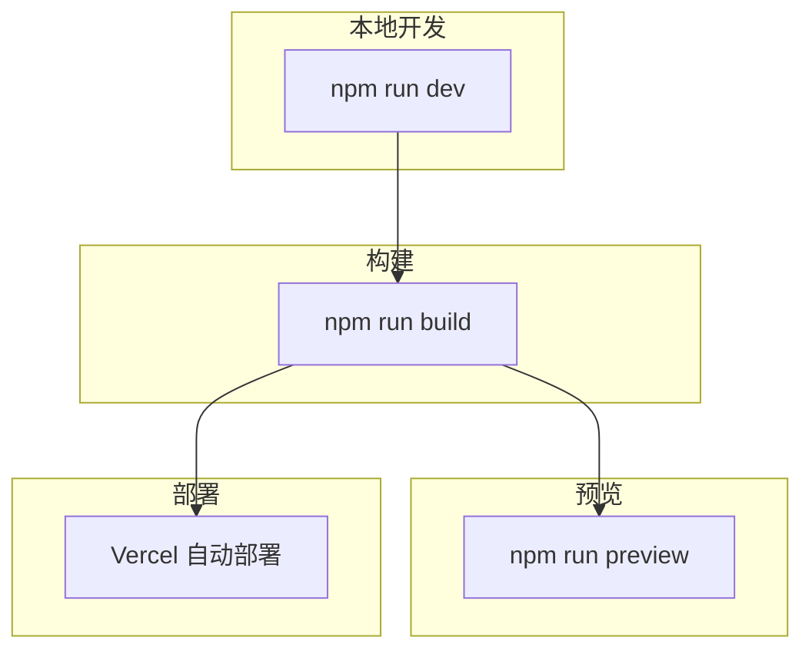

# 系统架构概览

<cite>
**本文引用的文件**
- [package.json](file://package.json)
- [astro.config.mjs](file://astro.config.mjs)
- [src/content.config.ts](file://src/content.config.ts)
- [docs/03-ARCHITECTURE.md](file://docs/03-ARCHITECTURE.md)
- [docs/01-PROJECT-BRIEF.md](file://docs/01-PROJECT-BRIEF.md)
- [docs/04-AI-SKILL-SPEC.md](file://docs/04-AI-SKILL-SPEC.md)
- [src/content/docs/tools/ai-coding/index.md](file://src/content/docs/tools/ai-coding/index.md)
- [src/content/docs/domains/frontend/index.md](file://src/content/docs/domains/frontend/index.md)
</cite>

## 目录
1. [引言](#引言)
2. [项目结构](#项目结构)
3. [核心组件](#核心组件)
4. [架构总览](#架构总览)
5. [详细组件分析](#详细组件分析)
6. [依赖关系分析](#依赖关系分析)
7. [性能考量](#性能考量)
8. [故障排查指南](#故障排查指南)
9. [结论](#结论)
10. [附录](#附录)

## 引言
本文件为 StudyBuddy 项目的系统架构概览文档，聚焦于分层架构设计、各层级职责、用户层/展示层/内容生成层/数据层/构建层之间的交互关系，以及 Astro 静态站点生成器与 Qoder AI 工具链的集成架构。文档同时给出系统边界、组件依赖关系与数据流向，并对技术选型进行理由阐述与替代方案对比，最后提供系统上下文图与部署拓扑说明。

## 项目结构
StudyBuddy 采用“内容即文档”的纯 Markdown 文档站点，结合 Astro 与 Starlight 构建静态站点；同时通过 Qoder AI 工具链（Skills + MCP）实现内容的自动化生成与质量控制。项目目录组织遵循“内容驱动 + 静态生成”的原则，便于版本控制与本地部署。

图表来源
- [astro.config.mjs](file://astro.config.mjs#L1-L34)
- [src/content.config.ts](file://src/content.config.ts#L1-L8)
- [docs/03-ARCHITECTURE.md](file://docs/03-ARCHITECTURE.md#L168-L221)

章节来源
- [astro.config.mjs](file://astro.config.mjs#L1-L34)
- [src/content.config.ts](file://src/content.config.ts#L1-L8)
- [docs/03-ARCHITECTURE.md](file://docs/03-ARCHITECTURE.md#L164-L240)

## 核心组件
- 用户层：浏览器访问静态站点，进行浏览、搜索与导航。
- 展示层：Starlight 文档站提供内置搜索、导航与主题样式；Mermaid 图表渲染增强可视化。
- 内容生成层：Qoder AI 工具链（Skills + MCP），围绕 learning-master 主控 Skill 协同完成主题分析、大纲规划、内容撰写、图表生成与质量检查。
- 数据层：纯 Markdown 文件与静态资源，统一存储于 src/content/docs 与 public。
- 构建层：Astro 构建器负责解析 Markdown、渲染 Mermaid、生成 HTML/JS/资源并优化输出至 dist。

章节来源
- [docs/03-ARCHITECTURE.md](file://docs/03-ARCHITECTURE.md#L10-L70)
- [astro.config.mjs](file://astro.config.mjs#L1-L34)
- [docs/04-AI-SKILL-SPEC.md](file://docs/04-AI-SKILL-SPEC.md#L19-L75)

## 架构总览
下图展示了 StudyBuddy 的分层架构与组件交互：用户通过浏览器访问 Starlight 文档站；内容由 Qoder AI 工具链生成并通过 Astro 构建为静态站点；Mermaid 图表在构建过程中被渲染并嵌入最终页面。

图表来源
- [docs/03-ARCHITECTURE.md](file://docs/03-ARCHITECTURE.md#L10-L70)
- [docs/04-AI-SKILL-SPEC.md](file://docs/04-AI-SKILL-SPEC.md#L19-L75)

章节来源
- [docs/03-ARCHITECTURE.md](file://docs/03-ARCHITECTURE.md#L82-L160)

## 详细组件分析

### 展示层：Starlight 文档站与 Mermaid 集成
- Starlight 作为 Astro 的文档主题，提供开箱即用的导航、搜索与代码高亮；通过 astro.config.mjs 配置侧边栏自动生成规则，映射到 tools/domains/methods 三大分类。
- Mermaid 通过 Astro 集成渲染，支持多种图表类型（思维导图、流程图、时序图、类图、状态图），在 Markdown 中以原生语法嵌入，便于 AI 直接生成与维护。

图表来源
- [astro.config.mjs](file://astro.config.mjs#L1-L34)
- [docs/03-ARCHITECTURE.md](file://docs/03-ARCHITECTURE.md#L244-L275)

章节来源
- [astro.config.mjs](file://astro.config.mjs#L1-L34)
- [docs/03-ARCHITECTURE.md](file://docs/03-ARCHITECTURE.md#L242-L320)

### 内容生成层：Qoder AI 工具链（Skills + MCP）
- learning-master 作为主控 Skill，协调 topic-analyzer、outline-planner、content-writer、visual-designer、quality-checker 完成三阶段学习文档的自动生成。
- MCP（Model Context Provider）工具链提供权威数据源：Context7（官方文档）、WebSearch（联网搜索）、WebFetch（网页抓取），确保内容时效性与准确性。
- 质量检查通过评分与检查清单保障输出质量，不达标时触发重试或人工介入。

图表来源
- [docs/03-ARCHITECTURE.md](file://docs/03-ARCHITECTURE.md#L86-L126)
- [docs/04-AI-SKILL-SPEC.md](file://docs/04-AI-SKILL-SPEC.md#L149-L202)

章节来源
- [docs/04-AI-SKILL-SPEC.md](file://docs/04-AI-SKILL-SPEC.md#L19-L127)

### 数据层：Markdown 与静态资源
- 内容以 Markdown 文件形式存储，配合 Front Matter（标题、描述、分类、难度等）统一元数据结构。
- 静态资源（图片、图标等）位于 public 目录，构建时由 Astro 优化并注入最终页面。

章节来源
- [src/content/docs/tools/ai-coding/index.md](file://src/content/docs/tools/ai-coding/index.md#L1-L7)
- [src/content/docs/domains/frontend/index.md](file://src/content/docs/domains/frontend/index.md#L1-L7)

### 构建层：Astro 静态生成
- Astro 负责解析 Markdown、渲染 Mermaid、生成 HTML/JS/资源并进行优化，最终输出到 dist 目录。
- 构建流程包含解析、渲染、生成与优化四个阶段，确保零运行时 JS 的静态站点体验。

图表来源
- [docs/03-ARCHITECTURE.md](file://docs/03-ARCHITECTURE.md#L128-L160)

章节来源
- [docs/03-ARCHITECTURE.md](file://docs/03-ARCHITECTURE.md#L128-L160)

## 依赖关系分析
- 星光主题与 Mermaid：通过 astro.config.mjs 集成 Starlight 与 Mermaid，使 Markdown 中的 Mermaid 语法在构建时被渲染。
- 内容加载：src/content.config.ts 使用 docsLoader 与 docsSchema，将 src/content/docs 下的 Markdown 统一加载为文档集合。
- 技术栈依赖：package.json 指定 Astro、Starlight、Mermaid 等核心依赖，保证构建与运行时的一致性。

图表来源
- [package.json](file://package.json#L1-L20)
- [astro.config.mjs](file://astro.config.mjs#L1-L34)
- [src/content.config.ts](file://src/content.config.ts#L1-L8)

章节来源
- [package.json](file://package.json#L1-L20)
- [astro.config.mjs](file://astro.config.mjs#L1-L34)
- [src/content.config.ts](file://src/content.config.ts#L1-L8)

## 性能考量
- 构建优化：Astro 默认支持增量构建、图片优化与代码分割，显著减少构建时间与首屏 JS。
- 运行时优化：静态生成带来零运行时 JS，CDN 缓存可将 TTFB 控制在较低水平；懒加载图表可进一步提升首屏速度。
- 质量与速度平衡：AI 生成流程设置生成时间上限与质量阈值，避免过长等待与低质量内容。

章节来源
- [docs/03-ARCHITECTURE.md](file://docs/03-ARCHITECTURE.md#L366-L383)
- [docs/04-AI-SKILL-SPEC.md](file://docs/04-AI-SKILL-SPEC.md#L174-L202)

## 故障排查指南
- Mermaid 渲染失败：检查图表语法是否正确，节点层级是否过深，Mermaid 版本与语法是否兼容。
- 内容质量不达标：查看质量检查报告中的分项得分与问题列表，针对性修改内容与速查表。
- 构建失败或资源缺失：确认 Markdown Front Matter 与路径正确，检查静态资源是否存在于 public 目录。
- AI 生成超时：适当简化主题或调整 MCP 调用策略，确保关键信息（版本号、API 参数等）来自权威数据源。

章节来源
- [docs/04-AI-SKILL-SPEC.md](file://docs/04-AI-SKILL-SPEC.md#L777-L800)
- [docs/03-ARCHITECTURE.md](file://docs/03-ARCHITECTURE.md#L366-L383)

## 结论
StudyBuddy 通过 Astro + Starlight 的静态站点架构与 Qoder AI 工具链的自动化内容生成，实现了“管理者视角”的知识体系构建与高效检索。分层架构清晰、职责边界明确，既满足本地使用与零维护的需求，又具备良好的扩展性与性能表现。未来可在新增分类、Skill 扩展与自定义组件方面继续演进，持续提升内容质量与用户体验。

## 附录

### 技术选型与替代方案对比
- 框架：Astro（零 JS 默认、构建速度快） vs Next.js/Gatsby（更复杂的运行时与构建配置）
- 主题：Starlight（开箱即用、MIT 协议） vs Docusaurus（功能丰富但配置复杂）
- 图表：Mermaid（Markdown 原生、AI 友好） vs D3.js/Chart.js（功能强大但需要额外脚本）
- 部署：Vercel（自动部署、预览环境） vs Netlify/GitHub Pages（简单但自动化能力有限）

章节来源
- [docs/03-ARCHITECTURE.md](file://docs/03-ARCHITECTURE.md#L71-L80)
- [docs/01-PROJECT-BRIEF.md](file://docs/01-PROJECT-BRIEF.md#L61-L71)

### 系统上下文图与部署拓扑
- 上下文图：用户通过浏览器访问静态站点；内容由 Qoder AI 工具链生成；Astro 负责构建与优化；Mermaid 在构建时渲染图表。
- 部署拓扑：本地开发（npm run dev）→ 构建（npm run build）→ 预览（npm run preview）。部署可借助 Vercel 等平台实现自动构建与发布。

图表来源
- [docs/03-ARCHITECTURE.md](file://docs/03-ARCHITECTURE.md#L323-L356)

章节来源
- [docs/03-ARCHITECTURE.md](file://docs/03-ARCHITECTURE.md#L323-L356)