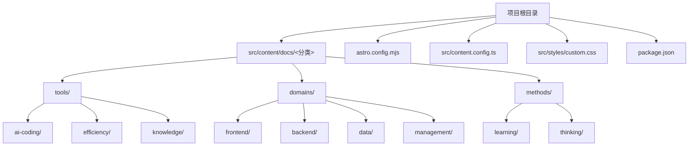
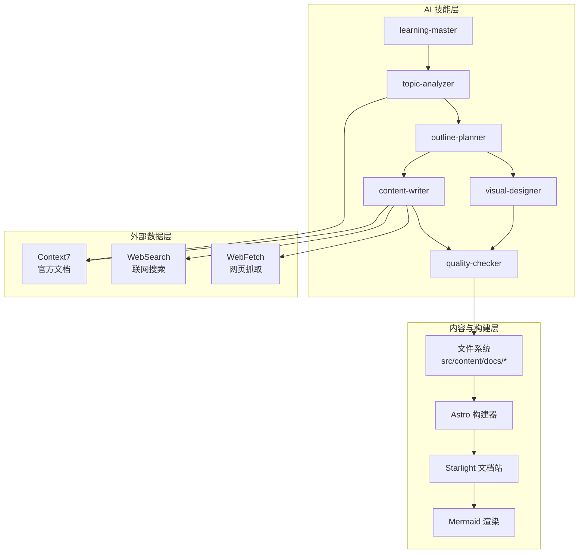
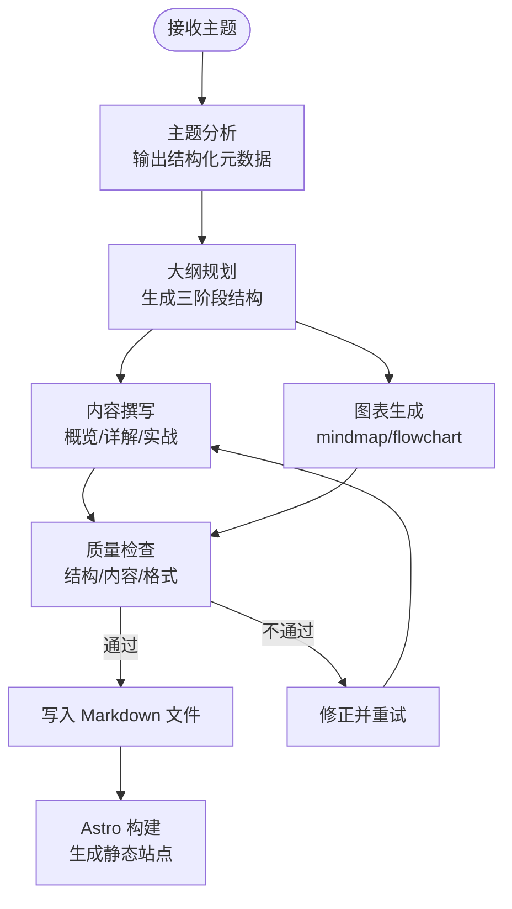
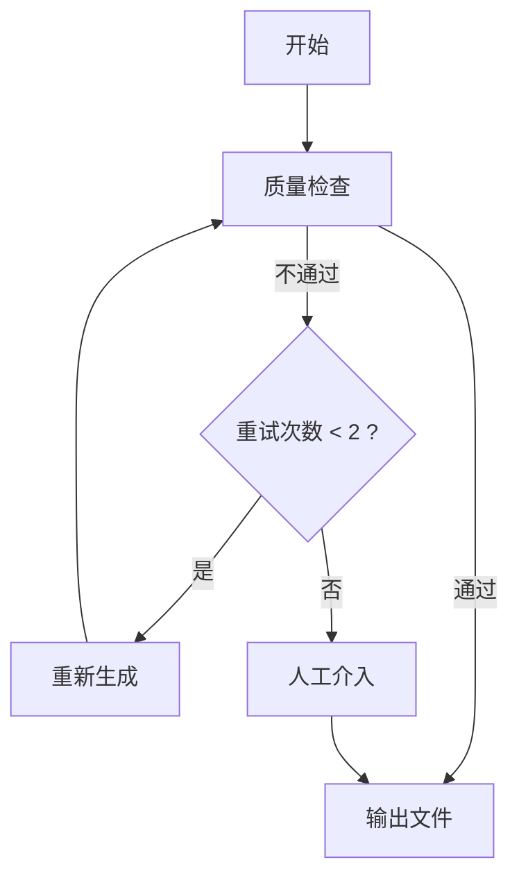
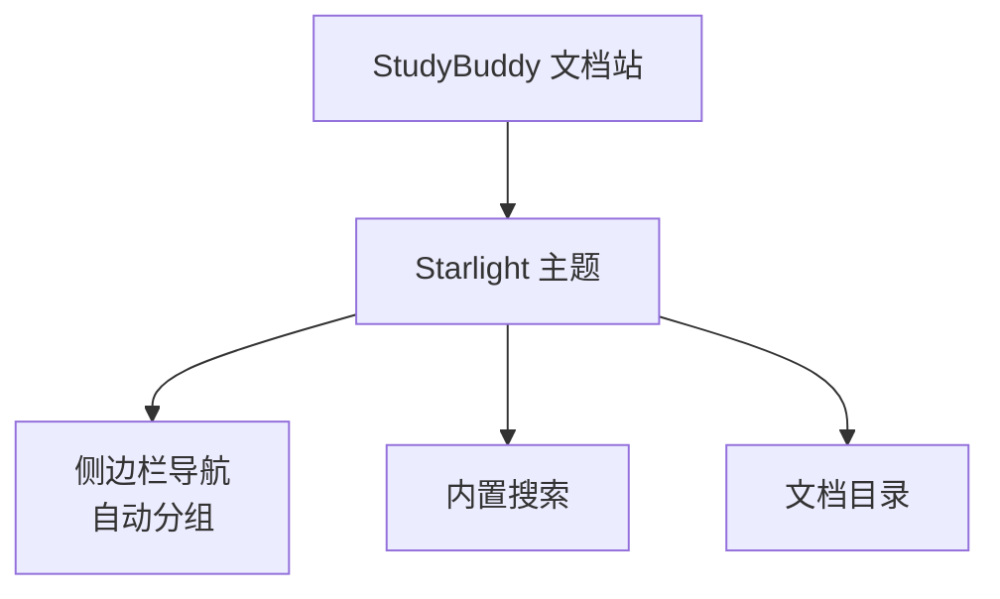
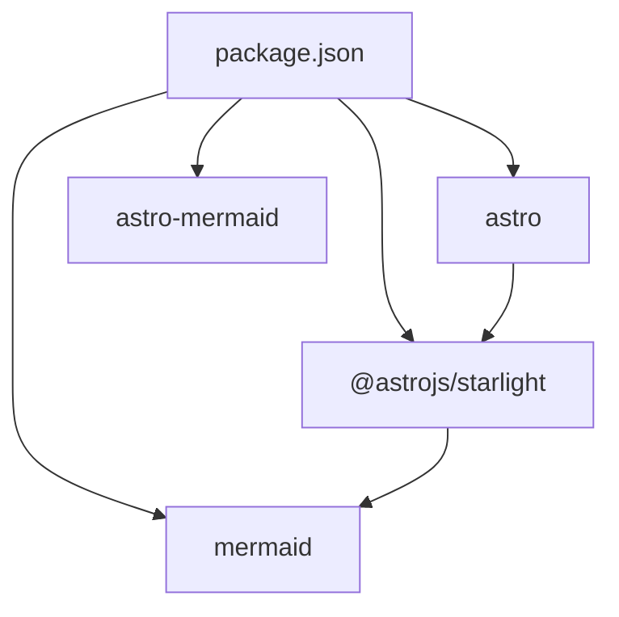

# 内容创作与管理

<cite>
**本文引用的文件**
- [src/content.config.ts](file://src/content.config.ts)
- [astro.config.mjs](file://astro.config.mjs)
- [package.json](file://package.json)
- [src/styles/custom.css](file://src/styles/custom.css)
- [src/content/docs/index.mdx](file://src/content/docs/index.mdx)
- [src/content/docs/tools/index.md](file://src/content/docs/tools/index.md)
- [src/content/docs/tools/ai-coding/index.md](file://src/content/docs/tools/ai-coding/index.md)
- [src/content/docs/tools/efficiency/docker.md](file://src/content/docs/tools/efficiency/docker.md)
- [src/content/docs/methods/index.md](file://src/content/docs/methods/index.md)
- [src/content/docs/methods/learning/index.md](file://src/content/docs/methods/learning/index.md)
- [src/content/docs/domains/index.md](file://src/content/docs/domains/index.md)
- [src/content/docs/domains/frontend/index.md](file://src/content/docs/domains/frontend/index.md)
- [docs/01-PROJECT-BRIEF.md](file://docs/01-PROJECT-BRIEF.md)
- [docs/03-ARCHITECTURE.md](file://docs/03-ARCHITECTURE.md)
- [docs/04-AI-SKILL-SPEC.md](file://docs/04-AI-SKILL-SPEC.md)
</cite>

## 目录
1. [简介](#简介)
2. [项目结构](#项目结构)
3. [核心组件](#核心组件)
4. [架构总览](#架构总览)
5. [详细组件分析](#详细组件分析)
6. [依赖分析](#依赖分析)
7. [性能考量](#性能考量)
8. [故障排查指南](#故障排查指南)
9. [结论](#结论)
10. [附录](#附录)

## 简介
本文件面向 StudyBuddy 的内容创作与管理流程，系统化阐述文档创作标准流程、质量控制机制、内容模板与元数据管理、版本控制策略、审核发布与维护流程，并提供内容创作工具与辅助资源、内容索引与搜索导航机制、内容增长策略与社区贡献指南，以及贡献者创作规范、审核标准与激励机制。内容以“管理者视角”组织，强调“何时用”与“为什么”，辅以 Mermaid 图表与速查表，帮助快速检索与应用。

## 项目结构
StudyBuddy 采用 Astro + Starlight 静态站点架构，内容以纯 Markdown 组织，通过 Astro 的内容集合与 Starlight 的侧边导航自动生成文档站。项目结构清晰，围绕“工具/领域/方法论”三大分类展开，便于规模化扩展与维护。

**图表来源**
- [astro.config.mjs](file://astro.config.mjs#L16-L29)
- [src/content/docs/tools/index.md](file://src/content/docs/tools/index.md#L8-L12)
- [src/content/docs/domains/index.md](file://src/content/docs/domains/index.md#L8-L13)
- [src/content/docs/methods/index.md](file://src/content/docs/methods/index.md#L8-L11)

**章节来源**
- [astro.config.mjs](file://astro.config.mjs#L16-L29)
- [src/content/docs/tools/index.md](file://src/content/docs/tools/index.md#L8-L12)
- [src/content/docs/domains/index.md](file://src/content/docs/domains/index.md#L8-L13)
- [src/content/docs/methods/index.md](file://src/content/docs/methods/index.md#L8-L11)

## 核心组件
- 内容集合与加载器：通过内容配置定义文档集合，使用 Starlight 的加载器与模式(schema)进行统一校验与渲染。
- 星光主题与导航：Starlight 提供开箱即用的文档站体验，支持侧边栏自动分组与本地搜索。
- Mermaid 图表：通过集成插件在 Markdown 中原生渲染思维导图、流程图等可视化图表。
- 自定义主题样式：通过自定义 CSS 实现现代化玻璃拟态风格与暗黑模式适配。

**章节来源**
- [src/content.config.ts](file://src/content.config.ts#L1-L8)
- [astro.config.mjs](file://astro.config.mjs#L8-L32)
- [src/styles/custom.css](file://src/styles/custom.css#L1-L402)

## 架构总览
内容创作与管理由“AI 技能体系 + 静态站点生成 + 质量控制”构成闭环。AI 技能负责主题分析、大纲规划、内容撰写、图表生成与质量检查；Astro/Starlight 负责解析 Markdown、渲染 Mermaid、生成静态 HTML；质量检查通过后写入文件系统，触发站点增量构建与预览。

**图表来源**
- [docs/04-AI-SKILL-SPEC.md](file://docs/04-AI-SKILL-SPEC.md#L19-L73)
- [docs/03-ARCHITECTURE.md](file://docs/03-ARCHITECTURE.md#L12-L68)
- [astro.config.mjs](file://astro.config.mjs#L8-L32)

## 详细组件分析

### 内容模板与元数据管理
- 模板结构：三阶段学习框架（概览/详解/实战），配合思维导图与速查表，形成“全局—细节—应用”的渐进式学习路径。
- 元数据：Front Matter 包含标题、描述、分类、难度、标签、时长等，用于导航、索引与展示。
- 命名规范：采用短横线连接的 kebab-case，主题明确且避免缩写，单次单词数控制在 1-3 个，便于检索与维护。

**图表来源**
- [docs/04-AI-SKILL-SPEC.md](file://docs/04-AI-SKILL-SPEC.md#L159-L172)
- [docs/04-AI-SKILL-SPEC.md](file://docs/04-AI-SKILL-SPEC.md#L281-L386)
- [docs/04-AI-SKILL-SPEC.md](file://docs/04-AI-SKILL-SPEC.md#L390-L531)
- [docs/04-AI-SKILL-SPEC.md](file://docs/04-AI-SKILL-SPEC.md#L535-L605)
- [docs/04-AI-SKILL-SPEC.md](file://docs/04-AI-SKILL-SPEC.md#L609-L715)

**章节来源**
- [docs/04-AI-SKILL-SPEC.md](file://docs/04-AI-SKILL-SPEC.md#L281-L386)
- [docs/04-AI-SKILL-SPEC.md](file://docs/04-AI-SKILL-SPEC.md#L292-L344)
- [docs/03-ARCHITECTURE.md](file://docs/03-ARCHITECTURE.md#L223-L239)

### 质量控制机制
- 检查维度：结构完整性（三阶段、三要素、难度分级）、内容可读性（通俗定义、恰当类比、可运行示例、实用速查表）、格式规范（Markdown、表格、Mermaid）。
- 评分标准：总分 0-100，≥80 为通过；不同区间对应不同处理策略（优秀直接发布、良好小修、一般需修改、不合格重做）。
- 回退流程：质量检查不通过时，主控 Skill 触发重试（最多 2 次），仍不通过则人工介入。

**图表来源**
- [docs/04-AI-SKILL-SPEC.md](file://docs/04-AI-SKILL-SPEC.md#L777-L800)
- [docs/04-AI-SKILL-SPEC.md](file://docs/04-AI-SKILL-SPEC.md#L609-L715)

**章节来源**
- [docs/04-AI-SKILL-SPEC.md](file://docs/04-AI-SKILL-SPEC.md#L619-L715)

### 版本控制策略
- 内容形态：纯 Markdown 文件，便于 Git 版本控制与协作，支持细粒度变更追踪与回滚。
- 发布流程：本地生成文档 → 质量检查通过 → 写入文件系统 → Astro 构建 → 预览验证 → 推送远端。
- 分支与标签：建议按主题/版本打标签，主分支保持稳定构建产物，功能分支用于实验性内容。

**章节来源**
- [docs/03-ARCHITECTURE.md](file://docs/03-ARCHITECTURE.md#L128-L160)

### 审核、发布与维护流程
- 审核：质量检查通过后方可发布；对示例代码、图表与数据来源进行专项校验。
- 发布：构建产物部署至静态托管（如本地预览或远端服务），保持零运行时 JS。
- 维护：定期回看评分较低内容，结合用户反馈迭代；对过时技术点进行标注与迁移。

**章节来源**
- [docs/04-AI-SKILL-SPEC.md](file://docs/04-AI-SKILL-SPEC.md#L609-L715)
- [docs/03-ARCHITECTURE.md](file://docs/03-ARCHITECTURE.md#L128-L160)

### 内容创作工具与辅助资源
- AI 技能：通过 Qoder 的多代理协作，实现主题分析、大纲规划、内容撰写、图表生成与质量检查的自动化流水线。
- Markdown 编辑：使用任意 Markdown 编辑器，遵循模板与元数据规范。
- 图表工具：在 Markdown 中直接书写 Mermaid 语法，自动生成思维导图与流程图。
- 本地预览：通过 Astro 开发服务器实时查看文档与样式效果。

**章节来源**
- [docs/04-AI-SKILL-SPEC.md](file://docs/04-AI-SKILL-SPEC.md#L19-L73)
- [astro.config.mjs](file://astro.config.mjs#L8-L32)

### 内容索引、搜索与导航机制
- 导航：Starlight 侧边栏根据目录结构自动分组生成，支持“工具/领域/方法论”三大入口。
- 搜索：内置搜索支持关键词检索与结果高亮，提升内容发现效率。
- 目录：文档内目录（TOC）随标题层级自动生成，便于快速跳转。

**图表来源**
- [astro.config.mjs](file://astro.config.mjs#L16-L29)

**章节来源**
- [astro.config.mjs](file://astro.config.mjs#L16-L29)
- [src/styles/custom.css](file://src/styles/custom.css#L221-L238)

### 内容增长策略与社区贡献指南
- 增长策略：以“管理者视角”持续扩展“工具/领域/方法论”分类；引入外部数据源（Context7/WebSearch/WebFetch）保证内容时效性。
- 社区贡献：鼓励贡献者基于现有模板与元数据规范提交内容；对质量高、结构清晰的内容优先收录。
- 激励机制：对贡献者进行公开致谢与贡献统计；对关键改进给予“贡献者徽章”或积分奖励。

**章节来源**
- [docs/01-PROJECT-BRIEF.md](file://docs/01-PROJECT-BRIEF.md#L74-L94)
- [docs/03-ARCHITECTURE.md](file://docs/03-ARCHITECTURE.md#L386-L406)

### 贡献者创作规范、审核标准与激励机制
- 创作规范：遵循三阶段模板、元数据 Front Matter、Mermaid 图表规范；示例代码必须可运行并标注来源。
- 审核标准：结构、内容、格式三分检查；评分 ≥80 才能发布；问题与建议以 JSON 报告形式反馈。
- 激励机制：贡献者可获得“贡献者徽章”、积分或公开致谢；对关键改进与跨领域整合给予额外奖励。

**章节来源**
- [docs/04-AI-SKILL-SPEC.md](file://docs/04-AI-SKILL-SPEC.md#L619-L715)
- [docs/04-AI-SKILL-SPEC.md](file://docs/04-AI-SKILL-SPEC.md#L804-L833)

## 依赖分析
- 框架与主题：Astro 作为静态站点生成器，Starlight 提供文档站能力与本地搜索。
- 图表渲染：Mermaid 插件在 Markdown 中原生渲染图表，减少额外依赖。
- 样式定制：通过自定义 CSS 实现主题色、玻璃拟态与暗黑模式，提升可读性与一致性。

**图表来源**
- [package.json](file://package.json#L12-L18)
- [astro.config.mjs](file://astro.config.mjs#L8-L32)

**章节来源**
- [package.json](file://package.json#L12-L18)
- [astro.config.mjs](file://astro.config.mjs#L8-L32)

## 性能考量
- 构建优化：Astro 默认支持增量构建、图片优化与代码分割，显著缩短构建时间与首屏加载。
- 运行时优化：静态生成零运行时 JS，CDN 加速可实现极低首字节时间；图表懒加载提升首屏速度。
- 资源优化：自定义 CSS 与 Mermaid 图表样式统一，减少冗余资源与渲染抖动。

**章节来源**
- [docs/03-ARCHITECTURE.md](file://docs/03-ARCHITECTURE.md#L366-L383)

## 故障排查指南
- Mermaid 图表渲染失败：检查图表语法与节点层级，简化结构后重试。
- 内容质量不达标：依据检查报告逐项修正，重点关注“示例可运行”“速查表实用”“Mermaid 语法正确”。
- 构建超时：缩短内容体量或拆分任务，确保在时限内完成质量检查。
- 导航缺失：确认目录结构与 Starlight sidebar 配置一致，确保 autogenerate 正确映射。

**章节来源**
- [docs/04-AI-SKILL-SPEC.md](file://docs/04-AI-SKILL-SPEC.md#L777-L800)
- [astro.config.mjs](file://astro.config.mjs#L16-L29)

## 结论
StudyBuddy 的内容创作与管理以“管理者视角”为核心，借助 AI 技能体系与静态站点生成器，实现了从主题分析、大纲规划、内容撰写、图表生成到质量检查与发布的全流程自动化。通过统一模板、元数据与质量标准，结合 Mermaid 图表与本地搜索导航，有效提升了内容的可读性、可检索性与可维护性。建议持续完善外部数据源接入与社区贡献机制，推动内容生态的可持续增长。

## 附录
- 示例文档：Docker 工具文档展示了三阶段结构、思维导图与速查表的综合应用。
- 分类入口：工具/领域/方法论三大分类入口在侧边栏自动生成，便于快速定位。

**章节来源**
- [src/content/docs/tools/efficiency/docker.md](file://src/content/docs/tools/efficiency/docker.md#L34-L51)
- [src/content/docs/tools/efficiency/docker.md](file://src/content/docs/tools/efficiency/docker.md#L191-L205)
- [astro.config.mjs](file://astro.config.mjs#L16-L29)