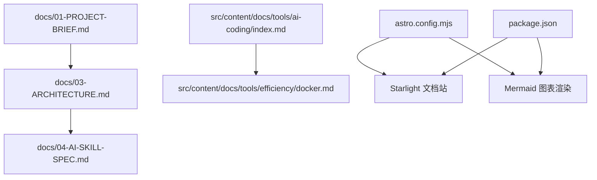
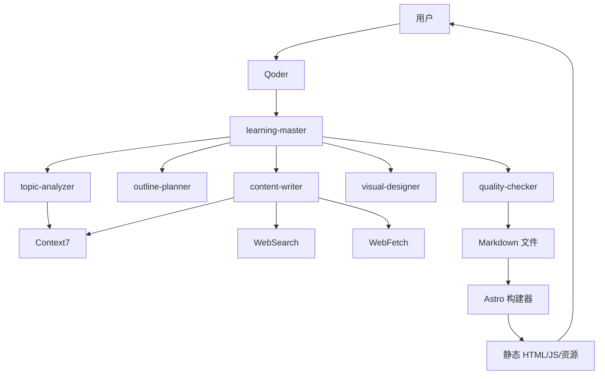
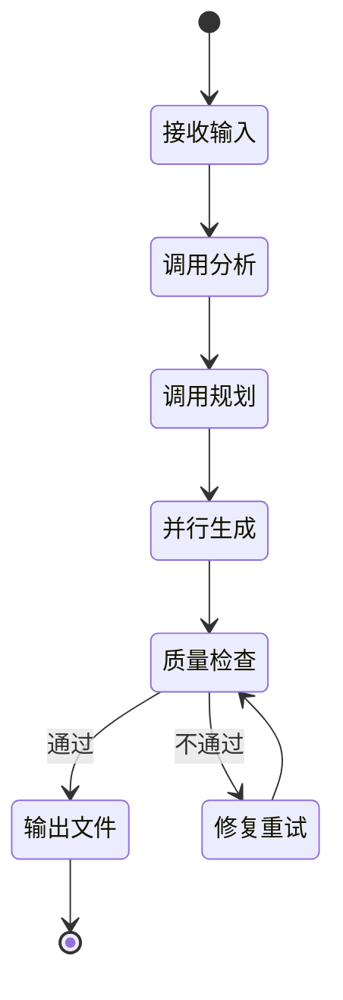
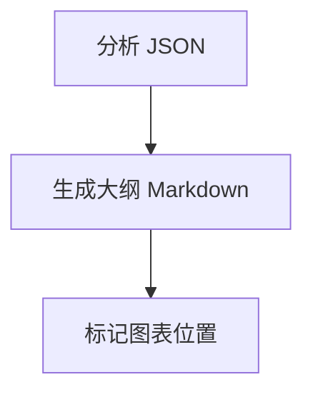
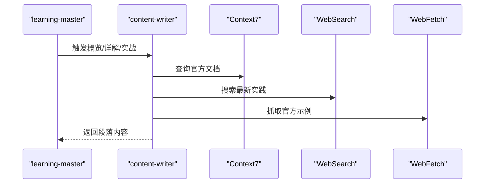
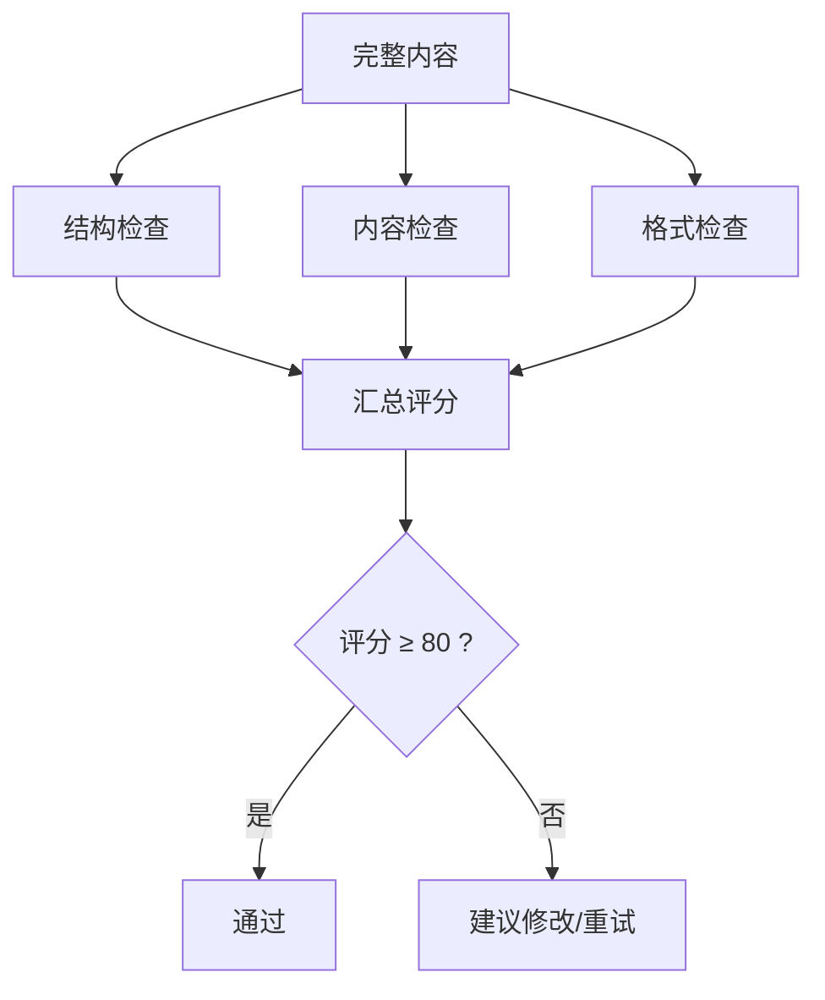
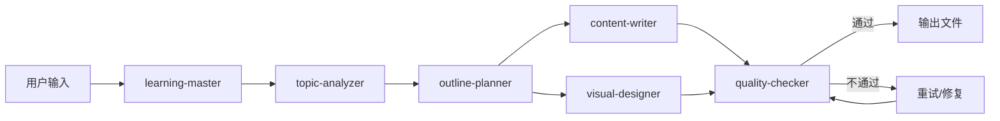
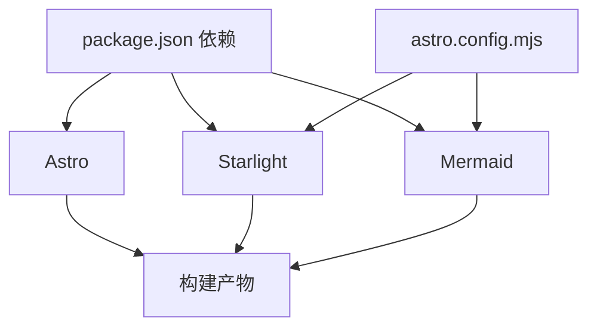
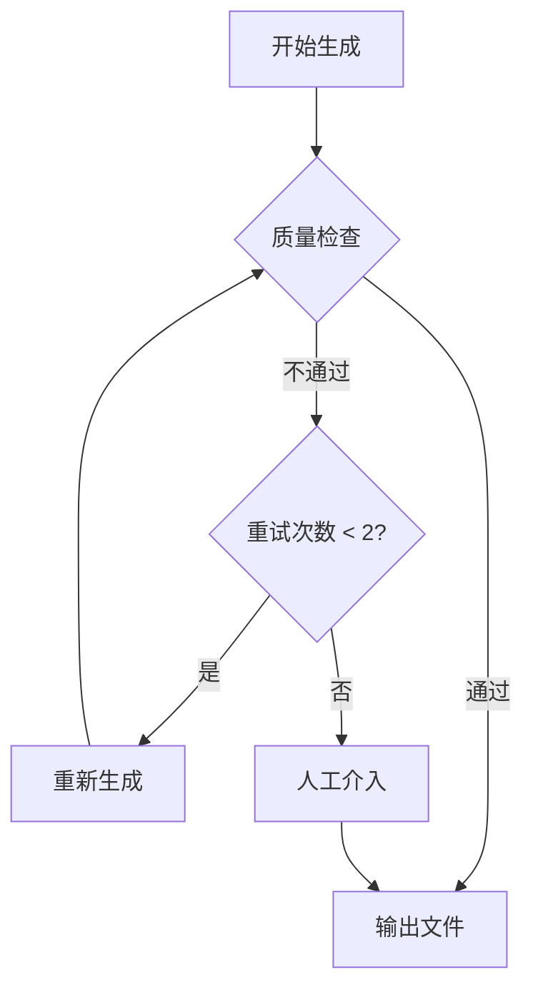

# AI 编程工具

<cite>
**本文引用的文件**
- [package.json](file://package.json)
- [astro.config.mjs](file://astro.config.mjs)
- [docs/01-PROJECT-BRIEF.md](file://docs/01-PROJECT-BRIEF.md)
- [docs/03-ARCHITECTURE.md](file://docs/03-ARCHITECTURE.md)
- [docs/04-AI-SKILL-SPEC.md](file://docs/04-AI-SKILL-SPEC.md)
- [src/content/docs/tools/ai-coding/index.md](file://src/content/docs/tools/ai-coding/index.md)
- [src/content/docs/tools/efficiency/docker.md](file://src/content/docs/tools/efficiency/docker.md)
- [src/content/docs/methods/learning/index.md](file://src/content/docs/methods/learning/index.md)
- [src/content/docs/domains/backend/index.md](file://src/content/docs/domains/backend/index.md)
</cite>

## 目录
1. [引言](#引言)
2. [项目结构](#项目结构)
3. [核心组件](#核心组件)
4. [架构总览](#架构总览)
5. [详细组件分析](#详细组件分析)
6. [依赖分析](#依赖分析)
7. [性能考虑](#性能考虑)
8. [故障排除指南](#故障排除指南)
9. [结论](#结论)
10. [附录](#附录)

## 引言
本文件面向希望系统掌握“AI 编程工具”的开发者与技术管理者，围绕 StudyBuddy 项目中的 AI 技能体系与文档生成流程，提供从入门到精通的学习路径与实操指南。重点涵盖：
- AI 代码生成与智能补全的协作模式
- 错误检测与质量控制流程
- 使用方法、配置选项与最佳实践
- 与不同编程语言的集成方式
- 性能优化建议与故障排除

本项目以“管理者视角”为核心理念，强调“会管比会做更有直接价值”，通过 AI 技能协作与静态文档站点，帮助用户快速建立知识体系并高效检索应用。

## 项目结构
StudyBuddy 采用 Astro + Starlight + Mermaid 的静态站点架构，结合 Qoder 的多 Agent 协作（Skills + MCP）实现 AI 内容生成与可视化。核心目录与职责如下：
- docs：项目文档（简介、需求、架构、AI Skill 规格）
- src/content/docs：学习文档（tools/ 领域/方法论），Markdown 格式
- .qoder/skills：AI Skill 定义与协作（学习主控、主题分析、大纲规划、内容撰写、图表生成、质量检查）
- astro.config.mjs：站点配置（Starlight 导航、Mermaid 集成、主题样式）
- package.json：脚本与依赖

**图示来源**
- [docs/03-ARCHITECTURE.md](file://docs/03-ARCHITECTURE.md#L168-L221)
- [astro.config.mjs](file://astro.config.mjs#L1-L34)
- [package.json](file://package.json#L1-L20)

**章节来源**
- [docs/03-ARCHITECTURE.md](file://docs/03-ARCHITECTURE.md#L164-L240)
- [astro.config.mjs](file://astro.config.mjs#L1-L34)
- [package.json](file://package.json#L1-L20)

## 核心组件
- 学习主控（learning-master）：编排与调度，控制生成流程与重试策略
- 主题分析（topic-analyzer）：结构化分析主题，输出元数据与分类建议
- 大纲规划（outline-planner）：生成三阶段学习大纲（概览/详解/实战）
- 内容撰写（content-writer）：分段生成内容，遵循“是什么/为什么/怎么用”结构
- 图表生成（visual-designer）：生成 Mermaid 图表（思维导图/流程图等）
- 质量检查（quality-checker）：评分与改进建议，确保内容质量与格式规范

上述组件通过 MCP 工具（Context7/WebSearch/WebFetch）获取权威与最新信息，保证生成内容的时效性与准确性。

**章节来源**
- [docs/04-AI-SKILL-SPEC.md](file://docs/04-AI-SKILL-SPEC.md#L19-L85)
- [docs/04-AI-SKILL-SPEC.md](file://docs/04-AI-SKILL-SPEC.md#L86-L126)

## 架构总览
下图展示了用户、Qoder、AI Skill 与外部数据源（MCP）之间的交互，以及文档生成与站点构建的数据流。

**图示来源**
- [docs/03-ARCHITECTURE.md](file://docs/03-ARCHITECTURE.md#L12-L69)
- [docs/04-AI-SKILL-SPEC.md](file://docs/04-AI-SKILL-SPEC.md#L19-L73)

## 详细组件分析

### 学习主控（learning-master）
- 角色：任务编排与流程控制
- 输入：用户触发命令（/learn {topic} [--category] [--level]）
- 输出：最终 Markdown 文档
- 约束：生成时间 < 30 秒，质量检查评分 ≥ 80，失败最多重试 2 次

**图示来源**
- [docs/04-AI-SKILL-SPEC.md](file://docs/04-AI-SKILL-SPEC.md#L159-L172)

**章节来源**
- [docs/04-AI-SKILL-SPEC.md](file://docs/04-AI-SKILL-SPEC.md#L149-L202)

### 主题分析（topic-analyzer）
- 输出：结构化 JSON（主题、slug、一句话定义、解决的问题、使用场景、前置知识、复杂度、预计章节、核心概念、分类、建议图表类型）
- 约束：管理者视角，不涉及实现细节；一句话定义要通俗易懂；前置知识精简

**图示来源**
- [docs/04-AI-SKILL-SPEC.md](file://docs/04-AI-SKILL-SPEC.md#L216-L248)

**章节来源**
- [docs/04-AI-SKILL-SPEC.md](file://docs/04-AI-SKILL-SPEC.md#L206-L277)

### 大纲规划（outline-planner）
- 输出：带 frontmatter 的 Markdown 大纲，标记图表位置
- 三阶段框架：概览（5 分钟）、详解（60 分钟）、实战（25 分钟）
- 约束：概览控制在 5 分钟阅读量；详解每个概念控制在 10 分钟；总时长 ≤ 90 分钟

**图示来源**
- [docs/04-AI-SKILL-SPEC.md](file://docs/04-AI-SKILL-SPEC.md#L281-L386)

**章节来源**
- [docs/04-AI-SKILL-SPEC.md](file://docs/04-AI-SKILL-SPEC.md#L281-L386)

### 内容撰写（content-writer）
- 分段模式：概览（overview）、详解（details）、实战（practices）
- 概览段：一句话定义 + 场景 + 前置知识
- 详解段：每个概念“是什么/为什么/怎么用”，最小可运行示例 + 速查表 + 常见陷阱
- 实战段：初级（5 分钟）、中级（15 分钟）、高级（30 分钟）渐进练习
- MCP 要求：生成内容前必须调用 Context7/WebSearch/WebFetch 获取权威信息，禁止仅依赖模型训练数据

**图示来源**
- [docs/04-AI-SKILL-SPEC.md](file://docs/04-AI-SKILL-SPEC.md#L390-L531)

**章节来源**
- [docs/04-AI-SKILL-SPEC.md](file://docs/04-AI-SKILL-SPEC.md#L390-L531)

### 图表生成（visual-designer）
- 生成 Mermaid 图表：思维导图（mindmap）、流程图（flowchart）、时序图（sequenceDiagram）、类图（classDiagram）、状态图（stateDiagram-v2）
- 输出：直接可用的 Mermaid 代码块，标注用途
- 约束：节点文字简洁，层级适中，语法正确

**图示来源**
- [docs/04-AI-SKILL-SPEC.md](file://docs/04-AI-SKILL-SPEC.md#L535-L605)

**章节来源**
- [docs/04-AI-SKILL-SPEC.md](file://docs/04-AI-SKILL-SPEC.md#L535-L605)

### 质量检查（quality-checker）
- 检查维度：结构（三阶段完整性、每概念三要素、难度分级）、内容（定义通俗、类比恰当、示例可运行、速查实用）、格式（Markdown、表格、Mermaid）
- 输出：评分、通过与否、分项得分、问题列表、改进建议
- 评分标准：≥ 90 优秀，80-89 良好，70-79 一般，< 70 不合格

**图示来源**
- [docs/04-AI-SKILL-SPEC.md](file://docs/04-AI-SKILL-SPEC.md#L609-L715)

**章节来源**
- [docs/04-AI-SKILL-SPEC.md](file://docs/04-AI-SKILL-SPEC.md#L609-L715)

### 技能间数据传递与回退机制
- 数据流：用户输入 → 主控 → 分析 → 规划 → 并行生成 → 质量检查 → 输出文件
- 回退：质量检查不通过时最多重试 2 次；超时返回部分结果；人工介入兜底

**图示来源**
- [docs/04-AI-SKILL-SPEC.md](file://docs/04-AI-SKILL-SPEC.md#L719-L774)
- [docs/04-AI-SKILL-SPEC.md](file://docs/04-AI-SKILL-SPEC.md#L777-L800)

**章节来源**
- [docs/04-AI-SKILL-SPEC.md](file://docs/04-AI-SKILL-SPEC.md#L719-L800)

## 依赖分析
- 技术栈与选型：Astro（静态优先、性能极致）、Starlight（开箱即用文档站）、Mermaid（Markdown 原生语法）、Qoder（Skills + MCP 多代理协作）
- 构建与渲染：Astro 解析 Markdown、渲染 Mermaid、生成 HTML/JS/资源
- 外部数据：Context7（官方文档）、WebSearch（联网搜索）、WebFetch（网页抓取）

**图示来源**
- [package.json](file://package.json#L12-L18)
- [astro.config.mjs](file://astro.config.mjs#L1-L34)

**章节来源**
- [package.json](file://package.json#L1-L20)
- [astro.config.mjs](file://astro.config.mjs#L1-L34)

## 性能考虑
- 构建优化：增量构建、图片优化、代码分割
- 运行时优化：静态生成（零运行时 JS）、CDN 缓存、懒加载图表
- 生成性能：控制生成时间（< 30 秒/篇）、质量检查评分阈值（≥ 80）

**章节来源**
- [docs/03-ARCHITECTURE.md](file://docs/03-ARCHITECTURE.md#L366-L383)
- [docs/04-AI-SKILL-SPEC.md](file://docs/04-AI-SKILL-SPEC.md#L198-L202)

## 故障排除指南
- 分析失败：主题过于模糊 → 提示用户细化主题
- 大纲不完整：缺少必要章节 → 自动补充
- 内容质量低：评分 < 80 → 重新生成（最多 2 次）
- 图表语法错误：Mermaid 解析失败 → 简化图表结构
- 超时：生成时间 > 60s → 返回部分结果
- 人工介入：多次失败后进行人工校对与修正

**图示来源**
- [docs/04-AI-SKILL-SPEC.md](file://docs/04-AI-SKILL-SPEC.md#L777-L800)

**章节来源**
- [docs/04-AI-SKILL-SPEC.md](file://docs/04-AI-SKILL-SPEC.md#L777-L800)

## 结论
StudyBuddy 通过“管理者视角”的 AI 技能协作，实现了从主题分析、大纲规划、内容撰写、图表生成到质量检查的闭环，辅以 Mermaid 可视化与静态站点构建，帮助用户快速建立知识体系并高效检索应用。建议在实践中遵循三阶段学习框架、严格的质量检查标准与 MCP 数据优先策略，并结合性能优化与故障排除机制，持续提升生成效率与内容质量。

## 附录

### 使用方法与最佳实践
- 生成文档：在 Qoder 中执行 /learn {topic}，触发 learning-master 主控编排
- 本地预览：执行 npm run dev，访问 localhost:4321 查看文档
- 文档分类：工具/领域/方法论三大分类，便于检索与扩展
- 最佳实践：
  - 明确主题边界，避免过于宽泛
  - 详述“是什么/为什么/怎么用”，减少实现细节
  - 优先使用 MCP 获取权威信息，标注数据来源
  - 控制生成时间与质量评分阈值，确保交付效率

**章节来源**
- [docs/03-ARCHITECTURE.md](file://docs/03-ARCHITECTURE.md#L358-L363)
- [docs/04-AI-SKILL-SPEC.md](file://docs/04-AI-SKILL-SPEC.md#L408-L443)
- [docs/04-AI-SKILL-SPEC.md](file://docs/04-AI-SKILL-SPEC.md#L445-L493)
- [docs/04-AI-SKILL-SPEC.md](file://docs/04-AI-SKILL-SPEC.md#L495-L531)

### 配置选项
- 站点标题与语言：astro.config.mjs 中设置
- 导航侧边栏：自动根据 tools/domains/methods 目录生成
- Mermaid 集成：通过 astro-mermaid 插件启用
- 自定义样式：通过 custom.css 注入 Starlight 主题

**章节来源**
- [astro.config.mjs](file://astro.config.mjs#L8-L32)

### 与不同编程语言的集成方式
- 通用集成：通过 content-writer 的 MCP 调用 Context7/WebSearch/WebFetch 获取官方文档、API 参考与示例代码
- 语言特定建议：
  - 前端（React/Vue/Angular）：优先查询官方文档与社区最佳实践，示例代码来自官方示例仓库
  - 后端（Node.js/Go/Python）：关注版本号、API 签名与安装命令，确保可运行性
  - 数据（SQL/NoSQL）：强调查询语句与索引设计，避免过时语法
  - DevOps（Docker/K8s）：使用 Compose/Manifest 文件作为示例，标注版本与兼容性

**章节来源**
- [docs/04-AI-SKILL-SPEC.md](file://docs/04-AI-SKILL-SPEC.md#L128-L145)
- [src/content/docs/tools/efficiency/docker.md](file://src/content/docs/tools/efficiency/docker.md#L1-L205)
- [src/content/docs/domains/backend/index.md](file://src/content/docs/domains/backend/index.md#L1-L7)

### 代码示例与使用案例
- AI 编程工具概览：参见工具分类下的 AI 编程工具索引页
- Docker 实战案例：包含镜像/容器/Compose 基础操作与决策流程图
- 学习方法与思维框架：提供高效学习策略与检索技巧

**章节来源**
- [src/content/docs/tools/ai-coding/index.md](file://src/content/docs/tools/ai-coding/index.md#L1-L7)
- [src/content/docs/tools/efficiency/docker.md](file://src/content/docs/tools/efficiency/docker.md#L1-L205)
- [src/content/docs/methods/learning/index.md](file://src/content/docs/methods/learning/index.md#L1-L7)