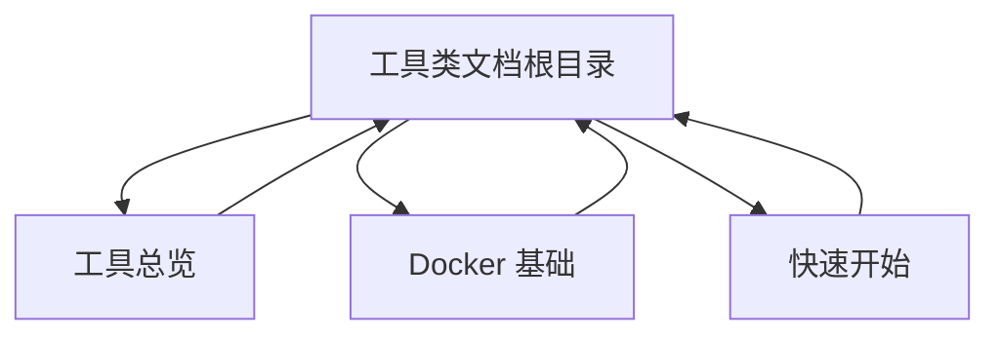
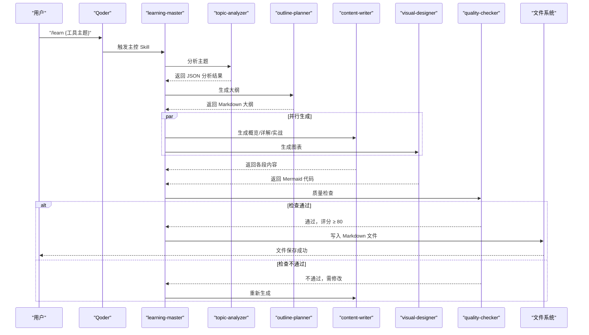
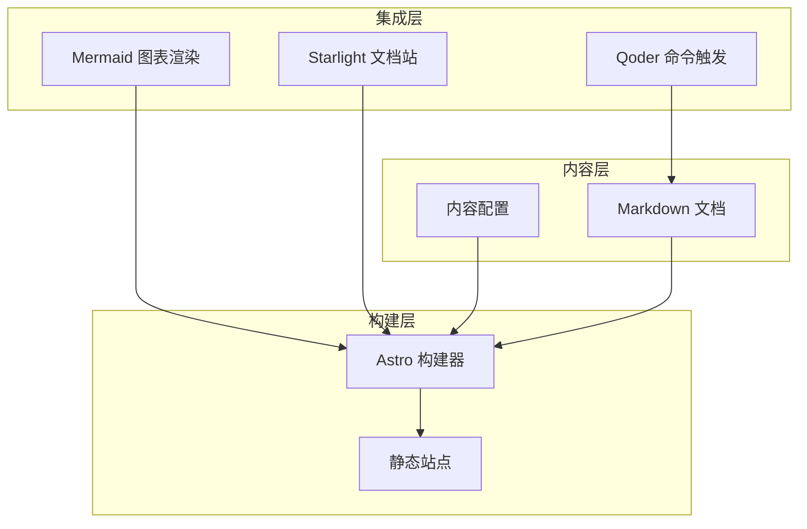
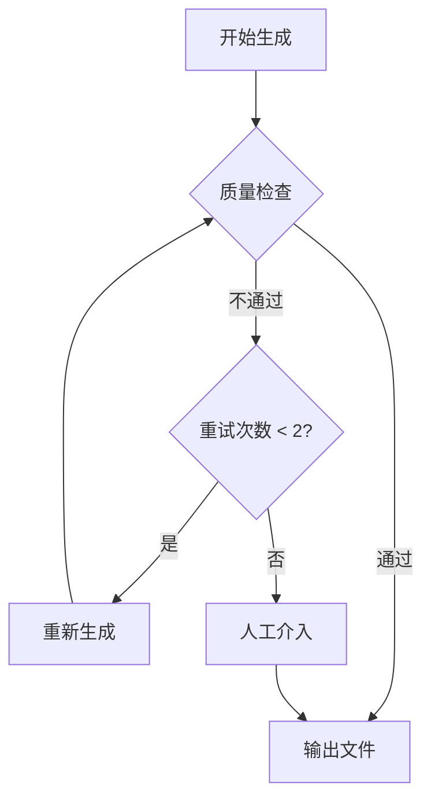
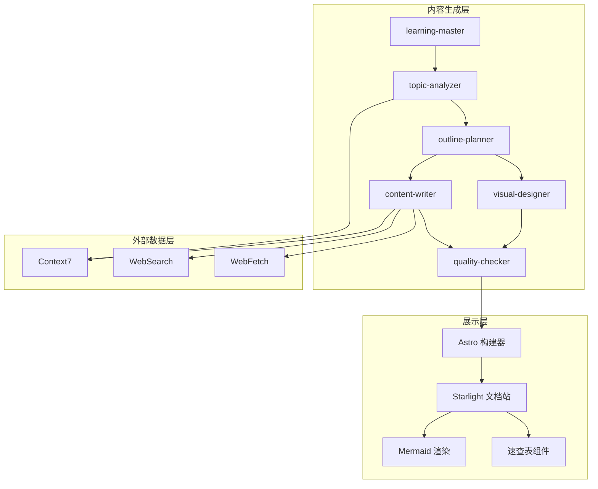

# 工具类文档

<cite>
**本文引用的文件**
- [工具总览](file://src/content/docs/tools/index.md)
- [Docker 基础](file://src/content/docs/tools/docker.md)
- [快速开始](file://src/content/docs/tools/getting-started.md)
- [内容配置](file://src/content.config.ts)
- [项目简介](file://docs/01-PROJECT-BRIEF.md)
- [技术架构设计](file://docs/03-ARCHITECTURE.md)
- [AI Skill 规格说明](file://docs/04-AI-SKILL-SPEC.md)
</cite>

## 更新摘要
**变更内容**
- 新增完整的 Docker 基础使用指南，提供从入门到实战的完整教程
- 扩展工具类文档内容结构，增加详细的三阶段学习框架
- 新增快速开始指南，帮助用户快速上手工具类文档的学习
- 完善工具类文档的分类标准和内容规范

## 目录
1. [引言](#引言)
2. [项目结构](#项目结构)
3. [核心组件](#核心组件)
4. [架构总览](#架构总览)
5. [详细组件分析](#详细组件分析)
6. [依赖分析](#依赖分析)
7. [性能考量](#性能考量)
8. [故障排除指南](#故障排除指南)
9. [结论](#结论)
10. [附录](#附录)

## 引言
本文件面向 StudyBuddy 的工具类文档，系统阐述工具类文档的分类标准、内容结构、评测与选择指南、集成与配置方法、更新与废弃流程，以及面向使用者的快速上手与故障排除方案。工具类文档聚焦"管理者视角"，强调"何时用、为什么用"的决策能力，帮助读者在有限时间内把握工具的核心价值与适用场景。

**更新** 新增 Docker 基础使用指南和快速开始指南，提供完整的工具使用教程和学习框架。

## 项目结构
工具类文档位于内容目录的 tools 分类下，采用子分类组织：
- 工具总览：概述各类软件工具的使用指南
- Docker 基础：完整的容器化平台使用教程
- 快速开始：三阶段学习框架的入门指南

**图表来源**
- [工具总览](file://src/content/docs/tools/index.md#L1-L29)
- [Docker 基础](file://src/content/docs/tools/docker.md#L1-L644)
- [快速开始](file://src/content/docs/tools/getting-started.md#L1-L66)

**章节来源**
- [工具总览](file://src/content/docs/tools/index.md#L1-L29)
- [Docker 基础](file://src/content/docs/tools/docker.md#L1-L644)
- [快速开始](file://src/content/docs/tools/getting-started.md#L1-L66)

## 核心组件
- 文档分类体系：工具类文档属于三大分类之一，路径为 /docs/tools/，包含工具总览、Docker 基础、快速开始等子文档。
- 内容生成与质量控制：通过 AI Skill 体系（learning-master、topic-analyzer、outline-planner、content-writer、visual-designer、quality-checker）实现自动化生成与质量把关。
- 可视化与速查：Mermaid 图表（思维导图、流程图等）与速查表组件提升可检索性与实用性。
- 本地使用与构建：Astro + Starlight 提供静态站点生成与本地预览能力。

**章节来源**
- [技术架构设计](file://docs/03-ARCHITECTURE.md#L223-L229)
- [AI Skill 规格说明](file://docs/04-AI-SKILL-SPEC.md#L75-L84)
- [技术架构设计](file://docs/03-ARCHITECTURE.md#L242-L274)
- [内容配置](file://src/content.config.ts#L1-L9)

## 架构总览
工具类文档的生成与呈现遵循"输入主题 → 主控编排 → 多技能并行生成 → 质量检查 → 输出 Markdown"的闭环流程，并通过 Mermaid 图表与速查表增强可读性与检索效率。

**图表来源**
- [技术架构设计](file://docs/03-ARCHITECTURE.md#L82-L126)
- [AI Skill 规格说明](file://docs/04-AI-SKILL-SPEC.md#L159-L172)

## 详细组件分析

### 工具类文档分类标准与内容结构
- 分类标准
  - 工具类文档属于三大分类之一，路径为 /docs/tools/，包含工具总览、Docker 基础、快速开始等子文档。
  - 文档命名规范采用 kebab-case，主题明确、避免缩写、单词数控制在 1-3 个。
- 内容结构
  - 三阶段学习框架：概览（5 分钟）、分章节详解（60 分钟）、联动应用（25 分钟）。
  - 每个核心概念包含"是什么-为什么-怎么用"三要素，配合最小可运行示例与速查表。
  - 概览章节包含思维导图（mindmap）与适用场景判断。
  - 联动应用提供初级（5 分钟）、中级（15 分钟）、高级（30 分钟）渐进式实践任务。
- 可视化与速查
  - 使用 Mermaid 图表（mindmap、flowchart、sequenceDiagram、classDiagram、stateDiagram-v2）。
  - 速查表组件提供高频操作的表格化呈现，便于快速检索。

**更新** 新增 Docker 基础文档的完整内容结构，包括镜像与容器、Dockerfile 构建、数据管理、网络配置等详细章节。

**章节来源**
- [技术架构设计](file://docs/03-ARCHITECTURE.md#L223-L239)
- [AI Skill 规格说明](file://docs/04-AI-SKILL-SPEC.md#L281-L386)
- [AI Skill 规格说明](file://docs/04-AI-SKILL-SPEC.md#L535-L605)
- [技术架构设计](file://docs/03-ARCHITECTURE.md#L276-L319)
- [Docker 基础](file://src/content/docs/tools/docker.md#L1-L644)

### 工具总览
- 定位与价值
  - 提供各类软件工具的使用指南，帮助用户快速掌握提升效率的工具。
- 内容规范
  - 以"管理者视角"解释工具的"是什么、为什么、何时用"，不深入实现细节。
  - 概览章节给出一句话定义与适用场景；详解章节拆解核心能力与使用步骤；实战章节提供最小可行任务。
- 推荐与最佳实践
  - 优先选择与项目技术栈契合、生态完善、可与现有工作流（如 Qoder）集成的工具。
  - 注重"可检索、可复用、可积累"的知识沉淀，避免工具成为信息孤岛。

**章节来源**
- [工具总览](file://src/content/docs/tools/index.md#L1-L29)

### Docker 基础
- 定位与价值
  - Docker 是轻量级容器化平台，让应用在任何环境一致运行。
- 内容规范
  - 采用完整的三阶段学习框架：概览（5 分钟）、详解（60 分钟）、实战（25 分钟）。
  - 每个核心概念包含"是什么-为什么-怎么用"三要素，配合最小可运行示例与速查表。
  - 提供思维导图、流程图与命令速查表，便于快速检索。
- 核心概念
  - 镜像与容器：类与实例的关系，镜像类似"模具"，容器类似"产品"。
  - Dockerfile 构建：从代码到镜像的脚本文件，定义构建步骤。
  - 数据管理：Volume、Bind Mount、tmpfs 三种持久化方式。
  - 网络配置：bridge、host、none、自定义网络四种模式。
- 实战任务
  - 初级：运行第一个容器（Nginx Web 服务器）
  - 中级：编写 Dockerfile 构建应用镜像
  - 高级：数据持久化与网络互联（Web 应用 + MySQL）

**更新** 新增完整的 Docker 基础使用指南，包含 644 行详细内容，涵盖从基础概念到高级应用的完整教程。

**章节来源**
- [Docker 基础](file://src/content/docs/tools/docker.md#L1-L644)

### 快速开始
- 定位与价值
  - 帮助用户快速了解如何使用 StudyBuddy 进行高效学习。
- 内容规范
  - 采用三阶段学习法：概览（5分钟）、详解（60分钟）、实战（25分钟）。
  - 提供使用 AI 生成文档的方法和浏览方式。
  - 包含按分类浏览、使用搜索、知识图谱等功能介绍。
- 功能特性
  - 三阶段学习框架：快速了解核心概念、深入学习知识点、通过练习巩固。
  - AI 文档生成：使用 /learning-master 命令自动生成学习文档。
  - 多种浏览方式：按分类浏览、搜索、知识图谱探索。

**更新** 新增快速开始指南，提供完整的工具类文档学习入口和使用方法。

**章节来源**
- [快速开始](file://src/content/docs/tools/getting-started.md#L1-L66)

### 工具推荐、使用指南与最佳实践
- 推荐原则
  - 与项目目标一致：以"管理者视角"关注"何时用、为什么用"，不追求"最强大"而追求"最合适"。
  - 与现有工具链协同：优先选择可与 Qoder、Astro/Starlight、Mermaid 生态无缝衔接的工具。
  - 可检索与可复用：文档应具备清晰的索引、标签与速查表，便于快速检索与复用。
- 使用指南
  - 三阶段学习法：概览（建立整体认知）、详解（掌握最小可用能力）、实战（渐进式任务）。
  - 可视化辅助：在概览与实战章节使用思维导图与流程图，强化记忆与理解。
  - 速查表：为高频操作提供表格化清单，降低记忆负担。
- 最佳实践
  - 以"问题驱动"选择工具：先明确"要解决什么问题"，再评估"是否需要该工具"。
  - 建立"工具-场景-收益"的映射：为每个工具标注适用场景与预期收益，便于快速决策。
  - 持续迭代：定期回顾工具使用效果，淘汰低效工具，引入更优替代。

**章节来源**
- [项目简介](file://docs/01-PROJECT-BRIEF.md#L17-L58)
- [AI Skill 规格说明](file://docs/04-AI-SKILL-SPEC.md#L609-L715)

### 工具评测标准与选择指南
- 评测维度
  - 场景契合度：是否覆盖"统一环境、微服务部署、CI/CD、快速试用新技术"等典型场景。
  - 易用性：是否具备清晰的入门路径与速查表，降低学习与使用成本。
  - 可检索性：是否支持标签、索引与跨设备同步，便于知识沉淀与复用。
  - 可靠性：是否提供稳定版本、官方文档与社区支持。
- 选择流程
  - 明确目标：确定"要解决的问题"与"期望的收益"。
  - 场景匹配：对照工具的典型场景，评估契合度。
  - 可用性评估：查看是否有速查表、思维导图与入门示例。
  - 可靠性评估：参考官方文档、社区反馈与版本稳定性。
  - 小步试用：先在小范围内试用，收集反馈后再决定是否推广。

**章节来源**
- [工具总览](file://src/content/docs/tools/index.md#L17-L24)
- [Docker 基础](file://src/content/docs/tools/docker.md#L18-L30)

### 工具集成方式与配置方法
- 集成方式
  - 与 Qoder 集成：通过 /learn 命令触发 AI 文档生成，主控 Skill 协调各子 Skill 完成内容生成与质量检查。
  - 与 Mermaid 集成：在 Markdown 中使用 mindmap、flowchart 等语法，Astro 通过 remark 插件渲染。
  - 与 Astro/Starlight 集成：通过内容集合与 schema 加载 Markdown 文档，提供搜索、导航与主题样式。
- 配置方法
  - 内容加载：使用 docsLoader 与 docsSchema 定义文档集合。
  - Mermaid 渲染：在 Astro 配置中启用 remark-mermaid 插件。
  - 本地预览：通过 npm run dev 启动本地服务器，访问 localhost:4321 预览文档。

**图表来源**
- [内容配置](file://src/content.config.ts#L1-L9)
- [技术架构设计](file://docs/03-ARCHITECTURE.md#L242-L274)
- [技术架构设计](file://docs/03-ARCHITECTURE.md#L323-L363)

**章节来源**
- [内容配置](file://src/content.config.ts#L1-L9)
- [技术架构设计](file://docs/03-ARCHITECTURE.md#L242-L274)
- [技术架构设计](file://docs/03-ARCHITECTURE.md#L323-L363)

### 工具更新策略与废弃工具处理流程
- 更新策略
  - 时效性保障：通过 MCP 工具（Context7、WebSearch、WebFetch）获取官方文档、最新实践与示例代码，避免模型训练数据过时。
  - 数据来源标注：在内容中标注数据来源，确保可追溯与可验证。
  - 质量检查：质量检查评分 ≥ 80 分才输出，未达标自动重试，最多两次；超时返回部分结果。
- 废弃工具处理
  - 评估与替换：当工具版本过旧、生态衰落或与项目目标不匹配时，评估替代方案并逐步迁移。
  - 文档归档：保留历史版本文档与迁移记录，便于回溯与审计。
  - 渐进式下线：先在小范围停止使用，收集反馈后再全面下线，同时更新相关工具类文档。

**图表来源**
- [AI Skill 规格说明](file://docs/04-AI-SKILL-SPEC.md#L777-L800)

**章节来源**
- [AI Skill 规格说明](file://docs/04-AI-SKILL-SPEC.md#L86-L126)
- [AI Skill 规格说明](file://docs/04-AI-SKILL-SPEC.md#L777-L800)

### 快速上手指南
- 生成文档
  - 在 Qoder 中执行 /learn {工具主题}，例如 /learn Docker，触发 AI 文档生成。
- 本地预览
  - 执行 npm run dev 启动本地服务器，访问 localhost:4321 查看生成的文档。
- 浏览学习
  - 使用左侧导航与内置搜索快速定位工具文档；利用速查表与思维导图加深理解。

**更新** 新增基于三阶段学习框架的快速上手指南，提供从概览到实战的完整学习路径。

**章节来源**
- [技术架构设计](file://docs/03-ARCHITECTURE.md#L358-L363)
- [快速开始](file://src/content/docs/tools/getting-started.md#L10-L36)

## 依赖分析
工具类文档的生成与呈现依赖于以下关键模块与外部数据源：
- 内容生成层：learning-master 主控编排，topic-analyzer 分析主题，outline-planner 生成大纲，content-writer 撰写内容，visual-designer 生成图表，quality-checker 质量检查。
- 外部数据层：Context7（官方文档）、WebSearch（联网搜索）、WebFetch（网页抓取）。
- 展示层：Astro + Starlight 文档站，Mermaid 图表渲染，自定义速查表组件。

**图表来源**
- [技术架构设计](file://docs/03-ARCHITECTURE.md#L82-L126)
- [AI Skill 规格说明](file://docs/04-AI-SKILL-SPEC.md#L19-L73)

**章节来源**
- [技术架构设计](file://docs/03-ARCHITECTURE.md#L82-L126)
- [AI Skill 规格说明](file://docs/04-AI-SKILL-SPEC.md#L19-L73)

## 性能考量
- 构建优化：Astro 默认支持增量构建、图片优化与代码分割，显著缩短构建时间与首屏加载时间。
- 运行时优化：静态生成零运行时 JS，结合 CDN 缓存与懒加载图表，进一步提升首屏速度与响应时间。
- 可检索性：通过思维导图、速查表与内置搜索，降低信息检索成本，提升学习效率。

**章节来源**
- [技术架构设计](file://docs/03-ARCHITECTURE.md#L366-L383)

## 故障排除指南
- 文档生成失败
  - 现象：生成时间过长或质量检查未通过。
  - 处理：检查主题是否过于模糊，必要时细化主题；查看质量检查报告中的问题与建议，按提示修改后重试。
- Mermaid 图表渲染失败
  - 现象：图表无法正确渲染。
  - 处理：简化图表结构，确保语法正确；优先使用 mindmap、flowchart 等基础类型。
- 本地预览异常
  - 现象：npm run dev 启动失败或页面空白。
  - 处理：确认 Node.js 与依赖安装完成；检查 astro.config.mjs 中 remark-mermaid 插件配置；重启本地服务器。

**章节来源**
- [AI Skill 规格说明](file://docs/04-AI-SKILL-SPEC.md#L777-L800)
- [技术架构设计](file://docs/03-ARCHITECTURE.md#L323-L363)

## 结论
工具类文档以"管理者视角"为核心，通过三阶段学习框架、Mermaid 可视化与速查表，帮助使用者在有限时间内快速理解工具的价值与适用场景。依托 AI Skill 体系与外部数据源，实现高质量、可检索、可复用的工具文档生成与维护。新增的 Docker 基础使用指南和快速开始指南，为用户提供从入门到实战的完整学习路径。建议在工具选择与使用中坚持"场景契合、易用可靠、可检索复用"的原则，并建立完善的更新与废弃流程，持续优化工具生态。

## 附录
- 相关文档
  - 项目简介：阐述 StudyBuddy 的愿景、核心价值与目标用户。
  - 技术架构设计：介绍系统分层、数据流、Mermaid 集成与本地使用方案。
  - AI Skill 规格说明：定义六个子 Skill 的职责、工作流程与质量检查标准。

**章节来源**
- [项目简介](file://docs/01-PROJECT-BRIEF.md#L1-L124)
- [技术架构设计](file://docs/03-ARCHITECTURE.md#L1-L410)
- [AI Skill 规格说明](file://docs/04-AI-SKILL-SPEC.md#L1-L838)