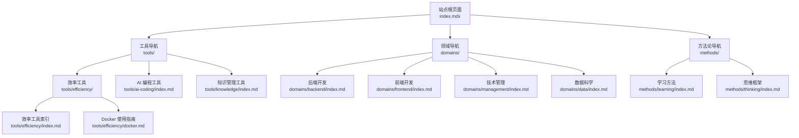
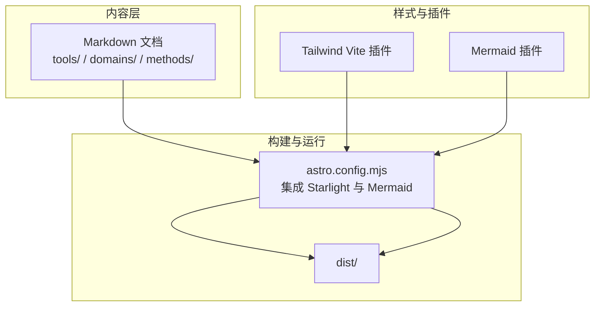
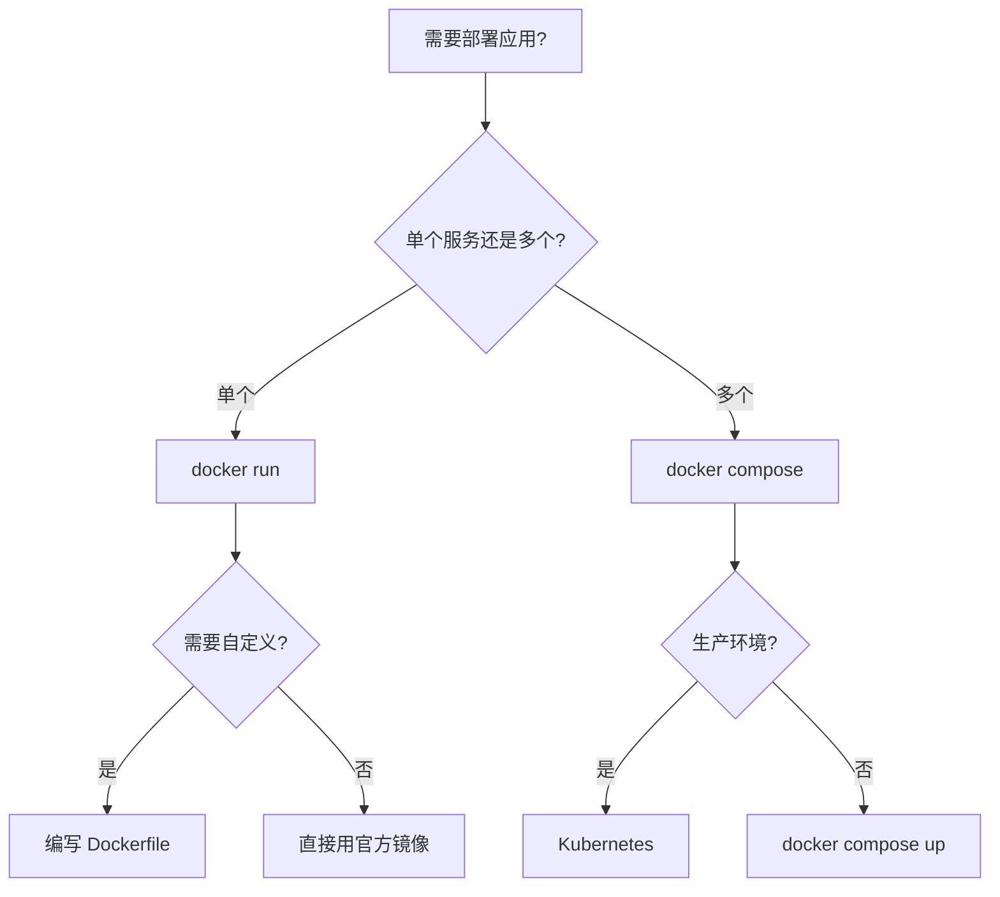
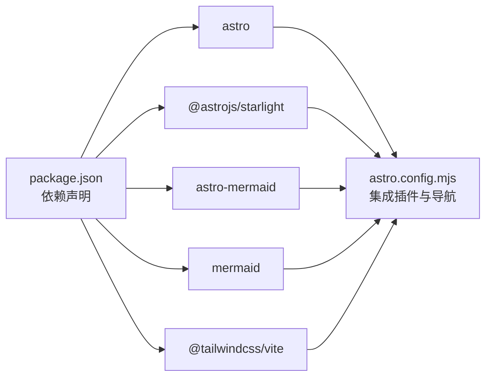

# 效率工具

<cite>
**本文引用的文件**
- [效率工具索引](file://src/content/docs/tools/efficiency/index.md)
- [Docker 使用指南](file://src/content/docs/tools/efficiency/docker.md)
- [AI 编程工具索引](file://src/content/docs/tools/ai-coding/index.md)
- [知识管理工具索引](file://src/content/docs/tools/knowledge/index.md)
- [后端开发索引](file://src/content/docs/domains/backend/index.md)
- [前端开发索引](file://src/content/docs/domains/frontend/index.md)
- [学习方法索引](file://src/content/docs/methods/learning/index.md)
- [思维框架索引](file://src/content/docs/methods/thinking/index.md)
- [技术管理索引](file://src/content/docs/domains/management/index.md)
- [数据科学索引](file://src/content/docs/domains/data/index.md)
- [站点首页与核心理念](file://src/content/docs/index.mdx)
- [Astro 配置](file://astro.config.mjs)
- [包管理配置](file://package.json)
</cite>

## 目录
1. [简介](#简介)
2. [项目结构](#项目结构)
3. [核心组件](#核心组件)
4. [架构总览](#架构总览)
5. [详细组件分析](#详细组件分析)
6. [依赖关系分析](#依赖关系分析)
7. [性能考虑](#性能考虑)
8. [故障排查指南](#故障排查指南)
9. [结论](#结论)
10. [附录](#附录)

## 简介
本项目以“效率工具”为核心主题，围绕提升开发与管理工作效率的目标，系统性介绍容器化平台 Docker 的使用方法与最佳实践，并延展到 AI 编程工具、知识管理工具、以及支撑学习与思维的方法论与技术领域知识。文档采用“概览—详解—实战”的三段式结构，辅以思维导图与速查表，帮助读者从入门到进阶掌握工具的使用与协同。

## 项目结构
该项目基于 Astro + Starlight 构建静态知识站点，内容通过 Markdown 文档组织，自动从目录生成侧边栏导航。效率工具相关文档位于 tools/efficiency 下，同时与 domains（领域）、methods（方法论）形成知识网络。

图表来源
- [站点首页与核心理念](file://src/content/docs/index.mdx#L1-L195)
- [效率工具索引](file://src/content/docs/tools/efficiency/index.md#L1-L7)
- [Docker 使用指南](file://src/content/docs/tools/efficiency/docker.md#L1-L205)
- [AI 编程工具索引](file://src/content/docs/tools/ai-coding/index.md#L1-L7)
- [知识管理工具索引](file://src/content/docs/tools/knowledge/index.md#L1-L7)
- [后端开发索引](file://src/content/docs/domains/backend/index.md#L1-L7)
- [前端开发索引](file://src/content/docs/domains/frontend/index.md#L1-L7)
- [学习方法索引](file://src/content/docs/methods/learning/index.md#L1-L7)
- [思维框架索引](file://src/content/docs/methods/thinking/index.md#L1-L7)
- [技术管理索引](file://src/content/docs/domains/management/index.md#L1-L7)
- [数据科学索引](file://src/content/docs/domains/data/index.md#L1-L7)

章节来源
- [站点首页与核心理念](file://src/content/docs/index.mdx#L1-L195)
- [Astro 配置](file://astro.config.mjs#L1-L39)
- [包管理配置](file://package.json#L1-L22)

## 核心组件
- 效率工具索引：概述效率工具的价值与定位，强调“减少重复劳动，专注高价值决策”。
- Docker 使用指南：系统讲解镜像、容器、Compose 的概念与实操，提供从入门到进阶的实战路径与决策流程图。
- AI 编程工具：介绍 AI 辅助开发工具的能力边界与最佳应用场景，帮助管理者正确选择与使用。
- 知识管理工具：强调知识的可检索、可复用、可积累，构建个人知识体系。
- 领域与方法论：后端/前端/数据/管理等技术领域与学习方法、思维框架相结合，形成“工具—领域—方法”的知识闭环。

章节来源
- [效率工具索引](file://src/content/docs/tools/efficiency/index.md#L1-L7)
- [Docker 使用指南](file://src/content/docs/tools/efficiency/docker.md#L1-L205)
- [AI 编程工具索引](file://src/content/docs/tools/ai-coding/index.md#L1-L7)
- [知识管理工具索引](file://src/content/docs/tools/knowledge/index.md#L1-L7)
- [后端开发索引](file://src/content/docs/domains/backend/index.md#L1-L7)
- [前端开发索引](file://src/content/docs/domains/frontend/index.md#L1-L7)
- [学习方法索引](file://src/content/docs/methods/learning/index.md#L1-L7)
- [思维框架索引](file://src/content/docs/methods/thinking/index.md#L1-L7)
- [技术管理索引](file://src/content/docs/domains/management/index.md#L1-L7)
- [数据科学索引](file://src/content/docs/domains/data/index.md#L1-L7)

## 架构总览
站点采用 Astro + Starlight 的静态站点生成架构，通过配置自动从 content/docs 目录生成导航与页面。Mermaid 插件用于渲染思维导图与流程图，TailwindCSS 提供样式支持。

图表来源
- [Astro 配置](file://astro.config.mjs#L1-L39)
- [包管理配置](file://package.json#L1-L22)

章节来源
- [Astro 配置](file://astro.config.mjs#L1-L39)
- [包管理配置](file://package.json#L1-L22)

## 详细组件分析

### Docker 组件分析
Docker 使用指南覆盖镜像、容器、Compose 的核心概念与实操，提供“初学者—中级—高级”的进阶路径，并以决策流程图指导不同场景下的工具选择。

图表来源
- [Docker 使用指南](file://src/content/docs/tools/efficiency/docker.md#L174-L187)

章节来源
- [Docker 使用指南](file://src/content/docs/tools/efficiency/docker.md#L1-L205)

### AI 编程工具组件分析
AI 编程工具旨在帮助用户理解 AI 辅助开发的边界与适用场景，使管理者能够做出正确的技术选型与流程设计。

章节来源
- [AI 编程工具索引](file://src/content/docs/tools/ai-coding/index.md#L1-L7)

### 知识管理工具组件分析
知识管理工具强调“可检索、可复用、可积累”，帮助用户建立可持续的知识体系，提升长期学习与工作的效率。

章节来源
- [知识管理工具索引](file://src/content/docs/tools/knowledge/index.md#L1-L7)

### 技术领域与方法论组件分析
- 后端开发：关注架构选型与系统设计，理解不同架构模式的取舍。
- 前端开发：了解主流框架的定位与适用场景，帮助管理者把握技术方向。
- 学习方法：提供高效学习策略，缩短掌握新知识的时间。
- 思维框架：提供决策与分析的思维模型，提升认知效率。
- 技术管理：在技术与业务之间寻找最优平衡点。
- 数据科学：理解数据驱动决策的能力边界与应用场景。

章节来源
- [后端开发索引](file://src/content/docs/domains/backend/index.md#L1-L7)
- [前端开发索引](file://src/content/docs/domains/frontend/index.md#L1-L7)
- [学习方法索引](file://src/content/docs/methods/learning/index.md#L1-L7)
- [思维框架索引](file://src/content/docs/methods/thinking/index.md#L1-L7)
- [技术管理索引](file://src/content/docs/domains/management/index.md#L1-L7)
- [数据科学索引](file://src/content/docs/domains/data/index.md#L1-L7)

## 依赖关系分析
站点依赖 Astro、Starlight、Mermaid 与 TailwindCSS 插件，通过配置启用内容导航与可视化能力。

图表来源
- [包管理配置](file://package.json#L1-L22)
- [Astro 配置](file://astro.config.mjs#L1-L39)

章节来源
- [包管理配置](file://package.json#L1-L22)
- [Astro 配置](file://astro.config.mjs#L1-L39)

## 性能考虑
- 构建与预览：使用 Astro 的开发服务器与预览功能，确保文档更新即时可见。
- 资源加载：TailwindCSS 与 Mermaid 插件在构建时合并与压缩，减少运行时开销。
- 内容组织：按工具、领域、方法论分层组织，降低页面跳转成本，提升检索效率。
- 可访问性：Starlight 提供良好的默认可访问性与主题切换，适配不同阅读习惯。

## 故障排查指南
- 页面无法生成或导航缺失
  - 检查内容文件是否位于正确目录且命名规范，确认 Astro 配置中的 autogenerate 设置。
  - 参考：[Astro 配置](file://astro.config.mjs#L18-L31)
- Mermaid 图表不显示
  - 确认已启用 astro-mermaid 插件并正确引入 mermaid。
  - 参考：[Astro 配置](file://astro.config.mjs#L3-L34)
- 依赖安装异常
  - 清理 node_modules 并重新安装，确保包管理器与 Node 版本兼容。
  - 参考：[包管理配置](file://package.json#L1-L22)
- 本地预览端口冲突
  - 修改 Astro 开发服务器端口或关闭占用端口的进程后重试。
  - 参考：[包管理配置](file://package.json#L5-L10)

章节来源
- [Astro 配置](file://astro.config.mjs#L1-L39)
- [包管理配置](file://package.json#L1-L22)

## 结论
本项目以“效率工具”为主线，结合 Docker 容器化、AI 编程、知识管理与方法论，构建了从工具使用到知识体系的完整学习路径。通过结构化的文档与可视化辅助，帮助读者在实践中持续提升效率与认知水平。

## 附录
- 快速开始
  - 安装依赖：使用包管理器安装项目依赖。
  - 启动开发：运行开发服务器，实时预览文档变更。
  - 构建发布：生成静态站点产物，部署至任意静态托管平台。
- 学习路径建议
  - 入门：先通读效率工具索引与 Docker 概览，再完成初级实战任务。
  - 进阶：深入 Dockerfile 最佳实践与 Compose 多服务编排。
  - 管理视角：结合技术管理与思维框架，评估工具在团队中的落地策略。