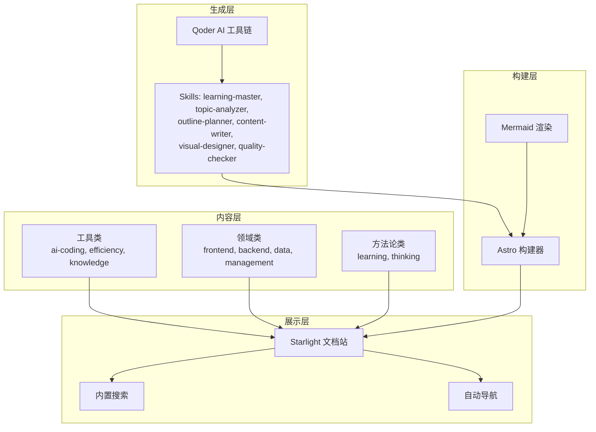
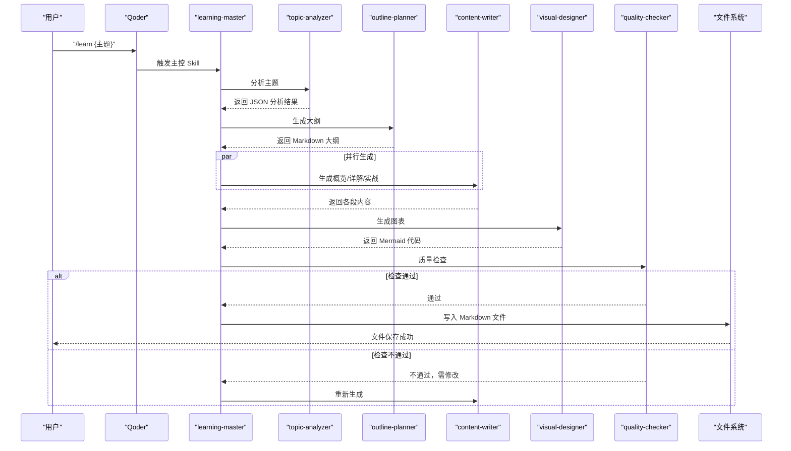
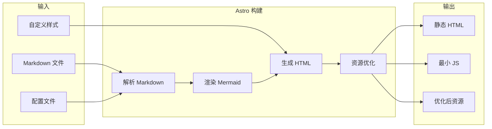
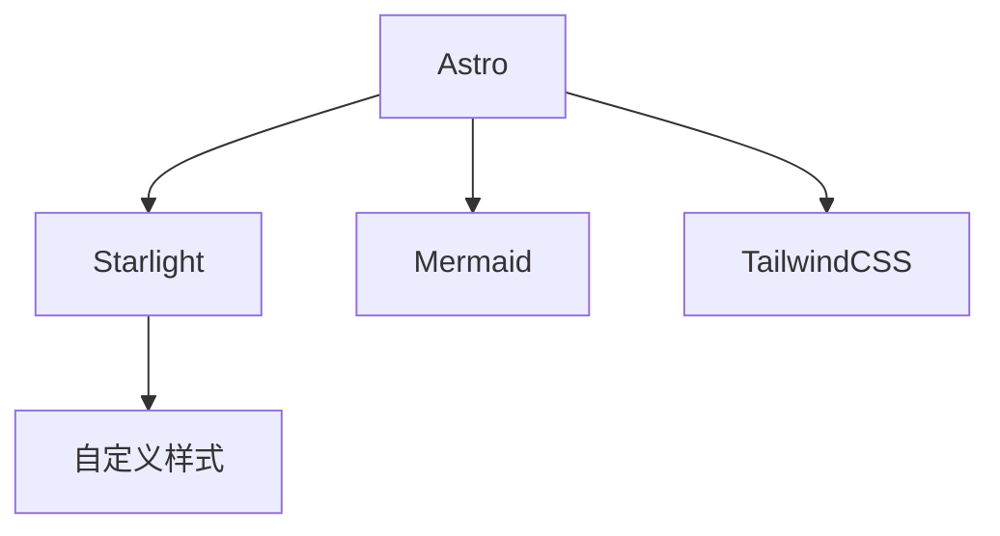

# 知识管理工具

<cite>
**本文引用的文件**
- [package.json](file://package.json)
- [astro.config.mjs](file://astro.config.mjs)
- [src/content.config.ts](file://src/content.config.ts)
- [docs/01-PROJECT-BRIEF.md](file://docs/01-PROJECT-BRIEF.md)
- [docs/03-ARCHITECTURE.md](file://docs/03-ARCHITECTURE.md)
- [src/styles/custom.css](file://src/styles/custom.css)
- [src/content/docs/tools/knowledge/index.md](file://src/content/docs/tools/knowledge/index.md)
- [src/content/docs/tools/ai-coding/index.md](file://src/content/docs/tools/ai-coding/index.md)
- [src/content/docs/tools/efficiency/docker.md](file://src/content/docs/tools/efficiency/docker.md)
- [src/content/docs/domains/backend/index.md](file://src/content/docs/domains/backend/index.md)
- [src/content/docs/methods/learning/index.md](file://src/content/docs/methods/learning/index.md)
</cite>

## 目录
1. [引言](#引言)
2. [项目结构](#项目结构)
3. [核心组件](#核心组件)
4. [架构总览](#架构总览)
5. [详细组件分析](#详细组件分析)
6. [依赖分析](#依赖分析)
7. [性能考虑](#性能考虑)
8. [故障排查指南](#故障排查指南)
9. [结论](#结论)
10. [附录](#附录)

## 引言
本文件面向“知识管理工具”的使用者与维护者，系统阐述 StudyBuddy 的知识管理理念、工具体系、内容组织与生成流程，并提供可落地的实践建议与模板。该工具以“管理者视角”为核心，强调“从记忆转向检索、从深度转向广度、从线性转向网状、从执行转向管理”，通过 AI 驱动的三阶段学习文档（概览→详解→实战）与 Mermaid 可视化，帮助个人与团队建立可检索、可复用、可积累的知识体系。

## 项目结构
项目采用 Astro + Starlight 的静态文档站点，结合 Mermaid 图表与自定义样式，形成“内容即产品”的知识库形态。内容按“工具/领域/方法论”三大分类组织，辅以 AI 技能工作流驱动内容生成。

**图示来源**
- [astro.config.mjs](file://astro.config.mjs#L18-L31)
- [docs/03-ARCHITECTURE.md](file://docs/03-ARCHITECTURE.md#L12-L69)

**章节来源**
- [astro.config.mjs](file://astro.config.mjs#L1-L39)
- [src/content.config.ts](file://src/content.config.ts#L1-L8)
- [docs/03-ARCHITECTURE.md](file://docs/03-ARCHITECTURE.md#L164-L240)

## 核心组件
- 内容生成工作流：由 Qoder 的多技能协作完成主题分析、大纲规划、内容撰写、图表设计与质量检查，最终输出 Markdown 文件供站点构建。
- 文档站点：基于 Starlight 的文档站，具备内置搜索、自动导航、Mermaid 图表渲染与自定义主题样式。
- 内容分类体系：工具/领域/方法论三层分类，便于知识检索与复用。
- 可视化与速查：Mermaid 支持多种图表类型；自定义速查表组件提升检索效率。

**章节来源**
- [docs/03-ARCHITECTURE.md](file://docs/03-ARCHITECTURE.md#L82-L160)
- [docs/03-ARCHITECTURE.md](file://docs/03-ARCHITECTURE.md#L242-L321)
- [src/styles/custom.css](file://src/styles/custom.css#L315-L375)

## 架构总览
下图展示了从用户触发到文档生成与站点呈现的端到端流程。

**图示来源**
- [docs/03-ARCHITECTURE.md](file://docs/03-ARCHITECTURE.md#L86-L126)

**章节来源**
- [docs/03-ARCHITECTURE.md](file://docs/03-ARCHITECTURE.md#L1-L410)

## 详细组件分析

### 内容生成与站点构建流程
- 文档生成：主题分析 → 大纲规划 → 内容撰写（三阶段）→ 图表设计 → 质量检查 → 写入文件。
- 站点构建：Astro 解析 Markdown、渲染 Mermaid、生成 HTML 与优化资源。

**图示来源**
- [docs/03-ARCHITECTURE.md](file://docs/03-ARCHITECTURE.md#L128-L160)

**章节来源**
- [docs/03-ARCHITECTURE.md](file://docs/03-ARCHITECTURE.md#L128-L160)

### Mermaid 图表集成与支持类型
- 集成方式：通过 Astro 集成与 remark 插件启用 Mermaid。
- 支持类型：思维导图、流程图、时序图、类图、状态图等，用于知识体系概览、步骤说明与交互过程描述。

**章节来源**
- [docs/03-ARCHITECTURE.md](file://docs/03-ARCHITECTURE.md#L244-L275)

### 速查表组件与样式
- 组件职责：以表格形式呈现“键-值”对，便于快速检索关键信息。
- 样式特点：毛玻璃背景、圆角边框、悬停高亮，适配深浅主题。

**章节来源**
- [docs/03-ARCHITECTURE.md](file://docs/03-ARCHITECTURE.md#L276-L321)
- [src/styles/custom.css](file://src/styles/custom.css#L330-L375)

### 内容分类与命名规范
- 分类体系：工具、领域、方法论，分别对应 AI 工具、技术领域与学习方法。
- 命名规范：kebab-case、主题明确、避免缩写、单词数 1-3 个，确保可读与可检索。

**章节来源**
- [docs/03-ARCHITECTURE.md](file://docs/03-ARCHITECTURE.md#L223-L240)

### 本地使用与开发流程
- 开发与预览：npm run dev → npm run build → npm run preview。
- 使用流程：在 Qoder 中执行“/learn {topic}”生成文档，本地启动服务浏览。

**章节来源**
- [docs/03-ARCHITECTURE.md](file://docs/03-ARCHITECTURE.md#L323-L364)

### 知识管理工具定位与价值
- 定位：帮助用户将碎片化学习转化为结构化知识体系，强调“可检索、可复用、可积累”。
- 价值：通过三阶段学习法与可视化，降低认知负担，提升检索与应用效率。

**章节来源**
- [src/content/docs/tools/knowledge/index.md](file://src/content/docs/tools/knowledge/index.md#L1-L7)

### AI 编程工具与知识管理的关系
- AI 编程工具作为知识管理的“生产力工具”，帮助快速生成与整理内容，支撑知识体系的持续演进。

**章节来源**
- [src/content/docs/tools/ai-coding/index.md](file://src/content/docs/tools/ai-coding/index.md#L1-L7)

### Docker 与知识管理的实践映射
- Docker 的“镜像-容器-编排”概念可映射到知识管理的“模板-实例-组合”：知识模板（镜像）→ 个人知识实例（容器）→ 多源知识组合（编排）。
- 通过 Docker Compose 的“一键启动”思想，可类比为“一键搭建知识工作流”。

**章节来源**
- [src/content/docs/tools/efficiency/docker.md](file://src/content/docs/tools/efficiency/docker.md#L1-L205)

### 领域知识与方法论的协同
- 领域知识（如后端开发）提供“知识内容”，方法论（如学习方法）提供“知识组织与应用策略”，二者结合形成“内容+方法”的双轮驱动。

**章节来源**
- [src/content/docs/domains/backend/index.md](file://src/content/docs/domains/backend/index.md#L1-L7)
- [src/content/docs/methods/learning/index.md](file://src/content/docs/methods/learning/index.md#L1-L7)

## 依赖分析
- 框架与主题：Astro + Starlight，提供静态优先、开箱即用的文档站点能力。
- 图表与样式：Mermaid + 自定义 CSS，增强知识可视化与阅读体验。
- 构建与插件：TailwindCSS 集成、remark-mermaid 插件、Mermaid 集成。

**图示来源**
- [package.json](file://package.json#L12-L20)
- [astro.config.mjs](file://astro.config.mjs#L1-L39)
- [src/styles/custom.css](file://src/styles/custom.css#L1-L485)

**章节来源**
- [package.json](file://package.json#L1-L22)
- [astro.config.mjs](file://astro.config.mjs#L1-L39)

## 性能考虑
- 构建优化：增量构建、图片优化、代码分割，显著缩短构建与首屏加载时间。
- 运行时优化：静态生成、CDN 缓存、懒加载图表，确保零运行时 JS 与低延迟访问。

**章节来源**
- [docs/03-ARCHITECTURE.md](file://docs/03-ARCHITECTURE.md#L366-L383)

## 故障排查指南
- 文档未显示 Mermaid 图表
  - 检查 Astro 集成与 remark 插件是否正确配置。
  - 确认 Markdown 中 Mermaid 语法正确且处于受支持的块中。
- 本地开发无法访问
  - 确认已执行开发命令并监听本地端口。
  - 检查网络与防火墙设置。
- 导航缺失或分类不显示
  - 检查 Starlight 的 sidebar 配置是否包含对应目录。
  - 确认内容文件路径与命名符合规范。

**章节来源**
- [astro.config.mjs](file://astro.config.mjs#L18-L31)
- [docs/03-ARCHITECTURE.md](file://docs/03-ARCHITECTURE.md#L323-L364)

## 结论
StudyBuddy 以“管理者视角”的知识管理理念为核心，借助 AI 技能工作流与静态站点技术，实现了从“知识收集→整理→存储→检索→应用”的闭环。通过清晰的分类体系、可视化图表与速查组件，既能满足个人知识体系的建立，也能支撑团队协作与知识沉淀。建议在实践中坚持“先框架后细节、先检索后记忆、先关联后孤立”的原则，持续迭代内容与工作流。

## 附录

### 知识管理工具的功能特性与使用技巧
- 功能特性
  - 三阶段学习文档：概览、详解、实战，覆盖“理解—应用—迁移”全过程。
  - 可视化知识图谱：思维导图、流程图、时序图，帮助快速把握知识结构。
  - 速查表组件：高频命令与要点的表格化呈现，提升检索效率。
- 使用技巧
  - 以“问题驱动”触发 AI 生成，围绕“为什么、何时用、如何用”展开。
  - 优先使用 Mermaid 建立知识图谱，再填充细节内容。
  - 将“模板化”作为知识复用的关键：统一结构、统一术语、统一命名。

**章节来源**
- [docs/01-PROJECT-BRIEF.md](file://docs/01-PROJECT-BRIEF.md#L17-L58)
- [docs/03-ARCHITECTURE.md](file://docs/03-ARCHITECTURE.md#L244-L321)

### 知识结构化组织的最佳实践与模板
- 最佳实践
  - 分类清晰：工具/领域/方法论三分法，便于检索与复用。
  - 命名规范：kebab-case、主题明确、避免缩写、单词数 1-3 个。
  - 结构稳定：三段式结构（概览→详解→实战），统一模板。
- 模板建议
  - 概览：一句话定义、核心问题、适用场景、前置知识。
  - 详解：概念拆解、关系图谱、关键命令/参数、常见陷阱。
  - 实战：联动应用、决策流程图、速查表、扩展阅读。

**章节来源**
- [docs/03-ARCHITECTURE.md](file://docs/03-ARCHITECTURE.md#L223-L240)
- [src/content/docs/tools/efficiency/docker.md](file://src/content/docs/tools/efficiency/docker.md#L174-L187)

### 知识分享、协作与版本管理策略
- 分享与协作
  - 本地静态站点便于离线分享与团队内网传播。
  - 通过 Git 进行版本控制，配合分支策略管理多人协作。
- 版本管理
  - 采用语义化版本与变更日志，记录重大结构调整。
  - 对图表与速查表进行“结构化版本”管理，确保检索稳定性。

**章节来源**
- [docs/01-PROJECT-BRIEF.md](file://docs/01-PROJECT-BRIEF.md#L84-L94)

### 知识评估、更新与淘汰的标准流程
- 评估指标
  - 内容质量评分（人工评估）、生成与构建性能指标。
- 更新流程
  - 定期评审：按主题维度评估过时程度与替代方案。
  - 迭代更新：通过 AI 重新生成与 Mermaid 重构图谱。
- 淘汰流程
  - 标记归档：对过时内容进行归档与链接迁移。
  - 清理策略：定期清理长期无人访问的旧文档。

**章节来源**
- [docs/01-PROJECT-BRIEF.md](file://docs/01-PROJECT-BRIEF.md#L112-L120)

### 建立个人或团队知识体系的完整指导
- 个人层面
  - 以“管理者视角”制定学习计划，聚焦“为什么、何时用、如何用”。
  - 使用三阶段模板沉淀知识，配合 Mermaid 建立知识图谱。
- 团队层面
  - 统一分类与命名规范，保障跨成员协作一致性。
  - 通过 AI 技能工作流批量生成与审核，提升产出效率。
  - 借助静态站点实现知识资产的低成本维护与传播。

**章节来源**
- [docs/01-PROJECT-BRIEF.md](file://docs/01-PROJECT-BRIEF.md#L37-L58)
- [docs/03-ARCHITECTURE.md](file://docs/03-ARCHITECTURE.md#L386-L406)