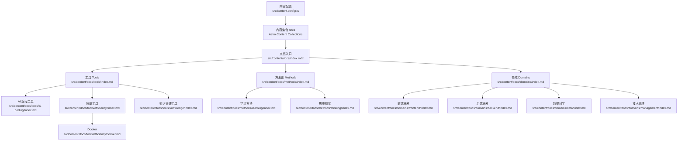
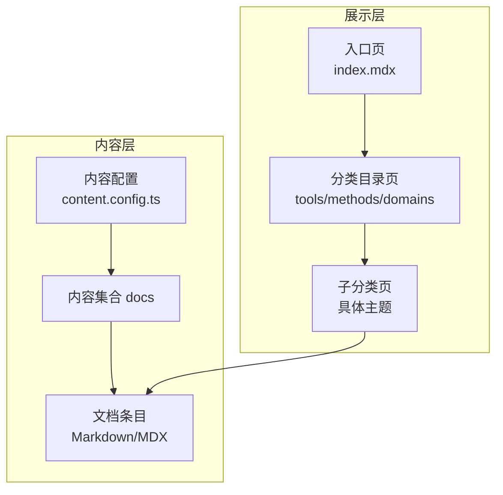
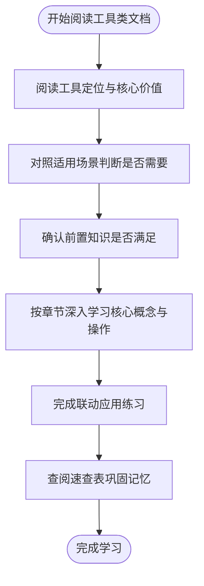
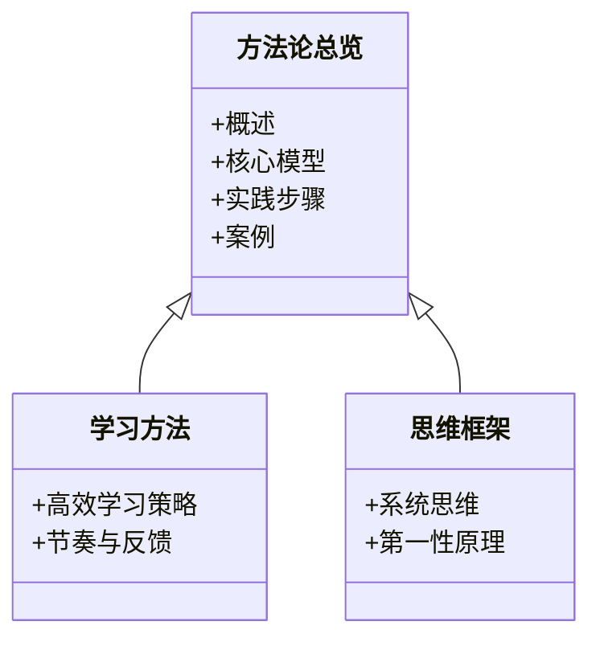
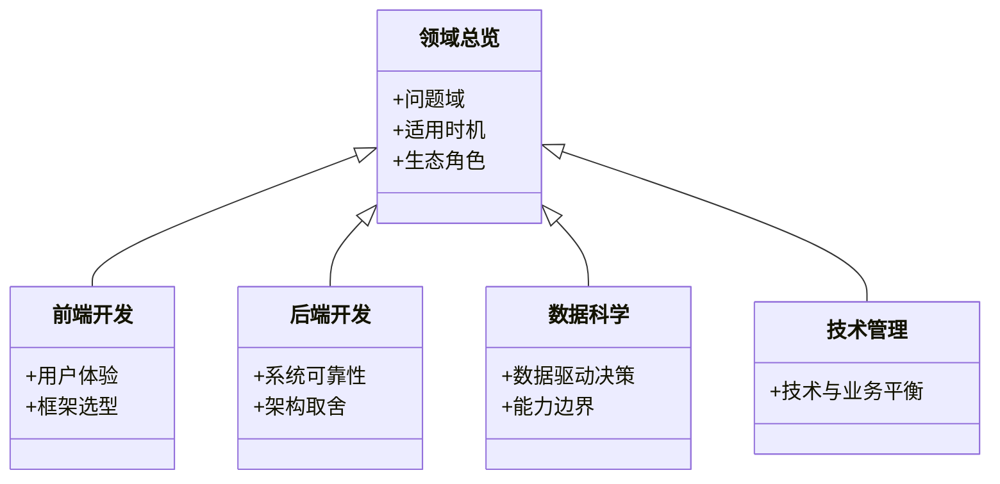
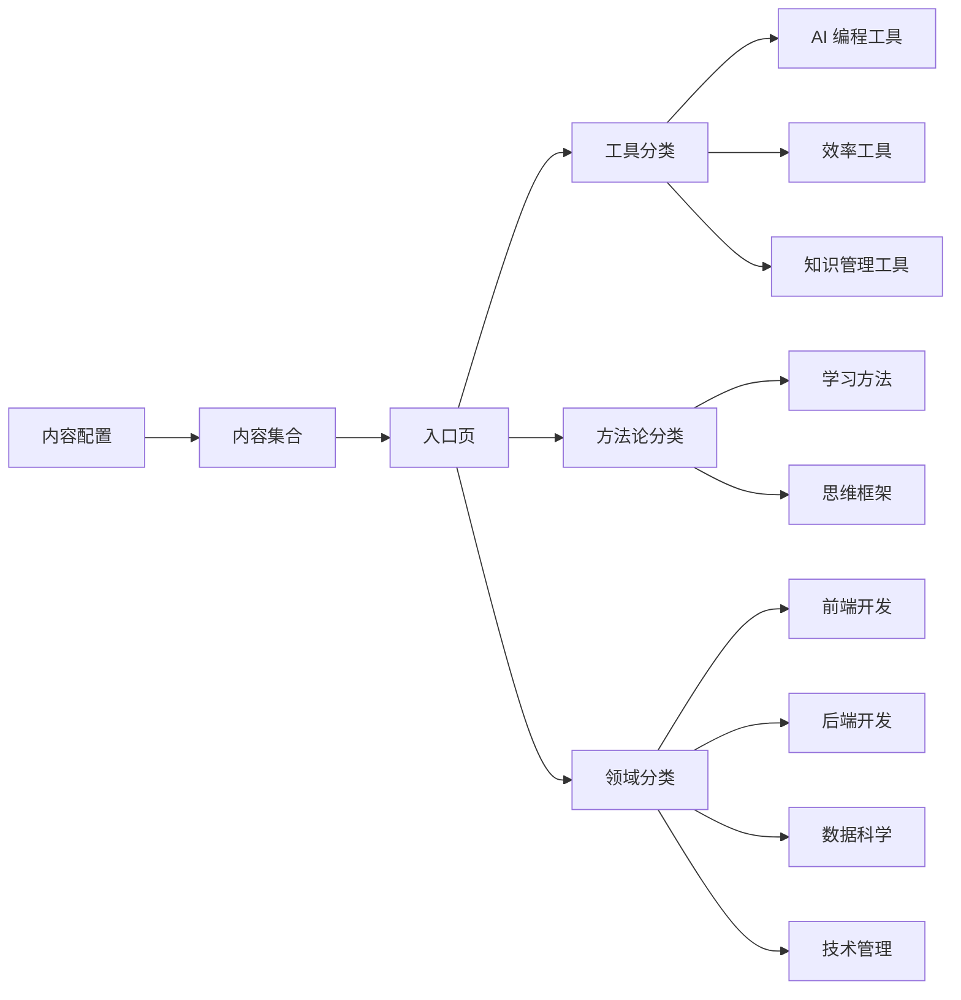

# 文档内容管理

<cite>
**本文引用的文件**
- [src/content.config.ts](file://src/content.config.ts)
- [src/content/docs/index.mdx](file://src/content/docs/index.mdx)
- [src/content/docs/domains/index.md](file://src/content/docs/domains/index.md)
- [src/content/docs/domains/frontend/index.md](file://src/content/docs/domains/frontend/index.md)
- [src/content/docs/domains/backend/index.md](file://src/content/docs/domains/backend/index.md)
- [src/content/docs/domains/data/index.md](file://src/content/docs/domains/data/index.md)
- [src/content/docs/domains/management/index.md](file://src/content/docs/domains/management/index.md)
- [src/content/docs/methods/index.md](file://src/content/docs/methods/index.md)
- [src/content/docs/methods/learning/index.md](file://src/content/docs/methods/learning/index.md)
- [src/content/docs/methods/thinking/index.md](file://src/content/docs/methods/thinking/index.md)
- [src/content/docs/tools/index.md](file://src/content/docs/tools/index.md)
- [src/content/docs/tools/ai-coding/index.md](file://src/content/docs/tools/ai-coding/index.md)
- [src/content/docs/tools/efficiency/index.md](file://src/content/docs/tools/efficiency/index.md)
- [src/content/docs/tools/efficiency/docker.md](file://src/content/docs/tools/efficiency/docker.md)
- [src/content/docs/tools/knowledge/index.md](file://src/content/docs/tools/knowledge/index.md)
</cite>

## 目录
1. [引言](#引言)
2. [项目结构](#项目结构)
3. [核心组件](#核心组件)
4. [架构总览](#架构总览)
5. [详细组件分析](#详细组件分析)
6. [依赖分析](#依赖分析)
7. [性能考虑](#性能考虑)
8. [故障排除指南](#故障排除指南)
9. [结论](#结论)
10. [附录](#附录)

## 引言
本文件面向 StudyBuddy 的文档内容管理，系统化阐述文档分类体系的设计理念与组织结构，明确工具类、领域类与方法论类文档的分类标准与内容规范，给出命名约定、元数据管理与版本控制策略建议，并提供内容创作最佳实践、模板与审核流程说明。同时，说明文档的构建、发布与更新机制，以及如何新增文档类别与扩展内容体系。

## 项目结构
StudyBuddy 的文档采用 Astro + Starlight 的内容模型，通过内容集合与 Markdown/MDX 文档组织知识体系。内容位于 src/content/docs 下，按三大类别划分：工具、方法论、领域。每个类别下设若干子分类，形成“总览 + 子分类 + 具体条目”的层级结构。

图表来源
- [src/content.config.ts](file://src/content.config.ts#L1-L8)
- [src/content/docs/index.mdx](file://src/content/docs/index.mdx)
- [src/content/docs/tools/index.md](file://src/content/docs/tools/index.md#L1-L13)
- [src/content/docs/methods/index.md](file://src/content/docs/methods/index.md#L1-L12)
- [src/content/docs/domains/index.md](file://src/content/docs/domains/index.md#L1-L14)

章节来源
- [src/content.config.ts](file://src/content.config.ts#L1-L8)
- [src/content/docs/index.mdx](file://src/content/docs/index.mdx)

## 核心组件
- 内容集合与加载器
  - 通过内容配置定义 docs 集合，使用 Astro Content 的 loader 与 schema，确保文档具备统一的元数据结构与渲染能力。
- 文档入口与导航
  - 顶层 index.mdx 作为文档站点的入口页面，用于引导用户进入三大分类。
- 分类目录页
  - 工具、方法论、领域三类目录页提供分类概览与子分类链接，形成清晰的知识地图。
- 具体条目
  - 各子分类下的 index.md 或专题文档（如 Docker）承载具体知识内容，遵循统一的元数据与内容结构。

章节来源
- [src/content.config.ts](file://src/content.config.ts#L1-L8)
- [src/content/docs/index.mdx](file://src/content/docs/index.mdx)
- [src/content/docs/tools/index.md](file://src/content/docs/tools/index.md#L1-L13)
- [src/content/docs/methods/index.md](file://src/content/docs/methods/index.md#L1-L12)
- [src/content/docs/domains/index.md](file://src/content/docs/domains/index.md#L1-L14)

## 架构总览
文档内容管理由“内容配置 → 内容集合 → 目录页 → 条目页”构成的分层架构支撑。Starlight 的 schema 保证元数据一致性，Markdown/MDX 渲染提供灵活的内容表达。

图表来源
- [src/content.config.ts](file://src/content.config.ts#L1-L8)
- [src/content/docs/index.mdx](file://src/content/docs/index.mdx)
- [src/content/docs/tools/index.md](file://src/content/docs/tools/index.md#L1-L13)
- [src/content/docs/methods/index.md](file://src/content/docs/methods/index.md#L1-L12)
- [src/content/docs/domains/index.md](file://src/content/docs/domains/index.md#L1-L14)

## 详细组件分析

### 工具类文档（Tools）
- 分类标准
  - 以“提升工作与学习效率”为核心，强调“何时用、为何用、如何用”。涵盖 AI 编程工具、效率工具、知识管理工具等。
- 内容规范
  - 明确工具定位与核心价值，列出适用场景与前置知识，提供知识体系思维导图或流程图，附带“联动应用”的实操练习与速查表。
- 示例：Docker 专题
  - 包含“一句话定义、核心解决的问题对比、适用场景、前置知识、知识体系思维导图、分章节详解、联动应用、速查表”等模块，形成完整的学习闭环。

图表来源
- [src/content/docs/tools/efficiency/docker.md](file://src/content/docs/tools/efficiency/docker.md#L1-L205)

章节来源
- [src/content/docs/tools/index.md](file://src/content/docs/tools/index.md#L1-L13)
- [src/content/docs/tools/ai-coding/index.md](file://src/content/docs/tools/ai-coding/index.md#L1-L7)
- [src/content/docs/tools/efficiency/index.md](file://src/content/docs/tools/efficiency/index.md#L1-L7)
- [src/content/docs/tools/efficiency/docker.md](file://src/content/docs/tools/efficiency/docker.md#L1-L205)
- [src/content/docs/tools/knowledge/index.md](file://src/content/docs/tools/knowledge/index.md#L1-L7)

### 方法论类文档（Methods）
- 分类标准
  - 以“元知识”为目标，聚焦高效学习与思维框架，强调底层逻辑与可迁移能力。
- 内容规范
  - 提供方法论概述、核心模型、实践步骤与案例，帮助读者建立可复用的认知框架。
- 示例：学习方法、思维框架
  - 两类子分类分别覆盖学习策略与决策模型，作为方法论体系的两大支柱。

图表来源
- [src/content/docs/methods/index.md](file://src/content/docs/methods/index.md#L1-L12)
- [src/content/docs/methods/learning/index.md](file://src/content/docs/methods/learning/index.md#L1-L7)
- [src/content/docs/methods/thinking/index.md](file://src/content/docs/methods/thinking/index.md#L1-L7)

章节来源
- [src/content/docs/methods/index.md](file://src/content/docs/methods/index.md#L1-L12)
- [src/content/docs/methods/learning/index.md](file://src/content/docs/methods/learning/index.md#L1-L7)
- [src/content/docs/methods/thinking/index.md](file://src/content/docs/methods/thinking/index.md#L1-L7)

### 领域类文档（Domains）
- 分类标准
  - 聚焦技术领域全局认知，强调“解决什么问题、何时使用、生态关键角色”，帮助管理者建立跨领域的系统性理解。
- 内容规范
  - 提供领域概览、关键方向与选型取舍，避免陷入“工具崇拜”，回归“问题与场景”。
- 示例：前端、后端、数据科学、技术管理
  - 四大方向分别覆盖技术栈、架构设计、数据能力与管理决策，形成完整的知识地图。

图表来源
- [src/content/docs/domains/index.md](file://src/content/docs/domains/index.md#L1-L14)
- [src/content/docs/domains/frontend/index.md](file://src/content/docs/domains/frontend/index.md#L1-L7)
- [src/content/docs/domains/backend/index.md](file://src/content/docs/domains/backend/index.md#L1-L7)
- [src/content/docs/domains/data/index.md](file://src/content/docs/domains/data/index.md#L1-L7)
- [src/content/docs/domains/management/index.md](file://src/content/docs/domains/management/index.md#L1-L7)

章节来源
- [src/content/docs/domains/index.md](file://src/content/docs/domains/index.md#L1-L14)
- [src/content/docs/domains/frontend/index.md](file://src/content/docs/domains/frontend/index.md#L1-L7)
- [src/content/docs/domains/backend/index.md](file://src/content/docs/domains/backend/index.md#L1-L7)
- [src/content/docs/domains/data/index.md](file://src/content/docs/domains/data/index.md#L1-L7)
- [src/content/docs/domains/management/index.md](file://src/content/docs/domains/management/index.md#L1-L7)

## 依赖分析
- 配置依赖
  - 内容集合依赖 Astro Content 的 loader 与 schema，确保文档元数据与渲染行为一致。
- 结构依赖
  - 顶层入口页依赖三大分类目录页；分类目录页依赖子分类与条目页；条目页依赖统一的元数据与内容结构。
- 可扩展依赖
  - 新增分类只需在对应目录下创建 index.md 并在父级目录页中补充链接，即可无缝接入现有体系。

图表来源
- [src/content.config.ts](file://src/content.config.ts#L1-L8)
- [src/content/docs/index.mdx](file://src/content/docs/index.mdx)
- [src/content/docs/tools/index.md](file://src/content/docs/tools/index.md#L1-L13)
- [src/content/docs/methods/index.md](file://src/content/docs/methods/index.md#L1-L12)
- [src/content/docs/domains/index.md](file://src/content/docs/domains/index.md#L1-L14)

章节来源
- [src/content.config.ts](file://src/content.config.ts#L1-L8)
- [src/content/docs/index.mdx](file://src/content/docs/index.mdx)

## 性能考虑
- 内容体积与加载
  - 控制单篇文档长度，拆分长文为子章节，减少首屏渲染压力。
- 图表与多媒体
  - 合理使用 mermaid、图片与表格，避免过多重资源导致加载缓慢。
- 导航与索引
  - 保持目录页简洁明了，减少深层嵌套，提升用户查找效率。
- 构建优化
  - 利用 Astro 的静态生成能力，结合 Starlight 的路由与搜索，降低运行时开销。

## 故障排除指南
- 文档无法显示或链接失效
  - 检查父级目录页的子分类链接是否正确指向目标路径。
  - 确认目标文档存在且命名符合约定（推荐使用全小写、短横线分隔）。
- 元数据缺失或格式错误
  - 确保文档头部包含标题与描述；如需标签，参考工具类文档的 tags 写法。
- 构建失败
  - 检查内容配置是否正确加载 loader 与 schema；确认文件编码与语法无误。

章节来源
- [src/content.config.ts](file://src/content.config.ts#L1-L8)
- [src/content/docs/tools/efficiency/docker.md](file://src/content/docs/tools/efficiency/docker.md#L1-L205)

## 结论
StudyBuddy 的文档内容管理体系以“工具—方法论—领域”三层结构为核心，辅以统一的元数据与内容规范，形成可扩展、可维护的知识体系。通过明确的分类标准、命名约定与版本策略，能够持续产出高质量内容，并支持新类别的平滑扩展。

## 附录

### 文档命名约定
- 目录与条目
  - 推荐使用全小写与短横线分隔，避免空格与特殊字符。
  - 目录页使用 index.md，条目文档使用具体主题名（如 docker.md）。
- 路径与链接
  - 保持与目录层级一致，父级目录页中补充子分类链接，确保导航连贯。

章节来源
- [src/content/docs/tools/efficiency/docker.md](file://src/content/docs/tools/efficiency/docker.md#L1-L205)

### 元数据管理
- 必填字段
  - 标题（title）：简明概括文档主题。
  - 描述（description）：一句话说明文档价值与受众。
- 可选字段
  - 标签（tags）：用于检索与分类（参考工具类文档）。
- 写法规范
  - 使用 YAML 头部，字段顺序建议：title → description → tags（如有）。

章节来源
- [src/content/docs/tools/efficiency/docker.md](file://src/content/docs/tools/efficiency/docker.md#L1-L5)

### 版本控制策略
- 主干保护
  - 重要文档变更通过分支与合并请求进行评审，主分支保持稳定发布状态。
- 标签与版本
  - 重要更新打标签，配合变更日志记录重大改动。
- 回滚与审计
  - 保留历史提交，必要时可回滚至稳定版本。

### 内容创作最佳实践
- 结构化表达
  - 使用清晰的小节标题与要点列表，避免大段文字堆砌。
- 场景导向
  - 以“问题—方案—验证”为主线，突出“何时用、为何用”。
- 实践闭环
  - 提供“联动应用”练习与“速查表”，强化可操作性。
- 可检索性
  - 合理使用标题层级与关键词，便于站内搜索与交叉引用。

### 模板与示例
- 工具类模板（参考 Docker）
  - 概览：一句话定义、核心解决的问题、适用场景、前置知识。
  - 知识体系：思维导图或流程图。
  - 分章节：核心概念与操作步骤，配套命令与表格。
  - 联动应用：初级/中级/高级实践目标与步骤。
  - 速查表：常用命令与操作清单。
- 方法论模板
  - 概述：方法论价值与适用范围。
  - 核心模型：关键概念与流程。
  - 实践步骤：可落地的操作指南。
  - 案例：典型场景与决策思路。
- 领域模板
  - 概述：问题域、适用时机、生态角色。
  - 关键方向：选型取舍与边界。
  - 管理视角：技术与业务平衡。

章节来源
- [src/content/docs/tools/efficiency/docker.md](file://src/content/docs/tools/efficiency/docker.md#L1-L205)
- [src/content/docs/methods/learning/index.md](file://src/content/docs/methods/learning/index.md#L1-L7)
- [src/content/docs/methods/thinking/index.md](file://src/content/docs/methods/thinking/index.md#L1-L7)
- [src/content/docs/domains/frontend/index.md](file://src/content/docs/domains/frontend/index.md#L1-L7)
- [src/content/docs/domains/backend/index.md](file://src/content/docs/domains/backend/index.md#L1-L7)
- [src/content/docs/domains/data/index.md](file://src/content/docs/domains/data/index.md#L1-L7)
- [src/content/docs/domains/management/index.md](file://src/content/docs/domains/management/index.md#L1-L7)

### 构建、发布与更新策略
- 构建流程
  - 通过 Astro 的内容加载器解析 Markdown/MDX，结合 Starlight 的 schema 生成页面与导航。
- 发布机制
  - 静态站点生成后部署至目标环境；可结合 CI/CD 自动化构建与发布。
- 更新策略
  - 小步快跑：频繁小幅更新，保持内容新鲜度。
  - 影响评估：重大改动提前公告，提供迁移指引。

章节来源
- [src/content.config.ts](file://src/content.config.ts#L1-L8)

### 审核流程
- 质量检查
  - 结构完整性：标题层级、链接有效性、元数据齐全。
  - 内容准确性：术语一致、示例可复现、流程无歧义。
  - 可读性：语言简洁、逻辑清晰、图表辅助。
- 审核节点
  - 作者自检 → 同行评审 → 发布审批 → 上线监控。
- 反馈与迭代
  - 建立用户反馈渠道，定期回顾与优化内容质量。

### 新增文档类别与扩展内容体系
- 新增步骤
  - 在对应目录下创建 index.md，撰写分类概览与子分类链接。
  - 在父级目录页补充新分类链接，确保导航完整。
- 扩展建议
  - 保持与既有分类的语义一致，避免过度细分。
  - 优先补齐缺失的关键场景与工具，再考虑横向扩展。

章节来源
- [src/content/docs/tools/index.md](file://src/content/docs/tools/index.md#L1-L13)
- [src/content/docs/methods/index.md](file://src/content/docs/methods/index.md#L1-L12)
- [src/content/docs/domains/index.md](file://src/content/docs/domains/index.md#L1-L14)