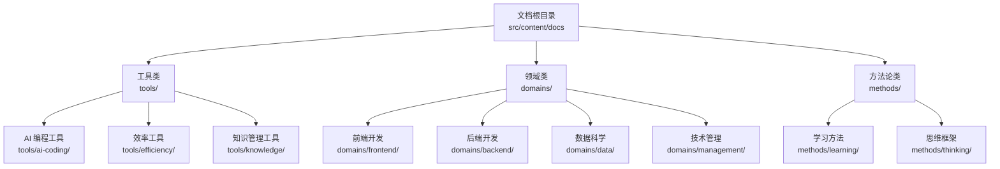
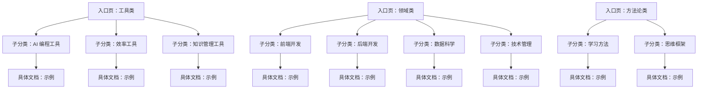
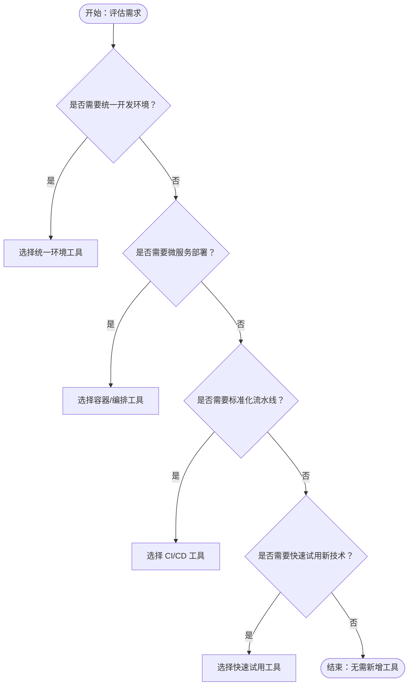
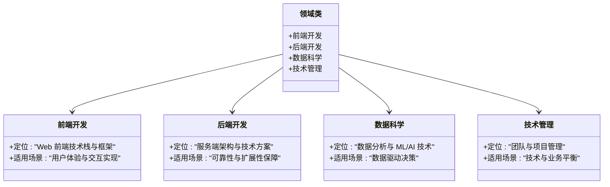
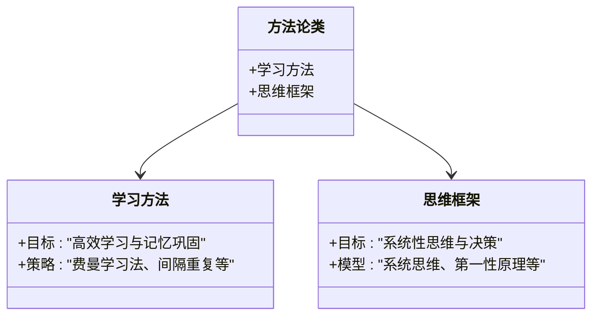
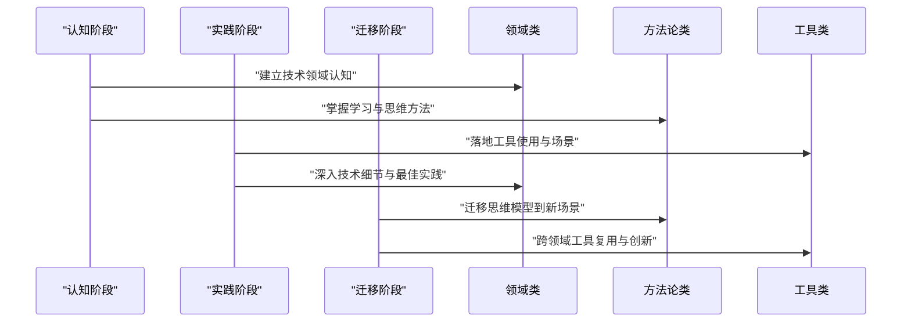
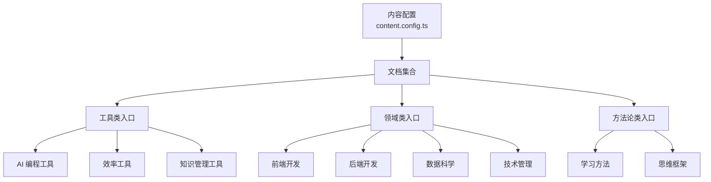

# 文档分类体系

<cite>
**本文档引用的文件**
- [src/content.config.ts](file://src/content.config.ts)
- [src/content/docs/tools/index.md](file://src/content/docs/tools/index.md)
- [src/content/docs/tools/ai-coding/index.md](file://src/content/docs/tools/ai-coding/index.md)
- [src/content/docs/tools/efficiency/docker.md](file://src/content/docs/tools/efficiency/docker.md)
- [src/content/docs/tools/knowledge/index.md](file://src/content/docs/tools/knowledge/index.md)
- [src/content/docs/domains/index.md](file://src/content/docs/domains/index.md)
- [src/content/docs/domains/frontend/index.md](file://src/content/docs/domains/frontend/index.md)
- [src/content/docs/domains/backend/index.md](file://src/content/docs/domains/backend/index.md)
- [src/content/docs/domains/data/index.md](file://src/content/docs/domains/data/index.md)
- [src/content/docs/domains/management/index.md](file://src/content/docs/domains/management/index.md)
- [src/content/docs/methods/index.md](file://src/content/docs/methods/index.md)
- [src/content/docs/methods/learning/index.md](file://src/content/docs/methods/learning/index.md)
- [src/content/docs/methods/thinking/index.md](file://src/content/docs/methods/thinking/index.md)
</cite>

## 目录
1. [引言](#引言)
2. [项目结构](#项目结构)
3. [核心组件](#核心组件)
4. [架构总览](#架构总览)
5. [详细组件分析](#详细组件分析)
6. [依赖分析](#依赖分析)
7. [性能考虑](#性能考虑)
8. [故障排除指南](#故障排除指南)
9. [结论](#结论)
10. [附录](#附录)

## 引言
本文件系统化阐述 StudyBuddy 的文档分类体系，围绕“工具类”“领域类”“方法论类”三大维度，明确分类标准、组织原则与交叉引用机制，并给出分类选择指南、内容归档策略以及与三阶段学习框架的映射关系。同时提供分类扩展机制与新分类添加流程，辅以分类决策树与最佳实践，帮助内容创作者高效完成内容归档与导航设计。

## 项目结构
StudyBuddy 的文档采用分层目录结构，根目录下通过 Astro Starlight 配置加载文档集合，内容按三大分类组织：
- 工具类（Tools）：聚焦“可用性与适用场景”，强调“何时用、为何用”的判断力
- 领域类（Domains）：聚焦“技术领域全景与关键角色”，强调“解决什么问题、何时使用、生态角色”
- 方法论类（Methods）：聚焦“元知识与底层逻辑”，强调“如何学习、如何思考”

图表来源
- [src/content/docs/tools/index.md](file://src/content/docs/tools/index.md#L1-L13)
- [src/content/docs/domains/index.md](file://src/content/docs/domains/index.md#L1-L14)
- [src/content/docs/methods/index.md](file://src/content/docs/methods/index.md#L1-L12)

章节来源
- [src/content.config.ts](file://src/content.config.ts#L1-L8)
- [src/content/docs/tools/index.md](file://src/content/docs/tools/index.md#L1-L13)
- [src/content/docs/domains/index.md](file://src/content/docs/domains/index.md#L1-L14)
- [src/content/docs/methods/index.md](file://src/content/docs/methods/index.md#L1-L12)

## 核心组件
- 文档集合配置：通过 Astro Starlight 的文档加载器与模式定义，统一管理文档元数据与渲染行为
- 三大分类入口页：分别提供分类概述、适用场景与子分类导航
- 子分类内容：覆盖工具使用指南、技术领域概览、学习与思维方法论

章节来源
- [src/content.config.ts](file://src/content.config.ts#L1-L8)
- [src/content/docs/tools/index.md](file://src/content/docs/tools/index.md#L1-L13)
- [src/content/docs/domains/index.md](file://src/content/docs/domains/index.md#L1-L14)
- [src/content/docs/methods/index.md](file://src/content/docs/methods/index.md#L1-L12)

## 架构总览
分类体系遵循“入口页 + 子分类 + 具体文档”的层级结构，入口页承担“导航与定位”的职责，子分类细化主题，具体文档承载知识细节与实践路径。该结构天然支持“从宏观到微观”的学习路径，契合三阶段学习框架（认知—实践—迁移）。

图表来源
- [src/content/docs/tools/index.md](file://src/content/docs/tools/index.md#L1-L13)
- [src/content/docs/domains/index.md](file://src/content/docs/domains/index.md#L1-L14)
- [src/content/docs/methods/index.md](file://src/content/docs/methods/index.md#L1-L12)

## 详细组件分析

### 工具类（Tools）
- 设计理念：以“管理者视角”审视工具，强调“定位、适用场景与核心价值”。工具本身不是目的，关键在于“何时用、为何用”的判断力。
- 适用场景：
  - 需要统一团队开发环境
  - 需要微服务部署与编排
  - 需要标准化 CI/CD 流程
  - 需要快速试用新技术或服务
- 内容范围：
  - AI 编程工具：理解 AI 辅助开发工具的能力边界与最佳应用场景
  - 效率工具：如 Docker 等提升工作效率的工具，强调标准化、可移植与可复现
  - 知识管理工具：如 Obsidian 等，帮助构建可检索、可复用、可积累的知识体系
- 示例参考：Docker 文档展示了“一句话定义、核心解决的问题、适用场景、前置知识、知识体系思维导图、分章节详解、联动应用、速查表”等结构化组织方式

图表来源
- [src/content/docs/tools/efficiency/docker.md](file://src/content/docs/tools/efficiency/docker.md#L174-L187)

章节来源
- [src/content/docs/tools/index.md](file://src/content/docs/tools/index.md#L1-L13)
- [src/content/docs/tools/ai-coding/index.md](file://src/content/docs/tools/ai-coding/index.md#L1-L7)
- [src/content/docs/tools/efficiency/docker.md](file://src/content/docs/tools/efficiency/docker.md#L1-L205)
- [src/content/docs/tools/knowledge/index.md](file://src/content/docs/tools/knowledge/index.md#L1-L7)

### 领域类（Domains）
- 设计理念：建立对技术领域的全局认知，核心是“它解决什么问题、什么时候该用、生态里有哪些关键角色”。
- 适用场景：
  - 技术选型与架构决策
  - 团队能力规划与培训
  - 产品与技术的结合点分析
- 内容范围：
  - 前端开发：Web 前端技术栈与框架
  - 后端开发：服务端架构与技术方案
  - 数据科学：数据分析与机器学习相关技术
  - 技术管理：团队管理、项目管理与架构决策
- 组织原则：每个子分类提供“一句话定位 + 适用场景 + 关键角色/技术点”的结构化描述

图表来源
- [src/content/docs/domains/index.md](file://src/content/docs/domains/index.md#L1-L14)
- [src/content/docs/domains/frontend/index.md](file://src/content/docs/domains/frontend/index.md#L1-L7)
- [src/content/docs/domains/backend/index.md](file://src/content/docs/domains/backend/index.md#L1-L7)
- [src/content/docs/domains/data/index.md](file://src/content/docs/domains/data/index.md#L1-L7)
- [src/content/docs/domains/management/index.md](file://src/content/docs/domains/management/index.md#L1-L7)

章节来源
- [src/content/docs/domains/index.md](file://src/content/docs/domains/index.md#L1-L14)
- [src/content/docs/domains/frontend/index.md](file://src/content/docs/domains/frontend/index.md#L1-L7)
- [src/content/docs/domains/backend/index.md](file://src/content/docs/domains/backend/index.md#L1-L7)
- [src/content/docs/domains/data/index.md](file://src/content/docs/domains/data/index.md#L1-L7)
- [src/content/docs/domains/management/index.md](file://src/content/docs/domains/management/index.md#L1-L7)

### 方法论类（Methods）
- 设计理念：方法论是“元知识”，强调“如何学习、如何思考”，比掌握具体知识更具长期价值。
- 适用场景：
  - 提升学习效率与记忆巩固
  - 建立系统性思维与决策框架
  - 解决复杂问题的关键切入点
- 内容范围：
  - 学习方法：如费曼学习法、间隔重复等高效学习策略
  - 思维框架：如系统思维、第一性原理等决策框架
- 组织原则：每个子分类提供“一句话定位 + 适用场景”的结构化描述，便于快速匹配与应用

图表来源
- [src/content/docs/methods/index.md](file://src/content/docs/methods/index.md#L1-L12)
- [src/content/docs/methods/learning/index.md](file://src/content/docs/methods/learning/index.md#L1-L7)
- [src/content/docs/methods/thinking/index.md](file://src/content/docs/methods/thinking/index.md#L1-L7)

章节来源
- [src/content/docs/methods/index.md](file://src/content/docs/methods/index.md#L1-L12)
- [src/content/docs/methods/learning/index.md](file://src/content/docs/methods/learning/index.md#L1-L7)
- [src/content/docs/methods/thinking/index.md](file://src/content/docs/methods/thinking/index.md#L1-L7)

### 三阶段学习框架映射
- 认知阶段：通过领域类与方法论类建立“全局认知”与“底层逻辑”
- 实践阶段：通过工具类与领域类的具体文档进行“实操演练”
- 迁移阶段：通过方法论类的思维框架与工具类的跨场景应用实现“举一反三”

图表来源
- [src/content/docs/tools/efficiency/docker.md](file://src/content/docs/tools/efficiency/docker.md#L1-L205)
- [src/content/docs/domains/backend/index.md](file://src/content/docs/domains/backend/index.md#L1-L7)
- [src/content/docs/methods/thinking/index.md](file://src/content/docs/methods/thinking/index.md#L1-L7)

## 依赖分析
- 配置依赖：文档集合通过 Astro Starlight 的加载器与模式定义统一管理，确保入口页与子分类的元数据一致性
- 结构依赖：三大分类入口页与子分类之间存在强依赖关系，子分类需与入口页保持一致的命名规范与导航结构
- 内容依赖：工具类与领域类文档常引用方法论类的思维框架与学习方法，形成“方法论指导实践”的闭环

图表来源
- [src/content.config.ts](file://src/content.config.ts#L1-L8)
- [src/content/docs/tools/index.md](file://src/content/docs/tools/index.md#L1-L13)
- [src/content/docs/domains/index.md](file://src/content/docs/domains/index.md#L1-L14)
- [src/content/docs/methods/index.md](file://src/content/docs/methods/index.md#L1-L12)

章节来源
- [src/content.config.ts](file://src/content.config.ts#L1-L8)
- [src/content/docs/tools/index.md](file://src/content/docs/tools/index.md#L1-L13)
- [src/content/docs/domains/index.md](file://src/content/docs/domains/index.md#L1-L14)
- [src/content/docs/methods/index.md](file://src/content/docs/methods/index.md#L1-L12)

## 性能考虑
- 导航性能：入口页与子分类采用静态链接，减少动态查询开销
- 内容加载：工具类与领域类文档建议控制单篇字数，配合“知识体系思维导图”“速查表”等可视化元素提升阅读效率
- 搜索优化：为工具类文档补充关键词标签，有助于在搜索时快速定位适用场景

## 故障排除指南
- 分类错位：若某篇文档更适合其他分类，应调整其子分类归属或拆分为多个子文档
- 导航断链：检查入口页与子分类的链接一致性，确保路径正确无误
- 内容冗余：避免同一知识点在多个子分类重复出现，可通过交叉引用指向权威来源

## 结论
StudyBuddy 的文档分类体系以“工具类—领域类—方法论类”为核心，形成“从工具到领域再到方法论”的完整知识闭环。该体系不仅支持三阶段学习框架，还通过清晰的分类标准与组织原则，为内容创作者提供了稳定的归档与导航基础。建议在新增内容时严格遵循分类标准，并通过交叉引用与标签增强可发现性。

## 附录

### 分类选择指南
- 工具类：当内容聚焦“如何使用工具、何时使用、为何使用”时选择
- 领域类：当内容聚焦“技术领域全景、关键角色、适用场景”时选择
- 方法论类：当内容聚焦“学习方法、思维模型、底层逻辑”时选择

### 内容归档策略
- 入口页：提供分类概述与子分类导航
- 子分类：细化主题，统一命名规范与描述风格
- 具体文档：采用“一句话定义 + 核心问题 + 适用场景 + 前置知识 + 知识体系思维导图 + 分章节详解 + 联动应用 + 速查表”的结构化组织

### 三阶段学习框架映射
- 认知：领域类 + 方法论类
- 实践：工具类 + 领域类
- 迁移：方法论类 + 工具类

### 分类扩展机制与新分类添加流程
- 扩展机制：新增子分类需与现有入口页保持一致的命名规范与描述风格
- 添加流程：
  1) 在对应入口页添加子分类链接
  2) 新建子分类目录与 index.md
  3) 在 index.md 中提供“标题、描述、适用场景”等元信息
  4) 在具体文档中遵循统一的结构化组织方式
  5) 如涉及跨分类内容，通过交叉引用与标签增强关联性

### 分类决策树（文字版）
- 是否聚焦“工具使用与场景”？
  - 是 → 工具类
  - 否 → 是否聚焦“技术领域与关键角色”？
    - 是 → 领域类
    - 否 → 是否聚焦“学习方法与思维模型”？
      - 是 → 方法论类
      - 否 → 重新审视内容定位或拆分

### 最佳实践
- 保持入口页与子分类的一致性与完整性
- 在工具类文档中突出“适用场景与前置知识”
- 在领域类文档中强调“关键角色与技术点”
- 在方法论类文档中注重“可迁移的思维模型”
- 使用交叉引用与标签提升内容可发现性