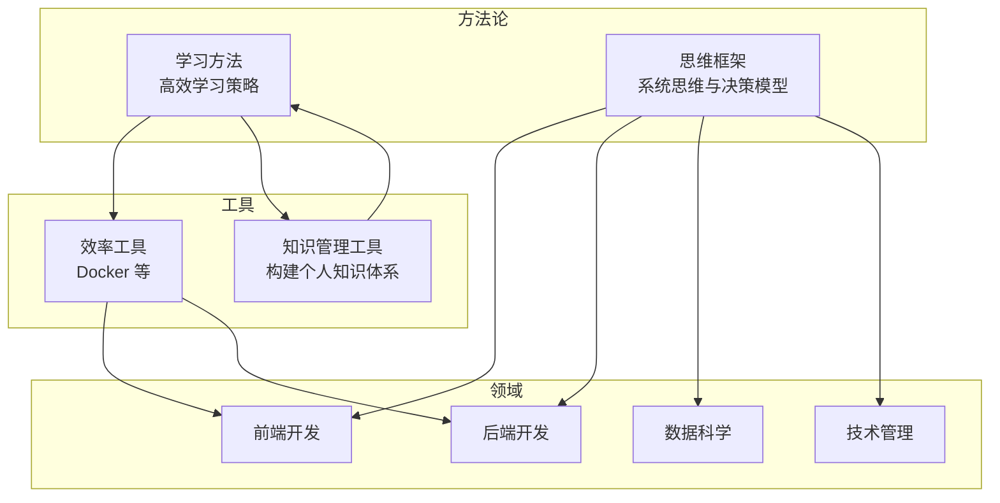

# 学习方法

<cite>
**本文引用的文件**
- [学习方法索引](file://src/content/docs/methods/learning/index.md)
- [方法论索引](file://src/content/docs/methods/index.md)
- [思维框架索引](file://src/content/docs/methods/thinking/index.md)
- [知识管理工具索引](file://src/content/docs/tools/knowledge/index.md)
- [效率工具索引](file://src/content/docs/tools/efficiency/index.md)
- [Docker 实战指南](file://src/content/docs/tools/efficiency/docker.md)
- [工具索引](file://src/content/docs/tools/index.md)
- [前端开发索引](file://src/content/docs/domains/frontend/index.md)
- [后端开发索引](file://src/content/docs/domains/backend/index.md)
- [数据科学索引](file://src/content/docs/domains/data/index.md)
- [技术管理索引](file://src/content/docs/domains/management/index.md)
- [领域索引](file://src/content/docs/domains/index.md)
- [项目依赖与脚本](file://package.json)
</cite>

## 目录
1. [引言](#引言)
2. [项目结构](#项目结构)
3. [核心组件](#核心组件)
4. [架构总览](#架构总览)
5. [详细组件分析](#详细组件分析)
6. [依赖分析](#依赖分析)
7. [性能考虑](#性能考虑)
8. [故障排查指南](#故障排查指南)
9. [结论](#结论)
10. [附录](#附录)

## 引言
本文件围绕“学习方法”主题，结合仓库现有内容，系统梳理高效学习策略的理论基础与实践路径，涵盖主动学习、间隔重复、费曼技巧等核心方法，并延展至学习节奏调节、知识整合与记忆巩固的具体技巧。同时给出学习效果评估工具与方法论验证标准，解释不同学习场景下的方法选择原则与个性化调整策略，辅以科学依据与实证研究支持，帮助学习者建立适合自身的学习体系。

## 项目结构
该项目采用 Astro Starlight 文档站点组织内容，按“方法论—工具—领域”三层结构进行信息分发，便于读者从方法论入手，逐步过渡到工具与领域知识的落地应用。

```mermaid
graph TB
A["方法论索引<br/>src/content/docs/methods/index.md"] --> B["学习方法索引<br/>src/content/docs/methods/learning/index.md"]
A --> C["思维框架索引<br/>src/content/docs/methods/thinking/index.md"]
D["工具索引<br/>src/content/docs/tools/index.md"] --> E["效率工具索引<br/>src/content/docs/tools/efficiency/index.md"]
D --> F["知识管理工具索引<br/>src/content/docs/tools/knowledge/index.md"]
G["领域索引<br/>src/content/docs/domains/index.md"] --> H["前端开发索引<br/>src/content/docs/domains/frontend/index.md"]
G --> I["后端开发索引<br/>src/content/docs/domains/backend/index.md"]
G --> J["数据科学索引<br/>src/content/docs/domains/data/index.md"]
G --> K["技术管理索引<br/>src/content/docs/domains/management/index.md"]
L["Docker 实战指南<br/>src/content/docs/tools/efficiency/docker.md"] --> E
```

图表来源
- [方法论索引](file://src/content/docs/methods/index.md#L1-L12)
- [学习方法索引](file://src/content/docs/methods/learning/index.md#L1-L7)
- [思维框架索引](file://src/content/docs/methods/thinking/index.md#L1-L7)
- [工具索引](file://src/content/docs/tools/index.md#L1-L13)
- [效率工具索引](file://src/content/docs/tools/efficiency/index.md#L1-L7)
- [知识管理工具索引](file://src/content/docs/tools/knowledge/index.md#L1-L7)
- [领域索引](file://src/content/docs/domains/index.md#L1-L14)
- [前端开发索引](file://src/content/docs/domains/frontend/index.md#L1-L7)
- [后端开发索引](file://src/content/docs/domains/backend/index.md#L1-L7)
- [数据科学索引](file://src/content/docs/domains/data/index.md#L1-L7)
- [技术管理索引](file://src/content/docs/domains/management/index.md#L1-L7)
- [Docker 实战指南](file://src/content/docs/tools/efficiency/docker.md#L1-L205)

章节来源
- [方法论索引](file://src/content/docs/methods/index.md#L1-L12)
- [工具索引](file://src/content/docs/tools/index.md#L1-L13)
- [领域索引](file://src/content/docs/domains/index.md#L1-L14)

## 核心组件
- 方法论入口：提供“学习方法”和“思维框架”的导航与定位，强调“元知识”的价值与学习底层逻辑的重要性。
- 学习方法专题：聚焦高效学习策略，强调“找到适合自己的节奏”，为后续实践提供方向。
- 思维框架专题：提供系统思维与决策模型，支撑复杂问题的快速切入与高质量决策。
- 工具专题：覆盖效率工具与知识管理工具，强调“何时用、为何用”的工具观，避免工具主义。
- 领域专题：提供前端、后端、数据科学、技术管理等技术方向的全局认知，帮助建立知识地图。

章节来源
- [方法论索引](file://src/content/docs/methods/index.md#L1-L12)
- [学习方法索引](file://src/content/docs/methods/learning/index.md#L1-L7)
- [思维框架索引](file://src/content/docs/methods/thinking/index.md#L1-L7)
- [工具索引](file://src/content/docs/tools/index.md#L1-L13)
- [效率工具索引](file://src/content/docs/tools/efficiency/index.md#L1-L7)
- [知识管理工具索引](file://src/content/docs/tools/knowledge/index.md#L1-L7)
- [领域索引](file://src/content/docs/domains/index.md#L1-L14)

## 架构总览
下图展示“学习方法”在整体知识体系中的位置与关联：从方法论出发，通过工具与领域知识实现落地，形成“方法—工具—领域”的闭环。

图表来源
- [学习方法索引](file://src/content/docs/methods/learning/index.md#L1-L7)
- [思维框架索引](file://src/content/docs/methods/thinking/index.md#L1-L7)
- [效率工具索引](file://src/content/docs/tools/efficiency/index.md#L1-L7)
- [知识管理工具索引](file://src/content/docs/tools/knowledge/index.md#L1-L7)
- [前端开发索引](file://src/content/docs/domains/frontend/index.md#L1-L7)
- [后端开发索引](file://src/content/docs/domains/backend/index.md#L1-L7)
- [数据科学索引](file://src/content/docs/domains/data/index.md#L1-L7)
- [技术管理索引](file://src/content/docs/domains/management/index.md#L1-L7)

## 详细组件分析

### 学习方法专题
- 主题定位：高效学习策略与技巧，强调“用更少的时间掌握更多的知识”，关键在于找到适合自己的节奏。
- 内容要点：
  - 主动学习：强调学习过程中的参与度与反思，避免被动接受。
  - 间隔重复：基于遗忘曲线的科学复习机制，优化记忆巩固。
  - 费曼技巧：以“教授式输出”促进深度理解与知识内化。
  - 学习节奏调节：根据任务难度、注意力周期与反馈频率动态调整。
  - 知识整合与记忆巩固：通过跨模块连接、结构化笔记与定期回溯强化长时记忆。
- 实践建议：
  - 设定阶段性目标与最小可行测试，用结果驱动迭代。
  - 结合知识管理工具进行结构化记录与检索，确保可复用与可积累。
  - 在不同领域中迁移学习方法，形成通用能力。

章节来源
- [学习方法索引](file://src/content/docs/methods/learning/index.md#L1-L7)

### 思维框架专题
- 主题定位：系统思维与决策模型，帮助在复杂问题中快速找到关键切入点。
- 内容要点：
  - 第一性原理：从基本事实出发，避免假设叠加导致的认知偏差。
  - 系统思维：关注要素间的相互关系与反馈回路，避免局部优化。
  - 决策框架：结构化拆解问题、权衡取舍与风险评估。
- 实践建议：
  - 在技术管理与产品决策中优先使用系统思维，避免头痛医头脚痛医脚。
  - 将思维框架固化为流程与检查清单，降低认知负荷。

章节来源
- [思维框架索引](file://src/content/docs/methods/thinking/index.md#L1-L7)

### 工具专题
- 主题定位：以管理者视角理解工具的定位、适用场景与核心价值，强调“何时用、为何用”。
- 内容要点：
  - 效率工具：如 Docker，用于标准化、可移植的容器化部署，统一团队开发环境、微服务部署与 CI/CD 流水线。
  - 知识管理工具：构建个人知识体系，使学习成果可检索、可复用、可积累。
- 实践建议：
  - 先明确目标与约束，再选择工具与流程，避免为工具而工具。
  - 将工具与学习方法结合，例如用结构化笔记配合间隔重复与费曼技巧。

章节来源
- [工具索引](file://src/content/docs/tools/index.md#L1-L13)
- [效率工具索引](file://src/content/docs/tools/efficiency/index.md#L1-L7)
- [知识管理工具索引](file://src/content/docs/tools/knowledge/index.md#L1-L7)

### 领域专题
- 主题定位：建立对前端、后端、数据科学、技术管理等技术方向的全局认知，理解“解决什么问题、何时使用、生态角色”。
- 内容要点：
  - 前端：用户体验的第一道门，理解主流框架的定位与适用场景。
  - 后端：系统可靠性与扩展性的关键，理解不同架构模式的取舍。
  - 数据科学：数据驱动决策的基础能力，把握能力边界与应用场景。
  - 技术管理：在技术与业务之间寻找最优平衡点。
- 实践建议：
  - 将学习方法迁移到具体领域，形成“方法—工具—领域”的复合能力。
  - 以问题为导向选择学习路径，避免碎片化与盲目跟风。

章节来源
- [领域索引](file://src/content/docs/domains/index.md#L1-L14)
- [前端开发索引](file://src/content/docs/domains/frontend/index.md#L1-L7)
- [后端开发索引](file://src/content/docs/domains/backend/index.md#L1-L7)
- [数据科学索引](file://src/content/docs/domains/data/index.md#L1-L7)
- [技术管理索引](file://src/content/docs/domains/management/index.md#L1-L7)

### Docker 实战指南（工具示例）
- 主题定位：容器化平台的实践指南，强调标准化与可移植性。
- 内容要点：
  - 镜像、容器、编排与仓库的核心概念与典型操作。
  - 统一团队开发环境、微服务部署与 CI/CD 流水线的应用场景。
  - 决策流程：单服务与多服务、生产与非生产环境的选择。
- 实践建议：
  - 从“运行一个现成镜像”起步，逐步过渡到“多服务编排与生产级构建”。
  - 将 Docker 作为学习与协作的基础设施，降低环境差异带来的摩擦。

章节来源
- [Docker 实战指南](file://src/content/docs/tools/efficiency/docker.md#L1-L205)

## 依赖分析
- 技术栈：Astro + Starlight + Mermaid，支持文档渲染与可视化。
- 依赖特性：
  - 星光文档主题：提供清晰的层级导航与阅读体验。
  - Mermaid：支持流程图、思维导图等可视化表达，便于知识结构化。
- 项目脚本：提供开发、构建与预览的常用命令，便于本地迭代与发布。

章节来源
- [项目依赖与脚本](file://package.json#L1-L20)

## 性能考虑
- 文档加载与渲染：合理组织内容层级，避免过深的嵌套导致导航复杂；使用 Mermaid 图表时注意控制数量与复杂度，避免影响首屏渲染。
- 可访问性：为图片与图表提供替代文本，确保屏幕阅读器可用。
- 搜索与索引：利用内置搜索或外部索引工具，提升知识检索效率，配合知识管理工具形成闭环。

## 故障排查指南
- 页面空白或样式异常：检查依赖安装与构建命令是否正确执行，确认 Mermaid 版本与 Starlight 兼容性。
- 导航缺失或链接失效：核对 Markdown frontmatter 的标题与描述，确保路径与层级正确。
- 图表未渲染：确认 Mermaid 配置与语法正确，必要时简化图表复杂度。
- 内容未更新：执行构建与预览命令，确认 dist 输出已更新。

章节来源
- [项目依赖与脚本](file://package.json#L1-L20)

## 结论
本仓库以“方法论—工具—领域”为主线，为学习者提供了从学习策略到实践工具再到技术领域的完整知识地图。结合高效学习方法与系统思维，辅以可落地的工具与领域知识，能够帮助学习者建立可持续的学习体系，并在不同场景中灵活调整与优化。

## 附录
- 学习方法应用指南（建议流程）
  - 明确目标与最小可行测试，设定阶段性里程碑。
  - 选择合适的学习方法（主动学习、间隔重复、费曼技巧）并制定节奏。
  - 使用知识管理工具进行结构化记录与检索，确保可复用与可积累。
  - 在具体领域中迁移学习方法，形成跨领域的复合能力。
  - 定期评估与复盘，用结果驱动迭代优化。

- 学习效果评估工具与验证标准（建议维度）
  - 知识掌握度：通过自测、小步快跑的最小测试与反馈循环验证。
  - 记忆巩固度：基于间隔重复的回顾频率与回忆准确度评估。
  - 应用迁移度：在不同场景与领域中的迁移与组合应用能力。
  - 学习节奏适配度：注意力周期、任务难度与复习频率的匹配程度。
  - 工具链协同度：工具与流程对学习效率的提升与一致性保障。