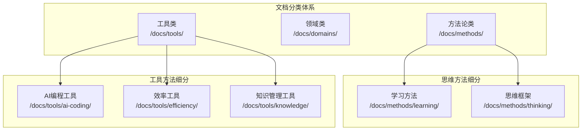
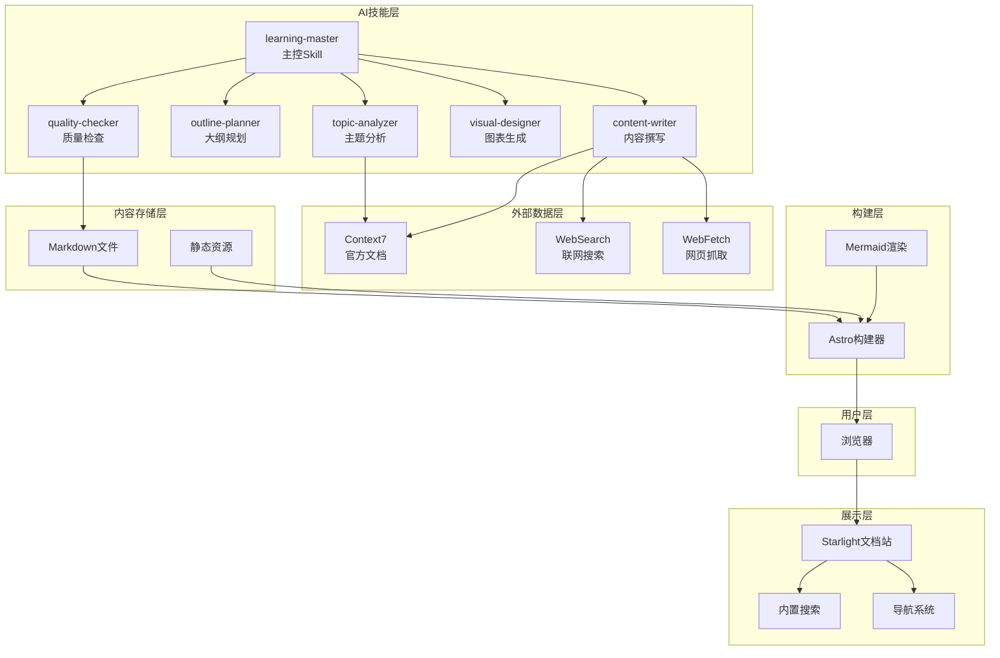
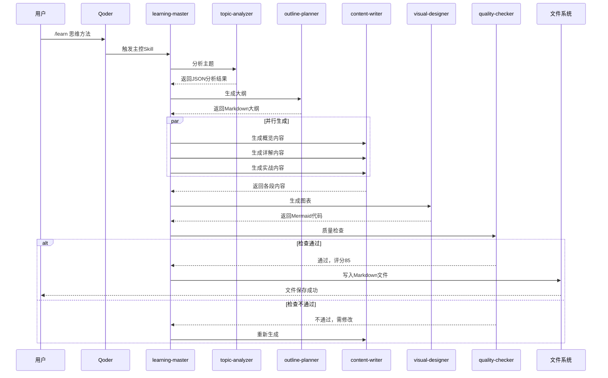
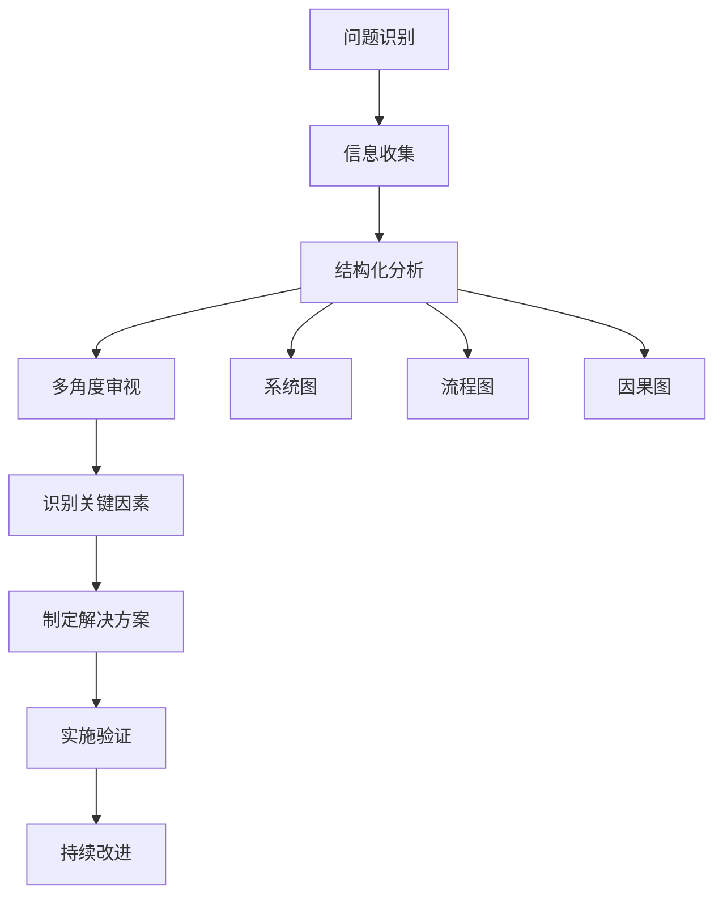
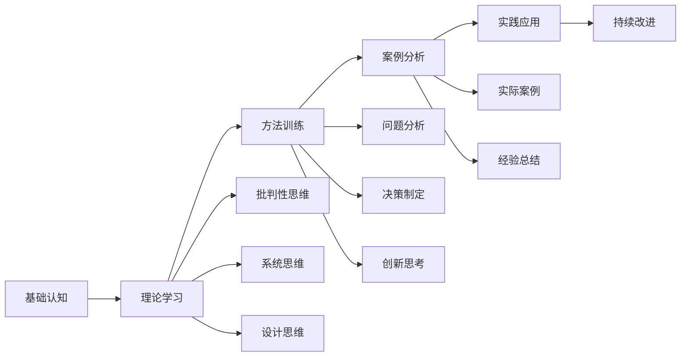

# 思维方法

<cite>
**本文档引用的文件**
- [项目简介](file://docs/01-PROJECT-BRIEF.md)
- [技术架构设计](file://docs/03-ARCHITECTURE.md)
- [AI技能规格说明](file://docs/04-AI-SKILL-SPEC.md)
- [思维框架文档](file://src/content/docs/methods/thinking/index.md)
- [学习方法文档](file://src/content/docs/methods/learning/index.md)
- [Docker工具文档](file://src/content/docs/tools/efficiency/docker.md)
- [知识管理工具文档](file://src/content/docs/tools/knowledge/index.md)
- [AI编程工具文档](file://src/content/docs/tools/ai-coding/index.md)
- [主页文档](file://src/content/docs/index.mdx)
- [包配置](file://package.json)
</cite>

## 目录
1. [引言](#引言)
2. [项目结构](#项目结构)
3. [核心组件](#核心组件)
4. [架构概览](#架构概览)
5. [详细组件分析](#详细组件分析)
6. [依赖分析](#依赖分析)
7. [性能考虑](#性能考虑)
8. [故障排除指南](#故障排除指南)
9. [结论](#结论)
10. [附录](#附录)

## 引言

StudyBuddy是一个AI驱动的个人知识成长伙伴，致力于将碎片化学习转化为结构化知识体系。该项目的核心理念是"AI时代，会管比会做更有直接价值"，强调管理者视角的学习方法，关注"为什么"和"何时用"，而非深入的技术实现细节。

思维方法作为学习方法论的重要组成部分，是管理者的核心武器，帮助在复杂问题中快速找到关键切入点。通过批判性思维、系统思维、设计思维等核心思维框架，学习者能够建立高效的思维模型，提升决策质量和认知效率。

## 项目结构

StudyBuddy采用模块化的文档组织结构，主要分为三个核心分类：



**图表来源**
- [技术架构设计](file://docs/03-ARCHITECTURE.md#L223-L239)

**章节来源**
- [技术架构设计](file://docs/03-ARCHITECTURE.md#L164-L240)
- [主页文档](file://src/content/docs/index.mdx#L19-L37)

## 核心组件

### 思维框架组件

思维框架作为管理者的核心武器，具有以下特点：

- **复杂问题解决**：帮助在复杂问题中快速找到关键切入点
- **决策支持**：提供结构化的决策框架和分析工具
- **认知效率**：通过思维模型提升认知处理效率
- **实用导向**：注重实际应用场景和可操作性

### 学习方法组件

学习方法组件强调高效学习策略和技巧：

- **学习效率**：用更少的时间掌握更多的知识
- **个性化节奏**：找到适合自己的学习节奏
- **方法论指导**：提供可复制的学习方法论

### 工具集成组件

项目集成了多种工具来支持思维训练：

- **AI编程工具**：让AI成为编程搭档
- **效率工具**：Docker等容器化工具
- **知识管理工具**：构建个人知识体系

**章节来源**
- [思维框架文档](file://src/content/docs/methods/thinking/index.md#L1-L7)
- [学习方法文档](file://src/content/docs/methods/learning/index.md#L1-L7)
- [AI编程工具文档](file://src/content/docs/tools/ai-coding/index.md#L1-L7)

## 架构概览

StudyBuddy采用分层架构设计，结合AI技能系统实现智能文档生成：



**图表来源**
- [技术架构设计](file://docs/03-ARCHITECTURE.md#L12-L68)

### AI技能协作模型

项目实现了六个子技能的协作模型，通过并行处理提升文档生成效率：



**图表来源**
- [技术架构设计](file://docs/03-ARCHITECTURE.md#L86-L126)

**章节来源**
- [AI技能规格说明](file://docs/04-AI-SKILL-SPEC.md#L23-L73)
- [技术架构设计](file://docs/03-ARCHITECTURE.md#L82-L126)

## 详细组件分析

### 思维框架核心理论

#### 批判性思维

批判性思维是思维框架的基础，强调理性分析和客观评估：

- **质疑精神**：对假设和结论保持合理怀疑
- **逻辑推理**：运用逻辑规则进行有效推理
- **证据评估**：识别和评估证据的质量
- **偏见识别**：认识和纠正认知偏见

#### 系统思维

系统思维关注整体性和相互关系：

- **整体视角**：从系统角度理解问题
- **因果关系**：识别系统中的因果链条
- **反馈机制**：理解正负反馈的作用
- **动态平衡**：把握系统的稳定和变化

#### 设计思维

设计思维强调以人为本的创新方法：

- **同理心**：深入理解用户需求
- **原型测试**：快速迭代和验证想法
- **跨学科整合**：融合不同领域的知识
- **创造性解决**：寻找突破性的解决方案

### 思维方法的应用技巧

#### 问题分析方法



**图表来源**
- [AI技能规格说明](file://docs/04-AI-SKILL-SPEC.md#L588-L595)

#### 决策制定工具

- **决策矩阵**：量化评估不同选项
- **成本效益分析**：权衡投入产出
- **风险评估**：识别和管理不确定性
- **情景规划**：考虑多种可能结果

#### 创新思考方法

- **头脑风暴**：产生大量创意想法
- **逆向思维**：从相反角度思考问题
- **跨界借鉴**：从其他领域获得灵感
- **组合创新**：将现有元素重新组合

### 思维训练练习

#### 基础训练

**初级练习（5分钟）**
- 单一思维技巧应用
- 目标：验证基础理解
- 格式：任务描述 + 参考答案

**中级练习（15分钟）**
- 2-3个思维技巧组合
- 目标：解决实际问题
- 格式：场景描述 + 思路提示 + 完整分析

**高级练习（30分钟）**
- 完整思维方法应用
- 目标：掌握综合技能
- 格式：复杂案例 + 多维度分析 + 实施方案

#### 案例分析

通过真实案例分析，学习者可以：

- **识别问题本质**：透过现象看本质
- **应用合适方法**：选择正确的思维工具
- **验证解决方案**：评估方案的有效性
- **总结经验教训**：形成可复用的方法论

### 适用场景和组合策略

#### 场景识别

| 场景类型 | 适用思维方法 | 组合策略 |
|---------|-------------|---------|
| 日常决策 | 批判性思维 + 决策矩阵 | 快速评估，量化决策 |
| 项目规划 | 系统思维 + 设计思维 | 全面考虑，创新设计 |
| 团队管理 | 系统思维 + 批判性思维 | 协调各方，理性决策 |
| 产品创新 | 设计思维 + 系统思维 | 用户导向，系统优化 |

#### 组合使用策略

1. **先系统后设计**：先理解整体再寻求创新
2. **先批判后应用**：先质疑再实践
3. **循环迭代**：在实践中不断优化思维方法

## 依赖分析

### 技术依赖关系

```mermaid
graph TB
subgraph "前端技术栈"
ASTRO[Astro 5.6.1]
STARLIGHT[@astrojs/starlight]
MERMAID[mermaid 11.12.3]
TWCSS[tailwindcss 4.2.1]
end
subgraph "AI技能系统"
MASTER[learning-master]
ANALYZER[topic-analyzer]
PLANNER[outline-planner]
WRITER[content-writer]
DESIGNER[visual-designer]
CHECKER[quality-checker]
end
subgraph "外部集成"
CONTEXT7[Context7]
WEBSEARCH[WebSearch]
WEBFETCH[WebFetch]
end
ASTRO --> STARLIGHT
ASTRO --> MERMAID
ASTRO --> TWCSS
MASTER --> ANALYZER
MASTER --> PLANNER
MASTER --> WRITER
MASTER --> DESIGNER
MASTER --> CHECKER
WRITER --> CONTEXT7
WRITER --> WEBSEARCH
WRITER --> WEBFETCH
```

**图表来源**
- [技术架构设计](file://docs/03-ARCHITECTURE.md#L71-L79)
- [包配置](file://package.json#L12-L21)

### 内容生成依赖

思维方法文档的生成依赖于AI技能系统的协作：

- **主题分析**：确定思维方法的核心概念和应用场景
- **大纲规划**：设计三阶段学习框架（概览→详解→实战）
- **内容撰写**：生成具体的思维训练方法和案例
- **图表生成**：创建思维导图和流程图等可视化内容
- **质量检查**：确保内容的准确性和实用性

**章节来源**
- [AI技能规格说明](file://docs/04-AI-SKILL-SPEC.md#L75-L85)
- [技术架构设计](file://docs/03-ARCHITECTURE.md#L242-L275)

## 性能考虑

### 构建性能优化

StudyBuddy采用Astro框架实现零JS默认，通过以下策略优化性能：

- **增量构建**：Astro默认支持，减少50%构建时间
- **图片优化**：使用@astrojs/image，减少70%图片体积
- **代码分割**：自动实现，减少首屏JS加载量
- **静态生成**：Astro默认，实现零运行时JS

### 运行时性能优化

- **CDN缓存**：Vercel Edge网络，实现<50ms TTFB
- **懒加载图表**：使用Intersection Observer提升首屏速度
- **Mermaid渲染优化**：按需渲染图表，避免阻塞页面

### 内容加载优化

- **思维导图延迟加载**：仅在可见时渲染
- **图表组件化**：可复用的Mermaid图表组件
- **速查表优化**：紧凑的表格布局，快速信息检索

## 故障排除指南

### 常见问题及解决方案

#### 文档生成失败

**问题症状**：AI技能系统无法生成思维方法文档

**可能原因**：
- 外部数据源连接异常
- 主控Skill配置错误
- 内容质量检查不通过

**解决步骤**：
1. 检查Context7、WebSearch、WebFetch连接状态
2. 验证learning-master配置
3. 查看质量检查报告，针对性修改内容

#### 图表渲染问题

**问题症状**：Mermaid图表无法正确显示

**可能原因**：
- Mermaid语法错误
- 图表类型不支持
- 渲染环境配置问题

**解决步骤**：
1. 验证Mermaid语法正确性
2. 检查支持的图表类型列表
3. 确认Astro配置中的remark-mermaid插件

#### 页面加载缓慢

**问题症状**：文档页面加载时间过长

**可能原因**：
- 图片资源过大
- 图表数量过多
- 缓存配置不当

**解决步骤**：
1. 检查图片优化设置
2. 优化图表渲染策略
3. 配置CDN缓存策略

**章节来源**
- [技术架构设计](file://docs/03-ARCHITECTURE.md#L366-L383)

## 结论

StudyBuddy项目通过AI技能系统和结构化文档组织，为学习者提供了完整的思维方法学习体系。项目的核心价值在于：

1. **理念先进**：以管理者视角学习，关注"为什么"和"何时用"
2. **方法实用**：提供可操作的思维训练方法和案例
3. **技术可靠**：基于AI技能系统实现智能文档生成
4. **扩展性强**：模块化设计支持持续的功能扩展

通过批判性思维、系统思维、设计思维等核心框架的学习，学习者能够建立高效的思维模型，提升决策质量和认知效率。项目提供的思维训练练习和案例分析，为学习者提供了从理论到实践的完整学习路径。

## 附录

### 思维方法学习路径



### 学习资源推荐

- **在线课程**：思维方法相关的专业课程
- **书籍阅读**：经典思维方法理论著作
- **实践项目**：将思维方法应用于实际工作
- **思维社区**：与其他学习者交流经验

### 技术支持

- **开发环境**：Node.js 16+，npm 8+
- **构建工具**：Astro 5.6.1，Starlight
- **图表工具**：Mermaid 11.12.3
- **部署平台**：Vercel，GitHub Pages