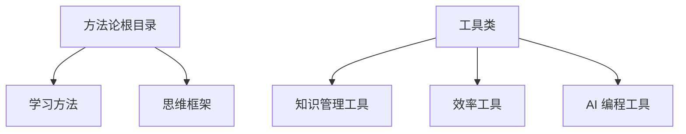
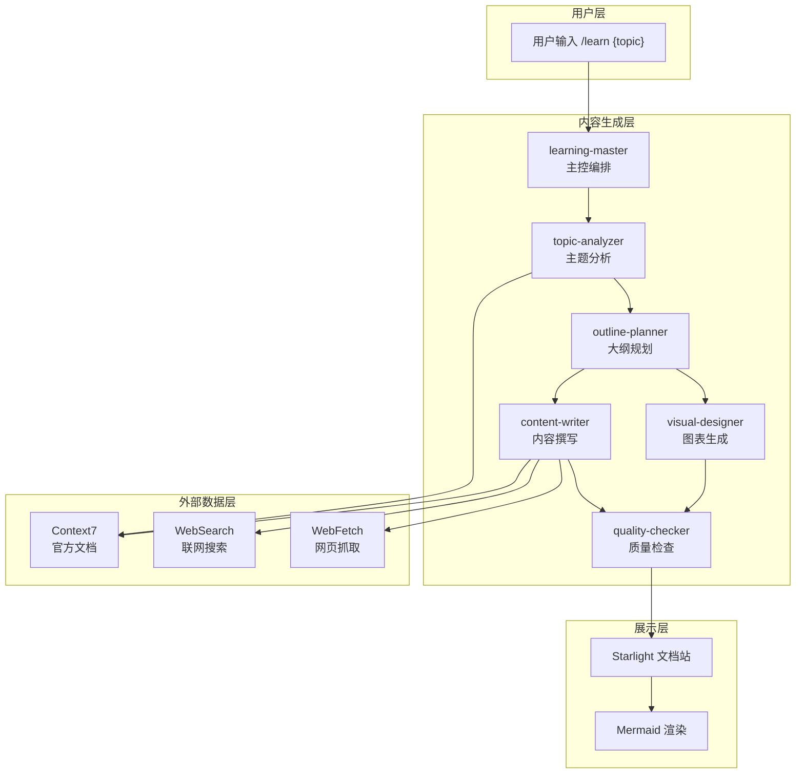
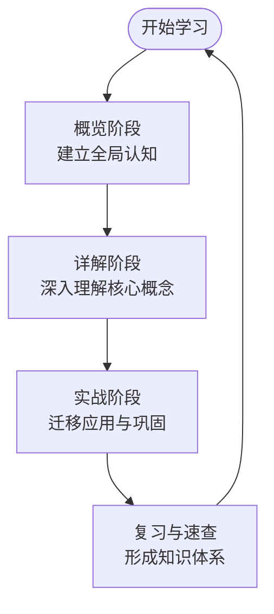
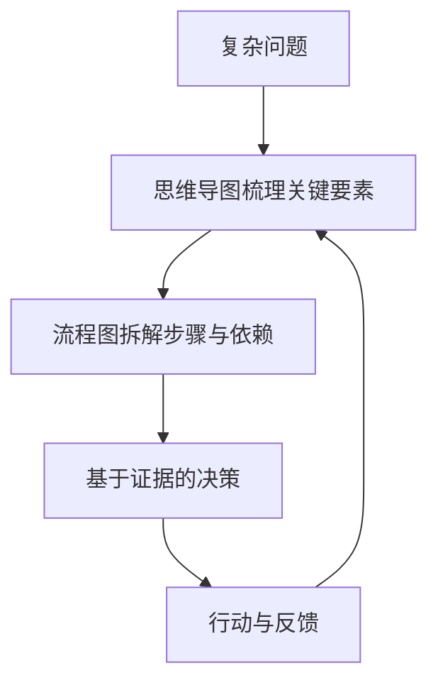
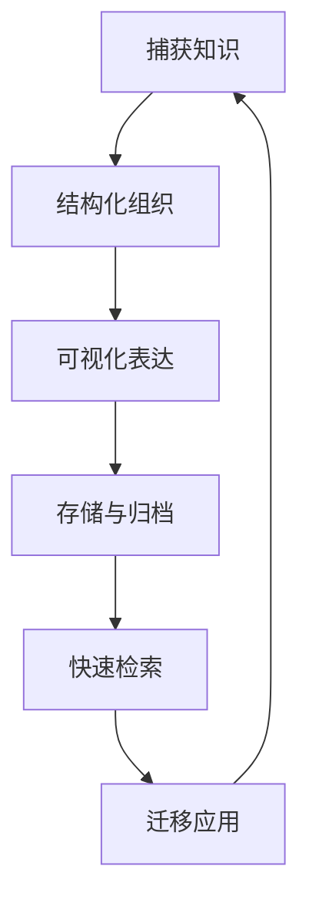
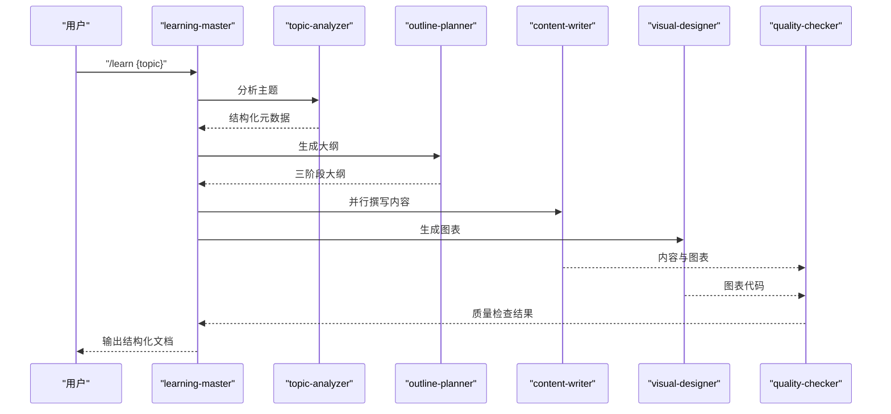
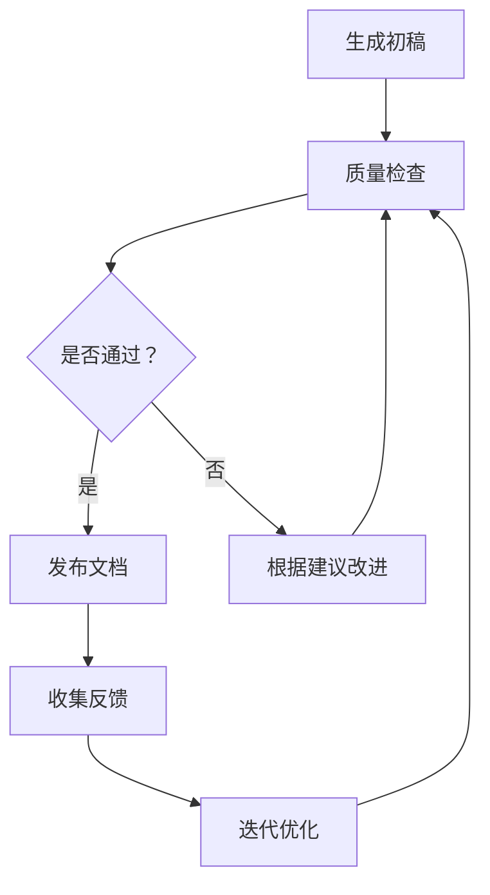
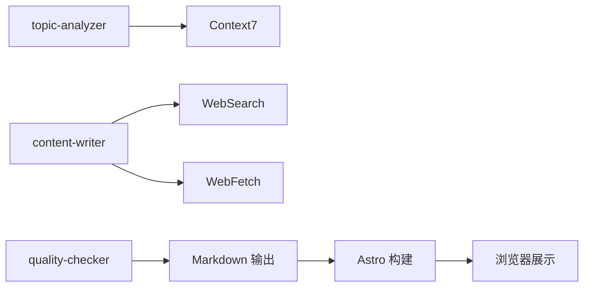

# 方法论类文档

<cite>
**本文档引用的文件**
- [方法论索引](file://src/content/docs/methods/index.md)
- [学习方法索引](file://src/content/docs/methods/learning/index.md)
- [思维框架索引](file://src/content/docs/methods/thinking/index.md)
- [知识管理工具索引](file://src/content/docs/tools/knowledge/index.md)
- [效率工具索引](file://src/content/docs/tools/efficiency/index.md)
- [AI 编程工具索引](file://src/content/docs/tools/ai-coding/index.md)
- [Docker 详述](file://src/content/docs/tools/efficiency/docker.md)
- [项目简介](file://docs/01-PROJECT-BRIEF.md)
- [AI 技能规格说明](file://docs/04-AI-SKILL-SPEC.md)
- [技术架构设计](file://docs/03-ARCHITECTURE.md)
</cite>

## 目录
1. [引言](#引言)
2. [项目结构](#项目结构)
3. [核心组件](#核心组件)
4. [架构总览](#架构总览)
5. [详细组件分析](#详细组件分析)
6. [依赖关系分析](#依赖关系分析)
7. [性能考量](#性能考量)
8. [故障排查指南](#故障排查指南)
9. [结论](#结论)
10. [附录](#附录)

## 引言
本方法论类文档面向“AI 驱动的个人知识成长伙伴”StudyBuddy 的知识体系与学习路径，聚焦两类核心方法论分支：
- 学习方法：以“学会如何学习”为核心，围绕高效学习策略、知识管理与问题解决进行系统化梳理。
- 思维框架：以“系统思维与决策模型”为核心，帮助在复杂问题中快速定位关键切入点。

同时，结合项目“管理者视角”的设计理念，强调“从执行转向管理”，关注“为何用、何时用、如何选”，并通过 AI 技能体系与可视化工具支撑知识沉淀与复用。

## 项目结构
方法论相关内容位于文档站点的内容目录中，采用“分类 + 子分类”的层级组织：
- 方法论根目录提供总体介绍与分类入口
- 学习方法与思维框架分别作为两个主要子分类，承载具体方法与实践
- 工具类文档（知识管理、效率工具、AI 编程）作为方法论的配套支撑

**图表来源**
- [方法论索引](file://src/content/docs/methods/index.md#L1-L12)
- [学习方法索引](file://src/content/docs/methods/learning/index.md#L1-L7)
- [思维框架索引](file://src/content/docs/methods/thinking/index.md#L1-L7)
- [知识管理工具索引](file://src/content/docs/tools/knowledge/index.md#L1-L7)
- [效率工具索引](file://src/content/docs/tools/efficiency/index.md#L1-L7)
- [AI 编程工具索引](file://src/content/docs/tools/ai-coding/index.md#L1-L7)

**章节来源**
- [方法论索引](file://src/content/docs/methods/index.md#L1-L12)
- [项目简介](file://docs/01-PROJECT-BRIEF.md#L1-L97)

## 核心组件
- 方法论分类体系
  - 学习方法：强调“用更少时间掌握更多知识”，通过结构化学习框架与工具提升学习效率。
  - 思维框架：强调“在复杂问题中快速找到关键切入点”，通过系统思维模型提升决策效率。
- 工具支撑体系
  - 知识管理工具：强调“可检索、可复用、可积累”，支撑知识沉淀与复用。
  - 效率工具：强调“减少重复劳动，专注高价值决策”，通过自动化与标准化提升效率。
  - AI 编程工具：强调“理解工具的能力边界与最佳应用场景”，帮助管理者更好地使用 AI。

**章节来源**
- [学习方法索引](file://src/content/docs/methods/learning/index.md#L1-L7)
- [思维框架索引](file://src/content/docs/methods/thinking/index.md#L1-L7)
- [知识管理工具索引](file://src/content/docs/tools/knowledge/index.md#L1-L7)
- [效率工具索引](file://src/content/docs/tools/efficiency/index.md#L1-L7)
- [AI 编程工具索引](file://src/content/docs/tools/ai-coding/index.md#L1-L7)

## 架构总览
方法论的生成与呈现依托于 StudyBuddy 的 AI 技能体系与文档站点架构：
- 学习主题经由主控 Skill 协调分析、规划、撰写、图表生成与质量检查，最终输出结构化 Markdown 文档
- 文档站点采用 Astro + Starlight，支持 Mermaid 可视化与本地搜索，便于知识检索与复用

**图表来源**
- [AI 技能规格说明](file://docs/04-AI-SKILL-SPEC.md#L19-L73)
- [技术架构设计](file://docs/03-ARCHITECTURE.md#L12-L69)

**章节来源**
- [AI 技能规格说明](file://docs/04-AI-SKILL-SPEC.md#L1-L718)
- [技术架构设计](file://docs/03-ARCHITECTURE.md#L1-L69)

## 详细组件分析

### 学习方法：三阶段学习框架
- 概览（鸟瞰）：聚焦“一句话定义、核心问题、适用场景、前置知识、思维导图”，帮助快速建立全局认知
- 分章节详解（解剖）：对每个核心概念采用“是什么-为什么-怎么用”的结构，辅以最小示例与速查表
- 联动应用（实战）：按难度梯度设计“单一特性应用 → 特性组合 → 完整项目实战”，强化迁移与应用能力

**图表来源**
- [AI 技能规格说明](file://docs/04-AI-SKILL-SPEC.md#L281-L386)

**章节来源**
- [AI 技能规格说明](file://docs/04-AI-SKILL-SPEC.md#L281-L386)

### 思维框架：系统思维与决策模型
- 系统思维：强调“从线性转向网状”，关注知识点之间的关联，而非孤立知识点
- 决策模型：强调“从深度转向广度”，先把握整体与边界，再决定何时深入细节
- 实践建议：在面对复杂问题时，先用思维导图梳理关键要素与边界，再用流程图拆解步骤与依赖

**图表来源**
- [项目简介](file://docs/01-PROJECT-BRIEF.md#L28-L34)
- [AI 技能规格说明](file://docs/04-AI-SKILL-SPEC.md#L281-L386)

**章节来源**
- [项目简介](file://docs/01-PROJECT-BRIEF.md#L28-L34)

### 知识管理方法：可检索、可复用、可积累
- 可检索：通过统一的知识库与自动分类，确保知识在需要时能被快速定位
- 可复用：通过速查表、思维导图与最小示例，降低再次学习成本
- 可积累：通过结构化文档与版本控制，持续沉淀与迭代知识体系

**图表来源**
- [知识管理工具索引](file://src/content/docs/tools/knowledge/index.md#L1-L7)
- [项目简介](file://docs/01-PROJECT-BRIEF.md#L19-L27)

**章节来源**
- [知识管理工具索引](file://src/content/docs/tools/knowledge/index.md#L1-L7)
- [项目简介](file://docs/01-PROJECT-BRIEF.md#L19-L27)

### 高效学习策略与问题解决技巧
- 以“管理者视角”为导向，优先判断“何时用、为何用”，再考虑“怎么做”
- 通过三阶段框架与可视化工具，将复杂主题拆解为可执行的学习路径
- 在实战环节中，以“单一特性 → 组合应用 → 完整项目”的梯度设计，强化迁移能力

**图表来源**
- [AI 技能规格说明](file://docs/04-AI-SKILL-SPEC.md#L19-L73)

**章节来源**
- [AI 技能规格说明](file://docs/04-AI-SKILL-SPEC.md#L149-L202)

### 方法论验证与效果评估工具
- 质量检查：通过结构、内容、格式三维度检查，输出评分与改进建议，确保输出质量稳定
- 速查表与思维导图：作为知识复用与检索的载体，支撑学习效果的可衡量与可验证
- 复盘机制：在实战阶段后设置反馈与改进环节，持续优化学习路径

**图表来源**
- [AI 技能规格说明](file://docs/04-AI-SKILL-SPEC.md#L671-L715)

**章节来源**
- [AI 技能规格说明](file://docs/04-AI-SKILL-SPEC.md#L671-L715)

### 适用场景与个性化调整
- 适用场景
  - 快速建立知识体系：通过脑图/思维链快速了解全局
  - 实用导向：关注应用场景，不深入实现细节
  - 视觉记忆点：美观的页面设计，助力记忆
  - 速查能力：需要时能快速找到关键信息
  - 知识关联：了解知识点之间的联系
- 个性化调整
  - 根据学习目标与时间安排，调整三阶段时长分配
  - 针对不同主题，灵活选择前置知识与实战难度
  - 结合工具链（如 Docker）进行实操训练，强化迁移能力

**章节来源**
- [项目简介](file://docs/01-PROJECT-BRIEF.md#L37-L58)

### 方法论演进与创新实践案例
- 演进方向
  - 从“记忆”到“检索”：强调框架理解与精准检索
  - 从“深度”到“广度”：先把握整体与边界，再决定深入细节
  - 从“线性”到“网状”：关注知识点之间的关联
  - 从“执行”到“管理”：以管理者视角学习，关注决策而非实现细节
- 创新实践
  - 以 AI 技能体系驱动内容生成，结合外部数据源保证时效性与准确性
  - 通过可视化工具（Mermaid）增强知识表达与理解
  - 以“最小可行学习单元”推动知识的可迁移与可复用

**章节来源**
- [项目简介](file://docs/01-PROJECT-BRIEF.md#L28-L34)
- [技术架构设计](file://docs/03-ARCHITECTURE.md#L71-L81)

### 方法论选择指南与实操训练方案
- 方法论选择指南
  - 若目标是“快速理解与检索”：优先选择“学习方法”中的三阶段框架与“思维框架”中的系统思维
  - 若目标是“知识沉淀与复用”：优先选择“知识管理工具”中的统一知识库与自动分类
  - 若目标是“提升效率与自动化”：优先选择“效率工具”中的容器化与编排实践
- 实操训练方案
  - 初级：完成一次“单一特性应用”，掌握最小可用流程
  - 中级：完成“2-3 特性组合”，理解依赖与边界
  - 高级：完成“完整项目实战”，整合最佳实践并形成速查表

**章节来源**
- [Docker 详述](file://src/content/docs/tools/efficiency/docker.md#L143-L187)

## 依赖关系分析
- 内容生成依赖外部数据源（Context7、WebSearch、WebFetch），确保内容的权威性与时效性
- 质量检查贯穿生成流程，作为“门禁”确保输出质量
- 文档站点负责最终呈现与交互体验，支持搜索与可视化

**图表来源**
- [AI 技能规格说明](file://docs/04-AI-SKILL-SPEC.md#L86-L126)
- [技术架构设计](file://docs/03-ARCHITECTURE.md#L24-L69)

**章节来源**
- [AI 技能规格说明](file://docs/04-AI-SKILL-SPEC.md#L86-L126)
- [技术架构设计](file://docs/03-ARCHITECTURE.md#L24-L69)

## 性能考量
- 构建优化：增量构建、图片优化、代码分割，显著缩短构建时间与首屏加载时间
- 运行时优化：静态生成、CDN 缓存、懒加载图表，确保低延迟与高可用
- 可扩展性：新增分类、Skill 与自定义组件的成本低，便于持续演进

**章节来源**
- [技术架构设计](file://docs/03-ARCHITECTURE.md#L366-L407)

## 故障排查指南
- 内容质量不达标
  - 检查质量检查评分与改进建议，针对结构、内容、格式问题逐一修正
- 图表无法渲染
  - 确认 Mermaid 语法正确，并在大纲中标注图表位置
- 外部数据源异常
  - 检查 Context7、WebSearch、WebFetch 的可用性与权限配置

**章节来源**
- [AI 技能规格说明](file://docs/04-AI-SKILL-SPEC.md#L671-L715)

## 结论
StudyBuddy 的方法论体系以“管理者视角”为核心，通过“学习方法 + 思维框架 + 工具支撑”的三位一体，帮助学习者在 AI 时代实现“会管比会做更有价值”。借助三阶段学习框架与可视化工具，学习者能够快速建立知识体系、提升检索与应用能力，并通过质量检查与复盘机制持续优化学习效果。

## 附录
- 相关文件路径与职责
  - 方法论根目录：提供总体介绍与分类入口
  - 学习方法与思维框架：承载具体方法与实践
  - 工具类文档：知识管理、效率工具、AI 编程
  - AI 技能规格说明：定义生成流程与质量标准
  - 技术架构设计：定义系统分层与性能优化策略

**章节来源**
- [方法论索引](file://src/content/docs/methods/index.md#L1-L12)
- [AI 技能规格说明](file://docs/04-AI-SKILL-SPEC.md#L1-L718)
- [技术架构设计](file://docs/03-ARCHITECTURE.md#L1-L69)