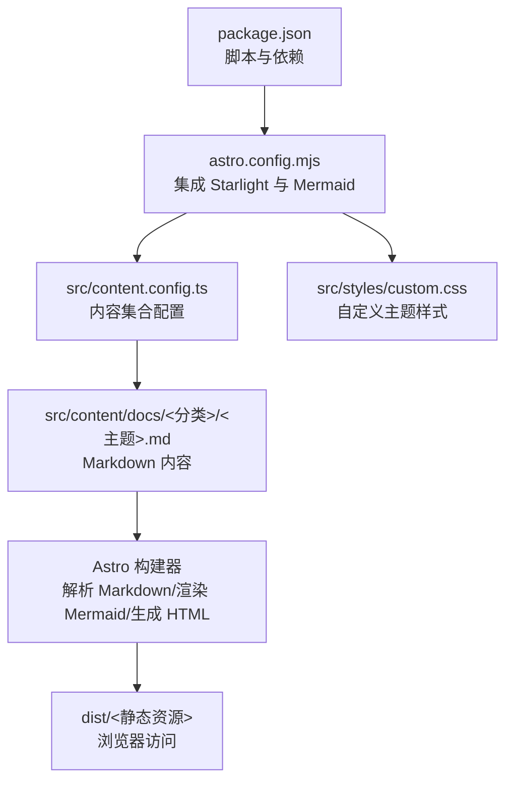
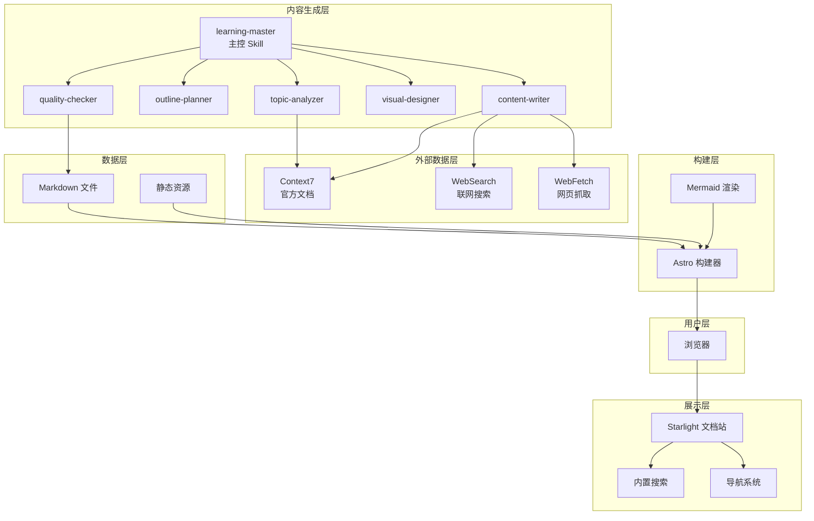
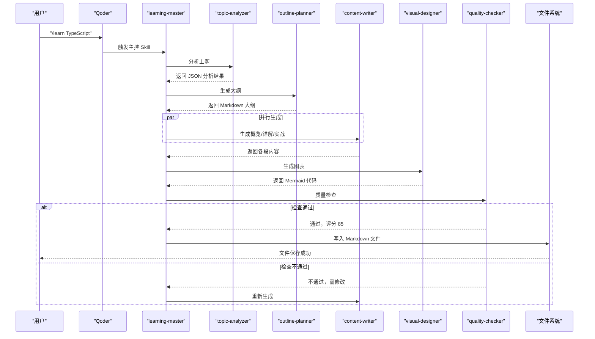
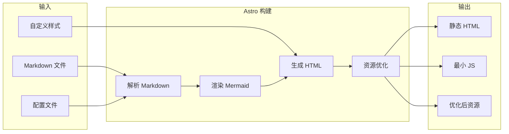
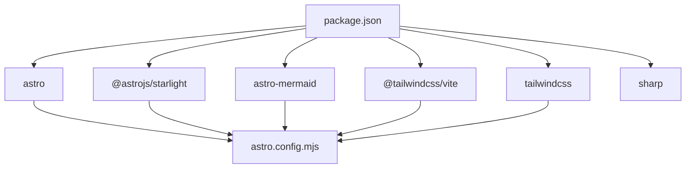

# 前端开发

<cite>
**本文引用的文件**
- [package.json](file://package.json)
- [astro.config.mjs](file://astro.config.mjs)
- [src/content.config.ts](file://src/content.config.ts)
- [docs/01-项目简介.md](file://docs/01-PROJECT-BRIEF.md)
- [docs/03-架构设计.md](file://docs/03-ARCHITECTURE.md)
- [src/styles/custom.css](file://src/styles/custom.css)
- [src/content/docs/domains/frontend/index.md](file://src/content/docs/domains/frontend/index.md)
- [src/content/docs/tools/ai-coding/index.md](file://src/content/docs/tools/ai-coding/index.md)
- [src/content/docs/tools/efficiency/docker.md](file://src/content/docs/tools/efficiency/docker.md)
- [src/content/docs/methods/learning/index.md](file://src/content/docs/methods/learning/index.md)
</cite>

## 目录
1. [引言](#引言)
2. [项目结构](#项目结构)
3. [核心组件](#核心组件)
4. [架构总览](#架构总览)
5. [详细组件分析](#详细组件分析)
6. [依赖分析](#依赖分析)
7. [性能考虑](#性能考虑)
8. [故障排查指南](#故障排查指南)
9. [结论](#结论)
10. [附录](#附录)

## 引言
本文件面向前端开发领域，结合项目现有技术栈与文档，系统阐述前端开发的核心概念、技术选型与生态现状，梳理现代前端框架（React、Vue、Angular）的架构模式与最佳实践，总结性能优化、用户体验与可访问性策略，并给出项目结构设计、组件化开发、状态管理、测试策略、构建工具与部署流程的实践建议。同时，结合本项目的 Astro + Starlight + Mermaid 技术组合，提供可落地的工程化参考。

## 项目结构
本项目采用 Astro 静态站点生成器，配合 Starlight 主题与 Mermaid 图表渲染，形成“内容即界面”的文档站点。内容以 Markdown 为主，通过 Astro 的内容集合与 Starlight 的自动导航生成文档站。

**图示来源**
- [astro.config.mjs](file://astro.config.mjs#L9-L39)
- [src/content.config.ts](file://src/content.config.ts#L1-L8)
- [package.json](file://package.json#L5-L11)
- [src/styles/custom.css](file://src/styles/custom.css#L1-L430)

**章节来源**
- [package.json](file://package.json#L1-L22)
- [astro.config.mjs](file://astro.config.mjs#L1-L39)
- [src/content.config.ts](file://src/content.config.ts#L1-L8)
- [docs/03-架构设计.md](file://docs/03-ARCHITECTURE.md#L164-L240)

## 核心组件
- 内容系统：基于 Astro 的内容集合与 Starlight 的文档 schema，统一管理 Markdown 文档，自动构建导航与搜索。
- 主题与样式：Starlight 主题 + 自定义 CSS，提供现代化玻璃态、阴影与动画等视觉风格。
- 图表系统：Mermaid 集成，原生支持多种图表类型，便于知识体系可视化。
- 构建与插件：Vite 插件链（TailwindCSS）与 Astro 集成，实现样式与构建优化。

**章节来源**
- [astro.config.mjs](file://astro.config.mjs#L9-L39)
- [src/content.config.ts](file://src/content.config.ts#L1-L8)
- [src/styles/custom.css](file://src/styles/custom.css#L1-L430)
- [docs/03-架构设计.md](file://docs/03-ARCHITECTURE.md#L242-L275)

## 架构总览
下图展示了用户、展示层、内容生成层、外部数据层与构建层之间的交互关系，以及文档生成与站点构建的数据流。

**图示来源**
- [docs/03-架构设计.md](file://docs/03-架构设计.md#L10-L69)

**章节来源**
- [docs/03-架构设计.md](file://docs/03-架构设计.md#L1-L80)

## 详细组件分析

### 内容生成与站点构建流程
文档生成与站点构建的关键流程如下：

**图示来源**
- [docs/03-架构设计.md](file://docs/03-架构设计.md#L86-L126)

**章节来源**
- [docs/03-架构设计.md](file://docs/03-架构设计.md#L82-L126)

### 站点构建流程
站点构建从 Markdown、配置与样式输入，经过解析、渲染、生成与优化，最终产出静态 HTML、极少量 JS 与优化后的资源。

**图示来源**
- [docs/03-ARCHITECTURE.md](file://docs/03-ARCHITECTURE.md#L128-L160)

**章节来源**
- [docs/03-ARCHITECTURE.md](file://docs/03-ARCHITECTURE.md#L128-L160)

### Mermaid 集成与图表类型
- 集成方式：通过 Astro 集成与配置启用 Mermaid 渲染。
- 支持类型：思维导图、流程图、时序图、类图、状态图等，满足知识体系可视化需求。

**章节来源**
- [docs/03-ARCHITECTURE.md](file://docs/03-ARCHITECTURE.md#L244-L275)

### 自定义样式与主题
- 主题色变量：定义品牌色、语义色与暗黑模式映射。
- 视觉层次：玻璃态背景、阴影、圆角与过渡动画。
- 组件样式：导航、侧边栏、卡片、表格、代码块、目录、Mermaid 图表、速查表等。

**章节来源**
- [src/styles/custom.css](file://src/styles/custom.css#L1-L430)

### 速查表组件（Cheatsheet）
- 设计要点：标题 + 键值对表格，强调“快速检索”与“视觉记忆点”。
- 样式：玻璃态背景、分组边框与悬停高亮，提升阅读体验。

**章节来源**
- [docs/03-ARCHITECTURE.md](file://docs/03-ARCHITECTURE.md#L276-L320)

### 本地开发与预览
- 开发模式：热更新，本地端口预览。
- 构建与预览：生成静态站点并本地预览，验证构建产物。

**章节来源**
- [docs/03-ARCHITECTURE.md](file://docs/03-ARCHITECTURE.md#L323-L363)

## 依赖分析
- 框架与主题：Astro 作为静态站点生成器，Starlight 提供开箱即用的文档站能力。
- 图表：Mermaid 与 astro-mermaid 集成，支持 Markdown 原生语法。
- 样式：TailwindCSS 通过 Vite 插件接入，结合自定义 CSS 实现主题化。
- 依赖管理：通过 npm scripts 统一开发、构建与预览流程。

**图示来源**
- [package.json](file://package.json#L12-L20)
- [astro.config.mjs](file://astro.config.mjs#L3-L6)

**章节来源**
- [package.json](file://package.json#L1-L22)
- [astro.config.mjs](file://astro.config.mjs#L1-L39)

## 性能考虑
- 构建优化：增量构建、图片优化、自动代码分割，显著缩短构建时间与首屏 JS。
- 运行时优化：静态生成、CDN 缓存、懒加载图表，确保低运行时开销与快速首屏。
- 主题与资源：合理使用 CSS 变量与玻璃态效果，避免过度阴影与滤镜影响渲染性能。

**章节来源**
- [docs/03-ARCHITECTURE.md](file://docs/03-ARCHITECTURE.md#L366-L383)

## 故障排查指南
- 构建失败或样式异常
  - 检查 Tailwind/Vite 插件是否正确加载。
  - 确认自定义 CSS 未覆盖关键组件样式。
- Mermaid 图表不显示
  - 确认 astro-mermaid 已正确集成。
  - 检查 Markdown 中 Mermaid 语法与类型是否受支持。
- 导航与搜索异常
  - 核对 Starlight 的 sidebar 配置与内容目录结构。
  - 确保内容集合与 schema 正确声明。
- 本地预览端口占用
  - 更换端口或关闭占用进程后重试。

**章节来源**
- [astro.config.mjs](file://astro.config.mjs#L9-L39)
- [src/content.config.ts](file://src/content.config.ts#L1-L8)
- [docs/03-ARCHITECTURE.md](file://docs/03-ARCHITECTURE.md#L323-L363)

## 结论
本项目以 Astro + Starlight + Mermaid 为核心，构建了“内容即界面”的高效文档站点，具备良好的性能、可扩展性与可维护性。对于前端开发者而言，该技术组合提供了清晰的工程化范式：以 Markdown 为中心的内容体系、以组件化与主题化为核心的界面设计、以构建优化与懒加载为主的性能策略。在此基础上，可进一步引入前端框架（如 React/Vue/Angular）进行交互增强或单页应用开发，结合本项目的构建与性能策略，实现从静态文档到动态应用的平滑演进。

## 附录

### 前端开发核心概念与技术栈
- 核心概念：组件化、状态管理、路由、构建与打包、测试与部署、可访问性与性能。
- 技术栈：React/Vue/Angular（视项目形态选择），结合 Vite/Webpack、TypeScript、Jest/Cypress、ESLint/Prettier、Storybook 等工具链。

### 现代前端框架架构模式与最佳实践
- React：函数组件 + Hooks、Context 状态管理、Suspense/并发特性、服务端渲染（SSR）与静态生成（SSG）。
- Vue：组合式 API、响应式系统、组件化与插件机制、服务端渲染与静态生成。
- Angular：模块化架构、依赖注入、RxJS 响应式编程、服务端渲染与预渲染。

### 性能优化策略
- 构建层面：代码分割、Tree Shaking、资源压缩、图片优化、预加载与预连接。
- 运行层面：懒加载组件与路由、虚拟滚动、Intersection Observer 懒加载、缓存策略（HTTP/Service Worker）、CDN 加速。
- 体验层面：骨架屏、渐进式图片、防抖节流、离线优先。

### 用户体验与可访问性
- 可访问性：语义化标签、键盘导航、屏幕阅读器支持、对比度与色彩无障碍。
- 交互设计：一致性、反馈及时性、减少认知负荷、移动端优先。

### 项目结构设计与组件化开发
- 结构设计：按功能域划分目录、内容与资源分离、组件化与主题化。
- 组件化：原子设计、可复用组件、Props 接口与默认值、事件与状态传递。
- 状态管理：集中式（Redux/Vuex）、局部状态（React Context/Vue Provide/Inject）、跨组件共享。

### 测试策略
- 单元测试：覆盖率与边界条件。
- 集成测试：组件间交互与 API 集成。
- 端到端测试：用户流程与关键路径。
- 可视化回归：截图对比与差异检测。

### 构建工具与部署流程
- 构建工具：Vite/Webpack/Rspack，配置别名、插件与环境变量。
- 部署：静态托管（GitHub Pages/Vercel/Netlify）、容器化部署（Docker）、CI/CD 自动化。

### 前后端交互与 API 集成
- 请求层：Axios/Fetch、拦截器、错误处理与重试。
- 状态层：请求状态管理、缓存策略、乐观更新。
- 安全层：鉴权、CORS、CSRF 防护、敏感信息脱敏。

### 学习资源与技能发展路径
- 资源：官方文档、开源社区、技术博客、播客与视频课程。
- 路径：基础语法 → 组件化与状态 → 性能与可维护性 → 架构与工程化 → 专项与深度。